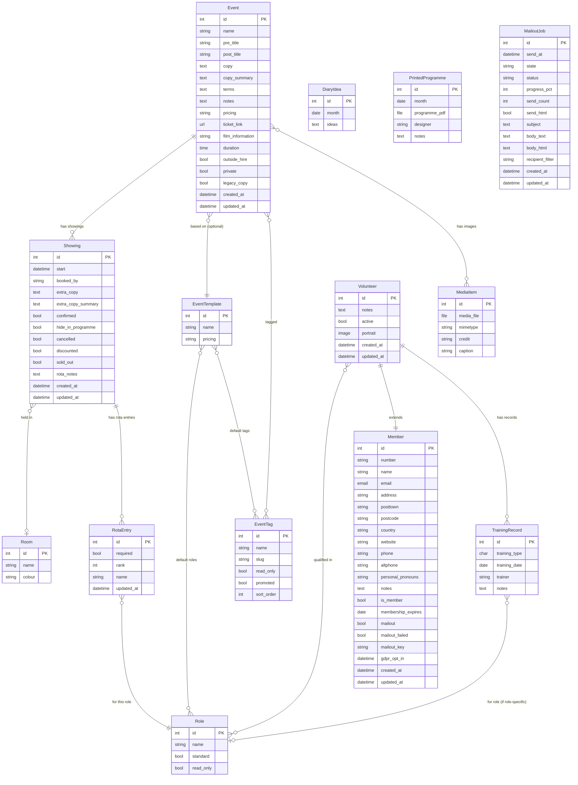
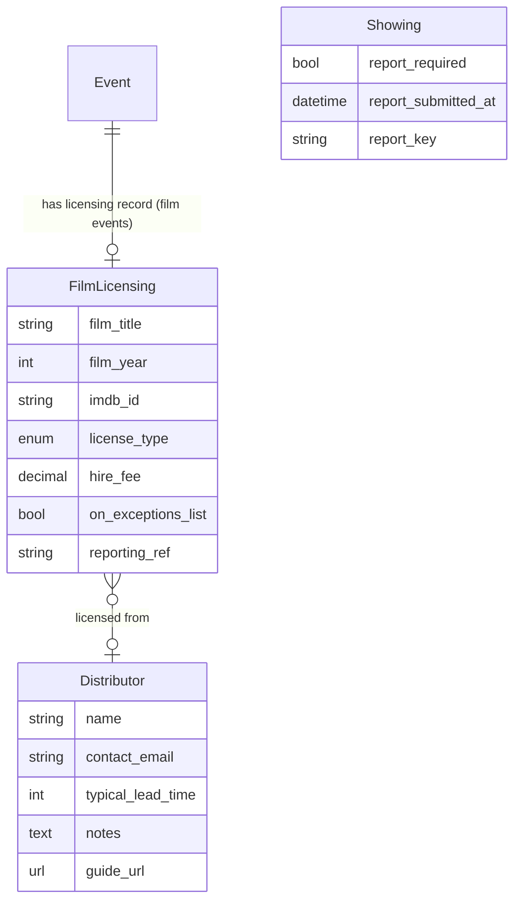
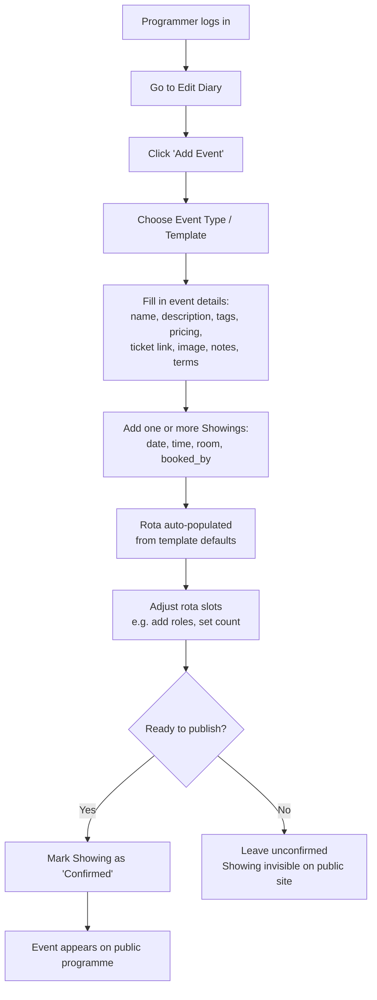
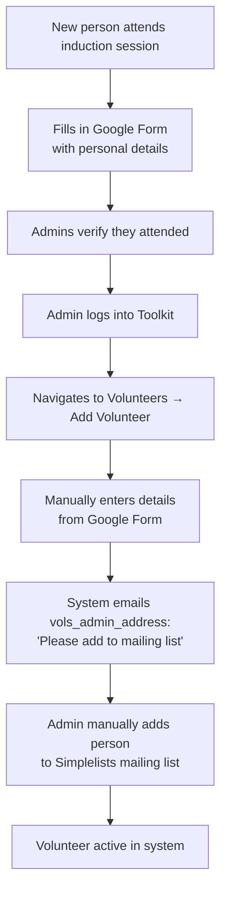
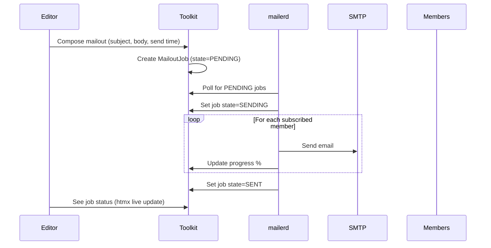
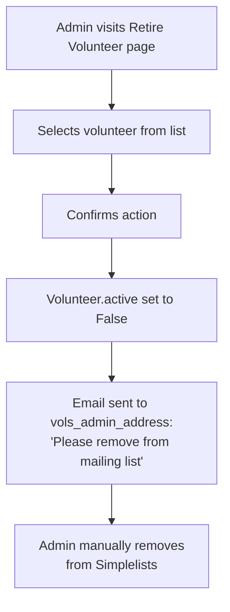
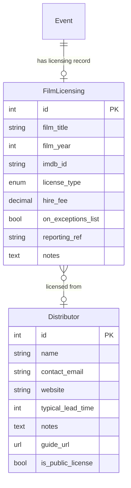
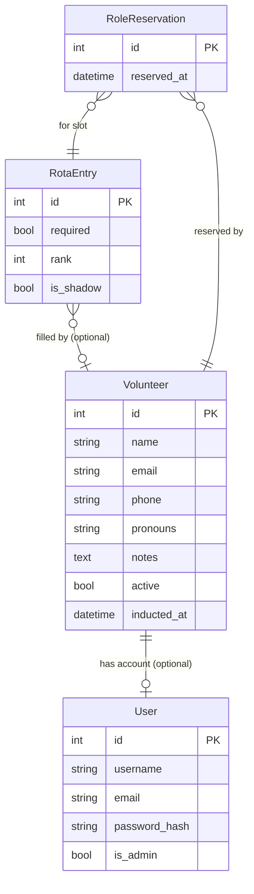

# Star and Shadow Cinema — System Specification

**Audience:** This document is for a developer (experienced or volunteer) who wants
to understand what the current system does, and/or rewrite it from scratch in any
language or framework. It is written to be implementation-agnostic.

**Context:** The Star and Shadow Cinema (Newcastle upon Tyne) is a volunteer-run
organisation with an anarchist ethos. The system described here manages events, volunteers, and
communications. Core values are: empowerment of volunteers, accessibility for
non-technical contributors, and transparency. The ideal system is one that
enthusiastic volunteers can maintain and extend themselves, without depending on
a single external developer.

**A note on this document:** this spec was produced with the assistance of AI
tools (Claude Code by Anthropic). See the principles section below for the
community's stance on AI in development.

---

## Principles and values

> Star & Shadow Cinema is a completely volunteer-run DIY venue based in
> Newcastle upon Tyne in the North East of England.
>
> We are an arts, music, cinema and community space set up as a cooperative
> that anyone can join.
>
> No-one is paid to run the Star & Shadow. There are no bosses or managers,
> just working groups, collective meetings, consensus decision making and a
> heavy dose of honest disorganisation. The building is run and programmed by
> its members and volunteers.
>
> Our programming is completely open. Anyone willing to volunteer can put on
> a film screening, gig, meeting, talk or party, as long as they are willing
> to help run the place and get involved.

These principles have direct implications for how the toolkit should be
designed and maintained.

**No bosses or managers.** The system should not reproduce hierarchy in its
UX. Features that make one person's voice louder than another's — or that
require a gatekeeper to approve routine actions — should be avoided or made
optional. Where coordination roles exist (Panopticon, Programmer), they
should be understood as responsibilities, not authority.

**Consensus and collective decision-making.** The toolkit should facilitate
coordination, not impose process. The programming pipeline (9.2), for
example, should support how Monday meetings actually work — not enforce a
rigid approval hierarchy that the collective hasn't agreed to.

At the same time, processes that the collective *has* agreed to sometimes
need to be encoded in the system to have any teeth at all. A space that is
genuinely open to anyone is also, by the same token, open to bad actors. For
the most part S&S does a good job of self-governing — but a collectively
agreed safeguard that exists only as a social norm, with no technical
enforcement, is vulnerable to whoever is least willing to honour it. The
toolkit is sometimes the only hard mechanism standing between a collectively
agreed process and someone circumventing it.

The design principle is therefore not "never enforce anything" but
**"only enforce what the collective has agreed to enforce."** Where a
restriction exists in the system, it should be possible to point to the
collective decision behind it. Where no such decision exists, the system
should nudge rather than block.

**Honest disorganisation.** The system must be tolerant of incomplete data,
half-finished entries, and tasks left undone. Strict validation that blocks
progress will be worked around or ignored. Soft warnings beat hard blocks.

**Anyone can get involved.** Low barrier to entry is not just a UX nicety —
it is a core value. The rota, the programme, and the volunteer onboarding
process should all be accessible to someone who has never used the system
before and has no technical background.

**The toolkit as community space.** The toolkit is not just a management
tool — it is a shared space that the community contributes to and inhabits.
In some ways it is a direct descendant of the paper sign-up sheet that
preceded it: a place where people show up, put their name down, and find out
what's happening. That lineage matters. The lo-fi, low-demand quality of the
current system is not a limitation to be overcome — for some members it is
actively valued, as a counterpoint to the polished apps and notification-
heavy platforms that dominate the rest of their lives and demand their
attention on someone else's terms.

People spend significant time on the rota not because the system nudges them
to, but because they care. That voluntary engagement is precious and should
not be undermined by features that make the toolkit feel like a productivity
system or a managed service.

There are 1,500 registered volunteers and typically around 100 active at any
one time. Disagreements happen. Tensions arise. The fact that the place
functions as well as it does — without bosses, without HR, and with formal
dispute resolution mechanisms that have real limits on how quickly and
strictly they can be applied — is an ongoing collective achievement. The
toolkit should support the human processes that make this possible, not try
to automate over them.

For many volunteers, the Star and Shadow is one of the only spaces where they
feel able to be their full selves, separated from the disempowering systems
and hierarchies of daily life. The toolkit exists in service of that space.
Any feature that affects how people encounter each other — notifications,
social signals, automated messages, visibility of who has or hasn't done
something — should be designed with the community's social fabric in mind,
and introduced with care.

Design implications:
- Notifications and automated reminders should be opt-in and unobtrusive,
  not the default mode of operation
- Avoid features that create pressure, social comparison, or visibility of
  absence (e.g. "X hasn't signed up yet") without the community having
  explicitly asked for them
- The rota is a social space as much as an operational one — changes to it
  affect how people encounter each other
- When in doubt, do less and leave room for human judgement

**Social capital and intentional friction.** The Star and Shadow runs on
something that looks from the outside like disorganisation but is, on closer
inspection, a maintained social economy. Time is the primary currency.
Relationships are the medium of exchange. The mutual obligation to help people
who have helped you — sometimes described informally as "backscratching" — is a
real governance mechanism, not a failure of formal process.

Some of the friction in the current system is not a bug. The fact that a new
programmer must personally approach keyholders, and earn their willingness to
vouch for a showing, is a form of community vetting that the current system
performs accidentally (see 8.12). Any feature that lowers this friction should
be designed with care: the friction may be doing useful work.

The same applies to collectives. Groups self-assemble around a shared interest
and develop their own internal cultures. The fact that their membership is not
always visible to the outside world is sometimes by design. The toolkit should
not force collectives into the open without a collective decision to do so.

**Volunteer maintainability above all.** A system that requires an external
developer to make routine changes has failed. Prefer simple, well-documented
code over sophisticated abstractions. Prefer boring technology over clever
technology. The ideal is a codebase that an enthusiastic volunteer with some
Python experience can confidently read, run, and modify.

### On the use of AI tools in development

Some members of the community may have ethical objections to the use of AI
tools in developing or maintaining the toolkit. These objections are
legitimate and worth taking seriously — they may relate to the environmental
cost of AI inference, concerns about training data and intellectual property,
the displacement of paid technical labour, or the concentration of AI
capability in large corporations whose values may not align with the
collective's.

There are also genuine arguments in favour of AI-assisted development in this
context, and they deserve equal weight.

**Accessibility.** The principle that anyone willing to volunteer should be
able to get involved extends to the codebase itself. AI coding tools
meaningfully lower the barrier to contributing for people who have enthusiasm
and ideas but lack formal software training, or who work in adjacent fields
and would find the learning curve too steep to donate their time otherwise.
A volunteer who can describe what they want in plain language and iterate on
the result with AI assistance can make real contributions that would otherwise
be impossible for them. Rejecting AI tools uncritically can reproduce the
same gatekeeping the collective tries to dismantle elsewhere.

**Pragmatism.** Professional software development is expensive. Skilled
developers who could build this system commercially are rare in a volunteer
pool, and those who do volunteer are giving time that is genuinely costly to
them. The realistic alternative to AI-assisted development is often not
"someone skilled does it without AI" — it is "it doesn't get done." If AI
assistance is what makes a feature possible at all, that is worth weighing
honestly against the ethical concerns.

This is not an argument to dismiss those concerns — it is an argument that
the collective should make the decision with both sides of it visible, rather
than defaulting to rejection out of principle without considering the
practical cost of the alternative.

This document was produced with AI assistance. Any code or documentation
contributed using AI tools should be disclosed in commit messages, so that
the community can make an informed collective decision about whether and how
AI-assisted contributions are accepted.

The toolkit itself should not depend on AI or machine-learning capabilities
to function. Any AI-assisted tooling sits in the development process, not
in the running system.

### Relationship with the Cube Microplex

The toolkit codebase was originally written for, and continues to be
maintained by, the **Cube Microplex** in Bristol. The Star and Shadow runs a
fork of the same codebase. This relationship is worth taking seriously in
both directions.

**Being good neighbours.** Both organisations are volunteer-run arts cinemas
with anarchist and co-operative values. Any improvements the Star and Shadow
makes to the shared codebase could benefit the Cube — particularly generic
improvements (performance, accessibility, GDPR tooling) that aren't
S&S-specific. The right posture is: when we fix something that is clearly a
bug or a general improvement, open a pull request upstream. Don't assume the
Cube wants or needs our feature set — but do offer the ones that would
translate cleanly without imposing cognitive overhead on their team.

**Not assuming our way is better.** The Cube operates quite differently: it
uses Celery and Redis for background tasks; it has a different membership
structure, different venue configuration, and different volunteer workflows.
The fact that we've built something one way doesn't mean that's the right
way for them. Features developed here should be configurable (behind settings
flags) rather than hardcoded, so both sites can adopt or ignore them
independently.

**Technical caution.** The Cube's production deployment uses the `master`
branch directly. Any changes merged there affect their live site. The Star
and Shadow should develop on its own branch (`sns_2026_overhaul` or
equivalent) and offer carefully reviewed changes upstream — not push
directly to master with S&S-specific assumptions baked in.

### The value of volunteer time already invested

This codebase represents roughly **15 years of volunteer and subsidised
development** — from the first commit in July 2011 to the present day.

A few numbers from the git history:

| Metric | Value |
|---|---|
| Total commits (all branches) | 1,877 |
| Years of active development | 2011 – present (most active: 2012, 2014, 2017) |
| Primary contributor | REDACTED (~1,434 commits) |
| Second contributor | REDACTED (~234 commits) |
| Lines of Python code | ~21,000 |
| Lines of HTML templates | ~5,300 |

At a UK freelance developer rate of **£400/day (~£50/hour)**, and estimating
conservatively that the codebase represents around **1,500–3,000 hours** of
skilled development time:

> **£75,000 – £150,000 of development work has been donated or subsidised
> into this system.**

This is not an abstract number. It represents many evenings and weekends
from developers who gave their time because they believed in what the Cube
and S&S are doing. When volunteers contribute code or documentation, they
are continuing a tradition of genuine generosity that deserves to be named.

For the same reason, the cost estimates throughout section 13 are given in
commercial freelance rates, not as a budget — but as an honest acknowledgement
of what volunteers are giving when they contribute technical work. A volunteer
who implements the break-even calculator (estimated 2–4h) is donating
£100–£200 of skilled labour, not just "a few hours on a weekend".

---

## Table of Contents

1. [What the system does](#1-what-the-system-does)
2. [Data model](#2-data-model)
3. [Key workflows](#3-key-workflows)
4. [External integrations](#4-external-integrations)
5. [Permission model](#5-permission-model)
6. [Business rules and invariants](#6-business-rules-and-invariants)
7. [URL / endpoint map](#7-url--endpoint-map)
8. [Current limitations and known gaps](#8-current-limitations-and-known-gaps)
9. [Proposed new features](#9-proposed-new-features)
10. [Technology notes for a rewrite](#10-technology-notes-for-a-rewrite)
11. [Integration with adjacent infrastructure](#11-integration-with-adjacent-infrastructure)
12. [Migrating to a new system](#12-migrating-to-a-new-system)
13. [The toolkit versus an off-the-shelf platform](#13-the-toolkit-versus-an-off-the-shelf-platform)
14. [Development strategy: rewrite or continue?](#14-development-strategy-rewrite-or-continue)
15. [Development roadmap](#15-development-roadmap)

---

## 1. What the system does

The system (internally called "the Toolkit") has six distinct areas of
functionality:

### 1.1 Public programme listing

A public-facing website showing upcoming events. Visitors can:
- Browse events by date, week, month, year, or tag (category)
- Read full event descriptions and see images
- Follow an RSS feed of upcoming events
- Search an archive of past events
- View a direct link to an individual event or showing
- Access static content pages (About, Contact, etc.) managed via a CMS

### 1.2 Event and diary management (internal)

Logged-in users can:
- Create and edit events (title, description, pricing, tags, images, terms)
- Schedule one or more showings (date/time/room) per event
- Manage event templates (reusable defaults for recurring event types)
- Manage tags and roles
- View and edit a calendar of events
- Upload PDFs of printed programmes to an archive
- Write monthly free-text "ideas" notes
- Confirm or cancel showings; hide showings from the public programme

### 1.3 Volunteer rota (internal)

- Each showing has a rota: a list of role slots (e.g. "Bar Staff", "Projectionist")
- Each slot can be filled with a volunteer's name (currently stored as free text)
- A rota view shows all showings in a time range with their role slots
- A "vacancies" view highlights unfilled slots
- Roles can be marked as "standard" (shown on the main rota list) or non-standard

### 1.4 Member and volunteer database (internal)

- **Members**: the underlying record for anyone in the system (subscribers,
  volunteers). Stores name, email, address, phone, pronouns, notes, GDPR consent
  date. At Star and Shadow, the formal "membership" distinction is not used —
  everyone is treated as a volunteer, not a paying member.
- **Volunteers**: the active layer on top of a Member record. Stores portrait
  photo, active/retired status, notes, and a list of roles the volunteer is
  qualified for.
- **Training records**: the data model includes structured training logs (who
  was trained for which role, when, by whom). In practice at Star and Shadow
  these are not actively maintained — the system is too rigid to keep up to date,
  and role access is not currently gated by training status. Anyone can sign up
  for any role.
- Add/edit/retire/unretire volunteers, with automatic notification emails to admins
- CSV export of volunteer list
- Reports: volunteer list, role-by-volunteer report, training records report

### 1.5 Email mailouts (internal)

- Compose an email (plain text and/or HTML) to be sent to all subscribed members
- Schedule it for a future time
- A background daemon picks up scheduled jobs and sends them
- Job queue with real-time progress (htmx polling)
- Cancel a pending or in-progress job
- Members have a unique unsubscribe token for one-click unsubscribe links in emails

**Note (Star and Shadow):** at S&S the toolkit mailout system is **not
currently deployed or used** — neither for general communications nor for any
other purpose. All volunteer and member communications go through Simplelists
mailing lists, managed outside the toolkit. The toolkit's email code (the
`mailerd` daemon, the job queue, the compose view) is present in the codebase
and functional, but the `DJANGO_SETTINGS_MODULE` for the S&S instance does
not configure an outbound SMTP server for bulk sends, and the mailout UI is
not linked from the internal dashboard. The only email the S&S instance sends
is transactional (account creation, password reset). See section 3.3 for the
workflow diagram — it describes how the system *can* work, not how S&S uses
it today. If S&S were to adopt the toolkit mailout system, a review of the
Simplelists migration implications (section 9.6) would be needed first.

### 1.6 CMS content pages (internal)

- Wagtail-powered CMS for "About", "Contact", and other static pages
- Managed by editors via a web admin interface
- Pages can be linked from the public programme listing

---

## 2. Data model

### 2.1 Entity-relationship diagram



**Proposed additions** (sections 9.14 and 9.15):



### 2.2 Model descriptions

#### Event
The core unit. An event is something that happens at the venue — a film screening,
a gig, a meeting, a workshop. An event can happen on multiple dates (each date is
a `Showing`).

Key fields:
- `name`, `pre_title`, `post_title` — compose the full display title
  (e.g. "Prodco presents [name] with support from [post_title]")
- `copy` — full description (HTML). Legacy events have a `legacy_copy` flag and
  are pre-processed to fix wrapping/links.
- `copy_summary` — shorter version for listings (max 450 chars)
- `terms` — booking/hire terms (template text provided by the system)
- `notes` — programmer's internal notes (not public)
- `pricing` — free text (e.g. "£5/£3 concs")
- `ticket_link` — URL to external ticketing (TicketSource)
- `template` — an optional `EventTemplate` that seeds default roles, tags, pricing
- Events **cannot be deleted** (enforced at model level). They can be cancelled
  at the `Showing` level.

#### Showing
A specific scheduled date/time of an Event. One event can have many showings.

Key fields:
- `start` — datetime; must be in the future at time of creation/edit
- `room` — which room (only relevant when `MULTIROOM_ENABLED = True`). A
  showing has at most one room, which is a significant limitation: events that
  require multiple rooms at different times (e.g. tech setup in the booth from
  6pm, main cinema from 7pm) cannot be correctly modelled. See 8.11.
- `confirmed` — only confirmed showings appear in the public programme
- `hide_in_programme` — confirmed but hidden (e.g. private events)
- `cancelled` / `discounted` / `sold_out` — status flags
- `rota_notes` — free-text notes visible on the internal rota
- Showings **cannot be edited or deleted once they are in the past**

#### Role
A volunteer job type — e.g. "Bar Staff", "Projectionist", "Keyholder".

- `standard = True` means it appears in the main rota role list
- `read_only = True` means it cannot be edited or deleted via the UI
- Roles that are `standard` drive the default rota slot display

#### RotaEntry
A slot in a showing's rota — the join between a Showing and a Role.

- `rank` — if a showing needs two bar staff, there are two `RotaEntry` records for
  the Bar Staff role with `rank=1` and `rank=2`
- `name` — **stored as free text**, not a foreign key to `Volunteer`. This is a
  significant limitation: there is no automated way to see a volunteer's full rota
  history or contact them about a booking.
- `required` — whether the slot must be filled

#### Member
The base record for any person in the system — used as the technical foundation
for volunteer records, and for mailing list subscribers.

- `number` — user-visible membership number (defaults to the database primary key)
- `mailout` — whether they receive email newsletters
- `mailout_failed` — set to `True` if a previous mailout bounced; excluded from future sends
- `mailout_key` — random token for unsubscribe links (without needing login)
- `gdpr_opt_in` — timestamp of when they consented
- `membership_expires` — only used when `MEMBERSHIP_EXPIRY_ENABLED = True`.
  **At Star and Shadow, formal paid membership is not in use.** The concept
  exists in the code but is not surfaced to users.
- Adding new members via the UI is **IP-restricted** (only from within the
  venue's network). This guard was intended for sign-up desks.

#### Volunteer
A member who volunteers. Extends (OneToOne) `Member`.

- `active` / retired status
- `roles` — M2M to `Role`: what roles this volunteer is qualified for
- `portrait` — headshot photo
- When a new volunteer is added, an email is sent to `vols_admin_address` asking
  admins to add them to the volunteers mailing list (which runs externally via
  Simplelists)
- When a volunteer is retired, a similar email is sent

#### TrainingRecord
A log entry recording that a volunteer was trained.

- `training_type`: `GENERAL` (general safety induction) or `ROLE` (specific role)
- `role`: only set for role-specific training records
- `training_date`, `trainer`, `notes`
- Records expire after `DEFAULT_TRAINING_EXPIRY_MONTHS` (default: 12 months)
- Adding a role-specific training record automatically adds that role to the
  volunteer's `roles` M2M set

**Note:** At Star and Shadow these records are not actively maintained. The
system is too rigid (expiry, mandatory trainer field, manual entry per person)
for the way training actually works in practice. Anyone is currently permitted
to sign up for any role regardless of training status. A future design should
treat training as lightweight and opt-in rather than a gate.

#### MailoutJob
A queued email send. Uses a state machine:

```
PENDING ──► SENDING ──► SENT
        │         └──► CANCELLING ──► CANCELLED
        │                        └──► FAILED
        └──► CANCELLED (if cancelled before sending starts)
```

- The `mailerd` background daemon polls for PENDING jobs and processes them
- HTML mailouts send both text and HTML parts (multipart email)
- `recipient_filter` can restrict sends to a subset of members

#### EventTemplate
A reusable blueprint for recurring event types. When a new event is created from
a template, it inherits default roles (for the rota) and default tags. The
programmer can then override these.

#### EventTag
Category labels for events — e.g. "film", "music", "workshop", "meeting".

- Tags with `promoted = True` appear in the public navigation
- `read_only` tags cannot be deleted
- Some tags (`TAGS_WITHOUT_TERMS`) exempt events from needing contract terms filled in

#### Room
A bookable space in the venue. Currently stores only `name` and `colour`
(used to distinguish showings on the calendar). The data model should be
extended to support the distinction between primary and secondary spaces,
access information, and capacity — see the venue reference below.

Suggested additional fields:
- `prominent` — boolean, whether this room appears prominently in booking UIs
  (equivalent to `EventTag.promoted`)
- `capacity` — optional integer
- `access_notes` — optional short text (e.g. "key fob — red doors",
  "keycode door", "public access")
- `publicly_accessible` — boolean, whether members of the public can access
  this space unescorted during events

**The bar** is a special case: it is physically part of the Venue but should
be treated as a separately bookable resource. Shared use is common (e.g. a
gig in the Venue and a film in the Cinema running simultaneously, with the
bar open to both). The room booking system (see 9.7) should support this
explicitly.

##### Star and Shadow — venue rooms reference

**Primary spaces** (shown prominently in booking UI):

| Room | Notes |
|---|---|
| **Venue** | Main area for gigs. Contains the bar. Bare-bones: stage can be put up or down, soundproofed walls. Suitable for large meetings, performances, all-purpose use. |
| **Cafe** | Main entrance area. Counter with tills and kitchen behind. Tickets sold here; takes cash and card. Can be used for small events and gatherings. |
| **Cinema** | Main cinema. Capacity ~100. |
| **Meeting room** | Bulky tables, A/V capabilities. Used for meetings. Also functions as an art room for Sunday cafes. |

**Secondary spaces** (bookable but less prominent in UI — people don't
typically think of these as event spaces):

| Room | Notes |
|---|---|
| **Kitchen** | Commercial oven, several induction hobs. Can comfortably serve ~100. Used regularly for Cafe events and Community Kitchen events. Food hygiene certification required — Level 1 for most roles, Level 2 for direct food handling (see rule 13). |
| **Garden** | Outdoor space. |
| **Green room** | For bands; can be used for meetings and craft groups. Limited facilities, takes time to warm up. Occasionally used as a dumping ground. |
| **Dark room** | Photographic dark room, recently re-opened. |
| **Screen printing / lithograph room** | Drop-in use for projects including the printed programme. Behind key fob locked red doors; not publicly accessible. |
| **Canny Little Library** | Books, zines and pamphlets with a critical/radical focus, not available in mainstream libraries or bookshops. |
| **Workshop** | Bench saw, tools, lumber storage, limited loft storage access. Behind key fob locked red doors; not publicly accessible. |
| **Cinema booth** | PC, DCP ingestion system, digital and 35mm projectors, 35mm splicing table. Keycode doors. |
| **Box office area** | On the right as you enter. Tills no longer here (now cafe/bar only). Used as a front desk for multi-event nights or external hires taking ticket sales. |
| **Loft space** | Includes access via corridors with ladders. **Safety note:** dangerous when the public are present. |
| **Tech storage cupboard** | Off the main Venue. Keycode doors. |
| **Bar** | Physically part of the Venue but bookable as a separate resource. Can be shared between concurrent events (e.g. a gig and a film running simultaneously). |

---

## 3. Key workflows

### 3.1 Creating an event and scheduling showings



### 3.2 Volunteer induction (current process)



**Current pain points:** entirely manual, no link between the Google Form and the
Toolkit, no automated account creation, admins must remember to act on emails.

### 3.3 Sending a mailout (Cube Microplex only; not used at S&S)



### 3.4 Volunteer retirement



### 3.5 Film programming workflow (Star and Shadow)

The *Film and Television Programming Guide* (NextCloud, last updated January 2025) documents the end-to-end process for proposing and running a film or TV screening. Key information extracted for specification purposes:

#### Seasons

Programming runs in four seasons:

- **Spring**: March – May
- **Summer**: June – July
- **Autumn**: September – November
- **Winter**: December – February

Thursdays and Sundays from 19:30 are reserved for film and television screenings. Other times are possible but require approval from the main Programming Group.

#### Finding a distributor

Filmbank is the first port of call — cheaper and simpler than other distributors and covers a broad catalogue. Failing that, the [Independent Cinema Office](https://www.independentcinema.org) website holds a full list of UK distributors. Commonly used distributors include Filmbank, Park Circus, BFI, Janus, Curzon, Arrow Films, Second Run, Altitude, Contemporary Films, Cineuropa, Bulldog, Cult Films, Dogwoof, Eureka, Film4, ICA, Lux, Modern Films, and Vertigo. If the distributor cannot be found, the Film Programming Group can help.

#### Suggesting a screening

Proposals are submitted via the Film Programming Suggestions form by a per-season deadline. Each proposal requires a **25-word summary or pitch** — this wording is used unchanged for the print programme and submitted to *The Crack* and *NARC* magazines. Changes to the summary after submission must be requested from the Social Media Team at least two weeks before the end of the month. See section 9.16 for the proposed live word counter UI feature.

#### Film Programming Group meetings (two per season)

**First meeting:** Proposals are presented and discussed. Distributor contacts then contact distribution companies to confirm availability (usually within 24 hours — Filmbank licences do not need confirmation). One person is elected to handle requests for the main Programming Group.

**Second meeting:** Provisional schedule reviewed. Alternatives discussed where licences are unavailable. Last-minute additions considered.

#### Booking a licence

- **Filmbank:** Self-service via the S&S Filmbank account. The programmer books directly: New booking → Indoor → yes to ticket price → provide title, date, number of showings. Must be completed before the third and final Film Programming Group meeting (usually 2–3 weeks after the second meeting).
- **Other distributors:** The distributor contacts handle booking on behalf of the programmer and confirm when complete.

Some distributors supply a screener (35mm reel, DVD, or DCP file). If no screener preference, buying a DVD/Blu-ray and emailing the receipt for a refund is usually faster and cheaper. Screener delivery is the programmer's responsibility to arrange; **returning the screener is also the programmer's responsibility** — vital for maintaining distributor relationships; use the same courier service as the delivery.

#### Adding the event to Toolkit

Programmer rights are required in Toolkit (granted by an admin, usually requested at a Film Programming Group meeting). Key fields to complete:

| Field | Notes |
|---|---|
| Room | Cinema |
| Start | Usually 19:30 on the screening date |
| Event name | Film or TV show title |
| Event template | Choose closest format to the screener |
| Pricing | Typically £7/£5/£3/£0 (Full / Concessions / Further concessions / Free) |
| Ticket link | Add after TicketSource setup (below) — can return to diary entry at any time |
| Film information | Dir. (Director), Year, Country, Runtime (mins), BBFC rating |
| Programmer's notes | Private notes, only visible to volunteers |
| Copy | Public-facing event description |
| Terms | Distributor name and licence fee |
| Image | Distributors provide licensed images; Filmbank account gives access to film poster scans. Avoid Google Images — copyright risk. |

Once the TicketSource link is added, mark the showing as **Confirmed** to make it live.

#### Setting up TicketSource

1. Create a new event using the same details as Toolkit.
2. **Add venue**: search "Star and Shadow" — choose the first result (autocompletes address).
3. **Add date**: set date and time. No doors or end time needed. Set "Stop ticket sales" to **1 hour before start time**.
4. **Add ticket allocation**: choose "Tickets are allocated on a seating plan" → select **"2025 Seating Plan"** → uncheck "Enable orphan seat rule on internet bookings".
5. **Add pricing categories**: Full price, Concessions, Further concessions, Gratis/Free. For the Free tier, enable "Individual ticket" and set maximum selection to 1.
6. **Activate** the event → **Publicise** → copy the Ticket shop URL into the Toolkit diary entry. A QR code is also available for print promotion.

Ticket sales close 1 hour before the showing start. Print the TicketSource sales sheet and ensure the Box Office volunteer has it along with the seating plan.

#### On the day

- **Programmer** arrives second after the Keyholder, at least 1 hour before start.
- **Projectionist** sets up the screener; Programmer ensures the Projectionist has it.
- Projectionist checks with Programmer about sound and aspect ratio.
- The Programmer may give a short introduction (not mandatory), ideally including a brief plug for upcoming events.
- Programmer helps the Keyholder close up afterwards.
- Programmer should **not** sign up for additional rota roles — their job is to coordinate.

#### Promoting

- The 25-word summary is sent to *The Crack* and *NARC* magazines by the Social Media Team.
- The Social Media Team manages Facebook, Instagram, BlueSky, Threads, and X. Facebook events are the primary engagement channel.
- A weekly round-up covering the next seven days is posted on all channels.
- Programmers can request additional posts (subject to availability in the content schedule) or use personal networks.

---

## 4. External integrations

| System | How it connects | Notes |
|---|---|---|
| **TicketSource** | Outbound link only — `ticket_link` URL on an Event. API exists but not integrated. | The `ticket_link` field is a plain URL. TicketSource does expose a REST API (`api.ticketsource.io`) that supports reading events (title, description, dates, venues), customers, and bookings. The API key is available in the TicketSource account settings. Potential near-term use: pull booking counts into post-screening film rights reminder emails (section 9.14) — gives programmers the headline ticket number without requiring them to log in to TicketSource before submitting their report. Longer-term: sync event descriptions from toolkit to TicketSource to save programmers copy-pasting. Write access to event descriptions via the API has not been confirmed — the API may be read-only for event data. |
| **Simplelists** | Manual human process — emails to `vols_admin_address` prompt admins to add/remove from lists | No API integration. At S&S, Simplelists is the primary channel for all volunteer and member communications; the toolkit mailout system is not used for this purpose. |
| **Google Workspace** | Email hosting for `@starandshadow.org.uk` accounts | No integration with the toolkit. All venue email accounts live here. |
| **Google Forms** | Volunteer induction form is external; details entered manually into Toolkit | No integration |
| **SMTP server** | Outbound email from `mailerd` daemon and from notification emails | Configured via `EMAIL_HOST` / `EMAIL_PORT`. Not currently active for the S&S instance. |
| **Wagtail CMS** | Embedded within the application | Not a separate service |
| **YouTube** | Outbound links only — tutorial videos hosted on the venue's YouTube channel | Previously self-hosted; moved to YouTube for reliability and features (chapter tagging is particularly useful for navigating longer tutorials). Used for volunteer training content: how to use TicketSource, how to create an event in the Toolkit, etc. No API integration. |
| **EPOSnow** | None | Point-of-sale system used for bar and box office tills. Records bar, cafe, and door ticket sales (outside TicketSource). Gift vouchers are also tracked here (see rota notes for booking-level references). Currently a data silo — no integration with the toolkit. Relevant future consideration: pulling event-level sales data (bar + door + TicketSource) to calculate actual revenue vs. projected break-even. Film rights agreements often require ticket count reporting; EPOSnow would be part of any consolidated financial report. Integration would require EPOSnow's API (EPOSnow does expose a REST API for authorised accounts). Not a near-term priority. |
| **Facebook** | None (manual copy from toolkit) | The Social Media Team manages the S&S Facebook page and creates Facebook Events for public screenings and events. Facebook Events are the primary public engagement channel — they generate the most shares and RSVPs. No API integration; promoters copy-paste the event title, date, time, and a description from the toolkit. **Text format:** plain text; markdown and HTML are not supported. Hashtags work but are less prominent than on Instagram. **Image dimensions:** Facebook recommends 1920×1005 px (approximately 16:9) for event cover photos; 1200×628 px also widely used. Images with more than 20% text may be deprioritised. The toolkit's current event edit form does not produce a Facebook-ready text snippet — a near-term improvement would be a one-click "copy for Facebook" button that formats the event name, date(s), and short copy into a plain-text paste buffer. |
| **Instagram** | None (manual copy from toolkit) | Managed by the Social Media Team. Instagram is the primary visual channel; posts promote upcoming events with an image and a caption. **Image dimensions:** square (1080×1080 px, 1:1) preferred for feed posts; portrait (1080×1350 px, 4:5) maximises screen space; landscape (1080×566 px, 1.91:1) also supported. Stories/Reels use 1080×1920 px (9:16). The seed image generator in `seed_dev_data` currently produces 800×450 px (roughly 16:9) images — not ideal for Instagram. Production event images uploaded to the toolkit are not necessarily cropped to Instagram dimensions and may need manual re-cropping before posting. **Text format:** captions support plain text with hashtags; clickable links are not supported in post captions (only in the profile bio — "link in bio"). Near-term toolkit improvement: a formatted caption snippet (event name, date, 25-word summary, relevant hashtags) ready to copy-paste. |
| **WhatsApp Communities** | None (informal) | Not officially documented, but WhatsApp groups and communities are increasingly the primary communication channel for many collectives — Film Programming, Community Kitchen, and others. Often more active than the equivalent mailing list. WhatsApp group invites are sometimes listed in rota notes. This is not officially acknowledged in the toolkit but its importance to the organisation's day-to-day communication should not be underestimated. See section 9 for considerations about push notification alternatives. |
| **TicketSource (seating plan)** | None | TicketSource holds the venue's seating plan, including the layout used for sold events and the COVID-era socially-distanced version. Changing the seating plan requires a TicketSource admin action. Currently there is no integration and no plans to bring seat booking in-house — this would be a very large undertaking and is not recommended. Worth noting as a dependency if TicketSource were ever replaced. |
| **OMDb (Open Movie Database)** | Proposed — outbound API for film metadata lookup | Free REST API at `omdbapi.com`. Returns film title, year, director, runtime, certificate, and IMDb ID by title search or IMDb ID. Used to auto-populate `FilmLicensing` records at event creation (section 9.15). Requires a free registration key (`OMDB_API_KEY` in settings). Treat as a convenience — results are stored locally; do not call the API on every page load. Fails gracefully if the key is not configured or the API is unavailable. |
| **IMDb** | Reference only — IMDb IDs stored as identifiers | `FilmLicensing.imdb_id` (tt-prefixed) used as the canonical external identifier for a film. No API integration with IMDb itself; the ID is obtained via OMDb and stored. Provides an unambiguous reference for the periodic screening report and for linking to film information externally. |

---

## 5. Permission model

The system has three permission levels:

| Role | Django permission | What it allows |
|---|---|---|
| **Volunteer** | `toolkit.read` | View internal pages: rota, diary, volunteer list, reports. Cannot create or edit events, access member data, or use the CMS. |
| **Programmer** | `toolkit.read` + `toolkit.programmer` | Everything a volunteer can do, plus: create and edit events and showings, manage tags and roles, manage event templates, write rota entries. Cannot access sensitive volunteer/member data or the CMS. |
| **Panopticon** | `toolkit.read` + `toolkit.write` | Full access: everything a programmer can do, plus: website edits via the Wagtail CMS, access to sensitive volunteer and member data (names, emails, addresses, notes), adding and retiring volunteers, sending mailouts. Intended for a small group of trusted coordinators. |

Authentication is via Django's built-in session-based auth (username + password).
There is no public registration.

The `CUBE_IP_ADDRESSES` setting defines a list of IP addresses that bypass the
login requirement for the "add new member" page (intended for use at the venue's
front desk). This should be replaced with a proper role-based check — see
[8. Current limitations](#8-current-limitations-and-known-gaps).

Volunteers with the `Programmer` role in the rota system are automatically added
to the `Programmers` Django group, which grants the `toolkit.programmer` permission.
Panopticon permissions are assigned manually by an admin.

---

## 6. Business rules and invariants

These are rules enforced by the current system. A rewrite should preserve them.

1. **Events cannot be deleted.** Once created, an event record persists forever.
   Showings can be cancelled, and events can be hidden, but the event record
   remains. (This is a data integrity and audit trail decision.)

2. **Past showings cannot be edited or deleted.** A showing with a start time in
   the past is locked. (Applies at the application layer; not a database constraint.)

3. **Read-only Roles and EventTags cannot be modified or deleted.** Certain system
   roles (e.g. "Keyholder") are marked read-only. They can only have their
   `promoted`/`sort_order` fields changed.

4. **Rota volunteer names are free text.** The `RotaEntry.name` field is a plain
   string, not a foreign key. Volunteers sign up (or are signed up) by name, but
   the system has no way to verify the name or link it back to a volunteer record.

5. **Volunteer training auto-adds roles.** When a role-specific training record is
   added for a volunteer, the system automatically adds that role to the volunteer's
   `roles` set. *In practice at Star and Shadow, training records are not maintained
   and this link is not relied upon.*

6. **Training records expire.** By default, a training record older than 12 months
   is considered expired (configurable via `DEFAULT_TRAINING_EXPIRY_MONTHS`).
   *In practice at Star and Shadow, expiry is not enforced and does not gate
   access to roles.*

7. **Membership numbers are based on database primary keys.** A member's
   user-facing number is set to their database `id` (with collision avoidance).
   *At Star and Shadow the membership number concept is not used in practice.*

8. **Showing start times must be in the future.** A showing cannot be scheduled
   in the past (validated at form submission).

9. **Events must have terms text before confirmation** (configurable, and exempted
   for meetings and training events via `TAGS_WITHOUT_TERMS`).

10. **Showings are only public when `confirmed=True`, `event.private=False`, and
    `hide_in_programme=False`.**

11. **New volunteer and retirement actions trigger admin notification emails.**
    The system emails `vols_admin_address` but does not directly manage the
    external mailing list.

12. **Mailout recipients:** a member receives mailouts only if `mailout=True`,
    `email` is non-empty, and `mailout_failed=False`.

13. **Role eligibility is real but varies by type.** Different roles have
    meaningfully different qualification requirements. These are not currently
    enforced by the system, but a rewrite should be designed with them in mind.
    The qualification types are:

    | Role | Gate type | Notes |
    |---|---|---|
    | **Projectionist** | Internal tiered training | At least 1 level, possibly 2–3. Progression through levels tracked internally. |
    | **Bar** | Induction — training + licensing | A specific bar induction is required before anyone can work behind the bar, for both training and legal/licensing reasons. |
    | **Food (Level 1)** | Induction — in-house café induction | Monthly café inductions cover kitchen layout, venue procedures, and food hygiene basics, and grant participants a Level 1 food hygiene certificate. Required for most café roles. |
    | **Food (Level 2)** | External certification | UK Food Hygiene Level 2 certificate, obtained externally. Required for roles involving direct handling of food. |
    | **Sound / tech** | Informal — self-selected | No hard rule. Volunteers generally shadow a number of times before taking a role independently. |
    | **Keyholder** | Nomination and acceptance | A position of trust. Requires nomination, acceptance by the collective, and broad venue competency (keyholders may need to support any other role if someone no-shows). Not gated by a single training event. |

    The current system uses a single `TrainingRecord` model for all of these,
    which fits none of them well — see 8.8.

14. **Programming eligibility is a collective norm, not a system gate.**
    The collectively agreed expectation is that a volunteer does approximately
    10 shifts (and at least 5 in the preceding 6 months) before programming
    their own event. This is documented in the programming etiquette guide
    but is not, and should not be, enforced by a hard system lock. Reasons:
    (a) rota names are free text — the system cannot reliably count a
    volunteer's past shifts until 8.1 is resolved; (b) enforcing a gate
    would be contrary to the non-hierarchical ethos; (c) the collective
    is the appropriate enforcement mechanism, not software.
    The right toolkit response is to surface this guidance prominently at
    the point of event creation (see section 9.2), not to block.

15. **Events with estimated costs above threshold require Finance Collective
    sign-off.** Events costing over £500 (£750 for music events) must be
    referred to the Finance Collective for authorisation before confirmation.
    This is a collectively agreed spending control. The system should flag
    this threshold in the programming pipeline view (see section 9.2), but
    the final authorisation is a human process, not a database lock.

---

## 7. URL / endpoint map

### Public (no login required)

| URL | Purpose |
|---|---|
| `/` | Current event listing (redirects to programme) |
| `/programme/` | Programme — upcoming events |
| `/programme/view/YYYY/MM/DD/` | Programme for a specific date |
| `/programme/view/this_week` | This week's events |
| `/programme/view/next_week` | Next week's events |
| `/programme/view/this_month` | This month's events |
| `/programme/view/TAGSLUG/` | Events filtered by tag |
| `/programme/showing/id/N/` | Single showing detail |
| `/programme/event/id/N/` | Single event detail |
| `/programme/archive/` | Archive index |
| `/programme/archive/YYYY/` | Archive for year |
| `/programme/archive/YYYY/MM/` | Archive for month |
| `/programme/archive/search/` | Archive search |
| `/programme/rss/` | RSS feed |
| `/pages/…` | Wagtail CMS content pages |
| `/members/N/unsubscribe/KEY/` | One-click unsubscribe (token-based) |

### Internal (login required)

| URL | Purpose |
|---|---|
| `/auth/login` | Login |
| `/auth/logout` | Logout (POST only) |
| `/toolkit/` | Internal dashboard |
| `/diary/edit/` | Event list for editing |
| `/diary/edit/calendar/` | Calendar view |
| `/diary/edit/event/id/N/` | Edit event |
| `/diary/edit/event/add` | Create new event |
| `/diary/edit/showing/id/N/` | Edit showing |
| `/diary/edit/showing/id/N/delete` | Delete showing |
| `/diary/rota/` | Rota view (current month) |
| `/diary/rota/YYYY/MM/` | Rota view (specific month) |
| `/diary/rota/vacancies` | Rota vacancies |
| `/diary/copy/` | Event copy view |
| `/diary/terms/` | Event terms view |
| `/diary/terms/csv/YYYY/MM/DD` | Event terms CSV export |
| `/diary/edit/roles/` | Manage roles |
| `/diary/edit/eventtemplates/` | Manage event templates |
| `/diary/edit/eventtags/` | Manage event tags |
| `/diary/edit/ideas/YYYY/MM/` | Edit monthly ideas text |
| `/diary/printedprogrammes` | Printed programme archive |
| `/diary/mailout/` | Compose mailout |
| `/mailout/` | Mailout job queue |
| `/members/` | Member search |
| `/members/N/` | View/edit member |
| `/members/N/delete/` | Delete member |
| `/volunteers/` | Volunteer list |
| `/volunteers/summary/` | Volunteer summary |
| `/volunteers/add/` | Add volunteer |
| `/volunteers/N/edit/` | Edit volunteer |
| `/volunteers/retire/` | Retire volunteer |
| `/volunteers/unretire/` | Unretire volunteer |
| `/volunteers/training/` | Training records report |
| `/volunteers/training/group/add/` | Bulk-add training records |
| `/volunteers/export/` | CSV export |
| `/cms/` | Wagtail CMS admin |

---

## 8. Current limitations and known gaps

These are real limitations in the current system that a rewrite should address.

### 8.1 Rota is disconnected from volunteers
`RotaEntry.name` is free text. Volunteers are not linked to their rota slots.
Consequences:
- Can't email everyone signed up for a showing
- Can't see a volunteer's rota history
- Typos in names go undetected
- No way to confirm a volunteer is still active

### 8.2 Volunteer induction is entirely manual
The Google Form → manual entry process has no automation. Names from the form
must be copy-pasted. There is no audit trail of who inducted whom.

### 8.3 Volunteer self-service is partial
Volunteers can log in, view the rota, and sign up for slots via an
interactive click-to-edit interface at `/diary/edit/rota/`. This is gated by
the `diary.change_rotaentry` Django model permission.

**Name coercion (S&S branch only, not yet on master):** when a volunteer
clicks a slot and submits any non-empty text, the server ignores what was
typed and instead saves `request.user.volunteer.member.name` — i.e. the
logged-in user's own name. This prevents volunteers from writing each other's
names into slots. Submitting an empty value clears the slot. Any volunteer
with the permission can clear any slot, including one filled by someone else
— there is no ownership check on deletion. Superusers (Panopticon) bypass the
coercion and can write any text freely.

This coercion logic exists on the `s+s` branch but has not yet been ported
to `master`, where the rota edit view currently accepts and saves whatever
text is submitted verbatim.

Editing a volunteer's own profile (`/volunteers/N/edit/`) requires
`toolkit.write` (Panopticon level) — there is no self-editing exception in
the current code.

There is no "my schedule" view — a volunteer cannot see a filtered list of
only the showings they are signed up for.

### 8.4 No reserve/standby slots
If someone drops out of a rota role, there's no mechanism for reserves. This
is handled informally (e.g. messaging the volunteers list).

### 8.5 Email list is managed externally
The link between "volunteers in the Toolkit" and "members of the Simplelists
mailing list" is entirely manual. There is no synchronisation.

A compounding problem: the volunteer list and the mailing list are two
separate systems with no shared identifier, but in practice one person's
presence on a training-specific mailing list (e.g. the bar volunteers list)
is often managed as a side-effect of their induction. When someone attends a
bar induction, they are added to the bar mailing list by the person running
the session — but this is a manual step that depends on whoever ran the
session remembering to do it. There is no record in the toolkit of which
lists someone is on.

Consequences:
- A volunteer who is bar-trained may not be on the bar mailing list if
  their induction was not followed up correctly
- If someone leaves and re-joins, they may not be re-added to specialist
  lists during their return induction, unless whoever runs it explicitly
  checks
- Someone may want to stop receiving emails from a list (e.g. bar) while
  remaining active in that role — but there is no clean way to distinguish
  "unsubscribed from list" from "no longer qualified"
- Over time, mailing lists accumulate former volunteers who have never been
  removed — making them less useful and noisier

### 8.6 Rota view is a wall of text
The rota view shows all events in a date range with all their role slots and
rota notes. There's no filtering, grouping, or visual hierarchy. Large rota
notes dominate the view.

### 8.7 No programming pipeline / approval process
Events go straight from "created" to "confirmed" without any formal approval
step. There's no concept of a meeting where proposed events are reviewed.

### 8.8 Training records are too rigid to model real role requirements
The current training record system tries to fit all role qualifications into a
single model: a logged event with a trainer name, a date, and a role. Records
expire after 12 months and must be re-logged. This overhead means records are
not maintained, and as a result the system is not used as a gate on role
sign-up at all.

The deeper problem is that the real qualification requirements (see rule 13)
are fundamentally different in kind, and a single model cannot represent them:

- **Induction-granted certificates** (food hygiene level 1) are delivered
  in-house as part of the monthly café induction. The gate is the induction
  itself — a boolean, like bar. The level 1 certificate is an outcome of
  attending, not something obtained separately.
- **External certificates** (food hygiene level 2) need a record of the
  certificate itself — issuing body, expiry date — not an internal training
  log. Expiry genuinely matters here and should be surfaced.
- **Internal tiered training** (projectionist levels) needs a progression
  model, not a flat list of records. Level 2 implies level 1; re-logging
  after 12 months makes no sense for a skill that doesn't expire.
- **Informal shadow-based progression** (sound/tech) should not be
  formalised at all. A lightweight "this volunteer is comfortable with this
  role" flag, set by the volunteer or a coordinator, is sufficient.
- **Induction gates** (bar) are binary — you have had the induction or you
  haven't. A single boolean per volunteer is the right model, not a
  timestamped log.
- **Nomination processes** (keyholder) are social and governance decisions,
  not training events. The system should record the outcome (this person is a
  keyholder) without trying to model the process that led there.

A rewrite should model these as distinct types rather than forcing them
through a single `TrainingRecord` schema. Hard gates (bar induction, food
hygiene cert) can block sign-up. Soft signals (sound/tech comfort flag) can
inform but not block. Keyholder status is a property of the volunteer record,
not a training record at all.

### 8.9 Training records expire silently
There's no notification or dashboard view highlighting volunteers whose
training has lapsed or is about to lapse. (This is a secondary issue given
8.8 — solve the friction problem first.)

### 8.10 No view of volunteer workload
There's no way to see how many hours or shifts any given volunteer has
committed to, or to spot volunteers who are over-stretched or disengaged.

### 8.11 Room booking model is too simple for multi-room events
A `Showing` has a single optional `room` field. This works for a simple
screening in one room, but many events at S&S require multiple rooms at
different times within the same event — for example:

- Venue access from 4pm for general setup
- Cinema booth from 6pm for tech and AV prep
- Cinema itself from 7pm to 9pm for the event proper

The current system has no way to express this. The workarounds in use are:

1. **Create multiple events** — programmers book each room as a separate diary
   entry, cluttering the programme with fake events and disconnecting the rota
   from the real event.
2. **Create multiple showings of the same event** — slightly better, but the
   programme then shows the same event listed multiple times at different
   times, which is confusing publicly and internally.
3. **Do nothing** — the room bookings are informal or forgotten, leading to
   undetected clashes when two events assume they have access to the same
   space at the same time.

There is also no clash detection: the system does not warn when two confirmed
showings overlap in the same room.

### 8.12 Collectives are not modelled in the toolkit

The Star and Shadow operates through a network of informal working groups and
collectives — Bar Collective, Programming Collective, Technical Collective,
and various others — which self-assemble around a shared interest and operate
with significant autonomy. These are not captured anywhere in the toolkit.

**Current state:**

- Groups communicate primarily through mailing lists managed in
  [Simplelists](https://simplelists.com/). Creating or administering a list
  requires knowing someone who has Simplelists admin access — a small and
  informally defined group. There is no self-service route.
- There is no central directory of which collectives exist, what they do, or
  who is in them. This is sometimes intentional: groups may prefer not to
  be publicly findable.
- A volunteer wanting to contact, say, the Tech Collective has no
  in-system way of discovering who is in it or how to reach them. They must
  ask around in person or via the general mailing list.

**A specific pain point — new programmers and keyholders:**

A newly onboarded programmer must arrange keyholding cover for their event.
Keyholders are an informal group of long-standing trusted volunteers; there is
no list in the toolkit, and no automated way to request one. In practice:

- The programmer must know (or be pointed to) individual keyholders by name
- They make contact directly, often via personal messages or the general list
- Keyholders agree or decline based on personal availability and their
  relationship with the programmer

This friction might not be entirely accidental. Having to personally approach
keyholders — and earn their willingness to vouch for a showing — is a
lightweight form of community vetting. Any feature that automates this away
entirely should be considered carefully. The right response may be to make the
*list* of keyholders visible in the toolkit (so new programmers know who to
approach) while leaving the actual agreement as a human interaction.

**What the toolkit could usefully do:**

- Expose a read-only directory of active collectives and their public contact
  points (e.g. mailing list address), where the collective has opted in to
  being listed
- Allow a Role to be flagged as `keyholder_capable`, making it easy to surface
  that list without building a full collectives model
- Note: full collective membership management (join requests, mailing list
  sync, governance) would be a large feature (🔴 XL or ⛔ XXL) and is not
  recommended as an early priority

### 8.13 Toolkit index links cannot carry descriptive text ✅ resolved

**Symptom:** The toolkit homepage (`/toolkit/`) supports user-managed link categories containing named links. The `IndexLink` model had only `text` (link label) and `link` (URL) fields — no way to add a note alongside a link. The result: credentials and instructions were embedded in link labels, e.g. *"Star and Shadow Wiki — login: Operations password: [redacted]"*, making them impossible to copy-paste and a security concern (credentials visible to all logged-in volunteers and embedded in the page source).

**Root cause:** `IndexLink` model had no description/notes field.

**Resolution:** Added `IndexLink.description` — a `TextField(blank=True)` — rendered as plain text below the link on the toolkit index page. The create/update forms include the field. Admins can migrate credentials out of link labels and into descriptions, where they render in a readable, selectable format.

**Migration:** `index/migrations/0003_indexlink_description.py`

**Recommendation going forward:** Store credentials in a password manager (e.g. Bitwarden, accessible to relevant collectives) and use the description field only for non-secret contextual notes. The description field is still visible to all logged-in volunteers — it is not a secrets store.

### 8.14 Volunteer table is slow to sort and slow to add new volunteers

**Symptom:** The volunteer summary table (`/members/volunteers/`) becomes
noticeably slow as the volunteer list grows. Two specific pain points:

1. **Re-sorting the table triggers a full server round-trip.** Clicking
   a sort header sends a GET request with `?order=name` or `?order=date`,
   which re-queries the database and re-renders the entire page. On a large
   volunteer list this is a perceptible delay for an operation that should
   be instantaneous.

2. **"Add new volunteer" is slow.** The flow involves a server POST, a
   redirect, and a full page reload of the volunteer list — meaning the
   volunteer list DB query runs again in full each time a volunteer is added.
   This compounds if admins are bulk-entering volunteers during an induction.

**Root cause:** No client-side interactivity. Sorting is handled server-side
in `view_volunteer_summary` ([toolkit/members/volunteer_views.py](toolkit/members/volunteer_views.py):113)
via a GET parameter; there is no in-browser sort. The add-volunteer form
follows the standard Django POST-redirect-GET pattern with a full page reload.

**Fix (sorting):** Replace the server-side sort with a client-side table sort.
A small vanilla JS implementation (or a lightweight library such as
[Tablesort](https://github.com/tristen/tablesort), ~1 KB) would make column
headers sort the already-loaded table instantly with no server request.
Estimated effort: 🟢 XS (2–4h).

**Fix (add volunteer):** Either (a) submit the add-volunteer form via `fetch()`
and append the new row to the existing table in-place, or (b) accept the
current POST-redirect-GET pattern but ensure the redirect lands on a paginated
or otherwise bounded query rather than loading every active volunteer.
Estimated effort: 🔵 S (4–8h) for the fetch approach.

---

## 9. Proposed new features

The following features have been identified as priorities for a future version.
They are organised by area.

### 9.1 Volunteer programme view — see internal events when logged in ✅ implemented

**Goal:** Let volunteers see the full picture of what's happening at the venue,
including events that aren't listed publicly.

The current public programme only shows confirmed, non-private showings. But
the venue runs events that are meaningful to volunteers — internal meetings,
induction sessions, volunteer socials — and these are either hidden entirely or
given their own separate communication. Logged-in volunteers should see these
on the same programme page they'd share with the public, without a separate
internal calendar tool.

Features (all implemented):

- When browsing the programme while logged in, volunteer-only or internal events
  appear in-line with the rest of the listing, visually distinguished with a
  🔒 badge ("volunteer only" or "internal") and an amber left border
- The public version of the same URL remains unchanged — non-logged-in visitors
  see only the public programme
- No separate internal calendar URL needed; the main `/programme/` URL adapts
  to the session state
- Applies to any showing where `event.private=True` or `hide_in_programme=True`
- Volunteer-only event cards link to the rota (not the public event detail page,
  which would return a 404 for private events)
- The public site nav shows the user's display name and a **Sign out** link
  inside the Volunteer Toolkit sub-menu when a volunteer is logged in,
  confirming their session and allowing them to sign out without navigating
  away from the programme

### 9.2 Event programming pipeline

**Goal:** Formalise the process of proposing and approving events, aligned with
how Monday programming meetings actually work.

#### Background: the programming etiquette guide

The collective has agreed a set of norms for programming that is currently
documented in a written guide. The key principles most relevant to the
toolkit are:

**Pre-requisites for programming (guidance, not hard gates):**
- Volunteers should do approximately 10 shifts before programming their own
  event, and maintain roughly 5 shifts in the preceding 6 months
- They should attend Monday meetings and observe how decisions are made
  before proposing events of their own

These are social norms, not enforceable rules. The system currently has no
way to verify shift counts (rota names are free text — see 8.1), and even
once that is fixed, enforcing a gate would be antithetical to the ethos.
The appropriate toolkit response is to **display these requirements as
guidance** at the point of event creation, not to block submission.

**At the Monday meeting — the programmer should bring:**
- An itemised budget breakdown (expected costs and income)
- If total estimated costs exceed **£500** (or **£750** for music events),
  the proposal is referred to the Finance Collective for further
  authorisation before it can be confirmed

**After approval — the programmer is responsible for:**
- Adding themselves to the Programmer rota slot immediately
- Putting the event on the rota as soon as possible, and no less than
  **one week before** the showing
- Checking rota sign-up well in advance — not the day before
- Accurately identifying the number and types of volunteer roles needed
- Noting shift times for multi-shift roles (e.g. bar shift 1: 5:30–8pm,
  shift 2: 8–10pm)
- Arranging food for late nights and long events (and including this in
  the agreed budget)
- Keeping the place clean afterwards — adding cleaning and washing-up
  roles to the rota if needed
- Assisting the keyholder in shutdown
- **Not signing up for additional roles** if they are the programmer —
  their job is to be present and coordinate, not to be tied to a specific
  task

The financial ethos is explicit in the guide: *"A budget is not a goal.
It's all our money, so be thrifty where you can."* It costs approximately
**£200 to open the doors to the public**; that baseline is worth surfacing
to new programmers who may not have a feel for what events cost.

#### Features

- **Draft / pencilled-in state** — events can be created in a "proposed"
  state before being discussed at a meeting
- **Programming queue** — a view showing all proposed events in submission
  order, suitable for working through as a stack at a meeting
- **One-click approval / rejection** — during a meeting, events can be
  quickly approved (moved to "confirmed") or rejected (moved to "rejected")
  with a reason
- **Programming criteria fields** — structured fields to capture itemised
  costs (hire, tech, performer fee, accommodation, travel, food, other),
  expected revenue, split/deal type, and tech requirements, presented at
  the Monday meeting. These feed directly into the break-even calculator
  (section 9.9).
- **Finance Collective referral flag** — when total estimated costs exceed
  the configured thresholds (`FINANCE_REFERRAL_THRESHOLD_STANDARD = 500`,
  `FINANCE_REFERRAL_THRESHOLD_MUSIC = 750`), the event is flagged in the
  programming queue as requiring Finance Collective sign-off before
  confirmation. The flag is a visible warning, not a hard block — the
  collective governs this, not the system.
- **Etiquette guide link** — a visible link to the programming etiquette
  guide displayed on the event creation screen and in the programming queue.
  Implemented as a `PROGRAMMING_ETIQUETTE_URL` settings variable. A static
  URL pointing to the document in NextCloud is sufficient; the guide does
  not need to be migrated into the toolkit.
- **Pre-requisite reminder** — at the point of first event creation, a
  brief, non-blocking notice: *"Before programming your first event, have
  you completed around 10 volunteer shifts and attended a Monday meeting?
  [Programming guide ↗]"* — displayed once (or until dismissed), not on
  every subsequent event.
- **Rota deadline warning** — if a confirmed showing is less than 7 days
  away and has no rota entries, show a warning to the programmer on the
  event's edit page and in the rota view.
- **Auto-populate programmer rota slot** — when an event is approved from
  the queue, the name(s) of whoever proposed it are automatically written
  into the Programmer rota slot(s) for each showing. This removes the most
  common omission from the rota and means the programmer's accountability
  is recorded from the moment an event is confirmed.
  Where multiple people co-proposed an event, multiple Programmer slots are
  created accordingly.

### 9.2 Volunteer rota — account-linked sign-up

**Current state:** The rota at `/diary/edit/rota/` is already self-service in a
crude sense — any logged-in volunteer can click any slot and type a name. The S&S
branch adds name coercion (it ignores what you type and saves the logged-in user's
own name instead), but this is not yet on master. Either way, the entries are plain
text with no identity link.

**Goal:** Replace free-text rota entries with account-linked sign-ups, so that
the system knows *who* is actually on the rota — enabling automatic reminders,
"my upcoming shifts" views, and drop-out notifications.

Features:
- **Volunteer accounts** — each volunteer has a login (username + password or
  magic link via email)
- **Sign up for rota slots** — volunteers can sign up for open slots on showings,
  with slots linked to their account (not free text)
- **Drop out of a slot** — with notification to the organiser
- **Reserve / standby slots** — volunteers can mark themselves as "reserve" for
  a role, and be notified if the primary person drops out
- **Email reminders** — automatic reminders to volunteers who are signed up,
  sent N days before a showing
- **My schedule view** — a volunteer can see all showings they're signed up for

### 9.3 Volunteer rota — improved management view

**Goal:** Make the rota view less overwhelming — especially for new and
neurodivergent volunteers — while making it easier for everyone to find
events they can help with.

The current rota is a dense wall of text: every showing, every role slot, and
all rota notes are displayed at once. This is a significant barrier for new
volunteers who don't yet know the venue's rhythms, and for anyone who finds
dense information layouts difficult to process.

#### Reducing information overload

- **Collapse rota notes by default** — show a short summary (first line or
  first N characters) with an expand button. Long operational notes are useful
  but shouldn't dominate the view for someone just looking for a shift to join.
- **Filter by tag** — show only showings of a given event type (e.g. "film",
  "music"). Reduces the list to a manageable size for volunteers who only want
  to help at certain kinds of events.
- **Filter to show only events with vacancies** — a one-click way to hide
  fully-staffed showings. A new volunteer scanning for something to join
  shouldn't have to read every showing to find open slots.
- **Colour-coded vacancy status** — at a glance, showings where key roles are
  unfilled are visually distinct from fully-staffed ones.

#### Friendly for new volunteers

Not all roles are equally approachable. Usher and Box Office are low-barrier
entry points: they require no specialist knowledge, are well-supported on the
night, and are explicitly described as "easy to drop into" in the venue's
culture. The rota should reflect this.

- **"Good for new volunteers" role flag** — a boolean on `Role` (e.g.
  `newcomer_friendly`) that can be set by Panopticon. Roles flagged this way
  are visually marked in the rota (e.g. a small label or icon) so new
  volunteers can immediately see where they're most welcome.
- **Newcomer-filtered view** — a toggle or separate URL that shows only
  showings with open newcomer-friendly slots. A new volunteer sent a link to
  this view sees exactly what they need without any noise.
- **Role guides** — each `Role` can have an optional short description (one
  or two sentences) and an optional URL linking to a guide or tutorial video.
  The venue already hosts role-relevant training content on its YouTube
  channel; the same pattern applies to written guides in NextCloud or
  elsewhere. No extra infrastructure is needed — just URL fields on the
  `Role` model.

  The design challenge is surfacing these guides for people who need them
  without cluttering the interface for experienced volunteers who find them
  noise. The goal is *findable but not intrusive*: a veteran should be able
  to use the rota for months without the guides getting in their way, while a
  newcomer should be able to find them without asking anyone.

  Options for achieving this, in order of increasing sophistication:

  - **Icon-only affordance** — a small, visually quiet icon (e.g. a book or
    info symbol) next to the role name, with no accompanying text. Experienced
    volunteers develop habituation and stop seeing it; newcomers are curious
    enough to click. The guide opens in a new tab or a small popover. This
    requires no account history and works immediately.
  - **Shown only on first sign-up** — if volunteer accounts track rota
    history, the guide is shown more prominently the first time a volunteer
    signs up for a given role (e.g. a "first time doing this? here's a
    guide" prompt inline), and reduced to the quiet icon thereafter. Requires
    rota entries to be properly linked to accounts (see 9.2).
  - **"New to this role" opt-in** — a small checkbox or toggle at the point
    of signing up: "first time doing this?" Checking it expands the guide
    inline. Opt-in, so veterans never trigger it and newcomers get exactly
    what they need at the moment they need it. Works without account history.

  **On using sign-up counts:** if rota entries are linked to volunteer
  accounts, the system will naturally accumulate a count of how many times
  each volunteer has signed up for each role. This is potentially useful —
  for surfacing guides on first sign-up, for the wellbeing dashboard (9.5),
  and as a lightweight proxy for experience in informal roles like sound/tech
  where no formal training gate exists.

  However, there are real risks in how this data is used or displayed:

  - **As a gate:** using sign-up count to restrict access to roles ("you
    must have done this N times before signing up") would be antithetical to
    the non-hierarchical ethos and replicate the problems of the current
    training record system in a different form.
  - **As a visible score:** displaying counts to other volunteers could
    create informal hierarchy and social pressure, even unintentionally.
    A volunteer with 2 sign-ups next to one with 20 may feel judged even if
    no gate exists.
  - **As a private signal:** the count used only internally — to decide
    whether to show a guide, or to flag role distribution in the wellbeing
    dashboard to coordinators — is much safer. The volunteer doesn't see a
    score; they just get or don't get the guide.

  The principle to hold onto: sign-up history should inform the system's
  behaviour towards the volunteer (show them a guide, suggest they shadow),
  never determine what they're permitted to do.

#### Programmer notes in the rota

Programmers sometimes need to leave notes specific to an event — technical
requirements, access instructions, things volunteers need to know before they
arrive. At the moment these go into the same `rota_notes` field as everything
else, where they can get buried or mixed with sign-up chatter.

There is tension here: making programmer notes visually prominent risks
implying a hierarchy that doesn't reflect the venue's non-hierarchical ethos.
The design should resolve this by treating it as *contextual* rather than
*authoritative* — useful information from the person who knows the event best,
not instructions from above.

Options to consider:

- **Inline highlight** — programmer notes appear in the same notes area as
  other rota notes but are visually marked (e.g. a subtle left border, a
  "from the programmer" label). Notes remain in the same flow; no separate
  section implies no separate status.
- **Collapsible header block** — a separate field (`Showing.programmer_notes`)
  displayed in a collapsed block above the main rota notes, expandable on
  demand. Keeps event-specific context out of the way until needed, without
  losing it. The label could be neutral ("Event notes") rather than
  "Programmer notes" to soften the hierarchy signal.

Either approach requires a separate `programmer_notes` field on `Showing`
(so the source can be distinguished even if the display merges them).
The inline approach is more aligned with the non-hierarchical ethos; the
collapsed header block is more practical for longer technical notes that
would otherwise dominate the view.

#### Programmer accountability in the rota

The programming etiquette guide makes several concrete demands of programmers
that the rota should help enforce (or at least surface). In order of how
directly they translate to toolkit features:

**"Add yourself as the Programmer on the rota."**
- **Warning highlight for unfilled Programmer slots** — any showing where the
  Programmer role is empty gets a distinct visual treatment (warning colour or
  symbol) in the rota view. This is separate from the general vacancy
  highlighting: a missing projectionist is a staffing gap; a missing programmer
  is also the person responsible for the event not having confirmed they'll be
  there.
- **Auto-populate from the programming queue** — see 9.2: when an event is
  approved, the proposing programmer's name is written into the Programmer slot
  automatically. The warning highlight serves as a fallback for events that
  bypass the queue or where the slot has been cleared.

**"Put your event on the rota ASAP and no less than a week before."**
- **Rota deadline warning** — if a confirmed showing is less than 7 days
  away and has no rota entries at all, flag this prominently to the programmer
  on the event edit page and in the programming queue. This is a soft warning,
  not a block.

**"Avoid signing up for additional roles if you are the programmer."**
- This norm is hard to enforce technically (the system doesn't know whether
  a role sign-up is "additional" or the primary Programmer slot). The most
  practical approach is guidance: display a note when a volunteer who is
  already in the Programmer slot attempts to sign up for another role on the
  same showing. The note can read something like: *"You're already the
  programmer for this event — consider whether you need to be in a specific
  role, or whether being available to coordinate is more useful."* Non-blocking.

**Multiple programmers:** events sometimes have two or more people
co-programming. The data model already supports multiple `RotaEntry` records
for the same role (via `rank`), so multiple Programmer slots are possible
without schema changes. The UI should make it easy to add a second Programmer
slot at event creation time, and the auto-populate should create one slot per
co-proposer from the queue.

**Programmers acting for external hires:** when `Event.outside_hire` is
`True`, the programmer is acting as the internal liaison for an external group
rather than as the creative lead. The Programmer rota slot still represents
the person responsible on the night, but the display could optionally note the
external hire context (e.g. "Programmer (external hire liaison)") to avoid
confusion for other volunteers about who to contact with questions about the
event vs. questions about the venue.

#### Shadow role support

**Background and current pain point.** The history of shadowing at S&S
illuminates the design problem clearly, particularly for projection:

- *Phase 1 (freeform):* Volunteers wanting to shadow wrote notes in the
  rota text field asking the projectionist if they could shadow. With no
  defined slot, there was no control over who wrote what or when, and
  whether the projectionist even saw the request.
- *Phase 2 (fixed shadow slot):* A "Projectionist (trained shadowing)" role
  was added to all cinema events. This solved the ad-hoc problem but created
  a new one: volunteers signing up to shadow *before* a projectionist had
  signed up. This placed the projectionist in the uncomfortable position of
  having to refuse a shadow if they weren't comfortable with one — after the
  shadow had already publicly committed.
- *Current state:* The shadow slot exists on all cinema events, accompanied
  by a large block of full caps warning text in every rota notes
  field:

  > *IN ORDER TO SHADOW PROJECTION YOU NEED TO HAVE DONE A PROJECTIONIST
  > TRAINING FIRST! PLEASE DO NOT SIGN UP FOR SHADOWING A PROJECTIONIST
  > BEFORE A PROJECTIONIST HAS SIGNED UP!*

  This text appears repeatedly across the rota and is one of the most
  visible friction points in the current system.

**Design goals.** A better system should:
1. Make the shadow slot only available once the primary role is filled
2. Give the person taking the primary role discretion over whether they want
   a shadow
3. Avoid requiring programmers to manually configure shadowing for every event
4. Not generate repeated boilerplate text in rota notes

**Proposed model — three-mode shadow control.**

Programmers can set a shadow policy for each role slot when creating or
editing an event (or its template). Three options:

| Mode | What it means | Visible in rota as |
|---|---|---|
| **Solo** | No shadow slot. The role is taken by one person only. | Single role slot as normal |
| **Shadow open** | A shadow slot is automatically unlocked once the primary slot is filled. Any qualified volunteer can sign up to shadow after that. | Primary slot + shadow slot (greyed out / locked until primary is filled) |
| **Shadow at primary's discretion** | A shadow slot is *offered* by the person who fills the primary role. They can open it after signing up, or leave it closed. | Primary slot + a toggle/button for the primary volunteer: "Open to a shadow?" |

The default for most roles should be **Solo**, and templates can set
per-role defaults. The "shadow at primary's discretion" mode is specifically
designed for the projectionist case: the slot does not exist until the
projectionist creates it.

**Behaviour details:**

- In **Shadow open** mode: the shadow slot appears in the rota but is
  visually locked (e.g. greyed out) until the primary slot has a name in
  it. Once filled, the shadow slot becomes clickable. If the primary slot
  is cleared, the shadow slot locks again (and any existing shadow name is
  removed with a notification).
- In **Shadow at discretion** mode: after a volunteer fills the primary
  slot, they see an "open this role to a shadow?" toggle in their view of
  the rota. If they toggle it on, a shadow slot appears. If they toggle it
  off (or never toggle), no shadow slot is visible to others. The
  projectionist can also close the shadow slot after it has been opened
  (e.g. if they later decide they'd prefer to concentrate), which removes
  the shadow name with a notification.
- In all modes, the **shadow slot is visually distinct** from the primary
  slot — a different icon, indentation, or label (e.g. "→ Shadowing [Role]")
  to make clear which is the primary commitment.

**Volunteer capacity in the cinema.** Separately from shadowing, the cinema
has a finite number of volunteer seats (~8 at the back of the room for
non-public volunteers, before people spill onto uncomfortable brought-in
chairs). On fully booked events this has caused genuine friction — volunteer
seats taken by the time volunteer attendees want to join. A future feature
could:

- Flag a threshold on a `Room` or `Showing` (e.g. `volunteer_seat_count`)
- When the number of rota entries for a showing approaches or exceeds that
  count, show a warning to programmers and volunteers signing up
- This is not a hard block (volunteers can always bring in extra chairs) but
  a soft nudge to keep expectations managed

**Data model change required:**

```
RotaEntry:
  + shadow_mode: enum [solo, open, discretion]  # on the template slot
  + is_shadow: bool  # on each actual entry

Role:
  + default_shadow_mode: enum [solo, open, discretion]
```

The `is_shadow` flag distinguishes display and responsibility without
requiring a separate model. The `shadow_mode` lives on the `RotaEntry`
template (the slot definition for an event/showing), not on the volunteer's
sign-up record.

**Size estimate:** 🟡 M — 16–30h. The UI changes (locked/unlocked slots,
discretion toggles) are non-trivial, but the data model change is
straightforward. Requires the rota to be linked to volunteer accounts (8.1)
for the discretion toggle to have a meaningful "primary volunteer's view".

### 9.4 Volunteer induction workflow

**Goal:** Replace the Google Form → manual entry process with something integrated.

Features:
- **Self-registration form** — public-facing form where prospective volunteers
  can submit their details (replaces Google Form)
- **Pending volunteer queue** — admins see a queue of submitted applications
- **Induction session attendance tracking** — mark which sessions someone attended
- **One-click activation** — once verified, activate the volunteer with a single
  action that creates their account and notifies them
- **Welcome email** — automatic email sent on activation with login details and
  next steps
- **Induction checklist** — record which induction topics were covered for each
  new volunteer

### 9.5 Volunteer wellbeing dashboard

**Goal:** Give coordinators visibility of volunteer workload and engagement, to
support a healthy and sustainable volunteer community.

Features:
- **Rota commitment overview** — for a given date range, show each volunteer's
  total number of signed-up shifts and roles
- **Role distribution** — see which roles are under-resourced (few qualified
  volunteers) and which are well-covered
- **Engagement trend** — flag volunteers who have not signed up for any shifts in
  the last N weeks (potential disengagement)
- **Upcoming capacity alert** — compare the number of rota slots required for
  confirmed events in the next month against the recent monthly average of
  volunteer hours. Alert if the ratio is unusually high.
- **Training lapse alerts** — list volunteers whose training records have expired
  or are due to expire within 30 days

### 9.6 Communication improvements

**Goal:** Reduce manual steps in keeping volunteers informed.

Features:
- **Email volunteers on a showing** — send a message to all volunteers signed up
  for a specific showing (requires volunteer accounts + rota linked to accounts)
- **Email volunteers by role** — send a message to all active volunteers qualified
  in a specific role
- **Rota vacancy alert** — automatic email to a volunteer mailing list when a
  showing has unfilled key roles within N days
- **Direct sync with mailing list** — rather than emailing admins to manually
  update Simplelists, the system manages list membership directly via an API
  (if Simplelists exposes one, or migrate to a different list manager)

### 9.7 Room booking — multi-room and clash detection

**Goal:** Let programmers accurately express which rooms an event needs and
when, and surface clashes before they become a problem on the night.

#### The data model change

Replace the single `room` FK on `Showing` with a separate `RoomBooking`
entity:

```
RoomBooking {
    showing     FK → Showing
    room        FK → Room
    start       datetime   (may differ from Showing.start)
    end         datetime
    notes       text       (optional — e.g. "tech setup only, not public")
}
```

A showing can have multiple `RoomBooking` records. `Showing.start` remains
the canonical public-facing start time. Room bookings record the full
footprint of the event in the building, which is often earlier and
occasionally later.

This change is backwards-compatible in behaviour: existing single-room
showings simply have one `RoomBooking` with the same start as the showing.

#### Clash detection

When a programmer saves a room booking, the system checks for any other
confirmed showing with a `RoomBooking` in the same room whose time window
overlaps. If a clash is found:

- Show a clear warning (not a silent failure — the programmer may have a
  legitimate reason, e.g. two events sharing a foyer at different ends)
- Require an explicit acknowledgement to proceed past the warning
- Surface existing clashes in the room availability view (below)

#### Room availability view

A calendar or timeline view showing each room's booking footprint across a
date range. Allows programmers to see at a glance whether a room is free
before proposing an event, without having to check every individual showing
in the diary.

### 9.8 Image copyright reminder ✅ implemented

**Goal:** Prompt programmers to verify image rights at the point of upload,
and give them easy access to guidance.

When a programmer uploads an image to an event, display a visible reminder
alongside the upload field — something like:

> Please make sure you have the right to use this image. See our
> [image copyright guidance](#) for help finding freely-licensed images.

The link points to a document in NextCloud (a plain configurable URL in
settings — no API required). This follows the same pattern as section 11.3:
a URL field, not an integration.

Implementation is minimal: one line of helper text and one settings variable
(`IMAGE_COPYRIGHT_GUIDANCE_URL`). If the URL is not configured, the reminder
appears without the link.

### 9.9 Break-even calculator for programmers 🟢 XS

**Goal:** Help programmers quickly work out whether a proposed event is
financially viable, without needing a spreadsheet.

A simple in-browser calculator — no server round-trip needed — that takes:

| Input | Example |
|---|---|
| Venue hire cost (if any) | £80 |
| Technical costs (equipment hire, etc.) | £30 |
| Artist/performer fee | £150 |
| Accommodation for artist(s) | £60 |
| Travel costs for artist(s) | £40 |
| Food for volunteers (late nights / long events) | £30 |
| Other costs | £20 |
| Room capacity | 80 |
| Door split arrangement (%) | 70% to artist, 30% to venue |
| Ticket price / expected average | £5 (see PAYF note below) |

Outputs:

- **Break-even attendance** — the number of tickets that must be sold to
  cover all costs
- **Break-even as % of capacity** — how full the room needs to be
- **Revenue at various fill levels** — e.g. profit/loss at 25%, 50%, 75%,
  100% capacity
- A plain-English summary: *"You need to sell 35 tickets (44% of capacity) to
  break even. At a full room you'd make £48 for the venue."*

**Pay As You Feel (PAYF) pricing:**

S&S events commonly use PAYF pricing with suggested bands of £0, £3, £5, and
£7. Rather than requiring programmers to estimate attendance at each price band
separately (high mental overhead, usually speculative), the calculator should
accept a single **expected average ticket price** field. The programmer sets
the average they realistically expect people to pay and the calculator uses
that figure throughout.

A default of **£5** is a reasonable starting point — observed payment
distribution at S&S events suggests most people pay £5 or more when given the
choice, though this default should be updated once the data has been confirmed.
The field should be clearly editable so programmers can adjust it for events
where the audience skews differently (e.g. lower for community events, higher
for popular one-off shows).

This approach is deliberately simpler than per-tier modelling. Three inputs
of (£0 / 30%, £5 / 50%, £7 / 20%) are more accurate in theory but add
friction at the planning stage when approximate answers are all that's needed.
The single average-price field gives the same quality of decision signal with
far less cognitive overhead.

**Implementation notes:**

- Pure JavaScript — no new model fields, no database queries, no server
  changes needed for the calculator itself
- Could live as a standalone page (a link from the "add event" screen), or
  be embedded in the event creation form as a collapsible panel
- Inputs should be pre-populated from the event's existing fields where they
  exist (hire cost, capacity from the room record) to reduce friction
- The output is advisory only — no data is saved unless the programmer
  explicitly copies figures back into the event's cost/notes fields
- Does not need to handle complex deal structures (merchandise splits,
  guarantees vs. door deals) in the first version; a flat cost + percentage
  model covers the majority of S&S events
- The calculator should surface two important context figures:
  - **"~£200 to open the doors"** — the baseline cost of running any public
    event at S&S (venue overheads, utilities, staff time). This helps new
    programmers understand that even a zero-fee event carries a real cost,
    and that every ticket sold contributes to something meaningful.
  - **Finance Collective threshold** — if the total estimated costs exceed
    £500 (or £750 for music events), the calculator should note that the
    proposal will require Finance Collective authorisation at the Monday
    meeting. This prompts the programmer to prepare justification in advance,
    rather than being surprised on the night.

**Why this matters:** New programmers often have no intuition for whether a
proposed ticket price is realistic. A calculator that shows "at £6 you need
80% of the room to break even" prompts a genuine conversation before the
event is confirmed, rather than a post-mortem after a poorly attended show.
The Finance Collective thresholds give programmers a clear target to plan
towards, and the £200 baseline connects abstract numbers to real collective
effort.

### 9.10 Rota improvements from the backlog

The following smaller features were identified from a historical feature
request backlog (Trello board). Each is independent and can be picked up
individually.

#### 9.10.1 Filter rota by tag 🔵 S (4–8h)

The rota view already has a "vacancies" filter (section 9.3). Adding a
tag-based filter follows the same pattern: show only showings whose event
has a specific tag (e.g. "film", "music", "workshop"). This is particularly
useful for volunteers who only help with certain event types and want to
avoid scanning through unrelated entries.

Implementation: one query filter parameter, one dropdown in the rota view
header. The tag filter and vacancy filter should compose (i.e. both active
simultaneously).

#### 9.10.2 Clone rota text with events / rota note templates 🔵 S (4–8h)

When an event is cloned (e.g. a recurring weekly event like Sunday Cafe or
Family Film Club), the rota notes field is currently not carried over —
the programmer must re-enter it. This is friction for recurring events that
have stable operational notes.

Two approaches:

- **Simple:** when cloning an event, copy the `rota_notes` from the source
  showing(s) alongside the event details
- **Template-based:** allow an `EventTemplate` to carry a default
  `rota_notes` value (alongside default roles), which is pre-filled when
  a new event is created from the template. The programmer can then
  customise it.

The template-based approach is more powerful and better fits the existing
data model. The simple clone approach is faster to implement and useful
even without templates.

An **autosuggest** for rota notes (showing recent rota notes from events
of the same type or tag) would be a further enhancement — useful but adds
complexity and is not a priority over the simpler approaches.

#### 9.10.3 Rota vacancy reporting 🔵 S (4–8h)

A simple reporting page (linked from the internal dashboard) showing:

- How many open rota slots exist across all confirmed upcoming showings
- Broken down by role (e.g. "3 Keyholder slots unfilled in the next 4 weeks")
- Sorted by date, with a direct link to each showing's rota entry

This is effectively a more structured version of the existing "vacancies"
view, presented as a management report rather than a browsable list. Useful
for coordinators doing a weekly rota health-check without having to scroll
through every event.

#### 9.10.4 Calendar integration — .ics export 🔵 S (4–8h)

Many volunteers would benefit from importing their upcoming rota commitments
into their personal calendar (Google Calendar, Apple Calendar, etc.) to
reduce no-shows and reminder emails.

Two levels of implementation:

1. **Public programme .ics** — a feed (or one-off download) of all confirmed
   public showings. Any visitor can subscribe. Low effort; no volunteer
   accounts needed. Useful for audience members and volunteers alike.

2. **Personal rota .ics** (requires volunteer accounts + rota linked to
   accounts, 8.1) — a personal calendar feed showing only the showings the
   logged-in volunteer is signed up for. Each entry includes the showing
   time, event name, their role, and the rota notes. A unique secret URL
   (like `mailout_key`) allows calendar apps to subscribe without requiring
   login on every sync.

The standard format is iCalendar (RFC 5545, `.ics` file). Python's
`icalendar` library makes generation straightforward. No third-party service
is needed.

This is a meaningful alternative to reminder emails — a volunteer who has
their shifts in their calendar is less likely to forget them, and less
likely to need a reminder email the day before.

#### 9.10.5 Role timing notes 🟢 XS–🔵 S (2–8h)

Individual roles on a showing don't have their own start and end times —
there is only one start time per showing and a general `rota_notes` field
shared by everyone. This means role-specific timing (e.g. "Bar shift 1:
5:30–8pm, Bar shift 2: 8–10pm") has to go into the rota notes as free text,
where it can easily get lost.

A lightweight solution: add an optional `timing_note` text field to
`RotaEntry` (or to the role slot template). Programmers can add a short note
per role slot (e.g. "5:30–8pm") that appears inline next to the role name in
the rota, visually distinct from the general rota notes.

This doesn't require a full time-range model — a short free-text field
(50–100 chars) per role slot is sufficient for the majority of cases.

### 9.11 Notification alternatives to email 🟡 M (20–40h consideration + implementation varies)

Email is the current backbone of all toolkit communications. Email has real
advantages: it is open, accessible, relatively archival, and doesn't require
app installations. However, a significant and growing share of volunteer
communication happens via WhatsApp and other messaging apps, and there is
genuine appetite for push-notification-style reminders that don't land in
an already-crowded inbox.

**Options considered:**

| Approach | Pros | Cons |
|---|---|---|
| **Current state (email only)** | Open, accessible, no app required | Not real-time; lost in inboxes; fragmented with WhatsApp |
| **WhatsApp Business API** | Meets volunteers where many already are | Requires Meta integration; excludes non-WhatsApp users; privacy concerns; Meta's values misalign with S&S ethos |
| **Telegram bot** | Good bot API; open-source clients; no Meta | Another app to install; not universal |
| **Signal** | Best privacy story; aligns with S&S values | No official bulk-send or bot API for external integrations |
| **SMS (text message)** | Universal; no app required | Costs money per message; requires phone numbers; not conversational |
| **Native mobile app (iOS/Android)** | Push notifications; custom UX | Very large development effort; ongoing maintenance; app store compliance; accessibility burden |
| **Progressive Web App (PWA)** | Push notifications via browser; no app store; works on existing web stack | Browser push notifications are opt-in and unreliable on iOS; significant but not huge dev effort |

**Recommendation:**

The collective should make this decision with full awareness that
communications are already fragmented, and any new channel risks making
that worse. Email retains a unique quality: it is *relatively* open,
archive-able, and available to everyone regardless of which messaging app
they prefer or distrust.

Before building new notification infrastructure, the more immediately
impactful improvement is the `.ics` calendar feed (9.10.4), which reduces
no-shows without requiring any push notification infrastructure.

If a push notification channel is eventually adopted, a **PWA with browser
push notifications** is the most proportionate choice for the current
codebase — it uses the existing web app, requires no app store review, and
works on desktop and Android out of the box. iOS support for web push
notifications has improved in recent years.

Any notification system must be **opt-in**, configurable per-volunteer, and
**supplement** rather than replace email. The goal is to reach volunteers
who prefer async messaging — not to create new obligations for everyone.

### 9.12 "Dormant" volunteer status 🟢 XS (2–4h)

The current volunteer status model is binary: `active` or `retired`. In
practice, the volunteer community is more fluid than this. People go
travelling, take breaks for health or life reasons, or drift away and
return. Formal "retirement" implies a finality that doesn't reflect how
S&S actually works — and the flat, non-hierarchical structure means there
are no formal membership rules that require strict status tracking.

A **dormant** status would sit between active and retired:

| Status | Meaning | Effect |
|---|---|---|
| **Active** | Volunteer is engaged, available, receives comms | Appears in rota, on mailing lists, in standard reports |
| **Dormant** | On a break; intends to return | Hidden from default rota and reports; not emailed; preserved in the system |
| **Retired** | Has left the organisation | Marked inactive; removal from mailing lists triggered |

Dormant is soft and self-directed — a volunteer can flag themselves as
dormant, or a coordinator can do so after a period of inactivity. There is
no expiry on dormancy; the volunteer can reactivate whenever they return.

This avoids the awkward situation of retiring someone who is just taking a
break, and avoids cluttering the rota with inactive names.

**Data model change:** add a third option to the `active` field (or add a
separate `status` field with values `active`, `dormant`, `retired`).

### 9.13 GDPR compliance and data purging 🟠 L (40–80h)

The Star and Shadow holds personal data on ~1,500 registered volunteers.
Under UK GDPR (the UK's post-Brexit equivalent of EU GDPR), individuals have
the right to:

- **Access** their data (Subject Access Request — SAR)
- **Erasure** ("right to be forgotten")
- **Rectification** (correct inaccurate data)
- **Portability** (data in a machine-readable format)

S&S does not currently have a designated Data Protection Officer, which is
a compliance gap for an organisation holding this volume of personal data.
The toolkit should provide tools that make compliance manageable even without
a dedicated DPO.

#### What data is held

The toolkit holds:

| Category | Location | Sensitivity |
|---|---|---|
| Name, email, phone, address | `Member` record | High |
| Personal pronouns, notes | `Member` record | Medium-High |
| Volunteer notes (admin-written) | `Volunteer.notes` | High (may contain sensitive observations) |
| Portrait photo | `Volunteer.portrait` | High |
| Training records | `TrainingRecord` | Medium |
| Rota history (free text name in `RotaEntry.name`) | All historical showings | Medium |
| GDPR consent timestamp | `Member.gdpr_opt_in` | Administrative |

#### Data purge workflow

When a volunteer requests erasure, or when data is cleaned up on retirement:

1. **Anonymise rota entries** — replace `RotaEntry.name` with an
   anonymised placeholder (e.g. "[Volunteer removed]") across all past
   showings. This preserves the rota record for operational history while
   removing the identifying information.
2. **Delete volunteer record** — `Volunteer`, `TrainingRecord`, portrait photo
3. **Delete or anonymise member record** — `Member` (or replace identifying
   fields with null/empty values while preserving the non-identifying
   structure for data integrity)
4. **Remove from mailing lists** — trigger the manual Simplelists removal
   process, or automate if API is available
5. **Log the erasure** — maintain a minimal audit record: "erasure
   completed for member #N on [date]" — no personal data, just a timestamp
   and an ID (which is now meaningless)

#### Subject Access Request (SAR) workflow

The toolkit should be able to generate a full data export for a named
individual, including:

- Their `Member` and `Volunteer` fields
- Their rota history (all `RotaEntry` records matching their name — noting
  that the current free-text model makes this fuzzy)
- Their training records
- Any admin notes

A management command or Panopticon-accessible view that produces a JSON or
PDF export of all data held for a given member ID is the minimum viable
implementation.

#### Consent and privacy policy

- The GDPR consent timestamp is already stored (`gdpr_opt_in`)
- A public-facing privacy policy page (as a Wagtail CMS page) should exist
  and be linked from the volunteer sign-up form and from the member's own
  profile page
- Any new form that collects personal data should include a consent checkbox
  and record the timestamp

#### Implementation notes

The main technical complexity is the rota history: `RotaEntry.name` is free
text, so there is no guaranteed FK to find all of a person's entries. An
erasure process must do a fuzzy name match across all historical rota entries
— which may miss entries made under a nickname or typo, and may accidentally
catch entries made by a different person with the same name. This is a
fundamental limitation of the free-text rota model. The long-term fix is
linking rota entries to volunteer accounts (8.1), at which point erasure
becomes a clean FK delete. Until then, the process should flag matches for
human review rather than auto-deleting.

**Note on financial records:** The toolkit does not currently store financial
records (ticket revenue, expenses). These are held in TicketSource, EPOSnow,
and the venue's accounting system. GDPR obligations for financial records
differ (statutory retention requirements may apply). This is outside the
toolkit's scope.

### 9.14 Post-screening film rights reporting 🟡 M (16–30h)

**Goal:** Ensure film rights reports are submitted to distributors promptly
after every screening, by automating reminders and tracking submission status
— without anyone having to remember to chase it manually.

#### Why this matters

When S&S screens a film, it does so under a licence from a distributor or
rights holder. The agreement typically requires that ticket sales figures are
reported back within a short window after the screening — often 7–14 days.
Failure to report is not just an administrative lapse: the pool of
distributors willing to work with small independent cinemas at affordable
rates is limited. Getting blacklisted by even one of them is a meaningful
operational loss that could prevent certain films being screened at all.

At the moment, reporting is entirely dependent on the programmer remembering
to do it after their event. There is no system prompt, no record of whether
it was done, and no escalation if it wasn't. This is a high-stakes task
with a hard deadline, and it currently has no safety net.

#### What the toolkit can do

The toolkit cannot submit reports to distributors directly — that process
varies by distributor and happens outside the system. What it *can* do is:

1. Identify which past showings require a report
2. Send timely, helpful reminder emails to the responsible programmer
3. Provide a one-click way for the programmer to mark the report as done
4. Show a dashboard view of outstanding and overdue reports for Panopticon

#### Data model changes

Add three fields to `Showing`:

```
Showing:
  + report_required:       bool      # True for film screenings; auto-set, overrideable
  + report_submitted_at:   datetime  # null until the programmer marks it done
  + report_key:            str(64)   # random token for one-click submission from email
                                     # (same pattern as Member.mailout_key)
```

`report_submitted_by` can be inferred from the session if the link is
clicked while logged in; otherwise recorded as "confirmed via email link".

**Auto-detection logic:** `report_required` defaults to `True` when a
Showing is confirmed if:
- the event has the `film` tag, **or**
- the event has a `FilmLicensing` record with `license_type = individual_hire`
  (see section 9.15 for the full film metadata model)

It defaults to `False` if:
- `FilmLicensing.license_type` is `public_license`, `self_produced`, or
  `rights_free` — these do not require an individual post-screening
  rights report (though `public_license` screenings are included in the
  periodic aggregate report — see section 9.15)

It can be manually overridden in either direction. This should be a
visible, deliberate override — not a silent default — with a brief prompt:
*"This event looks like a film screening. Does it require a ticket report
to be submitted to a rights holder after the showing? [Yes / No]"*

#### Reminder email schedule

After a showing's start time passes:

| When | To | Trigger |
|---|---|---|
| D+1 (24h after) | Programmer | First reminder |
| D+4 | Programmer | Second reminder if not submitted |
| D+8 | Panopticon + Programmer | Escalation — "This is now overdue" |

"Programmer" is identified from the Programmer rota slot for that showing.
Since rota names are currently free text (8.1), the fallback is to send to
`vols_admin_address` with the programmer's name in the message body. Once
rota entries are linked to accounts, the system can email the programmer
directly.

The D+8 escalation email to Panopticon should be notable — this is not a
routine reminder but a flag that something may have slipped through.

#### Email content

The reminder email should be practically useful, not just a nag. It should
include:

- The film title and screening date/time
- A plain-language description of what needs to be submitted and why
  (especially useful for new programmers who may not have done this before)
- A direct link to the event's TicketSource booking report page, if
  `ticket_link` is set — this saves the programmer having to find it
  themselves (see TicketSource API note below)
- A prominent **"Mark as submitted"** button/link — a tokenised URL
  (`/diary/showing/N/report-submitted/TOKEN/`) that:
  - Requires no login
  - Sets `report_submitted_at` to the current time
  - Shows a brief confirmation page: *"Thanks — we've recorded that the
    rights report for [Film] ([date]) was submitted."*
  - Is single-use (the token is invalidated after use)

A one-click confirm from email significantly reduces friction. The
alternative — requiring the programmer to log in to the toolkit to mark
it done — adds just enough steps that people don't bother, and the
tracking becomes unreliable.

#### TicketSource API integration (optional enhancement)

Since TicketSource exposes a REST API (see section 4), and the `ticket_link`
field contains the TicketSource event URL, the system can extract the
TicketSource event ID and query the bookings endpoint after the showing.

This would allow the reminder email to include:

> *As of this morning, TicketSource shows **47 bookings** for this event.*

This gives the programmer the headline number without requiring them to log
in to TicketSource before submitting the report. It's a meaningful reduction
in friction for a task that is already easy to procrastinate on.

Implementation notes:
- Extract the TicketSource event/date identifier from the `ticket_link` URL
- Call `GET /dates/{id}/bookings` on the TicketSource API
- Cache the result (the figure is for context, not precision)
- Fail gracefully: if the API call fails or returns no data, omit the line
  from the email rather than blocking the send

**Known gap:** door ticket sales are recorded in EPOSnow, not TicketSource.
The total figure for the report (TicketSource + door) cannot be fully
automated until an EPOSnow integration exists. Until then, the email should
note: *"This total doesn't include any door sales — please add those from
your EOSNow/door records before submitting."*

#### Dashboard view — film report tracker

A new internal page (linked from the toolkit dashboard) showing all showings
that required a report, grouped by status:

| Group | Contents |
|---|---|
| **Overdue** (red) | Past showings where D+7 has passed and `report_submitted_at` is null |
| **Pending** (amber) | Past showings within the reminder window, not yet submitted |
| **Upcoming** | Future confirmed showings that will require a report |
| **Submitted** | Past showings with `report_submitted_at` set |

Each row shows: film title, screening date, programmer name (from rota),
submission status, and a "mark as submitted" button for Panopticon to use
if the programmer has reported by other means (phone call, email, etc.).

This view is read-accessible to all logged-in volunteers (so any volunteer
can see the current state and chase if needed) and write-accessible to
Programmer and Panopticon.

#### Connection to existing infrastructure

The `terms` field on `Event` already holds distribution agreement details.
Programmers should be prompted (at event creation or on the report tracker
view) to include the distributor's reporting contact or portal URL in the
`terms` field — this means all the information needed to submit the report
is in one place. The toolkit doesn't currently surface the `terms` content
prominently to programmers post-screening; the report tracker view is a
natural place to do this.

The existing `/diary/terms/csv/` endpoint already exports event terms for
a date range. The film report tracker is a complementary view: where the
terms CSV covers what agreements exist, the tracker covers whether those
agreements have been honoured.

#### Size breakdown

| Component | Size | Hours |
|---|---|---|
| `Showing` model fields + migration | 🟢 XS | 1–2h |
| Auto-detection logic at event creation | 🟢 XS | 2–3h |
| Reminder email scheduling (D+1, D+4, D+8) | 🔵 S | 6–10h |
| One-click token URL for confirmation | 🔵 S | 4–6h |
| Dashboard / report tracker view | 🔵 S | 4–8h |
| TicketSource API booking count in email | 🔵 S | 4–8h (optional) |
| **Total (without TicketSource)** | **🟡 M** | **~20h** |
| **Total (with TicketSource)** | **🟡 M** | **~28h** |

### 9.15 Film metadata, distributor records, and screening reports 🟡 M (20–35h)

**Goal:** Give programmers a structured record of how each film was licensed,
make that knowledge searchable for future programmers, support the public
license workflow (screen without pre-announcing), and automate the periodic
regulatory screening report that a volunteer currently compiles and emails
by hand.

#### Why structured film metadata matters

Right now, the information about how a film was obtained — which distributor,
under what terms, at what cost — lives nowhere in the toolkit. It may exist
in an email thread, a spreadsheet, or a volunteer's memory. For a new
programmer wondering "who do we normally use for French arthouse?" or "can
we screen this BFI Classics title under our public license?", there is no
in-system answer.

A lightweight distributor and film licensing record, accumulated over time,
becomes a genuine institutional resource. It answers questions before they
have to be asked, and it protects against knowledge walking out of the door
when a long-standing programmer steps back.

#### The public license

S&S holds a blanket public screening license that permits screening certain
films without individually hiring them, subject to two conditions:

1. **The film must not be on the exceptions list** — the licensing body
   maintains a list of titles excluded from blanket coverage (typically
   films still in active theatrical distribution). Screening one of these
   under the public license would breach the agreement.
2. **The title must not be publicly advertised in advance** — the event
   listing can say "Family Film Club" but not "Family Film Club: Finding
   Nemo". The event is the thing being advertised; the specific film is
   revealed on the night (or in internal-only notes). This is a standard
   condition of umbrella public screening licenses.

Both conditions are currently managed entirely by the programmer's knowledge.
Neither is encoded anywhere in the toolkit.

#### Relationship to `film_information`

The existing `Event.film_information` field (a 256-character string) is
**public-facing** — it renders directly on the event's public programme
page. It currently stores display text like *"Dir: Werner Herzog, 1979, Cert
15, 94 mins"*. This field should remain as-is.

The new licensing metadata described here is **internal only** — it does not
appear in the public programme, and should not. These are two separate
concerns and should stay separate in the data model.

#### New data models

**`Distributor`** — a record for each rights holder or licensing source:

```
Distributor:
    name:              str     — e.g. "BFI", "Curzon Film", "MUBI", "Metrodome",
                                 "Public License", "Self-produced"
    contact_email:     str     (optional)
    website:           url     (optional)
    typical_lead_time: int     — days of notice typically required to arrange a hire
    notes:             text    — free text: pricing norms, quirks, who to contact,
                                 what kinds of films they handle
    guide_url:         url     — link to the relevant section of the film programming
                                 guide on NextCloud (a plain URL field; no API)
    is_public_license: bool    — True for the blanket public license record
```

**`FilmLicensing`** — a record per film event, linked to `Event`:

```
FilmLicensing:
    event:             FK → Event (OneToOne — one license record per event)
    film_title:        str     — exact title as registered with the rights holder
                                 (may differ from Event.name, especially for
                                 public license screenings where the event name
                                 is deliberately generic)
    film_year:         int     — release year
    imdb_id:           str     — IMDb title identifier (tt-prefixed), e.g. "tt0036775"
                                 Used as the canonical external reference. Populated
                                 via OMDb lookup (see below); can be entered manually.
    distributor:       FK → Distributor (nullable — not all screenings have a formal
                                 distributor record)
    license_type:      enum    — individual_hire | public_license | self_produced |
                                 rights_free
    hire_fee:          decimal (optional — for individual hires)
    on_exceptions_list:bool    — True if this film is on the public license exceptions
                                 list (only relevant when license_type = public_license)
    reporting_ref:     str     — reference number or identifier for the reporting body,
                                 if applicable
    notes:             text    — internal notes (e.g. "use BFI not Curzon for this
                                 director's catalogue", "DCP not available — DVD only")
```

#### OMDb auto-populate

The [OMDb API](https://www.omdbapi.com/) provides structured film data keyed
by title or IMDb ID. It is free with a registration key for low-volume use.

When a programmer creates a film event and enters a title, the event creation
form can offer a title lookup that returns:
- Confirmed title, year, director, runtime, certificate
- IMDb ID (`imdbID` in the OMDb response)

One click populates the `FilmLicensing.film_title`, `film_year`, and
`imdb_id` fields, and can also pre-fill `film_information` (the public
display string) with a formatted string like *"Dir: [director], [year],
Cert [rated], [runtime]"* — saving the programmer from typing it manually.

The lookup is a progressive enhancement: if the OMDb key is not configured
(`OMDB_API_KEY` in settings), the form fields appear as plain text inputs.
If it is configured, a search button appears next to the title field.

**The OMDb API is a dependency worth noting:** it is a third-party service
that could change its terms or go offline. The design should treat it as
a convenience (auto-populate on creation, not on every page load) and
store the result locally. Once the IMDb ID is saved, subsequent lookups
can be done against the stored data without calling the API again.

#### The public license workflow

When a programmer sets `license_type = public_license`:

1. **Exceptions check (soft warning):** if the `on_exceptions_list` field
   is `True`, show a prominent warning: *"This film is on the exceptions
   list for the public license. You cannot screen it under the public
   license — you will need to arrange an individual hire."* This is a
   warning, not a block; the collective governs exceptions, not the system.

2. **Title visibility check:** if `license_type = public_license` and the
   showing is confirmed and public (`confirmed=True`,
   `hide_in_programme=False`), check whether the licensed film's title
   (`FilmLicensing.film_title`) appears in any of the public-facing fields
   of the event: `Event.name`, `Event.pre_title`, `Event.post_title`,
   `Event.copy`, `Event.copy_summary`, `Showing.extra_copy`, or
   `Event.film_information`.

   If a match is found, show a warning: *"This film is being screened under
   the public license, which requires that the film title is not publicly
   advertised. The title '[title]' appears in the public event listing —
   please remove it before confirming."* Again, a warning with a require-
   acknowledgement step, not a hard block.

3. **Internal-only title display:** the actual film title is visible in the
   rota view, the event edit view, and the film licensing record — but is
   visually marked as "internal only" so programmers understand why it
   doesn't appear in the public programme.

#### Distributor lookup for new programmers

On the film licensing record and on the event creation form (for film
events), show a "Previous screenings of similar films" section — a
lightweight lookup that queries `FilmLicensing` records for events with
the same distributor, or with an IMDb ID whose director/genre data (fetched
from OMDb at creation time) overlaps with the current film.

Even without the director/genre matching (which requires OMDb data), a
simple "this distributor has been used for N previous events — here are
the most recent ones" list is useful. New programmers can see how others
have worked with a given distributor before reaching out.

The **film programming guide** lives on NextCloud. Rather than trying to
embed it in the toolkit, the right integration is:
- A `FILM_PROGRAMMING_GUIDE_URL` settings variable
- A clearly labelled link to the guide from the film licensing record form
  and from the distributor directory
- Each `Distributor` record can optionally carry a `guide_url` field linking
  to the specific section of the guide relevant to that distributor

The *Film and Television Programming Guide* (January 2025) has been shared and is documented in full as section 3.5 of this spec. The 25-word summary requirement, TicketSource setup process (including the specific pricing tiers and seating plan selection), and distributor list are all captured there. See section 9.16 for the proposed live word counter feature for the `copy_summary` field.

#### Periodic screening report

A volunteer currently compiles and emails a report of all screenings to a
regulatory or licensing body (likely the public license holder, or a body
such as MPLC or a PRS/PPL equivalent) on a periodic basis. The exact
format and recipient should be confirmed, but the data required is likely:

| Field | Source |
|---|---|
| Film title (exact) | `FilmLicensing.film_title` |
| Year | `FilmLicensing.film_year` |
| IMDb ID | `FilmLicensing.imdb_id` |
| Date(s) screened | `Showing.start` |
| License type | `FilmLicensing.license_type` |
| Number of attendees | TicketSource API (if available) |
| Distributor / reference | `FilmLicensing.distributor`, `FilmLicensing.reporting_ref` |

The toolkit can generate this report as a CSV download (or PDF if a
specific format is required) for a configurable date range. A management
command or a Panopticon-accessible view that produces the report and
downloads it removes the manual compilation step entirely.

The report should only include screenings with `FilmLicensing` records —
incomplete records can be flagged in the export ("film metadata missing")
so the volunteer knows which events to follow up on before submitting.

If the report must be *emailed* to a specific address on a schedule (rather
than downloaded manually), the same `mailerd` infrastructure used for
mailouts could handle this — but a downloadable report that a human sends
is simpler and less likely to cause problems if the format or recipient
changes.

#### Summary of new models



#### Size breakdown

| Component | Size | Hours |
|---|---|---|
| `FilmLicensing` and `Distributor` models + admin | 🔵 S | 6–10h |
| Event creation form integration + OMDb lookup | 🔵 S | 6–10h |
| Public license title-visibility check | 🟢 XS | 2–4h |
| Exceptions list warning | 🟢 XS | 1–2h |
| Distributor directory + previous screenings lookup | 🔵 S | 4–8h |
| Screening report CSV export | 🔵 S | 4–6h |
| **Total** | **🟡 M** | **~23–40h** |

---

### 9.16 Live word counter for copy summary 🟢 XS (2–4h)

**Background:** The Film Programming Suggestions form requires a 25-word summary or pitch for each screening proposal. This wording is used unchanged for the print programme and submitted to *The Crack* and *NARC* magazines (see section 3.5). The `copy_summary` field on the event creation form should help programmers hit this target.

**Proposed UI behaviour on the event edit form:**

- Display a live word counter beneath the `copy_summary` textarea, updating as the user types.
- **Under 20 words:** neutral grey — no comment (still composing).
- **20–24 words:** amber — "Getting close to the 25-word limit".
- **25 words:** green — "25 words — perfect for the print programme and magazines".
- **Over 25 words:** red — "Over 25 words — the print version will need shortening".

The limit is a soft guideline, not a hard database constraint. The field should accept more than 25 words (some events genuinely need a longer summary for the website). The counter frames 25 as the target, not a ceiling.

**Implementation:** A small vanilla JS snippet on the event edit page; no new models or migrations required. The counter reads the textarea value on each `input` event, splits on whitespace, and updates a `<span>` coloured according to the thresholds.

**Size: 🟢 XS** (2–4h including tests and accessibility review)

---

### 9.17 Inclusivity and accessibility 🟡 M (ongoing; audit 8–16h + incremental fixes)

Inclusivity is a core S&S principle. This section records specific commitments and areas requiring attention in the toolkit.

#### Screen reader compatibility

The public-facing site and internal toolkit should be usable with common screen readers (NVDA, VoiceOver, JAWS). Key requirements:

- Semantic HTML throughout: `<nav>`, `<main>`, `<section>`, `<h1>`–`<h6>` in logical order.
- All images have meaningful `alt` text (or `alt=""` for decorative images).
- Forms: every input has an associated `<label>` (not just placeholder text).
- Interactive elements (buttons, links) have descriptive text or `aria-label`.
- Rota tables: column and row headers marked with `<th scope="...">`.
- No information conveyed by colour alone (e.g. vacancy status should be text or icon, not just red/green).
- Focus indicators visible for keyboard navigation.

An accessibility audit (using the axe browser extension or a screen reader walkthrough) is recommended before any public launch. The Django admin and Wagtail CMS have good baseline accessibility; the legacy Bootstrap 4 templates need the most attention.

#### Colour-blind friendly modes

The main risk areas are the event card grid and the rota (where colour is used to distinguish rooms and vacancy status):

- Room colour swatches should be supplemented with a short room name label.
- Vacancy/filled status in the rota must be expressed in text or icon, not colour only.
- A future CSS toggle for a high-contrast or colour-blind mode is desirable but not a near-term priority; fix "colour as sole indicator" issues first.

#### Neurodivergence awareness

The toolkit serves volunteers who may be autistic, ADHD, dyslexic, or otherwise neurodivergent. Design considerations:

**Information overload:**
- Avoid dense walls of text. Break content into labelled sections.
- The rota view is currently a wall of text (see 8.6); improving this benefits all users but especially those who find scanning large tables cognitively demanding.
- Use progressive disclosure: only show information relevant to the user's current task.

**Forgetting things:**
- Confirmation emails / in-app reminders for rota sign-ups (section 9.11) directly address this.
- Rota deadline warnings (section 9.2) help programmers who may not track deadlines well.
- A "shifts this week" digest — a simple weekly email listing all confirmed rota slots for the logged-in volunteer — is a low-effort, high-value feature for volunteers who struggle to remember commitments.

**Public discussions and meetings:**
- Some volunteers find open-floor meetings anxiety-inducing, particularly when they involve unexpected questions or perceived judgement.
- The toolkit can support asynchronous alternatives: comment threads on proposed events, structured written pitches, and asynchronous approvals via the programming queue (section 9.2), rather than requiring face-to-face attendance.
- Meeting minutes should be findable without requiring attendance.

**Injustice sensitivity:**
- Transparent, legible processes matter. If an event proposal is rejected, the system should record and display a clear reason (section 9.2 already specifies this).
- Avoid opaque system behaviour: error messages should be human and explain what happened; automated emails should have a clear sender and reason.

**Context and tone in messages:**
- System notification emails should include enough context that a volunteer who receives one weeks later can understand it without remembering what triggered it.
- Example: not *"Your shift has been updated"* but *"Your Keyholder slot for the Starcade showing on Friday 27 March has been removed by [admin name]."*

#### Wheelchair and physical accessibility for roles

Several volunteer roles involve spaces or tasks that may not currently be accessible to a volunteer using a wheelchair or with limited upper-body reach. These should be flagged on the Role definition so that:

1. The rota view can display an accessibility note alongside the role.
2. A volunteer can make an informed decision about signing up.

**Proposed field:** `Role.accessibility_notes` — a free-text field (blank by default). If set, displayed in the rota slot as a small note icon with tooltip. Example content:

| Role | Accessibility note |
|---|---|
| Keyholder | Requires access to key fob storage above the bar — not reachable from a wheelchair without assistance. |
| Bar Staff | The bar is accessible but some storage shelving is high; some tasks require assistance. |
| Cafe (Level 1/2) | The kitchen is not currently set up for use by someone who cannot reach above standard counter height without assistance. |
| Projectionist | The projection booth has step access and is not currently wheelchair accessible. |

These flags are **informational only** — the goal is transparency, not exclusion. The system must not prevent a volunteer from signing up for any role; it gives them the information to decide whether to ask for adjustments. Notes are set by admins via the role edit view.

**Implementation:** Add `accessibility_notes = models.TextField(blank=True, default="")` to `Role`. Update the role edit view. Show the note (if set) in the rota slot UI. 🟢 XS (2–4h)

---

## 10. Technology notes for a rewrite

### 10.1 Language and framework

The current system is Python + Django. A rewrite could use any language.
Key considerations for choosing a stack:
- **Volunteer maintainability**: choose a language with wide documentation and a
  large community. Python, JavaScript/TypeScript, Ruby, or PHP are all viable.
- **Hosting simplicity**: the simpler the deployment, the easier for a volunteer
  to take over. A single binary, a container image, or a managed platform
  (e.g. Fly.io, Railway, Render) is better than complex server configuration.
- **ORM / database**: the data model is relational and suits SQL well. PostgreSQL
  is recommended (more robust than MySQL/MariaDB, free and widely hosted).

### 10.2 What to keep

- The data model described in section 2 is sound and should largely be preserved
- The concept of `EventTemplate` (reusable defaults) is useful
- The mailout state machine (`PENDING → SENDING → SENT/FAILED/CANCELLED`) is clean
  and a good pattern
- The `mailout_key` token for unsubscribe is simple and effective
- The `read_only` flag pattern for protecting system records is worth keeping

### 10.3 What to change

- **`RotaEntry.name` as free text** → link to a `Volunteer` (or `User`) record
  properly. This is the most important architectural change.
- **No volunteer login** → volunteer accounts are essential for self-service
- **IP-restricted member creation** → replace with a proper role-based permission
  (IP restrictions are fragile and exclude remote access)
- **External mailing list management** → either build list management in, or
  integrate with a mailing list API
- **Wagtail CMS** → in a rewrite, a simpler CMS (or even flat Markdown files)
  may be more maintainable for volunteers than a full Wagtail installation

### 10.4 Suggested data model additions for a rewrite



Key changes from current model:
- `Volunteer` linked to `User` (optional, for self-service)
- `RotaEntry` linked to `Volunteer` (optional, replacing free-text name)
- New `RoleReservation` entity for standby slots

### 10.5 Does the toolkit have an API?

**Short answer: no.** The current toolkit has no REST or GraphQL API.
There are no machine-readable endpoints that return JSON (other than a few
internal AJAX calls that drive the rota edit UI and are not designed or
documented for external use).

**What is exportable today:**

| Data | How to get it |
|---|---|
| Volunteer list | `/volunteers/export/` — CSV download (Panopticon required) |
| Event archive | HTML scraping — see section 12.3 for a documented scraping approach |
| Rota data | HTML scraping of `/diary/rota/YYYY/MM/` |
| Member list | No clean export; only through the admin interface |

If a machine-readable backup of rota or volunteer data is needed right now,
the HTML scraping approach in section 12.3 is the practical route — not
elegant, but documented and workable.

**Adding a read-only API without a full rewrite:** Django REST Framework
(DRF) can be added to the existing codebase as a dependency. A read-only
API exposing events, showings, rota entries, and volunteers would be a
🟡 M–🟠 L effort (20–50h) depending on scope, and would not require
architectural changes. Authentication via API tokens (one per trusted
integration, revocable) is straightforward with DRF. This is a sensible
near-term option if backup scripting or external integrations become urgent.

### 10.6 API design consideration (for a rewrite)

If the frontend is separated from the backend (e.g. a React or Vue frontend
talking to a REST or GraphQL API), the key resource boundaries are:

- **Events** + Showings + Rota (the diary)
- **Volunteers** + Members (the people)
- **MailoutJobs** (the communication)
- **Training records** (the compliance)

A traditional server-rendered app (like the current Django app) is also a
valid choice and may be more maintainable by volunteers than a split
frontend/backend architecture.

### 10.7 The CMS question: Wagtail, a simpler alternative, or both?

The current system uses **Wagtail** as its CMS for public-facing static
pages (About, Contact, FAQs, etc.). Wagtail is a full-featured,
Django-native CMS that is well-maintained and production-proven. It is the
right choice for the current stack — but it has a learning curve that some
non-technical volunteers find daunting.

**What Wagtail is good at:**
- Structured content management with rich text, images, and page trees
- Integrated with the rest of the Django app — single login, single database
- Wagtail's "Streamfield" allows flexible page layouts without developer
  involvement for each new content type
- Good admin UI that non-developers can use after a brief orientation

**What Wagtail is harder to use for:**
- Quick edits from mobile devices — the admin interface is not optimised for
  small screens
- Editing content without understanding the page hierarchy
- Volunteers who use the system rarely and forget where things live

**Could a simpler CMS replace it?** For the public-facing static pages
only (About, Contact, FAQs, Safer Spaces policy, etc.), a flat-file CMS
(e.g. Kirby, Jekyll) or even a hosted option (Notion, Gitbook) would be
simpler to edit. However, replacing Wagtail would add a second login, a
second system to maintain, and a dependency boundary — the toolkit would
need to display or link to content from the external CMS. This complexity
almost certainly outweighs the UX gain.

**The more pressing issue is training and documentation**, not the tool
itself. A one-page guide to "how to edit a CMS page in Wagtail" — with
screenshots — visible from the internal dashboard would resolve most
volunteers' hesitation. A tool that is documented is more usable than a
simpler tool that isn't.

**Can Wagtail serve as a wiki?** Technically yes — Wagtail pages can be
organised hierarchically and linked like a wiki. In practice, a Wagtail page
is better suited to stable published content (like an About page) than
to the iterative, collaborative editing style of a wiki. Wagtail doesn't
have diff history, talk pages, or the low-friction editing of a true wiki.
If the collective genuinely needs a wiki (for meeting notes, role guides,
procedural documentation), a dedicated tool like MediaWiki, DokuWiki, or
even a shared Notion space is a better fit for that purpose — and should
be kept separate from the public-facing CMS. The toolkit's CMS should remain
focused on what it does well: static public-facing pages that change rarely.

**Volunteer technical range.** The volunteer base spans a very wide range
of technical confidence — from experienced developers to people who find
any web form intimidating. This has design implications beyond the CMS:

- Any internal-facing feature should be usable without reading documentation
- Error messages should be human-readable and actionable ("The email address
  you entered doesn't look right" rather than "Invalid input")
- The rota in particular should be approachable to a volunteer who has never
  used the system — the current dense wall of text (section 8.6) fails this
  test
- Progressive disclosure (show less by default, more on demand) is a better
  pattern than hiding complexity behind admin toggles

For non-technical volunteers who are primarily content editors, Wagtail's
"Snippets" and "Pages" model is manageable once shown. The priority is
better onboarding documentation, not a different tool.

---

## 11. Integration with adjacent infrastructure

The collective also uses a **wiki** (rarely used) and **NextCloud** (active —
stores meeting minutes, posters, policy documents, event materials).

### 11.1 Guiding principle: the toolkit is not a platform

The toolkit should remain the authoritative source for exactly three things:

| Owned by the toolkit | Not the toolkit's concern |
| --- | --- |
| Event metadata (dates, descriptions, rota) | Documents and files |
| Volunteer records and training | Meeting minutes |
| Mailout composition and delivery | Long-form documentation |

The moment the toolkit tries to replace NextCloud or the wiki, it takes on
maintenance burden that a volunteer developer will struggle to keep up. Keeping
the boundaries clean means either system can be replaced or upgraded independently.

**The real barrier is organisational, not technical.** The integrations
described in this section would be a genuine win for information visibility —
a volunteer wanting to find the tech rider for their event, or work out who to
contact in the Programming Collective, would have a clearer path. The
technical work for the lighter-touch integrations (naming conventions, URL
fields) is trivial.

The larger cost is organisational: deciding what lives where, migrating
existing content, establishing conventions that the collective will actually
follow, and maintaining consistency across systems when volunteer availability
fluctuates. These are not tasks a developer can complete in a sprint. They
require sustained attention from people with organisational knowledge, and
volunteer hours that are already scarce.

Prioritise integrations that pay off without requiring collective coordination
first. Defer integrations that require content migrations, access control
decisions, or ongoing curation until there is clear collective appetite and
capacity for that work.

### 11.2 What NextCloud is good at (that the toolkit isn't)

- Storing and versioning arbitrary files (posters, PDFs, spreadsheets)
- Folder-based organisation that non-technical users understand intuitively
- Access control by folder or team (without code changes)
- Collaborative document editing (with the right apps installed)
- Already has buy-in from the collective — people know how to use it

### 11.3 Quick wins — light touch points with no API needed

These cost almost nothing to implement and survive NextCloud changes or migrations:

#### Standardised document naming convention

Define a naming scheme for event-related documents and surface it in the toolkit
wherever relevant. Example:

```text
YYYY-MM-DD_EventSlug_poster.pdf
YYYY-MM-DD_EventSlug_tech-rider.pdf
YYYY-MM-DD_MondayMeeting_minutes.md
```

The toolkit can display a suggested filename on the event detail page (derived
from the event's date and slug). A volunteer uploading a poster to NextCloud
sees the suggested name and doesn't have to think about it. No API call needed.

#### Event NextCloud folder URL field

Add an optional `documents_url` field to `Event` (a plain URL). Programmers
paste in a link to the event's NextCloud folder when they create one. The event
detail page in the internal toolkit shows a "📁 Event documents" link.

This is seven lines of code and gives every event a direct link to its files.

#### Meeting minutes links in the programming queue

When a proposed event is discussed at a Monday meeting, the toolkit can show
a suggested NextCloud URL for that meeting's minutes file (based on the date).
Again, just a URL template — no API.

### 11.4 Medium effort — integration that's worth it if NextCloud has an API

NextCloud exposes a WebDAV API and an OCS API. These are stable, widely
documented, and used by many integrations. If the collective is willing to
maintain an API token:

#### Auto-create an event folder

When a showing is confirmed, the toolkit could POST to NextCloud's WebDAV API
to create a folder at a standard path (e.g. `/Events/2026/03/VolunteerHangout/`).
This removes the manual step of "remember to create a folder in NextCloud".

**Risk:** if NextCloud's URL, credentials, or folder structure changes, the
toolkit breaks. Mitigate with a clear error message and graceful fallback (log
the error, don't block the confirm action).

#### Volunteer document access

If volunteers eventually have accounts in the toolkit, the toolkit could grant
them access to a NextCloud shared folder on activation (using NextCloud's share
API). This replaces the current manual step of adding people to shared folders.

### 11.5 What to do with the wiki

The wiki is rarely used because it has no clear owner and no pull mechanism —
no reason for anyone to look at it regularly. Options:

#### Option A — Retire it, move content to NextCloud or the toolkit's CMS

The most pragmatic choice. Copy any still-relevant pages (the programming
etiquette guide, induction checklist, how-tos) to NextCloud or to the toolkit's
CMS. Then stop maintaining the wiki. This reduces the number of places a
volunteer has to look for information.

#### Option B — Give it a specific job

If the wiki is kept, give it a clear, narrow purpose that no other tool serves
— for example, "this is where the programming etiquette guide and role-specific
how-tos live". Resist adding anything else. Link to it from the toolkit at the
relevant point (e.g. a link to the etiquette guide from the "add event" screen).

**Do not** try to sync or embed wiki content inside the toolkit. That creates
a fragile dependency on a system that's already underused.

### 11.6 Single sign-on: probably not worth it yet

NextCloud supports OIDC and LDAP for SSO. In theory, volunteers could log in to
the toolkit and NextCloud with the same credentials. In practice:

- Setting up an identity provider is significant infrastructure work
- The volunteer population is not large enough for password fatigue to be a
  real problem
- It creates a dependency: if the identity provider goes down, both systems are
  inaccessible
- A future rewrite should design the auth system to be SSO-compatible (standard
  OAuth2/OIDC flows) without committing to it from day one

SSO becomes worth considering once there are three or more integrated systems
all needing the same user accounts.

### 11.7 Resilience summary

The safest integration strategy, in order of increasing fragility:

| Approach | Resilience | Effort |
| --- | --- | --- |
| Naming conventions only (no API) | Very high — survives any NextCloud change | Very low |
| URL fields on events | Very high | Trivial |
| Outbound webhooks from the toolkit | High — NextCloud is optional receiver | Low |
| NextCloud WebDAV calls from toolkit | Medium — breaks if NextCloud changes | Medium |
| SSO / identity federation | Low — both systems depend on identity provider | High |

A rewrite should start with naming conventions and URL fields, and only add
API calls once there is a volunteer willing to maintain them.

### 11.8 Email infrastructure (Star and Shadow)

Email at S&S is hosted on **Google Workspace** under the
`starandshadow.org.uk` domain. **Simplelists** handles all mailing list
communications (volunteer lists, member newsletters). The toolkit only sends
transactional email (account creation, password reset).

Key email accounts:

| Address | Purpose |
|---|---|
| `info@` | Main public inbox. Handles general enquiries and acts as a triage point for anything that doesn't have a more specific home. |
| `boxoffice@` | Box office and ticketing queries. |
| `inductions@` | Volunteer induction sign-ups and correspondence. |
| `7cz@` | **Sensitive.** Handles safeguarding and safer spaces reports. Access should be tightly controlled and this address should never appear in any automated system output, logs, or notifications visible to general volunteers. |

Any future feature that sends automated email or surfaces contact addresses
in the UI should be reviewed against this list. In particular, `7cz@` must
not be exposed to or reachable by anyone who has not been explicitly given
access to safeguarding correspondence.

---

## 12. Migrating to a new system

This section covers what data needs to be carried across when moving to a
replacement system, and how to obtain it — including the fallback case where
no SQL database export is available and HTML scraping is the only option.

### 12.1 What must be migrated

Ordered by importance:

| Data | Why it matters |
|---|---|
| **Current and upcoming rota** | Volunteers have made commitments. Losing this loses trust. |
| **Volunteer records** | Active community members; losing contact info is a real harm. |
| **Event archive** | Institutional memory; years of programme history. |
| **Rota notes** | Operational context attached to specific showings. |
| **Event tags and roles** | Taxonomy; easy to recreate but tedious if lost. |
| **Mailing list subscribers** | People who have opted in to communications. Lower priority if the list is also managed in Simplelists. |
| **CMS content pages** | About, Contact, etc. — copy-paste is fine for small sites. |

### 12.2 Best-case: SQL database access

If a `mysqldump` or Django `dumpdata` export is available, all data can be
migrated cleanly. Run:

```bash
# Full Django export (JSON):
python manage.py dumpdata --natural-foreign --natural-primary \
    --indent 2 > full_export.json

# Or individual apps:
python manage.py dumpdata diary members mailer --indent 2 > data.json
```

The JSON fixtures map directly to the data model described in section 2.
Write import scripts for the new system against this structure.

### 12.3 Fallback: scraping from HTML

If SQL access cannot be guaranteed (e.g. the old server is gone and only
the running website survives), most critical data is recoverable from the
live site's HTML — provided you have a login with Panopticon permissions.

The scraper needs to handle session-based auth (log in once, reuse the session
cookie). Python + `requests` + `BeautifulSoup` is a straightforward choice.

#### What's fully recoverable

| Data | Source URL | Notes |
|---|---|---|
| **Upcoming rota** (next 3–6 months) | `/diary/rota/YYYY/MM/` | Iterate month by month. Contains: showing date/time, event name, role name + slot number, volunteer name (free text), rota notes. **Highest priority — scrape first.** |
| **Volunteer list** | `/volunteers/export/` | CSV download — the cleanest source. Gives name, email, notes, roles, active status. Much better than scraping the HTML list. |
| **All confirmed public events** | `/programme/archive/YYYY/MM/` then `/programme/event/id/N/` | Archive index gives years; year pages give months; month pages list events with IDs. Event detail page gives: pre/post title, name, copy (HTML), film info, pricing, ticket link, all showing dates/times/rooms, tags, images (as URLs). |
| **Event tags** | Public programme nav | Promoted tags appear in site nav; all tags visible on event detail pages. |
| **Roles** | `/diary/rota/YYYY/MM/` | Role names appear in the rota table. Collect distinct values across months. |

#### What's partially recoverable

| Data | Source | Gap |
|---|---|---|
| **Historical rota** (past months) | `/diary/rota/YYYY/MM/` | The rota view works for any month, including past ones — but you'd need to know how far back to go. Scrape as many months back as relevant. |
| **Volunteer contact details** | `/volunteers/` HTML (with `?show-retired=true`) | Email and postcode visible; full address is not. CSV export is better. |
| **Retired volunteers** | `/volunteers/` with `?show-retired=true` | Names and status recoverable; some fields may be blank. |
| **Unconfirmed / private events** | `/diary/edit/` (internal) | Requires Panopticon login. Not in the public archive. |

#### What's not recoverable from HTML

| Data | Why |
|---|---|
| **Mailing list subscriber records** (non-volunteers) | No public-facing member list. The mailing list itself lives in Simplelists — export from there instead. |
| **`mailout_key` unsubscribe tokens** | Stored only in the database. Old unsubscribe links in sent emails will break. Generate new tokens in the new system and accept this. |
| **Full member addresses** | Only postcode is rendered in the volunteer list HTML. |
| **GDPR consent timestamps** | Shown as a date on the volunteer page, but only per-volunteer. |
| **`RotaEntry.required` flag** | Not rendered in the rota HTML. |
| **DiaryIdea (monthly ideas text)** | Internal page; check if accessible, otherwise lost. |
| **Printed programme PDFs** | File links may be in the HTML; download the PDFs separately before migration. |
| **Mailout history** | Job records and sent content are internal only. |

### 12.4 Rota migration is the most time-sensitive

The rota for upcoming showings represents real volunteer commitments. This
data should be scraped **before** the old system is taken down, ideally
while both systems are running in parallel.

Practical steps:

1. Scrape `/diary/rota/` for the current month and the next 3 months
2. Parse out each showing: date, event name, and for each role slot: role name,
   rank, and volunteer name (free text string)
3. Import these into the new system — if the new system links rota entries to
   volunteer accounts, this is a manual matching step (the old `name` field is
   free text and may contain nicknames, abbreviations, or typos)
4. Contact volunteers via the mailing list to ask them to confirm or claim
   their slots in the new system once it's live

### 12.5 Event archive migration

The public archive stretches back to the venue's opening. A crawler approach:

```
GET /programme/archive/                      → list of years
GET /programme/archive/YYYY/                 → list of months in that year
GET /programme/archive/YYYY/MM/             → list of events (name + showing ID)
GET /programme/event/id/N/                  → full event detail
```

Each event detail page contains everything needed to reconstruct the event and
its showings. Images are linked as URLs — download the files separately.
The `event.id` from the URL can be preserved as the canonical ID in the new
system to keep archive links stable.

**Note on unconfirmed and private events:** these are not in the public archive.
If they matter (e.g. internal meetings with rota entries), they must come from
the internal edit view or the SQL export.

### 12.6 Keeping archive URLs stable

The current public URLs use numeric event IDs:

```
/programme/event/id/42/
/programme/showing/id/17/
```

A rewrite should either:
- Preserve these numeric IDs as the primary key, so old URLs continue to work
- Or implement redirects from old-format URLs to new slug-based URLs

Breaking the archive URLs would destroy years of links shared on social media,
emails, and external sites. This is worth the small implementation effort to avoid.

### 12.7 Running old and new systems in parallel

The safest migration strategy is a cutover period where both systems are live:

1. New system deployed at a staging URL, old system still at the live URL
2. Rota and volunteer data imported into new system
3. Volunteers invited to log in and verify their upcoming rota slots
4. On cutover day: update DNS, make old system read-only (or take it down)
5. Confirm printed programmes and PDFs are accessible from new system

Avoid a "big bang" cutover where data is migrated and the site goes live at
the same moment — too much can go wrong at once.

---

## 13. The toolkit versus an off-the-shelf platform

When the news surfaced that the site was running on a deprecated, unsupported
version of Django, a natural response from volunteers without deep technical
context was: "why not just use Squarespace?" or "why not use WordPress?"
These questions deserve a straight answer.

### 13.1 What an off-the-shelf platform does well

A hosted website builder like Squarespace, WordPress.com, or Ghost does some
things very well:

- **Easy public-facing website management** — drag-and-drop editing, no
  server management, automatic updates
- **Event listings** — Squarespace and similar platforms have event listing
  features; WordPress has plugins like The Events Calendar
- **Email campaigns** — Squarespace has Mailchimp integration; many platforms
  have built-in mailing tools
- **Secure hosting** — managed TLS, backups, and software updates handled
  by the platform provider
- **Low technical barrier for content editors** — non-technical volunteers
  can update the website without developer involvement

For a simple "here is what's on this week" website with a contact form and
some About pages, an off-the-shelf platform is entirely sufficient.

### 13.2 What the toolkit does that a website platform cannot

The Star and Shadow's digital infrastructure requirement goes far beyond a
public-facing website. The toolkit manages:

| Function | Off-the-shelf platform | Toolkit |
|---|---|---|
| Public event listings | ✅ | ✅ |
| Rota management (who volunteers for what) | ❌ | ✅ |
| Volunteer database (1,500+ records) | ❌ | ✅ |
| Training records per volunteer | ❌ | ✅ |
| Internal event creation with role templates | ❌ | ✅ |
| Rota vacancy view (what shifts need filling) | ❌ | ✅ |
| Transactional volunteer notifications (join/retire) | ❌ | ✅ |
| Break-even calculator for programmers | ❌ | ✅ (proposed) |
| Event archive (years of historical records) | ❌ (or siloed) | ✅ |
| Permission levels (volunteer / programmer / admin) | ❌ (or via plugins) | ✅ |
| Room booking and clash detection | ❌ | ✅ (proposed) |
| Volunteer induction workflow | ❌ | ✅ (proposed) |

The website is one component of what the toolkit does — and not the most
important one. The rota, the volunteer database, and the programming
workflow are the heart of the system. These cannot be replaced by
Squarespace. They cannot even be replaced by Squarespace plus Mailchimp
plus Airtable — those tools are generic and don't model the S&S data
relationships (event → showing → rota entry → volunteer → training record).

### 13.3 What you'd still need if you moved the website to Squarespace

If the public-facing website moved to Squarespace, you would still need to
maintain a separate system for:

- Volunteer database and training records
- Rota management and sign-ups
- Internal event management (creation, roles, confirmation)
- Transactional email (volunteer welcome/retirement notices)

You'd also need to **duplicate effort** on every event: create it in the
toolkit for the rota, then separately create or copy it to Squarespace for
the public website. This is the friction that the toolkit explicitly exists
to remove.

### 13.4 The real argument for keeping the toolkit

The toolkit is valuable precisely because everything is connected. An
event in the system has a public listing, an internal rota, a volunteer
assignment, a financial history, and an archive entry — all from a single
record. None of the generic platforms can reproduce this integration without
a substantial custom integration layer, which would cost more to build than
maintaining the existing system.

The technical debt that prompted the Squarespace conversation — Django 2.2
running in production — is a real problem but it has a real solution:
migration to the modern `master` branch (which is exactly what this project
is doing). The answer to "our software is outdated" is "update the software,"
not "replace it with a tool that can only do 30% of what it does."

### 13.5 The collectives directory

**Current state** (see also 8.12):

The Star and Shadow operates through a network of informal working groups
and collectives. These are not modelled in the toolkit. A volunteer wanting
to find and join a collective has no in-system path to do so — they must
ask around in person or via the general mailing list.

A volunteer support consultation surfaced an appetite for making collectives
more visible and accessible, particularly for newer volunteers who don't yet
know the landscape.

**What could fit in the toolkit:**

A lightweight directory of opt-in collectives — where the collective
chooses to be listed and controls what is displayed. This is explicitly not
a full membership management system; it is a notice board.

Each directory entry might contain:
- Collective name and a one-paragraph description ("what we do, who can get
  involved, what commitment looks like")
- A contact point (email address or mailing list)
- Whether the collective is currently looking for new members
- Link to a NextCloud folder or relevant wiki page (if the collective opts in)

Collectives that prefer to remain private or informal are not listed. No
collective is required to participate. The purpose is to lower the barrier
for a volunteer who genuinely wants to get involved with a specific group
but doesn't know where to start.

**Appropriate scope.** Keeping this simple is essential. The SPEC's
principles warn against overengineering — and the collective's own culture
places real value in self-assembly and organic group formation. A feature
that tries to manage collective membership, governance, or mailing lists
within the toolkit is too much. A static directory that collectives update
themselves (via the Wagtail CMS, or a simple admin form) is appropriate and
low-maintenance.

A **"join request" button** per collective — which sends an email to the
contact point — is the maximum functionality that makes sense here. The
actual joining remains a human process.

**Size estimate:** 🔵 S — 4–16h for a simple CMS-managed directory; 🟡 M
(16–40h) if a join-request mechanism and toolkit-integrated display are
added.

---

## 14. Development strategy: rewrite or continue?

This section addresses the strategic question: given everything documented
above, should the next phase of development work *within* the current Django
codebase, or start fresh?

### 14.1 Arguments for continuing with Django

**The codebase works and has been battle-tested.** 15 years of commits
represent a very large number of edge cases handled, bugs fixed, and data
model refinements made. A rewrite starts this accumulation from zero.

**The data model is sound.** Section 2 describes a data model that is
well-designed and largely correct. A rewrite would reproduce most of it.
The key weaknesses (free-text rota entries, no volunteer accounts) are
fixable within the existing architecture without a rewrite.

**Django is well-documented and has a large community.** A volunteer with
some Python experience can pick up Django relatively quickly. The ecosystem
is stable, well-tested, and has extensive documentation for every component
the toolkit uses.

**The current migration (s+s to master) is the practical path.** Getting
the Star and Shadow onto the modern `master` branch (Django 5.2 LTS) is
already in progress. This delivers the security, compatibility, and
maintainability benefits of a modern stack without abandoning the existing
codebase.

**Volunteer continuity.** A rewrite requires someone to build, test, and
maintain a new system in parallel while keeping the old one alive. This is
a very high bar for a volunteer team. The risk of a half-finished rewrite
that is never completed — leaving the organisation with neither a working
old system nor a working new one — is real.

### 14.2 Arguments for a rewrite

**The architectural limitation that matters most** — `RotaEntry.name` as
free text, with no volunteer accounts — is hard to fix incrementally. A
clean data model with `RotaEntry → Volunteer → User` from the start makes
the whole system simpler.

**Technical debt accumulation.** 15 years of iterative development has left
some parts of the codebase complex and poorly documented. A rewrite with
clear architecture documentation could be easier for future volunteer
developers to maintain.

**PostgreSQL over MariaDB.** The current system uses MariaDB, which has
caused real bugs (the `translation_key` column overflow is a MariaDB/Wagtail
compatibility issue). PostgreSQL is more robust and is the standard for
Django production deployments. A rewrite could start with PostgreSQL.

**Simpler deployment.** A rewrite could be designed for a PaaS deployment
(Fly.io, Railway, Render) rather than self-managed Docker, which would
reduce operational overhead for a volunteer team.

### 14.3 Recommendation

**Continue with Django, on the `master` branch, with incremental
improvements.** The case for a rewrite is intellectually coherent but
practically high-risk given the volunteer capacity constraints. The most
important architectural fix — linking rota entries to volunteer accounts —
is achievable within the existing codebase (and is already in the roadmap
as item 8.1).

A rewrite should be revisited if:

- The volunteer developer pool grows large enough to run a parallel
  project sustainably (3+ developers committed for 6+ months)
- A specific platform limitation causes a hard blocker that cannot be
  worked around incrementally
- A well-funded grant or residency provides concentrated development time

The right near-term sequence remains what section 13.6 already describes:
quick wins → volunteer accounts + rota FK → programming pipeline → room
booking → induction workflow. This delivers the most value with the least
risk of leaving the organisation with a broken system.

---

## 15. Development roadmap

The work ahead falls into two distinct phases. Phase 1 is the immediate
priority: get a working local development environment with realistic seed
data, fix the known bugs, and bring the S&S-specific codebase onto a stable,
maintainable footing. Phase 2 is the gradual rollout of the features and
improvements documented in sections 8 and 9.

**Cost basis:** All estimates use **£400/day (~£50/hour)** as a reference —
a fair mid-career UK freelance developer rate, and a reasonable approximation
of what a contractor would charge commercially for equivalent work. These
figures are not a project budget; they are an acknowledgement of what
volunteers with technical skills are donating when they contribute their time.
A senior developer or London-based contractor would cost significantly more;
a junior or volunteer-supervised intern would cost less. Where work is already
done, the donated value is noted for the same reason.

---

### Phase 1: Stable foundation

**Goal:** a developer can clone the repo, run `docker compose up --build`,
have a working S&S site with realistic sample data, and be able to tinker
with confidence. Bugs that affect day-to-day use are fixed. The S&S stack
is on modern Django with the key S&S-specific features ported across.

#### 15.1 Environment and seed data

| Task | Size | Hours | Notes |
|---|---|---|---|
| Docker dev environment (S&S settings) | 🟢 XS | — | Done — Steps 1 & 2 complete. `docker compose up --build` boots the S&S site. |
| `seed_dev_data` management command | 🔵 S | 4–8h | Populates the database with anonymised realistic events, showings, volunteers, rota entries, and tags. Idempotent; includes a `--wipe` flag. See CLAUDE.md Step 5 and the seed data appendix (section 15.7) below for full spec. |
| `configure_toolkit_users` | 🟢 XS | — | Already exists. Run after first boot to create initial admin user. |

#### 15.2 Bug fixes

| Bug | Size | Hours | Notes |
|---|---|---|---|
| **Bug A** — `/toolkit/` index crashes (missing `mailer` URL namespace) | 🟢 XS | 1–2h | `urls_flat.py` does not include mailer URLs under the `mailer` namespace. Fix: add `re_path(r"^mailout/", include(toolkit.mailer.urls))` with `namespace="mailer"`. |
| **Bug B** — Wagtail page creation crashes (`translation_key` column too short) | 🔵 S | 2–8h | MariaDB strict mode + Wagtail 6 UUID handling mismatch. Investigate column definition; possible fixes include disabling strict mode for this field or setting `WAGTAIL_I18N_ENABLED = False`. May need a schema migration. |
| **Bug C** — HTML character escaping in rota fields (`&apos;`, `&quot;` appearing as literal text) | 🔵 S | 2–8h | Apostrophes and quotes entered into rota text fields are stored or displayed as raw HTML entities (`&apos;`, `&#x27;`, `&quot;` etc.), producing visible junk. Likely cause: Django's `escape()` is applied server-side in the rota edit view, but jeditable inserts the response as plain text rather than HTML, so entities are never decoded. Possibly also affects rota notes. **Likely s+s branch specific** — the coercion logic and response handling differ from master. Fix: return unescaped text from the rota edit endpoint, or configure jeditable to treat the response as HTML. Verify against master before patching. |
| **Bug D** — Email-out-on-clearing-rota is over-eager | 🟢 XS | 1–2h | When a volunteer removes their name from a rota slot, the UI currently prompts to email out all volunteers on the showing. This is no longer standard practice at S&S due to the large volunteer pool. Fix: make this prompt toggleable via a settings flag (`ROTA_CLEAR_EMAIL_PROMPT_ENABLED`), defaulting to `False` for S&S. Could remain useful for specific high-stakes roles (e.g. notifying bar volunteers when a bar slot clears). |
| **Bug E** — Volunteer login dropdown inaccessible on some devices | 🔵 S | 4–8h | The volunteer login dropdown in the navigation bar is not accessible on some touch devices and screen sizes. Likely a CSS z-index or click-outside issue. Needs cross-device testing. Should also be audited for keyboard navigation and screen reader compatibility. |
| **Bug F** — Time picker is a slider (poor UX) | 🔵 S | 4–8h | The time picker in the diary event/showing edit view uses a slider widget which is widely considered poor UX for time input. Should be replaced with a standard `<input type="time">` or a text field with validation. The current slider makes precise time entry unnecessarily difficult, especially on mobile. |
| **Bug G** — Date/time picker clips behind navbar | 🟢 XS | 1–2h | In the diary event edit view, when cloning an event, the date/time picker widget renders behind the navbar (`z-index` issue). Fix: ensure the picker widget has appropriate `z-index` or is rendered in a context that does not clip. |

#### 15.3 S&S feature ports from the `s+s` branch

These features exist on `s+s` but not yet on `master`. Listed in priority
order.

| Task | Size | Hours | Notes |
|---|---|---|---|
| `Volunteer.user` OneToOneField | 🟠 L | 30–50h | Biggest structural difference between branches. Auto-creates a Django `User` when a volunteer is added; sets `user.is_active = False` on retirement. Foundation for volunteer self-service. |
| Django admin + ModelAdmin classes | 🟡 M | 8–16h | `django.contrib.admin` + custom admin classes for `User`, `Member`, `Volunteer`, `Room`. Required for `VENUE['show_user_management'] = True` in `settings_ss.py`. |
| Programmer permission group | 🟢 XS | 2–4h | `create_programmer_permission` management command creates a `Programmers` group. Volunteers with the Programmer rota role are added to it automatically. |
| Name coercion in rota edit | 🟢 XS | 2–4h | Port the server-side coercion from `s+s`: non-empty submissions are overwritten with the logged-in user's volunteer name. Short-term fix; superseded when `RotaEntry` is linked to accounts. |
| `SHOW_ARCHIVE_IMAGES` / `IMAGES_START_DATE` | 🟢 XS | 1–2h | Settings to hide event images before a configurable date. Check whether `public_views.py` on master already reads this setting before patching. |
| `Showing.rota_notes` field size (1024 → 4096 chars) | 🟢 XS | 1–2h | Check live S&S database for entries longer than 1024 chars before migrating. |
| `Member.email` mandatory | 🟢 XS | 1–2h | On `s+s`, email is required. Relevant if importing S&S member data. |

---

### Phase 2: Feature development

Once the foundation is stable, features and modernisation can be tackled
incrementally. Estimates below assume a developer familiar with the codebase;
expect **2–3× longer** when learning the stack.

| Size | Emoji | Approximate hours |
|---|---|---|
| XS | 🟢 | 1–4h |
| S | 🔵 | 4–16h (half a day to two days) |
| M | 🟡 | 16–40h (2–5 days) |
| L | 🟠 | 40–80h (1–2 weeks) |
| XL | 🔴 | 80–160h (2–4 weeks) |
| XXL | ⛔ | 160h+ (1+ months) |

Items marked **⚠ blocks others** are foundational — doing them first
unlocks or simplifies several other items.

#### 15.4 Modernisation (section 8)

| Item | Size | Hours | Notes |
|---|---|---|---|
| **8.1** Link `RotaEntry` to `Volunteer` (FK) | 🟠 L | 40–80h | ⚠ blocks others. Data migration is lossy — free-text names won't all match cleanly and need human review. Touches every view that reads or writes rota entries. |
| **8.4** Reserve / standby slots | 🟡 M | 20–30h | New model + UI + notification emails. |
| **8.5** Email list sync | 🟠–🔴 L–XL | 40–120h | Depends on whether Simplelists exposes a usable API. The wider end involves a provider migration. |
| **8.8** Qualification model redesign | 🟠 L | 40–60h | New model structure for 5 distinct qualification types, migration of existing `TrainingRecord` data, UI for coordinators, volunteer profile views. |
| **8.9** Training lapse alerts | 🔵 S | 8–16h | Straightforward dashboard view. Meaningful only after 8.8 is done. |
| **8.10** Volunteer workload view | 🟡 M | 16–24h | Reporting view. More useful once rota entries are linked to accounts (8.1). |
| **8.11** Room booking model | 🟠 L | 40–80h | New `RoomBooking` entity, migration, clash detection, availability view. |

#### 15.5 New features (section 9)

| Item | Size | Hours | Depends on | Notes |
|---|---|---|---|---|
| **9.1** Volunteer programme view | 🟢 XS | 2–4h | — | One auth check + one template conditional. High value for very low effort. |
| **9.2** Event programming pipeline | 🟡–🟠 M–L | 30–50h | — | Draft state, queue view, approval/rejection, itemised cost fields, Finance Collective threshold flag, etiquette guide link, pre-requisite reminder, rota deadline warning, auto-populate rota slot, "don't double up on roles" guidance. Independent of account/FK work; good early win. |
| **9.2** Volunteer self-service rota | 🔴 XL | 80–150h | 8.1 + volunteer accounts | ⚠ blocks others. Volunteer accounts foundation is ~16–30h on its own. Sign-up, drop-out, reminders, and schedule view build on top. Reserve/standby adds another 🟡 M. |
| **9.3** Rota UX improvements (all) | 🟠 L | 50–90h | — | Each individual item is 🟢–🔵 XS–S and fully independent. Ideal for a new volunteer developer to pick off one at a time: |
| &nbsp;&nbsp;↳ Collapse rota notes by default | 🟢 XS | 2–4h | — | |
| &nbsp;&nbsp;↳ Filter by tag / vacancies only | 🔵 S | 4–8h each | — | |
| &nbsp;&nbsp;↳ Colour-coded vacancy status | 🔵 S | 4–8h | — | |
| &nbsp;&nbsp;↳ Newcomer-friendly flag + filtered view | 🔵 S | 8–12h | — | |
| &nbsp;&nbsp;↳ Role guides (description + URL fields) | 🔵 S | 4–8h | — | |
| &nbsp;&nbsp;↳ Icon-only guide affordance | 🟢 XS | 2–4h | Role guides | |
| &nbsp;&nbsp;↳ "New to this role" opt-in | 🔵 S | 4–8h | Role guides | |
| &nbsp;&nbsp;↳ Programmer notes field | 🔵 S | 4–8h | — | |
| &nbsp;&nbsp;↳ Programmer slot warning highlight | 🔵 S | 4–8h | — | |
| &nbsp;&nbsp;↳ Shadow role support | 🟡 M | 8–16h | — | New field + sign-up flow UI distinction. |
| **9.4** Volunteer induction workflow | 🟠 L | 40–75h | Volunteer accounts | Self-registration form, pending queue, attendance tracking, one-click activation, welcome email, induction checklist. |
| **9.5** Wellbeing dashboard | 🟠 L | 40–80h | 8.1 + volunteer accounts | Rota commitment, role distribution, engagement trends, capacity alerts, training lapse alerts. Most metrics only meaningful once rota entries link to accounts. |
| **9.6** Communication improvements | 🟠–🔴 L–XL | 60–120h | 8.1 + volunteer accounts | Email by showing/role are 🔵–🟡 S–M each once accounts exist. Automated vacancy alert is 🟡 M. Mailing list sync is 🟠–🔴 L–XL depending on provider. |
| **9.7** Room booking (multi-room + clash detection) | 🟠 L | 40–80h | — | `RoomBooking` model, migration, clash detection, room availability view. Independent of volunteer account work. |
| **9.8** Image copyright reminder | 🟢 XS | 1–2h | — | One template change, one settings variable. |
| **9.9** Break-even calculator | 🟢 XS | 2–4h | — | Pure JavaScript, no new model fields. Inputs: hire, tech, performer fee, accommodation, travel, food, other. Surfaces £200 baseline cost and Finance Collective thresholds (£500 standard / £750 music). Output is advisory only. |
| **9.10.1** Filter rota by tag | 🔵 S | 4–8h | — | Query filter + dropdown in rota header. Composes with vacancy filter. |
| **9.10.2** Clone rota text with events | 🟢 XS–🔵 S | 2–8h | — | Copy `rota_notes` on event clone (simple) or add default `rota_notes` to `EventTemplate` (better). |
| **9.10.3** Rota vacancy reporting | 🔵 S | 4–8h | — | Management report: open slots by role in upcoming showings. |
| **9.10.4** Calendar .ics export | 🔵 S | 4–8h | — | Public programme feed (no accounts needed). Personal rota feed requires 8.1. |
| **9.10.5** Role timing notes | 🟢 XS | 2–4h | — | Optional `timing_note` field on rota slot (50–100 chars). |
| **9.11** Notification alternatives (PWA push) | 🟡 M | 20–40h | — | PWA + browser push as supplement to email. Opt-in. Calendar .ics (9.10.4) is a lower-effort first step. |
| **9.12** Dormant volunteer status | 🟢 XS | 2–4h | — | Add `dormant` to volunteer status model. |
| **9.13** GDPR data purge + SAR tooling | 🟠 L | 40–80h | — | Data export for SARs; anonymise rota entries; erasure workflow; privacy policy CMS page; consent tracking on sign-up. |
| **9.14** Film rights report tracker | 🟡 M | 16–28h | — | Auto-detect film screenings; reminder emails at D+1/4/8; one-click token confirm from email; report tracker dashboard. Optional: TicketSource API booking count in email (+8h). |
| **9.15** Film metadata, distributors, screening report | 🟡 M | 23–40h | — | `FilmLicensing` + `Distributor` models; OMDb auto-populate; public license title-visibility check + exceptions warning; distributor lookup for new programmers; periodic screening report CSV. |
| **13.5** Collectives directory | 🔵 S | 4–16h | — | CMS-managed opt-in directory of collectives with contact points. Optional "express interest" email button. |

#### 15.6 Suggested Phase 2 sequencing

1. **Quick wins first** — 9.1 (volunteer programme view, ~2h), 9.8
   (copyright reminder, ~1h), 9.9 (break-even calculator, ~2–4h), and
   individual 9.3 rota UX items (2–8h each).
   All are independent and immediately visible to users. Good tasks for a new
   volunteer developer getting familiar with the codebase.

2. **8.1 + volunteer accounts in parallel** — linking `RotaEntry` to
   `Volunteer` and completing the `Volunteer.user` work from Phase 1 are both
   foundational and unblock a large cluster of features. Accept that the data
   migration will need a human review pass to match free-text names to records.

3. **9.2 programming pipeline** — independent of accounts work, addresses a
   real operational pain point, and the auto-populate feature pays off the
   moment it ships.

4. **9.7 room booking** — independent of accounts work, addresses a live
   operational pain point with clashes and phantom events.

5. **9.4 induction workflow + 9.5 wellbeing dashboard** — build once the
   accounts foundation is solid.

6. **9.14 Film rights report tracker** — independent of all account and FK
   work; can be built any time. High operational importance (blacklisting
   risk is real). The one-click token mechanism reuses the same pattern as
   `Member.mailout_key` so the infrastructure already exists conceptually.
   Deliver the basic version (auto-detect + D+1 email + dashboard) before
   tackling the TicketSource API enhancement.

7. **9.6 comms improvements + 8.5 email sync** — the largest remaining
   cluster; scope depends on decisions about mailing list provider.

---

### 15.7 Seed data appendix

The `seed_dev_data` management command should produce a realistic working
state that lets developers exercise the full application without needing a
copy of the live database. The data below was derived from live HTML pages
captured from the S&S site (`sample_html_from_current_site/`) on 18 Feb 2026.
Real volunteer names have been replaced with fictional ones.

**Command location:** `toolkit/util/management/commands/seed_dev_data.py`

**Storage approach:** Embed the data directly in the Python command file
(using Python dictionaries/lists). For large datasets, a `toolkit/util/
fixtures/seed_data/` directory containing JSON files loaded by the command
is cleaner and more version-control-friendly. Either approach is fine;
keep the seed data as plain text (not a database dump) so it diffs cleanly
in git and stays small.

#### Roles (from live rota HTML)

| Role name | standard | Notes |
|---|---|---|
| Keyholder | True | |
| Programmer | True | |
| Projectionist - DCP | True | |
| Projectionist - MP4 | False | |
| Projectionist - Video/DVD | False | |
| Projectionist (trained shadowing) | False | Shadow slot |
| Bar Staff - Shift 1 | True | |
| Bar Staff - Shift 2 | False | |
| Bar Shadow | False | Shadow slot |
| Box Office - Admission Tickets | True | |
| Box Office - Greeter | False | |
| Box Office - Memberships and Merch | False | |
| Usher - Fire Trained | True | |
| Facilitator | True | |
| Facilitator Shadow | False | Shadow slot |
| Minute taker | False | |
| Inductor - 1 (trained) | False | |
| Inductor - 2 (shadowing) | False | Shadow slot |
| Trainee (inducted) | False | |
| Audio Visual Technician | False | |
| Sound Technician level 1 | False | |
| Sound Technician level 2 | False | |
| Sound Technician level 3 | False | |
| Cafe (Level 1) | False | |
| Cafe (Level 2) | False | |
| Cafe Shadowing | False | Shadow slot |
| Cleaner | False | |
| Extra Hands (no training needed) | False | |
| Line Cleaner | False | |
| Tech (Shadowing) | False | Shadow slot |

#### Event tags (from live programme)

`film`, `music`, `workshop`, `exhibition`, `performance`, `meeting`,
`induction`, `volunteer`, `party`, `training-for-volunteers`, `cafe`,
`online`, `subtitles`, `closed-captions`, `free`, `outside-hire`

#### Fictional volunteer names

The following names are inspired by characters and performers from the kinds
of films S&S screens — arthouse, world cinema, documentary, experimental.
All are fictional; none correspond to real people.

| Fictional name | Inspired by |
|---|---|
| Cleo Marchetti | *Cléo de 5 à 7* (Varda) |
| Elia Silveira | *Call Me by Your Name* (Guadagnino) |
| Marta Voss | Fassbinder ensemble |
| Rex Hollis | British kitchen-sink tradition |
| Phoebe Lund | Generic British |
| Kalani Horita | Japanese-British |
| Vera Deschamps | French New Wave |
| Remy Okafor | West African heritage |
| Jules Travers | Gender-neutral, British |
| Lena Barrow | Nordic-British |
| Sasha Pryce | Eastern European-British |
| Tomás Ferreira | Portuguese |
| Nell Arundel | Northern English |
| Ivan Solis | Latin American |
| Ana Fonseca | Portuguese/Spanish |

#### Events to seed (drawn from live programme, adapted)

Create these events spread across a 6-week window centred on `now + 2
weeks`. Each event should have 1–2 showings. Tags and roles follow from
the event type.

| Event | Tags | Notes |
|---|---|---|
| Community Kitchen Special: Shared Recipes | `cafe`, `workshop` | Rota note: "Opening the venue for all volunteers to use as they will. Workshop, print room..." |
| Volunteer Hangout | `volunteer`, `party` | Rota note: "A chill get together for all volunteers, perfect if you are new or experienced." |
| Volunteer Induction | `induction`, `volunteer` | Rota note: "Please feel free to join us all and share your experiences of volunteering..." |
| Keyholder Training | `training-for-volunteers` | Rota note: "Keyholder Training for those who have been proposed and agreed as Keyholders." |
| Seeking a Friend for the End of the World | `film` | Comedy drama; full cinema setup |
| Friday Cleaning Club and Brunch Social | `volunteer`, `cafe` | Rota note: "Cleaning from 10am, brunch from noon." |
| Art Club | `workshop`, `exhibition` | Open workshop, no training needed |
| Family Film Club | `film`, `free` | Child-friendly; earlier start time |
| Starcade | `music`, `performance` | Gig night with multiple acts; bar shifts, sound tech, box office |
| Creative Writing | `workshop`, `meeting` | Small group; meeting room; facilitator + shadow |
| Programme Development Meeting | `meeting` | Internal; facilitator + minute taker |
| It's Such a Beautiful Day + ME | `film` | Hertzfeldt double bill |

#### Rota notes to use verbatim (lightly adapted from live site)

These characterful notes reflect the real S&S voice and should be used
as-is in the seed data:

- *"Opening the venue for all volunteers to use as they will. Workshop, print room, cinema. Come along and have a go at whatever takes your fancy."*
- *"A chill get together for all volunteers, perfect if you are new or experienced."*
- *"Please feel free to join us all and share your experiences of volunteering at the Star and Shadow."*
- *"Keyholder Training for those who have been proposed and agreed as Keyholders but have not yet had training. (Or if any existing keyholder wants a refresh then that is good too!)"*
- *"Doors 5:30pm. Bar shift 1: 5:30pm–8pm. Bar shift 2: 8pm–10pm. Bar closes at 10pm."*
- *"Cafe open to public: 10:00–1:30pm"*

