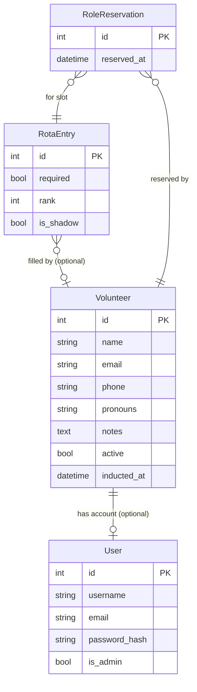

# Rewrite Strategy

> Extracted from [SPEC.md](SPEC.md) (was sections 10–12). SPEC.md covers the system as built; this file covers the strategic question of rewriting it, what to preserve, and how to migrate data.

---

## 10. Technology notes for a rewrite

### 10.1 Language and framework

The current system is Python + Django. A rewrite could use any language. Key considerations for choosing a stack:
- **Volunteer maintainability**: choose a language with wide documentation and a
large community. Python, JavaScript/TypeScript, Ruby, or PHP are all viable.
- **Hosting simplicity**: the simpler the deployment, the easier for a volunteer
to take over. A single binary, a container image, or a managed platform (e.g. Fly.io, Railway, Render) is better than complex server configuration.
- **ORM / database**: the data model is relational and suits SQL well. PostgreSQL
is recommended (more robust than MySQL/MariaDB, free and widely hosted).

### 10.2 What to keep

- The data model described in section 8 is sound and should largely be preserved
- The concept of `EventTemplate` (reusable defaults) is useful
- The mailout state machine (`PENDING → SENDING → SENT/FAILED/CANCELLED`) is clean
and a good pattern
- The `mailout_key` token for unsubscribe is simple and effective
- The `read_only` flag pattern for protecting system records is worth keeping

### 10.3 What to change

- **`RotaEntry.name` as free text** → link to a `Volunteer` (or `User`) record
properly. This is the most important architectural change.
- **No volunteer login** → volunteer accounts are essential for self-service
- **IP-restricted member creation** → replace with a proper role-based permission
(IP restrictions are fragile and exclude remote access)
- **External mailing list management** → either build list management in, or
integrate with a mailing list API
- **Wagtail CMS** → in a rewrite, a simpler CMS (or even flat Markdown files)
may be more maintainable for volunteers than a full Wagtail installation

### 10.4 Suggested data model additions for a rewrite



Key changes from current model:
- `Volunteer` linked to `User` (optional, for self-service)
- `RotaEntry` linked to `Volunteer` (optional, replacing free-text name)
- New `RoleReservation` entity for standby slots

### 10.5 Does the toolkit have an API?

**Short answer: no.** The current toolkit has no REST or GraphQL API. There are no machine-readable endpoints that return JSON (other than a few internal AJAX calls that drive the rota edit UI and are not designed or documented for external use).

**What is exportable today:**

| Data | How to get it |
|---|---|
| Volunteer list | `/volunteers/export/` — CSV download (Panopticon required) |
| Event archive | HTML scraping — see section 12.3 for a documented scraping approach |
| Rota data | HTML scraping of `/diary/rota/YYYY/MM/` |
| Member list | No clean export; only through the admin interface |

If a machine-readable backup of rota or volunteer data is needed right now, the HTML scraping approach in section 12.3 is the practical route — not elegant, but documented and workable.

**Adding a read-only API without a full rewrite:** Django REST Framework (DRF) can be added to the existing codebase as a dependency. A read-only API exposing events, showings, rota entries, and volunteers would be a 🟡 M–🟠 L effort (20–50h) depending on scope, and would not require architectural changes. Authentication via API tokens (one per trusted integration, revocable) is straightforward with DRF. This is a sensible near-term option if backup scripting or external integrations become urgent.

### 10.6 API design consideration (for a rewrite)

If the frontend is separated from the backend (e.g. a React or Vue frontend talking to a REST or GraphQL API), the key resource boundaries are:

- **Events** + Showings + Rota (the diary)
- **Volunteers** + Members (the people)
- **MailoutJobs** (the communication)
- **Training records** (the compliance)

A traditional server-rendered app (like the current Django app) is also a valid choice and may be more maintainable by volunteers than a split frontend/backend architecture.

### 10.7 The CMS question: Wagtail, a simpler alternative, or both?

The current system uses **Wagtail** as its CMS for public-facing static pages (About, Contact, FAQs, etc.). Wagtail is a full-featured, Django-native CMS that is well-maintained and production-proven. It is the right choice for the current stack — but it has a learning curve that some non-technical volunteers find daunting.

**What Wagtail is good at:**
- Structured content management with rich text, images, and page trees
- Integrated with the rest of the Django app — single login, single database
- Wagtail's "Streamfield" allows flexible page layouts without developer
involvement for each new content type
- Good admin UI that non-developers can use after a brief orientation

**What Wagtail is harder to use for:**
- Quick edits from mobile devices — the admin interface is not optimised for
small screens
- Editing content without understanding the page hierarchy
- Volunteers who use the system rarely and forget where things live

**Could a simpler CMS replace it?** For the public-facing static pages only (About, Contact, FAQs, Safer Spaces policy, etc.), a flat-file CMS (e.g. Kirby, Jekyll) or even a hosted option (Notion, Gitbook) would be simpler to edit. However, replacing Wagtail would add a second login, a second system to maintain, and a dependency boundary — the toolkit would need to display or link to content from the external CMS. This complexity almost certainly outweighs the UX gain.

**The more pressing issue is training and documentation**, not the tool itself. A one-page guide to "how to edit a CMS page in Wagtail" — with screenshots — visible from the internal dashboard would resolve most volunteers' hesitation. A tool that is documented is more usable than a simpler tool that isn't.

**Can Wagtail serve as a wiki?** Technically yes — Wagtail pages can be organised hierarchically and linked like a wiki. In practice, a Wagtail page is better suited to stable published content (like an About page) than to the iterative, collaborative editing style of a wiki. Wagtail doesn't have diff history, talk pages, or the low-friction editing of a true wiki. If the collective genuinely needs a wiki (for meeting notes, role guides, procedural documentation), a dedicated tool like MediaWiki, DokuWiki, or even a shared Notion space is a better fit for that purpose — and should be kept separate from the public-facing CMS. The toolkit's CMS should remain focused on what it does well: static public-facing pages that change rarely.

**Volunteer technical range.** The volunteer base spans a very wide range of technical confidence — from experienced developers to people who find any web form intimidating. This has design implications beyond the CMS:

- Any internal-facing feature should be usable without reading documentation
- Error messages should be human-readable and actionable ("The email address
you entered doesn't look right" rather than "Invalid input")
- The rota in particular should be approachable to a volunteer who has never
used the system — the current dense wall of text (section 8.6) fails this test
- Progressive disclosure (show less by default, more on demand) is a better
pattern than hiding complexity behind admin toggles

For non-technical volunteers who are primarily content editors, Wagtail's "Snippets" and "Pages" model is manageable once shown. The priority is better onboarding documentation, not a different tool.

---


## 11. Development strategy: rewrite or continue?

This section addresses the strategic question: given everything documented above, should the next phase of development work *within* the current Django codebase, or start fresh?

### 11.1 Arguments for continuing with Django

**The codebase works and has been battle-tested.** 15 years of commits represent a very large number of edge cases handled, bugs fixed, and data model refinements made. A rewrite starts this accumulation from zero.

**The data model is sound.** Section 2 describes a data model that is well-designed and largely correct. A rewrite would reproduce most of it. The key weaknesses (free-text rota entries, no volunteer accounts) are fixable within the existing architecture without a rewrite.

**Django is well-documented and has a large community.** A volunteer with some Python experience can pick up Django relatively quickly. The ecosystem is stable, well-tested, and has extensive documentation for every component the toolkit uses.

**The current migration (s+s to master) is the practical path.** Getting the Star and Shadow onto the modern `master` branch (Django 5.2 LTS) is already in progress. This delivers the security, compatibility, and maintainability benefits of a modern stack without abandoning the existing codebase.

**Volunteer continuity.** A rewrite requires someone to build, test, and maintain a new system in parallel while keeping the old one alive. This is a very high bar for a volunteer team. The risk of a half-finished rewrite that is never completed — leaving the organisation with neither a working old system nor a working new one — is real.

### 11.2 Arguments for a rewrite

**The architectural limitation that matters most** — `RotaEntry.name` as free text, with no volunteer accounts — is hard to fix incrementally. A clean data model with `RotaEntry → Volunteer → User` from the start makes the whole system simpler.

**Technical debt accumulation.** 15 years of iterative development has left some parts of the codebase complex and poorly documented. A rewrite with clear architecture documentation could be easier for future volunteer developers to maintain.

**PostgreSQL over MariaDB.** The current system uses MariaDB, which has caused real bugs (the `translation_key` column overflow is a MariaDB/Wagtail compatibility issue). PostgreSQL is more robust and is the standard for Django production deployments. A rewrite could start with PostgreSQL.

**Simpler deployment.** A rewrite could be designed for a PaaS deployment (Fly.io, Railway, Render) rather than self-managed Docker, which would reduce operational overhead for a volunteer team.

### 11.3 Recommendation

**Continue with Django, on the `master` branch, with incremental improvements.** The case for a rewrite is intellectually coherent but practically high-risk given the volunteer capacity constraints. The most important architectural fix — linking rota entries to volunteer accounts — is achievable within the existing codebase (and is already in the roadmap as item 8.1 (see TASKS.md)).

A rewrite should be revisited if:

- The volunteer developer pool grows large enough to run a parallel
project sustainably (3+ developers committed for 6+ months)
- A specific platform limitation causes a hard blocker that cannot be
worked around incrementally
- A well-funded grant or residency provides concentrated development time

The right near-term sequence is: quick wins → volunteer accounts + rota FK → programming pipeline → room booking → induction workflow. This delivers the most value with the least risk of leaving the organisation with a broken system. See [CURRENT_WORK.md](../CURRENT_WORK.md) for current sequencing rationale.

---


## 12. Migrating to a new system

This section covers what data needs to be carried across when moving to a replacement system, and how to obtain it — including the fallback case where no SQL database export is available and HTML scraping is the only option.

### 12.1 What must be migrated

Ordered by importance:

| Data | Why it matters |
|---|---|
| **Current and upcoming rota** | Volunteers have made commitments. Losing this loses trust. |
| **Volunteer records** | Active community members; losing contact info is a real harm. |
| **Event archive** | Institutional memory; years of programme history. |
| **Rota notes** | Operational context attached to specific showings. |
| **Event tags and roles** | Taxonomy; easy to recreate but tedious if lost. |
| **Mailing list subscribers** | People who have opted in to communications. Lower priority if the list is also managed in Simplelists. |
| **CMS content pages** | About, Contact, etc. — copy-paste is fine for small sites. |

### 12.2 Best-case: SQL database access

If a `mysqldump` or Django `dumpdata` export is available, all data can be migrated cleanly. Run:

```bash
# Full Django export (JSON):
python manage.py dumpdata --natural-foreign --natural-primary \ --indent 2 > full_export.json

# Or individual apps:
python manage.py dumpdata diary members mailer --indent 2 > data.json
```

The JSON fixtures map directly to the data model described in section 8. Write import scripts for the new system against this structure.

### 12.3 Fallback: scraping from HTML

If SQL access cannot be guaranteed (e.g. the old server is gone and only the running website survives), most critical data is recoverable from the live site's HTML — provided you have a login with Panopticon permissions.

The scraper needs to handle session-based auth (log in once, reuse the session cookie). Python + `requests` + `BeautifulSoup` is a straightforward choice.

#### What's fully recoverable

| Data | Source URL | Notes |
|---|---|---|
| **Upcoming rota** (next 3–6 months) | `/diary/rota/YYYY/MM/` | Iterate month by month. Contains: showing date/time, event name, role name + slot number, volunteer name (free text), rota notes. **Highest priority — scrape first.** |
| **Volunteer list** | `/volunteers/export/` | CSV download — the cleanest source. Gives name, email, notes, roles, active status. Much better than scraping the HTML list. |
| **All confirmed public events** | `/programme/archive/YYYY/MM/` then `/programme/event/id/N/` | Archive index gives years; year pages give months; month pages list events with IDs. Event detail page gives: pre/post title, name, copy (HTML), film info, pricing, ticket link, all showing dates/times/rooms, tags, images (as URLs). |
| **Event tags** | Public programme nav | Promoted tags appear in site nav; all tags visible on event detail pages. |
| **Roles** | `/diary/rota/YYYY/MM/` | Role names appear in the rota table. Collect distinct values across months. |

#### What's partially recoverable

| Data | Source | Gap |
|---|---|---|
| **Historical rota** (past months) | `/diary/rota/YYYY/MM/` | The rota view works for any month, including past ones — but you'd need to know how far back to go. Scrape as many months back as relevant. |
| **Volunteer contact details** | `/volunteers/` HTML (with `?show-retired=true`) | Email and postcode visible; full address is not. CSV export is better. |
| **Retired volunteers** | `/volunteers/` with `?show-retired=true` | Names and status recoverable; some fields may be blank. |
| **Unconfirmed / private events** | `/diary/edit/` (internal) | Requires Panopticon login. Not in the public archive. |

#### What's not recoverable from HTML

| Data | Why |
|---|---|
| **Mailing list subscriber records** (non-volunteers) | No public-facing member list. The mailing list itself lives in Simplelists — export from there instead. |
| **`mailout_key` unsubscribe tokens** | Stored only in the database. Old unsubscribe links in sent emails will break. Generate new tokens in the new system and accept this. |
| **Full member addresses** | Only postcode is rendered in the volunteer list HTML. |
| **GDPR consent timestamps** | Shown as a date on the volunteer page, but only per-volunteer. |
| **`RotaEntry.required` flag** | Not rendered in the rota HTML. |
| **DiaryIdea (monthly ideas text)** | Internal page; check if accessible, otherwise lost. |
| **Printed programme PDFs** | File links may be in the HTML; download the PDFs separately before migration. |
| **Mailout history** | Job records and sent content are internal only. |

### 12.4 Rota migration is the most time-sensitive

The rota for upcoming showings represents real volunteer commitments. This data should be scraped **before** the old system is taken down, ideally while both systems are running in parallel.

Practical steps:

1. Scrape `/diary/rota/` for the current month and the next 3 months
2. Parse out each showing: date, event name, and for each role slot: role name,
rank, and volunteer name (free text string)
3. Import these into the new system — if the new system links rota entries to
volunteer accounts, this is a manual matching step (the old `name` field is free text and may contain nicknames, abbreviations, or typos)
4. Contact volunteers via the mailing list to ask them to confirm or claim
their slots in the new system once it's live

### 12.5 Event archive migration

The public archive stretches back to the venue's opening. A crawler approach:

```
GET /programme/archive/                      → list of years GET /programme/archive/YYYY/                 → list of months in that year GET /programme/archive/YYYY/MM/             → list of events (name + showing ID) GET /programme/event/id/N/                  → full event detail
```

Each event detail page contains everything needed to reconstruct the event and its showings. Images are linked as URLs — download the files separately. The `event.id` from the URL can be preserved as the canonical ID in the new system to keep archive links stable.

**Note on unconfirmed and private events:** these are not in the public archive. If they matter (e.g. internal meetings with rota entries), they must come from the internal edit view or the SQL export.

### 12.6 Keeping archive URLs stable

The current public URLs use numeric event IDs:

```
/programme/event/id/42/ /programme/showing/id/17/
```

A rewrite should either:
- Preserve these numeric IDs as the primary key, so old URLs continue to work
- Or implement redirects from old-format URLs to new slug-based URLs

Breaking the archive URLs would destroy years of links shared on social media, emails, and external sites. This is worth the small implementation effort to avoid.

### 12.7 Running old and new systems in parallel

The safest migration strategy is a cutover period where both systems are live:

1. New system deployed at a staging URL, old system still at the live URL
2. Rota and volunteer data imported into new system
3. Volunteers invited to log in and verify their upcoming rota slots
4. On cutover day: update DNS, make old system read-only (or take it down)
5. Confirm printed programmes and PDFs are accessible from new system

Avoid a "big bang" cutover where data is migrated and the site goes live at the same moment — too much can go wrong at once.
