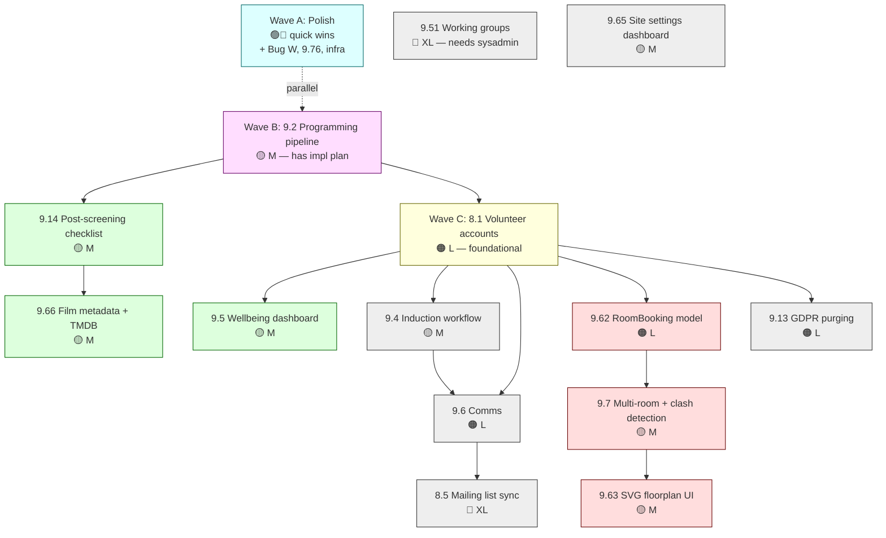

# Roadmap

**Last updated:** 2026-04-27

Sequencing plan for remaining Phase 2 work. Source of truth for individual
task status remains [CURRENT_WORK.md](../CURRENT_WORK.md); design rationale
lives in [TASKS.md](TASKS.md). This file is the *order* and the *why* of
that order.

The driving question for sequencing is: **which features unblock the most
others?** That makes volunteer accounts (8.1) and the programming pipeline
(9.2) the two pivotal pieces. Everything large downstream — comms,
induction, wellbeing, sign-up, "my schedule" — needs accounts. The pipeline
is independent of accounts and can ship in parallel, which is good because
it has a written impl plan already in
[PIPELINE_IMPL.md](PIPELINE_IMPL.md).

Six waves; Wave A and Wave B run concurrently.

---

## Wave A — Polish & loose ends 🟢🔵

Independent, low-risk, parallelisable. Picks up momentum and shrinks the
queue.

- **Bug W** mobile burger menu (current blocker)
- **9.76** rota date nav & orientation 🔵 — biggest daily-UX win remaining
- **9.62** mailing list view 🔵
- **9.70** nightly DB backup 🟢
- **D.1 / D.4** infra hardening (WhiteNoise cache-busting; Docker resource limits)
- XS sweep-ups: 9.10.6, 9.12, 9.40, 9.57, 9.31, 9.42, 9.34

**Outcome:** site feels finished, production hardened, queue clear enough to
focus on big features.

## Wave B — Programming pipeline (9.2) 🟡 M

Already specced in `PIPELINE_IMPL.md`. Independent of accounts.

- Draft / proposed state on events
- Programming queue view
- Finance referral flag (£500 / £750 thresholds)
- Etiquette guide link + pre-requisite reminder
- Auto-populate programmer rota slot on approval
- Rota deadline warning (< 7 days, no rota)

**Outcome:** Monday meetings have a queue to work through; programmer
accountability recorded from approval onward; no more "is this confirmed?"
ambiguity.

## Wave C — Volunteer accounts foundation (8.1 + rota link) 🟠 L

The keystone. Replace `RotaEntry.name` free-text with FK to `Volunteer`.

- Migrate existing names via fuzzy match + manual-review tool
- Port s+s name-coercion behaviour for transitional period
- "My schedule" view
- Drop-out flow

**Outcome:** the system finally knows who is on the rota. Unblocks all of D,
E, F.

## Wave D — Operational tracking

Run in parallel after C lands.

- **9.14 post-screening checklist** 🟡 — high-impact, addresses the Janus
  crisis directly. Mostly independent of accounts.
- **9.5 wellbeing dashboard** 🟡 — needs accounts. Cheap once C is done.
- **9.66 film metadata + TMDB** 🟡 — independent; multiplier for 9.14 since
  rights reports need film data.

**Outcome:** programmers stop forgetting tasks that damage distributor
relationships; coordinators can see who's overstretched.

## Wave E — Multi-room (9.62 → 9.7 → 9.63) 🟠 L

Architectural. Best done after C settles so migrations don't pile up.

- 9.62 `RoomBooking` through-model
- 9.7 clash detection
- 9.63 SVG floorplan UI

**Outcome:** real multi-room events stop polluting the diary with fake
duplicates; clashes surface before showtime.

## Wave F — Comms + induction (9.4, 9.6, 8.5) 🔴 XL

Biggest and most political. Needs Simplelists conversation before scoping.

- 9.4 induction workflow
- 9.6 comms (email-by-showing, by-role, vacancy alerts)
- 8.5 list sync

**Outcome:** Google Form → manual entry pipeline gone; mailing lists
self-heal.

## Wave G — Later / governance-bound

- 9.51 working groups page 🔴 XL (needs sysadmin conversation)
- 9.65 site settings dashboard 🟡 M
- 9.13 GDPR purging 🟠 L
- 9.74 permission redesign (collective ratification first)

---

## Dependency diagram

---

## Two judgement calls worth flagging

**Pipeline before accounts (B before C).** CURRENT_WORK.md section 4 puts
accounts first. This roadmap flips them: the pipeline is specced,
demonstrable in one Monday meeting, and gives the collective a quick
visible win. Accounts is a longer slog with a heavy migration. Doing
pipeline first builds goodwill while you tackle the harder one.

**9.14 doesn't need accounts.** The CURRENT_WORK roadmap implies it comes
after the accounts foundation, but post-screening tasks attach to events,
showings, and programmers — not volunteers generally. It can ship right
after the pipeline, and probably should, given the Janus invoicing damage
was real money.

---

## Size legend

| 🟢 | 🔵 | 🟡 | 🟠 | 🔴 |
|----|----|----|----|-----|
| 1–4h | 4–16h | 16–40h | 40–80h | 80–160h |

---

*Navigation: [CURRENT_WORK.md](../CURRENT_WORK.md) · [TASKS.md](TASKS.md) ·
[SPEC.md](SPEC.md) · [PIPELINE_IMPL.md](PIPELINE_IMPL.md)*
