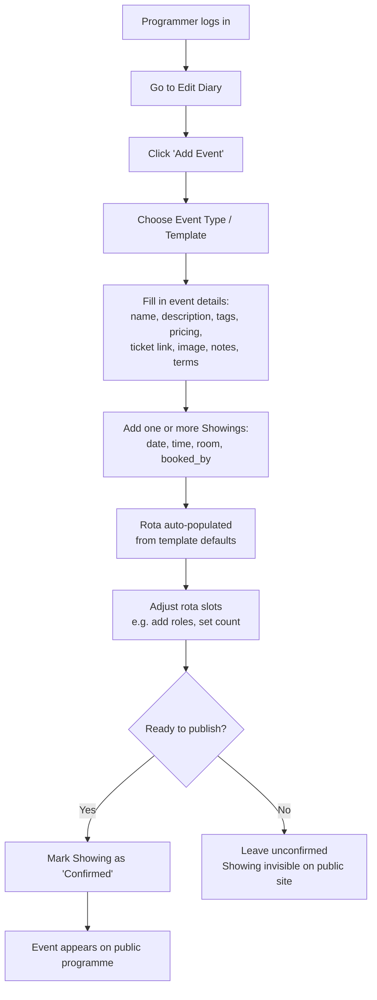
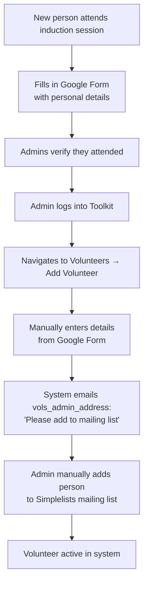
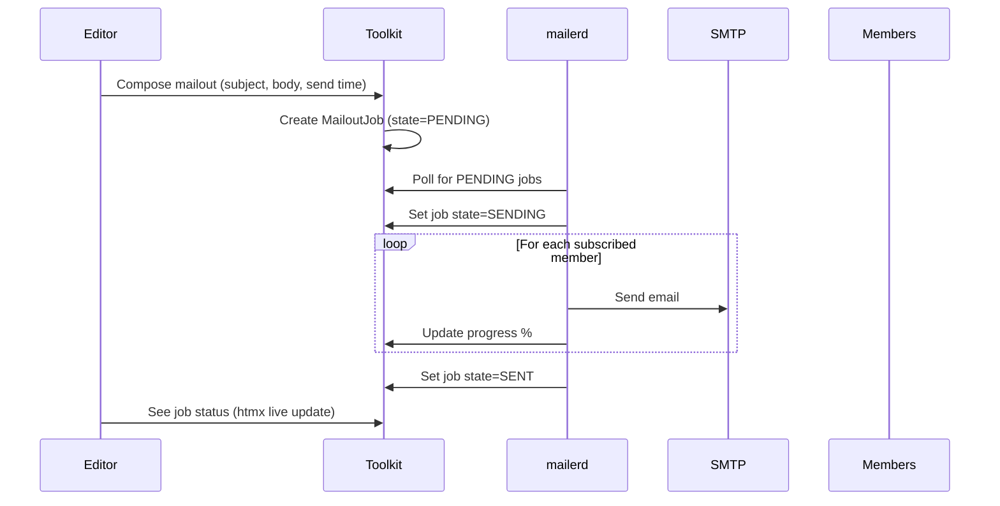
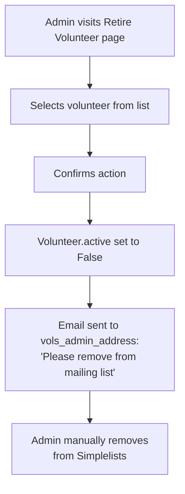
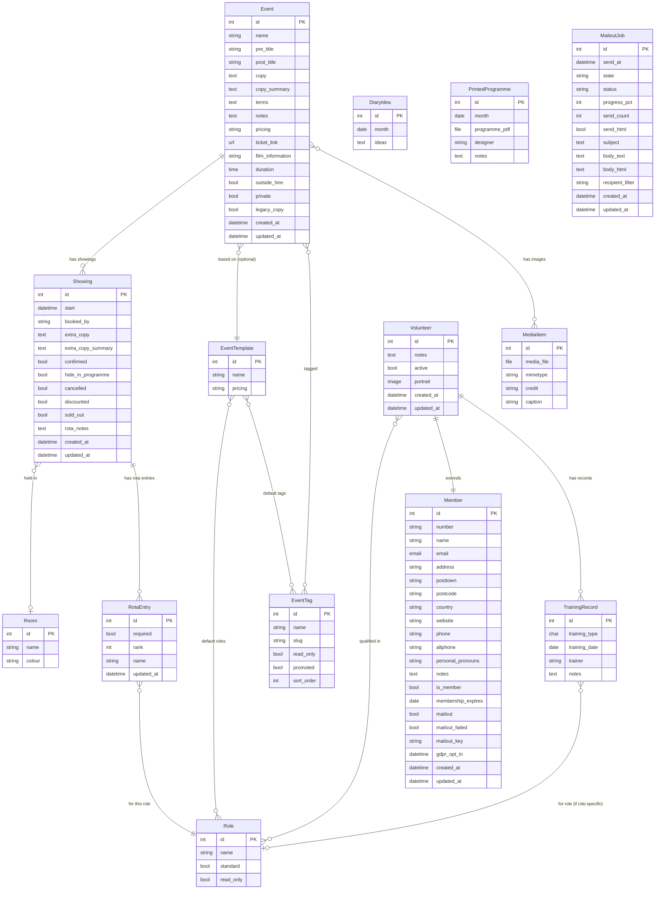
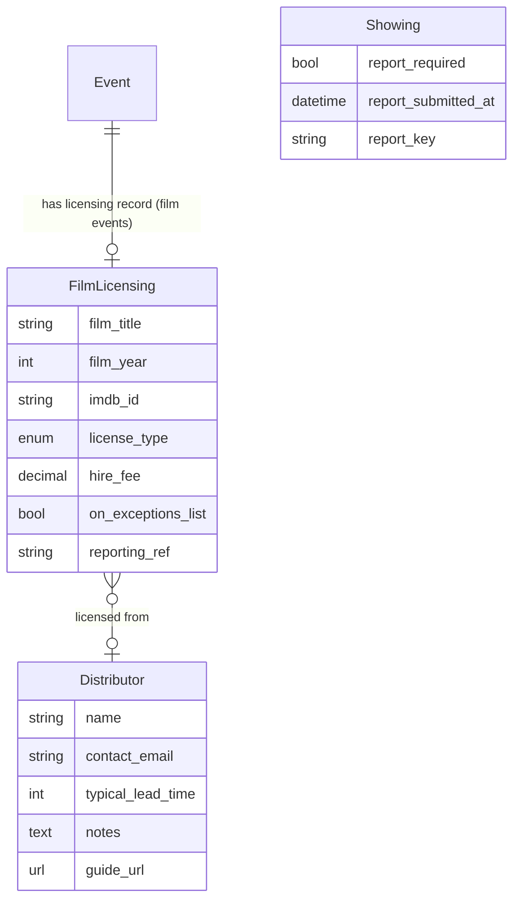
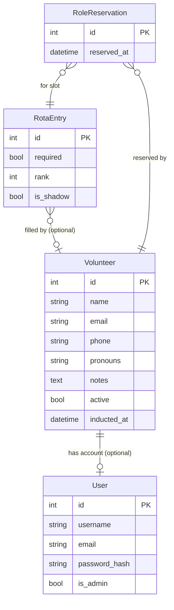

# Star and Shadow Cinema — System Specification

**Author:** Jonny Kram, with agentic AI assistance (Claude by Anthropic)

**Audience:** This document is for a developer (experienced or volunteer) who wants to understand what the current system does, and/or rewrite it from scratch in any language or framework. It is written to be implementation-agnostic.

**Context:** The Star and Shadow Cinema (Newcastle upon Tyne) is a volunteer-run organisation with an anarchist ethos. The system described here manages events, volunteers, and communications. This specification represents my (Jonny's) understanding of how the organisation works and what values should guide technical development. Where I describe principles or organisational practices, these are my observations and interpretations — not formal collective decisions unless explicitly stated otherwise.

**On AI assistance:** I have used AI tools extensively in writing this document and in developing code for the toolkit. My reasoning for this choice, and some thoughts on the tensions it creates, are discussed in the principles section below.

---

## Principles and values

**Note:** This section represents my (Jonny Kram's) understanding of Star and Shadow's values and how they should inform technical development. These are my interpretations, informed by participation in the collective, but should not be read as collectively agreed positions unless I explicitly cite a collective decision.

> Star & Shadow Cinema is a completely volunteer-run DIY venue based in Newcastle upon Tyne in the North East of England.
>
> We are an arts, music, cinema and community space set up as a cooperative that anyone can join.
>
> No-one is paid to run the Star & Shadow. There are no bosses or managers, just working groups, collective meetings, consensus decision making and a heavy dose of honest disorganisation. The building is run and programmed by its members and volunteers.
>
> Our programming is completely open. Anyone willing to volunteer can put on a film screening, gig, meeting, talk or party, as long as they are willing to help run the place and get involved.

From the above statements (which are from the public-facing website), I draw the following implications for how the toolkit should be designed and maintained.

**No bosses or managers.** My view is that the system should not reproduce hierarchy in its UX. Features that make one person's voice louder than another's — or that require a gatekeeper to approve routine actions — should be avoided or made optional. Where coordination roles exist (Panopticon, Programmer), I believe they should be understood as responsibilities, not authority.

**Consensus and collective decision-making.** I believe the toolkit should facilitate coordination, not impose process. The programming pipeline (9.2), for example, should support how Monday meetings actually work — not enforce a rigid approval hierarchy that the collective hasn't agreed to.

At the same time, processes that the collective *has* agreed to sometimes need to be encoded in the system to have any teeth at all. A space that is genuinely open to anyone is also, by the same token, open to bad actors. For the most part S&S does a good job of self-governing — but a collectively agreed safeguard that exists only as a social norm, with no technical enforcement, is vulnerable to whoever is least willing to honour it. The toolkit is sometimes the only hard mechanism standing between a collectively agreed process and someone circumventing it.

My proposed design principle is therefore not "never enforce anything" but **"only enforce what the collective has agreed to enforce."** Where a restriction exists in the system, it should ideally be possible to point to the collective decision behind it. Where no such decision exists, the system should nudge rather than block.

**Honest disorganisation.** Based on how I've observed the organisation work, the system must be tolerant of incomplete data, half-finished entries, and tasks left undone. Strict validation that blocks progress will be worked around or ignored. Soft warnings beat hard blocks.

**Anyone can get involved.** Low barrier to entry is not just a UX nicety — it's a core stated value of the organisation. My design goal is that the rota, the programme, and the volunteer onboarding process should all be accessible to someone who has never used the system before and has no technical background.

**The toolkit as community space.** My understanding is that the toolkit is not just a management tool — it is a shared space that the community contributes to and inhabits. In some ways it is a direct descendant of the paper sign-up sheet that preceded it: a place where people show up, put their name down, and find out what's happening. I believe that lineage matters. The lo-fi, low-demand quality of the current system is not a limitation to be overcome — from what I've observed, for some members it is actively valued, as a counterpoint to the polished apps and notification-heavy platforms that dominate the rest of their lives and demand their attention on someone else's terms.

People spend significant time on the rota not because the system nudges them to, but because they care. That voluntary engagement is precious and should not be undermined by features that make the toolkit feel like a productivity system or a managed service.

There are 1,500 registered volunteers and typically around 100 active at any one time. Disagreements happen. Tensions arise. The fact that the place functions as well as it does — without bosses, without HR, and with formal dispute resolution mechanisms that have real limits on how quickly and strictly they can be applied — is an ongoing collective achievement. The toolkit should support the human processes that make this possible, not try to automate over them.

For many volunteers, the Star and Shadow is one of the only spaces where they feel able to be their full selves, separated from the disempowering systems and hierarchies of daily life. The toolkit exists in service of that space. Any feature that affects how people encounter each other — notifications, social signals, automated messages, visibility of who has or hasn't done something — should be designed with the community's social fabric in mind, and introduced with care.

My proposed design implications:
- Notifications and automated reminders should be opt-in and unobtrusive, not the default mode of operation
- Avoid features that create pressure, social comparison, or visibility of absence (e.g. "X hasn't signed up yet") without the community having explicitly asked for them
- The rota is a social space as much as an operational one — changes to it affect how people encounter each other
- When in doubt, do less and leave room for human judgement

**Social capital and intentional friction.** From my observation, the Star and Shadow runs on something that looks from the outside like disorganisation but is, on closer inspection, a maintained social economy. Time is the primary currency. Relationships are the medium of exchange. The mutual obligation to help people who have helped you — sometimes described informally as "backscratching" — is a real governance mechanism, not a failure of formal process.

Some of the friction in the current system is not a bug. The fact that a new programmer must personally approach keyholders, and earn their willingness to vouch for a showing, is a form of community vetting that the current system performs accidentally (see 8.12). Any feature that lowers this friction should be designed with care: the friction may be doing useful work.

The same applies to collectives. Groups self-assemble around a shared interest and develop their own internal cultures. The fact that their membership is not always visible to the outside world is sometimes by design. The toolkit should not force collectives into the open without a collective decision to do so.

**Volunteer maintainability above all.** My strong belief is that a system that requires an external developer to make routine changes has failed. Prefer simple, well-documented code over sophisticated abstractions. Prefer boring technology over clever technology. The ideal is a codebase that an enthusiastic volunteer with some Python experience can confidently read, run, and modify.

### On the use of AI tools in development

**This section represents my (Jonny Kram's) personal position on using AI tools for this project. I have not sought collective agreement on this, and I'm aware that some members may disagree with my approach.**

I recognize that some members of the community may have ethical objections to the use of AI tools in developing or maintaining the toolkit. These objections are legitimate and worth taking seriously — they may relate to the environmental cost of AI inference, concerns about training data and intellectual property, the displacement of paid technical labour, or the concentration of AI capability in large corporations whose values may not align with the collective's.

That said, I've been meaning to get into web development for ~15 years and never managed it, and wouldn't have been able to do much of the work in this project without AI assistance - or I would have, it just would have taken an order of magnitude more work and effort, resources that I don't have to spare when so much of my energy has to go into maintaining and trying to improve my health.

**Accessibility.** My view is that the principle that anyone willing to volunteer should be able to get involved extends to the codebase itself. AI coding tools meaningfully lower the barrier to contributing for people who have enthusiasm and ideas but lack formal software training, or who work in adjacent fields and would find the learning curve too steep to donate their time otherwise. A volunteer who can describe what they want in plain language and iterate on the result with AI assistance can make real contributions that would otherwise be impossible for them. In my view, rejecting AI tools uncritically can reproduce the same gatekeeping the collective tries to dismantle elsewhere.

**Pragmatism.** Professional software development is expensive. Skilled developers who could build this system commercially are rare in a volunteer pool, and those who do volunteer are giving time that is genuinely costly to them. In my case, the realistic alternative to AI-assisted development is often not "I do it without AI" — it is "it doesn't get done." If AI assistance is what makes a feature possible at all, I believe that is worth weighing honestly against the ethical concerns.

This is not an argument to dismiss those concerns — it is my reasoning for why I have chosen to use AI assistance for this work. I recognize that others in the collective may weigh these considerations differently.

This document was produced with AI assistance. I have tried to be transparent about this throughout. Any code or documentation I contribute using AI tools is disclosed in commit messages. If the collective decides it does not want AI-assisted contributions, I will respect that decision — but I wanted to document my reasoning openly.

For clarity: the toolkit itself does not and should not depend on AI or machine-learning capabilities to function. Any AI-assisted tooling sits in the development process, not in the running system.

### Relationship with the Cube Microplex

The toolkit codebase was originally written for, and continues to be maintained by, the **Cube Microplex** in Bristol. The Star and Shadow runs a fork of the same codebase. This relationship is worth taking seriously in both directions.

**Being good neighbours.** Both organisations are volunteer-run arts cinemas with anarchist and co-operative values. Any improvements the Star and Shadow makes to the shared codebase could benefit the Cube — particularly generic improvements (performance, accessibility, GDPR tooling) that aren't S&S-specific. The right posture is: when we fix something that is clearly a bug or a general improvement, open a pull request upstream. Don't assume the Cube wants or needs our feature set — but do offer the ones that would translate cleanly without imposing cognitive overhead on their team.

**Not assuming our way is better.** The Cube operates quite differently: it uses Celery and Redis for background tasks; it has a different membership structure, different venue configuration, and different volunteer workflows. The fact that we've built something one way doesn't mean that's the right way for them. Features developed here should be configurable (behind settings flags) rather than hardcoded, so both sites can adopt or ignore them independently.

**Technical caution.** The Cube's production deployment uses the `master` branch directly. Any changes merged there affect their live site. The Star and Shadow should develop on its own branch (`sns_2026_overhaul` or equivalent) and offer carefully reviewed changes upstream — not push directly to master with S&S-specific assumptions baked in.

### The value of volunteer time already invested

This codebase represents roughly **15 years of volunteer and subsidised development** — from the first commit in July 2011 to the present day.

A few numbers from the git history:

| Metric | Value |
|---|---|
| Total commits (all branches) | 1,877 |
| Years of active development | 2011 – present (most active: 2012, 2014, 2017) |
| Primary contributor | REDACTED (~1,434 commits) |
| Second contributor | REDACTED (~234 commits) |
| Lines of Python code | ~21,000 |
| Lines of HTML templates | ~5,300 |

At a UK freelance developer rate of **£400/day (~£50/hour)**, and estimating conservatively that the codebase represents around **1,500–3,000 hours** of skilled development time:

> **£75,000 – £150,000 of development work has been donated or subsidised into this system.**

This is not an abstract number. It represents many evenings and weekends from developers who gave their time because they believed in what the Cube and S&S are doing. When volunteers contribute code or documentation, they are continuing a tradition of genuine generosity that deserves to be named.

For the same reason, the cost estimates throughout section 13 are given in commercial freelance rates, not as a budget — but as an honest acknowledgement of what volunteers are giving when they contribute technical work. A volunteer who implements the break-even calculator (estimated 2–4h) is donating £100–£200 of skilled labour, not just "a few hours on a weekend".

---

## Table of Contents

1. [What the system does](#1-what-the-system-does)
2. [Who can access what — permission model](#2-who-can-access-what--permission-model)
3. [Business rules and invariants](#3-business-rules-and-invariants)
4. [Key workflows](#4-key-workflows)
5. [Should we just use Squarespace?](#5-should-we-just-use-squarespace)
6. [External integrations](#6-external-integrations)
7. [Integration with adjacent infrastructure](#7-integration-with-adjacent-infrastructure)
8. [Data model](#8-data-model)
9. [URL / endpoint map](#9-url--endpoint-map)
10. [Technology notes for a rewrite](#10-technology-notes-for-a-rewrite)
11. [Development strategy: rewrite or continue?](#11-development-strategy-rewrite-or-continue)
12. [Migrating to a new system](#12-migrating-to-a-new-system)

*Tasks and bugs: [docs/TASKS.md](TASKS.md) · Completed work: [docs/ARCHIVE.md](ARCHIVE.md) · Roadmap: [docs/ROADMAP.md](ROADMAP.md)*

---

## 1. What the system does

The system (internally called "the Toolkit") has six distinct areas of functionality:

### 1.1 Public programme listing

A public-facing website showing upcoming events. Visitors can:
- Browse events by date, week, month, year, or tag (category)
- Read full event descriptions and see images
- Follow an RSS feed of upcoming events
- Search an archive of past events
- View a direct link to an individual event or showing
- Access static content pages (About, Contact, etc.) managed via a CMS

### 1.2 Event and diary management (internal)

Logged-in users can:
- Create and edit events (title, description, pricing, tags, images, terms)
- Schedule one or more showings (date/time/room) per event
- Manage event templates (reusable defaults for recurring event types)
- Manage tags and roles
- View and edit a calendar of events
- Upload PDFs of printed programmes to an archive
- Write monthly free-text "ideas" notes
- Confirm or cancel showings; hide showings from the public programme

### 1.3 Volunteer rota (internal)

- Each showing has a rota: a list of role slots (e.g. "Bar Staff", "Projectionist")
- Each slot can be filled with a volunteer's name (currently stored as free text)
- A rota view shows all showings in a time range with their role slots
- A "vacancies" view highlights unfilled slots
- Roles can be marked as "standard" (shown on the main rota list) or non-standard

### 1.4 Member and volunteer database (internal)

- **Members**: the underlying record for anyone in the system (subscribers,
volunteers). Stores name, email, address, phone, pronouns, notes, GDPR consent date. At Star and Shadow, the formal "membership" distinction is not used — everyone is treated as a volunteer, not a paying member.
- **Volunteers**: the active layer on top of a Member record. Stores portrait
photo, active/retired status, notes, and a list of roles the volunteer is qualified for.
- **Training records**: the data model includes structured training logs (who
was trained for which role, when, by whom). In practice at Star and Shadow these are not actively maintained — the system is too rigid to keep up to date, and role access is not currently gated by training status. Anyone can sign up for any role.
- Add/edit/retire/unretire volunteers, with automatic notification emails to admins
- CSV export of volunteer list
- Reports: volunteer list, role-by-volunteer report, training records report

### 1.5 Email mailouts (internal)

- Compose an email (plain text and/or HTML) to be sent to all subscribed members
- Schedule it for a future time
- A background daemon picks up scheduled jobs and sends them
- Job queue with real-time progress (htmx polling)
- Cancel a pending or in-progress job
- Members have a unique unsubscribe token for one-click unsubscribe links in emails

**Note (Star and Shadow):** at S&S the toolkit mailout system is **not currently deployed or used** — neither for general communications nor for any other purpose. All volunteer and member communications go through Simplelists mailing lists, managed outside the toolkit. The toolkit's email code (the `mailerd` daemon, the job queue, the compose view) is present in the codebase and functional, but the `DJANGO_SETTINGS_MODULE` for the S&S instance does not configure an outbound SMTP server for bulk sends, and the mailout UI is not linked from the internal dashboard. The only email the S&S instance sends is transactional (account creation, password reset). See section 3.3 for the workflow diagram — it describes how the system *can* work, not how S&S uses it today. If S&S were to adopt the toolkit mailout system, a review of the Simplelists migration implications (section 9.6) would be needed first.

### 1.6 CMS content pages (internal)

- Wagtail-powered CMS for "About", "Contact", and other static pages
- Managed by editors via a web admin interface
- Pages can be linked from the public programme listing

---


## 2. Who can access what — permission model

The system has three permission levels:

| Role | Django permission | What it allows |
|---|---|---|
| **Volunteer** | `toolkit.read` | View internal pages: rota, diary, volunteer list, reports. Cannot create or edit events, access member data, or use the CMS. |
| **Programmer** | `toolkit.read` + `toolkit.programmer` | Everything a volunteer can do, plus: create and edit events and showings, manage tags and roles, manage event templates, write rota entries. Cannot access sensitive volunteer/member data or the CMS. |
| **Panopticon** | `toolkit.read` + `toolkit.write` | Full access: everything a programmer can do, plus: website edits via the Wagtail CMS, access to sensitive volunteer and member data (names, emails, addresses, notes), adding and retiring volunteers, sending mailouts. Intended for a small group of trusted coordinators. |

Authentication is via Django's built-in session-based auth (username + password). There is no public registration.

The `CUBE_IP_ADDRESSES` setting defines a list of IP addresses that bypass the login requirement for the "add new member" page (intended for use at the venue's front desk). This should be replaced with a proper role-based check — see [8. Current limitations](#8-current-limitations-and-known-gaps).

Volunteers with the `Programmer` role in the rota system are automatically added to the `Programmers` Django group, which grants the `toolkit.programmer` permission. Panopticon permissions are assigned manually by an admin.

---


## 3. Business rules and invariants

These are rules enforced by the current system. A rewrite should preserve them.

1. **Events cannot be deleted.** Once created, an event record persists forever.
Showings can be cancelled, and events can be hidden, but the event record remains. (This is a data integrity and audit trail decision.)

2. **Past showings cannot be edited or deleted.** A showing with a start time in
the past is locked. (Applies at the application layer; not a database constraint.)

3. **Read-only Roles and EventTags cannot be modified or deleted.** Certain system
roles (e.g. "Keyholder") are marked read-only. They can only have their `promoted`/`sort_order` fields changed.

4. **Rota volunteer names are free text.** The `RotaEntry.name` field is a plain
string, not a foreign key. Volunteers sign up (or are signed up) by name, but the system has no way to verify the name or link it back to a volunteer record.

5. **Volunteer training auto-adds roles.** When a role-specific training record is
added for a volunteer, the system automatically adds that role to the volunteer's `roles` set. *In practice at Star and Shadow, training records are not maintained and this link is not relied upon.*

6. **Training records expire.** By default, a training record older than 12 months
is considered expired (configurable via `DEFAULT_TRAINING_EXPIRY_MONTHS`). *In practice at Star and Shadow, expiry is not enforced and does not gate access to roles.*

7. **Membership numbers are based on database primary keys.** A member's
user-facing number is set to their database `id` (with collision avoidance). *At Star and Shadow the membership number concept is not used in practice.*

8. **Showing start times must be in the future.** A showing cannot be scheduled
in the past (validated at form submission).

9. **Events must have terms text before confirmation** (configurable, and exempted
for meetings and training events via `TAGS_WITHOUT_TERMS`).

10. **Showings are only public when `confirmed=True`, `event.private=False`, and `hide_in_programme=False`.**

11. **New volunteer and retirement actions trigger admin notification emails.** The system emails `vols_admin_address` but does not directly manage the external mailing list.

12. **Mailout recipients:** a member receives mailouts only if `mailout=True`, `email` is non-empty, and `mailout_failed=False`.

13. **Role eligibility is real but varies by type.** Different roles have meaningfully different qualification requirements. These are not currently enforced by the system, but a rewrite should be designed with them in mind. The qualification types are:

    | Role | Gate type | Notes |
    |---|---|---|
    | **Projectionist** | Internal tiered training | At least 1 level, possibly 2–3. Progression through levels tracked internally. |
    | **Bar** | Induction — training + licensing | A specific bar induction is required before anyone can work behind the bar, for both training and legal/licensing reasons. |
    | **Food (Level 1)** | Induction — in-house café induction | Monthly café inductions cover kitchen layout, venue procedures, and food hygiene basics, and grant participants a Level 1 food hygiene certificate. Required for most café roles. |
    | **Food (Level 2)** | External certification | UK Food Hygiene Level 2 certificate, obtained externally. Required for roles involving direct handling of food. |
    | **Sound / tech** | Informal — self-selected | No hard rule. Volunteers generally shadow a number of times before taking a role independently. |
    | **Keyholder** | Nomination and acceptance | A position of trust. Requires nomination, acceptance by the collective, and broad venue competency (keyholders may need to support any other role if someone no-shows). Not gated by a single training event. |

The current system uses a single `TrainingRecord` model for all of these, which fits none of them well — see 8.8.

14. **Programming eligibility is a collective norm, not a system gate.** The collectively agreed expectation is that a volunteer does approximately 10 shifts (and at least 5 in the preceding 6 months) before programming their own event. This is documented in the programming etiquette guide but is not, and should not be, enforced by a hard system lock. Reasons: (a) rota names are free text — the system cannot reliably count a volunteer's past shifts until 8.1 is resolved; (b) enforcing a gate would be contrary to the non-hierarchical ethos; (c) the collective is the appropriate enforcement mechanism, not software. The right toolkit response is to surface this guidance prominently at the point of event creation (see section 9.2), not to block.

15. **Events with estimated costs above threshold require Finance Collective sign-off.** Events costing over £500 (£750 for music events) must be referred to the Finance Collective for authorisation before confirmation. This is a collectively agreed spending control. The system should flag this threshold in the programming pipeline view (see section 9.2), but the final authorisation is a human process, not a database lock.

---


## 4. Key workflows

### 3.1 Creating an event and scheduling showings



### 3.2 Volunteer induction (current process)



**Current pain points:** entirely manual, no link between the Google Form and the Toolkit, no automated account creation, admins must remember to act on emails.

### 3.3 Sending a mailout (Cube Microplex only; not used at S&S)



### 3.4 Volunteer retirement



### 3.5 Film programming workflow (Star and Shadow)

The *Film and Television Programming Guide* (NextCloud, last updated January 2025) documents the end-to-end process for proposing and running a film or TV screening. Key information extracted for specification purposes:

#### Seasons

Programming runs in four seasons:

- **Spring**: March – May
- **Summer**: June – July
- **Autumn**: September – November
- **Winter**: December – February

Thursdays and Sundays from 19:30 are reserved for film and television screenings. Other times are possible but require approval from the main Programming Group.

#### Finding a distributor

Filmbank is the first port of call — cheaper and simpler than other distributors and covers a broad catalogue. Failing that, the [Independent Cinema Office](https://www.independentcinema.org) website holds a full list of UK distributors. Commonly used distributors include Filmbank, Park Circus, BFI, Janus, Curzon, Arrow Films, Second Run, Altitude, Contemporary Films, Cineuropa, Bulldog, Cult Films, Dogwoof, Eureka, Film4, ICA, Lux, Modern Films, and Vertigo. If the distributor cannot be found, the Film Programming Group can help.

#### Suggesting a screening

Proposals are submitted via the Film Programming Suggestions form by a per-season deadline. Each proposal requires a **25-word summary or pitch** — this wording is used unchanged for the print programme and submitted to *The Crack* and *NARC* magazines. Changes to the summary after submission must be requested from the Social Media Team at least two weeks before the end of the month. See section 9.16 for the proposed live word counter UI feature.

#### Film Programming Group meetings (two per season)

**First meeting:** Proposals are presented and discussed. Distributor contacts then contact distribution companies to confirm availability (usually within 24 hours — Filmbank licences do not need confirmation). One person is elected to handle requests for the main Programming Group.

**Second meeting:** Provisional schedule reviewed. Alternatives discussed where licences are unavailable. Last-minute additions considered.

#### Booking a licence

- **Filmbank:** Self-service via the S&S Filmbank account. The programmer books directly: New booking → Indoor → yes to ticket price → provide title, date, number of showings. Must be completed before the third and final Film Programming Group meeting (usually 2–3 weeks after the second meeting).
- **Other distributors:** The distributor contacts handle booking on behalf of the programmer and confirm when complete.

Some distributors supply a screener (35mm reel, DVD, or DCP file). If no screener preference, buying a DVD/Blu-ray and emailing the receipt for a refund is usually faster and cheaper. Screener delivery is the programmer's responsibility to arrange; **returning the screener is also the programmer's responsibility** — vital for maintaining distributor relationships; use the same courier service as the delivery.

#### Adding the event to Toolkit

Programmer rights are required in Toolkit (granted by an admin, usually requested at a Film Programming Group meeting). Key fields to complete:

| Field | Notes |
|---|---|
| Room | Cinema |
| Start | Usually 19:30 on the screening date |
| Event name | Film or TV show title |
| Event template | Choose closest format to the screener |
| Pricing | Typically £7/£5/£3/£0 (Full / Concessions / Further concessions / Free) |
| Ticket link | Add after TicketSource setup (below) — can return to diary entry at any time |
| Film information | Dir. (Director), Year, Country, Runtime (mins), BBFC rating |
| Programmer's notes | Private notes, only visible to volunteers |
| Copy | Public-facing event description |
| Terms | Distributor name and licence fee |
| Image | Distributors provide licensed images; Filmbank account gives access to film poster scans. Avoid Google Images — copyright risk. |

Once the TicketSource link is added, mark the showing as **Confirmed** to make it live.

#### Setting up TicketSource

1. Create a new event using the same details as Toolkit.
2. **Add venue**: search "Star and Shadow" — choose the first result (autocompletes address).
3. **Add date**: set date and time. No doors or end time needed. Set "Stop ticket sales" to **1 hour before start time**.
4. **Add ticket allocation**: choose "Tickets are allocated on a seating plan" → select **"2025 Seating Plan"** → uncheck "Enable orphan seat rule on internet bookings".
5. **Add pricing categories**: Full price, Concessions, Further concessions, Gratis/Free. For the Free tier, enable "Individual ticket" and set maximum selection to 1.
6. **Activate** the event → **Publicise** → copy the Ticket shop URL into the Toolkit diary entry. A QR code is also available for print promotion.

Ticket sales close 1 hour before the showing start. Print the TicketSource sales sheet and ensure the Box Office volunteer has it along with the seating plan.

#### On the day

- **Programmer** arrives second after the Keyholder, at least 1 hour before start.
- **Projectionist** sets up the screener; Programmer ensures the Projectionist has it.
- Projectionist checks with Programmer about sound and aspect ratio.
- The Programmer may give a short introduction (not mandatory), ideally including a brief plug for upcoming events.
- Programmer helps the Keyholder close up afterwards.
- Programmer should **not** sign up for additional rota roles — their job is to coordinate.

#### Promoting

- The 25-word summary is sent to *The Crack* and *NARC* magazines by the Social Media Team.
- The Social Media Team manages Facebook, Instagram, BlueSky, Threads, and X. Facebook events are the primary engagement channel.
- A weekly round-up covering the next seven days is posted on all channels.
- Programmers can request additional posts (subject to availability in the content schedule) or use personal networks.

---


## 5. Should we just use Squarespace?

When the news surfaced that the site was running on a deprecated, unsupported version of Django, a natural response from volunteers without deep technical context was: "why not just use Squarespace?" or "why not use WordPress?" These questions deserve a straight answer.

### 13.1 What an off-the-shelf platform does well

A hosted website builder like Squarespace, WordPress.com, or Ghost does some things very well:

- **Easy public-facing website management** — drag-and-drop editing, no
server management, automatic updates
- **Event listings** — Squarespace and similar platforms have event listing
features; WordPress has plugins like The Events Calendar
- **Email campaigns** — Squarespace has Mailchimp integration; many platforms
have built-in mailing tools
- **Secure hosting** — managed TLS, backups, and software updates handled
by the platform provider
- **Low technical barrier for content editors** — non-technical volunteers
can update the website without developer involvement

For a simple "here is what's on this week" website with a contact form and some About pages, an off-the-shelf platform is entirely sufficient.

### 13.2 What the toolkit does that a website platform cannot

The Star and Shadow's digital infrastructure requirement goes far beyond a public-facing website. The toolkit manages:

| Function | Off-the-shelf platform | Toolkit |
|---|---|---|
| Public event listings | ✅ | ✅ |
| Rota management (who volunteers for what) | ❌ | ✅ |
| Volunteer database (1,500+ records) | ❌ | ✅ |
| Training records per volunteer | ❌ | ✅ |
| Internal event creation with role templates | ❌ | ✅ |
| Rota vacancy view (what shifts need filling) | ❌ | ✅ |
| Transactional volunteer notifications (join/retire) | ❌ | ✅ |
| Break-even calculator for programmers | ❌ | ✅ (proposed) |
| Event archive (years of historical records) | ❌ (or siloed) | ✅ |
| Permission levels (volunteer / programmer / admin) | ❌ (or via plugins) | ✅ |
| Room booking and clash detection | ❌ | ✅ (proposed) |
| Volunteer induction workflow | ❌ | ✅ (proposed) |

The website is one component of what the toolkit does — and not the most important one. The rota, the volunteer database, and the programming workflow are the heart of the system. These cannot be replaced by Squarespace. They cannot even be replaced by Squarespace plus Mailchimp plus Airtable — those tools are generic and don't model the S&S data relationships (event → showing → rota entry → volunteer → training record).

### 13.3 What you'd still need if you moved the website to Squarespace

If the public-facing website moved to Squarespace, you would still need to maintain a separate system for:

- Volunteer database and training records
- Rota management and sign-ups
- Internal event management (creation, roles, confirmation)
- Transactional email (volunteer welcome/retirement notices)

You'd also need to **duplicate effort** on every event: create it in the toolkit for the rota, then separately create or copy it to Squarespace for the public website. This is the friction that the toolkit explicitly exists to remove.

### 13.4 The real argument for keeping the toolkit

The toolkit is valuable precisely because everything is connected. An event in the system has a public listing, an internal rota, a volunteer assignment, a financial history, and an archive entry — all from a single record. None of the generic platforms can reproduce this integration without a substantial custom integration layer, which would cost more to build than maintaining the existing system.

The technical debt that prompted the Squarespace conversation — Django 2.2 running in production — is a real problem but it has a real solution: migration to the modern `master` branch (which is exactly what this project is doing). The answer to "our software is outdated" is "update the software," not "replace it with a tool that can only do 30% of what it does."

### 13.5 The collectives directory

**Current state** (see also 8.12):

The Star and Shadow operates through a network of informal working groups and collectives. These are not modelled in the toolkit. A volunteer wanting to find and join a collective has no in-system path to do so — they must ask around in person or via the general mailing list.

A volunteer support consultation surfaced an appetite for making collectives more visible and accessible, particularly for newer volunteers who don't yet know the landscape.

**What could fit in the toolkit:**

A lightweight directory of opt-in collectives — where the collective chooses to be listed and controls what is displayed. This is explicitly not a full membership management system; it is a notice board.

Each directory entry might contain:
- Collective name and a one-paragraph description ("what we do, who can get
involved, what commitment looks like")
- A contact point (email address or mailing list)
- Whether the collective is currently looking for new members
- Link to a NextCloud folder or relevant wiki page (if the collective opts in)

Collectives that prefer to remain private or informal are not listed. No collective is required to participate. The purpose is to lower the barrier for a volunteer who genuinely wants to get involved with a specific group but doesn't know where to start.

**Appropriate scope.** Keeping this simple is essential. The SPEC's principles warn against overengineering — and the collective's own culture places real value in self-assembly and organic group formation. A feature that tries to manage collective membership, governance, or mailing lists within the toolkit is too much. A static directory that collectives update themselves (via the Wagtail CMS, or a simple admin form) is appropriate and low-maintenance.

A **"join request" button** per collective — which sends an email to the contact point — is the maximum functionality that makes sense here. The actual joining remains a human process.

**Size estimate:** 🔵 S — 4–16h for a simple CMS-managed directory; 🟡 M (16–40h) if a join-request mechanism and toolkit-integrated display are added.

---


## 6. External integrations

| System | How it connects | Notes |
|---|---|---|
| **TicketSource** | Outbound link only — `ticket_link` URL on an Event. API exists but not integrated. | The `ticket_link` field is a plain URL. TicketSource does expose a REST API (`api.ticketsource.io`) that supports reading events (title, description, dates, venues), customers, and bookings. The API key is available in the TicketSource account settings. Potential near-term use: pull booking counts into post-screening film rights reminder emails (section 9.14) — gives programmers the headline ticket number without requiring them to log in to TicketSource before submitting their report. Longer-term: sync event descriptions from toolkit to TicketSource to save programmers copy-pasting. Write access to event descriptions via the API has not been confirmed — the API may be read-only for event data. |
| **Simplelists** | Manual human process — emails to `vols_admin_address` prompt admins to add/remove from lists | No API integration. At S&S, Simplelists is the primary channel for all volunteer and member communications; the toolkit mailout system is not used for this purpose. |
| **Google Workspace** | Email hosting for `@starandshadow.org.uk` accounts | No integration with the toolkit. All venue email accounts live here. |
| **Google Forms** | Volunteer induction form is external; details entered manually into Toolkit | No integration |
| **SMTP server** | Outbound email from `mailerd` daemon and from notification emails | Configured via `EMAIL_HOST` / `EMAIL_PORT`. Not currently active for the S&S instance. |
| **Wagtail CMS** | Embedded within the application | Not a separate service |
| **YouTube** | Outbound links only — tutorial videos hosted on the venue's YouTube channel | Previously self-hosted; moved to YouTube for reliability and features (chapter tagging is particularly useful for navigating longer tutorials). Used for volunteer training content: how to use TicketSource, how to create an event in the Toolkit, etc. No API integration. |
| **EPOSnow** | None | Point-of-sale system used for bar and box office tills. Records bar, cafe, and door ticket sales (outside TicketSource). Gift vouchers are also tracked here (see rota notes for booking-level references). Currently a data silo — no integration with the toolkit. Relevant future consideration: pulling event-level sales data (bar + door + TicketSource) to calculate actual revenue vs. projected break-even. Film rights agreements often require ticket count reporting; EPOSnow would be part of any consolidated financial report. Integration would require EPOSnow's API (EPOSnow does expose a REST API for authorised accounts). Not a near-term priority. |
| **Facebook** | None (manual copy from toolkit) | The Social Media Team manages the S&S Facebook page and creates Facebook Events for public screenings and events. Facebook Events are the primary public engagement channel — they generate the most shares and RSVPs. No API integration; promoters copy-paste the event title, date, time, and a description from the toolkit. **Text format:** plain text; markdown and HTML are not supported. Hashtags work but are less prominent than on Instagram. **Image dimensions:** Facebook recommends 1920×1005 px (approximately 16:9) for event cover photos; 1200×628 px also widely used. Images with more than 20% text may be deprioritised. The toolkit's current event edit form does not produce a Facebook-ready text snippet — a near-term improvement would be a one-click "copy for Facebook" button that formats the event name, date(s), and short copy into a plain-text paste buffer. |
| **Instagram** | None (manual copy from toolkit) | Managed by the Social Media Team. Instagram is the primary visual channel; posts promote upcoming events with an image and a caption. **Image dimensions:** square (1080×1080 px, 1:1) preferred for feed posts; portrait (1080×1350 px, 4:5) maximises screen space; landscape (1080×566 px, 1.91:1) also supported. Stories/Reels use 1080×1920 px (9:16). The seed image generator in `seed_dev_data` currently produces 800×450 px (roughly 16:9) images — not ideal for Instagram. Production event images uploaded to the toolkit are not necessarily cropped to Instagram dimensions and may need manual re-cropping before posting. **Text format:** captions support plain text with hashtags; clickable links are not supported in post captions (only in the profile bio — "link in bio"). Near-term toolkit improvement: a formatted caption snippet (event name, date, 25-word summary, relevant hashtags) ready to copy-paste. |
| **WhatsApp Communities** | None (informal) | Not officially documented, but WhatsApp groups and communities are increasingly the primary communication channel for many collectives — Film Programming, Community Kitchen, and others. Often more active than the equivalent mailing list. WhatsApp group invites are sometimes listed in rota notes. This is not officially acknowledged in the toolkit but its importance to the organisation's day-to-day communication should not be underestimated. See section 9 for considerations about push notification alternatives. |
| **TicketSource (seating plan)** | None | TicketSource holds the venue's seating plan, including the layout used for sold events and the COVID-era socially-distanced version. Changing the seating plan requires a TicketSource admin action. Currently there is no integration and no plans to bring seat booking in-house — this would be a very large undertaking and is not recommended. Worth noting as a dependency if TicketSource were ever replaced. |
| **OMDb (Open Movie Database)** | Proposed — outbound API for film metadata lookup | Free REST API at `omdbapi.com`. Returns film title, year, director, runtime, certificate, and IMDb ID by title search or IMDb ID. Used to auto-populate `FilmLicensing` records at event creation (section 9.15). Requires a free registration key (`OMDB_API_KEY` in settings). Treat as a convenience — results are stored locally; do not call the API on every page load. Fails gracefully if the key is not configured or the API is unavailable. |
| **IMDb** | Reference only — IMDb IDs stored as identifiers | `FilmLicensing.imdb_id` (tt-prefixed) used as the canonical external identifier for a film. No API integration with IMDb itself; the ID is obtained via OMDb and stored. Provides an unambiguous reference for the periodic screening report and for linking to film information externally. |

---


## 7. Integration with adjacent infrastructure

The collective also uses a **wiki** (rarely used) and **NextCloud** (active — stores meeting minutes, posters, policy documents, event materials).

### 11.1 Guiding principle: the toolkit is not a platform

The toolkit should remain the authoritative source for exactly three things:

| Owned by the toolkit | Not the toolkit's concern |
| --- | --- |
| Event metadata (dates, descriptions, rota) | Documents and files |
| Volunteer records and training | Meeting minutes |
| Mailout composition and delivery | Long-form documentation |

The moment the toolkit tries to replace NextCloud or the wiki, it takes on maintenance burden that a volunteer developer will struggle to keep up. Keeping the boundaries clean means either system can be replaced or upgraded independently.

**The real barrier is organisational, not technical.** The integrations described in this section would be a genuine win for information visibility — a volunteer wanting to find the tech rider for their event, or work out who to contact in the Programming Collective, would have a clearer path. The technical work for the lighter-touch integrations (naming conventions, URL fields) is trivial.

The larger cost is organisational: deciding what lives where, migrating existing content, establishing conventions that the collective will actually follow, and maintaining consistency across systems when volunteer availability fluctuates. These are not tasks a developer can complete in a sprint. They require sustained attention from people with organisational knowledge, and volunteer hours that are already scarce.

Prioritise integrations that pay off without requiring collective coordination first. Defer integrations that require content migrations, access control decisions, or ongoing curation until there is clear collective appetite and capacity for that work.

### 11.2 What NextCloud is good at (that the toolkit isn't)

- Storing and versioning arbitrary files (posters, PDFs, spreadsheets)
- Folder-based organisation that non-technical users understand intuitively
- Access control by folder or team (without code changes)
- Collaborative document editing (with the right apps installed)
- Already has buy-in from the collective — people know how to use it

### 11.3 Quick wins — light touch points with no API needed

These cost almost nothing to implement and survive NextCloud changes or migrations:

#### Standardised document naming convention

Define a naming scheme for event-related documents and surface it in the toolkit wherever relevant. Example:

```text
YYYY-MM-DD_EventSlug_poster.pdf YYYY-MM-DD_EventSlug_tech-rider.pdf YYYY-MM-DD_MondayMeeting_minutes.md
```

The toolkit can display a suggested filename on the event detail page (derived from the event's date and slug). A volunteer uploading a poster to NextCloud sees the suggested name and doesn't have to think about it. No API call needed.

#### Event NextCloud folder URL field

Add an optional `documents_url` field to `Event` (a plain URL). Programmers paste in a link to the event's NextCloud folder when they create one. The event detail page in the internal toolkit shows a "📁 Event documents" link.

This is seven lines of code and gives every event a direct link to its files.

#### Meeting minutes links in the programming queue

When a proposed event is discussed at a Monday meeting, the toolkit can show a suggested NextCloud URL for that meeting's minutes file (based on the date). Again, just a URL template — no API.

### 11.4 Medium effort — integration that's worth it if NextCloud has an API

NextCloud exposes a WebDAV API and an OCS API. These are stable, widely documented, and used by many integrations. If the collective is willing to maintain an API token:

#### Auto-create an event folder

When a showing is confirmed, the toolkit could POST to NextCloud's WebDAV API to create a folder at a standard path (e.g. `/Events/2026/03/VolunteerHangout/`). This removes the manual step of "remember to create a folder in NextCloud".

**Risk:** if NextCloud's URL, credentials, or folder structure changes, the toolkit breaks. Mitigate with a clear error message and graceful fallback (log the error, don't block the confirm action).

#### Volunteer document access

If volunteers eventually have accounts in the toolkit, the toolkit could grant them access to a NextCloud shared folder on activation (using NextCloud's share API). This replaces the current manual step of adding people to shared folders.

### 11.5 What to do with the wiki

The wiki is rarely used because it has no clear owner and no pull mechanism — no reason for anyone to look at it regularly. Options:

#### Option A — Retire it, move content to NextCloud or the toolkit's CMS

The most pragmatic choice. Copy any still-relevant pages (the programming etiquette guide, induction checklist, how-tos) to NextCloud or to the toolkit's CMS. Then stop maintaining the wiki. This reduces the number of places a volunteer has to look for information.

#### Option B — Give it a specific job

If the wiki is kept, give it a clear, narrow purpose that no other tool serves — for example, "this is where the programming etiquette guide and role-specific how-tos live". Resist adding anything else. Link to it from the toolkit at the relevant point (e.g. a link to the etiquette guide from the "add event" screen).

**Do not** try to sync or embed wiki content inside the toolkit. That creates a fragile dependency on a system that's already underused.

### 11.6 Single sign-on: probably not worth it yet

NextCloud supports OIDC and LDAP for SSO. In theory, volunteers could log in to the toolkit and NextCloud with the same credentials. In practice:

- Setting up an identity provider is significant infrastructure work
- The volunteer population is not large enough for password fatigue to be a
real problem
- It creates a dependency: if the identity provider goes down, both systems are
inaccessible
- A future rewrite should design the auth system to be SSO-compatible (standard
OAuth2/OIDC flows) without committing to it from day one

SSO becomes worth considering once there are three or more integrated systems all needing the same user accounts.

### 11.7 Resilience summary

The safest integration strategy, in order of increasing fragility:

| Approach | Resilience | Effort |
| --- | --- | --- |
| Naming conventions only (no API) | Very high — survives any NextCloud change | Very low |
| URL fields on events | Very high | Trivial |
| Outbound webhooks from the toolkit | High — NextCloud is optional receiver | Low |
| NextCloud WebDAV calls from toolkit | Medium — breaks if NextCloud changes | Medium |
| SSO / identity federation | Low — both systems depend on identity provider | High |

A rewrite should start with naming conventions and URL fields, and only add API calls once there is a volunteer willing to maintain them.

### 11.8 Email infrastructure (Star and Shadow)

Email at S&S is hosted on **Google Workspace** under the `starandshadow.org.uk` domain. **Simplelists** handles all mailing list communications (volunteer lists, member newsletters). The toolkit only sends transactional email (account creation, password reset).

Key email accounts:

| Address | Purpose |
|---|---|
| `info@` | Main public inbox. Handles general enquiries and acts as a triage point for anything that doesn't have a more specific home. |
| `boxoffice@` | Box office and ticketing queries. |
| `inductions@` | Volunteer induction sign-ups and correspondence. |
| `7cz@` | **Sensitive.** Handles safeguarding and safer spaces reports. Access should be tightly controlled and this address should never appear in any automated system output, logs, or notifications visible to general volunteers. |

Any future feature that sends automated email or surfaces contact addresses in the UI should be reviewed against this list. In particular, `7cz@` must not be exposed to or reachable by anyone who has not been explicitly given access to safeguarding correspondence.

---


## 8. Data model

### 2.1 Entity-relationship diagram



**Proposed additions** (see [TASKS.md](TASKS.md) — features 9.14 and 9.15):



### 2.2 Model descriptions

#### Event
The core unit. An event is something that happens at the venue — a film screening, a gig, a meeting, a workshop. An event can happen on multiple dates (each date is a `Showing`).

Key fields:
- `name`, `pre_title`, `post_title` — compose the full display title
(e.g. "Prodco presents [name] with support from [post_title]")
- `copy` — full description (HTML). Legacy events have a `legacy_copy` flag and
are pre-processed to fix wrapping/links.
- `copy_summary` — shorter version for listings (max 450 chars)
- `terms` — booking/hire terms (template text provided by the system)
- `notes` — programmer's internal notes (not public)
- `pricing` — free text (e.g. "£5/£3 concs")
- `ticket_link` — URL to external ticketing (TicketSource)
- `template` — an optional `EventTemplate` that seeds default roles, tags, pricing
- Events **cannot be deleted** (enforced at model level). They can be cancelled
at the `Showing` level.

#### Showing
A specific scheduled date/time of an Event. One event can have many showings.

Key fields:
- `start` — datetime; must be in the future at time of creation/edit
- `room` — which room (only relevant when `MULTIROOM_ENABLED = True`). A
showing has at most one room, which is a significant limitation: events that require multiple rooms at different times (e.g. tech setup in the booth from 6pm, main cinema from 7pm) cannot be correctly modelled. See 8.11.
- `confirmed` — only confirmed showings appear in the public programme
- `hide_in_programme` — confirmed but hidden (e.g. private events)
- `cancelled` / `discounted` / `sold_out` — status flags
- `rota_notes` — free-text notes visible on the internal rota
- Showings **cannot be edited or deleted once they are in the past**

#### Role
A volunteer job type — e.g. "Bar Staff", "Projectionist", "Keyholder".

- `standard = True` means it appears in the main rota role list
- `read_only = True` means it cannot be edited or deleted via the UI
- Roles that are `standard` drive the default rota slot display

#### RotaEntry
A slot in a showing's rota — the join between a Showing and a Role.

- `rank` — if a showing needs two bar staff, there are two `RotaEntry` records for
the Bar Staff role with `rank=1` and `rank=2`
- `name` — **stored as free text**, not a foreign key to `Volunteer`. This is a
significant limitation: there is no automated way to see a volunteer's full rota history or contact them about a booking.
- `required` — whether the slot must be filled

#### Member
The base record for any person in the system — used as the technical foundation for volunteer records, and for mailing list subscribers.

- `number` — user-visible membership number (defaults to the database primary key)
- `mailout` — whether they receive email newsletters
- `mailout_failed` — set to `True` if a previous mailout bounced; excluded from future sends
- `mailout_key` — random token for unsubscribe links (without needing login)
- `gdpr_opt_in` — timestamp of when they consented
- `membership_expires` — only used when `MEMBERSHIP_EXPIRY_ENABLED = True`.
**At Star and Shadow, formal paid membership is not in use.** The concept exists in the code but is not surfaced to users.
- Adding new members via the UI is **IP-restricted** (only from within the
venue's network). This guard was intended for sign-up desks.

#### Volunteer
A member who volunteers. Extends (OneToOne) `Member`.

- `active` / retired status
- `roles` — M2M to `Role`: what roles this volunteer is qualified for
- `portrait` — headshot photo
- When a new volunteer is added, an email is sent to `vols_admin_address` asking
admins to add them to the volunteers mailing list (which runs externally via Simplelists)
- When a volunteer is retired, a similar email is sent

#### TrainingRecord
A log entry recording that a volunteer was trained.

- `training_type`: `GENERAL` (general safety induction) or `ROLE` (specific role)
- `role`: only set for role-specific training records
- `training_date`, `trainer`, `notes`
- Records expire after `DEFAULT_TRAINING_EXPIRY_MONTHS` (default: 12 months)
- Adding a role-specific training record automatically adds that role to the
volunteer's `roles` M2M set

**Note:** At Star and Shadow these records are not actively maintained. The system is too rigid (expiry, mandatory trainer field, manual entry per person) for the way training actually works in practice. Anyone is currently permitted to sign up for any role regardless of training status. A future design should treat training as lightweight and opt-in rather than a gate.

#### MailoutJob
A queued email send. Uses a state machine:

```
PENDING ──► SENDING ──► SENT
│         └──► CANCELLING ──► CANCELLED
│                        └──► FAILED
└──► CANCELLED (if cancelled before sending starts)
```

- The `mailerd` background daemon polls for PENDING jobs and processes them
- HTML mailouts send both text and HTML parts (multipart email)
- `recipient_filter` can restrict sends to a subset of members

#### EventTemplate
A reusable blueprint for recurring event types. When a new event is created from a template, it inherits default roles (for the rota) and default tags. The programmer can then override these.

#### EventTag
Category labels for events — e.g. "film", "music", "workshop", "meeting".

- Tags with `promoted = True` appear in the public navigation
- `read_only` tags cannot be deleted
- Some tags (`TAGS_WITHOUT_TERMS`) exempt events from needing contract terms filled in

#### Room
A bookable space in the venue. Currently stores only `name` and `colour` (used to distinguish showings on the calendar). The data model should be extended to support the distinction between primary and secondary spaces, access information, and capacity — see the venue reference below.

Suggested additional fields:
- `prominent` — boolean, whether this room appears prominently in booking UIs
(equivalent to `EventTag.promoted`)
- `capacity` — optional integer
- `access_notes` — optional short text (e.g. "key fob — red doors",
"keycode door", "public access")
- `publicly_accessible` — boolean, whether members of the public can access
this space unescorted during events

**The bar** is a special case: it is physically part of the Venue but should be treated as a separately bookable resource. Shared use is common (e.g. a gig in the Venue and a film in the Cinema running simultaneously, with the bar open to both). The room booking system (see 9.7) should support this explicitly.

##### Star and Shadow — venue rooms reference

**Primary spaces** (shown prominently in booking UI):

| Room | Notes |
|---|---|
| **Venue** | Main area for gigs. Contains the bar. Bare-bones: stage can be put up or down, soundproofed walls. Suitable for large meetings, performances, all-purpose use. |
| **Cafe** | Main entrance area. Counter with tills and kitchen behind. Tickets sold here; takes cash and card. Can be used for small events and gatherings. |
| **Cinema** | Main cinema. Capacity ~100. |
| **Meeting room** | Bulky tables, A/V capabilities. Used for meetings. Also functions as an art room for Sunday cafes. |

**Secondary spaces** (bookable but less prominent in UI — people don't typically think of these as event spaces):

| Room | Notes |
|---|---|
| **Kitchen** | Commercial oven, several induction hobs. Can comfortably serve ~100. Used regularly for Cafe events and Community Kitchen events. Food hygiene certification required — Level 1 for most roles, Level 2 for direct food handling (see rule 13). |
| **Garden** | Outdoor space. |
| **Green room** | For bands; can be used for meetings and craft groups. Limited facilities, takes time to warm up. Occasionally used as a dumping ground. |
| **Dark room** | Photographic dark room, recently re-opened. |
| **Screen printing / lithograph room** | Drop-in use for projects including the printed programme. Behind key fob locked red doors; not publicly accessible. |
| **Canny Little Library** | Books, zines and pamphlets with a critical/radical focus, not available in mainstream libraries or bookshops. |
| **Workshop** | Bench saw, tools, lumber storage, limited loft storage access. Behind key fob locked red doors; not publicly accessible. |
| **Cinema booth** | PC, DCP ingestion system, digital and 35mm projectors, 35mm splicing table. Keycode doors. |
| **Box office area** | On the right as you enter. Tills no longer here (now cafe/bar only). Used as a front desk for multi-event nights or external hires taking ticket sales. |
| **Loft space** | Includes access via corridors with ladders. **Safety note:** dangerous when the public are present. |
| **Tech storage cupboard** | Off the main Venue. Keycode doors. |
| **Bar** | Physically part of the Venue but bookable as a separate resource. Can be shared between concurrent events (e.g. a gig and a film running simultaneously). |

---


## 9. URL / endpoint map

### Public (no login required)

| URL | Purpose |
|---|---|
| `/` | Current event listing (redirects to programme) |
| `/programme/` | Programme — upcoming events |
| `/programme/view/YYYY/MM/DD/` | Programme for a specific date |
| `/programme/view/this_week` | This week's events |
| `/programme/view/next_week` | Next week's events |
| `/programme/view/this_month` | This month's events |
| `/programme/view/TAGSLUG/` | Events filtered by tag |
| `/programme/showing/id/N/` | Single showing detail |
| `/programme/event/id/N/` | Single event detail |
| `/programme/archive/` | Archive index |
| `/programme/archive/YYYY/` | Archive for year |
| `/programme/archive/YYYY/MM/` | Archive for month |
| `/programme/archive/search/` | Archive search |
| `/programme/rss/` | RSS feed |
| `/pages/…` | Wagtail CMS content pages |
| `/members/N/unsubscribe/KEY/` | One-click unsubscribe (token-based) |

### Internal (login required)

| URL | Purpose |
|---|---|
| `/auth/login` | Login |
| `/auth/logout` | Logout (POST only) |
| `/toolkit/` | Internal dashboard |
| `/diary/edit/` | Event list for editing |
| `/diary/edit/calendar/` | Calendar view |
| `/diary/edit/event/id/N/` | Edit event |
| `/diary/edit/event/add` | Create new event |
| `/diary/edit/showing/id/N/` | Edit showing |
| `/diary/edit/showing/id/N/delete` | Delete showing |
| `/diary/rota/` | Rota view (current month) |
| `/diary/rota/YYYY/MM/` | Rota view (specific month) |
| `/diary/rota/vacancies` | Rota vacancies |
| `/diary/copy/` | Event copy view |
| `/diary/terms/` | Event terms view |
| `/diary/terms/csv/YYYY/MM/DD` | Event terms CSV export |
| `/diary/edit/roles/` | Manage roles |
| `/diary/edit/eventtemplates/` | Manage event templates |
| `/diary/edit/eventtags/` | Manage event tags |
| `/diary/edit/ideas/YYYY/MM/` | Edit monthly ideas text |
| `/diary/printedprogrammes` | Printed programme archive |
| `/diary/mailout/` | Compose mailout |
| `/mailout/` | Mailout job queue |
| `/members/` | Member search |
| `/members/N/` | View/edit member |
| `/members/N/delete/` | Delete member |
| `/volunteers/` | Volunteer list |
| `/volunteers/summary/` | Volunteer summary |
| `/volunteers/add/` | Add volunteer |
| `/volunteers/N/edit/` | Edit volunteer |
| `/volunteers/retire/` | Retire volunteer |
| `/volunteers/unretire/` | Unretire volunteer |
| `/volunteers/training/` | Training records report |
| `/volunteers/training/group/add/` | Bulk-add training records |
| `/volunteers/export/` | CSV export |
| `/cms/` | Wagtail CMS admin |

---


## 10. Technology notes for a rewrite

### 10.1 Language and framework

The current system is Python + Django. A rewrite could use any language. Key considerations for choosing a stack:
- **Volunteer maintainability**: choose a language with wide documentation and a
large community. Python, JavaScript/TypeScript, Ruby, or PHP are all viable.
- **Hosting simplicity**: the simpler the deployment, the easier for a volunteer
to take over. A single binary, a container image, or a managed platform (e.g. Fly.io, Railway, Render) is better than complex server configuration.
- **ORM / database**: the data model is relational and suits SQL well. PostgreSQL
is recommended (more robust than MySQL/MariaDB, free and widely hosted).

### 10.2 What to keep

- The data model described in section 8 is sound and should largely be preserved
- The concept of `EventTemplate` (reusable defaults) is useful
- The mailout state machine (`PENDING → SENDING → SENT/FAILED/CANCELLED`) is clean
and a good pattern
- The `mailout_key` token for unsubscribe is simple and effective
- The `read_only` flag pattern for protecting system records is worth keeping

### 10.3 What to change

- **`RotaEntry.name` as free text** → link to a `Volunteer` (or `User`) record
properly. This is the most important architectural change.
- **No volunteer login** → volunteer accounts are essential for self-service
- **IP-restricted member creation** → replace with a proper role-based permission
(IP restrictions are fragile and exclude remote access)
- **External mailing list management** → either build list management in, or
integrate with a mailing list API
- **Wagtail CMS** → in a rewrite, a simpler CMS (or even flat Markdown files)
may be more maintainable for volunteers than a full Wagtail installation

### 10.4 Suggested data model additions for a rewrite



Key changes from current model:
- `Volunteer` linked to `User` (optional, for self-service)
- `RotaEntry` linked to `Volunteer` (optional, replacing free-text name)
- New `RoleReservation` entity for standby slots

### 10.5 Does the toolkit have an API?

**Short answer: no.** The current toolkit has no REST or GraphQL API. There are no machine-readable endpoints that return JSON (other than a few internal AJAX calls that drive the rota edit UI and are not designed or documented for external use).

**What is exportable today:**

| Data | How to get it |
|---|---|
| Volunteer list | `/volunteers/export/` — CSV download (Panopticon required) |
| Event archive | HTML scraping — see section 12.3 for a documented scraping approach |
| Rota data | HTML scraping of `/diary/rota/YYYY/MM/` |
| Member list | No clean export; only through the admin interface |

If a machine-readable backup of rota or volunteer data is needed right now, the HTML scraping approach in section 12.3 is the practical route — not elegant, but documented and workable.

**Adding a read-only API without a full rewrite:** Django REST Framework (DRF) can be added to the existing codebase as a dependency. A read-only API exposing events, showings, rota entries, and volunteers would be a 🟡 M–🟠 L effort (20–50h) depending on scope, and would not require architectural changes. Authentication via API tokens (one per trusted integration, revocable) is straightforward with DRF. This is a sensible near-term option if backup scripting or external integrations become urgent.

### 10.6 API design consideration (for a rewrite)

If the frontend is separated from the backend (e.g. a React or Vue frontend talking to a REST or GraphQL API), the key resource boundaries are:

- **Events** + Showings + Rota (the diary)
- **Volunteers** + Members (the people)
- **MailoutJobs** (the communication)
- **Training records** (the compliance)

A traditional server-rendered app (like the current Django app) is also a valid choice and may be more maintainable by volunteers than a split frontend/backend architecture.

### 10.7 The CMS question: Wagtail, a simpler alternative, or both?

The current system uses **Wagtail** as its CMS for public-facing static pages (About, Contact, FAQs, etc.). Wagtail is a full-featured, Django-native CMS that is well-maintained and production-proven. It is the right choice for the current stack — but it has a learning curve that some non-technical volunteers find daunting.

**What Wagtail is good at:**
- Structured content management with rich text, images, and page trees
- Integrated with the rest of the Django app — single login, single database
- Wagtail's "Streamfield" allows flexible page layouts without developer
involvement for each new content type
- Good admin UI that non-developers can use after a brief orientation

**What Wagtail is harder to use for:**
- Quick edits from mobile devices — the admin interface is not optimised for
small screens
- Editing content without understanding the page hierarchy
- Volunteers who use the system rarely and forget where things live

**Could a simpler CMS replace it?** For the public-facing static pages only (About, Contact, FAQs, Safer Spaces policy, etc.), a flat-file CMS (e.g. Kirby, Jekyll) or even a hosted option (Notion, Gitbook) would be simpler to edit. However, replacing Wagtail would add a second login, a second system to maintain, and a dependency boundary — the toolkit would need to display or link to content from the external CMS. This complexity almost certainly outweighs the UX gain.

**The more pressing issue is training and documentation**, not the tool itself. A one-page guide to "how to edit a CMS page in Wagtail" — with screenshots — visible from the internal dashboard would resolve most volunteers' hesitation. A tool that is documented is more usable than a simpler tool that isn't.

**Can Wagtail serve as a wiki?** Technically yes — Wagtail pages can be organised hierarchically and linked like a wiki. In practice, a Wagtail page is better suited to stable published content (like an About page) than to the iterative, collaborative editing style of a wiki. Wagtail doesn't have diff history, talk pages, or the low-friction editing of a true wiki. If the collective genuinely needs a wiki (for meeting notes, role guides, procedural documentation), a dedicated tool like MediaWiki, DokuWiki, or even a shared Notion space is a better fit for that purpose — and should be kept separate from the public-facing CMS. The toolkit's CMS should remain focused on what it does well: static public-facing pages that change rarely.

**Volunteer technical range.** The volunteer base spans a very wide range of technical confidence — from experienced developers to people who find any web form intimidating. This has design implications beyond the CMS:

- Any internal-facing feature should be usable without reading documentation
- Error messages should be human-readable and actionable ("The email address
you entered doesn't look right" rather than "Invalid input")
- The rota in particular should be approachable to a volunteer who has never
used the system — the current dense wall of text (section 8.6) fails this test
- Progressive disclosure (show less by default, more on demand) is a better
pattern than hiding complexity behind admin toggles

For non-technical volunteers who are primarily content editors, Wagtail's "Snippets" and "Pages" model is manageable once shown. The priority is better onboarding documentation, not a different tool.

---


## 11. Development strategy: rewrite or continue?

This section addresses the strategic question: given everything documented above, should the next phase of development work *within* the current Django codebase, or start fresh?

### 14.1 Arguments for continuing with Django

**The codebase works and has been battle-tested.** 15 years of commits represent a very large number of edge cases handled, bugs fixed, and data model refinements made. A rewrite starts this accumulation from zero.

**The data model is sound.** Section 2 describes a data model that is well-designed and largely correct. A rewrite would reproduce most of it. The key weaknesses (free-text rota entries, no volunteer accounts) are fixable within the existing architecture without a rewrite.

**Django is well-documented and has a large community.** A volunteer with some Python experience can pick up Django relatively quickly. The ecosystem is stable, well-tested, and has extensive documentation for every component the toolkit uses.

**The current migration (s+s to master) is the practical path.** Getting the Star and Shadow onto the modern `master` branch (Django 5.2 LTS) is already in progress. This delivers the security, compatibility, and maintainability benefits of a modern stack without abandoning the existing codebase.

**Volunteer continuity.** A rewrite requires someone to build, test, and maintain a new system in parallel while keeping the old one alive. This is a very high bar for a volunteer team. The risk of a half-finished rewrite that is never completed — leaving the organisation with neither a working old system nor a working new one — is real.

### 14.2 Arguments for a rewrite

**The architectural limitation that matters most** — `RotaEntry.name` as free text, with no volunteer accounts — is hard to fix incrementally. A clean data model with `RotaEntry → Volunteer → User` from the start makes the whole system simpler.

**Technical debt accumulation.** 15 years of iterative development has left some parts of the codebase complex and poorly documented. A rewrite with clear architecture documentation could be easier for future volunteer developers to maintain.

**PostgreSQL over MariaDB.** The current system uses MariaDB, which has caused real bugs (the `translation_key` column overflow is a MariaDB/Wagtail compatibility issue). PostgreSQL is more robust and is the standard for Django production deployments. A rewrite could start with PostgreSQL.

**Simpler deployment.** A rewrite could be designed for a PaaS deployment (Fly.io, Railway, Render) rather than self-managed Docker, which would reduce operational overhead for a volunteer team.

### 14.3 Recommendation

**Continue with Django, on the `master` branch, with incremental improvements.** The case for a rewrite is intellectually coherent but practically high-risk given the volunteer capacity constraints. The most important architectural fix — linking rota entries to volunteer accounts — is achievable within the existing codebase (and is already in the roadmap as item 8.1 (see TASKS.md)).

A rewrite should be revisited if:

- The volunteer developer pool grows large enough to run a parallel
project sustainably (3+ developers committed for 6+ months)
- A specific platform limitation causes a hard blocker that cannot be
worked around incrementally
- A well-funded grant or residency provides concentrated development time

The right near-term sequence remains what see ROADMAP.md for sequencing already describes: quick wins → volunteer accounts + rota FK → programming pipeline → room booking → induction workflow. This delivers the most value with the least risk of leaving the organisation with a broken system.

---


## 12. Migrating to a new system

This section covers what data needs to be carried across when moving to a replacement system, and how to obtain it — including the fallback case where no SQL database export is available and HTML scraping is the only option.

### 12.1 What must be migrated

Ordered by importance:

| Data | Why it matters |
|---|---|
| **Current and upcoming rota** | Volunteers have made commitments. Losing this loses trust. |
| **Volunteer records** | Active community members; losing contact info is a real harm. |
| **Event archive** | Institutional memory; years of programme history. |
| **Rota notes** | Operational context attached to specific showings. |
| **Event tags and roles** | Taxonomy; easy to recreate but tedious if lost. |
| **Mailing list subscribers** | People who have opted in to communications. Lower priority if the list is also managed in Simplelists. |
| **CMS content pages** | About, Contact, etc. — copy-paste is fine for small sites. |

### 12.2 Best-case: SQL database access

If a `mysqldump` or Django `dumpdata` export is available, all data can be migrated cleanly. Run:

```bash
# Full Django export (JSON):
python manage.py dumpdata --natural-foreign --natural-primary \ --indent 2 > full_export.json

# Or individual apps:
python manage.py dumpdata diary members mailer --indent 2 > data.json
```

The JSON fixtures map directly to the data model described in section 8. Write import scripts for the new system against this structure.

### 12.3 Fallback: scraping from HTML

If SQL access cannot be guaranteed (e.g. the old server is gone and only the running website survives), most critical data is recoverable from the live site's HTML — provided you have a login with Panopticon permissions.

The scraper needs to handle session-based auth (log in once, reuse the session cookie). Python + `requests` + `BeautifulSoup` is a straightforward choice.

#### What's fully recoverable

| Data | Source URL | Notes |
|---|---|---|
| **Upcoming rota** (next 3–6 months) | `/diary/rota/YYYY/MM/` | Iterate month by month. Contains: showing date/time, event name, role name + slot number, volunteer name (free text), rota notes. **Highest priority — scrape first.** |
| **Volunteer list** | `/volunteers/export/` | CSV download — the cleanest source. Gives name, email, notes, roles, active status. Much better than scraping the HTML list. |
| **All confirmed public events** | `/programme/archive/YYYY/MM/` then `/programme/event/id/N/` | Archive index gives years; year pages give months; month pages list events with IDs. Event detail page gives: pre/post title, name, copy (HTML), film info, pricing, ticket link, all showing dates/times/rooms, tags, images (as URLs). |
| **Event tags** | Public programme nav | Promoted tags appear in site nav; all tags visible on event detail pages. |
| **Roles** | `/diary/rota/YYYY/MM/` | Role names appear in the rota table. Collect distinct values across months. |

#### What's partially recoverable

| Data | Source | Gap |
|---|---|---|
| **Historical rota** (past months) | `/diary/rota/YYYY/MM/` | The rota view works for any month, including past ones — but you'd need to know how far back to go. Scrape as many months back as relevant. |
| **Volunteer contact details** | `/volunteers/` HTML (with `?show-retired=true`) | Email and postcode visible; full address is not. CSV export is better. |
| **Retired volunteers** | `/volunteers/` with `?show-retired=true` | Names and status recoverable; some fields may be blank. |
| **Unconfirmed / private events** | `/diary/edit/` (internal) | Requires Panopticon login. Not in the public archive. |

#### What's not recoverable from HTML

| Data | Why |
|---|---|
| **Mailing list subscriber records** (non-volunteers) | No public-facing member list. The mailing list itself lives in Simplelists — export from there instead. |
| **`mailout_key` unsubscribe tokens** | Stored only in the database. Old unsubscribe links in sent emails will break. Generate new tokens in the new system and accept this. |
| **Full member addresses** | Only postcode is rendered in the volunteer list HTML. |
| **GDPR consent timestamps** | Shown as a date on the volunteer page, but only per-volunteer. |
| **`RotaEntry.required` flag** | Not rendered in the rota HTML. |
| **DiaryIdea (monthly ideas text)** | Internal page; check if accessible, otherwise lost. |
| **Printed programme PDFs** | File links may be in the HTML; download the PDFs separately before migration. |
| **Mailout history** | Job records and sent content are internal only. |

### 12.4 Rota migration is the most time-sensitive

The rota for upcoming showings represents real volunteer commitments. This data should be scraped **before** the old system is taken down, ideally while both systems are running in parallel.

Practical steps:

1. Scrape `/diary/rota/` for the current month and the next 3 months
2. Parse out each showing: date, event name, and for each role slot: role name,
rank, and volunteer name (free text string)
3. Import these into the new system — if the new system links rota entries to
volunteer accounts, this is a manual matching step (the old `name` field is free text and may contain nicknames, abbreviations, or typos)
4. Contact volunteers via the mailing list to ask them to confirm or claim
their slots in the new system once it's live

### 12.5 Event archive migration

The public archive stretches back to the venue's opening. A crawler approach:

```
GET /programme/archive/                      → list of years GET /programme/archive/YYYY/                 → list of months in that year GET /programme/archive/YYYY/MM/             → list of events (name + showing ID) GET /programme/event/id/N/                  → full event detail
```

Each event detail page contains everything needed to reconstruct the event and its showings. Images are linked as URLs — download the files separately. The `event.id` from the URL can be preserved as the canonical ID in the new system to keep archive links stable.

**Note on unconfirmed and private events:** these are not in the public archive. If they matter (e.g. internal meetings with rota entries), they must come from the internal edit view or the SQL export.

### 12.6 Keeping archive URLs stable

The current public URLs use numeric event IDs:

```
/programme/event/id/42/ /programme/showing/id/17/
```

A rewrite should either:
- Preserve these numeric IDs as the primary key, so old URLs continue to work
- Or implement redirects from old-format URLs to new slug-based URLs

Breaking the archive URLs would destroy years of links shared on social media, emails, and external sites. This is worth the small implementation effort to avoid.

### 12.7 Running old and new systems in parallel

The safest migration strategy is a cutover period where both systems are live:

1. New system deployed at a staging URL, old system still at the live URL
2. Rota and volunteer data imported into new system
3. Volunteers invited to log in and verify their upcoming rota slots
4. On cutover day: update DNS, make old system read-only (or take it down)
5. Confirm printed programmes and PDFs are accessible from new system

Avoid a "big bang" cutover where data is migrated and the site goes live at the same moment — too much can go wrong at once.

---

