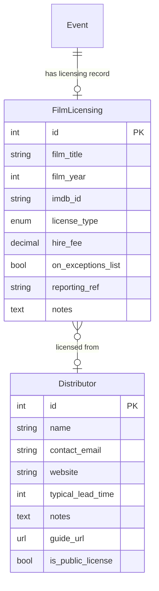

# Star and Shadow Toolkit — Tasks

**Purpose:** Design rationale, system limitations, and feature specifications.

**For current work, priorities and completion status, see:** [CURRENT_WORK.md](../CURRENT_WORK.md)

This file is **spec and rationale only** — it describes what things are and why they exist. Status tracking (open/done) lives exclusively in CURRENT_WORK.md. Do not add ❌/✅ markers here.

**Size key:** 🟢 XS (1–4h) · 🔵 S (4–16h) · 🟡 M (16–40h) · 🟠 L (40–80h) · 🔴 XL (80–160h) · ⛔ XXL (160h+)

---

## Current bugs

**Bug E** — Homepage list view layout broken by volunteer event info 🔵 S

The "list" view on the homepage is currently misaligned or layout-broken due to the addition of volunteer event/rota information. The extra data points (available slots, etc.) are likely pushing elements out of their containers or causing spacing issues in the compact list view.

**Bug F** — Grid view volunteer banners aesthetics 🟢 XS

The "volunteer only" banners in the grid view are currently not filling their cells. They should be made more aesthetically pleasing by extending them to span the full width of their grid containers.

**Bug B** — Wagtail `translation_key` column overflow 🔵 S

On MariaDB, `wagtailcore_page.translation_key` was `varchar(32)` but Wagtail 6 generates 36-character UUIDs. Creating CMS pages throws `DataError`. Fix: widen column to `varchar(36)` via migration. See CURRENT_WORK.md Done section for resolution details.

**Bug K** — Rota `&amp;` display glitch ✅ fixed 2026-03-02

**Root cause:** jeditable's `loaddata` option is NOT a value-transform callback. It provides extra POST parameters for a `loadurl` AJAX request. We don't use `loadurl`, so any function assigned to `loaddata` is silently ignored. The correct option is `data`: when set to a function, jeditable calls it with `$(element).html()` (raw innerHTML, Django-escaped) and uses the return value to populate the editor.

**Fix in `edit_rota.js`:** use `data: function(value) { ... }` with a regex decode of Django's 6 escape sequences (order matters — `&amp;` first):
```js
data: function(value) {
    return value
        .replace(/&amp;/g,  '&')
        .replace(/&lt;/g,   '<')
        .replace(/&gt;/g,   '>')
        .replace(/&quot;/g, '"')
        .replace(/&#x27;/g, "'")
        .replace(/&#39;/g,  "'");
}
```

**Server response must stay unescaped plain text** (`return HttpResponse(showing.rota_notes, ...)`). After save jeditable calls `$(self).html(result)`; the browser's innerHTML getter re-encodes `&` → `&amp;`, so the next `data` call sees `&amp;` and decodes correctly. If you add `escape()` to the response, jeditable's `.html()` double-encodes it (`&amp;` → `&amp;amp;`) and a spiral begins.

**Bug M** — Calendar edit view: simultaneous events in the same timeslot overwrite each other 🟠 L

On days with 6+ events scheduled at the same time, FullCalendar 3 renders later events on top of earlier ones rather than shrinking and tiling them side-by-side. The result is that some events become completely hidden and unreachable from the calendar view. Reproduce at `/diary/edit/calendar/` on a busy day (e.g. any of the three busy days in the seed data, currently at offsets +35, +70, and +105 from today).

Root cause: FullCalendar's column-based layout is not triggered when all events share the same time of day (all set to e.g. 19:00 with no explicit `end` time). The calendar needs each event's duration to be set so that FullCalendar can detect overlaps and split columns. With `Event.duration` now populated by `seed_dev_data`, this should improve — but busy days with many short events may still need explicit end-time rendering. A secondary fix may be needed on the FullCalendar event source view to emit `end` timestamps.

**Workaround:** Use the list view (`/diary/edit/`) on busy days — it shows all events regardless of overlap.

**Fix approach (not yet implemented):**
1. Ensure the FullCalendar event source JSON endpoint returns `end` for each event (computed from `start + Event.duration`).
2. Consider whether a day-grid view (rather than time-grid) is more appropriate for multi-room venues — though this loses time-of-day information.
3. If sticking with time-grid: add a `minTime`/`maxTime` and increase the minimum event height so short events remain clickable.

**Bug L** — Wheelchair-inaccessible role strikethrough too subtle 🟢 XS

The strikethrough symbol on the wheelchair icon (indicating a role is not wheelchair-accessible) is easy to miss — the line is thin and low-contrast. Users may sign up for a role they cannot perform without realising it has accessibility notes. Consider alternatives: a solid badge label ("not accessible"), a distinct colour overlay on the icon, a tooltip with explicit text, or a bolder visual indicator. The fix should be purely CSS/template — no data model change needed.

**Bug O** — Volunteer rota: event-name links redirect to login 🟢 XS

In `edit_rota.html` the showing title links to `edit-event-details-view` (the Event Hub). That view requires `toolkit.write` permission (Programmer tier or above). When a basic volunteer clicks it they are bounced to the login page because they're not in the Programmers group.

**Fix:** add a permission conditional in the template:

- `` → link to `edit-event-details-view`
- else → link to `single-showing-view` (the public programme page for that showing)

The "↗" public link that already exists alongside the title stays unchanged.

**Bug P** — Event Tags page: pre-Bootstrap styling and confusing UX 🔵 S

`/diary/edit/eventtags/` uses old inline CSS that predates Bootstrap (grey body, dotted border, 400px fixed width). It doesn't match the visual language of the rest of the toolkit.

The interaction model is also unintuitive: users must first tick "Promoted" on a tag and then separately use drag handles to set order. Non-promoted tags show drag handles that do nothing. The mental model of "promoted = in menu" vs "sort order" is not explained in the UI.

**Fix approach:**

- Port styles to Bootstrap 4 card/table layout (consistent with the rest of the toolkit)
- Clarify the UI: non-promoted tags should either hide their handle or show a disabled state
- Consider explanatory text or labels making the "in menu" meaning clearer

**Bug Q** — Roles page: pre-Bootstrap styling 🔵 S

`/diary/edit/roles/` has the same vintage of inline CSS as Bug P (grey body, dotted border, 400px form box, raw `<table>` without Bootstrap classes). It also doesn't match the rest of the toolkit's design language.

**Fix:** Port to Bootstrap 4 card + table layout. No UX redesign needed — the table structure (name, standard, description, delete) is clear; just needs Bootstrap table classes and a card wrapper.

---

**Bug R** — Mobile: public-site sidebar always visible, not gated by hamburger 🟢 XS

**Root cause:** The Bug I fix (2026-02-26) applied `position: fixed; height: 100vh; overflow-y: auto` to `#sidebar` in `site_custom.css` with no media query. On desktop (≥ 1000px) this is correct: the sidebar is always visible. On mobile (< 1000px) it means the sidebar sits in the fixed stacking layer at `left: 0`, visible across the whole viewport regardless of whether the hamburger has been pressed. The S+S `background-color: #e3cae3` applied to both sidebar and grid means the sidebar's nav links show through any gap in the masonry tile layout.

**Symptom:** On the homepage and other public pages, scrolling through content reveals the sidebar nav (Programme, Support Us, etc.) as a persistent layer in the top-left of the screen. It should only appear when the hamburger button is tapped.

**Fix:**

1. In `site_custom.css`: add `left: -240px; z-index: 200; transition: left 0.3s ease;` to the `#sidebar` rule (no media query — applies at all widths). This moves the sidebar off-screen by default.
2. Wrap the existing `position: fixed; height: 100vh; overflow-y: auto` rule in `@media screen and (min-width: 1000px)` only — at desktop widths, sidebar should always be visible.
3. In `site-common.js`: update the hamburger click handler to toggle a `.sidebar-open` class on `#sidebar` (sets `left: 0`) in addition to the existing `.open-sidebar` toggle on `.grid`. Also update the swipe-to-close handler to remove `.sidebar-open` from `#sidebar`.
4. Add CSS: `#sidebar.sidebar-open { left: 0; }`.

---

**Bug S** — Login page: nav bar overlaps form on mobile; style inconsistent with admin 🟢 XS

**Two sub-issues:**

1. **Nav overlap on mobile:** `login.html` extends `base_public.html`, so the login card sits inside `.grid` below the `.navigation-wrap` (hamburger bar, ~50px). The `#mobile-menu-btn` is `position: absolute; z-index: 100` within that bar. On narrow phones the login card's top margin (40px) is close to or below the button, risking overlap.

2. **Style inconsistency:** The public site uses the sidebar/hamburger nav from `base_public.html`. After login, volunteers land on toolkit pages that use the Bootstrap top navbar from `base_admin.html`. The login page sits at this junction, extending the public template, so its navigation context feels inconsistent with what comes after.

**Fix options:**

- Option A (minimal): Keep `base_public.html` extension; add `padding-top: 60px` to the `.grid` content area on mobile so the login card always clears the hamburger button.
- Option B (clean): Create a lightweight base template (e.g. `base_login.html`) with just the site logo centred, no navigation at all. This makes the login page clearly neutral — not the public site, not the admin.

Recommended: Option B for clear UX. Option A as a quick fix while the decision is made.

---

**Bug T** — Admin toolkit: mobile navbar overflow and layout issues 🔵 S

Three sub-issues:

**T1: Navbar brand image pushes toggler off-screen.** `base_admin.html` renders `` with no `max-width`. If `VENUE.internal_header_img` is a wide landscape image, it overflows the navbar on narrow screens, pushing the Bootstrap collapse toggler off the right edge.

Fix: Add `max-width: 120px; width: auto; height: auto;` to the navbar brand ``.

**T2: Body padding too large on mobile.** `base_admin.html` sets `body { padding: 5rem 1.4rem; }` globally. `5rem` top padding is meant to clear the fixed navbar (~56px ≈ 3.5rem), but 5rem overcompensates and wastes vertical space. `1.4rem` horizontal padding on a 375px viewport leaves ~330px usable width for content.

Fix: Add `@media (max-width: 576px) { body { padding: 3.5rem 0.5rem; } }` in the `base_admin.html` `<style>` block.

**T3: Rota controls bar overflows on narrow screens.** `edit_rota.html`'s `.rota-controls` bar contains two date inputs (each `width: 8em`) plus labels and three quick-select buttons. Although the controls use `flex-wrap`, the minimum combined width of date fields + labels (~320px) is already close to the usable content width after padding. On a 375px phone the controls are very cramped and may force a horizontal scroll.

Fix: Add a mobile media query in the `edit_rota.html` `<style>` block:

```css
@media screen and (max-width: 576px) {
    .rota-daterange input[type="text"] { width: 6em; }
    .rota-daterange label { display: none; }  /* "from" / "to" implied */
}
```

---

**Bug U** — Rota: excessive left indentation wastes horizontal space on mobile 🟢 XS

`ul.rota` inherits `padding: 0 0 0 40px` from the normalize reset in `static_pages.css` (line 202). Combined with `base_admin.html`'s `body { padding: 5rem 1.4rem }`, rota list items carry ~40px of blank left margin on mobile — roughly 12% of a 375px viewport.

`.showing_rota_notes` and `.event-links` both have `margin-left: 3em` (≈ 48px at typical font size), adding further waste.

**Fix:** Add to the `edit_rota.html` inline `<style>` block:

```css
@media screen and (max-width: 640px) {
    ul.rota { padding-left: 0; }
    .showing_rota_notes,
    .past_showing_rota_notes { margin-left: 0.5em; }
    .event-links { margin-left: 0.5em; }
}
```

---

**Bug V** — Tags/Roles admin: content overflows horizontally on narrow screens 🟢 XS

**V1: Tags page** (`edit_event_tags.html`): `#sortable li` is a flex row. The `.tag-options` child has `flex-shrink: 0`, preventing it from shrinking. On viewports under ~480px the combined content (drag handle + tag name + "Programme nav" label + checkbox + "Delete:" label + checkbox) overflows the card container. The `.card-body` has no `overflow-x: auto`, so it clips.

Fix: Add `overflow-x: auto` to `.card-body` in that template, or make `.tag-options` `flex-wrap: wrap` so it drops under the tag name on narrow screens.

**V2: Roles page** (`form_edit_roles.html`): The roles table has 7 columns; several have fixed widths (`width: 90px`, `width: 50px` × 4, `width: 60px`), totalling ~310px fixed before the name and description columns. On a 375px phone this table overflows by 100px+.

Fix: Wrap the `<table>` in `<div style="overflow-x: auto;">` inside the `card-body` div. This gives horizontal scrolling without restructuring the table.

---

## 8. Current limitations and known gaps

These are real limitations in the current system that a rewrite should address.

### 8.1 Rota is disconnected from volunteers
`RotaEntry.name` is free text. Volunteers are not linked to their rota slots.
Consequences:
- Can't email everyone signed up for a showing
- Can't see a volunteer's rota history
- Typos in names go undetected
- No way to confirm a volunteer is still active

**Solution spec — volunteer FK on RotaEntry** 🟡 M (~12–16h)

Add `RotaEntry.volunteer = ForeignKey(Volunteer, null=True, blank=True, on_delete=models.SET_NULL)`. Nullable so: (a) existing entries without a match keep `volunteer=None`, (b) external hires (task 9.22) stay as `volunteer=None` permanently.

Implementation steps, in order:

1. **Migration**: add the nullable FK column.
2. **Port name coercion from s+s** (`edit_views.py` `edit_rota_entry` view): when a non-superuser submits a non-empty rota slot, ignore the typed text and set `rota_entry.volunteer = request.user.volunteer`. Superusers retain free-text mode. This must land *before* the backfill migration, otherwise the backfill data is polluted with arbitrary strings.
3. **Backfill migration**: case-insensitive name match over existing `RotaEntry.name` values → `Volunteer.member.name`. Skip and log: entries with ambiguous matches (two volunteers share a name); entries with no match (typos, anonymised volunteers). This is best-effort.
4. **GDPR anonymisation update** (`volunteer_views.py:592`): primary path becomes `RotaEntry.objects.filter(volunteer=v).update(volunteer=None, name="")`. Keep the existing text-match sweep as fallback for legacy entries where the FK was never set.
5. **Pronouns tooltip update** (`edit_views.py:1380`): currently builds a name→pronouns dict and does a text lookup. Post-FK, entries with `volunteer` set go direct to `entry.volunteer.member.personal_pronouns`. Dict fallback remains for legacy entries.
6. **Display**: `edit_rota.html` and `view_rota.html` currently render `entry.name`. Post-FK, prefer `entry.volunteer.member.name` when FK is set.

**Design questions to answer before starting:**

1. **Name field retention**: keep `RotaEntry.name` as a separate field (used for external hires and legacy display), or derive it from the FK when set? Keeping it is simpler but creates two sources of truth. The safest path: keep the field, write it on sign-up from `volunteer.member.name`, and accept that it drifts if the member later changes their name.
2. **Superuser auto-link**: if a superuser types a name matching a volunteer, should the system attempt to link the FK? Convenient but adds a lookup on every save.
3. **Existing coercion gap**: master currently accepts any text from any user (coercion was never ported from s+s). Porting coercion should be a separate PR *before* the FK migration, so the backfill starts from a clean baseline.

**Unblocks**: 9.25 (tap-to-sign-up), 8.10 (volunteer workload view), "my schedule" view, reliable email to showing sign-ups, reliable GDPR erasure.

### 8.2 Volunteer induction is entirely manual
The Google Form → manual entry process has no automation. Names from the form
must be copy-pasted. There is no audit trail of who inducted whom.

### 8.3 Volunteer self-service is partial
Volunteers can log in, view the rota, and sign up for slots via an
interactive click-to-edit interface at `/diary/edit/rota/`. This is gated by
the `diary.change_rotaentry` Django model permission.

**Name coercion (S&S branch only, not yet on master):** when a volunteer
clicks a slot and submits any non-empty text, the server ignores what was
typed and instead saves `request.user.volunteer.member.name` — i.e. the
logged-in user's own name. This prevents volunteers from writing each other's
names into slots. Submitting an empty value clears the slot. Any volunteer
with the permission can clear any slot, including one filled by someone else
— there is no ownership check on deletion. Superusers (Panopticon) bypass the
coercion and can write any text freely.

This coercion logic exists on the `s+s` branch but has not yet been ported
to `master`, where the rota edit view currently accepts and saves whatever
text is submitted verbatim.

Editing a volunteer's own profile (`/volunteers/N/edit/`) requires
`toolkit.write` (Panopticon level) — there is no self-editing exception in
the current code.

There is no "my schedule" view — a volunteer cannot see a filtered list of
only the showings they are signed up for.

### 8.4 No reserve/standby slots
If someone drops out of a rota role, there's no mechanism for reserves. This
is handled informally (e.g. messaging the volunteers list).

### 8.5 Email list is managed externally
The link between "volunteers in the Toolkit" and "members of the Simplelists
mailing list" is entirely manual. There is no synchronisation.

A compounding problem: the volunteer list and the mailing list are two
separate systems with no shared identifier, but in practice one person's
presence on a training-specific mailing list (e.g. the bar volunteers list)
is often managed as a side-effect of their induction. When someone attends a
bar induction, they are added to the bar mailing list by the person running
the session — but this is a manual step that depends on whoever ran the
session remembering to do it. There is no record in the toolkit of which
lists someone is on.

Consequences:
- A volunteer who is bar-trained may not be on the bar mailing list if
  their induction was not followed up correctly
- If someone leaves and re-joins, they may not be re-added to specialist
  lists during their return induction, unless whoever runs it explicitly
  checks
- Someone may want to stop receiving emails from a list (e.g. bar) while
  remaining active in that role — but there is no clean way to distinguish
  "unsubscribed from list" from "no longer qualified"
- Over time, mailing lists accumulate former volunteers who have never been
  removed — making them less useful and noisier

### 8.6 Rota view is a wall of text
The rota view shows all events in a date range with all their role slots and
rota notes. There's no filtering, grouping, or visual hierarchy. Large rota
notes dominate the view.

### 8.7 No programming pipeline / approval process
Events go straight from "created" to "confirmed" without any formal approval
step. Proposed events are reviewed in Monday meetings (often added on to meetings that are primarily about other things), but there's no standard process for them hitting the system first. Sometimes people pencil in dates they want to reserve on the toolkit but generally this planning stuff happens privately. It might be beneficial to have a clear queue of things people want to do (the "ideas for March" etc. sections are a hint that this was once at least tried out), streamlining Monday meetings, where the meeting can take a look at the queue of proposals, clearly review the core info (e.g. terms, dates, rooms required), check it against core programming guide criteria, and then make a decision: accept / deny / suggest changes with conditional approval / suggest changes and bring back to another Monday meeting.

### 8.8 Training records are too rigid to model real role requirements
The current training record system tries to fit all role qualifications into a
single model: a logged event with a trainer name, a date, and a role. Records
expire after 12 months and must be re-logged. This overhead means records are
not maintained, and as a result the system is not used as a gate on role
sign-up at all.

The deeper problem is that the real qualification requirements (see rule 13)
are fundamentally different in kind, and a single model cannot represent them:

- **Induction-granted certificates** (food hygiene level 1) are delivered
  in-house as part of the monthly café induction. The gate is the induction
  itself — a boolean, like bar. The level 1 certificate is an outcome of
  attending, not something obtained separately.
- **External certificates** (food hygiene level 2) need a record of the
  certificate itself — issuing body, expiry date — not an internal training
  log. Expiry genuinely matters here and should be surfaced.
- **Internal tiered training** (projectionist levels) needs a progression
  model, not a flat list of records. Level 2 implies level 1; re-logging
  after 12 months makes no sense for a skill that doesn't expire.
- **Informal shadow-based progression** (sound/tech) should not be
  formalised at all. A lightweight "this volunteer is comfortable with this
  role" flag, set by the volunteer or a coordinator, is sufficient.
- **Induction gates** (bar) are binary — you have had the induction or you
  haven't. A single boolean per volunteer is the right model, not a
  timestamped log.
- **Nomination processes** (keyholder) are social and governance decisions,
  not training events. The system should record the outcome (this person is a
  keyholder) without trying to model the process that led there.

A rewrite should model these as distinct types rather than forcing them
through a single `TrainingRecord` schema. Hard gates (bar induction, food
hygiene cert) can block sign-up. Soft signals (sound/tech comfort flag) can
inform but not block. Keyholder status is a property of the volunteer record,
not a training record at all.

It's worth noting a real world pain point caused by this: Community Kitchen log their food hygiene level 2 certificates, which were agreed by policy to need refreshing every 2 years. Jonny wrote a spreadsheet for logging these, but this was never widely adopted in a way that would have been much easier if a culture of recording training was baked in from the start, and the toolkit had a frictionless ready-baked solution, as opposed to the (rather snazzy, if I do say so myself) google sheet that highlights when people are close to needing refreshers.

### 8.9 Training records expire silently
There's no notification or dashboard view highlighting volunteers whose
training has lapsed or is about to lapse. (This is a secondary issue given
8.8 — solve the friction problem first.) See 8.8 example at the end of Community Kitchen certs.

### 8.10 No view of volunteer workload
There's no way to see how many hours or shifts any given volunteer has
committed to, or to spot volunteers who are over-stretched or disengaged. Or invite dormant volunteers to re-induct (or want to be removed from the system, helping with good GDPR compatible processes?).

### 8.11 Room booking model is too simple for multi-room events
A `Showing` has a single optional `room` field. This works for a simple
screening in one room, but many events at S&S require multiple rooms at
different times within the same event — for example:

- Venue access from 4pm for general setup
- Cinema booth from 6pm for tech and AV prep
- Cinema itself from 7pm to 9pm for the event proper

The current system has no way to express this. The workarounds in use are:

1. **Create multiple events** — programmers book each room as a separate diary
   entry, cluttering the programme with fake events and disconnecting the rota
   from the real event.
2. **Create multiple showings of the same event** — slightly better, but the
   programme then shows the same event listed multiple times at different
   times, which is confusing publicly and internally.
3. **Do nothing** — the room bookings are informal or forgotten, leading to
   undetected clashes when two events assume they have access to the same
   space at the same time.

There is also no clash detection: the system does not warn when two confirmed
showings overlap in the same room.

### 8.12 Collectives are not modelled in the toolkit

The Star and Shadow operates through a network of informal working groups and
collectives — Bar Collective, Programming Collective, Technical Collective,
and various others — which self-assemble around a shared interest and operate
with significant autonomy. These are not captured anywhere in the toolkit.

**Current state:**

- Groups communicate primarily through mailing lists managed in
  [Simplelists](https://simplelists.com/). Creating or administering a list
  requires knowing someone who has Simplelists admin access — a small and
  informally defined group. There is no self-service route.
- There is no central directory of which collectives exist, what they do, or
  who is in them. This is sometimes intentional: groups may prefer not to
  be publicly findable.
- There is one collective listed in the info pages via Wagtail, accessible from the public site: Community Kitchen. A solution could have a "public copy" blurb about the collectives which would massively help prospective volunteers get a sense of how the cinema works, and if they'd like to join. Collectives that people might not assume operate out of a cinema - Community Kitchen, print room, library - might all benefit from being more visible, and we might get new folks approaching us for inductions because they're interested in those aspects.
- A volunteer wanting to contact, say, the Tech Collective has no
  in-system way of discovering who is in it or how to reach them. They must
  ask around in person or via the general mailing list.

**A specific pain point — new programmers and keyholders:**

A newly onboarded programmer must arrange keyholding cover for their event.
Keyholders are an informal group of long-standing trusted volunteers; there is
no list in the toolkit, and no automated way to request one. In practice:

- The programmer must know (or be pointed to) individual keyholders by name
- They make contact directly, often via personal messages or the general list
- Keyholders agree or decline based on personal availability and their
  relationship with the programmer

This friction might not be entirely accidental. Having to personally approach
keyholders — and earn their willingness to vouch for a showing — is a
lightweight form of community vetting. Any feature that automates this away
entirely should be considered carefully. The right response may be to make the
*list* of keyholders visible in the toolkit (so new programmers know who to
approach) while leaving the actual agreement as a human interaction.

**What the toolkit could usefully do:**

- Expose a read-only directory of active collectives and their public contact
  points (e.g. mailing list address), where the collective has opted in to
  being listed
- Allow a Role to be flagged as `keyholder_capable`, making it easy to surface
  that list without building a full collectives model
- Note: full collective membership management (join requests, mailing list
  sync, governance) would be a large feature (🔴 XL or ⛔ XXL) and is not
  recommended as an early priority

### 8.15 Frontend library debt — legacy and EOL dependencies

Several vendored and CDN-referenced frontend libraries are outdated, some
critically so. Audited February 2026.

#### 🔴 Critical — CVEs / confirmed EOL

| Library | Version in use | Issue |
| --- | --- | --- |
| CKEditor | 4.7.3 | ✅ resolved. Replaced with Quill 2.0.3 (vendored). `HtmlTextarea` widget re-pointed to `js/lib/quill/quill.js` + `css/lib/quill.snow.css`; `htmltextarea.html` rewritten. Old `static_common/js/lib/ckeditor/` directory deleted. |
| jQuery (public site) | 2.1.3 via Google CDN | ✅ resolved. Replaced CDN reference with locally vendored `jquery.min.js` (3.5.1) in both `templates/base_public.html` and `star_and_shadow_templates/base_public.html`. No external dependency, no EOL version. |
| Google Fonts (all templates) | HTTP URL | ✅ resolved. Fixed `http://` → `https://` in `base_admin.html` (live request) and removed dead IE8 conditional comment blocks containing `http://` from all three base templates. |

#### 🟠 High — Abandoned or no longer receiving security patches

| Library | Version in use | Issue |
| --- | --- | --- |
| jQuery UI | 1.11.0 (2014) | ✅ Resolved. Updated to 1.13.3 (current LTS, drop-in). Long-term: replace datepicker with native `<input type="date">`. |
| Bootstrap | 4.6.2 | No longer maintained. BS5 breaks `data-toggle` → `data-bs-toggle`, `mr-auto` → `ms-auto`, `sr-only` → `visually-hidden`. Migration is entangled with django-crispy-forms (see below). Effort: 🟠 L. |
| Chosen | 1.1.0 | ✅ resolved. `ChosenSelectMultiple` now extends plain `SelectMultiple` with no custom Media or template. `volunteer_training_report.html` updated to use native `.change()` instead of `.chosen()`. All Chosen static files and `chosenselectmultiple.html` template deleted. |

#### 🟡 Medium — Outdated pins or frozen libraries

| Library | Version in use | Issue |
| --- | --- | --- |
| FullCalendar | 3.5.1 (2017) | Superseded by v6 (no jQuery, TypeScript, ESM). Improving the calendar edit view would warrant this upgrade; it is a large migration. Effort: 🔴 XL. |
| Moment.js | bundled in FC | Frozen (maintenance-only). Automatically resolved if FullCalendar is upgraded to v6. |
| html2text | 3.200.3 (2015) | ✅ resolved. Unpinned in `requirements/base.txt`; pip will now resolve the current release. |
| django-crispy-forms | <1.13 | EOL; v2.x separates template packs. Migrate to `crispy-forms>=2.0` + `crispy-bootstrap5`. Entangled with Bootstrap 5 upgrade above. |
| mysqlclient | 2.1.0 | ✅ resolved. Updated constraint to `>=2.2.0,<3` in `requirements/docker.txt`. |

#### 🟢 Low — Dead code to delete

- `respond.min.js` — IE8 media-query polyfill. IE8 is <0.01% of users. ✅ Removed
  (file deleted; script tag removed from both public base templates).
- IE8 conditional comments — `<!--[if lte IE 8]>` blocks in `base_public.html`
  and `base_admin.html` load six redundant Google Fonts requests that no browser
  will ever make. ✅ Removed (no longer present in templates).
- `wysihtml5.css` — WYSIHTML5 has been unmaintained since ~2014; verify it is not
  referenced anywhere and delete it. ✅ Deleted 2026-03-03 (confirmed unreferenced).

#### Recommended order of attack

1. ✅ HTTP → HTTPS on admin Google Fonts
2. ✅ jQuery 2.1.3 → 3.7+ on public site (local vendor)
3. ✅ Unpin `html2text` and `mysqlclient`
4. ✅ CKEditor 4 → Quill 2 (security-critical)
5. ✅ jQuery UI 1.11 → 1.13
6. ✅ Delete Respond.js and IE8 conditional comment blocks
7. ✅ Delete `wysihtml5.css`
8. ✅ Chosen → native `<select multiple>`
9. Bootstrap 4 → 5 + `crispy-forms` 2.x (batch together) — Effort: 🟠 L
10. FullCalendar 3 → 6 (large; do when calendar editing needs attention) — Effort: 🔴 XL

### 8.16 No default image when creating an event

When a programmer creates a new event without uploading a poster, the event has no image and appears imageless on the public programme grid. This is more noticeable at S&S than at the Cube because the PVSL licence means film posters often can't be published until shortly before the event.

**Partial solution already in the codebase:** `seed_dev_data` includes `_make_poster_image` — a bold typographic poster generator that takes the event name and a tag-derived colour, renders it at 800×450 with a gradient background, and stretches each line of text to fill the full frame width. It produces something that looks intentional rather than broken.

This could be wired up as an on-demand tool for programmers: a button on the event edit page ("Generate placeholder image") that calls a view invoking the same logic and attaches the result as a `MediaItem`. The bundled `DejaVuSans-Bold.ttf` in `seed_data/fonts/` is available to the server at runtime.

**Not yet implemented.** See 9.57 for the proposed feature spec.

---

---

## 9. Proposed new features

The following features have been identified as priorities for a future version.
They are organised by area.

### 9.2 Event programming pipeline

**Goal:** Formalise the process of proposing and approving events, aligned with
how Monday programming meetings actually work.

#### Background: the programming etiquette guide

The collective has agreed a set of norms for programming that is currently
documented in a written guide. The key principles most relevant to the
toolkit are:

**Pre-requisites for programming (guidance, not hard gates):**
- Volunteers should do approximately 10 shifts before programming their own
  event, and maintain roughly 5 shifts in the preceding 6 months
- They should attend Monday meetings and observe how decisions are made
  before proposing events of their own

These are social norms, not enforceable rules. The system currently has no
way to verify shift counts (rota names are free text — see 8.1), and even
once that is fixed, enforcing a gate would be antithetical to the ethos.
The appropriate toolkit response is to **display these requirements as
guidance** at the point of event creation, not to block submission.

**At the Monday meeting — the programmer should bring:**
- An itemised budget breakdown (expected costs and income)
- If total estimated costs exceed **£500** (or **£750** for music events),
  the proposal is referred to the Finance Collective for further
  authorisation before it can be confirmed

**After approval — the programmer is responsible for:**
- Adding themselves to the Programmer rota slot immediately
- Putting the event on the rota as soon as possible, and no less than
  **one week before** the showing
- Checking rota sign-up well in advance — not the day before
- Accurately identifying the number and types of volunteer roles needed
- Noting shift times for multi-shift roles (e.g. bar shift 1: 5:30–8pm,
  shift 2: 8–10pm)
- Arranging food for late nights and long events (and including this in
  the agreed budget)
- Keeping the place clean afterwards — adding cleaning and washing-up
  roles to the rota if needed
- Assisting the keyholder in shutdown
- **Not signing up for additional roles** if they are the programmer —
  their job is to be present and coordinate, not to be tied to a specific
  task

The financial ethos is explicit in the guide: *"A budget is not a goal.
It's all our money, so be thrifty where you can."* It costs approximately
**£200 to open the doors to the public**; that baseline is worth surfacing
to new programmers who may not have a feel for what events cost.

#### Features

- **Draft / pencilled-in state** — events can be created in a "proposed"
  state before being discussed at a meeting
- **Programming queue** — a view showing all proposed events in submission
  order, suitable for working through as a stack at a meeting
- **One-click approval / rejection** — during a meeting, events can be
  quickly approved (moved to "confirmed") or rejected (moved to "rejected")
  with a reason
- **Programming criteria fields** — structured fields to capture itemised
  costs (hire, tech, performer fee, accommodation, travel, food, other),
  expected revenue, split/deal type, and tech requirements, presented at
  the Monday meeting. These feed directly into the break-even calculator
  (section 9.9).
- **Finance Collective referral flag** — when total estimated costs exceed
  the configured thresholds (`FINANCE_REFERRAL_THRESHOLD_STANDARD = 500`,
  `FINANCE_REFERRAL_THRESHOLD_MUSIC = 750`), the event is flagged in the
  programming queue as requiring Finance Collective sign-off before
  confirmation. The flag is a visible warning, not a hard block — the
  collective governs this, not the system.
- **Etiquette guide link** — a visible link to the programming etiquette
  guide displayed on the event creation screen and in the programming queue.
  Implemented as a `PROGRAMMING_ETIQUETTE_URL` settings variable. A static
  URL pointing to the document in NextCloud is sufficient; the guide does
  not need to be migrated into the toolkit.
- **Pre-requisite reminder** — at the point of first event creation, a
  brief, non-blocking notice: *"Before programming your first event, have
  you completed around 10 volunteer shifts and attended a Monday meeting?
  [Programming guide ↗]"* — displayed once (or until dismissed), not on
  every subsequent event.
- **Rota deadline warning** — if a confirmed showing is less than 7 days
  away and has no rota entries, show a warning to the programmer on the
  event's edit page and in the rota view.
- **Auto-populate programmer rota slot** — when an event is approved from
  the queue, the name(s) of whoever proposed it are automatically written
  into the Programmer rota slot(s) for each showing. This removes the most
  common omission from the rota and means the programmer's accountability
  is recorded from the moment an event is confirmed.
  Where multiple people co-proposed an event, multiple Programmer slots are
  created accordingly.

### 9.2 Volunteer rota — account-linked sign-up

**Current state:** The rota at `/diary/edit/rota/` is already self-service in a
crude sense — any logged-in volunteer can click any slot and type a name. The S&S
branch adds name coercion (it ignores what you type and saves the logged-in user's
own name instead), but this is not yet on master. Either way, the entries are plain
text with no identity link.

**Goal:** Replace free-text rota entries with account-linked sign-ups, so that
the system knows *who* is actually on the rota — enabling automatic reminders,
"my upcoming shifts" views, and drop-out notifications.

Features:
- **Volunteer accounts** — each volunteer has a login (username + password or
  magic link via email)
- **Sign up for rota slots** — volunteers can sign up for open slots on showings,
  with slots linked to their account (not free text)
- **Drop out of a slot** — with notification to the organiser
- **Reserve / standby slots** — volunteers can mark themselves as "reserve" for
  a role, and be notified if the primary person drops out
- **Email reminders** — automatic reminders to volunteers who are signed up,
  sent N days before a showing
- **My schedule view** — a volunteer can see all showings they're signed up for

### 9.3 Volunteer rota — improved management view

**Goal:** Make the rota view less overwhelming — especially for new and
neurodivergent volunteers — while making it easier for everyone to find
events they can help with.

The current rota is a dense wall of text: every showing, every role slot, and
all rota notes are displayed at once. This is a significant barrier for new
volunteers who don't yet know the venue's rhythms, and for anyone who finds
dense information layouts difficult to process.

#### Reducing information overload

- **Collapse rota notes by default** — show a short summary (first line or
  first N characters) with an expand button. Long operational notes are useful
  but shouldn't dominate the view for someone just looking for a shift to join.
- **Filter by tag** — show only showings of a given event type (e.g. "film",
  "music"). Reduces the list to a manageable size for volunteers who only want
  to help at certain kinds of events.
- **Filter to show only events with vacancies** — a one-click way to hide
  fully-staffed showings. A new volunteer scanning for something to join
  shouldn't have to read every showing to find open slots.
- **Colour-coded vacancy status** — at a glance, showings where key roles are
  unfilled are visually distinct from fully-staffed ones.

#### Friendly for new volunteers

Not all roles are equally approachable. Usher and Box Office are low-barrier
entry points: they require no specialist knowledge, are well-supported on the
night, and are explicitly described as "easy to drop into" in the venue's
culture. The rota should reflect this.

- **"Good for new volunteers" role flag** — a boolean on `Role` (e.g.
  `newcomer_friendly`) that can be set by Panopticon. Roles flagged this way
  are visually marked in the rota (e.g. a small label or icon) so new
  volunteers can immediately see where they're most welcome.
- **Newcomer-filtered view** — a toggle or separate URL that shows only
  showings with open newcomer-friendly slots. A new volunteer sent a link to
  this view sees exactly what they need without any noise.
- **Role guides** — each `Role` can have an optional short description (one
  or two sentences) and an optional URL linking to a guide or tutorial video.
  The venue already hosts role-relevant training content on its YouTube
  channel; the same pattern applies to written guides in NextCloud or
  elsewhere. No extra infrastructure is needed — just URL fields on the
  `Role` model.

  The design challenge is surfacing these guides for people who need them
  without cluttering the interface for experienced volunteers who find them
  noise. The goal is *findable but not intrusive*: a veteran should be able
  to use the rota for months without the guides getting in their way, while a
  newcomer should be able to find them without asking anyone.

  Options for achieving this, in order of increasing sophistication:

  - **Icon-only affordance** — a small, visually quiet icon (e.g. a book or
    info symbol) next to the role name, with no accompanying text. Experienced
    volunteers develop habituation and stop seeing it; newcomers are curious
    enough to click. The guide opens in a new tab or a small popover. This
    requires no account history and works immediately.
  - **Shown only on first sign-up** — if volunteer accounts track rota
    history, the guide is shown more prominently the first time a volunteer
    signs up for a given role (e.g. a "first time doing this? here's a
    guide" prompt inline), and reduced to the quiet icon thereafter. Requires
    rota entries to be properly linked to accounts (see 9.2).
  - **"New to this role" opt-in** — a small checkbox or toggle at the point
    of signing up: "first time doing this?" Checking it expands the guide
    inline. Opt-in, so veterans never trigger it and newcomers get exactly
    what they need at the moment they need it. Works without account history.

  **On using sign-up counts:** if rota entries are linked to volunteer
  accounts, the system will naturally accumulate a count of how many times
  each volunteer has signed up for each role. This is potentially useful —
  for surfacing guides on first sign-up, for the wellbeing dashboard (9.5),
  and as a lightweight proxy for experience in informal roles like sound/tech
  where no formal training gate exists.

  However, there are real risks in how this data is used or displayed:

  - **As a gate:** using sign-up count to restrict access to roles ("you
    must have done this N times before signing up") would be antithetical to
    the non-hierarchical ethos and replicate the problems of the current
    training record system in a different form.
  - **As a visible score:** displaying counts to other volunteers could
    create informal hierarchy and social pressure, even unintentionally.
    A volunteer with 2 sign-ups next to one with 20 may feel judged even if
    no gate exists.
  - **As a private signal:** the count used only internally — to decide
    whether to show a guide, or to flag role distribution in the wellbeing
    dashboard to coordinators — is much safer. The volunteer doesn't see a
    score; they just get or don't get the guide.

  The principle to hold onto: sign-up history should inform the system's
  behaviour towards the volunteer (show them a guide, suggest they shadow),
  never determine what they're permitted to do.

#### Programmer notes in the rota

Programmers sometimes need to leave notes specific to an event — technical
requirements, access instructions, things volunteers need to know before they
arrive. At the moment these go into the same `rota_notes` field as everything
else, where they can get buried or mixed with sign-up chatter.

There is tension here: making programmer notes visually prominent risks
implying a hierarchy that doesn't reflect the venue's non-hierarchical ethos.
The design should resolve this by treating it as *contextual* rather than
*authoritative* — useful information from the person who knows the event best,
not instructions from above.

Options to consider:

- **Inline highlight** — programmer notes appear in the same notes area as
  other rota notes but are visually marked (e.g. a subtle left border, a
  "from the programmer" label). Notes remain in the same flow; no separate
  section implies no separate status.
- **Collapsible header block** — a separate field (`Showing.programmer_notes`)
  displayed in a collapsed block above the main rota notes, expandable on
  demand. Keeps event-specific context out of the way until needed, without
  losing it. The label could be neutral ("Event notes") rather than
  "Programmer notes" to soften the hierarchy signal.

Either approach requires a separate `programmer_notes` field on `Showing`
(so the source can be distinguished even if the display merges them).
The inline approach is more aligned with the non-hierarchical ethos; the
collapsed header block is more practical for longer technical notes that
would otherwise dominate the view.

#### Programmer accountability in the rota

The programming etiquette guide makes several concrete demands of programmers
that the rota should help enforce (or at least surface). In order of how
directly they translate to toolkit features:

**"Add yourself as the Programmer on the rota."**
- **Warning highlight for unfilled Programmer slots** — any showing where the
  Programmer role is empty gets a distinct visual treatment (warning colour or
  symbol) in the rota view. This is separate from the general vacancy
  highlighting: a missing projectionist is a staffing gap; a missing programmer
  is also the person responsible for the event not having confirmed they'll be
  there.
- **Auto-populate from the programming queue** — see 9.2: when an event is
  approved, the proposing programmer's name is written into the Programmer slot
  automatically. The warning highlight serves as a fallback for events that
  bypass the queue or where the slot has been cleared.

**"Put your event on the rota ASAP and no less than a week before."**
- **Rota deadline warning** — if a confirmed showing is less than 7 days
  away and has no rota entries at all, flag this prominently to the programmer
  on the event edit page and in the programming queue. This is a soft warning,
  not a block.

**"Avoid signing up for additional roles if you are the programmer."**
- This norm is hard to enforce technically (the system doesn't know whether
  a role sign-up is "additional" or the primary Programmer slot). The most
  practical approach is guidance: display a note when a volunteer who is
  already in the Programmer slot attempts to sign up for another role on the
  same showing. The note can read something like: *"You're already the
  programmer for this event — consider whether you need to be in a specific
  role, or whether being available to coordinate is more useful."* Non-blocking.

**Multiple programmers:** events sometimes have two or more people
co-programming. The data model already supports multiple `RotaEntry` records
for the same role (via `rank`), so multiple Programmer slots are possible
without schema changes. The UI should make it easy to add a second Programmer
slot at event creation time, and the auto-populate should create one slot per
co-proposer from the queue.

**Programmers acting for external hires:** when `Event.outside_hire` is
`True`, the programmer is acting as the internal liaison for an external group
rather than as the creative lead. The Programmer rota slot still represents
the person responsible on the night, but the display could optionally note the
external hire context (e.g. "Programmer (external hire liaison)") to avoid
confusion for other volunteers about who to contact with questions about the
event vs. questions about the venue.

#### Shadow role support

**Background and current pain point.** The history of shadowing at S&S
illuminates the design problem clearly, particularly for projection:

- *Phase 1 (freeform):* Volunteers wanting to shadow wrote notes in the
  rota text field asking the projectionist if they could shadow. With no
  defined slot, there was no control over who wrote what or when, and
  whether the projectionist even saw the request.
- *Phase 2 (fixed shadow slot):* A "Projectionist (trained shadowing)" role
  was added to all cinema events. This solved the ad-hoc problem but created
  a new one: volunteers signing up to shadow *before* a projectionist had
  signed up. This placed the projectionist in the uncomfortable position of
  having to refuse a shadow if they weren't comfortable with one — after the
  shadow had already publicly committed.
- *Current state:* The shadow slot exists on all cinema events, accompanied
  by a large block of full caps warning text in every rota notes
  field:

  > *IN ORDER TO SHADOW PROJECTION YOU NEED TO HAVE DONE A PROJECTIONIST
  > TRAINING FIRST! PLEASE DO NOT SIGN UP FOR SHADOWING A PROJECTIONIST
  > BEFORE A PROJECTIONIST HAS SIGNED UP!*

  This text appears repeatedly across the rota and is one of the most
  visible friction points in the current system.

**Design goals.** A better system should:
1. Make the shadow slot only available once the primary role is filled
2. Give the person taking the primary role discretion over whether they want
   a shadow
3. Avoid requiring programmers to manually configure shadowing for every event
4. Not generate repeated boilerplate text in rota notes

**Proposed model — three-mode shadow control.**

Programmers can set a shadow policy for each role slot when creating or
editing an event (or its template). Three options:

| Mode | What it means | Visible in rota as |
|---|---|---|
| **Solo** | No shadow slot. The role is taken by one person only. | Single role slot as normal |
| **Shadow open** | A shadow slot is automatically unlocked once the primary slot is filled. Any qualified volunteer can sign up to shadow after that. | Primary slot + shadow slot (greyed out / locked until primary is filled) |
| **Shadow at primary's discretion** | A shadow slot is *offered* by the person who fills the primary role. They can open it after signing up, or leave it closed. | Primary slot + a toggle/button for the primary volunteer: "Open to a shadow?" |

The default for most roles should be **Solo**, and templates can set
per-role defaults. The "shadow at primary's discretion" mode is specifically
designed for the projectionist case: the slot does not exist until the
projectionist creates it.

**Behaviour details:**

- In **Shadow open** mode: the shadow slot appears in the rota but is
  visually locked (e.g. greyed out) until the primary slot has a name in
  it. Once filled, the shadow slot becomes clickable. If the primary slot
  is cleared, the shadow slot locks again (and any existing shadow name is
  removed with a notification).
- In **Shadow at discretion** mode: after a volunteer fills the primary
  slot, they see an "open this role to a shadow?" toggle in their view of
  the rota. If they toggle it on, a shadow slot appears. If they toggle it
  off (or never toggle), no shadow slot is visible to others. The
  projectionist can also close the shadow slot after it has been opened
  (e.g. if they later decide they'd prefer to concentrate), which removes
  the shadow name with a notification.
- In all modes, the **shadow slot is visually distinct** from the primary
  slot — a different icon, indentation, or label (e.g. "→ Shadowing [Role]")
  to make clear which is the primary commitment.

**Volunteer capacity in the cinema.** Separately from shadowing, the cinema
has a finite number of volunteer seats (~8 at the back of the room for
non-public volunteers, before people spill onto uncomfortable brought-in
chairs). On fully booked events this has caused genuine friction — volunteer
seats taken by the time volunteer attendees want to join. A future feature
could:

- Flag a threshold on a `Room` or `Showing` (e.g. `volunteer_seat_count`)
- When the number of rota entries for a showing approaches or exceeds that
  count, show a warning to programmers and volunteers signing up
- This is not a hard block (volunteers can always bring in extra chairs) but
  a soft nudge to keep expectations managed

**Data model change required:**

```
RotaEntry:
  + shadow_mode: enum [solo, open, discretion]  # on the template slot
  + is_shadow: bool  # on each actual entry

Role:
  + default_shadow_mode: enum [solo, open, discretion]
```

The `is_shadow` flag distinguishes display and responsibility without
requiring a separate model. The `shadow_mode` lives on the `RotaEntry`
template (the slot definition for an event/showing), not on the volunteer's
sign-up record.

**Size estimate:** 🟡 M — 16–30h. The UI changes (locked/unlocked slots,
discretion toggles) are non-trivial, but the data model change is
straightforward. Requires the rota to be linked to volunteer accounts (8.1)
for the discretion toggle to have a meaningful "primary volunteer's view".

### 9.4 Volunteer induction workflow

**Goal:** Replace the Google Form → manual entry process with something integrated.

Features:
- **Self-registration form** — public-facing form where prospective volunteers
  can submit their details (replaces Google Form)
- **Pending volunteer queue** — admins see a queue of submitted applications
- **Induction session attendance tracking** — mark which sessions someone attended
- **One-click activation** — once verified, activate the volunteer with a single
  action that creates their account and notifies them
- **Welcome email** — automatic email sent on activation with login details and
  next steps
- **Induction checklist** — record which induction topics were covered for each
  new volunteer

### 9.5 Volunteer wellbeing dashboard

**Goal:** Give coordinators visibility of volunteer workload and engagement, to
support a healthy and sustainable volunteer community.

Features:
- **Rota commitment overview** — for a given date range, show each volunteer's
  total number of signed-up shifts and roles
- **Role distribution** — see which roles are under-resourced (few qualified
  volunteers) and which are well-covered
- **Engagement trend** — flag volunteers who have not signed up for any shifts in
  the last N weeks (potential disengagement)
- **Upcoming capacity alert** — compare the number of rota slots required for
  confirmed events in the next month against the recent monthly average of
  volunteer hours. Alert if the ratio is unusually high.
- **Training lapse alerts** — list volunteers whose training records have expired
  or are due to expire within 30 days

### 9.6 Communication improvements

**Goal:** Reduce manual steps in keeping volunteers informed.

Features:
- **Email volunteers on a showing** — send a message to all volunteers signed up
  for a specific showing (requires volunteer accounts + rota linked to accounts)
- **Email volunteers by role** — send a message to all active volunteers qualified
  in a specific role
- **Rota vacancy alert** — automatic email to a volunteer mailing list when a
  showing has unfilled key roles within N days
- **Direct sync with mailing list** — rather than emailing admins to manually
  update Simplelists, the system manages list membership directly via an API
  (if Simplelists exposes one, or migrate to a different list manager)

### 9.7 Room booking — multi-room and clash detection

**Goal:** Let programmers accurately express which rooms an event needs and
when, and surface clashes before they become a problem on the night.

#### The data model change

Replace the single `room` FK on `Showing` with a separate `RoomBooking`
entity:

```
RoomBooking {
    showing     FK → Showing
    room        FK → Room
    start       datetime   (may differ from Showing.start)
    end         datetime
    notes       text       (optional — e.g. "tech setup only, not public")
}
```

A showing can have multiple `RoomBooking` records. `Showing.start` remains
the canonical public-facing start time. Room bookings record the full
footprint of the event in the building, which is often earlier and
occasionally later.

This change is backwards-compatible in behaviour: existing single-room
showings simply have one `RoomBooking` with the same start as the showing.

#### Clash detection

When a programmer saves a room booking, the system checks for any other
confirmed showing with a `RoomBooking` in the same room whose time window
overlaps. If a clash is found:

- Show a clear warning (not a silent failure — the programmer may have a
  legitimate reason, e.g. two events sharing a foyer at different ends)
- Require an explicit acknowledgement to proceed past the warning
- Surface existing clashes in the room availability view (below)

#### Room availability view

A calendar or timeline view showing each room's booking footprint across a
date range. Allows programmers to see at a glance whether a room is free
before proposing an event, without having to check every individual showing
in the diary.

#### "Other rooms" column — minor spaces without their own diary column 🔵 S (6–10h)

**Goal:** Make every bookable room in the building recordable in the diary
without adding a full column for each minor space. Useful for brief
notifications ("Middle Corridor blocked 14:00–15:00 for exhibition install").

**Design:**

1. **Model change** — add `Room.show_column = BooleanField(default=True)`.
   Rooms with `show_column=False` are fully bookable but bundled into a
   shared "Other" column. One migration; all existing rooms default to `True`.

2. **Seed data / rooms.toml** — activate currently commented-out rooms
   (Middle Corridor, Kitchen, Snug, Projection Booth) with
   `is_primary=false, show_column=false`. Add a `show_column` key to the
   toml format and the seed loader.

3. **Diary table (`edit_event_index.html` + `edit_views.py`)** — pass
   `column_rooms` and `other_rooms` lists separately to context. Add an
   "Other" column at the right of the room columns; its cell for a given
   time slot lists all non-column room bookings at that slot as plain text
   (e.g. "Middle Corridor"). New `other_bookings_at` simple_tag in
   `hash_filter.py` (same pattern as `showing_for_room_at`).

4. **Calendar (`edit_views.py` `edit_diary_data` + `calendar_index.js` +
   `edit_event_calendar_index.html`)** — add a synthetic `{"id": "other",
   "title": "Other rooms"}` resource to the FC resources list. Events for
   non-column room bookings get `resourceIds: ["other"]` and their room name
   prepended to the event title. Add an "Other rooms" checkbox to the room
   filter bar. The `rooms_and_colours` context list excludes non-column
   rooms; a separate `has_other_rooms` flag triggers the synthetic resource.

**Files touched:** `models.py`, new migration, `rooms.toml`, seed loader,
`edit_views.py` (two functions), `hash_filter.py`, `edit_event_index.html`,
`edit_event_calendar_index.html`, `calendar_index.js`. (~8 files)

**Not needed:** no change to `RoomBookingForm` — all rooms are already
selectable there; no change to clash detection logic.

### 9.9 Break-even calculator for programmers 🟢 XS

**Goal:** Help programmers quickly work out whether a proposed event is
financially viable, without needing a spreadsheet.

A simple in-browser calculator — no server round-trip needed — that takes:

| Input | Example |
|---|---|
| Venue hire cost (if any) | £80 |
| Technical costs (equipment hire, etc.) | £30 |
| Artist/performer fee | £150 |
| Accommodation for artist(s) | £60 |
| Travel costs for artist(s) | £40 |
| Food for volunteers (late nights / long events) | £30 |
| Other costs | £20 |
| Room capacity | 80 |
| Door split arrangement (%) | 70% to artist, 30% to venue |
| Ticket price / expected average | £5 (see PAYF note below) |

Outputs:

- **Break-even attendance** — the number of tickets that must be sold to
  cover all costs
- **Break-even as % of capacity** — how full the room needs to be
- **Revenue at various fill levels** — e.g. profit/loss at 25%, 50%, 75%,
  100% capacity
- A plain-English summary: *"You need to sell 35 tickets (44% of capacity) to
  break even. At a full room you'd make £48 for the venue."*

**Pay As You Feel (PAYF) pricing:**

S&S events commonly use PAYF pricing with suggested bands of £0, £3, £5, and
£7. Rather than requiring programmers to estimate attendance at each price band
separately (high mental overhead, usually speculative), the calculator should
accept a single **expected average ticket price** field. The programmer sets
the average they realistically expect people to pay and the calculator uses
that figure throughout.

A default of **£5** is a reasonable starting point — observed payment
distribution at S&S events suggests most people pay £5 or more when given the
choice, though this default should be updated once the data has been confirmed.
The field should be clearly editable so programmers can adjust it for events
where the audience skews differently (e.g. lower for community events, higher
for popular one-off shows).

This approach is deliberately simpler than per-tier modelling. Three inputs
of (£0 / 30%, £5 / 50%, £7 / 20%) are more accurate in theory but add
friction at the planning stage when approximate answers are all that's needed.
The single average-price field gives the same quality of decision signal with
far less cognitive overhead.

**Implementation notes:**

- Pure JavaScript — no new model fields, no database queries, no server
  changes needed for the calculator itself
- Could live as a standalone page (a link from the "add event" screen), or
  be embedded in the event creation form as a collapsible panel
- Inputs should be pre-populated from the event's existing fields where they
  exist (hire cost, capacity from the room record) to reduce friction
- The output is advisory only — no data is saved unless the programmer
  explicitly copies figures back into the event's cost/notes fields
- Does not need to handle complex deal structures (merchandise splits,
  guarantees vs. door deals) in the first version; a flat cost + percentage
  model covers the majority of S&S events
- The calculator should surface two important context figures:
  - **"~£200 to open the doors"** — the baseline cost of running any public
    event at S&S (venue overheads, utilities, staff time). This helps new
    programmers understand that even a zero-fee event carries a real cost,
    and that every ticket sold contributes to something meaningful.
  - **Finance Collective threshold** — if the total estimated costs exceed
    £500 (or £750 for music events), the calculator should note that the
    proposal will require Finance Collective authorisation at the Monday
    meeting. This prompts the programmer to prepare justification in advance,
    rather than being surprised on the night.

**Why this matters:** New programmers often have no intuition for whether a
proposed ticket price is realistic. A calculator that shows "at £6 you need
80% of the room to break even" prompts a genuine conversation before the
event is confirmed, rather than a post-mortem after a poorly attended show.
The Finance Collective thresholds give programmers a clear target to plan
towards, and the £200 baseline connects abstract numbers to real collective
effort.

### 9.10 Rota improvements from the backlog

The following smaller features were identified from a historical feature
request backlog (Trello board). Each is independent and can be picked up
individually.

#### 9.10.1 Filter rota by tag 🔵 S (4–8h)

The rota view already has a "vacancies" filter (section 9.3). Adding a
tag-based filter follows the same pattern: show only showings whose event
has a specific tag (e.g. "film", "music", "workshop"). This is particularly
useful for volunteers who only help with certain event types and want to
avoid scanning through unrelated entries.

Implementation: one query filter parameter, one dropdown in the rota view
header. The tag filter and vacancy filter should compose (i.e. both active
simultaneously).

#### 9.10.2 Clone rota text with events / rota note templates 🔵 S (4–8h)

When an event is cloned (e.g. a recurring weekly event like Sunday Cafe or
Family Film Club), the rota notes field is currently not carried over —
the programmer must re-enter it. This is friction for recurring events that
have stable operational notes.

Two approaches:

- **Simple:** when cloning an event, copy the `rota_notes` from the source
  showing(s) alongside the event details
- **Template-based:** allow an `EventTemplate` to carry a default
  `rota_notes` value (alongside default roles), which is pre-filled when
  a new event is created from the template. The programmer can then
  customise it.

The template-based approach is more powerful and better fits the existing
data model. The simple clone approach is faster to implement and useful
even without templates.

An **autosuggest** for rota notes (showing recent rota notes from events
of the same type or tag) would be a further enhancement — useful but adds
complexity and is not a priority over the simpler approaches.

**Known UX caveat (simple clone, implemented 2026-02-28):** The simple copy
is now live, but rota notes sometimes contain date-specific volunteer messages
("Alice says she can't make this date", "Bob will be 20 mins late"). When
cloned to a new date these notes are factually wrong and may cause confusion.
The risk is low for stable operational notes (equipment setup, access codes,
timing reminders) but higher for anything volunteer-specific.

Mitigations, in ascending order of effort — see 9.10.6 for detail.

#### 9.10.3 Rota vacancy reporting 🔵 S (4–8h)

A simple reporting page (linked from the internal dashboard) showing:

- How many open rota slots exist across all confirmed upcoming showings
- Broken down by role (e.g. "3 Keyholder slots unfilled in the next 4 weeks")
- Sorted by date, with a direct link to each showing's rota entry

This is effectively a more structured version of the existing "vacancies"
view, presented as a management report rather than a browsable list. Useful
for coordinators doing a weekly rota health-check without having to scroll
through every event.

#### 9.10.4 Calendar integration — .ics export 🔵 S (4–8h)

Many volunteers would benefit from importing their upcoming rota commitments
into their personal calendar (Google Calendar, Apple Calendar, etc.) to
reduce no-shows and reminder emails.

Two levels of implementation:

1. **Public programme .ics** — a feed (or one-off download) of all confirmed
   public showings. Any visitor can subscribe. Low effort; no volunteer
   accounts needed. Useful for audience members and volunteers alike.

2. **Personal rota .ics** (requires volunteer accounts + rota linked to
   accounts, 8.1) — a personal calendar feed showing only the showings the
   logged-in volunteer is signed up for. Each entry includes the showing
   time, event name, their role, and the rota notes. A unique secret URL
   (like `mailout_key`) allows calendar apps to subscribe without requiring
   login on every sync.

The standard format is iCalendar (RFC 5545, `.ics` file). Python's
`icalendar` library makes generation straightforward. No third-party service
is needed.

This is a meaningful alternative to reminder emails — a volunteer who has
their shifts in their calendar is less likely to forget them, and less
likely to need a reminder email the day before.

##### 9.10.4a "Add to calendar" per-showing links — MVP 🟢 XS (2–4h)

A zero-infrastructure precursor to the subscribable feeds in 9.10.4. For
each upcoming, non-cancelled showing, render three small "Add to calendar"
links. Surfaces:

- **Public event page** (`view_event.html`) — for audience members, so
  they can add the showing to their personal calendar in one click.
- **Volunteer rota page** (`edit_rota.html`) — same UI per upcoming
  showing, so a volunteer who has just signed up for a slot can put the
  shift straight into their own calendar without waiting on the personal
  rota feed (9.10.4 part 2). The link adds the showing as a calendar
  entry, not a role-specific event; the volunteer knows what they signed
  up for.

The links themselves:

- **Download .ics** — a per-showing iCalendar file served from a public
  URL (`/programme/showing/<id>/calendar.ics`). Works with Apple Calendar,
  Outlook desktop, and anything that handles `text/calendar`. Hand-rolled
  generation (no `icalendar` dep) — single VEVENT per file is trivial.
- **Add to Google Calendar** — `https://calendar.google.com/calendar/render?action=TEMPLATE&...`
  prepopulated with title, start/end (UTC), description, location, URL.
- **Add to Outlook** — `https://outlook.live.com/calendar/0/deeplink/compose?...`
  prepopulated equivalently. Covers Outlook.com web users.

Tradeoffs vs the subscribable feed (9.10.4):

- One-shot adds, not a subscription. If a showing is rescheduled or
  cancelled, the calendar entry won't update — users would need to delete
  and re-add. Acceptable for MVP because public-programme showings
  rarely move once published.
- No auth, no secret URLs, no per-volunteer plumbing. Ships in hours,
  not days.
- Complementary, not redundant: ships the user-facing benefit (entries
  in personal calendars → fewer missed showings) without blocking on
  account-linked rota work (8.1).

End-time calculation reuses `Showing.end_time` (already returns
`start + 2h` when `event.duration` is None, per the 2026-04-04 calendar
overlap fix).

#### 9.10.5 Role timing notes 🟢 XS–🔵 S (2–8h)

Individual roles on a showing don't have their own start and end times —
there is only one start time per showing and a general `rota_notes` field
shared by everyone. This means role-specific timing (e.g. "Bar shift 1:
5:30–8pm, Bar shift 2: 8–10pm") has to go into the rota notes as free text,
where it can easily get lost.

A lightweight solution: add an optional `timing_note` text field to
`RotaEntry` (or to the role slot template). Programmers can add a short note
per role slot (e.g. "5:30–8pm") that appears inline next to the role name in
the rota, visually distinct from the general rota notes.

This doesn't require a full time-range model — a short free-text field
(50–100 chars) per role slot is sufficient for the majority of cases.

#### 9.10.6 Review / edit rota notes during clone 🟢 XS–🔵 S (2–8h)

**Context:** Since 9.10.2 was implemented (simple copy of `rota_notes` on
clone), rota notes carry over to the new showing automatically. This is useful
for stable operational content (setup instructions, access codes, timing
reminders) but can mislead when notes contain date-specific volunteer messages
(e.g. "Alice says she can't make this date", "Bob will be 20 mins late").

**Mitigations in ascending order of effort:**

1. **Code comment only (done)** — `clone_rota_from_showing` carries a comment
   explaining the known UX risk and directing future implementors here.

2. **Inline warning on the "Add a booking" form** 🟢 XS (30min) — When the
   booking form in `view_event_privatedetails.html` is displayed, if the source
   showing has non-empty `rota_notes`, show a banner: "Rota notes from the
   previous showing will be copied — please review them after saving." No
   code change needed to the clone logic; just a template check.

3. **Editable rota-notes field in the clone step** 🔵 S (4–8h) — Change the
   clone flow so that the rota notes are pre-filled but editable before the
   new showing is saved. Requires the clone to become a two-step form rather
   than a direct save.

4. **Superseded by templating** — If 9.18.1 (EventTemplate with `rota_notes`)
   is implemented, programmers will create recurring events from templates
   (which contain canonical operational notes) rather than by cloning. At
   that point the "copy on clone" behaviour becomes a secondary path and the
   UX risk shrinks considerably. The simplest fix (option 2) is still worth
   doing in the interim.

**Recommended next step:** Option 2 — the inline warning is ten lines of
template code and closes the most likely surprise for current users.

#### 9.10.7 Clone event as new event 🔵 S (4–8h)

**Context (revised 2026-03-02):** The original plan was to port the `s+s`
"Clone booking" block from `form_showing.html`, which added a new *Showing*
to the same *Event*. After reviewing real usage, the dominant use case turns
out to be different: programmers clone an old event to reuse its **copy,
copy_summary, terms, notes, rota_notes, and rota structure** when creating a
new, distinct event — e.g. Community Kitchen next month, or a recurring film
series. Templates (9.18.1) cover the rota and structure half, but an event's
specific 25-word pitch (required by *The Crack* / *NARC* per 4.5) and
distributor terms live on the past Event record, not in a template.

The "Add a showing" section on the Event Hub already handles adding extra
dates to the *same* event (same programme listing, same poster). Clone-as-new-
event is the missing complement: create a whole new Event record pre-loaded
with content from the source.

**Scope:**

1. Add `CloneEventForm` to `diary/forms.py` — four fields: `event_name`
   (pre-filled from source), `start` (DateTimeField + flatpickr, pre-filled
   to source's latest showing start + 7 days), `room` (only if
   `MULTIROOM_ENABLED`, pre-filled from source), `booked_by` (pre-filled from
   source's latest showing).
2. Add `clone_event` view (`GET`/`POST`) at
   `GET /diary/edit/event/id/<pk>/clone/` — on `GET` renders a confirmation
   form; on `POST` creates a new `Event` copying all scalar text/config
   fields (`copy`, `copy_summary`, `terms`, `notes`, `film_information`,
   `pricing`, `ticket_link`, `pre_title`, `post_title`, `outside_hire`,
   `private`, `duration`, `template`), copies tags, creates one `Showing`,
   and calls `new_showing.clone_or_reset_rota(source_latest_showing)`. Media
   (images) is NOT copied — the programmer uploads a new image for the new
   event.
3. Add a "Clone as new event →" button to the Event Hub (below the showing
   cards, above "Add a showing"), linking to the clone form.
4. After successful POST, redirect to the new Event Hub.

**Fields intentionally NOT cloned:** media/images (venue-specific; requires
new upload), `legacy_id`, `legacy_copy`, `ticket_link` (distributor link is
date-specific — pre-fill blank so programmer notices it needs updating).

**Related:** 9.10.2 (rota notes cloned), 9.10.6 (inline warning on cloned
rota notes), 9.21 (multi-date batch clone — builds on this)

### 9.11 Notification alternatives to email 🟡 M (20–40h consideration + implementation varies)

Email is the current backbone of all toolkit communications. Email has real
advantages: it is open, accessible, relatively archival, and doesn't require
app installations. However, a significant and growing share of volunteer
communication happens via WhatsApp and other messaging apps, and there is
genuine appetite for push-notification-style reminders that don't land in
an already-crowded inbox.

**Options considered:**

| Approach | Pros | Cons |
|---|---|---|
| **Current state (email only)** | Open, accessible, no app required | Not real-time; lost in inboxes; fragmented with WhatsApp |
| **WhatsApp Business API** | Meets volunteers where many already are | Requires Meta integration; excludes non-WhatsApp users; privacy concerns; Meta's values misalign with S&S ethos |
| **Telegram bot** | Good bot API; open-source clients; no Meta | Another app to install; not universal |
| **Signal** | Best privacy story; aligns with S&S values | No official bulk-send or bot API for external integrations |
| **SMS (text message)** | Universal; no app required | Costs money per message; requires phone numbers; not conversational |
| **Native mobile app (iOS/Android)** | Push notifications; custom UX | Very large development effort; ongoing maintenance; app store compliance; accessibility burden |
| **Progressive Web App (PWA)** | Push notifications via browser; no app store; works on existing web stack | Browser push notifications are opt-in and unreliable on iOS; significant but not huge dev effort |

**Recommendation:**

The collective should make this decision with full awareness that
communications are already fragmented, and any new channel risks making
that worse. Email retains a unique quality: it is *relatively* open,
archive-able, and available to everyone regardless of which messaging app
they prefer or distrust.

Before building new notification infrastructure, the more immediately
impactful improvement is the `.ics` calendar feed (9.10.4), which reduces
no-shows without requiring any push notification infrastructure.

If a push notification channel is eventually adopted, a **PWA with browser
push notifications** is the most proportionate choice for the current
codebase — it uses the existing web app, requires no app store review, and
works on desktop and Android out of the box. iOS support for web push
notifications has improved in recent years.

Any notification system must be **opt-in**, configurable per-volunteer, and
**supplement** rather than replace email. The goal is to reach volunteers
who prefer async messaging — not to create new obligations for everyone.

### 9.12 "Dormant" volunteer status 🟢 XS (2–4h) — ✅ DONE 2026-05-29

> **Shipped.** `Volunteer.status` now has four values (active / dormant / retired / suspended). Dormant is soft and reversible (no login/rota restriction), can be set by hand or auto-applied by the `auto_dormancy` command on login inactivity, and a returning dormant volunteer gets a one-click "I'm back" welcome-back card on the dashboard. See SPEC §"Volunteer status, login access and suspension". Original design note below.

The current volunteer status model is binary: `active` or `retired`. In
practice, the volunteer community is more fluid than this. People go
travelling, take breaks for health or life reasons, or drift away and
return. Formal "retirement" implies a finality that doesn't reflect how
S&S actually works — and the flat, non-hierarchical structure means there
are no formal membership rules that require strict status tracking.

A **dormant** status would sit between active and retired:

| Status | Meaning | Effect |
|---|---|---|
| **Active** | Volunteer is engaged, available, receives comms | Appears in rota, on mailing lists, in standard reports |
| **Dormant** | On a break; intends to return | Hidden from default rota and reports; not emailed; preserved in the system |
| **Retired** | Has left the organisation | Marked inactive; removal from mailing lists triggered |

Dormant is soft and self-directed — a volunteer can flag themselves as
dormant, or a coordinator can do so after a period of inactivity. There is
no expiry on dormancy; the volunteer can reactivate whenever they return.

This avoids the awkward situation of retiring someone who is just taking a
break, and avoids cluttering the rota with inactive names.

**Data model change:** add a third option to the `active` field (or add a
separate `status` field with values `active`, `dormant`, `retired`).

### 9.13 GDPR compliance and data purging 🟠 L (40–80h)

The Star and Shadow holds personal data on ~1,500 registered volunteers.
Under UK GDPR (the UK's post-Brexit equivalent of EU GDPR), individuals have
the right to:

- **Access** their data (Subject Access Request — SAR)
- **Erasure** ("right to be forgotten")
- **Rectification** (correct inaccurate data)
- **Portability** (data in a machine-readable format)

S&S does not currently have a designated Data Protection Officer, which is
a compliance gap for an organisation holding this volume of personal data.
The toolkit should provide tools that make compliance manageable even without
a dedicated DPO.

#### What data is held

The toolkit holds:

| Category | Location | Sensitivity |
|---|---|---|
| Name, email, phone, address | `Member` record | High |
| Personal pronouns, notes | `Member` record | Medium-High |
| Volunteer notes (admin-written) | `Volunteer.notes` | High (may contain sensitive observations) |
| Portrait photo | `Volunteer.portrait` | High |
| Training records | `TrainingRecord` | Medium |
| Rota history (free text name in `RotaEntry.name`) | All historical showings | Medium |
| GDPR consent timestamp | `Member.gdpr_opt_in` | Administrative |

#### Data purge workflow

> **Partially shipped (2026-05).** The erasure steps below are implemented as `Volunteer.anonymise()`, reachable per-record via the Anonymise web flow and in bulk via the `purge_stale_volunteers` command (dry-run by default; `--apply` + typed confirmation to mutate). The panopticon pool-health dashboard (`/volunteers/view/pool-health/`) flags volunteers past the `volunteer_purge_days` retention window. Step 4 (mailing-list removal) is still manual. The broader SAR/portability/DPO items remain open.

When a volunteer requests erasure, or when data is cleaned up on retirement:

1. **Anonymise rota entries** — replace `RotaEntry.name` with an
   anonymised placeholder (e.g. "[Volunteer removed]") across all past
   showings. This preserves the rota record for operational history while
   removing the identifying information.
2. **Delete volunteer record** — `Volunteer`, `TrainingRecord`, portrait photo
3. **Delete or anonymise member record** — `Member` (or replace identifying
   fields with null/empty values while preserving the non-identifying
   structure for data integrity)
4. **Remove from mailing lists** — trigger the manual Simplelists removal
   process, or automate if API is available
5. **Log the erasure** — maintain a minimal audit record: "erasure
   completed for member #N on [date]" — no personal data, just a timestamp
   and an ID (which is now meaningless)

#### Subject Access Request (SAR) workflow

The toolkit should be able to generate a full data export for a named
individual, including:

- Their `Member` and `Volunteer` fields
- Their rota history (all `RotaEntry` records matching their name — noting
  that the current free-text model makes this fuzzy)
- Their training records
- Any admin notes

A management command or Panopticon-accessible view that produces a JSON or
PDF export of all data held for a given member ID is the minimum viable
implementation.

#### Consent and privacy policy

- The GDPR consent timestamp is already stored (`gdpr_opt_in`)
- A public-facing privacy policy page (as a Wagtail CMS page) should exist
  and be linked from the volunteer sign-up form and from the member's own
  profile page
- Any new form that collects personal data should include a consent checkbox
  and record the timestamp

#### Implementation notes

The main technical complexity is the rota history: `RotaEntry.name` is free
text, so there is no guaranteed FK to find all of a person's entries. An
erasure process must do a fuzzy name match across all historical rota entries
— which may miss entries made under a nickname or typo, and may accidentally
catch entries made by a different person with the same name. This is a
fundamental limitation of the free-text rota model. The long-term fix is
linking rota entries to volunteer accounts (8.1), at which point erasure
becomes a clean FK delete. Until then, the process should flag matches for
human review rather than auto-deleting.

**Note on financial records:** The toolkit does not currently store financial
records (ticket revenue, expenses). These are held in TicketSource, EPOSnow,
and the venue's accounting system. GDPR obligations for financial records
differ (statutory retention requirements may apply). This is outside the
toolkit's scope.

### 9.14 Post-screening admin checklist 🟡 M (20–35h)

**Goal:** Ensure that every film screening is properly wrapped up — rights
report submitted, box office totals sent, DCP/disc returned, invoice
requested and confirmed paid — by tracking these steps per showing and
prompting the programmer automatically, without relying on memory or
goodwill alone.

#### Why this matters

The film programming group identified this as a recurring source of damage
in late 2025 (December meeting). There are four distinct post-screening
tasks, each with a different owner and a different failure mode:

1. **Box office returns** — the programmer must submit ticket sale totals
   to the distributor, usually within 7–14 days. Failure risks blacklisting.
   At S&S this has happened; the Janus invoicing crisis of 2025 was partly
   caused by returns not being filed, which blocked the invoice cycle.

2. **Invoice request** — for individual-hire screenings, the programmer
   should contact the distributor to confirm the screening took place and
   request or trigger an invoice. This is separate from the box office
   return: the return reports attendance; the invoice request initiates
   payment. Both can be forgotten independently.

3. **Invoice paid** — the finance collective pays the invoice. This step is
   visible only to finance; the film programming group has no way to know
   whether an invoice has been paid without chasing manually. The December
   2025 meeting asked explicitly for the finance collective to CC the
   programming email when invoices are settled.

4. **DCP/disc returned** — physical media (DCPs, Blu-rays) sent by
   distributors must be returned promptly. Failure to return media damages
   the relationship and may incur charges. The projectionist meeting in
   November 2025 raised this as a gap with no current tracking system.

None of these tasks are currently tracked anywhere in the toolkit. They
live in the programmer's head, in informal WhatsApp messages, and
occasionally in spreadsheet columns that the group has to maintain manually.

#### What the toolkit can do

The toolkit cannot submit reports or pay invoices. What it can do is:

1. Track the status of all four tasks per showing
2. Send timely reminders to the programmer for tasks 1–3
3. Provide one-click confirmation links so marking things done is frictionless
4. Show a dashboard of outstanding and overdue items for Panopticon
5. Notify the programming group when an invoice is marked paid by finance

#### Data model changes

Add a `PostScreeningChecklist` model linked to `Showing` (one-to-one):

```
PostScreeningChecklist:
  showing:                FK → Showing (OneToOne)

  # Rights report / box office returns
  report_required:        bool      # True for individual-hire film screenings; auto-set, overrideable
  report_submitted_at:    datetime  # null until marked done
  report_token:           str(64)   # single-use token for one-click confirmation from email

  # Invoice tracking
  invoice_requested_at:   datetime  # null until programmer confirms they've asked for the invoice
  invoice_paid_at:        datetime  # null until finance collective marks it paid
  invoice_token:          str(64)   # token for one-click "invoice requested" from email

  # Physical media return
  media_return_required:  bool      # True if a DCP or disc was supplied by the distributor
  media_returned_at:      datetime  # null until marked done
  media_return_token:     str(64)   # token for one-click confirmation from email
```

The checklist record is created automatically when a showing is confirmed,
with `report_required` and `media_return_required` set by auto-detection
(see below). All datetime fields are null until the relevant step is
completed. Tokens follow the same pattern as `Member.mailout_key`.

**Auto-detection logic:**

`report_required = True` when:
- the event has the `film` tag, **or**
- the event has a `FilmLicensing` record with `license_type = individual_hire`
  (see section 9.15)

`report_required = False` (no individual report needed) when:
- `FilmLicensing.license_type` is `public_license`, `self_produced`, or
  `rights_free` — these screenings are covered by the aggregate public
  licence report, not an individual submission

`media_return_required` defaults to `False` and is set manually by the
programmer or Panopticon when physical media arrives. There is no reliable
way to auto-detect this from current data.

Both flags can be manually overridden with a visible, deliberate toggle —
not a silent default.

#### Reminder schedule

After a showing's start time passes, the toolkit sends reminders for each
incomplete task:

| Task | D+1 | D+4 | D+8 |
|---|---|---|---|
| Box office returns | First reminder → programmer | Second reminder → programmer | Escalation → Panopticon + programmer |
| Invoice request | First reminder → programmer | Second reminder → programmer | Escalation → Panopticon + programmer |
| DCP/disc return | First reminder → programmer | Second reminder → programmer | Escalation → Panopticon + programmer |

Invoice-paid is not chased by the toolkit directly — that's a finance
collective responsibility. However, if `invoice_requested_at` is set and
`invoice_paid_at` remains null after D+30, a single low-priority nudge goes
to Panopticon.

"Programmer" is identified from the Programmer rota slot for that showing.
Since rota names are currently free text (8.1), the fallback is to send to
`vols_admin_address` with the programmer's name in the message body.

#### Email content

Each reminder should be practically useful, not a nag. Include:

- Film title and screening date/time
- A plain-language description of the task and why it matters (especially
  for new programmers)
- Relevant links: TicketSource report page (if `ticket_link` is set),
  distributor contact from `terms` field
- A prominent one-click confirm link for each incomplete item

A one-click confirm from email is essential. Requiring a login to mark
things done adds enough friction that people don't bother, and tracking
becomes unreliable.

#### TicketSource API integration (optional enhancement)

Since TicketSource exposes a REST API (see section 4), the reminder email
for box office returns can include:

> *As of this morning, TicketSource shows **47 bookings** for this event.*

This reduces friction: the programmer has the headline figure without
logging in to TicketSource first.

Implementation: extract the event ID from `ticket_link`, call
`GET /dates/{id}/bookings`, cache the result, fail gracefully (omit the
line if the API call fails).

**Known gap:** door sales are in EPOSnow, not TicketSource. Until an
EPOSnow integration exists, the email should note: *"This doesn't include
door sales — please add those before submitting."*

#### Finance collective integration

When an invoice is marked paid (by a finance collective member in
Panopticon), the toolkit sends a notification to the programming email
list. This closes the feedback loop that the December 2025 meeting
identified as missing: programmers currently have no way to know whether
their distributor has been paid without asking finance directly.

This notification should be low-key — a brief confirmation, not an alert.

#### Dashboard view — post-screening tracker

A new internal page (linked from the toolkit dashboard) showing all
showings that have a checklist, grouped by urgency:

| Group | Contents |
|---|---|
| **Overdue** (red) | Any item past D+8 and not completed |
| **Pending** (amber) | Items within the reminder window, not yet completed |
| **Complete** | All items done |
| **Upcoming** | Future confirmed showings that will generate a checklist |

Each row shows: film title, date, programmer (from rota), and a status
icon for each of the four tasks (box office, invoice requested, invoice
paid, media return). Panopticon can mark any item done from this view
(for when the programmer has done it outside the system).

Read-accessible to all logged-in volunteers; write-accessible to Programmer
and Panopticon.

#### Connection to existing infrastructure

The `terms` field on `Event` already holds distribution agreement details
including reporting contacts. The post-screening tracker is the natural
place to surface this: the programmer sees the distributor contact at the
moment they need it, not just when setting up the event.

The existing `/diary/terms/csv/` endpoint covers what agreements exist;
this tracker covers whether they've been honoured.

#### Size breakdown

| Component | Size | Hours |
|---|---|---|
| `PostScreeningChecklist` model + migration | 🟢 XS | 2–3h |
| Auto-detection logic at showing confirmation | 🟢 XS | 2–3h |
| Reminder email scheduling (D+1, D+4, D+8 per task) | 🟡 M | 8–12h |
| One-click token URLs (3 tasks × confirm endpoint) | 🔵 S | 4–6h |
| Dashboard / tracker view | 🔵 S | 5–8h |
| Finance notification on invoice-paid | 🟢 XS | 2–3h |
| TicketSource API booking count in email | 🔵 S | 4–8h (optional) |
| **Total (without TicketSource)** | **🟡 M** | **~25h** |
| **Total (with TicketSource)** | **🟡 M** | **~33h** |

### 9.15 Film metadata, distributor records, and screening reports 🟡 M (20–35h)

**Goal:** Give programmers a structured record of how each film was licensed,
make that knowledge searchable for future programmers, support the public
license workflow (screen without pre-announcing), and automate the periodic
regulatory screening report that a volunteer currently compiles and emails
by hand.

#### Why structured film metadata matters

Right now, the information about how a film was obtained — which distributor,
under what terms, at what cost — lives nowhere in the toolkit. It may exist
in an email thread, a spreadsheet, or a volunteer's memory. For a new
programmer wondering "who do we normally use for French arthouse?" or "can
we screen this BFI Classics title under our public license?", there is no
in-system answer.

A lightweight distributor and film licensing record, accumulated over time,
becomes a genuine institutional resource. It answers questions before they
have to be asked, and it protects against knowledge walking out of the door
when a long-standing programmer steps back.

#### The public license

S&S holds a blanket public screening license that permits screening certain
films without individually hiring them, subject to two conditions:

1. **The film must not be on the exceptions list** — the licensing body
   maintains a list of titles excluded from blanket coverage (typically
   films still in active theatrical distribution). Screening one of these
   under the public license would breach the agreement.
2. **The title must not be publicly advertised in advance** — the event
   listing can say "Family Film Club" but not "Family Film Club: Finding
   Nemo". The event is the thing being advertised; the specific film is
   revealed on the night (or in internal-only notes). This is a standard
   condition of umbrella public screening licenses.

Both conditions are currently managed entirely by the programmer's knowledge.
Neither is encoded anywhere in the toolkit.

#### Relationship to `film_information`

The existing `Event.film_information` field (a 256-character string) is
**public-facing** — it renders directly on the event's public programme
page. It currently stores display text like *"Dir: Werner Herzog, 1979, Cert
15, 94 mins"*. This field should remain as-is.

The new licensing metadata described here is **internal only** — it does not
appear in the public programme, and should not. These are two separate
concerns and should stay separate in the data model.

#### New data models

**`Distributor`** — a record for each rights holder or licensing source:

```
Distributor:
    name:              str     — e.g. "BFI", "Curzon Film", "MUBI", "Metrodome",
                                 "Public License", "Self-produced"
    contact_email:     str     (optional)
    website:           url     (optional)
    typical_lead_time: int     — days of notice typically required to arrange a hire
    notes:             text    — free text: pricing norms, quirks, who to contact,
                                 what kinds of films they handle
    guide_url:         url     — link to the relevant section of the film programming
                                 guide on NextCloud (a plain URL field; no API)
    is_public_license: bool    — True for the blanket public license record
```

**`FilmLicensing`** — a record per film event, linked to `Event`:

```
FilmLicensing:
    event:             FK → Event (OneToOne — one license record per event)
    film_title:        str     — exact title as registered with the rights holder
                                 (may differ from Event.name, especially for
                                 public license screenings where the event name
                                 is deliberately generic)
    film_year:         int     — release year
    imdb_id:           str     — IMDb title identifier (tt-prefixed), e.g. "tt0036775"
                                 Used as the canonical external reference. Populated
                                 via OMDb lookup (see below); can be entered manually.
    distributor:       FK → Distributor (nullable — not all screenings have a formal
                                 distributor record)
    license_type:      enum    — individual_hire | public_license | self_produced |
                                 rights_free
    hire_fee:          decimal (optional — for individual hires)
    on_exceptions_list:bool    — True if this film is on the public license exceptions
                                 list (only relevant when license_type = public_license)
    reporting_ref:     str     — reference number or identifier for the reporting body,
                                 if applicable
    notes:             text    — internal notes (e.g. "use BFI not Curzon for this
                                 director's catalogue", "DCP not available — DVD only")
```

#### OMDb auto-populate

The [OMDb API](https://www.omdbapi.com/) provides structured film data keyed
by title or IMDb ID. It is free with a registration key for low-volume use.

When a programmer creates a film event and enters a title, the event creation
form can offer a title lookup that returns:
- Confirmed title, year, director, runtime, certificate
- IMDb ID (`imdbID` in the OMDb response)

One click populates the `FilmLicensing.film_title`, `film_year`, and
`imdb_id` fields, and can also pre-fill `film_information` (the public
display string) with a formatted string like *"Dir: [director], [year],
Cert [rated], [runtime]"* — saving the programmer from typing it manually.

The lookup is a progressive enhancement: if the OMDb key is not configured
(`OMDB_API_KEY` in settings), the form fields appear as plain text inputs.
If it is configured, a search button appears next to the title field.

**The OMDb API is a dependency worth noting:** it is a third-party service
that could change its terms or go offline. The design should treat it as
a convenience (auto-populate on creation, not on every page load) and
store the result locally. Once the IMDb ID is saved, subsequent lookups
can be done against the stored data without calling the API again.

#### The public license workflow

When a programmer sets `license_type = public_license`:

1. **Exceptions check (soft warning):** if the `on_exceptions_list` field
   is `True`, show a prominent warning: *"This film is on the exceptions
   list for the public license. You cannot screen it under the public
   license — you will need to arrange an individual hire."* This is a
   warning, not a block; the collective governs exceptions, not the system.

2. **Title visibility check:** if `license_type = public_license` and the
   showing is confirmed and public (`confirmed=True`,
   `hide_in_programme=False`), check whether the licensed film's title
   (`FilmLicensing.film_title`) appears in any of the public-facing fields
   of the event: `Event.name`, `Event.pre_title`, `Event.post_title`,
   `Event.copy`, `Event.copy_summary`, `Showing.extra_copy`, or
   `Event.film_information`.

   If a match is found, show a warning: *"This film is being screened under
   the public license, which requires that the film title is not publicly
   advertised. The title '[title]' appears in the public event listing —
   please remove it before confirming."* Again, a warning with a require-
   acknowledgement step, not a hard block.

3. **Internal-only title display:** the actual film title is visible in the
   rota view, the event edit view, and the film licensing record — but is
   visually marked as "internal only" so programmers understand why it
   doesn't appear in the public programme.

#### Distributor lookup for new programmers

On the film licensing record and on the event creation form (for film
events), show a "Previous screenings of similar films" section — a
lightweight lookup that queries `FilmLicensing` records for events with
the same distributor, or with an IMDb ID whose director/genre data (fetched
from OMDb at creation time) overlaps with the current film.

Even without the director/genre matching (which requires OMDb data), a
simple "this distributor has been used for N previous events — here are
the most recent ones" list is useful. New programmers can see how others
have worked with a given distributor before reaching out.

The **film programming guide** lives on NextCloud. Rather than trying to
embed it in the toolkit, the right integration is:
- A `FILM_PROGRAMMING_GUIDE_URL` settings variable
- A clearly labelled link to the guide from the film licensing record form
  and from the distributor directory
- Each `Distributor` record can optionally carry a `guide_url` field linking
  to the specific section of the guide relevant to that distributor

The *Film and Television Programming Guide* (January 2025) has been shared and is documented in full as section 3.5 of this spec. The 25-word summary requirement, TicketSource setup process (including the specific pricing tiers and seating plan selection), and distributor list are all captured there. A live word counter for the `copy_summary` field is already implemented (Vanilla JS, 25-word target with colour feedback).

#### Periodic screening report

A volunteer currently compiles and emails a report of all screenings to a
regulatory or licensing body (likely the public license holder, or a body
such as MPLC or a PRS/PPL equivalent) on a periodic basis. The exact
format and recipient should be confirmed, but the data required is likely:

| Field | Source |
|---|---|
| Film title (exact) | `FilmLicensing.film_title` |
| Year | `FilmLicensing.film_year` |
| IMDb ID | `FilmLicensing.imdb_id` |
| Date(s) screened | `Showing.start` |
| License type | `FilmLicensing.license_type` |
| Number of attendees | TicketSource API (if available) |
| Distributor / reference | `FilmLicensing.distributor`, `FilmLicensing.reporting_ref` |

The toolkit can generate this report as a CSV download (or PDF if a
specific format is required) for a configurable date range. A management
command or a Panopticon-accessible view that produces the report and
downloads it removes the manual compilation step entirely.

The report should only include screenings with `FilmLicensing` records —
incomplete records can be flagged in the export ("film metadata missing")
so the volunteer knows which events to follow up on before submitting.

If the report must be *emailed* to a specific address on a schedule (rather
than downloaded manually), the same `mailerd` infrastructure used for
mailouts could handle this — but a downloadable report that a human sends
is simpler and less likely to cause problems if the format or recipient
changes.

#### Summary of new models



#### Size breakdown

| Component | Size | Hours |
|---|---|---|
| `FilmLicensing` and `Distributor` models + admin | 🔵 S | 6–10h |
| Event creation form integration + OMDb lookup | 🔵 S | 6–10h |
| Public license title-visibility check | 🟢 XS | 2–4h |
| Exceptions list warning | 🟢 XS | 1–2h |
| Distributor directory + previous screenings lookup | 🔵 S | 4–8h |
| Screening report CSV export | 🔵 S | 4–6h |
| **Total** | **🟡 M** | **~23–40h** |

### 9.16 Alt text fields for images — ✅ Done 2026-03-02

**Goal:** Add structured alt text (alternative text) fields to all images across the toolkit, ensuring that screen reader users and people with images disabled can understand visual content.

#### Why this matters

Alt text is critical for web accessibility. When an image fails to load, or when a user relies on a screen reader, alt text provides the essential context that sighted users get from looking at the image. The toolkit uses images throughout:

- Event images in the public programme
- Volunteer portraits
- Venue/room images
- Logo and decorative graphics

Currently, images in the toolkit have no structured alt text field. Some may have caption text, but captions are not a substitute for alt text — they are supplementary.

#### Implementation scope

**Data model:**
- Add `alt_text = models.CharField(max_length=255, blank=True, default="")` to `MediaItem`
- Add a migration to create this field on existing `MediaItem` records

**Admin and form integration:**
- Expose `alt_text` in the Django admin `MediaItem` edit form
- If MediaItem is used inline in Event forms, expose the field there too

**Template updates:**
- Everywhere an image is displayed (event cards, volunteer profiles, etc.), ensure the `` tag includes `alt="{{ media_item.alt_text }}"` from the database
- For decorative images (e.g. spacers or pure decoration), set `alt=""` explicitly to signal to screen readers that they can be skipped

**Seeding and backfill (optional enhancement):**
- Consider generating placeholder alt text for seed data images (e.g. "Poster for Community Kitchen Special event")
- For existing production images, alt text can be filled in incrementally as admins encounter them, or in a bulk backfill pass

#### Size breakdown

| Component | Size | Hours |
|---|---|---|
| `MediaItem.alt_text` field + migration | 🟢 XS | 2–3h |
| Admin form / inline form integration | 🟢 XS–🔵 S | 2–4h |
| Template updates (find all uses of images and update tags) | 🟢 XS–🔵 S | 2–4h |
| Seed data alt text | 🟢 XS | 1–2h |
| Documentation (how to set alt text, guidelines) | 🟢 XS | 1–2h |
| **Total** | **🔵 S** | **~8–16h** |

#### Related features

**Alt text guidance link (from volunteer request):**

Add a `ALT_TEXT_GUIDANCE_URL` setting (blank by default). If set, the alt text input field in the image upload form should show a small ⓘ tooltip or inline help link: *"Need help writing alt text? [Guide ↗]"* linking to the configured URL. For S&S this would point to the relevant page in our volunteer documentation. No hardcoded URL in the codebase — set in `settings_ss.py`.

This feature intersects with section 9.17 (Inclusivity and accessibility). Once alt text fields are in place, all public-facing images will be accessible to screen reader users, a key accessibility requirement.

---

### 9.17 Inclusivity and accessibility 🟡 M (ongoing; audit 8–16h + incremental fixes)

Inclusivity is a core S&S principle. This section records specific commitments and areas requiring attention in the toolkit.

#### Screen reader compatibility

The public-facing site and internal toolkit should be usable with common screen readers (NVDA, VoiceOver, JAWS). Key requirements:

- Semantic HTML throughout: `<nav>`, `<main>`, `<section>`, `<h1>`–`<h6>` in logical order.
- All images have meaningful `alt` text (or `alt=""` for decorative images).
- Forms: every input has an associated `<label>` (not just placeholder text).
- Interactive elements (buttons, links) have descriptive text or `aria-label`.
- Rota tables: column and row headers marked with `<th scope="...">`.
- No information conveyed by colour alone (e.g. vacancy status should be text or icon, not just red/green).
- Focus indicators visible for keyboard navigation.

An accessibility audit (using the axe browser extension or a screen reader walkthrough) is recommended before any public launch. The Django admin and Wagtail CMS have good baseline accessibility; the legacy Bootstrap 4 templates need the most attention.

#### Colour-blind friendly modes

The main risk areas are the event card grid and the rota (where colour is used to distinguish rooms and vacancy status):

- Room colour swatches should be supplemented with a short room name label.
- Vacancy/filled status in the rota must be expressed in text or icon, not colour only.
- A future CSS toggle for a high-contrast or colour-blind mode is desirable but not a near-term priority; fix "colour as sole indicator" issues first.

#### Neurodivergence awareness

The toolkit serves volunteers who may be autistic, ADHD, dyslexic, or otherwise neurodivergent. Design considerations:

**Information overload:**
- Avoid dense walls of text. Break content into labelled sections.
- The rota view is currently a wall of text (see 8.6); improving this benefits all users but especially those who find scanning large tables cognitively demanding.
- Use progressive disclosure: only show information relevant to the user's current task.

**Forgetting things:**
- Confirmation emails / in-app reminders for rota sign-ups (section 9.11) directly address this.
- Rota deadline warnings (section 9.2) help programmers who may not track deadlines well.
- A "shifts this week" digest — a simple weekly email listing all confirmed rota slots for the logged-in volunteer — is a low-effort, high-value feature for volunteers who struggle to remember commitments.

**Public discussions and meetings:**
- Some volunteers find open-floor meetings anxiety-inducing, particularly when they involve unexpected questions or perceived judgement.
- The toolkit can support asynchronous alternatives: comment threads on proposed events, structured written pitches, and asynchronous approvals via the programming queue (section 9.2), rather than requiring face-to-face attendance.
- Meeting minutes should be findable without requiring attendance.

**Injustice sensitivity:**
- Transparent, legible processes matter. If an event proposal is rejected, the system should record and display a clear reason (section 9.2 already specifies this).
- Avoid opaque system behaviour: error messages should be human and explain what happened; automated emails should have a clear sender and reason.

**Context and tone in messages:**
- System notification emails should include enough context that a volunteer who receives one weeks later can understand it without remembering what triggered it.
- Example: not *"Your shift has been updated"* but *"Your Keyholder slot for the Starcade showing on Friday 27 March has been removed by [admin name]."*

#### Wheelchair and physical accessibility for roles

Several volunteer roles involve spaces or tasks that may not currently be accessible to a volunteer using a wheelchair or with limited upper-body reach. These should be flagged on the Role definition so that:

1. The rota view can display an accessibility note alongside the role.
2. A volunteer can make an informed decision about signing up.

**Proposed field:** `Role.accessibility_notes` — a free-text field (blank by default). If set, displayed in the rota slot as a small note icon with tooltip. Example content:

| Role | Accessibility note |
|---|---|
| Keyholder | Requires access to key fob storage above the bar — not reachable from a wheelchair without assistance. |
| Bar Staff | The bar is accessible but some storage shelving is high; some tasks require assistance. |
| Cafe (Level 1/2) | The kitchen is not currently set up for use by someone who cannot reach above standard counter height without assistance. |
| Projectionist | The projection booth has step access and is not currently wheelchair accessible. |

These flags are **informational only** — the goal is transparency, not exclusion. The system must not prevent a volunteer from signing up for any role; it gives them the information to decide whether to ask for adjustments. Notes are set by admins via the role edit view.

**Implementation:** Add `accessibility_notes = models.TextField(blank=True, default="")` to `Role`. Update the role edit view. Show the note (if set) in the rota slot UI. 🟢 XS (2–4h)

### 9.18 Unified event create/edit UX 🟠 L (40–80h)

**Context (from programmer interviews, 2026-02):**

Programmers — including some who use the system infrequently — find the current workflow fragmented and confusing. Specific pain points raised:

- **Booking details are scattered.** Some are accessible via the Calendar view, some via the Event view, some only after clicking an event title and then a separate [EDIT] link. The path to any given field requires knowledge of which view surface it lives on.
- **"Confirmed" is the most consequential action** (it publishes the event to the public programme), but it is only accessible in the Calendar view, not the Event/Diary view. Its visual treatment doesn't reflect its significance.
- **"Edit Booking" is a misnomer.** The button only edits a subset of the booking; other fields live elsewhere.
- **Action button order is wrong.** Currently Delete appears before Clone. Order should reflect frequency and danger: **Edit → Clone → Delete**.
- **Cloning is used as a workaround for missing templates.** Programmers clone future events to reuse common settings, which is friction-heavy and error-prone. The right fix is proper templates (see 9.18.1 / 9.21), with clone demoted in prominence.

**Open design questions (answers needed before implementation — see CURRENT_WORK.md):**

1. In the current data model, Event and Showing (booking) are separate objects. A single event can have multiple showings. From the programmer's perspective, is that distinction useful or confusing? (i.e. do they ever programme the same film across two different dates and expect them to share public copy / poster?)
2. What is the most common post-creation edit? (copy, poster, rota, time?)
3. Should "Confirm to publish" apply to all showings of an event at once, or per-showing? (Currently it is per-showing/booking.)
4. Is there information that should only be visible to panopticons and not to regular programmers on the edit page? Or is everything that a programmer creates also editable by them?
5. Internal (rota, notes, T&C) vs external (copy, poster, title) split: would this feel natural, or would switching tabs be an additional cognitive burden?

**Goal:** A unified create/edit surface for programmers that:

- Puts all event information in one place — or at most two clearly-labelled tabs if the field count demands it
- Makes "Confirm to publish" a prominent, clearly-labelled action with appropriate visual weight
- Makes "Save draft" the default, no-consequences path
- Reduces the number of distinct pages/views a programmer needs to navigate

**Tab structure (open question — decide before implementation):**

"Public / Internal" is one possible split but may not map to how programmers think about the data. Alternative framings to evaluate with users:

- **Website / Diary / Rota** — mirrors the three main views they already navigate between
- **Show / House / Crew** — show = what's on screen (copy, title, poster); house = practical details (date, room, price); crew = rota, notes, internal-only fields
- **Single page** — if the current UI wastes space and prioritises rarely-used fields, reducing the form to essential fields may make a single-page layout viable without tab complexity

Preference (from programmer interviews, 2026-02): aim for **one page** first. The current forms prioritise rarely-used fields at the expense of common ones; a better field hierarchy and visual weight scheme may make a single scrolling page workable. Only introduce tabs if a focused usability test shows a single page is too long.

**Related:** 9.2 (approval pipeline), 9.18.1 (templates), 9.21 (recurring events / clone-to-dates)

#### 9.18.1 Supercharge EventTemplate 🔵 S (4–8h)

Update `EventTemplate` model to include `copy`, `copy_summary`, `rota_notes`, `terms`, `film_information`, and `private`. Add a "Save as Template" button to the Event Edit view to allow easy creation of templates from existing events.

#### 9.18.2 Unified create/edit form 🟡 M (16–30h)

Refactor to accept Event + Showing details in one form. Save creates both `Event` and `Showing` records transactionally. "Publish" sets `confirmed=True`; "Save Draft" sets `confirmed=False`. Post-save redirect goes to the event's own page, not the calendar. Design must resolve the questions above before implementation.

#### 9.18.3 Fix action button order 🟢 XS (1h)

In the calendar/event view action row, reorder buttons to: **Edit → Clone → Delete**. This matches frequency of use (most common first) and danger level (least destructive first). Styling: Edit = primary, Clone = secondary, Delete = danger/red.

### 9.19 Audit and fix page titles for accessibility and correctness 🟢 XS (1–2h)

**Goal:** Ensure all page `<title>` tags in templates are accurate, semantic, and accessible for screen readers and browser tabs.

**Current issue:** Some pages may have hardcoded venue names or incorrect titles. For example, the rota edit page title is `{{ VENUE.longname }} role rota`, which should correctly show "Star and Shadow role rota" on the S+S deployment, but may have shown "CUBE role rota" historically or on other deployments. More broadly, many page titles lack clear structure and don't distinguish between internal toolkit pages and public-facing content.

**Scope:** Audit all Django templates and update page titles to follow a consistent pattern:
- **Public pages:** `{{ event_name }} - {{ VENUE.longname }}`
- **Admin/internal pages:** `{{ page_name }} - {{ VENUE.longname }} Toolkit`
- **Rota pages:** `{{ VENUE.longname }} Rota - {{ date_range_if_applicable }}`

**Why this matters:**
- Browser tabs show only the first ~60 characters of a title — make them count
- Screen reader users rely on page titles to understand page context
- Clear titles reduce navigation confusion, especially when many tabs are open
- Consistency improves maintainability

**Files to review:**
- `toolkit/diary/templates/*.html` (edit_rota.html, view_rota.html, form_*.html)
- `toolkit/members/templates/*.html` (volunteer views)
- `toolkit/index/templates/*.html` (toolkit homepage)
- `toolkit/content/templates/*.html` (CMS pages)
- `star_and_shadow_templates/*.html` (S+S-specific templates)

**Implementation:** Update all `` tags to follow the pattern above, ensuring they use `{{ VENUE.longname }}` or similar venue variable rather than hardcoded strings.

---

### 9.20 Test coverage improvements 🟢 XS–🔵 S

**Background:** We have been moving quickly and several recent features and bug fixes lack adequate test coverage. This section collects the known gaps and the specific tests needed to close them. The overall test count is 372; the goal is to add targeted tests without inflating count artificially.

**What cannot be tested in Django's test runner:**

The following fixes are CSS or client-side JS only and have no server-visible behaviour to assert:

- Bug G — z-index change in `edit_form.css` (date/time picker behind navbar)
- Bug H — role icon nowrap fix in `edit_rota.html` / `edit_rota.js` (purely DOM manipulation)
- Bug C — HTML entity decode in rota editor (`loaddata` JS callback in `edit_rota.js`)

For these, manual visual verification in the browser is the only practical check.

---

**Gap 1: datetime-local POST format not tested end-to-end** 🟢 XS (1–2h)

Relates to: Bug F fix in `form_widgets.py`

The `JQueryDateTimePicker.value_from_datadict()` method converts `"YYYY-MM-DDTHH:MM"` (what `<input type="datetime-local">` submits) to `"YYYY-MM-DD HH:MM"` (what Django's `DateTimeField` can parse). The existing POST tests in `test_edit_views.py` still submit the old `"dd/mm/YYYY HH:MM"` format, so the conversion path is never exercised.

**Tests to add** in `toolkit/diary/tests/test_edit_views.py`:

- In `EditShowing._test_edit_showing_common`: add a parallel POST test that submits `start` as `"2013-08-15T19:30"` (datetime-local format) and asserts the saved `Showing.start` is identical to the result of the current old-format test. This confirms `value_from_datadict` conversion is correct.
- Consider a direct unit test of `JQueryDateTimePicker.value_from_datadict()` covering: (a) T-format string, (b) no-T string passthrough, (c) Python `datetime` object passthrough (the guard added for the mailout view).

---

**Gap 2: `ROTA_CLEAR_EMAIL_PROMPT_ENABLED` not verified in context** 🟢 XS (1h)

Relates to: Bug D fix in `edit_views.py` and `settings_common.py`

The setting is passed to the rota editor template as `rota_clear_email_prompt_enabled` and then read by JavaScript. No test verifies that this context key exists or reflects the setting value.

**Tests to add** in `toolkit/diary/tests/test_edit_rota.py`:

- `test_rota_edit_context_prompt_enabled`: `@override_settings(ROTA_CLEAR_EMAIL_PROMPT_ENABLED=True)`, GET rota-edit view, assert `response.context["rota_clear_email_prompt_enabled"]` is `True`.
- `test_rota_edit_context_prompt_disabled`: same but `False`, assert it comes through as `False`.

---

**Gap 3: volunteer programme view has no tests** 🟢 XS (2–3h)

Relates to: 9.1 volunteer programme view

The feature that lets logged-in volunteers see internal events alongside the public programme has zero test coverage. The filtering logic (which events are shown to whom) should be tested.

**Tests to add** in a new `test_public_views.py` section or in the existing `test_public_views.py` (toolkit/diary/tests):

- `test_programme_anonymous_user_sees_only_public_events`: GET programme view without login, assert internal/volunteer-only events not present.
- `test_programme_logged_in_volunteer_sees_internal_events`: Login as a volunteer user, GET programme view, assert volunteer-only events appear in addition to public events.
- `test_programme_logged_in_non_volunteer_sees_only_public`: Login as a non-volunteer staff user, assert internal events are not shown (if that's the intended behaviour — confirm from code).

---

**Gap 4: `IndexLink.description` field not tested** 🟢 XS (1h)

Relates to: 8.13 `IndexLink.description` field added in migration 0003

The description field was added to the model and included in the form, but the existing `test_create_link` and `test_edit_link` tests in `toolkit/index/tests.py` don't include or assert on the description field.

**Tests to add** in `toolkit/index/tests.py`:

- Extend `test_create_link` to POST with a `description` value and assert it's saved on the `IndexLink` object.
- Extend `test_edit_link` similarly for update.
- Optionally assert the description is rendered on the index page for logged-in users (if the template shows it).

---

**Gap 5: word counter JS initialisation not verified** 🟢 XS (30min)

Relates to: the live word counter for `copy_summary` (implemented 2026-02)

Backend validation (minimum word count) is tested in `test_edit_views.py` via `@override_settings(PROGRAMME_EVENT_TERMS_MIN_WORDS=5)`. The JS-side counter is not testable, but we could verify the template at least includes the counter script block.

**Tests to add** in `toolkit/diary/tests/test_edit_views.py`:

- In the existing edit-event GET test, add an `assertContains` for a distinctive fragment of the word-counter JS (e.g. `id="word-count"` or the initialisation function name) to ensure the template renders the counter block.

---

### 9.26 Event resource links (generalised rota links) 🔵 S (8–16h)

**Context:**

The rota view has a prototype placeholder for a "Nextcloud link" — a clickable shortcut to event-related files. Currently it is hardcoded, has no backing model field, and requires a programmer to copy/paste from inside the edit view. The goal is to generalise this into a small set of named, clickable links visible directly on the rota, covering any mix of useful destinations: shared documents, crew chat, planning sheets, etc.

**Current state:** `edit_rota.html` renders a hard-coded `<span class="nc-placeholder">` with a comment that the field doesn't exist yet on the Event model. Nothing is stored; this is purely prototype UI.

**Model design:**

Add a new `EventLink` model (separate table, not a simple field on `Event`), so multiple links can be stored:

```python
class EventLink(models.Model):
    event = models.ForeignKey(Event, on_delete=models.CASCADE, related_name="links")
    label = models.CharField(max_length=80)   # user-supplied name, e.g. "Crew chat"
    url   = models.URLField(max_length=500)
    order = models.PositiveSmallIntegerField(default=0)  # display order

    class Meta:
        ordering = ["order", "pk"]
        constraints = [
            models.CheckConstraint(
                check=models.Q(order__lte=3),
                name="eventlink_max_3_per_event",
            )
        ]
```

Max 3 links per event, enforced at the model and form level (not just the DB constraint — the constraint is a safety net).

**Why event-level, not showing-level?** Linked resources (shared folders, crew chats, planning docs) belong to the event as a whole, not to a specific date/showing. A recurring event with multiple showings shares one folder. If per-showing links ever become necessary, the `EventLink` model can gain an optional `showing` FK later.

**URL security — domain whitelist:**

Links are displayed as live `<a href>` tags to logged-in users. To prevent the rota from becoming a phishing vector, only a whitelist of approved domains is accepted at validation time:

| Domain pattern | Covers |
| --- | --- |
| `*.riseup.net` | Riseup pads and shared notes |
| `*.nextcloud.com`, `*.nextcloud.org`, any path with `/nextcloud/` | Nextcloud instances (self-hosted vary; match on path heuristic or require full URL) |
| `chat.whatsapp.com` | WhatsApp group invite links |
| `linktr.ee` | Linktree profile links |

**Pragmatic note on self-hosted Nextcloud:** Self-hosted instances use arbitrary domains (e.g. `files.starandshadow.org.uk`). A pure domain whitelist can't cover these. Options:

1. **Allowlist by path pattern** — accept any URL containing `/nextcloud/` or `/index.php/s/` (NextCloud share path) regardless of domain
2. **Per-deployment allowlist** — a `EVENTLINK_EXTRA_ALLOWED_DOMAINS` setting that venues can extend (S+S adds their own instance)
3. **Link safety API** — fall back to Google Safe Browsing or similar for URLs not on the whitelist

Recommended approach: whitelist the known public domains above, plus `EVENTLINK_EXTRA_ALLOWED_DOMAINS = []` in `settings_common.py` (venues extend it). A self-hosted instance gets added to its venue settings. Non-matching URLs are rejected with a clear form error explaining which domains are accepted. No third-party safety API needed for MVP — the risk model is internal users adding links, not public submission.

**Rota view UI:**

Replace the prototype placeholder with real link chips, displayed horizontally below the rota title for the event:

```text
[☁ Event folder]  [💬 Crew chat]  [📄 Planning doc]
```

- Each chip is a styled `<a>` button opening in a new tab (`target="_blank" rel="noopener noreferrer"`)
- Chips only rendered if the event has at least one link; no empty space if no links exist
- Display order follows `EventLink.order`

**Rota edit UI:**

In the rota edit view (or the event edit view — TBD based on 9.18 unified edit work), a small inline formset:

- Starts with one blank row (label input + URL input)
- "Add another link" button reveals a second row, then a third; button hidden once 3 rows are shown
- Each row has a delete/clear button
- Client-side validation highlights disallowed domains before submit (copy from the backend whitelist into a small JS constant)
- Server-side validation is authoritative

**Out of scope for MVP:** per-link icons/categories (the chip label is sufficient), link expiry, link sharing with non-logged-in users.

**Related:** 9.18 (unified event edit), 9.3 (rota notes UX)

#### 9.26.1 EventLink templates — pre-populate links from event template 🟢 XS (2–4h)

**Motivation:** Some recurring event types always use the same resource links. For example, a Creative Writing group always uses the same WhatsApp group URL, and a weekly Monday meeting always links to the same Nextcloud for agendas / minutes. Currently a programmer must manually add these links each time they create a new event, even if a template already captures the event's roles, copy, and rota notes, and this'll get forgotten in daily practice.

**Design:** Add an `EventTemplateLink` model that mirrors `EventLink` but belongs to an `EventTemplate` rather than an `Event`:

```python
class EventTemplateLink(models.Model):
    template = models.ForeignKey(EventTemplate, on_delete=models.CASCADE, related_name="links")
    label    = models.CharField(max_length=80)
    url      = models.URLField(max_length=500, validators=[validate_event_link_url])
    order    = models.PositiveSmallIntegerField(default=0)

    class Meta:
        ordering = ["order", "pk"]
```

When a new `Event` is created from a template (in `Event.__init__` or wherever template defaults are applied), copy any `EventTemplateLink` records for that template into `EventLink` records on the new event. This mirrors how template roles are copied to rota entries. Max 3 links applies to the template too.

**UI:** Add a link formset to the event template edit page (same progressive-reveal pattern as `edit_event_links.html`) so Panopticon and Programmers can manage template links alongside template roles.

**Validation:** Use the same `validate_event_link_url` validator so template links are held to the same domain whitelist as event links.

---

### 9.21 Recurring events / clone-to-dates 🟡 M (16–30h)

**Context (from programmer interviews, 2026-02):**

Regular community events — Community Kitchen, Cleaning Club, weekly screenings — follow a repeating schedule and are currently created by cloning a previous event and adjusting the date. This is friction-heavy, error-prone (easy to forget to update the copy or rota notes), and produces a backlog of near-identical events with no shared lineage.

**Two design approaches — pick one before implementation:**

1. **Rule-based recurrence** (calendar-style): Define a rule (every Tuesday, first Saturday of the month, etc.) and the system generates future showings automatically. Powerful but complex to model and UI-heavy to configure.

2. **Clone-to-dates** (simpler, lower risk): When cloning an event, the user selects multiple target dates from a date picker. The system creates one new Showing per selected date, all copying the source event's metadata. No rule engine needed — just a smarter clone.

The programmer interviews suggest **clone-to-dates** is the right starting point: it directly addresses the existing workaround without requiring a rule engine.

**Open design questions (answers needed before implementation):**

1. Should all generated showings share one `Event` record, or each get their own? (Shared event = shared public copy and poster, which is usually correct for a recurring film or event.)
2. Should generated showings be created as `confirmed=False` (drafts) so the programmer can review before publishing?
3. Is there a maximum number of dates the UI should allow in one operation? (Guard against accidental runs of hundreds of showings.)
4. When a recurring showing's details need changing, should there be a "change this one / change all future" split like calendar apps?

**Scope for MVP (clone-to-dates only):**

- Add a multi-date picker UI to the Clone Event action (calendar checkboxes or a date-range + exclusion list)
- Create one `Showing` per selected date, linked to the source `Event`
- Mark all generated showings `confirmed=False`
- Success screen lists all created showings with links to edit each

**Related:** 9.18 (unified edit UX), 9.18.1 (event templates)

---

### 9.22 External hire field on rota 🟢 XS (2–4h)

**Context (from programmer interviews, 2026-02):**

Some rota slots are filled by people who are not volunteers — e.g. a paid projectionist hired for a special event, an outside performer doing their own sound, or a venue contact listed for coordination purposes. Currently programmers either leave the slot blank, add a free-text note to rota notes, or create a fake volunteer record. All three are hacks.

**Goal:** Allow a rota slot to record a free-text name for an external hire, distinct from a linked volunteer account. This person should appear on the rota printout / view but is not linked to a Volunteer record and receives no automated communications.

**Scope:**

- Add an `external_name` CharField (max 100, blank=True) to the `RotaEntry` model (or equivalent)
- In the rota editor UI, when the slot is not filled by a known volunteer, show a text input for the external name
- Display the external name in the rota view with a visual indicator (e.g. "(ext)" suffix or a different text style) so it's clear it's not a volunteer
- Migration required

**Out of scope:** payments, invoicing, external-hire scheduling, or any comms integration.

---

### 9.23 "Films start on time" banner 🟢 XS (1–2h)

**Context (from programmer interviews, 2026-02):**

The Star and Shadow (and Cube) do not show adverts or trailers before screenings — films start at the advertised time. This is a point of pride and an audience expectation that needs to be communicated clearly on the public-facing event pages.

**Goal:** Add a short, prominent banner or notice to event/showing detail pages stating that films start on time, with no adverts.

**Scope:**

- Add a new setting `FILMS_START_ON_TIME` (default `False` for Cube, `True` for S+S) to `settings_common.py` / `settings_ss.py`
- In the event detail template (`view_event.html`, and the S+S override), conditionally render a banner block when the setting is true
- The banner copy should be configurable via a setting or a small Wagtail snippet (to avoid hardcoding venue-specific language)
- No database migration required for the MVP (settings-only approach)

**Related:** 9.18 (event detail page), S+S template comparison task

---

### 9.24 Pronouns on hover for rota names 🔵 S (4–8h)

**Context (from programmer interviews, 2026-02):**

Volunteer names appear on the rota view and edit pages. Programmers who don't know all volunteers personally may accidentally misgender someone when referring to them in conversation. Showing pronouns on hover over a name is a low-friction, non-intrusive way to surface this.

**Goal:** When a logged-in user hovers over a volunteer's name on the rota (view or edit), a tooltip shows their preferred pronouns.

**Scope:**

- Add a `pronouns` CharField (max 50, blank=True) to the `Volunteer` model; add to the volunteer edit form and admin
- Migration required
- In rota view/edit templates, render volunteer names with a `title` attribute or a lightweight JS tooltip containing their pronouns (only if `pronouns` is non-empty)
- The tooltip should be keyboard-accessible (focusable element or `aria-label`)
- Update `seed_dev_data` to populate some volunteers with example pronouns

**Note:** Pronouns are inherently personal data. Do not display them on public-facing pages or in any exported data. They should only be visible to logged-in users with rota access.

**Related:** 9.13 (GDPR / data minimisation)

---

### 9.25 Tap to sign up on rota (mobile self-service) 🔵 S (8–16h)

**Context (from programmer interviews, 2026-02):**

Volunteers who want to sign themselves up for a rota slot currently have to either contact a programmer, or log in to the toolkit on desktop and navigate to the rota editor — a multi-step process that most volunteers don't know how to do. On mobile, the rota editor is functional but not optimised for self-service sign-up.

**Goal:** Allow logged-in volunteers to tap an empty rota slot on the rota view page to claim it for themselves, without going through the full editor UI.

**Scope:**

- Only applies to empty slots (no volunteer currently assigned)
- The volunteer must be logged in; non-logged-in users see a read-only rota
- Tapping a slot shows a confirmation prompt ("Sign up as [your name] for [role] on [date]?") before committing
- Confirmation makes a POST to a new endpoint (or extends the existing rota API) to create the `RotaEntry`
- The rota view refreshes to show the updated slot
- Slot is claimed for the logged-in volunteer; no ability to claim a slot for someone else via this UI (that stays in the full editor)
- Must handle the race condition: if two people tap the same slot simultaneously, the second gets a clear error ("This slot was just taken — please refresh")

**Out of scope for MVP:** Swapping slots, releasing a slot you've claimed, or any notification to the programmer that a sign-up occurred. These can follow in a later iteration once the basic sign-up is proven.

**Prerequisite:** 8.1 volunteer accounts (volunteers must have user accounts to use this feature)

**Related:** 8.1 (account-linked rota), 9.2 (rota account sign-up)

---

### 9.27 Archive image visibility control (`SHOW_ARCHIVE_IMAGES`) — ✅ Done 2026-02-28

**Problem being solved:**

The Star & Shadow has an event archive stretching back years, but systematic image uploads only began in May 2018. Events before that date have no images, so the public `view_event` page has a broken/empty image area for them. Worse, future scraped imports of old events could end up showing copyrighted images that hadn't been cleared for digital publication.

**Solution (implemented):**

Two settings control archive image visibility:

- `SHOW_ARCHIVE_IMAGES` (bool, default `True`) — when `True` (Cube default), images are always shown. When `False` (S+S default), images are hidden for events where every showing predates `IMAGES_START_DATE`.
- `IMAGES_START_DATE` (string, default `None`) — the cutoff date in `"%d %b %Y"` format (e.g. `"1 May 2018"`). Only relevant when `SHOW_ARCHIVE_IMAGES = False`.

**Logic (in `_show_archive_images()` in `public_views.py`):**

1. Authenticated users (volunteers) always see images regardless of settings.
2. If `SHOW_ARCHIVE_IMAGES` is `True`, always show.
3. Otherwise, parse `IMAGES_START_DATE` and show images only if **all** showings for the event start after the cutoff date.

The context variable `show_archive_images` is passed to the `view_event.html` template, which gates the image block: ``.

**Files changed:**

- `toolkit/settings_common.py` — defaults: `SHOW_ARCHIVE_IMAGES = True`, `IMAGES_START_DATE = None`
- `toolkit/settings_ss.py` — S+S overrides: `SHOW_ARCHIVE_IMAGES = False`, `IMAGES_START_DATE = "1 May 2018"`
- `toolkit/diary/public_views.py` — `_show_archive_images()` helper; `view_event` passes `show_archive_images` in context
- `star_and_shadow_templates/view_event.html` — gates image display on `show_archive_images`

---

### 9.28 Volunteer role tier labelling and GDPR danger indicators — ✅ Done 2026-03-02

**Problem:**

The `UserForm` on the volunteer edit page currently uses Django's raw field labels (`is_superuser`, `is_active`). This is confusing for admins who think in terms of venue-specific role tiers. The toolkit has three meaningful tiers:

- **User** — can log in and see/edit the rota
- **Programmer** — member of the `Programmers` group; can edit events, showings, members (read access to names/emails = GDPR-sensitive)
- **Panopticon** — `is_superuser=True`; full Django admin access (read/write to everything = high GDPR sensitivity)

The user form should use these names. Additionally, Programmer and Panopticon roles should carry a visible warning that granting them exposes GDPR-covered data (member names, emails, addresses) to the recipient.

**Proposed changes:**

1. Replace `is_superuser` label with "Panopticon access" (and possibly add a help text: "Full admin access. Exposes all member data — GDPR sensitive.")
2. Add a read-only display of "Programmer" group membership alongside the form (or make it editable).
3. Add a visual warning (e.g. a small ⚠ badge or red label) next to Programmer and Panopticon fields in `form_volunteer.html`.

**Implementation notes:**

- Cleanest option: override `UserForm.Meta.labels` and `UserForm.Meta.help_texts` rather than rewriting the form.
- For Programmer group membership, a `BooleanField` or a `CheckboxInput` backed by `volunteer.user.groups.filter(name="Programmers").exists()` can be added to `UserForm` as an extra non-model field with custom save logic.
- The warning copy should reference the venue's GDPR policy or contact address.

---

### 9.29 Role management: multiple "other" roles and role-change behaviour 🟡 M (16–30h)

**Problem 1 — "other role" limit per showing:**

The rota editor currently limits the number of distinct role *types* that can appear on a showing. You can only have one "Other Role" entry without editing a template. This breaks down for events that genuinely need several ad-hoc roles (e.g. two different tech helpers, a translator, a floor manager — all "other"). The current workaround is either to overload a named role or to hand-edit a template.

**Design question (answers needed before implementation):**

- Should "Other Role" become a truly free-text role that can be added multiple times? (Each entry would have a different volunteer name and no fixed role definition.)
- Or should programmers be able to create named roles on-the-fly per event, which then persist (or not) in the `Role` library?
- Is the right solution a richer per-event role model, distinct from the global `Role` catalogue?

**Problem 2 — what happens to rota entries when roles change:**

Currently, if a programmer edits the roles on a showing (e.g. changes the role name, or removes a role that has sign-ups), the system's behaviour is unclear to programmers and potentially destructive. Investigation needed:

- If a `Role` is removed from a showing's rota after a `RotaEntry` already exists for that role, is the entry orphaned, deleted, or preserved?
- If a role's name changes, are existing `RotaEntry` records updated or stale?
- Do programmers get any warning before destroying rota data?

The spec should define: rota entries should never be silently deleted by a role change. If a role is removed that has entries, the system should warn and offer to either reassign the entries to a different role, or explicitly discard them.

**Related:** 8.1 (rota linked to accounts), 9.3 (rota notes UX)

---

### 9.30 Outside hire enhancements in Event Hub 🔵 S (6–12h)

**Context:**

The Event Hub exposes an "Outside hire" checkbox on the event details row, but:

- There is no tooltip explaining what it means
- Ticking it reveals no additional fields — programmers have no structured way to record *who* the hire is
- Internal volunteers arriving for an event have no way to know what external crew will be present

**Goal:** Make "Outside hire" a useful, structured field rather than a bare checkbox.

**Scope:**

1. **Tooltip** — add a Bootstrap tooltip to the ⓘ icon on the Outside hire row: *"Check this if the event involves an external company or individual using the space under a hire agreement rather than as a volunteer-run event."*

2. **Hire name popup field** — when the Outside hire checkbox is ticked, reveal an additional text field: "Name of hiring party or organisation". Stored as a new `Event.hire_name` CharField (blank=True, max 200).

3. **External crew notes field** — a second optional field that appears alongside hire name: "External staff / crew attending". Free text (max 500 chars, blank=True) for programmers to note who will be on-site from the external party (e.g. "Sound technician + 2 stage crew from [company]"). Label needs refinement — "external crew", "outside staff", "their team" — ask the coordinator collective what term feels natural.

4. **Rota surface** — display the hire name and external crew info in the rota view for that showing, so internal volunteers know who to expect. This is read-only in the rota; editable only in the Event Hub.

**Data model:** `Event.hire_name` (CharField, blank=True), `Event.external_crew_notes` (TextField, blank=True). Migration required.

**Related:** 9.22 (external hire rota entry), 9.18 (Event Hub)

---

### 9.31 Beginner-friendly rota slot highlighting 🟢 XS (2–4h)

**Goal:** Help new volunteers identify which rota slots are accessible to them without experience.

**Two complementary approaches:**

1. **Filter in rota filterline** — add a "Beginner friendly" toggle to the existing rota filter bar (which currently has the Vacancies filter). When active, dims or hides slots that are not flagged as beginner-friendly, so new volunteers can scan for their best options quickly.

2. **Auto-tag "extra hands" roles** — any role whose name contains the substring "extra hands" (case-insensitive) should automatically be treated as beginner-friendly and display the beginner-friendly indicator (a small leaf/star icon or a "BF" badge). This auto-tag means no manual data entry is needed; as roles are named consistently the feature works out of the box.

**Existing `Role.accessibility_notes` field (9.17↳):** That field covers accessibility for disabled volunteers. Beginner-friendly is a separate concept — it's about experience level, not physical accessibility. Keep them separate.

**Implementation:** Add a `beginner_friendly` boolean to `Role` (or derive it purely from the name pattern). Render the indicator in `edit_rota.html` and `view_rota.html`. Add the filter control to the rota filterline JS alongside the existing vacancy filter.

---

### 9.32 Rota time navigation: should past dates be accessible? 🟢 XS design decision needed

**Question:** Should the rota viewer/editor allow navigating to past dates?

**Arguments for allowing past navigation:**

- Volunteers may want to confirm they worked a past shift (memory aid)
- Coordinators may need to check who was rostered for a historical event
- Useful for GDPR audit / data requests (8.1)

**Arguments against (or for restricting):**

- Editing past rota entries is almost always a mistake; past data should be read-only
- The rota view is already a wall of text; adding unlimited past navigation makes it harder to find the present

**Proposed resolution (needs user decision):** Allow navigation into the past for read purposes (view only). Keep the rota edit controls disabled or hidden for showings whose `start` is in the past (`showing.in_past`). The template already has an `in_past` check on individual rows — extend this concept to the navigation controls.

**Decision needed from coordinator collective** before implementation.

---

### 9.33 S&S spaces: seed data + diary column-per-room display 🟡 M (16–30h total)

**Part 1 — Seed data for all S&S spaces (🟢 XS, 1–2h):**

The live S&S toolkit shows 9 distinct room/space columns in the diary edit view. The current `seed_dev_data` command only seeds a subset. Rooms to add (confirmed from live site HTML):

| Room name | Notes |
|---|---|
| Cinema | Main screening room |
| Venue Space | Flexible main hall |
| Café | Café area |
| External | Events at off-site locations |
| Meeting | Meeting room |
| Dark Room | Darkroom for photography |
| Print Room | Printmaking space |
| workshop | General workshop space |
| Green room | Backstage / green room area |

Update `seed_dev_data` to create all 9 rooms with distinct colours. Consider whether to assign colours meaningfully (e.g. Cinema = dark, Café = warm, Workshop = earthy) or just ensure they are visually distinguishable.

**Part 2 — Diary edit: column-per-room weekly view (🟡 M, 14–28h):**

The live S&S diary edit view at `/diary/edit/` displays a weekly table with one column per room, so programmers can see room clashes at a glance. The current dev diary edit view does not replicate this. The live site HTML confirms the structure: rows are dates, columns are rooms (Cinema | Venue Space | Café | External | Meeting | Dark Room | Print Room | workshop | Green room), with events appearing in the appropriate column cell.

This is a significant UX improvement for avoiding room clashes — arguably the most important single navigation improvement for programmers.

**Design questions before implementation:**

- With 9 rooms, the table is wide on mobile. Should a responsive fallback collapse to a list view on small screens?
- How should multi-room events (a single showing that uses Cinema + Café) appear — in both columns, or in the first room column with a "+" indicator?
- Colour coding: use Room colours as column header backgrounds, matching the existing room colour scheme?
- The live site also has a text filter input ("by title/booker column") — replicate this? Yes, it's useful.

**Related:** 9.7 (room booking data model), 8.11 (multi-room events)

---

### 9.34 "Showing" / "Session" terminology review 🟢 XS design discussion

**Problem:** The term "Showing" (from `Showing` model, mapped to "Booking" in the UI) was coined for film screenings. It is accurate for repeated screenings of the same film but feels wrong for recurring community events like "Induction (monthly)" or "Cleaning Club (every Friday)".

The data model (Event → multiple Showings/Bookings → single Room) is sound. The question is what to call a *Showing* in volunteer-facing UI and documentation.

**Candidate terms:**

| Term | Pro | Con |
|---|---|---|
| **Session** | Neutral, works for film and non-film | Not widely used in toolkit yet |
| **Date** | Ultra-simple ("add a date") | Loses time information in the label |
| **Booking** | Already used in some toolkit UI | Implies external booking / reservation |
| **Instance** | Precise | Technical; not volunteer-friendly |
| **Slot** | Familiar from rota context | Overloaded — means rota slot too |

**Recommendation to put to coordinator collective:** "Session" or "Date" — pick one and apply consistently across all volunteer-facing UI strings (leaving the Django model name `Showing` and its database unchanged for backwards compatibility).

**Scope:** Once decided, update all Django template strings, view titles, form labels, and any user-facing help text that uses "Showing" or "Booking" ambiguously. No model migration needed.

---

### 9.35 1-click access from top nav to diary/rota edit 🟢 XS (1–3h)

**Problem:** 90% of volunteer toolkit usage is navigating straight to either the diary edit view (`/diary/edit/`) or the rota edit view (`/diary/edit/rota/`). Currently both require multiple clicks from the top nav.

**Goal:** Make these two views reachable in one click from anywhere in the toolkit, while keeping the existing navigation accessible for the 10% of users who need other views.

**Options:**

1. **Dedicated nav links** — add "Diary" and "Rota" as direct top-nav items linking to `/diary/edit/` and `/diary/edit/rota/` respectively. Simple, discoverable, permanent.
2. **Nav dropdown** — a single "Edit" top-nav item that expands to show both. One extra click but a cleaner nav bar.
3. **Keyboard shortcut** — add page-level keyboard shortcuts (e.g. `d` for diary, `r` for rota) for power users. Complementary, not a replacement.

**Recommendation:** Option 1 — explicit "Diary" and "Rota" links in the top nav, only visible to logged-in users with the appropriate permissions. Check which base template (`base_admin.html`) controls the top nav and add conditional links there.

---

### 9.35.1 Toolkit homepage: dashboard section above link directory 🔵 S (10–14h)

**Context:** The `/toolkit/` homepage is currently a pure link directory -- hardcoded cards by permission tier plus a superuser-managed custom link group at the bottom. It has no live information. This spec adds a personalised dashboard section above the existing directory, without removing or replacing it.

---

#### Why both, not either/or

The link directory solves a real problem: where do I find X? Infrequent users and newly inducted volunteers need it. The dashboard solves a different problem: what's happened since I last logged in, and what do I need to do? Both are useful. The simplest resolution is to stack them: dashboard at the top, directory below a `<hr>`.

---

#### The custom link groups (IndexLink / IndexCategory)

The bottom section of the homepage is a set of superuser-managed link groups (`IndexLink` / `IndexCategory` models). These hold external URLs that have no dedicated toolkit page -- Nextcloud, WhatsApp groups, shared documents, supplier websites, etc. They also support an optional `description` field used for credential notes visible only to logged-in volunteers.

These must stay accessible. The dashboard addition does not displace them. If the homepage is ever restructured more radically, these groups would need a dedicated "Resources" or "External links" page first, so there is somewhere to link them from before removing them from `/toolkit/`.

---

#### Page structure

```
/toolkit/
├── [Dashboard section]           ← new
│   ├── Your upcoming shifts       (all volunteers with a linked account)
│   ├── New on the calendar        (Programmer+ only)
│   ├── Your starred events        (all volunteers; hidden if empty)
│   └── Shopping list: items needed (all volunteers; blocked on 9.88; hidden if nothing flagged)
├── <hr>
├── [Link directory]              ← existing, unchanged
│   ├── Rota card
│   ├── Programming card (Programmer+)
│   ├── Meta-programming card (Programmer+)
│   ├── Members card (Panopticon)
│   ├── Volunteers card (Panopticon)
│   └── Admin card (Panopticon)
├── <hr>
└── [Custom link groups]          ← existing IndexLink/IndexCategory, unchanged
    └── (e.g. Nextcloud, WhatsApp, supplier logins, etc.)
```

---

#### Dashboard widget specs

**1. Your upcoming shifts** — all logged-in volunteers with a `Volunteer` record linked

Query:
```python
RotaEntry.objects.filter(
    volunteer=request.user.volunteer,
    showing__start__gte=now,
    showing__confirmed=True,
).select_related("showing__event", "role").order_by("showing__start")[:5]
```

Display: compact table or list -- event name, date, role, link to rota entry (deep-linked with `#showing-{pk}` anchor per 9.61). Limit 5; "View full rota" link below.

Empty state: "You have no upcoming shifts. Browse the rota to sign up." (with link to `rota-edit`).

Only shown if `hasattr(request.user, 'volunteer')`.

---

**2. New on the calendar** — Programmer+ only (`perms.toolkit.write`)

Shows showings added to the diary since the user's last login. This catches both brand-new events and new dates added to existing events.

Query:
```python
Showing.objects.filter(
    created_at__gte=request.user.last_login,
    start__gte=now,
    event__private=False,
).select_related("event").order_by("created_at")[:8]
```

Display: event name, showing date, link to event hub. Group by event if multiple showings of the same event were added.

Edge cases:
- `last_login` is `None` (first-ever login): skip widget entirely, or show "Nothing yet -- this is your first login."
- `last_login` was a long time ago (e.g. months): cap the lookback at 30 days to avoid overwhelming the widget. `created_at__gte=max(last_login, now - 30 days)`.

Empty state: hidden (nothing new since last login is fine; no card needed).

---

**3. Your starred events** — all volunteers

Query:
```python
VolunteerEventMark.objects.filter(
    volunteer=request.user.volunteer,
    mark=VolunteerEventMark.MARK_STAR,
    event__showings__start__gte=now,
).select_related("event").distinct().order_by("event__showings__start")[:5]
```

Display: event name, next upcoming showing date, link to event detail.

Empty state: widget hidden entirely. No point showing an empty "starred events" card.

Only shown if `hasattr(request.user, 'volunteer')`.

---

**4. Shopping list: items needed** — all volunteers (blocked on 9.88)

Query (once 9.88 is built):
```python
NeedFlag.objects.filter(
    resolved_at__isnull=True,
).select_related("item", "flagged_by__member").order_by("flagged_at")[:5]
```

Display: item name, who flagged it, whether someone has pledged to get it (and their ETA). Link to `/volunteers/labs/shopping/`.

Empty state: widget hidden. "Nothing on the shopping list" is not actionable.

Note: this widget is not personalised -- it shows all current needs, not just ones relevant to the logged-in user. That's intentional: seeing what the venue needs prompts volunteers to help.

---

#### View changes

All dashboard data is computed in `ToolkitIndexView.get_context_data()` in `toolkit/index/views.py`. No new views needed.

Guard every volunteer-specific query:
```python
try:
    volunteer = request.user.volunteer
except Exception:
    volunteer = None
```

Pass `upcoming_shifts`, `new_showings`, `starred_events`, `shopping_needs` (once 9.88 is built) to the template context.

---

#### Template changes

Dashboard section is a Bootstrap row of widget cards, same visual language as the existing link directory cards. Each widget is a `col-md-6 mb-4` card.

Widget cards that are empty (no shifts, nothing starred, nothing needed) are hidden via `` -- no empty cards. The exception is "your upcoming shifts" which always shows (even if empty) because the empty state is an actionable call-to-action (sign up for a shift).

The existing hardcoded link directory cards and the IndexLink groups require no changes.

---

#### Nextcloud recent files (9.35.2 -- separate subfeature)

Intentionally out of scope for this ticket. The Nextcloud OCS Activity API (`GET /ocs/v2.php/apps/activity/api/v2/activity`) can return a per-account activity feed, but requires authentication. Two approaches:

- **Shared service account:** one set of credentials stored in settings; shows a venue-wide activity feed (not personalised). Simpler to implement, less useful for individuals.
- **Per-volunteer OAuth:** each volunteer authenticates once; shows their personal activity feed. More useful, but requires storing OAuth tokens per volunteer and handling token refresh.

Decision needed before starting: which auth model, and whether the S+S Nextcloud instance supports the OCS API. Raise with Marcus (see `feedback_marcus.md` -- strong on bare metal, unfamiliar with Docker; likely knows the Nextcloud setup).

---

#### Sizing

| Component | Est. |
|---|---|
| `get_context_data()` queries (shifts, new showings, starred events) | 2h |
| Template: dashboard widget cards + layout | 3h |
| Edge case handling (no volunteer record, None last_login, 30-day cap) | 1h |
| Shopping list widget (once 9.88 is built) | 1h |
| Tests (context data, empty states, permission gating) | 3h |
| **Total** | **~10h** (shopping list widget adds ~1h when 9.88 is done) |

**Dependency:** Shopping list widget blocked on 9.88. All other widgets are independent.

---

### 9.35.3 Star events from the public diary 🟢 XS (2–4h)

Currently starring and shadowing only works from the rota edit view. Logged-in volunteers visiting the public programme can't star events without navigating away. This creates friction and means the "Your starred events" dashboard widget isn't easily discoverable for new volunteers.

**Goal:** add a star toggle to the public event page for logged-in volunteers, mirroring what the rota already does.

#### Scope

- Add a star/unstar button to `view_event.html` (the single-event public page), visible only to authenticated users who have a `Volunteer` record.
- Clicking toggles `VolunteerEventMark` for `MARK_STAR` — same logic as the rota.
- Button state reflects current mark on page load (starred vs not starred).
- No AJAX required for MVP — POST + redirect back to the event page is fine.
- Shadow mark (`MARK_SHADOW`) out of scope; that belongs to the rota workflow.

#### Notes

- The rota uses a small form POST via `DiaryUpdateEventMarksView`. Reuse that view or extract a shared helper rather than duplicating the toggle logic.
- The public diary does not require login, so the star button must be conditional on `user.is_authenticated and user.volunteer`.
- The empty-state copy on the dashboard already links to the rota; update it to also mention the public diary once this is shipped.

**Related:** 9.35.1 (dashboard — the starred events widget), 9.75 (starred events spec).

---

### 9.36 Vacancies page as email generation tool 🔵 S (6–12h)

**Context:**

`/diary/rota/vacancies` already lists all unfilled rota slots. In practice, two people use this page regularly in different ways:

1. A **weekly rota coordinator** manually copies the vacancy list, edits it (removing rarely-filled roles, noting urgency), and emails it to the volunteer mailing list.
2. A **cafe coordinator** emails the cafe volunteers list most Sundays when morning shifts are uncovered: "Help — no one's on morning shift this week."

Both workflows are currently entirely manual — open page, select text, paste to email client, edit, send.

**What the toolkit could do:**

- **Filtered vacancy export** — allow the rota coordinator to filter the vacancies page by role category (e.g. "show only cafe roles", "show only tech roles") before copying. This reduces editing overhead significantly.
- **Pre-filled email draft** — a "Draft email" button on the vacancies page that generates a plain-text email body (with `mailto:` link or clipboard copy) containing the filtered vacancy list, formatted for pasting into a mailing list post. No email sending infrastructure required — just a text generator.
- **Urgency annotation** — allow a coordinator to mark specific rota slots as "urgent" (a simple flag, set per-slot from the vacancies page) which causes them to appear first in the generated email draft. Urgency flag expires automatically after the showing's start time passes.
- **Cafe shortfall alert** — a lightweight "cafe cover check" that runs against this week's cafe roles and offers a pre-populated email if any key cafe slot (morning open, lunchtime lead) is unfilled within 3 days. This automates the Sunday morning cafe coordinator email.

**Implementation order:** Filtered view first (no new model fields needed), then pre-filled email draft (template string generation), then urgency flag (new nullable field on `RotaEntry` or `ShowingRoleCount`), then cafe shortfall alert (requires identifying "cafe" roles — probably by name pattern or a new `Role.category` field).

**Related:** 9.6 (communication improvements), 9.10.3 (vacancy reporting)

---

### 9.37 Public programme tag filtering and keyword search 🔵 S (8–16h)

**Goal:** Let site visitors filter the public programme by event tag or keyword, similar to the existing rota tag filter (9.10.1).

**Design principles:**

- The primary programme view should remain clean and uncluttered. Filters should be hidden behind a "Filter" label/button or collapsed by default — don't lead with a filter bar.
- Consider whether filters belong in the sidebar nav (always visible, space-efficient) or in a collapsible panel below the page header.
- Keyword search should be purely client-side (filtering visible elements) to avoid page reloads — similar to the existing volunteer table sort.

**Scope:**

- **Tag filter** — a multi-select tag list (or checkbox group) that shows/hides events by tag. Composes with keyword filter if both are active.
- **Keyword filter** — a text input that filters events by matching against title, copy summary, and tags. Case-insensitive, client-side JS.
- **URL persistence** — if tag or keyword filter is set, encode it in the URL (query string) so the URL can be shared or bookmarked with the filter active.
- **"Reset filters" link** — always visible when a filter is active; clears all filters.

**Tag analysis prerequisite:** Before building the filter, review the current tag set against real events on the live site to confirm tags are useful, well-populated, and not redundant. Some tags may be too granular or too broad to be useful for public filtering. This is a research task (browse live event archive, count usage per tag, identify gaps) — schedule as a separate session. See also: what tag taxonomy would best serve a public "filter by tag" feature?

**Related:** 9.10.1 (rota tag filter), event tag model

---

### 9.38 Toolkit page and diary edit UI improvements 🟢 XS (2–4h total)

**Part 1 — Last login display on `/toolkit/` homepage:**

The live S&S toolkit homepage shows a status line at the bottom: *"You logged in as [username] at [date/time]. You are a [role tier]."* The dev toolkit homepage does not have this. It is a useful reassurance — volunteers know who they're logged in as, and the role tier label ("Panopticon", "Programmer", "Volunteer") helps orient new users. Add this block to `index/templates/toolkit_index.html` or its base template, conditional on `request.user.is_authenticated`.

The role tier display should use the human-readable labels from 9.28 (Panopticon / Programmer / Volunteer), not raw Django field names.

**Part 2 — Hide pre/post-titles in `/diary/edit/` list view:**

The diary edit event list shows full event titles including `pre_title` and `post_title` alongside the main title. For brevity and readability, show only the main title in the list. Pre/post-titles could be revealed on hover (via `title` attribute or tooltip). This allows more events to be visible per screen, reducing scrolling.

Scope: CSS/template only. No model changes. Check whether `form_event.html` or `edit_event_calendar_index.html` controls the list display.

---

### 9.39 Quick create event for keyholders 🔵 S (6–12h)

**Goal:** Reduce the friction for a keyholder who wants to advertise that the building is open for volunteers to use freely — e.g. a work party, an open studio session, or just "space is unlocked, come in".

**Problem with the current flow:** Creating an event requires filling in title, copy, room, time, tags, and going through multiple screens. A keyholder who wants to say "the building is open this Saturday for anyone who wants to come work on something" currently either uses the full event creation flow (too much friction) or doesn't bother announcing it at all.

**Proposed "Quick create" flow:**

1. A "Quick create — building open" button on the diary edit homepage (visible to keyholders only)
2. A minimal form: Date + start time, end time (defaulting to e.g. 10am–6pm), a short optional note ("Focus: print room setup")
3. Creates a confirmed Showing automatically with:
   - Event name: "Building Open — [date]" (auto-generated, editable)
   - A standard "keyholder open session" template (rota notes, roles) applied automatically
   - `private=True` by default (visible to volunteers, not public programme)
   - Relevant room: None (whole building), or selectable
4. One-click save, immediately visible on the internal rota

**This is the minimal version of a recurring "open building" event (see 9.21 for recurring events more broadly).** The keyholder flow is a special case of 9.39 because it needs a pre-set template and a very fast, low-cognitive-load path.

**Related:** 9.18 (Event Hub), 9.21 (recurring events), 8.12 (keyholder access)

---

### 9.40 Setup time, doors-open time, and final-volunteer time on showings 🟢 XS (2–4h)

**Goal:** Surface the three time anchors volunteers actually need: when to arrive for setup, when doors open to the public, and when the last person can leave. These are critical for fresh volunteers who sometimes arrive at the public start time having missed all the setup.

**Problem:** A showing has a single `start` time (the public programme start) and an optional end time. But many events also require:

- A **setup start** time — when setup crew should arrive, often 1–2h before doors
- A **doors open** time — when the public is let in, which may differ from the programme start
- A **final volunteer** time — when the last keyholder/volunteer can expect to leave, often 30–60 min after the event ends

Currently these are buried in rota notes as free text, which means volunteers who are new or busy often miss them entirely.

**Proposed data model additions:**

```
Showing:
  + setup_time:          TimeField (nullable) — when setup crew should arrive
  + doors_time:          TimeField (nullable) — when the public is let in
  + final_volunteer_time: TimeField (nullable) — expected close / keyholder departure
```

The existing `start` field continues to be the public programme start time. All new fields use `TimeField` (not `DateTimeField`) — same calendar date as the showing is assumed.

**Display:** Show the three times in the rota view and rota edit view, near the showing title/time block. Only display if set. Example: *"Setup 5:30pm · Doors 7pm · Finish ~10:30pm"*.

**Related:** 9.10.5 (role timing notes), 9.39 (keyholder open sessions)

---

---

### 9.41 Clickable legend room filter (calendar) 🔵 S (4–8h)

**Goal:** Let an editor quickly focus on one space (e.g. Cinema) by clicking it in the calendar key, without having to navigate to the scheduler resource view.

**Problem:** With 9 rooms on the calendar, month/week views can be visually noisy. The most common use case is "show me only Cinema" or "show me Cinema + Venue Space". Currently the only way to narrow the view is to switch to the 3-day timeline which separates rooms into columns — but that changes the date range and is heavy.

**Proposed UI:**

- Room entries in the key sidebar are rendered as **multi-select checkboxes** (square `<input type="checkbox">` to signal multi-select, not radio buttons)
- **All rooms checked by default** — calendar shows everything
- Unchecking a room **hides its events** from the calendar immediately (no page reload)
- Multiple rooms can be filtered simultaneously
- A **"Select all / none"** toggle link above the room list for convenience
- The active filter state is indicated by the checkbox state only (no extra highlighting needed)

**Implementation:**

- Client-side only — no server change needed
- `eventRender` callback returns `false` (hiding the event) when the event's `resourceId` is in the unchecked set
- When no resource is assigned (`resourceId` is null/undefined), the event is always shown
- Trigger a `$('#calendar').fullCalendar('rerenderEvents')` on checkbox change
- Persist filter state in `sessionStorage` so navigating months doesn't reset it

**Related:** 9.33 (S&S spaces), calendar key overhaul (feature/event-edit-overhaul branch)

---

### 9.42 — Tests for diary edit list view 🟢 XS

**Context:** The edit diary list view (`/diary/edit`) was restructured into per-month `<table>` blocks. The view change also removed the `None` sentinel from the `rooms` context list. No tests cover this view's HTML output or the rooms context.

**Tests needed:**
- `rooms` context contains only `Room` objects (no `None` sentinel)
- Response contains a `<th class="month-heading">` element with the expected month name
- Empty days (no showings) render a row with a blank time cell (second `<td>`) so columns stay aligned
- Multiroom: one `<th class="room-col">` per room in the thead
- Single-room: thead contains a generic "Event" header instead

---

### 9.43 — Room management UI 🔵 S

**Context:** Rooms can currently only be created, edited, or deleted via the Django admin. This is fine for Cube (one room) but is a real gap for S&S (9 rooms) — volunteers and programmers without superuser access can't manage rooms at all.

**Scope:**
- List view at `/diary/rooms/` — table of all rooms with Edit / Delete buttons
- Create form: `name`, `colour` (colour picker), `is_primary` (checkbox)
- Edit form: same fields
- Delete: confirmation page; block delete if any `Showing` references the room (or reassign to null)
- Permission gated: `edit_event` permission (same as rest of diary edit views)
- `colour` field: free-text hex input backed by `<input type="color">` for a native picker; validate `#rrggbb` format server-side

**Nice to have:** Live preview of the colour stripe (room header style) in the edit form so admins can see what the calendar will look like before saving.

---

### 9.44 — Role-based rota notifications 🟠 L

**Context:** Volunteers are assigned roles (Projectionist, Bar Staff, Keyholder, etc.) on their profile, but those assignments currently serve only as a display label on the rota — no automated communication flows from them. At S&S roles are barely used; this feature would give them meaningful operational value.

**Concept:** Let volunteers opt in to email notifications when an event with a matching role vacancy appears on the rota. For example, a Projectionist could receive an email when a showing is added that needs a projectionist filled.

**Possible scope:**

- Per-volunteer notification preferences: a `notify_for_roles` M2M or a `RoleNotificationPreference` model linking volunteer → roles they want to hear about
- A signal or post-save hook on `EventShowing`: when a showing is confirmed (or first published), check whether any of its rota roles have opted-in volunteers and queue notification emails
- Digest option: rather than one email per showing, batch nightly/weekly into "here are upcoming openings you could fill"
- Self-service preferences page so volunteers can manage their own subscriptions without admin involvement
- Unsubscribe link in every notification email

**Design questions to resolve before implementation:**

- Should notifications fire on `confirmed=True` only, or also on unconfirmed (pencilled) showings?
- Is there a sign-up/claim flow, or just a nudge to contact the programmer?
- S&S has shadow/training tiers (e.g. Projectionist Shadowing vs Projectionist) — should both tiers notify the same pool, or separately?
- Interaction with the existing mailout system: reuse the mailer daemon infrastructure, or send synchronously via Django's email backend?

**Why it matters:** Reduces programmer overhead for filling shift roles; gives volunteers agency over their availability; makes the role assignment data operationally useful rather than decorative.

---

### 9.45 — Password management in the volunteer profile ✅ implemented (2026-05-29)

**Status:** Both flows are implemented. See SPEC.md §4.6 for full documentation.

**What was built:**

- **On new volunteer creation:** `_send_password_set_email(request, user, welcome=True)` is called automatically. The volunteer receives a welcome email with a 3-day password-set link. No plaintext password is ever generated or sent.
- **"Send password reset email" button** on the volunteer edit page (Panopticon only): calls `send_volunteer_password_reset()` → `_send_password_set_email(request, user, welcome=False)`. Use this when the welcome email expired or was lost.
- **"Set password" form** on the volunteer edit page (Panopticon only, when `VENUE.show_user_management`): calls `set_volunteer_password()` using Django's `SetPasswordForm`. Use for in-person setup or volunteers without email.

**Design decision taken:** "Send password reset email" is the primary flow (no plaintext exposure, volunteer chooses their own password). Direct set is the fallback. This was the cleaner option identified in the original spec.

**Known remaining gap:** No "Change password" link for the volunteer themselves (they rely on the Panopticon-triggered reset flow). Volunteer self-service password change would be a separate small task.

---

### 9.46 — Login page styling 🟢 XS

**Context:** The login page (`/toolkit/login/`) extends `base.html` rather than the S+S `base_public.html`, so it renders with no site branding, nav, fonts, or layout — a jarring blank-page experience for volunteers coming from the public site.

**Fix:**

- Change [toolkit/toolkit_auth/templates/login.html](toolkit/toolkit_auth/templates/login.html) to `` and drop the `login.css` import (or keep it for form-specific sizing).
- Check the password reset flow (`password_reset`, `password_reset_done`, `password_reset_confirm`, `password_reset_complete`) — these likely have the same problem and should be swept at the same time.
- The login form itself is minimal (`{{ form.as_p }}` + submit); add a small centred card layout so the form doesn't float raw in a wide content area.
- Title text: change "Login required" to something friendlier, e.g. "Volunteer sign in".

---

### 9.47 — Rota role display order 🔵 S (design needed first)

**Context:** Roles on the live rota and on the template edit page are currently sorted alphabetically by role name. In practice, programmers want operational roles to appear in a specific order — e.g. Keyholder first, then Projectionist, then Bar Staff, then ad-hoc roles at the bottom. There is no way to control this today.

**Where the sort happens today:**

- `rota_form_factory` (the rota edit form): `Role.objects.order_by("name")` — hardcoded alphabetical
- `EventTemplateRole.Meta.ordering`: `["role__name"]` — alphabetical
- `RotaEntry.Meta.ordering`: `["role", "rank"]` — role PK order (effectively creation order), then rank within that role
- The rota view template iterates role groups in whatever order the queryset delivers them

**Design options:**

**Option A — Global `Role.sort_order` field (like `EventTag.sort_order`)**
Add a `sort_order: IntegerField` to `Role`. Drag-and-drop reordering on the existing roles edit page (`/edit/roles/`). All uses of `Role.objects.order_by("name")` become `order_by("sort_order", "name")`. Simple and consistent across all templates and showings.

- Pro: one place to maintain order; survives to live rota without any RotaEntry changes
- Con: no per-template override — "Film" and "Gig" templates may want different role prominence

**Option B — Per-template `EventTemplateRole.sort_order`**
Add `sort_order` to `EventTemplateRole`. Drag-and-drop on the template detail page. When `reset_rota_to_default()` creates RotaEntry objects, it copies the sort_order onto a new `RotaEntry.sort_order` field so the live rota preserves the template's chosen order.

- Pro: each template can have a custom role order
- Con: requires a new field on `RotaEntry` too; adds complexity; order diverges between templates for the same role

**Option C — Hybrid: global order as default, template can override**
`Role.sort_order` (global default) + `EventTemplateRole.sort_order` (nullable override). If the template slot has a sort_order set, use it; otherwise fall back to `Role.sort_order`. Complex to maintain.

**Recommended approach:** Option A first. Add `Role.sort_order` and drag-and-drop on the roles page. This fixes the rota display order globally and is consistent. If per-template ordering is needed later, Option B can be layered on top.

**Design question for collective:** Is global ordering sufficient, or do different event types genuinely need different role orderings? (e.g. does "Keyholder" always come first regardless of event type?)

**Implementation (Option A):**

1. Add `sort_order: IntegerField(default=0)` to `Role` — migration
2. Add drag-and-drop reordering to `form_edit_roles.html` (same pattern as `edit_event_tags.html` — jQuery UI sortable)
3. Change `Role.Meta.ordering` from `["name"]` to `["sort_order", "name"]`
4. Change `EventTemplateRole.Meta.ordering` from `["role__name"]` to `["role__sort_order", "role__name"]`
5. Change `RotaEntry.Meta.ordering` from `["role", "rank"]` to `["role__sort_order", "role__name", "rank"]`
6. `rota_form_factory`: remove explicit `order_by("name")` (Meta ordering takes over)

Seed data: assign `sort_order` values to the 29 roles in `seed_dev_data` — operational/safety roles first (Keyholder, Projectionist, Sound), then guest-facing (Bar Staff, Box Office, Usher), then support/volunteer (Extra Hands, Trainee, etc).

### 9.48 — Template export/import 🔵 S (4–8h)

**Context:** Event templates can now contain rich configuration — rota role slots with counts, pricing, copy, terms, tags, rota notes. A well-configured template represents significant setup work. Currently there is no way to back templates up, share them, or restore them after accidental deletion.

**Goal:** Allow a Panopticon user to export a template as a human-readable text blob (copy-paste, no file download required), and import one by pasting the same format — instantly recreating the template.

**Format options:**

- **JSON** — machine-precise, supports all field types cleanly, but not friendly to hand-edit
- **YAML** — more readable, still structured; requires a PyYAML dependency
- **Custom key: value** — maximally readable but more parser work and fragile

**Recommended format:** JSON (no new dependency; can be prettified for readability; easy round-trip).

**Export fields:** `name`, `pricing`, `film_information`, `copy_summary`, `copy`, `terms`, `rota_notes`, `private`, `outside_hire`, `tags` (by name, not PK), `role_slots` (role name + count).

**Import behaviour:**

- Roles and tags are matched by name. If a named role or tag doesn't exist in the target system, skip with a warning rather than failing hard.
- If a template with the same name already exists, offer to overwrite or create a copy.
- Import UI: a textarea on the template list page (Panopticon only).

**Implementation sketch:**

1. `export_template(template)` → JSON string (view or model method)
2. "Export" button on `edit_event_template_detail.html` → renders JSON in a read-only textarea for copy-paste
3. "Import template" form on `edit_event_templates.html` (Panopticon only) → POST JSON string
4. `import_template(json_str, request)` → creates/updates `EventTemplate` + `EventTemplateRole` rows

### 9.49 — Permission model: collective ratification needed ⚠️

**Status:** Implemented (2026-03-02) but the underlying decisions are developer judgement calls, not collectively agreed policy. This needs explicit ratification before the system is used in production by real programmers.

**What was implemented and why:**

The three-tier model (Volunteer / Programmer / Panopticon) already existed. What changed:

- **Programmers can now access event templates and tags** (previously Panopticon-only). Rationale: programmers set up events, so they should be able to manage the templates that power them.
- **Role editing is now Panopticon-only** (previously shared with anyone who had `toolkit.write`). Rationale: deleting a role silently cascades and destroys rota history across all events — too destructive to leave ungated.
- **Volunteersare shown the "Rota" section only** (no diary editing, no meta-programming). The existing `change_rotaentry` permission gate is unchanged.

**Questions for the collective — please discuss and confirm or reject each:**

1. **Should Programmers be able to edit event templates?**
   Current answer: yes. Alternative: Panopticon-only, or require a separate approval step before a template change takes effect.

2. **Should Programmers be able to edit event tags?**
   Current answer: yes (same gate as templates: `toolkit.write`). Tags affect how events are categorised and filtered publicly — is that something any programmer should change freely?

3. **Should role editing remain Panopticon-only?**
   Current answer: yes. Rationale: deletion is irreversible and cascades silently. If the collective believes programmers should be able to add new roles (but not delete), that would require a code change to split add vs. delete gating.

4. **Should Programmers be able to see copy/terms reports?**
   Current answer: yes. These are editorial views useful for checking copy quality before print. No personal data is exposed.

5. **Is the "Panopticon" label appropriate?**
   This is internal jargon. The toolkit now surfaces it to users on the index page ("Access level: Panopticon"). Does the collective want a different label for the superuser tier — e.g. "Coordinator" or "Admin"?

6. **Who decides who gets Programmer access?**
   Currently: any Panopticon user can grant it (via the volunteer profile form). Is this right, or should it require a collective decision?

**What to do with the answers:**
Once ratified, update SPEC.md §2 to remove the "needs ratification" note, and document the agreed policy. If any decisions change, adjust the permission gates in `edit_views.py` and `toolkit_index.html` accordingly.

---

### 9.50 — Volunteer self-service profile edit from nav 🟢 XS (1–3h)

**Problem:** On the live S&S site, volunteers can click their own name in the top nav bar to edit their personal details (name display, email, etc.). This feature existed on the `s+s` branch but was not ported. Currently logged-in volunteers have no quick route to their own profile — they either have to know the URL or ask a Panopticon user.

**How s+s did it** (in `toolkit/index/templates/base_admin.html`):

- Panopticon users: `<a href="">{{ user.volunteer.member.name }}</a>` — links to the full volunteer edit form
- Regular volunteers: `<a href="?k={{ user.volunteer.member.mailout_key }}">{{ user.volunteer.member.name }}</a>` — links to the member contact-details form (name, email, mailout opt-in), using the `mailout_key` for anonymous-style auth without requiring staff access to the member admin

**Proposed approach for sns_2026_overhaul:**
Since volunteers now have proper Django user accounts (`VENUE.show_user_management=True`), the `mailout_key` shortcut is less important — the logged-in user IS authenticated. Options:

1. **Simple:** Link both tiers to `edit-volunteer/<pk>` (the full volunteer edit page, which already restricts fields by permission level).
2. **Tighter:** Link regular volunteers to a new lightweight self-service page that only shows name + email + opt-in fields, omitting roles/training/permission fields that only Panopticon should edit.

Option 1 is simplest and sufficient for now. The volunteer edit form already hides Panopticon-only fields (the `UserForm` section is gated on `show_user_management`).

**Implementation (option 1):**

In `base_admin.html`, before the Log out button, add:

```html

<li class="nav-item">
  <a class="nav-link" href="">
    <span class="fa fa-user"></span> {{ user.volunteer.member.name }}
  </a>
</li>

```

- Guard with `` so accounts without a linked volunteer profile (e.g. a bare Django admin account) don't break.
- No backend changes needed.

**Edge cases:**

- User with no linked volunteer: guard handles this (no link shown).
- Panopticon editing their own profile: they already have access to `edit-volunteer`; no difference.
- Gate on `VENUE.show_user_management`: the volunteer edit page already exists on both branches. The nav link is harmless even on the Cube instance.

---

### 9.51 — Working groups subscribe/unsubscribe page 🔴 XL

**What exists on the live S&S site:**

`https://www.starandshadow.org.uk/toolkit/working-groups/` serves a page with a short intro and a form with three fields:

- **Full Name**
- **Email**
- **List** — a dropdown of working group mailing lists (e.g. Technical, Bar, Programming, Volunteer rota, etc.), with a "daily digest summary format" option
- Submit buttons: **Subscribe** and **Unsubscribe**

This feature is **not in Wagtail** — it lives under the `/toolkit/` URL space which Wagtail does not manage. It is likely a bespoke Django view + template, probably backed by Mailman or a similar mailing list manager, or possibly by the existing `toolkit.members` mailout infrastructure.

**What we don't know yet (needs investigation with current S&S devs):**

1. What mailing list backend does this talk to? (Mailman, Listmonk, direct SMTP to a list address, something else?)
2. Where is the list of working groups configured — hardcoded in a template, in a Django model, or in the mailing list backend itself?
3. Is there member/subscriber data in the existing system that needs migrating?
4. Is the form authenticated (logged-in users only) or anonymous (anyone with the URL)?
5. Does the current form do any deduplication against the `Member` table, or is it entirely separate?

**Likely implementation path (once the above is answered):**

1. Decide backend: re-use the existing `toolkit.members` mailout system (which already holds mailing lists), or integrate with an external list manager.
2. Create a `WorkingGroup` model (name, description, list address or slug, display order, active flag).
3. Create subscribe/unsubscribe view — probably under `/toolkit/working-groups/` — with a simple form. Anonymous access is fine (mirrors the live behaviour).
4. Wire up to the chosen backend to actually manage subscriptions.
5. Seed the working group list from the live site's current groups.
6. If member data needs migrating from the old backend: write a one-off management command.

**Why this is XL:** The biggest unknowns are the backend integration and data migration. The Django/template work itself is probably 🔵 S once those are settled; the coordination and migration work could be 🟠 L on its own.

**Blocker:** Needs a conversation with the current S&S developers / sysadmin before implementation can be scoped properly.

---

### 9.52 — Rota links from rota notes (replace EventLink model) 🟡 M (16–30h)

**Motivation:** The `EventLink` / `EventTemplateLink` model (see 9.26) adds real database complexity for a feature that editors already use rota notes for — pasting resource URLs inline with short labels. Rather than maintaining a parallel data model, extract up to three links directly from the rota notes field and surface them as plain hyperlinks on the rota, using the same domain whitelist already enforced on `EventLink` at form-validation time.

**What to remove:**

- `EventLink` and `EventTemplateLink` models, migrations, and admin registrations
- `edit_event_links.html` formset view and its URL
- `EventLinkInline` or equivalent admin inline
- `showing.event.links.all` query in `edit_rota.html` / `view_rota.html`

**Replacement behaviour:**

On rota display (both edit and public view), scan the `showing.rota_notes` text for URLs. Extract up to the first 3 that pass the existing domain whitelist (`validate_event_link_url` or equivalent). Render them as plain `<a>` hyperlinks immediately below the showing header, in the order they appear in the notes. No label — use the URL itself, truncated to a readable length, or auto-detect a label from common patterns (e.g. "Nextcloud folder", "WhatsApp group").

**Domain whitelist:** reuse the logic from `validate_event_link_url`. No new validation surface — programmers still enter URLs inside the free-text notes field, which is already restricted to logged-in editors.

**Why at most 3:** mirrors the constraint from 9.26. Prevents the rota from becoming a link dump.

**Open questions:**

1. Where to extract: in the view (Python regex on `rota_notes`), in a template tag, or in a model method? View or template tag is simplest; avoids touching the model.
2. Label strategy: bare URL is honest but ugly. Auto-labelling by domain pattern (Nextcloud → "📁 Folder", WhatsApp → "💬 Chat") is a reasonable enhancement but not required for MVP.
3. Should extracted links be suppressed from the rendered notes text (replaced with `[link]` or removed), to avoid duplication? Probably yes for the edit view; discuss.

**Conflicts with:** 9.26, 9.26.1 (those tasks should be considered superseded by this one once a decision is made).

**Related:** 9.3 (rota notes UX), 9.18 (unified event edit)

---

### 9.53 — Show end time on the rota 🟢 XS ✅ 2026-03-07

Both rota views now render the event time as a range (`19:30–21:45`).
Guard is on `showing.event.duration` directly — the `end_time` property
returns `start` as a silent fallback rather than `None` (needed by the
calendar JSON in `edit_views.py`), so guarding on the property itself
would silently emit `19:30–19:30` for events without a duration set.

The four operationally meaningful times for a showing, for reference:

1. **First volunteer arrives** — not stored; future work (see 9.40)
2. **Doors open / event starts** — `Showing.start`
3. **Event ends** — `Showing.end_time` (computed: `start + Event.duration`)
4. **Last volunteer leaves** — not stored; future work (see 9.40)

A visual timeline strip (dynamic shared axis, one strip per showing) was
also built and lives on `feature/rota-timeline-strip`. Design notes and
rejected alternatives (fixed-scale bar, hour pips, per-day Gantt strip)
are in `docs/plans/2026-03-07-rota-event-times-design.md` on that branch.

---

### 9.54 — Structured event cost terms 🟡 M (20–35h)

**Goal:** Replace the free-text `terms` field as the primary source of financial data with structured model fields, eliminating the need for LLM extraction and fixing the systemic misclassification problems identified in the `sns-analysis` pipeline.

#### Background

The `terms` field is currently a 4096-character textarea used by programmers to record event licensing and cost information. A separate analysis pipeline (`sns-analysis`) runs an LLM over these terms to extract cost type, amounts, and distributor. This causes:

- **Misclassification:** gig performer fees classified as film licences when tech rider DCP/AV language is present; distributor names hallucinated from context
- **Missing data:** ~30% of film showings have no cost record because `terms` was left blank or contained only boilerplate
- **Conflation:** tech rider requirements, financial terms, and general notes all go into the same field

The fix is to capture cost type and amounts as structured fields, making the LLM extraction path a legacy fallback for pre-existing records only.

#### Data model changes

Add to `Event`:

```python
COST_TYPE_CHOICES = [
    ("film_license",   "Film license"),
    ("performer_fee",  "Performer fee / gig"),
    ("venue_hire",     "Venue hire"),
    ("internal",       "Internal / volunteer"),
    ("tbc",            "TBC"),
]

# Cost classification (replaces LLM extraction)
cost_type                  = models.CharField(max_length=32, choices=COST_TYPE_CHOICES,
                                              null=True, blank=True)

# Film license
cost_distributor           = models.CharField(max_length=256, null=True, blank=True)
cost_flat_fee_gbp          = models.DecimalField(max_digits=8, decimal_places=2, null=True, blank=True)
cost_fee_includes_vat      = models.BooleanField(null=True, blank=True)
cost_percentage_split      = models.DecimalField(max_digits=5, decimal_places=2, null=True, blank=True)
cost_minimum_guarantee_gbp = models.DecimalField(max_digits=8, decimal_places=2, null=True, blank=True)

# Performer fee + venue hire (shared)
cost_total_gbp             = models.DecimalField(max_digits=8, decimal_places=2, null=True, blank=True)
```

Add the same fields to `EventTemplate` so templates for (e.g.) standard film screenings can pre-populate cost type and typical fee structure.

Add a `technical_notes` field to separate rider/AV requirements from financial terms:

```python
technical_notes = models.TextField(max_length=4096, null=True, blank=True)
```

Keep `terms` as-is — it becomes the financial notes fallback for unusual arrangements and legacy records. Consider updating its help text to clarify it is for financial edge cases only.

#### Form changes

In `EventForm`:

1. Add `cost_type` as a Select widget above the `terms` field.
2. Group the conditional cost fields in the template under named `<div>` containers (`film-cost-fields`, `performer-cost-fields`, `hire-cost-fields`), hidden by default.
3. Add a small JS block that shows/hides the relevant group on `cost_type` change:

```javascript
document.getElementById("id_cost_type").addEventListener("change", function () {
    const v = this.value;
    document.getElementById("film-cost-fields").style.display     = v === "film_license"  ? "" : "none";
    document.getElementById("performer-cost-fields").style.display = v === "performer_fee" ? "" : "none";
    document.getElementById("hire-cost-fields").style.display     = v === "venue_hire"    ? "" : "none";
});
```

4. Update the `clean()` validation: if `cost_type` is set (and not `tbc`), the word-count check on `terms` is waived. Only flag `terms` as required when `cost_type` is null — this is a softer signal that the programmer hasn't recorded the deal yet.

#### EventTemplate integration

The break-even calculator (9.9, already live) reads `terms` for context. Once structured fields exist, update it to prefer `cost_total_gbp` / `cost_flat_fee_gbp` over parsing `terms`.

#### Migration path

- All existing records keep their `terms` text. New structured fields are nullable; no data loss.
- The `sns-analysis` pipeline can be updated to prefer structured fields when present (`cost_type IS NOT NULL`) and fall back to LLM extraction of `terms` for legacy records only. Over time the LLM path handles fewer events.
- No bulk back-fill is required, but a one-off management command to prompt programmers to fill in `cost_type` for their confirmed upcoming events would be a useful follow-up.

#### Cross-references

- **9.14 / 9.15** (film rights and metadata): those specs reference `terms` as the home for distributor contact details. If 9.54 is implemented, the `cost_distributor` field is a better home; 9.14/9.15 should be updated to read from `cost_distributor` first.
- **Break-even calculator (9.9):** already live; reads `terms`. Update to use `cost_total_gbp` / `cost_flat_fee_gbp` once populated.

#### Size breakdown

| Component | Size | Hours |
|---|---|---|
| Model fields + migration (Event + EventTemplate) | 🟢 XS | 2–3h |
| `cost_type` dropdown + form validation update | 🟢 XS | 2–3h |
| Conditional JS + template layout | 🔵 S | 4–6h |
| Full structured cost fields in form + template | 🔵 S | 6–10h |
| `technical_notes` field + form | 🟢 XS | 1–2h |
| Break-even calculator update (9.9 follow-up) | 🟢 XS | 1–2h |
| `sns-analysis` pipeline update to prefer structured fields | 🔵 S | 4–8h |
| **Total** | **🟡 M** | **~20–34h** |

**Minimum viable increment:** add `cost_type` + the form dropdown + relaxed validation (~5–6h). This alone fixes the misclassification problem for all new records and immediately improves analysis quality.

---

### 9.55 — Legacy event archive: stub display and import 🔵 S (8–16h)

#### Context

The live S&S database contains roughly 2,000+ events with no copy, no summary, no film information, no media, and `duration = 00:00:00`. These were imported from the old website (pre-toolkit era). They have a name and at least one showing date — that is all.

They show up in the archive and programme views as blank cards, which looks broken and actively discourages exploration of the archive.

#### Option A — Graceful fallbacks (no special treatment, ~1h)

Templates already guard ``. The public programme just renders title + date for stubs. Simple, but the archive looks sparse and stubs are indistinguishable from events that simply haven't been programmed yet.

#### Option B — `is_stub` property on Event (~2–4h, recommended first step)

Add a read-only `@property` on `Event`:

```python
@property
def is_stub(self):
    return (
        not self.copy
        and not self.copy_summary
        and not self.film_information
        and not self.media.exists()
    )
```

Use `` in public programme and archive templates to render a compact "Historical record — details not available" state, visually distinct from a fully programmed event (e.g. grey background, smaller card, no empty body text). The event hub should show a banner prompting enrichment.

Add 10–15 past-dated stub events to seed data to test this display path.

#### Option C — Bulk import tool (~1 day, follow-on)

A management command (e.g. `import_legacy_events`) that reads the raw SQL dump or converted SQLite and bulk-creates `Event + Showing` records, setting `legacy_copy=True` (field already exists). Programmers can then enrich stubs over time via the Event Hub. The import should be idempotent (keyed on legacy ID / name + date) and produce a summary of what was created vs skipped.

#### Recommendation

Option B first (small, immediate visual improvement), Option C when the collective has agreed what to do with the archive long-term.

#### See also

- `plans/legacy-events.md` — notes from live data analysis
- `Event.legacy_copy` BooleanField (already exists) — may need redefining for this purpose
- `plans/live-data-seed-and-tests.md` — seed data improvements including stub events

---

### 9.56 — Volunteer activity tracking: lifecycle `status` and programmer eligibility 🔵 S (6–12h)

#### Context and current state

`Volunteer.status` (active / dormant / retired / suspended) is administered on the profile page — `active` means on the rota and receiving mailouts. (It replaced the old `active` boolean in migration `members/0018`; `is_active` is now a derived property.) Since the 2026-05 pool-management work, the `auto_dormancy` command auto-applies the Active→Dormant transition based on login age (`volunteer_dormancy_days` / `volunteer_never_logged_in_grace_days`); retire/purge remain manual. The live database shows ~13 non-active volunteers, most of which are test accounts or people who registered and never returned. **Note:** dormancy is still driven by *login* activity, not *shift* activity — the shift-based eligibility logic below remains unimplemented.

The `RotaEntry.name` field stores free-text volunteer names, not a FK to `Volunteer`. This means rota activity cannot be automatically correlated with a volunteer record without a matching step.

#### Business logic intent

The collective has discussed a policy under which programmers should only be able to schedule events if they have completed at least **10 shifts in the last 12 months**. This is a fairness and accountability mechanism: programming slots are a limited resource and should go to people who are actively contributing in other ways, and have enough experience to run an event that goes well and doesn't cause too much stress for the volunteers helping with it.

#### What would need to change to implement this

1. **Shift completion tracking:** `RotaEntry.name` is currently the only "filled" signal. A proper implementation would need either:
   - A `completed` BooleanField on `RotaEntry` (set by keyholder or programmer post-event), or
   - A `shifts_completed` counter on `Volunteer` updated via a management command or webhook.

2. **`Volunteer.status` automation:** login-based auto-dormancy now exists (`auto_dormancy` sets Active→Dormant). A *shift-based* refinement — e.g. auto-derive activity from "has completed ≥ 1 shift in the last 3 months" — would require the shift-completion tracking above.

3. **Programmer eligibility gate:** The `add_event` and `add_showing` views would check `request.user.volunteer.is_eligible_to_programme` (a property, not a DB field) before allowing access. The index page would surface this eligibility status with a friendly prompt to build more shifts.

#### Design questions for the collective

- What counts as a shift? (All rota roles, or only certain ones?)
- Who verifies completion? (Keyholder marks it after the event?)
- Is 10-in-12-months a hard gate or a soft warning?
- What happens to existing programmers with incomplete records?

#### Current recommendation

Do not implement until the collective has answered the design questions above. The infrastructure (shift tracking) is a prerequisite for the eligibility check. Track the design discussion in a collective meeting before any code is written.

---

### 9.57 — Placeholder image generator for new events 🟢 XS (2–4h)

**Context:** See 8.16. When a programmer creates an event without uploading a poster, the programme grid shows a blank where the image should be. This is jarring, especially for recurring events (café, film club) where a poster may never exist.

**Proposed:** Add a "Generate placeholder image" button to the event edit page. On click, it calls a small Django view that runs the same `_make_poster_image` logic from `seed_dev_data` — gradient background derived from the event's first tag, event name stretched bold across the frame — and attaches the result as a `MediaItem` on the event.

**Implementation sketch:**
- Extract `_make_poster_image` (and `_find_bold_font`) from `seed_dev_data.py` into a shared utility, e.g. `toolkit/diary/poster.py`
- Add a POST view `generate_event_poster(event_id)` behind `diary.change_event` permission
- Wire up a button in the event edit template, next to the existing media upload widget
- The bundled font at `seed_data/fonts/DejaVuSans-Bold.ttf` works at runtime; the view should use it directly rather than looking up system fonts

**Out of scope for this ticket:** custom colour picker, font choice, or text override — the generated image is a placeholder, not a design tool.

---

### 9.58 — Rethink how recurring events appear on the programme 🟡 M (design first)

**Context:** The current data model has a single `Event` with multiple `Showing` objects — one per occurrence. The public programme grid (`view_showing_index.html`) groups showings by event: one card per event, all dates listed underneath. The list view shows each showing individually in chronological order.

**The problem:** For recurring events like the Sunday café or weekly film screenings, the grid shows one card with a wall of dates stacked in the `start_and_pricing` block. This conflates "what this event is" with "when it's happening next" — which works for a one-off film but is confusing for a rolling programme.

**Options to consider:**

1. **One card per showing (current list behaviour, applied to grid):** Every showing gets its own card. The café appears 52 times in a year view. Clean and consistent, but noisy for recurring events and would need pagination or a shorter default window.

2. **One card per event, show only the next upcoming showing date:** The card says "Next: Sunday 5 April, 12:00" rather than listing all dates. Cleaner, but hides the full schedule.

3. **Separate "recurring event" model:** Distinguish one-offs from recurring series. A `RecurringSeries` has a schedule rule (e.g. "every Sunday") and generates `Showing` objects on demand. The grid shows the series with its next date; a detail page shows the full schedule. This is the most correct model but a significant migration.

4. **Hybrid: show first N upcoming showings per card:** Show the next 2–3 dates on the card with a "see all dates" link. Reasonable middle ground; no model changes needed.

**Recommendation:** Options 1 or 4 are achievable without model changes. Option 2 requires a small template change. Option 3 is the right long-term answer but needs collective input on what "recurring" means — fixed schedule vs ad-hoc.

**Design questions for the collective:**
- Is the café genuinely the same event each week, or is each Sunday its own thing?
- Should a cancelled café Sunday affect the recurring series or just that occurrence?
- Do we want to show programme history (past showings of the same event) on the event detail page?

Do not implement until the data model question (option 3 vs not) is settled — the wrong choice now creates migration debt.

---

### 9.59 — Programmer-defined crop region for index/listing images 🟡 M (16–30h)

**Context:** Event images are stored at their full uploaded aspect ratio (portrait, landscape, square — whatever the programmer chose). The public programme index (`view_showing_index.html`) displays these as thumbnails via `easy_thumbnails`' `indexview` alias (`600×0` — scales to 600px wide, proportional height). This means portrait posters appear very tall in the grid and landscape banners appear very short; the grid becomes visually uneven.

The current live S+S site sidesteps this by serving all images square (800×800 with implicit crop). That works but destroys context — the top of a tall poster may be chopped off, cutting out the film title. The Cube site has the same problem with its `indexview` alias.

**The right solution:** let the programmer choose a crop region at upload time, similar to how Wagtail handles focal points. The stored image remains uncropped (so the event detail page shows the full poster), but the index thumbnail uses the chosen crop.

**Design options:**

1. **Focal point only (simplest):** Programmer picks a focal point (x, y) on the image. The thumbnail generator always centres its crop on that point. `easy_thumbnails` supports this via the `crop` option + a source anchor. Small form widget needed.

2. **Explicit crop box:** Programmer drags a rectangle on the image to define the crop region. More control, higher implementation cost. Similar to Wagtail's image crop UI.

3. **Free-form crop per alias:** Different crops for `indexview` vs `editpreview` vs future sizes. Most flexible, most complex — probably overkill.

**Recommended approach:** Option 1 (focal point). Store `media_item.focal_x` and `media_item.focal_y` as floats (0.0–1.0, relative coordinates). Update `indexview` alias to use `crop="smart"` or a custom thumbnailer that honours the focal point. Default (no focal point set) falls back to centre-crop.

**Data model change needed:**
- Add `focal_x`, `focal_y` to `MediaItem` (nullable floats, `null=True, blank=True`)
- Migration required

**Form change needed:**
- In the media upload widget on the event edit page, add a simple click-to-set-focal-point UI (JS overlay on the image preview)

**Template/thumbnail change:**
- Update `indexview` alias to use crop mode
- Custom thumbnail tag may be needed if `easy_thumbnails` can't be given per-item focal points via aliases alone (its built-in focal-point support is limited)

**Out of scope for this ticket:** full Wagtail-style drag-crop UI, per-alias crop regions, or changes to the event detail view (which should always show the full uncropped image).

---

### 9.60 — Room name and colour on the rota 🟢 XS (1–2h)

**Context:** The rota view (`view_rota.html`) shows event name, date/time, rota entries, and notes, but gives no indication of which room the event is in. Volunteers working multiple rooms on the same night have to cross-reference the edit index or remember verbally. The `Room` model already has a `colour` field used in the calendar and edit index; the rota should use it.

**What was done:** Added the room name to the event heading row in `view_rota.html`, behind the existing `MULTIROOM_ENABLED` flag, with a coloured left-border accent (`border-left: 4px solid {{ room.colour }}`). No model changes. No view changes.

**What's still missing (for after 9.7 is implemented):** Once `Showing` can have multiple `RoomBooking` records, the rota heading will need to list all booked rooms rather than just `showing.room`. The template change will be minor; the data model change is the work.

---

### 9.61 — Quick links from event detail page to rota and event hub 🟢 XS (1–2h)

**Context:** Volunteers arriving at an event's public detail page (`view_event.html`) currently have no direct path to the rota or the private event hub for that event. They have to navigate back to the diary or rota from scratch and search for the event again. This is friction for volunteers who bookmark event pages or arrive via a link in a mailout.

**What to add:**

For authenticated volunteers only (guard with ``):

- A "View rota" link → `diary:rota` view filtered to the event's date range, or directly to the showing's date
- A "Event hub" link → `diary:view-showing-details` for the relevant showing

Both links should be visually low-key (not CTAs) so they don't distract public visitors from the event info. A small "Volunteer links" section or a subtle inline strip at the bottom of the private details block would work.

**Note:** The public `view_event.html` page can have multiple showings. If there are multiple showings, each should get its own rota/hub link pair. If there is only one, a single pair of links suffices.

---

### 9.62 — Mailing list subscriptions as a proper toolkit Django view 🔵 S (3–6h)

**Context:** The current "Working groups" page at `/toolkit/working-groups/` is a live Wagtail `ComplexArticlePage` with `show_in_menus=False` (unlisted — access by URL only). It embeds mailing list signup forms via `raw_html` blocks — almost certainly Mailman subscription form embeds. It has been live since 2017 and is widely shared in rota notes and at inductions.

**Update (May 2026):** The `/toolkit/working-groups/` URL is confirmed login-gated on the live site — the entire `/toolkit/` prefix requires authentication. The auth concern below is no longer a driver for this migration; the remaining problems still stand.

The problems with the current setup:
- It lives in the CMS, which makes it awkward to maintain consistently and easy to accidentally publish to the nav
- It belongs in the toolkit proper alongside other volunteer-only pages, not hidden in the Wagtail tree

**What to build:**

A new Django view at `/toolkit/mailing-lists/` (or `/toolkit/working-groups/` if we want to preserve the existing URL) that:

1. Requires `@login_required` (redirects to `/auth/login/` like all other toolkit views)
2. Renders a page listing all mailing lists volunteers can subscribe to
3. Embeds the same Mailman subscription form(s) currently in the Wagtail page — either as an `<iframe>` or as raw form HTML — so the behaviour is identical to today's page from a volunteer perspective

The view should be:
- Added to `toolkit/index/views.py` or a new `toolkit/content/views.py`
- Registered in `urls_flat.py` under `/toolkit/mailing-lists/` with `login_required`
- Rendered by a template at `star_and_shadow_templates/mailing_lists.html` (or toolkit template dir)

**IndexLink update:** Update the `IndexLink` record (id=5, currently pointing at the Wagtail URL) to point to the new Django URL. This is a DB change — either a migration or a manual admin edit.

**Wagtail page:** Once the Django view is live and the `IndexLink` is updated, the old Wagtail page (id=31, `/toolkit/working-groups/`) can be unpublished via the CMS. Do not delete it immediately — keep it as a draft for a few weeks in case any bookmarked URLs need redirecting.

**Optional redirect:** Add a Wagtail redirect (via the Wagtail admin Redirects panel) from `/toolkit/working-groups/` → `/toolkit/mailing-lists/` so old bookmarks don't 404.

**What the template needs:**
- Page title: "Mailing lists" or "Working group mailing lists"
- Brief intro (1–2 sentences): what the lists are, that you can unsubscribe at any time
- The subscription form embed(s) — inspect the current Wagtail page source on the live site to extract the exact form HTML before migrating

**Out of scope for this ticket:** actually managing list membership from the toolkit (showing which lists a volunteer is subscribed to, one-click subscribe/unsubscribe). That would require a Mailman API integration — a separate, larger ticket.

**Related:**
- The `Micro-projects (form)` Wagtail page (`/toolkit/micro-projects/`, `EmailFormPage`, id=71) is also unlisted and volunteer-facing — same problem, probably worth a similar migration once this one is done

---

### 9.68 — Collectives public directory 🔵 S (4–8h)

#### 9.68.1 — Public copy field and /collectives/ page 🔵 S (4–8h)

**Context:** The `Collective` model (`toolkit/labs/models.py`) holds rich internal content about each working group: what they do, what they're proud of, how to get involved, and a contact address. All of this is currently visible only to logged-in toolkit users at `/labs/collectives/`. There is no public-facing page.

Prospective volunteers — people who have heard about S+S but haven't yet signed up — often don't realise the breadth of what goes on: the Community Kitchen, Print Room, Library, Film Archive, and others are invisible until you're already on the inside. A lightweight public page would help people self-sort into the right collective before they arrive, and reduce the load on induction nights.

**What to build:**

Two new fields on `Collective`:

- `public_copy` — `TextField(blank=True, default="")`. A short blurb (target: 100–300 chars) written for a public audience, distinct from the internal `about` field. Blank by default; leaving it blank means the collective opts out even if `listed_publicly=True`.
- `listed_publicly` — `BooleanField(default=False)`. Opt-in flag. Collectives are hidden from the public page unless both `listed_publicly=True` and `public_copy` is non-empty.

Both fields should be exposed in the collective edit form in the toolkit labs UI.

A new Django view (no `login_required`) at `/collectives/` that renders a list of all collectives where `listed_publicly=True` and `public_copy` is non-empty, ordered by `display_order`. For each collective, show:

- Name (as a heading)
- `public_copy` text
- `get_involved` text (already exists; copy written for internal users but usually usable publicly — no transformation needed)
- Contact email/link if `contact` is non-empty

**URL routing:**

Register in `urls_flat.py` (S+S root URL conf) and `urls.py` (Cube root URL conf) under `/collectives/`. No login required. Add an `IndexLink` or direct template link from the S+S homepage if appropriate.

**Template:**

`star_and_shadow_templates/collectives_public.html` (or in the labs template dir). Should not use the toolkit base layout — use the public site base (`base.html` or equivalent) so it looks like part of the public website, not the staff toolkit.

**Toolkit edit form:**

The existing collective edit view and template should gain the two new fields. Keep `public_copy` near `about` in the form. Show a short note: "Leave blank to exclude from the public directory." `listed_publicly` can be a checkbox.

**Migration:** straightforward `ALTER TABLE ADD COLUMN` for both fields — no data migration needed.

**Out of scope:** images per collective, translations, search/filter on the public page, volunteer sign-up flow from the page. Keep it static and readable.

**Related:** 9.87 (simplelists sync) surfaces collectives differently (mailing list subscription). This ticket is presentation-only, no list sync needed.

---

*Completed tasks: [ARCHIVE.md](ARCHIVE.md)*

---

### 9.69 — Event detail showing date UX improvements 🟡 M (design first)

**Context:** The event detail page (`view_event.html`) currently lists ALL showing dates for an event in a simple chronological loop (lines 34–48). For events with multiple occurrences (e.g., weekly Sunday café, month-long film seasons), this creates a wall of dates that users must scroll through to find the next upcoming showing. Past dates, distant future dates, and cancelled dates all have equal visual weight, creating cognitive overhead.

**Current behaviour:**
```html
<p class="showings">
    
        {{ showing.start|date:"D j F " }}//{{ showing.start|date:" H:i" }}<br>
    
</p>
```

This shows every date equally — there's no visual hierarchy helping users identify "what's next" or "what can I actually attend".

**The problem:**
- Users looking at a café event see 52 weekly dates stacked
- Past dates (already happened) have same visual weight as future dates
- Cancelled/sold out dates don't stand out
- No clear "next occurrence" at a glance
- On mobile, this becomes an overwhelming wall of text

**Options to consider:**

1. **Hide past dates (default view):** Only show future showings. Add a "Show past dates" toggle. Cleanest immediate fix — no design ambiguity.

2. **Highlight next upcoming date:** Bold/larger font for the next showing, normal weight for others. Past dates greyed out or in a separate section.

3. **Group by time horizon:** "This week", "Next week", "Later this month", "Future dates" sections. Collapsible sections to reduce visual noise.

4. **Restructure entirely — one card per showing:** Abandon the "event has multiple showings" model on the detail page. Each showing gets its own URL/card. This is a bigger architectural change (affects URL structure, SEO, linking) but matches how users actually think ("I'm going to the Sunday café" not "I'm going to one of the café events").

5. **Smart truncation:** Show first 3 upcoming dates with "See all X dates" link. Always hide past dates unless explicitly requested.

**Recommended approach:** Option 1 or 5 are quickest wins. Option 1 (hide past) is pure template logic — filter `showings` to `future_showings` with ``. Option 5 adds a "show more" interaction but requires JS or a separate expand/collapse toggle.

**Design questions for the collective:**
- Do users ever need to see past dates on the event detail page? (For archive/historical purposes?)
- Should cancelled dates be shown at all on the public page?
- Is there a maximum number of future dates we should show before collapsing/truncating?
- Do we want a "Add to calendar" link per showing, and if so, how does that interact with multiple showing display?

**Technical notes:**
- The `view_event` view already passes `showings` (all showings for the event)
- Would need to add `future_showings` filtered queryset, or annotate with "is_next" flag
- Past date hiding is easiest — just template filter: ``
- "Bold next date" requires identifying which showing is chronologically next (after `now`)
- Related to 9.58 (recurring event display) but this is about the detail page UX, not the programme grid

**Do not implement until:**
- Collective agrees on whether past dates should be accessible (and if so, how — toggle? separate archive page?)
- Decision on truncation threshold (show all vs first N)
- Confirmation that this doesn't break any workflows (e.g., do programmers need to see all dates for editing purposes?)


---

### 9.70 — Nightly production database backup 🟢 XS (2–4h)

**Goal:** Automate a nightly compressed backup of the production MySQL database on xtreamlab_jorn, with rolling retention, so that any accidental or unauthorised data change can be detected and reversed.

#### Background

The production DB is currently backed up manually and infrequently (two snapshots exist in `~/code/sns-live-toolkit/backups/` as of April 2026). The gap between backups means that changes to records — including financial terms on events — can go undetected. A nightly automated backup closes this window and provides a reliable rollback point.

The existing manual dump procedure is documented in `~/notes/Community/Star and Shadow/servers.md`.

#### Implementation

**1. MySQL credentials file on the server**

Create `/home/users/starandshadow/.my.cnf` on xtreamlab_jorn:

```ini
[mysqldump]
user=starandshadow
password=<production password>
```

Set permissions: `chmod 600 ~/.my.cnf`. This allows `mysqldump` to run without a password prompt, safe for cron use.

**2. Backup script**

Create `/home/users/starandshadow/bin/sns_backup.sh`:

```bash
#!/bin/bash
set -euo pipefail

BACKUP_DIR="/home/users/starandshadow/backups/db"
DB_NAME="starandshadow"
DATE=$(date +%Y-%m-%d)
FILE="$BACKUP_DIR/sns_production_${DATE}.sql.gz"
RETAIN_DAYS=30

mkdir -p "$BACKUP_DIR"
mysqldump --single-transaction "$DB_NAME" | gzip > "$FILE"

# Rolling retention: delete backups older than RETAIN_DAYS
find "$BACKUP_DIR" -name "sns_production_*.sql.gz" -mtime +$RETAIN_DAYS -delete

echo "Backup complete: $FILE"
```

`--single-transaction` acquires a consistent snapshot without locking tables (safe for InnoDB).

**3. Cron entry**

Add via `crontab -e` on xtreamlab_jorn as user `starandshadow`:

```
0 3 * * * /home/users/starandshadow/bin/sns_backup.sh >> /home/users/starandshadow/logs/sns_backup.log 2>&1
```

Runs at 03:00 daily (low-traffic window). Appends stdout/stderr to a log file for manual inspection if needed.

**4. Verify**

After deploying, run the script manually once and confirm the `.sql.gz` lands in `BACKUP_DIR` and can be decompressed cleanly:

```bash
zcat "$FILE" | head -20
```

#### Scope

This is an infrastructure task on xtreamlab_jorn, not a code change in the toolkit repo. It requires SSH access and knowledge of the production MySQL password. Coordinate with Marcus (Xtreamlab) before running — the backup user and `.my.cnf` placement should be confirmed against their server policy.

#### Optional follow-up

A separate cron or manual pull from Jonny's local machine can rsync the latest backup down to `~/code/sns-live-toolkit/backups/` for offline analysis. Use the existing rsync pattern from servers.md.

#### Interim solution (April 2026)

While the server-side setup awaits the Marcus conversation, a nightly backup is running from Jonny's desktop PC via `~/bin/sns_backup.sh`. It SSHes into jorn, pipes `mysqldump --single-transaction` output back through gzip, and stores compressed backups in `~/code/sns-live-toolkit/backups/` with 30-day rolling retention. Logs go to `~/.local/share/sns_backup/sns_backup.log`.

Prerequisites for this to work: `~/.my.cnf` must exist on jorn with credentials (see script header for setup steps). The desktop drive is LUKS-encrypted so no credentials are stored locally.

Crontab entry (user crontab on desktop, `crontab -e`):
```
0 3 * * * /home/jdkram/bin/sns_backup.sh
```

For Anacron catch-up on missed runs, copy the script to `/etc/cron.daily/sns-backup` (requires sudo; runs as root).

---

### 9.71 — Event terms and financial field change log 🔵 S (6–12h)

**Goal:** Record who changed any financial or contractual field on an event, when, and what the previous values were. Surface this history in the event hub so that discrepancies between agreed terms and the live record can be investigated without relying on DB snapshots.

#### Background

In April 2026, a real incident occurred where multiple fields on a confirmed event were edited in the early hours of the morning before the event date: `terms` (financial agreement text), `outside_hire` (flag indicating an external hire rather than collectively programmed event), and `private`. These changes were made after the arrangement had been agreed at a collective programming meeting. The `updated_at` timestamp on the `Event` record showed the change happened, but the database holds only the current state — the prior values were only recoverable by diffing two manually-taken DB snapshots that happened to exist.

Without a change log, there is no accountability mechanism. Anyone with programmer access can silently rewrite the financial terms on an event after it has been ratified.

#### Fields to audit

The following `Event` fields are in scope for the initial implementation (all already exist on the model):

| Field | Type | Why |
|---|---|---|
| `terms` | `TextField` | Primary financial agreement text |
| `outside_hire` | `BooleanField` | Determines whether the event is internally programmed or an external hire — key financial distinction |
| `private` | `BooleanField` | Controls public visibility — changing this after ratification has reputational and operational consequences |

When 9.54 is implemented, also add: `cost_type`, `cost_total_gbp`, `cost_flat_fee_gbp`.

One revision record is created per save that changes any of these fields. The record stores a full snapshot of all audited fields at the moment before the change.

#### Data model

Add a new model `EventTermsRevision` in `diary/models.py`:

```python
class EventTermsRevision(models.Model):
    event        = models.ForeignKey(Event, on_delete=models.CASCADE,
                                     related_name="terms_revisions")
    saved_at     = models.DateTimeField(auto_now_add=True)
    saved_by     = models.ForeignKey(settings.AUTH_USER_MODEL,
                                     null=True, blank=True,
                                     on_delete=models.SET_NULL)
    # Snapshot of audited fields immediately before this save
    terms_text   = models.TextField(blank=True)
    outside_hire = models.BooleanField()
    private      = models.BooleanField()

    class Meta:
        ordering = ["-saved_at"]
```

#### Signal to create revisions

In `diary/signals.py` (create if not present):

```python
from django.db.models.signals import pre_save
from django.dispatch import receiver
from .models import Event, EventTermsRevision

_AUDITED_FIELDS = ("terms", "outside_hire", "private")

@receiver(pre_save, sender=Event)
def snapshot_financial_fields_on_change(sender, instance, **kwargs):
    if not instance.pk:
        return  # new record, nothing to snapshot
    try:
        prior = Event.objects.get(pk=instance.pk)
    except Event.DoesNotExist:
        return
    if any(getattr(prior, f) != getattr(instance, f) for f in _AUDITED_FIELDS):
        EventTermsRevision.objects.create(
            event=instance,
            saved_by=getattr(instance, "_saved_by", None),
            terms_text=prior.terms or "",
            outside_hire=prior.outside_hire,
            private=prior.private,
        )
```

The `_saved_by` attribute is set by the view before calling `form.save()`:

```python
# in the edit event view, after form.is_valid():
event = form.save(commit=False)
event._saved_by = request.user
event.save()
```

#### UI: change history in the event hub

In `edit_event_details.html` (the event hub), add a collapsible "Change history" section below the terms display:

```html

<details class="mt-2">
    <summary class="small text-muted">Change history ({{ event.terms_revisions.count }} revision{{ event.terms_revisions.count|pluralize }})</summary>
    <ul class="small mt-2">
    
        <li>
            <strong>{{ rev.saved_at|date:"j M Y H:i" }}</strong>
            by {{ rev.saved_by.get_full_name|default:rev.saved_by.username }}
            — outside hire: {{ rev.outside_hire|yesno }}; private: {{ rev.private|yesno }};
            terms: <em>{{ rev.terms_text|truncatechars:100 }}</em>
        </li>
    
    </ul>
</details>

```

Limit display to the 10 most recent revisions. Panopticon users see a link to the full history in Django admin.

#### Permissions and access

- Revision records are read-only from the UI. Only Panopticon (superuser) access via Django admin can delete them.
- The history panel is visible to all users who can view the event hub (Programmer tier and above).

#### Migration

Add `EventTermsRevision` as a new table. No changes to existing `Event` fields. All existing records have no history — the log starts from the point of deployment.

#### Size breakdown

| Component | Size | Hours |
|---|---|---|
| `EventTermsRevision` model + migration | 🟢 XS | 1–2h |
| `pre_save` signal + `_saved_by` wiring in view | 🟢 XS | 1–2h |
| Change history panel in event hub | 🟢 XS | 1–2h |
| Django admin inline for revisions | 🟢 XS | 0.5–1h |
| Tests | 🟢 XS | 2–4h |
| **Total** | **🔵 S** | **~6–11h** |

**Minimum viable increment:** the model, signal, and admin inline alone (~3–4h) give you a working audit trail without any UI work. The hub panel is a follow-up.

---

### 9.72 — Role deletion cascades silently to all historical rota entries 🔴 XL (design first)

**Goal:** Prevent role deletion from silently destroying rota data across all past and future events.

#### The bug

`RotaEntry.role` is declared as `ForeignKey(Role, on_delete=models.CASCADE)` (`diary/models.py:686`). This means that deleting a `Role` immediately and permanently deletes every `RotaEntry` referencing it — across every showing, past and present, with no warning, no confirmation, and no recovery path.

This was discovered in April 2026 when a new "Projectionist - MP4" role was created and the question arose of what would happen if any existing role were deleted. The answer — immediate, silent cascade across all historical rota entries — is not obvious from the UI, which presents deletion as a routine checkbox with no warning.

The `read_only` flag on `Role` provides partial protection: roles with `read_only=True` will refuse deletion (see `Role.delete()`, `diary/models.py:74–82`). But this protection only applies to roles that someone remembered to mark read-only. Any other role can be deleted without warning.

#### Why CASCADE is wrong here

Roles are a shared reference type — they describe a job category, not an instance of work. Deleting the category should not delete the historical record of work done under it. The correct behaviour depends on the use case:

- **Retiring a role** (no new events should use it, but historical records are preserved): `on_delete=models.PROTECT` or a soft-delete `active` flag on `Role`.
- **Renaming a role**: update the name in place; the FK relationships are unaffected.
- **True deletion** (role was a mistake, genuinely has no rota entries): `PROTECT` will block deletion cleanly, making the precondition explicit.

#### Options

**Option A — Change `on_delete` to `PROTECT` (safest, smallest change)**

Change `RotaEntry.role` from `CASCADE` to `PROTECT`. Django will then refuse to delete any `Role` that has `RotaEntry` rows referencing it, raising an error rather than silently cascading. The admin UI will show a meaningful error message listing the dependent objects.

Downside: there is no UI path for retiring a role that has historical entries. A superuser would have to do it via the Django admin by first reassigning or deleting entries manually — which is the right friction level for an irreversible operation.

**Option B — Add an `active` boolean to `Role` (soft delete)**

Add `active = models.BooleanField(default=True)` to `Role`. Retiring a role sets `active=False`; it remains in the database and all historical entries are intact. The event creation UI filters to `active=True` roles only.

This is more user-friendly but requires a migration and UI changes. Combined with `PROTECT`, it provides both a safe retirement path and a hard guard against accidental deletion.

**Option C — Status quo with better `read_only` coverage**

Mark all roles that have historical entries as `read_only=True`. This is low-effort but fragile: it relies on administrators remembering to set the flag, and it provides no protection for newly-created roles that accumulate entries over time.

#### Recommended approach

Option B (soft delete with `active` flag) plus change `on_delete` to `PROTECT` as a belt-and-braces guard. The migration is small; the UI change is a one-line filter in role dropdowns.

This should be treated as a data-integrity fix, not a feature. The current behaviour is a silent data-loss risk that any programmer-level user can trigger from the roles admin page without realising what they are doing.

#### Sizing

| Component | Size | Est. |
|---|---|---|
| Migration: add `active` to `Role`, change `on_delete` to `PROTECT` | 🟢 XS | 1–2h |
| Filter role dropdowns to `active=True` in event/rota UI | 🟢 XS | 1–2h |
| Admin UI: retire action (sets `active=False`) with confirmation | 🟢 XS | 1–2h |
| Tests | 🟢 XS | 2–3h |
| **Total** | **🔵 S** | **~5–9h** |

**Minimum viable increment:** change `on_delete` to `PROTECT` alone (~1h including migration and test). This stops the data loss without any UI work. Soft-delete is a follow-up.

---

### 9.73 — Display outside hire flag prominently on rota 🟢 XS (1–2h)

**Context:** Volunteers on the rota currently have no way to tell whether an event is an outside hire (an external organisation using the venue) or an internally programmed event. This matters because:
- Volunteer roles and expectations can differ (e.g. external clients may have their own crew)
- It helps volunteers understand the context before they arrive
- Currently `outside_hire` is shown on the event edit form, the terms page, and the edit diary list — but not on any rota view

**What to add:**

A clearly visible badge or banner on both the edit rota and view rota pages when `showing.event.outside_hire` is True. Something like a bold "Outside hire" or "External event" label at the top of the showing block, analogous to how "Unconfirmed" and "Cancelled" are already highlighted.

**Files to change:**
- `toolkit/diary/templates/edit_rota.html` — add conditional badge in the per-showing header
- `toolkit/diary/templates/view_rota.html` — same

No model change needed. No migration needed.

---

### 9.74 — Permission model redesign investigation 🟡 M (design first)

**Context:** The current permission tiers (read, write, superuser) are a Cube Microplex inheritance and don't fully fit S+S. The immediate trigger is realising that `toolkit.write` grants access to volunteer and member personal data, which may be more than programmers should have. Current state (as of 2026-04-12):

| Tier | Current access |
|------|---------------|
| Unauthenticated | Public programme only |
| Volunteer | Rota edit (`change_rotaentry`); no programme write; now can edit own profile |
| Read-only (`toolkit.read`) | Read most views; no write |
| Programmer (`toolkit.write`) | Read + write all data including volunteer/member records |
| Panopticon (`is_superuser`) | Everything + Django admin |

**Proposed redesign (draft, for collective ratification):**

| Tier | Access |
|------|--------|
| Unauthenticated | Public programme |
| Volunteer | Own rota slots; own profile edit |
| Programmer | Programme data (events, showings, templates, roles); NOT volunteer/member PII |
| Panopticon | Everything including volunteer/member data |

**Questions to answer:**
1. Should programmers be able to *view* the volunteer list and member data, or only their own contact info?
2. Should there be a separate "volunteer admin" role (currently only Panopticon)? Probably yes — many cinemas have a volunteer coordinator who isn't a sysadmin.
3. What does "read" permission mean in the proposed model? Is it still useful, or does it collapse into other tiers?
4. Does 9.49 (Panopticon-only roles, templates) need revisiting in light of this? (Currently: roles page is superuser-only.)

**Related:** 9.49 (programmer/panopticon split for roles/templates), 9.25 (tap to sign up), 9.36 (vacancies)

**Implementation notes when the design is settled:**
- The `toolkit.write` permission is used in many `@permission_required("toolkit.write")` decorators and template `` guards. A redesign will touch a significant portion of the codebase.
- Consider whether to use Django's group system (new groups: "Volunteer Coordinator", etc.) or add a new `toolkit.volunteer_admin` permission.
- New tests for each tier boundary will be essential.

---

### 9.75 — Starred and shadowed events on the rota 🔵 S (10–16h)

Volunteers can mark events with a star (★) or a shadow (🌙), then filter or highlight the rota by those marks. Two distinct markers because they have distinct meanings; the naming is a gift — it mirrors the venue name.

**Motivation:** The rota is the primary surface where volunteers decide where to put their energy. Currently it has no personalisation at all — every event looks the same. Scrolling through a long rota to find the things you care about is tedious. These two marks let each volunteer build their own signal-to-noise view of the upcoming programme.

---

**Meaning of the two marks:**

- **★ Star** — Bookmark / personal interest flag. Does not imply any commitment to work the event. Purely a private tag to surface events the volunteer wants to keep an eye on. Stars should be visually prominent — a future filter mode will let you show only starred events.
- **🌙 Shadow** — Deprioritise. The event is collapsed to title-only in the rota and faded out. Lets volunteers mark events they've already decided are not for them so they can scroll past quickly. The rota functions like an RSS feed: star the interesting, moon the noise.

These marks are private (visible only to the marking user) and have no operational consequence — they don't affect rostering, scheduling, or any coordinator view.

---

**Data model:**

```python
class VolunteerEventMark(models.Model):
    MARK_STAR   = 'star'
    MARK_SHADOW = 'shadow'
    MARK_CHOICES = [(MARK_STAR, 'Star'), (MARK_SHADOW, 'Shadow')]

    volunteer  = models.ForeignKey(Volunteer, on_delete=models.CASCADE,
                                   related_name='event_marks')
    event      = models.ForeignKey(Event, on_delete=models.CASCADE,
                                   related_name='volunteer_marks')
    mark_type  = models.CharField(max_length=10, choices=MARK_CHOICES)
    created_at = models.DateTimeField(auto_now_add=True)

    class Meta:
        unique_together = [('volunteer', 'event', 'mark_type')]
```

Marks are per-event (not per-showing) so the mark follows all future dates of a recurring event. Server-side persistence means marks follow the volunteer across devices.

---

**UI — mark icons (desktop gutter layout):**

The visual design places the icons in the margin outside the main content column — so they're visible at a glance when scrolling without cluttering the event row.

```
[★]  [event row content........................]  [🌙]
     [role list, notes, links....................]
[  ]  [event row content........................]  [   ]
[★]  [event row content........................]  [🌙]
```

Implementation:
- `.rota-wrapper` sets `position: relative` and has enough horizontal clearance (e.g. max-width ~900px centred with auto margins, so ~40px side gutters exist on desktop).
- `.rota-showing` sets `position: relative`.
- Each showing emits two icon buttons: `.rota-star-gutter` (absolute, `left: -2.5rem`) and `.rota-shadow-gutter` (absolute, `right: -2.5rem`).
- Icons: ☆ / ★ for star; ☽ / 🌙 for shadow (or Unicode crescent ☾). Filled = marked, outline = unmarked.
- On narrow viewports (<900px where gutters disappear), the icons move inline below the event title with `position: static; display: inline-block`.

Both icons are always present (unauthenticated users see them greyed out with a tooltip "Log in to mark events"). Authenticated users without a volunteer record also see greyed-out icons.

---

**UI — AJAX toggle:**

- Click star icon → POST to `/diary/mark-event/<event_pk>/star/` → toggles mark → returns `{ "marked": true/false }` → JS updates icon state.
- Same pattern for shadow.
- On page load: the view serialises the current user's mark states into a JS object: `window.ROTA_MARKS = { star: [event_pk, ...], shadow: [event_pk, ...] }`. JS uses this to set initial icon states without a separate AJAX call.
- Icons use `data-event-pk` attributes for the AJAX URL.

---

**UI — filter modes:**

The existing filterline gains two new toggles:
- "Starred" — show only starred events (hide/dim others)
- "Shadowed" — show only shadowed events

These work the same as the existing tag/role filter. Can combine with spotlight mode (9.76.5): instead of hiding, dim non-matching events.

Empty state: "Nothing starred/shadowed in this date range. Click ☆ or ☽ on any event."

---

**Scope boundaries:**
- No notifications or email for starred events (out of scope; related to 9.36 vacancies).
- No sharing marks between volunteers.
- No per-role marks within an event.
- No public visibility of marks — they are private to the volunteer.

**Implementation order:**
1. Model + migration + AJAX toggle endpoint
2. Icon rendering in template (inline first, gutter layout second)
3. `window.ROTA_MARKS` page-load serialisation
4. JS icon state init + toggle handler
5. Filter toggles in filterline
6. Gutter layout CSS (desktop only)

**Related:** 9.25 (tap to sign up — also requires per-volunteer rota personalisation), 9.36 (vacancies), 9.76 (rota date navigation)

---

### 9.76 — Rota date navigation and orientation 🔵 S (12–20h total, see sub-items)

**Problem:** The rota is a continuous vertical scroll of event blocks. A busy day with many events — each with a full role list and rota notes — creates a long, uniform wall of content. Users lose their vertical position, can't quickly jump to a specific date, and have no quick way to visually distinguish events of interest from background noise.

**Three related sub-problems:**
1. Visual day separation — day boundaries are hard to see; month headers are the only landmark
2. Date controls — can jump to a date range but can't quickly jump to today or a specific month within the current view
3. Event type emphasis — the existing tag filter hides non-matching events; sometimes you want to spot-check matching events without losing the surrounding context

---

#### 9.76.1 — Day-group visual separation 🟢 XS (2–3h)

**Change:** Group showings by calendar day. Add a full-width day header row at each day boundary (e.g. "Sunday 18 May"). Optionally use alternating background tints on day groups to make boundaries visible at a glance.

**Implementation:**
- Template: extend the existing `` pattern. Add a second `` block to emit a `<div class="rota-day-group">` with an `<h3 class="rota-day-header">` before each day's showings.
- CSS: day header = small-caps, muted colour, full-width bottom border. Optional alternating background: `.rota-day-group:nth-child(odd) { background: #fafafa; }`.
- Decision: alternating bands vs hard separator lines only. Bands are more visible but can clash with the outside-hire yellow and other per-event colours. Recommendation: hard separator line + date label first (simpler, no colour clash).

**Note:** This is the prerequisite for 9.76.2 (sticky header) and 9.76.3 (Today/jump buttons).

---

#### 9.76.2 — Sticky day header 🟢 XS (2–4h)

**Change:** Make the day headers from 9.76.1 stick to the top of the viewport as you scroll through a long day's events.

**Implementation:**
- CSS only: `position: sticky; top: 9rem; background: white; z-index: 10;` on `.rota-day-header`. The `9rem` offset clears the fixed navbar; adjust if the controls bar is also sticky.
- No JS needed for basic sticky behaviour. A JS resize observer would be needed if the controls bar height becomes variable (e.g. collapsible filters).

**Caveat:** `position: sticky` requires that no ancestor has `overflow: hidden` or `overflow: auto`. The current template uses a plain `<div class="rota-wrapper">` with no overflow constraint, so this should work without restructuring.

**Depends on:** 9.76.1.

---

#### 9.76.3 — "Today" button + in-view month jump 🟢 XS (2–3h)

**Two additions to the controls bar:**

**"Today" button** — scrolls to the first showing on or after today within the current view, without a page reload. If today is outside the loaded date range, redirects to today's date.
- Implementation: JS compares `data-date="YYYY-MM-DD"` attributes on `.rota-day-header` elements against today. Finds first match ≥ today, calls `element.scrollIntoView({ behavior: 'smooth', block: 'start' })`. If no match, appends `?from_date=YYYY-MM-DD` to the current URL.
- The `data-date` attribute must be emitted from the template (Django `{{ showing.start|date:"Y-m-d" }}`).

**Month-jump select** — a compact `<select>` listing all months present in the current view. Choosing one smooth-scrolls to that month's `<h2>` header without a page reload. This is faster than the existing +1/+2/+3 month buttons, which trigger a full page reload to shift the date range.
- Implementation: JS builds `<select>` from existing `.rota-month-header` elements. On change, calls `scrollIntoView`.
- The existing quick-select buttons remain — they change the date range; month-jump only scrolls within it.

**Depends on:** 9.76.1 (day headers with `data-date` attributes).

---

#### 9.76.4 — Navigation rail (scrollbar companion) 🔵 S (5–8h)

**Change:** A fixed-position vertical strip on the right margin listing months as clickable labels, positioned proportionally to their location in the scrollable content.

**Background:** Native scrollbar modification is not feasible cross-browser (WebKit partial, Firefox very limited). A companion rail alongside the native scrollbar achieves the same navigation goal without touching the OS scrollbar.

**UI:**
- Fixed to right edge of viewport, ~22px wide, semi-transparent background.
- Month labels (abbreviated: "May", "Jun") as small text, spaced proportionally to content volume.
- Clicking a label smooth-scrolls to that month.
- A small line or highlight tracks current scroll position and moves in real time.
- Auto-hides on narrow viewports (<768px) where it would obstruct content.

**Implementation:**
- JS builds the rail from `.rota-month-header` elements at page load.
- Label position: `el.offsetTop / document.body.scrollHeight * railClientHeight`.
- Scroll cursor: `window.addEventListener('scroll', ...)` updates a small `<div class="rail-cursor">` via `top` percentage.
- The rail overlaps the native scrollbar (simpler than shifting layout); on most desktops the native scrollbar is only 15–17px wide, so a 22px rail will slightly cover it. Acceptable tradeoff given the nav benefit.

**Depends on:** 9.76.1 (month headers must exist with stable IDs).

---

#### 9.76.5 — Spotlight filter mode 🟢 XS (2–3h)

**Change:** Add a "spotlight" (dim) mode as an alternative to the existing "hide" mode on tag and role filters. Matching events are shown normally; non-matching events are dimmed rather than hidden. This lets you quickly scan for e.g. "all Film events" in the visual flow of the rota without losing the surrounding programme context.

**UI:**
- Add a small toggle next to the tag filter bar: [Hide ▾] / [Dim] (two-state toggle).
- In "Dim" mode: non-matching `.rota-showing` elements get `opacity: 0.3; filter: grayscale(0.5);` instead of `display: none`.
- The toggle applies to both tag and role filters simultaneously.
- State persisted in `sessionStorage` — survives tab switches but not fresh loads.

**Implementation:**
- JS: add a `rotaFilterMode` state variable.
- Modify `applyFilters()` in `edit_rota.html` to branch on `rotaFilterMode`:
  - `'hide'` mode: `.hide()` / `.show()` — existing behaviour
  - `'dim'` mode: `opacity: 0.3` / `opacity: ''` — new branch
- Non-matching events in dim mode: also set `pointer-events: none` to prevent accidental jeditable clicks on dimmed rows.

**Depends on:** Nothing — can be implemented independently of 9.76.1–9.76.4.

---

**Recommended implementation order:**
1. 9.76.1 (day groups) — highest impact-to-effort ratio; fixes the core disorientation problem
2. 9.76.5 (spotlight mode) — independent; enhances existing filter system
3. 9.76.2 (sticky day headers) — free once day groups exist
4. 9.76.3 (Today + month-jump) — depends on day group anchors; low effort
5. 9.76.4 (navigation rail) — highest effort; only needed if 1–4 are insufficient

**Related:** 9.32 (rota past-date navigation), 9.75 (starred events), 9.37/9.41 (calendar filtering for comparison)

---

### 9.78 — Donation specifier: what we do and don't need 🔵 S (6–12h)

**Context:** S+S is vulnerable to well-meaning donations of items it doesn't need. Without a clear, up-to-date signal of what's actually wanted, the default is either constant vigilance from a handful of volunteers or a slow accumulation of unwanted stuff that has to be disposed of. A structured, public-facing page that gives donors an at-a-glance status per item category would reduce friction on both sides: volunteers don't have to field every enquiry, and donors know before they load up the car.

**Goals:**
- Public page at a stable URL (linkable from social media, the website, physical signage)
- Each item has a clear status: not needed / check first / actively wanted
- Status drives visual design (traffic-light colour coding) — not just a text label
- Notes field per item for nuance (e.g. "We have 3, could use 5 more if in good condition")
- Manageable by toolkit write-permission users without touching code or Wagtail

**Data model:** New `DonationItem` model in a new `toolkit.operations` app (or added to `toolkit.index`):

| Field | Type | Notes |
|---|---|---|
| `name` | CharField(128) | e.g. "Bar stools", "Coffee machine" |
| `category` | CharField(64, blank) | Optional grouping: Furniture, Electronics, Kitchen, etc. |
| `status` | CharField choices | `not_needed` / `check_first` / `wanted` |
| `notes` | TextField(blank) | Nuance, quantity, condition requirements |
| `contact` | CharField(128, blank) | Override contact for this item; falls back to a site-wide setting |
| `display_order` | IntegerField(default=0) | Manual sort within category |
| `active` | BooleanField(default=True) | Hide seasonal or paused items without deleting |

**Views:**
- **Public `/donate/` or `/donations/`** — No login required. Groups items by category if set. Each item rendered as a card with a coloured status badge (🟢 Wanted / 🟡 Check first / 🔴 Not needed). Contact route shown for `check_first` items. Page-level intro text pulled from a site setting or hardcoded. Mobile-first card grid.
- **Toolkit admin CRUD** — Standard Django admin or a lightweight toolkit-style list + edit form. Write-permission users can add/edit/reorder items and toggle active.

**Design notes:**
- Status badge should be visually dominant — the whole point is at-a-glance readability.
- Notes should be optional and collapsible/small on mobile to keep the overview clean.
- A page-level "last reviewed" date (editable from admin) gives donors confidence the page is current.
- Consider a short default intro: "Before donating, please check what we actually need."

**Sizing:**

| Component | Est. |
|---|---|
| `DonationItem` model + migration | 1h |
| Django admin registration | 30m |
| Public view + template (card grid, colour coding) | 3–4h |
| URL + site nav link | 30m |
| Tests | 1–2h |
| **Total** | **~6–8h** |

**Minimum viable increment:** model + admin + barebones list view (~3h). Design polish is a follow-up.

---

### 9.79 — Tool library: community lending catalogue 🔵 S (8–16h)

**Context:** S+S has tools used collectively at the venue (not for lending) and tools that individual volunteers would be happy to share with other volunteers for personal projects. At the moment there is no way to know what's available, who to ask, or whether a tool is currently out on loan. A simple catalogue with availability status would reduce the "do you know if anyone has a..." messages and make the collective's shared resources actually discoverable.

**Scope:** MVP is a catalogue with a contact-to-borrow model — no checkout tracking system. Phase 2 can add a `ToolLoan` model if the catalogue proves useful enough to justify it.

**Data model:** `LibraryTool` model:

| Field | Type | Notes |
|---|---|---|
| `name` | CharField(128) | e.g. "DeWalt cordless drill", "Stand mixer" |
| `description` | TextField(blank) | What it is, what jobs it's useful for |
| `category` | CharField choices | Power tools / Hand tools / Kitchen / AV & tech / Garden / Other |
| `condition` | CharField choices | New / Good / Fair / Needs attention |
| `owner_type` | CharField choices | `collective` (S+S property) / `volunteer` (personal loan) |
| `owner_volunteer` | FK(Volunteer, null, SET_NULL) | Populated when owner_type=volunteer |
| `location_notes` | CharField(256, blank) | e.g. "Ask at the bar", "Green cupboard near stage" |
| `status` | CharField choices | `available` / `on_loan` / `unavailable` |
| `notes` | TextField(blank) | Quirks, usage notes — e.g. "Battery needs overnight charge" |
| `image` | ImageField(null) | Optional photo |
| `active` | BooleanField(default=True) | Soft-delete |

**Views:**
- **Toolkit tool list** (login required) — Filterable by category and status. Each tool shows name, category, condition, status badge, location notes, and how to borrow (contact the owner volunteer if volunteer-owned, otherwise a shared enquiries route).
- **Toolkit tool detail** — Full description, notes, image if present.
- **CRUD** — Write-permission users can add, edit, retire tools. Volunteer-owned tools: the owner volunteer gets a link from their profile to their lending tools.

**Phase 2 — `ToolLoan` model:**
- `tool` FK, `borrowed_by` FK(Volunteer), `borrowed_on`, `due_back`, `returned_on`(null), `notes`
- Overdue highlighting on the list view
- Email reminder to borrower when approaching due date

**Design notes:**
- Volunteer-owned tools should not show the owner's personal contact details publicly — route enquiries through the toolkit messaging or a shared inbox.
- The `owner_volunteer` field should only be visible to logged-in users (not on any public-facing view).
- Condition and status should be self-service updatable by write-perm users, not just admins.

**Sizing (MVP catalogue only):**

| Component | Est. |
|---|---|
| `LibraryTool` model + migration | 1h |
| Django admin registration | 30m |
| Toolkit list view + template (filterable cards) | 4–6h |
| Detail view | 1–2h |
| CRUD form (add/edit) | 2–3h |
| Tests | 1–2h |
| **Total** | **~9–14h** |

---

### 9.80 — Non-rota jobs and maintenance schedule 🟡 M (20–35h)

**Context:** S+S currently tracks recurring maintenance obligations, contractor visits, compliance renewals, and venue upkeep tasks in a spreadsheet (`Dates for Renewals and Maintenance RH.xlsx`, in the Nextcloud). The spreadsheet has evolved over several years and contains around 40 recurring tasks, and already uses conditional formatting for colour-coded due-date highlighting. It does its job, but has real limitations: it requires Excel or Libreoffice to edit, doesn't reflow for mobile, is invisible unless you know where to find it, and has nowhere to store the embedded knowledge a volunteer would need to actually do a task — what skills are required, whether it needs a keyholder, how long it takes.

The key improvement over the spreadsheet is not the colour coding (it already does that) but **progressive disclosure**: a compact overview table for anyone who wants to know what's coming due, with expandable task details for anyone who might volunteer to take one on.

**Goals:**
- Replace the spreadsheet as the canonical source of truth for maintenance scheduling
- Any logged-in volunteer can see what's coming due at a glance
- Expanding a task reveals the full spec: skills, keyholder requirement, time commitment, contractor details, linked documentation
- Write-permission users can add records and mark tasks complete
- Mobile-friendly: the collapsed view is usable on a phone; expanded detail is readable without horizontal scrolling

**Data model:** Two new models (new `toolkit.operations` app, or `toolkit.diary` if preferred):

`MaintenanceTask`:

| Field | Type | Notes |
|---|---|---|
| `name` | CharField(128) | e.g. "Fire alarm annual service" |
| `category` | CharField choices | Security & Fire / HVAC / Compliance & Legal / Utilities / Property / Digital & AV / Other |
| `frequency` | CharField choices | `monthly` / `quarterly` / `biannual` / `annual` / `three_yearly` / `bespoke` |
| `frequency_notes` | CharField(128, blank) | For bespoke or unusual patterns |
| `contractor` | CharField(128, blank) | Name of service provider if external; blank for volunteer-delivered tasks |
| `keyholder_required` | BooleanField(default=False) | Whether doing this task requires keyholder status |
| `skills_required` | TextField(blank) | Free text: what you need to know or be trained in |
| `time_commitment` | CharField(128, blank) | e.g. "~2 hours", "Half a day including travel" |
| `nextcloud_link` | URLField(blank) | Link to related documents, previous reports, contracts |
| `notes` | TextField(blank) | Context, caveats, embedded knowledge currently buried in spreadsheet cells |
| `active` | BooleanField(default=True) | Retire tasks without losing history |

`MaintenanceRecord`:

| Field | Type | Notes |
|---|---|---|
| `task` | FK(MaintenanceTask, CASCADE) | |
| `completed_date` | DateField | |
| `completed_by` | FK(Volunteer, null, SET_NULL) | |
| `completed_by_name` | CharField(128, blank) | For contractor completions or cases where no toolkit account exists |
| `notes` | TextField(blank) | Issues found, follow-up required, anything the next person should know |
| `next_due_override` | DateField(null) | Manual override of calculated next-due date |

Calculated `next_due` property: most recent `MaintenanceRecord` + frequency period, or `next_due_override` if set.

**Views:**
- **Main schedule view** (login required) — Compact table or card list sorted by `next_due`, colour-coded (overdue / due within 4 weeks / ok). Collapsed view shows: task name, category, last done, next due. Each row is expandable (e.g. `<details>`) to reveal: skills required, keyholder flag, time commitment, contractor, notes, nextcloud link, and full completion history. "Mark done" button in the expanded panel opens a short inline form (date, who, notes). Grouped by category as an option.
- **Add/edit task** — Write-permission users only. Full field set.
- **Mark done** — Write-permission users only; quick form with pre-filled today's date.

**Import:** A one-off script to import the current spreadsheet is worth doing at launch. Around 40 tasks; manual entry is viable but tedious. The new fields (`skills_required`, `keyholder_required`, `time_commitment`) would need to be filled in manually regardless — they don't exist in the spreadsheet.

**Design notes:**
- The `<details>`/`<summary>` expand pattern works well here: the summary row is the at-a-glance view; the detail panel is the full task spec. No JavaScript needed; degrades gracefully.
- Keyholder flag should render as a visible badge (🔑) in the collapsed view — important for volunteers scanning for tasks they can take on.
- `completed_by_name` text field matters: many tasks are done by contractors who don't have toolkit accounts.
- Phase 2: email/notification when tasks come within N weeks of due date. Phase 2: assign a task owner per upcoming period (mirroring the spreadsheet's task owner columns).

**Sizing:**

| Component | Est. |
|---|---|
| `MaintenanceTask` + `MaintenanceRecord` models + migrations | 2h |
| Django admin registration | 1h |
| Main schedule view + template (collapsed rows, expand on click, colour coding) | 6–8h |
| Add/edit task form | 3h |
| "Mark done" inline form | 2–3h |
| Tests | 3–4h |
| Optional: spreadsheet import script | 3–4h |
| **Total** | **~17–21h** (without import script) |

**Minimum viable increment:** models + admin registration + read-only schedule view (~8h). "Mark done" action is the next step; full CRUD follows.

---

### 9.86 — Volunteer opt-in directory 🔵 S (8–14h)

A page (login required) listing volunteers who have opted in, with granular controls per volunteer on what to share.

**Per-volunteer privacy controls** (new fields on `Volunteer` or a companion model):
- `dir_share_name` choices: full name / first name + initial / not listed
- `dir_share_email` BooleanField (default off)
- `dir_share_phone` BooleanField (default off)
- `dir_share_pronouns` BooleanField (default off) — reuses `Member.personal_pronouns`
- `dir_share_access_rider` BooleanField (default off) — reuses `Member.access_requirements`
- `dir_share_collectives` BooleanField (default off)

**Directory page:** `/toolkit/volunteers/directory/` — table or card list, login required. Searchable by name. Filterable by collective membership. Shows only entries where `dir_share_name != 'none'`.

**Volunteer edit page:** New "Directory" card in the volunteer profile. Volunteer can set their own preferences. Panopticon can set them for any volunteer.

**Design notes:**
- All fields default off — opt-in only, never opt-out.
- `dir_share_name: 'initial'` shows e.g. "Jonny K" — not the full surname.
- Phone number only shown to authenticated users with at least volunteer-level access.
- Email shown as `<a href="mailto:...">` — no harvesting protection needed since this is internal only.

**Sizing:**

| Component | Est. |
|---|---|
| Privacy fields on `Volunteer` + migration | 1h |
| Volunteer edit form additions | 1h |
| Directory view + template | 3–4h |
| Tests | 2h |
| **Total** | **~8–14h** |

**Minimum viable increment:** name + pronouns + collectives only (~5h).

---

### 9.87 — Collectives → simplelists email list sync 🟡 M (design first) — PARKED

**Status (May 2026): parked — requires live site access to implement and test properly. Developer no longer has prod access. Do not attempt without someone who can test against the real simplelists instance and verify the subscribe/unsubscribe forms accept programmatic POSTs.**

When a volunteer joins or leaves a collective, automatically subscribe or unsubscribe them from the corresponding simplelists mailing list.

**Known lists** (from the working-groups form at `/toolkit/working-groups/`):
- `volunteers@lists.starandshadow.org.uk` — volunteer shifts
- `filmprogramming@lists.starandshadow.org.uk` — film programming
- `musiceventprogramming@lists.starandshadow.org.uk` — music event programming
- `programme@lists.starandshadow.org.uk` — programme
- `tech@lists.starandshadow.org.uk` — tech
- `garden@lists.starandshadow.org.uk` — garden
- `access@lists.starandshadow.org.uk` — access
- `radio@lists.starandshadow.org.uk` — radio
- `howtovideos@lists.starandshadow.org.uk` — how to videos
- `artgroup@lists.starandshadow.org.uk` — artgroup
- `knittingclub@lists.starandshadow.org.uk` — knitting club
- `fundraising@lists.starandshadow.org.uk` — fundraising
- `facilitation@lists.starandshadow.org.uk` — facilitation
- `Building@lists.starandshadow.org.uk` — building maintenance
- `CommunityKitchen@lists.starandshadow.org.uk` — community kitchen
- `BuildingWork@lists.starandshadow.org.uk` — S&S building work
- `PrintRoom@lists.starandshadow.org.uk` — print room
- `darkroom@lists.starandshadow.org.uk` — dark room
- `barlicencing@lists.starandshadow.org.uk` — bar licencing
- `chat@lists.starandshadow.org.uk` — chat

**Integration approach:** Simplelists has a REST API at `https://www.simplelists.com/api/2/` (documented at `simplelists.com/api/docs/2/protocol/`). Auth is HTTP Basic with an API key generated from the Simplelists admin panel. Key operations:

- Subscribe: `POST /api/2/membership/` with `{"list": "listname", "email": "...", "digest": false}`
- Unsubscribe: `DELETE /api/2/membership/:id/` (requires knowing the membership ID — fetch it first via `GET /api/2/membership/?list=listname&email=...`)
- The API returns JSON; errors include an `is_error` flag and a message.

**Prerequisite:** Someone with access to the S+S Simplelists admin account must generate an API key and store it in settings (e.g. `SIMPLELISTS_API_KEY`). Without this the feature cannot be built or tested.

**Collective → list mapping:** New `Collective.simplelists_list` optional field (the list name slug, e.g. `filmprogramming`). Mapping is opt-in per collective. Lists without a mapping are unaffected.

**Sync policy:**
- Join collective → subscribe to list
- Leave collective → unsubscribe from list
- Existing manual subscriptions (people who subscribed via the form but aren't in the toolkit collective) are never touched — we can only manage what we create.
- Failure tolerance: failed API call logs a warning but doesn't block the collective join/leave. Collective membership is the source of truth.

**Design questions (resolved):**
- `digest` mode: off by default (matches form default).
- Automatic unsubscribe on leave: yes, this is the chosen policy.
- Subscriber name: `member.name` from the volunteer record.

**Sizing:**

| Component | Est. |
|---|---|
| `Collective.simplelists_list` field + admin | 1h |
| `m2m_changed` signal for collective membership | 2h |
| Simplelists API client helper + error handling | 2h |
| Tests (mock the HTTP calls) | 2h |
| **Total** | **~7h** (after API key is in hand) |

---

### 9.88 — Shared shopping list (consumables) 🟡 M (20–35h)

A lightweight shared list for flagging when consumables run out and coordinating who will restock them. Lives under the existing Labs section (`/volunteers/labs/`), accessible to any logged-in volunteer.

---

#### Problem

When something runs out at the venue (hand soap, bin bags, dishwasher tablets), the current process is word of mouth or a message on the volunteers list. There is no central record of what is needed, who said they'd get it, or when it will arrive. Things fall through the gaps between busy weeks.

---

#### Scope

This spec covers venue consumables only. Bar stock ordering is intentionally excluded: the existing bar ordering process is working and we don't have enough knowledge of it to avoid breaking something. A separate "last item used" flag for bar stock could be considered later, but the ordering integration would need input from whoever currently runs it.

---

#### Core concepts

**Item** — a consumable the venue regularly stocks. Has a name, optional notes, and optional supplier info (see below). Items are managed by Panopticon in the Django admin; volunteers cannot create or delete them.

**NeedFlag** — a record that a particular item has run out (or is low). Created by any volunteer with a single tap. Has: `item`, `flagged_by` (FK to `Volunteer`), `flagged_at` (datetime), `notes` (optional short free text, e.g. "last one used Thursday"), `resolved_at` (nullable datetime), `resolved_by` (nullable FK to `Volunteer`).

**ProcurementPledge** — a volunteer's commitment to get the flagged item. One pledge per flag (first-come-first-served, or the most recent pledge wins — see design questions). Has: `need_flag` (FK to `NeedFlag`), `pledged_by` (FK to `Volunteer`), `pledged_at` (datetime), `eta` (optional date or free text, e.g. "Friday cleaning club" or "by next Saturday"), `fulfilled_at` (nullable datetime).

When a pledge is marked fulfilled, the parent `NeedFlag` is auto-resolved if not already.

---

#### Item catalogue

Pre-seeded list of common consumables, plus a mechanism for Panopticon to add more via admin.

Initial catalogue:

- Hand soap
- Bin bags
- Washing detergent
- Dishwasher detergent
- Dishwasher rinse aid
- Washing up sponges
- Steel scrubbers
- Cling film
- Steriliser tablets
- Pens
- Lamination sheets (A4)
- Reams of paper (A4)
- Reams of paper (A3)
- Microfibre cloths

Each item has a `category` field (free-text or choice: Cleaning / Stationery / Kitchen) for display grouping.

---

#### Supplier info

Each item can have zero or more `SupplierRecord` entries (a separate model, edited in the Django admin inline). Fields:

- `supplier_name` — e.g. "Suma", "Bookers", "Nisbets", "Amazon"
- `product_code` — optional, e.g. Suma SKU
- `product_url` — optional link to the product page
- `unit_description` — e.g. "6-pack", "25 tablets", "5L"
- `approx_unit_price` — optional decimal
- `ordering_notes` — free text for logistics that don't fit elsewhere (see examples below)
- `account_holder` — optional FK to `Volunteer` (who holds the login for this supplier account)
- `account_notes` — short free text for anything else about the account

Example ordering notes for Suma: "Order arrives next working day. Can be scheduled for Friday delivery to coincide with cleaning club. Bulk orders only — check if anything else is needed before placing."

Example for Nisbets: "Next-working-day delivery. Login held by [volunteer]. Can deliver to a volunteer's home address for non-bulky items if needed."

The `account_holder` field is informational only — it surfaces who to ask for the login, without storing credentials anywhere.

Supplier info is Panopticon-only to edit, and is shown read-only to volunteers on the item detail view.

---

#### Views

**`/volunteers/labs/shopping/`** — the main list view. Two sections:

1. **Needs attention** — items with an unresolved `NeedFlag`, sorted by `flagged_at` descending. Each row shows: item name, who flagged it, when, and whether there is a current pledge (and by whom, and the ETA). A volunteer can click "I'll get it" to create a pledge.
2. **Recently resolved** — flags resolved in the last 30 days, collapsed by default. Shows item, who got it, when resolved.

A button on each item row opens the item detail view.

**`/volunteers/labs/shopping/<item_id>/`** — item detail. Shows:

- Current need flag status (or "none flagged")
- Supplier info (read-only)
- History: previous flags and how they were resolved

**`/volunteers/labs/shopping/flag/<item_id>/`** — POST endpoint. Creates a `NeedFlag` for the item. If there is already an open flag for that item, either silently no-ops or adds a +1 acknowledgement (see design questions). Redirects back to the list.

**`/volunteers/labs/shopping/pledge/<flag_id>/`** — POST endpoint. Creates or updates a `ProcurementPledge`. Redirects back to the list.

**`/volunteers/labs/shopping/resolve/<flag_id>/`** — POST endpoint. Marks a flag as resolved (and its pledge as fulfilled if one exists). Any volunteer can resolve; does not need to be the pledger.

---

#### Design questions to resolve before building

1. **Duplicate flags:** if an item already has an open flag, should a second volunteer's "flag it" tap no-op silently, show a "someone already flagged this" message, or add a separate acknowledgement count? The simplest path is a `unique_together` constraint on `(item, resolved_at=None)` so only one open flag per item can exist at a time, and the UI shows "already flagged — do you want to pledge to get it?" instead.

2. **Pledge ownership:** should only one pledge be active per flag (first-come-first-served), or can multiple volunteers each say they'll get it? Multiple is messier to resolve but more resilient if one person drops out. Proposed default: one active pledge, with the ability for the pledger to cancel it (returning it to "needs a pledger").

3. **ETA field:** free text is flexible but hard to sort. A date picker with an optional "delivery window" note (like "Friday cleaning club") may be more useful for planning. Could be an optional date + optional notes.

4. **Notifications:** no push notifications are planned for this feature. The assumption is volunteers check the list occasionally, or it's mentioned on the mailing list. Revisit if the list goes stale.

5. **Bar stock:** excluded for now. If bar volunteers later want a "last item used" flag, the `NeedFlag` model is directly reusable — the only question is whether bar ordering should trigger auto-alerts or touch an external system.

6. **Supplier account credentials:** explicitly out of scope. The `account_holder` field points to a person to ask; actual credentials are never stored in the toolkit.

---

#### Permissions

| Action | Who |
|---|---|
| View the shopping list | Any logged-in volunteer (`diary.view_rotaentry` or just `is_authenticated` + volunteer record) |
| Flag an item as needed | Any logged-in volunteer |
| Pledge to get an item | Any logged-in volunteer |
| Mark a flag as resolved | Any logged-in volunteer |
| Edit items / supplier records | Panopticon only (Django admin) |
| View supplier info (read-only) | Any logged-in volunteer |

---

#### Data model sketch

```
ConsumableItem
  name           CharField(100)
  category       CharField (choices: Cleaning / Stationery / Kitchen / Other)
  notes          TextField (blank)
  active         BooleanField (default True; soft-delete inactive items)

SupplierRecord
  item           FK → ConsumableItem
  supplier_name  CharField(100)
  product_code   CharField(100, blank)
  product_url    URLField(blank)
  unit_desc      CharField(200, blank)
  approx_price   DecimalField(null)
  ordering_notes TextField(blank)
  account_holder FK → Volunteer (null, blank)
  account_notes  TextField(blank)

NeedFlag
  item           FK → ConsumableItem
  flagged_by     FK → Volunteer
  flagged_at     DateTimeField(auto_now_add)
  notes          CharField(300, blank)
  resolved_at    DateTimeField(null, blank)
  resolved_by    FK → Volunteer (null, blank, related_name='resolved_flags')

ProcurementPledge
  need_flag      OneToOneField → NeedFlag  (one active pledge per flag)
  pledged_by     FK → Volunteer
  pledged_at     DateTimeField(auto_now_add)
  eta_date       DateField(null, blank)
  eta_notes      CharField(200, blank)
  fulfilled_at   DateTimeField(null, blank)
```

---

#### Sizing

| Component | Est. |
|---|---|
| Models + migrations | 2h |
| Django admin (items, supplier records inline) | 2h |
| List view + item detail view | 4h |
| Flag / pledge / resolve POST endpoints | 3h |
| Templates (list, detail, forms) | 4h |
| Seed data (initial item catalogue) | 1h |
| Tests (model constraints, view permissions, flag/pledge flow) | 5h |
| **Total** | **~21h** (after design questions resolved) |

**Blocked by:** design question 1 (duplicate flags), design question 2 (pledge ownership). Resolve those before writing any model code.

---

### 9.89 — Weekly volunteer digest email 🔵 S (10–16h)

An opt-in weekly email sent to each volunteer with a personalised summary: their upcoming shifts, what's new on the programme, their starred events, and the current shopping list needs. Content mirrors the 9.35.1 dashboard but reformatted for email.

---

#### Why it's different from the existing mailer

The existing mailer (`MailoutJob` / `mailerd.py`) is a broadcast system: one job, one body, sent to all member recipients. The volunteer digest is fundamentally different:

- Recipients are **volunteers**, not members (though most volunteers are members)
- Content is **personalised per recipient** -- each email shows that volunteer's own shifts and starred events
- Delivery is **scheduled weekly by a management command**, not by the UI-driven `MailoutJob` workflow
- Opt-in is per-volunteer, not per-member

For these reasons the digest does not use `MailoutJob` or `mailerd.py`. It is a standalone management command that sends directly via Django's email backend.

---

#### Opt-in mechanism

A `weekly_digest` BooleanField on `Volunteer` (default `False`). Exposed on the volunteer self-edit page (9.50, already implemented) and on the Panopticon volunteer edit page.

No default opt-in. Volunteers choose to receive it.

Email address: `volunteer.member.email`. If a volunteer has no `Member` record with an email, they are skipped silently.

---

#### Digest content

The email content is computed per-recipient. Each section is included only if it has something to show; empty sections are omitted.

**1. Your upcoming shifts (next 7 days)**

Shifts within the next 7 days where `RotaEntry.volunteer == this_volunteer` and `showing.confirmed == True`. Ordered by `showing.start`. If empty, the section is omitted.

**2. New on the programme**

Events with showings added since `volunteer.last_digest_sent_at` (see below), with at least one future showing. Capped at 30 days lookback for first-time recipients (where `last_digest_sent_at` is null). If empty, omitted.

This section is shown to all opted-in volunteers, not just Programmers -- all volunteers benefit from knowing what's new.

**3. Your starred events (next 30 days)**

Events where `VolunteerEventMark.volunteer == this_volunteer` and `mark == 'star'`, with at least one showing in the next 30 days. Ordered by next showing date. If empty, omitted.

**4. Shopping list: items needed** (blocked on 9.88)

All currently unresolved `NeedFlag` records. If nothing is flagged, omitted. Not personalised -- all volunteers see the same list.

---

#### Tracking: `last_digest_sent_at`

A nullable `DateTimeField` on `Volunteer`. Set to `now()` after each successful send. Used to compute the "new on the programme" lookback window.

First-time send: `last_digest_sent_at` is null → lookback window is `now() - 30 days`.

If a volunteer's email bounces or the send raises an exception, `last_digest_sent_at` is not updated (so next week's digest will cover the missed period too).

---

#### Scheduling

A management command: `manage.py send_volunteer_digest`. Intended to run weekly via a systemd timer or cron job on the production server. Not triggered by the UI.

The project has no Celery. Do not introduce it for this feature.

Example systemd timer (to document in `docs/ONBOARDING.md`):

```ini
# /etc/systemd/system/volunteer-digest.timer
[Unit]
Description=Weekly volunteer digest email

[Timer]
OnCalendar=Thu 09:00
Persistent=true

[Install]
WantedBy=timers.target
```

The day and time (Thursday 09:00) are a reasonable default for a weekend-heavy programme. Could be made configurable via `SiteConfiguration` later, but hardcoding is fine for MVP.

---

#### Email format

Plain text for the MVP. The existing mailer supports HTML, but the added complexity of HTML email templating is not worth it for the first version. A plain-text digest is readable in all clients and simpler to maintain.

Structure:

```
Subject: Your Star and Shadow volunteer digest — week of [date]

Hi [name],

Here's your weekly summary.

YOUR UPCOMING SHIFTS (next 7 days)
-----------------------------------
[Event name] — [date] — [role]
[Event name] — [date] — [role]

NEW ON THE PROGRAMME
---------------------
[Event name] — first showing [date]
[Event name] — first showing [date]

YOUR STARRED EVENTS
--------------------
[Event name] — next showing [date]

SHOPPING LIST: ITEMS NEEDED
-----------------------------
[Item name] — flagged by [name] on [date]

---
You're receiving this because you opted in at [toolkit URL].
To stop receiving these emails, visit: [unsubscribe link]
```

---

#### Unsubscribe

The email footer includes a one-click unsubscribe link: `/volunteers/digest/unsubscribe/?token=<token>`. The token is derived from the volunteer's pk + a HMAC using `SECRET_KEY` (same pattern as Django's password reset tokens, using `django.core.signing`). The view sets `volunteer.weekly_digest = False` and confirms with a short "You've been unsubscribed" page. No login required.

Do not reuse the existing member unsubscribe mechanism -- that controls all mailouts to members; we only want to toggle the digest preference.

---

#### Data model addition

```python
# On Volunteer:
weekly_digest = models.BooleanField(default=False)
last_digest_sent_at = models.DateTimeField(null=True, blank=True)
```

One migration. No new model needed.

---

#### Design questions to resolve before building

1. **Day of send:** Thursday 09:00 proposed. Check with coordinators whether Friday (closer to weekend shifts) is better, or Monday (planning the week ahead).

2. **Digest vs real-time:** would some volunteers prefer immediate notifications (e.g. when a shift they're signed up to is changed)? Real-time is a larger feature; the digest is deliberately weekly and low-frequency. Decide scope clearly before starting.

3. **What counts as "new on the programme":** is it `Showing.created_at >= last_digest` (new dates added to any event), or `Event.created_at >= last_digest` (new events only)? Proposed: `Showing.created_at`, which also catches new dates added to existing events -- more useful for volunteers planning their attendance.

4. **Deduplication:** if a volunteer is also a member and the existing member mailout goes to all members, will they receive two emails from the toolkit in the same week? Yes, potentially. These are different in purpose (digest vs. programme/newsletter), but worth noting. No action required for MVP; could be addressed if volunteers complain.

---

#### Sizing

| Component | Est. |
|---|---|
| `Volunteer.weekly_digest` + `last_digest_sent_at` fields + migration | 1h |
| Opt-in toggle on volunteer self-edit + Panopticon edit pages | 1h |
| Management command: query logic + per-recipient build | 3h |
| Plain-text email template | 2h |
| Unsubscribe view + token generation | 2h |
| Tests (opt-in/out, content generation, unsubscribe, skips for missing email) | 4h |
| Systemd timer docs update | 0.5h |
| **Total** | **~13–14h** |

**Dependencies:** 9.35.1 (dashboard) is a design dependency -- share the query logic. Shopping list section blocked on 9.88. Everything else is independent.

**Prerequisite:** Verify simplelists accepts programmatic POSTs before coding. Test manually with `curl` first.

---

### 9.90 — Access transparency: visible list of privileged users with rights explanation 🔵 S (8–14h)

The toolkit has two elevated access tiers above ordinary volunteers: **Programmer** and **Panopticon**. The collective values non-hierarchy, which creates a tension: some members hold privileges that others don't -- and those members should be clearly identified and accountable, not invisible. This feature surfaces that information to all logged-in users and builds in a lightweight accountability mechanism for Panopticon access specifically.

This spec reflects Jonny's individual strong opinion; implementation should be flagged to the wider collective before deploying to production as it touches governance norms.

---

#### Access levels page

**URL:** `/toolkit/access/` — login required (any tier).

The page has two sections:

**1. What each access level can do**

A plain-language table or set of cards explaining the three tiers:

| Tier | Who | What they can do |
|---|---|---|
| Volunteer | All logged-in volunteers | View programme and rota, sign up for shifts, edit own profile, view the volunteer directory |
| Programmer | Members granted programming access | Everything volunteers can do, plus: create and edit events and showings, manage rota entries for any volunteer, view the full volunteer list, use event templates |
| Panopticon | Members granted full access | Everything above, plus: create and manage other users, view and edit all volunteer/member PII (names, emails, phone numbers, access riders), perform GDPR anonymisation, grant or revoke access tiers, manage site configuration |

The descriptions should be written in plain language -- this page should be usable as part of a volunteer privacy notice (data rights, who can see what). The Panopticon row in particular should be accurate and honest about PII access.

**2. Current privileged users**

Two sub-sections, each listing the relevant volunteers:

*Panopticon users*: name (linked to volunteer profile for superusers, or unlinked otherwise), reason for access, date granted, date of last review (or "Not yet reviewed" if null). Ordered by date granted ascending (longest-serving first).

*Programmer users*: name, date added to Programmers group (if recorded; "Unknown" if pre-existing). Ordered alphabetically.

Only lists active users (`is_active=True`, `volunteer.status='active'`). Does not list the system admin / service accounts if any.

---

#### Panopticon grant record

A new `PanopticonGrant` model captures the audit trail when Panopticon is granted:

```python
class PanopticonGrant(models.Model):
    user = models.OneToOneField(User, on_delete=models.CASCADE, related_name="panopticon_grant")
    reason = models.TextField(help_text="Why does this person have Panopticon access?")
    granted_at = models.DateField(auto_now_add=True)
    granted_by = models.ForeignKey(User, null=True, on_delete=models.SET_NULL, related_name="+")
    last_reviewed_at = models.DateField(null=True, blank=True)
    reviewed_by = models.ForeignKey(User, null=True, blank=True, on_delete=models.SET_NULL, related_name="+")
```

**When Panopticon is granted** (i.e. `is_superuser` ticked in `UserForm` and was previously False): `UserForm.save()` creates a `PanopticonGrant` for the user. The reason is required -- `UserForm` gains a `panopticon_reason` text field that is shown conditionally (JS: visible when "Panopticon access" is checked, hidden otherwise). If `is_superuser` is being set to True and no reason is given, the form is invalid.

**When Panopticon is revoked** (i.e. `is_superuser` unchecked): `PanopticonGrant` is deleted.

**Pre-existing Panopticon users** (those who had `is_superuser=True` before this feature was deployed): their `PanopticonGrant` will not exist. The access list page handles this gracefully by showing "Reason not recorded" and "Date unknown" for those users. A one-time management command (`backfill_panopticon_grants`) can be run post-deploy to create stub grants for them with an admin-supplied reason.

**Annual review:** The access list page highlights (amber row or badge) any Panopticon user whose `last_reviewed_at` is null or more than 365 days ago. A "Mark as reviewed" button (Panopticon-only) updates `last_reviewed_at = today` and `reviewed_by = request.user`. This is the minimal mechanism -- no email, no expiry, no automatic revocation. The social pressure of a publicly visible "not reviewed" flag is the accountability mechanism.

---

#### Programmer grant record

Programmer status is currently tracked only via group membership (`User.groups`), with no date or reason. This feature adds a lightweight record for new grants:

A `ProgrammerGrant` model (similar to above but without `reason` -- reasons for programmer access are less sensitive and the collective convention is less formal):

```python
class ProgrammerGrant(models.Model):
    user = models.OneToOneField(User, on_delete=models.CASCADE, related_name="programmer_grant")
    granted_at = models.DateField(auto_now_add=True)
    granted_by = models.ForeignKey(User, null=True, on_delete=models.SET_NULL, related_name="+")
```

Created when the "Programmer status" checkbox is first ticked. Deleted when unchecked. Pre-existing programmers shown with "Date unknown".

---

#### Design questions to resolve before implementation

1. **Should the page be public (no login) or internal (login required)?** The spec says login required. A case could be made for public access (maximum transparency to community members who aren't toolkit users), but this would expose the names of people who may not want to be findable via Google. Login-required is the safer default; revisit if the collective prefers full transparency.

2. **Should the reason field be visible to all logged-in users, or only to Panopticons?** The spec shows it to all. The reason for access is not sensitive and transparency is the point. Override this only if a specific reason turns out to contain personal information (e.g. "replacing [person] who left").

3. **Should Programmer access also require a reason?** The spec omits this. Programmer access touches programme data only, not PII. If the collective wants parity, add a `reason` field to `ProgrammerGrant`.

4. **What happens to `PanopticonGrant` if the volunteer record is anonymised (GDPR)?** The `PanopticonGrant.user` FK is `CASCADE` -- if the `User` is deleted, the grant goes with it. The `granted_by` and `reviewed_by` FKs are `SET_NULL`. This is correct behaviour: a deactivated/anonymised account should not remain on the access list.

---

#### Sizing

| Component | Est. |
|---|---|
| `PanopticonGrant` + `ProgrammerGrant` models + migration | 1h |
| `UserForm` changes (conditional reason field, validation) | 1.5h |
| Access levels page (view + template -- rights table + user lists) | 3–4h |
| Annual review "Mark as reviewed" button | 1h |
| Tests | 2h |
| **Total** | **~8–10h** |

**Minimum viable increment:** Access levels page (rights explanation only, no grant model) + simple list of current Panopticon/Programmer users by name (~3h). The grant model and review mechanism can follow in a second pass.

**Governance note:** Deploy the access list page in dev first and share with the collective for feedback on the rights descriptions before going live. The plain-language summary of what Panopticon can do will be the first time it's been written down anywhere, and it should be accurate.

---

### 9.91 — Dashboard widget: upcoming showings with gaps in the rota 🟢 XS (2–4h)

A programmer-facing dashboard card that surfaces upcoming confirmed showings where a significant number of required rota slots are still unfilled. Gives programmers and panopticon users early warning of coverage problems before it's too late to act.

---

#### What "unfilled" means

A `RotaEntry` is unfilled when `required=True` AND `volunteer` is null AND `name` is blank. Slots where a name has been typed in by a superuser (free-text entry) count as filled.

#### What "significant" means — site-configurable threshold

The threshold is controlled by two new fields on `SiteConfiguration`, configurable by panopticon users via the site settings dashboard:

- `rota_gap_min_missing` — `PositiveSmallIntegerField(default=3)`. Show a showing if it has at least this many unfilled required slots. Set to 0 to disable the absolute count filter.
- `rota_gap_min_pct` — `PositiveSmallIntegerField(default=0)`. Show a showing if at least this percentage of required slots are unfilled (0–100). Set to 0 to disable the percentage filter.

A showing is included if it meets **either** condition (whichever is enabled). Both defaulting to their "off" state for the other means out of the box only the count threshold applies. Panopticons can switch to percentage-only, count-only, or both-must-match (their choice, document in help text).

Help text for `rota_gap_min_missing`: `"Show the 'rota gaps' dashboard widget for showings with at least this many unfilled required slots. Set to 0 to use only the percentage threshold."`

Help text for `rota_gap_min_pct`: `"Show the 'rota gaps' dashboard widget for showings where at least this percentage of required slots are unfilled (0–100). Set to 0 to use only the count threshold."`

Both fields should appear in the site settings form under a "Dashboard" or "Rota" section heading.

#### Query

```python
from django.db.models import Count, ExpressionWrapper, F, IntegerField, Q

DAYS_AHEAD = 21
cfg = get_site_config()

qs = (
    Showing.objects.filter(
        start__gte=now,
        start__lte=now + timedelta(days=DAYS_AHEAD),
        confirmed=True,
    )
    .annotate(
        total_required=Count(
            "rotaentry", filter=Q(rotaentry__required=True)
        ),
        filled=Count(
            "rotaentry",
            filter=Q(rotaentry__required=True)
            & (
                Q(rotaentry__volunteer__isnull=False)
                | Q(rotaentry__name__gt="")
            ),
        ),
    )
    .annotate(
        missing=ExpressionWrapper(
            F("total_required") - F("filled"),
            output_field=IntegerField(),
        )
    )
    .select_related("event")
    .order_by("start")
)

# Apply whichever thresholds are enabled (OR logic)
gap_filter = Q()
if cfg.rota_gap_min_missing:
    gap_filter |= Q(missing__gte=cfg.rota_gap_min_missing)
if cfg.rota_gap_min_pct:
    # Avoid division by zero: only consider showings with at least one slot
    gap_filter |= Q(
        total_required__gt=0,
        missing__gte=ExpressionWrapper(
            F("total_required") * cfg.rota_gap_min_pct / 100,
            output_field=IntegerField(),
        ),
    )

if gap_filter:
    showings_with_gaps = list(qs.filter(gap_filter)[:8])
else:
    showings_with_gaps = []
```

If both thresholds are 0 (both disabled), the widget is suppressed entirely -- `gap_filter` is an empty `Q()` which would match everything, so the explicit `if gap_filter` guard prevents that.

`ExpressionWrapper` and `F` are in `django.db.models`. Add imports alongside the existing `Min`, `Q` in `index/views.py`.

#### Permission gate

Any logged-in user. All volunteers can see which events need help and sign themselves up. Restricting this to Programmer+ would gatekeep information that belongs to the whole collective.

#### View changes (`toolkit/index/views.py`)

Run the query unconditionally for any authenticated user and add `showings_with_gaps` to context if the queryset is non-empty. No permission check needed.

#### Template changes (`toolkit/index/templates/toolkit_index.html`)

New card in the row alongside "New since your last login", gated on ``. Each row: date, event name (linked to the rota month anchor), and the missing count as a badge.

```
┌─────────────────────────────────────────┐
│ Gaps in the rota                        │
├─────────────────────────────────────────┤
│ Fri 23 May   Community Cinema Night   3 │
│ Sat 31 May   Volunteer Hangout        5 │
│ ...                                     │
│ View full rota →                        │
└─────────────────────────────────────────┘
```

The missing count should be styled as a warning badge (Bootstrap `badge-warning`) so it's visually distinct.

Link each row to `#showing-{{ showing.pk }}` — same pattern as the "Your upcoming shifts" widget.

#### Out of scope

- Breaking down missing count by role (e.g. "2 Operators, 1 Door") — useful but adds complexity; can be a follow-up
- Keyholder-specific highlighting — `keyholder_only` slots are already a subset of the required count; no special treatment needed for v1
- Email notifications or nightly digests — separate from this widget (see 9.89)

#### Sizing

| Component | Est. |
|---|---|
| `SiteConfiguration` fields + migration | 0.5h |
| Site settings form (two new fields, section heading) | 0.5h |
| View query + context | 1h |
| Template card | 0.5h |
| Tests | 1h |
| **Total** | **~3.5–4h** |

---

### 9.92 — Dashboard widget: unconfirmed upcoming showings 🟢 XS (2–3h)

A programmer-facing card showing confirmed showings in the next six weeks that are still `confirmed=False`. These are invisible to the public — they're either waiting on a licence, on a ticket link, or simply forgotten. Surfacing them on the dashboard is a low-friction nudge to press go (or cancel).

Note: this is deliberately **not** "your unconfirmed events". `Showing.booked_by` is a free-text field with no FK to `User`, so reliable per-user filtering isn't possible without a model change. More importantly, unconfirmed showings are a collective concern — any programmer can chase one up or help confirm it. This is consistent with the non-hierarchical ethos: the whole programmer community should be aware.

#### Query

```python
DAYS_AHEAD = 42  # six weeks — far enough to catch things in the pipeline

unconfirmed_showings = list(
    Showing.objects.filter(
        confirmed=False,
        start__gte=now,
        start__lte=now + timedelta(days=DAYS_AHEAD),
    )
    .select_related("event")
    .order_by("start")[:8]
)
```

No need to exclude `event__private` — a private unconfirmed showing is still worth flagging to programmers.

#### Permission gate

`toolkit.write` (Programmer and Panopticon). Volunteers can't confirm showings, so the widget isn't actionable for them.

#### View changes

Inside the `if user.has_perm("toolkit.write"):` block. Add `unconfirmed_showings` to context if non-empty.

#### Template

New card gated on ``. Each row: date, event name linked to the edit-event-details view, and the `booked_by` value as muted text (so programmers know whose event it is to chase). No badge needed — the concept is already urgent by nature.

```
┌──────────────────────────────────────────────────┐
│ Not yet confirmed                                │
├──────────────────────────────────────────────────┤
│ Thu 29 May   Portrait of a Lady on Fire   alice  │
│ Sun 1 Jun    Volunteer Hangout            bob     │
│ ...                                              │
│ Open diary →                                     │
└──────────────────────────────────────────────────┘
```

#### Future improvement

If a `created_by = ForeignKey(User, null=True, on_delete=SET_NULL)` field were added to `Showing`, this widget could additionally highlight showings belonging to the current user. That's a separate migration task and out of scope here.

#### Sizing

| Component | Est. |
|---|---|
| View query + context | 0.5h |
| Template card | 0.5h |
| Tests | 1h |
| **Total** | **~2h** |

---

### 9.93 — Dashboard widget: upcoming inductions and training 🟢 XS (2–3h)

A card showing upcoming confirmed showings tagged `induction` or `training-for-volunteers`, visible to all logged-in users. Helps new volunteers find their way in, and reminds experienced ones that training routes exist. Directly addresses the spec's stated value: "low barrier to entry is a core value."

The two relevant tags already exist in the system (`induction`, `training-for-volunteers`). The induction tag is used for monthly volunteer inductions (first Sunday of the month). The training tag covers role-specific training sessions (projection, bar, café, etc.).

#### Query

```python
DAYS_AHEAD = 42  # six weeks — inductions are monthly, so this shows 1–2 ahead

upcoming_training = list(
    Showing.objects.filter(
        confirmed=True,
        start__gte=now,
        start__lte=now + timedelta(days=DAYS_AHEAD),
        event__tags__name__in=["induction", "training-for-volunteers"],
    )
    .select_related("event")
    .order_by("start")
    .distinct()[:8]
)
```

`.distinct()` is needed because a showing with both tags would otherwise appear twice.

#### Permission gate

All logged-in users. This is explicitly about lowering barriers, so there is no reason to restrict it.

#### View changes

Run the query unconditionally for any authenticated user. Add `upcoming_training` to context if non-empty.

#### Template

New card gated on ``. Each row: date, event name linked to the public event detail page (not the edit view — this is informational, not an action). A brief role name or tag badge would be useful if the event name doesn't already make the type clear (e.g. "Volunteer Induction" is self-describing; "First Sunday" is not).

```
┌─────────────────────────────────────────────────┐
│ Upcoming inductions & training                  │
├─────────────────────────────────────────────────┤
│ Sun 1 Jun    Volunteer Induction                │
│ Sat 7 Jun    Café Induction                     │
│ Sun 15 Jun   Projection Training (Level 1)      │
│ ...                                             │
└─────────────────────────────────────────────────┘
```

No "view all" link needed — the public programme filtered by tag covers this.

#### Sizing

| Component | Est. |
|---|---|
| View query + context | 0.5h |
| Template card | 0.5h |
| Tests | 1h |
| **Total** | **~2h** |

---

### 9.94 — Dashboard widget toggles (localStorage) 🟢 XS (2–3h)

Lets each user show or hide individual dashboard widgets. Preferences stored in `localStorage` — same pattern as the rota filter panel — so no model change or migration is needed. Preferences are per-browser; cross-device persistence is explicitly out of scope for this increment.

#### Which widgets are toggleable

Only widgets the current user is eligible to see. The toggle UI should not reveal the existence of widgets the user can't access. Eligibility is determined server-side (the view already conditionally includes context variables); the toggle JS only operates on cards that are actually present in the DOM.

Proposed widget keys (used as `localStorage` keys):

| Key | Widget | Shown to |
|---|---|---|
| `dash_upcoming_shifts` | Your upcoming shifts | Volunteers with accounts |
| `dash_starred_events` | Your starred events | Volunteers with accounts |
| `dash_new_showings` | New since your last login | Programmer+ |
| `dash_rota_gaps` | Gaps in the rota | All |
| `dash_unconfirmed` | Not yet confirmed | Programmer+ |
| `dash_training` | Upcoming inductions & training | All |

#### Implementation

A small "Customise" toggle button or link in the dashboard header area opens a panel (or inline checkboxes) listing the visible widgets. Checking/unchecking hides/shows the corresponding card immediately and writes to `localStorage`. On page load, a short JS block reads preferences and hides cards accordingly before paint (to avoid flash of hidden content).

```javascript
(function() {
    var KEYS = ['dash_upcoming_shifts', 'dash_starred_events', /* ... */];
    KEYS.forEach(function(key) {
        if (localStorage.getItem(key) === 'hidden') {
            var el = document.getElementById(key);
            if (el) el.style.display = 'none';
        }
    });
})();
```

Each card's wrapper `<div>` gets an `id` matching its key (e.g. `id="dash_rota_gaps"`). The customise panel is a set of checkboxes that toggle `style.display` and write to `localStorage` on `change`.

#### What this does not do

- No server-side persistence. A volunteer using a different browser or device sees the default (all widgets visible).
- No admin override of defaults. If the collective later wants to set organisation-wide defaults (e.g. hide the gaps widget on a fully staffed week), that's a separate server-side feature.
- No drag-to-reorder. Order is fixed in the template.

#### Sizing

| Component | Est. |
|---|---|
| Card `id` attributes in template | 0.25h |
| Page-load hide script | 0.5h |
| Customise panel UI + toggle JS | 1h |
| Tests (JS is minimal; test the rendered `id` attributes) | 0.5h |
| **Total** | **~2–2.5h** |

---

### 9.95 — Bulletins: operational notice board with dashboard banner 🔵 S (12–18h)

**Context:** Operational notices (process changes, access updates, venue announcements) currently have no dedicated home inside the toolkit. They end up buried in `rota_notes` on whatever showing happened to be edited at the time, or posted to WhatsApp where they're missed by anyone not in the relevant group. A standing notice visible on the internal dashboard gives coordinators somewhere to put information that applies venue-wide rather than to a specific event.

**Channel proliferation risk:** Adding a new information channel only works if coordinators use it instead of WhatsApp, not alongside it. If bulletins become a third place to check, they make things worse. This is an organisational adoption problem as much as a technical one. The feature should be designed to be lower-friction than a WhatsApp message: short, plaintext, and one click to dismiss. The weekly digest integration (§9.89) gives it reach even for volunteers who don't log in often.

---

#### Two components

**A. Bulletin board** (Labs feature, `/toolkit/labs/bulletins/`)

A chronological list of active notices. Lives in the `labs` app alongside collectives -- it is exploratory infrastructure with collective buy-in needed before it becomes fully core.

**B. Dashboard banner** (`/toolkit/`)

Shows the most recent unread bulletin for the logged-in volunteer. A "Got it" button marks it read. If there are multiple unread bulletins, the banner shows the count and links to the full board.

---

#### Who can do what

| Action | Permission |
|---|---|
| View bulletins | Any logged-in user |
| Post a new bulletin | Any logged-in user |
| Pin a bulletin (keeps it at top past sort order) | Programmer+ |
| Set or override expiry | Programmer+ |
| Delete a bulletin | Panopticon only |

Any volunteer can post -- consistent with the non-hierarchical ethos and keeping friction low. Programmer+ can curate (pin, adjust expiry) without gatekeeping creation.

---

#### Data model additions

```python
# labs/models.py

class Bulletin(models.Model):
    title = models.CharField(max_length=200)
    body = models.TextField()
    author = models.ForeignKey(
        settings.AUTH_USER_MODEL, on_delete=models.SET_NULL, null=True, blank=True
    )
    created_at = models.DateTimeField(auto_now_add=True)
    expires_at = models.DateTimeField(
        null=True,
        blank=True,
        help_text="Leave blank to use the site default (bulletin_default_expiry_days). "
                  "Set explicitly to override.",
    )
    pinned = models.BooleanField(
        default=False,
        help_text="Pinned bulletins appear at the top of the board regardless of date. "
                  "Programmer+ only.",
    )

    def is_active(self):
        from django.utils import timezone
        if self.expires_at:
            return self.expires_at > timezone.now()
        # fall back to site config default
        from toolkit.diary.models import get_site_config
        days = get_site_config().bulletin_default_expiry_days
        return (timezone.now() - self.created_at).days < days


class BulletinRead(models.Model):
    bulletin = models.ForeignKey(Bulletin, on_delete=models.CASCADE)
    user = models.ForeignKey(
        settings.AUTH_USER_MODEL, on_delete=models.CASCADE
    )
    read_at = models.DateTimeField(auto_now_add=True)

    class Meta:
        unique_together = [("bulletin", "user")]
```

Acknowledgement is stored against `User` rather than `Volunteer` -- simpler, and the banner is shown to all logged-in users (Programmers and Panopticons who have no `Volunteer` record still benefit from dismissing it).

---

#### SiteConfiguration additions

Two new fields on the `SiteConfiguration` singleton (edited via `/toolkit/site-config/`):

```python
# --- Bulletins ---
bulletin_default_expiry_days = models.PositiveSmallIntegerField(
    default=30,
    help_text=(
        "How many days a bulletin stays active if no explicit expiry is set. "
        "Default is 30. Set to 0 to keep bulletins active indefinitely by default."
    ),
)
bulletin_guidance = models.TextField(
    blank=True,
    default="",
    help_text=(
        "Guidance shown on the 'Post a bulletin' form. Use this to set local "
        "conventions: what kinds of notices belong here, how to write them, "
        "and examples of good and bad bulletins."
    ),
)
```

The `bulletin_guidance` text is rendered above the form on the add-bulletin page. This is the mechanism for collective self-governance of the board: coordinators set the guidance; the system doesn't enforce content rules.

**Suggested default guidance text** (for seed data and onboarding docs -- not hardcoded):

```
Bulletins are for short operational notices that affect all active volunteers.

Good uses:
- Access changes ("The keyholder list is now open to all volunteers")
- Venue notices ("The bar fridge is broken -- use the kitchen fridge")
- Process changes ("Please add rota notes when booking a room")
- Time-limited announcements ("Induction on Saturday 7 June -- sign up in the rota")

Not a good fit:
- Notices that only apply to one event -- use rota_notes instead
- Ongoing discussion or debate -- use the mailing list
- Personal messages

Keep it short: one or two sentences is ideal. If it needs more, it probably
belongs in a mailing list post or a NextCloud document, with a short bulletin
linking to it.
```

---

#### Dashboard banner behaviour

- Queries active `Bulletin` records (not expired) with no `BulletinRead` for the current user
- Pinned bulletins appear first
- If one unread: shows title + first 120 chars of body + "Got it" button
- If multiple unread: "You have N unread bulletins" + link to board
- "Got it" creates a `BulletinRead` via a small POST (htmx or plain fetch; no full page reload)
- If the user has no `Volunteer` record, the banner still shows but "Got it" still records the read (against `User` -- no `Volunteer` needed)

---

#### Bulletin board (`/toolkit/labs/bulletins/`)

- Pinned bulletins at top, then active bulletins reverse-chron
- Each item shows: title, body, author name, date posted, expiry date (if set), pin badge (if pinned)
- Programmer+ sees "Pin" / "Unpin" and "Set expiry" controls inline
- Panopticon sees "Delete" in addition
- An "Archive" tab shows expired bulletins (useful for volunteers returning after absence)
- "Post a bulletin" button at top, visible to all logged-in users

---

#### Seed data

`seed_dev_data` should create one sample bulletin:

```python
Bulletin.objects.get_or_create(
    title="Keyholders list now open to all volunteers",
    defaults={
        "body": (
            "You can now contact the keyholders list directly at "
            "totally_real@list.name if you need a keyholder for an upcoming event. "
            "No need to ask around individually."
        ),
        "author": None,  # system bulletin
    },
)
```

---

#### Integration with §9.89 weekly digest

When the weekly digest is built, include an "Unread notices" section: active bulletins that have no `BulletinRead` record for the recipient user. This gives the digest another reason to be useful and ensures bulletins reach volunteers who don't log in frequently.

```text
UNREAD NOTICES
--------------
Keyholders list now open to all volunteers [posted 2026-05-22]
You can now contact the keyholders list at totally_real@list.name if you need a keyholder for an upcoming event.
```

---

#### URL structure

| URL | Purpose |
|---|---|
| `/toolkit/labs/bulletins/` | Active bulletin board |
| `/toolkit/labs/bulletins/archive/` | Expired bulletins |
| `/toolkit/labs/bulletins/add/` | Post a new bulletin |
| `/toolkit/labs/bulletins/<id>/read/` | POST: mark as read (returns 204) |
| `/toolkit/labs/bulletins/<id>/pin/` | POST: toggle pin (Programmer+) |
| `/toolkit/labs/bulletins/<id>/expire/` | POST: set expiry (Programmer+) |
| `/toolkit/labs/bulletins/<id>/delete/` | POST: delete (Panopticon) |

---

#### Sizing

| Component | Est. |
|---|---|
| `Bulletin` + `BulletinRead` models + migration | 1h |
| `SiteConfiguration` fields + migration | 0.5h |
| Bulletin board view + template | 2h |
| Archive view | 0.5h |
| Add bulletin form + view (with guidance display) | 1.5h |
| Pin / expire controls (Programmer+) | 1h |
| Delete (Panopticon) | 0.5h |
| Dashboard banner (query + htmx "Got it") | 2h |
| Seed data bulletin | 0.25h |
| Digest integration (§9.89 section) | 1h |
| Tests | 4h |

---

### 9.96 — Volunteer pool management GUI 🔵 S (14–22h total)

**Goal:** Make the volunteer lifecycle management tools accessible to Panopticon users without needing shell/console access. The `auto_dormancy` and `purge_stale_volunteers` management commands currently require SSH access, which is a barrier for day-to-day pool maintenance.

#### Background

The pool health dashboard (`/volunteers/view/pool-health/`) already surfaces two cohorts — dormant volunteers and purge candidates — in a read-only view. This feature adds the management actions that belong alongside that view.

#### Features

**9.96.1 — Run auto-dormancy from the GUI** 🟢 XS (2–3h)

A "Run auto-dormancy" button on the pool health page. On click, shows a dry-run preview (names + last login dates of volunteers who would be marked Dormant) and asks for confirmation before making any changes. On confirm, applies the same logic as the `auto_dormancy` management command and shows a summary of what changed.

Implementation: a new pair of views (`auto-dormancy-preview` GET and `auto-dormancy-apply` POST) that run the same queryset logic currently in the command. The command itself should stay — it is still useful for cron scheduling.

**9.96.2 — Quick "restore to active" from pool health** 🟢 XS (1–2h)

Each dormant volunteer in the pool health table should have a "Restore to active" POST action alongside the existing "edit" link. Applies the same logic as `reactivate_self` but admin-triggered: sets `status = active`, fires `_notify_vols_admin_status_change`, and adds a success message. Returns to the pool health page.

This is distinct from editing the volunteer's full profile — it's a one-click decision, not a form.

**9.96.3 — Retention override flag** 🔵 S (4–6h)

A boolean `retention_exempt` field on `Volunteer` (plus migration). When set, the volunteer is excluded from `purge_candidates()` regardless of their status or last-activity date. An optional `retention_exempt_reason` text field (max 200 chars) lets the operator record why.

**Why a flag, not a new status value:** the existing statuses (`active`, `dormant`, `retired`, `suspended`) describe lifecycle state and each drives concrete system behaviour — rota eligibility, login access, comms inclusion. A retention override is a data governance decision that is orthogonal to lifecycle state: a volunteer can be dormant+retained or retired+retained. Adding a fifth status value would create an enum where two values secretly mean "dormant+exempted" and "retired+exempted", which conflates two independent dimensions onto one field.

The pool health page should show a small "retained" badge alongside the volunteer's name in the purge candidates section, and the edit form should expose the checkbox and reason field (Panopticon only).

**9.96.4 — Last-gasp contact email** 🔵 S (4–6h)

A "Send last-gasp email" action on each purge candidate row. On click, shows a preview of the email (subject and body configurable via `SiteConfiguration`) and sends it to the volunteer's address on confirm. The email asks whether the volunteer is still interested in the venue and optionally mentions sponsorship (e.g. Ko-fi). Records the send as a log entry (timestamp + volunteer PK) so the action cannot be triggered twice for the same volunteer within a configurable cooldown window (default 30 days).

Use case: before anonymising a record, give the person a chance to re-engage or at least say goodbye. Can also double as a soft marketing touchpoint for sponsorship asks.

**9.96.5 — Guard anonymise against active membership** 🟢 XS (1–2h)

The `anonymise_volunteer` view and `purge_stale_volunteers` command currently anonymise the linked `Member` record unconditionally. If the volunteer also holds an active membership (`member.is_member = True` and `member.membership_expires` is in the future), this silently destroys their membership data.

Fix: on the anonymise confirmation page, check for active membership and display a prominent warning if found. Do not block the action (the operator may legitimately want to proceed), but ensure it is a conscious decision. The `purge_stale_volunteers` command should also log a warning for any candidate with an active membership and exclude them from bulk anonymisation by default (opt-in with `--include-members`).

#### Sizing

| Component | Est. |
|---|---|
| Auto-dormancy preview + apply views | 2–3h |
| Quick restore action | 1–2h |
| `retention_exempt` field + migration + queryset update | 1–2h |
| Retention exempt UI (pool health badge + edit form field) | 2–3h |
| Last-gasp email (view + template + log model + cooldown) | 3–5h |
| Active-membership guard (view warning + command flag) | 1–2h |
| Tests | 4–5h |
| **Total** | **~14–15h** |

---

### 9.99 — Volunteer stats page 🟡 M (20–30h)

**Goal:** Give each logged-in volunteer a personal "your history at S+S" page. A place to go down memory lane, see what kinds of shifts they've signed up for, understand their activity over time, and feel recognised for their contribution.

This surfaces data that already exists in the database (rota entries, training records, induction date). It does not require any new data collection — only querying and presenting existing records.

#### Background

The sns-analysis project (`~/code/sns-analysis`) already generates a similar report as a WhatsApp-formatted text block (see `src/export_volunteer_shifts_enhanced_report.py`). That analysis includes: monthly heatmaps, shifts-per-year bars, event-type breakdown with percentage bars, most common roles, role evolution narrative, milestone shifts (10th, 25th, 50th...), and co-volunteer frequency. This spec translates that data into a proper web page, adapting it to what is available directly in the toolkit database (no DuckDB, no external analysis pipeline required).

The analysis script operates on a richer, deduplicated dataset (via a name-disambiguation pipeline). The toolkit version will operate on the raw `RotaEntry` data linked to the logged-in volunteer's `Volunteer` PK — straightforward and fully self-contained.

#### Access model

- Volunteers see only their own stats (authenticated, own record only).
- Panopticon users can view any volunteer's stats page (useful for welfare check-ins, appreciation moments, and one-to-one conversations).
- The page is read-only. No data is modified.

#### Features

**9.99.1 — Core stats: headline numbers** 🟢 XS (2–3h)

At the top of the page, a summary header showing:

- Total shifts completed (count of `RotaEntry` records where `volunteer = self` and the showing's date is in the past).
- First shift date and most recent shift date.
- Duration active at the venue (e.g. "3 years, 4 months").
- Induction date (`volunteer.created_at`).
- Time since induction (e.g. "member of the community for 4 years").

The living-wage estimate from the analysis script (shifts × 3.5h × NMW) is emotionally effective — consider including it as a "your contribution is worth approximately £X at the living wage" note, framed as appreciation rather than compensation. This should probably be togglable via `SiteConfiguration`.

**9.99.2 — Activity heatmap (year × month grid)** 🟡 M (5–7h)

A calendar-style heatmap rendered in HTML/CSS (no JS charting library required — CSS grid with colour-coded cells works well). Each cell is one calendar month; colour intensity encodes shift count (0 = empty, 1–2 = light, 3+ = strong). Years as rows, months as columns.

This is the most visually arresting section of the analysis report. In the web version it can use proper colour rather than ASCII characters.

Accessible fallback: each cell should have a title attribute or aria-label with the count.

**9.99.3 — Shifts per year bar chart** 🟢 XS (2–3h)

A simple horizontal bar chart showing shift count per calendar year. Can be rendered as a CSS-only chart (no JS needed) or a `<table>` with bar cells. Include the raw count alongside each bar.

**9.99.4 — Role breakdown** 🟢 XS (2–3h)

A ranked list of the roles the volunteer has done, with counts and percentages (e.g. "Bar Staff — 34 shifts, 28%"). Show the top 8–10 roles; collapse the rest under a "show more" if there are many.

A secondary section could group roles into the functional buckets from the analysis script (film crew, bar team, café team, tech, building ops) to give a higher-level picture of "what kind of volunteer are you". The bucket mapping is already defined in `export_volunteer_shifts_enhanced_report.py` and can be replicated as a Python dict in the toolkit.

**9.99.5 — Event type breakdown** 🟡 M (3–4h)

Showing → Event has a category field (from the `Event.media_type` or similar). Show what proportion of their shifts were at film screenings, gigs, community events, etc. A horizontal stacked bar or percentage list works well here.

Note: need to verify which field on `Event` / `Showing` encodes the event type and whether it maps cleanly to the 6-category system in the analysis script. May require a translation layer.

**9.99.6 — Role evolution timeline** 🟢 XS (3–4h)

A chronological list of "first time" milestones — when the volunteer first did each distinct role bucket, and when they hit named milestones like "became a keyholder" or "started training new volunteers". Presented as a vertical timeline or a simple dated list.

The narrative format from the analysis script ("▸ 2021-03 first film crew shift") translates well to a `<dl>` or a styled `<ol>`.

**9.99.7 — Milestone shifts** 🟢 XS (1–2h)

Mark the 10th, 25th, 50th, 100th, 150th, 200th shifts with the event title and date. Short section — a simple table. Doubles as a "wow, your 50th shift was at..." moment.

**9.99.8 — Training record** 🟢 XS (2–3h)

List the volunteer's training records from `TrainingRecord`: date, training type (general safety / role-specific), role (if applicable), trainer name. A simple table is fine. Show the most recent general safety training date prominently, since it determines whether they are currently considered trained.

This section may not be relevant for all venues; gate it behind a `SiteConfiguration` flag.

**9.99.9 — Panopticon: view-as for any volunteer** 🟢 XS (1–2h)

Panopticon users should be able to navigate to `/volunteers/<pk>/stats/` to see any volunteer's stats. The volunteer summary page (`/volunteers/view/`) should link to this view for each row. The page header should make clear whose stats are being shown when viewed by a Panopticon user (e.g. "Viewing stats for Alex Birch").

#### URL design

```
/volunteers/stats/               # own stats (requires login, volunteer status)
/volunteers/<pk>/stats/          # any volunteer's stats (requires Panopticon)
```

The own-stats URL redirects to the PK-based URL once the volunteer is identified — avoids duplicating the view logic.

#### Data availability caveat

The toolkit's rota data only goes back to whenever records were entered. The analysis script works on a richer dataset (including archived spreadsheets predating the toolkit). The volunteer stats page should make this caveat visible: "Your stats cover shifts recorded in this system from [earliest date] onwards." The analysis project covers a longer history — that is a separate offline tool for appreciation events.

#### Template and visual design

The page should feel warm and appreciative — this is not a productivity dashboard, it is a "look how much you've given" page. Consider a celebratory header tone. The heatmap is the centrepiece; keep the rest scannable.

Uses the existing base templates. No new JS dependencies.

#### Sizing

| Component | Est. |
|---|---|
| Core stats header (9.99.1) | 2–3h |
| Activity heatmap (9.99.2) | 4–6h |
| Shifts per year bar (9.99.3) | 1–2h |
| Role breakdown (9.99.4) | 2–3h |
| Event type breakdown (9.99.5) | 2–4h |
| Role evolution timeline (9.99.6) | 2–3h |
| Milestone shifts (9.99.7) | 1–2h |
| Training record section (9.99.8) | 1–2h |
| Panopticon view-as (9.99.9) | 1–2h |
| URL routing + access control | 1h |
| Tests | 3–4h |
| **Total** | **~20–32h** |

### 9.100 — Role qualification gates: training-gated rota sign-up with shadow progression 🟡 M (draft — needs ratification)

**Status:** First-draft spec, 2026-05-30. Captures the last outstanding volunteer-feedback request. Needs a design decision on the open questions below and collective buy-in before any build. Closely related to §8.8 (training records too rigid), the shadow-mode spec under 9.x (programmer/shadow roles), and §9.4 (induction workflow — where inductions get recorded in the first place).

**The request (verbatim intent).** Volunteers should not be able to sign up for a skilled role until they have done the relevant induction — e.g. you can't take the **Projectionist** slot unless you've done the **Projection Induction**. Ideally, after the induction a volunteer should **shadow 2–3 times** before going solo, especially for trickier formats (35mm, unusual aspect ratios, multi-projector).

**Why this is hard, and why it has stalled before.** §8.8 already diagnoses the core problem: the existing `TrainingRecord` model tries to force every kind of qualification through one schema (trainer + date + role, expiring after 12 months), so it is never maintained and is therefore used to gate nothing. Real qualifications differ in kind: binary inductions (bar, projection — you've done it or you haven't, no expiry), expiring external certificates (food hygiene L2), tiered internal progression (projectionist levels), and informal "comfortable with this" signals (sound/tech). A gate that blocks sign-up is only as trustworthy as the records behind it — **if the records aren't reliably kept, a hard gate locks out genuinely-qualified people.** That is the central risk and it shapes everything below.

**Core concept — a `Qualification`, decoupled from the expiring training log.**

Introduce a lightweight `Qualification` model representing a thing a volunteer can hold (e.g. "Projection induction", "Bar induction", "Food hygiene L2"). A volunteer *holds* qualifications via a join record. A `Role` can *require* zero or more qualifications. This deliberately sits **alongside** the existing `TrainingRecord` rather than replacing it — `TrainingRecord` can remain the audit log of training *events*; `Qualification` is the durable "is this person cleared for this?" fact that the gate actually reads. (Long-term, §8.8's rewrite could fold the two together, but that is a bigger job and not required for this feature.)

**The gate is a spectrum, set per requirement — not a single hard block.**

| Mode | Behaviour at sign-up | Use for |
|---|---|---|
| **Off** | No check. (Today's behaviour.) | Most roles |
| **Advisory** | Volunteer can still sign up, but sees a notice ("This role normally needs the Projection induction — have you done it?") and the slot is flagged on the rota for a coordinator to eyeball. | Soft signals; roles where records are incomplete; rollout phase |
| **Blocking** | Volunteer without the qualification cannot take the **primary** slot. They may still take a **shadow** slot if one is open (see below). | Genuine hard gates (projection, bar) once records are trusted |

Defaulting new requirements to **Advisory** is the safe path: it surfaces the expectation without locking anyone out while the qualification records are still being populated. A requirement can be promoted to **Blocking** per-role once the collective trusts the data.

**Shadow progression (the "shadow 2–3 times before solo" part).**

This composes with the existing **shadow-mode** spec (solo / shadow-open / shadow-at-discretion). The progression adds one idea: holding the induction unlocks *shadowing*; logging enough shadows unlocks *solo*.

- A volunteer who **has the induction but not enough shadows** may sign up only to the **shadow** slot (when one is open), not the primary slot.
- Each completed shadow is logged (by the primary volunteer, a coordinator, or self-attested — open question). When the volunteer reaches the role's `shadows_required` threshold (e.g. 3), they become eligible for the **primary** slot.
- The threshold lives on the role requirement (`shadows_required`, default 0 = no shadow gate). Setting it to 0 reduces the feature to a plain induction gate.

**Format-specific difficulty ("especially for trickier formats").** The cleanest first cut treats difficulty at the **role** level (one "Projectionist" gate). True per-format gating (digital vs 35mm) likely wants either separate roles ("Projectionist — 35mm") or a per-showing `difficulty`/`format` tag that raises the required shadow count. This is a genuine fork — see open questions. **Recommend deferring format-specificity to a phase 2**; the MVP gate is per-role.

**Where the gate fires.** The sign-up coercion path (§8.3 / 8.1 MVP) is the single choke point. When a non-superuser claims a slot, the server already overrides the submitted text with their own identity; the gate is an additional check at that same point: look up the role's requirements, check the volunteer's held qualifications + shadow count, then allow / warn / block. Superusers (Panopticon) bypass the gate, exactly as they bypass name coercion — a coordinator can always place someone manually. The rota UI should *also* reflect eligibility ahead of the click (e.g. lock/grey the slot for ineligible volunteers, with a tooltip explaining what's needed) so the block is never a surprise.

**Data model sketch.**

```
Qualification:
  name              # "Projection induction"
  kind              # induction | certificate | tier   (informs expiry UI; see §8.8)
  expires_after     # nullable duration; null = never expires (inductions)

VolunteerQualification (join):
  volunteer FK
  qualification FK
  awarded_on, awarded_by, expires_on (nullable), notes

RoleQualificationRequirement:
  role FK
  qualification FK
  gate_mode         # off | advisory | blocking
  shadows_required  # int, default 0

ShadowLog:           # one row per completed shadow shift
  volunteer FK
  role FK            # which role they shadowed
  showing FK         # provenance
  signed_off_by      # who confirmed (nullable if self-attested)
  date
```

A volunteer is **solo-eligible** for a role when, for every blocking requirement on that role, they hold a current qualification *and* their `ShadowLog` count for that role ≥ `shadows_required`.

**Open design questions (need a decision before building):**
1. **Who logs a shadow?** Self-attested (low friction, low trust), confirmed by the primary volunteer on the night (medium), or only by a coordinator (high trust, high friction)? This is the make-or-break culture question, mirroring §8.8's point that gates are only as good as the records.
2. **Advisory vs blocking default, and who can promote to blocking** — Panopticon only, or any programmer per role?
3. **Format-specific difficulty** — separate roles, per-showing difficulty tag, or out of scope for v1?
4. **Expiry surfacing** — inductions never expire; certificates do. Do we want the dashboard lapse-warning (§8.9) in scope here, or keep that separate?
5. **Interaction with bulk/superuser placement** — confirmed that Panopticon bypasses, but should an advisory note still log against superuser placements for later review?

**Suggested phasing.**
- **Phase 1 (MVP, ~8–12h):** `Qualification` + `VolunteerQualification` + `RoleQualificationRequirement` with `off`/`advisory` only (no blocking, no shadows). Admin/UI to award qualifications and attach requirements. Advisory notice on sign-up. This delivers the visible expectation and starts populating records with zero lock-out risk.
- **Phase 2 (~8–12h):** `blocking` mode + `ShadowLog` + shadow-progression gate + rota slot eligibility display.
- **Phase 3 (~6–10h):** format-specific difficulty; expiry dashboard tie-in (§8.9); fold legacy `TrainingRecord` into the new model per §8.8.

---

### 9.101 — Lost & found log 🔵 S (8–14h)

**Context.** The Green Room accumulates unclaimed items with no record of when they arrived, who found them, or when they can be disposed of. Coordinators have no way to answer "was a blue jacket handed in last Friday?" without physically searching the pile. Disposal is ad-hoc and undocumented.

**Goal.** A lightweight, mobile-friendly logging tool that gives every found item a numbered identity and a clear lifecycle: unclaimed → claimed or disposed.

**Core workflow.**

```
Volunteer finds item
  → opens toolkit on phone, logs it in ~30 seconds
  → sticks a sticky with the item number on it (hand-written or printed label)
  → puts it in the designated spot

Owner enquires → panopticon searches list, marks as claimed
After X days  → system flags item → panopticon marks disposed
```

**Data model — `FoundItem`.**

| Field | Type | Notes |
|---|---|---|
| `short_id` | auto sequential | Displayed as "L-042". Printed/written on the physical label |
| `description` | CharField (200) | What it is. Required, kept brief |
| `location_found` | CharField (100) | "Bar", "Cinema", "Toilets" — free text |
| `found_on` | DateField | Defaults to today |
| `logged_by` | CharField (100) | Free-text name — avoids login friction for non-system volunteers |
| `photo` | ImageField | Optional. Helps owners identify items |
| `status` | choices | `unclaimed` / `claimed` / `disposed` |
| `claimed_by` | CharField | Optional note when claimed |
| `claimed_on` | DateField | Set on claim action |
| `disposed_on` | DateField | Set on disposal action |
| `disposal_method` | choices | `binned` / `donated` / `returned` / `other` |
| `notes` | TextField | Anything else |

`retain_days` lives in `SiteConfiguration` (default: 60). Items past this threshold are flagged in the list view.

**Views.**

| View | Access | Notes |
|---|---|---|
| Log new item | Any logged-in user | Mobile-optimised. Minimal required fields: description + location. Auto-sets date. Shows resulting ID on success so volunteer can write it on the label |
| Item list | Panopticon | All unclaimed items. Items past `retain_days` flagged amber. Tabs: unclaimed / claimed / disposed |
| Item detail | Panopticon | Full record + claim / dispose action buttons |
| Printable label | Panopticon | Big `L-042` + date + description, print-optimised |

**Design decisions.**

- **No QR codes in MVP.** They add a library dependency and printing complexity. A hand-written number on a sticker is sufficient; the list view is the lookup interface.
- **Login required for logging.** Reduces garbage entries. The `logged_by` CharField means volunteers who aren't in the auth system can still be recorded by name — a logged-in volunteer fills it in on their behalf.
- **Disposal is manual, not automatic.** The system flags overdue items; a panopticon confirms and records the method. Preserves the audit trail.
- **Photo is optional** but the field should be in the model from day one; retrofitting it later means a migration and template rewrite.

**Not in MVP.**
- Public-facing "I lost something" search page
- Email alerts when items are flagged for disposal
- Bulk disposal action
- QR code label generation
- Integration with floorplan / Green Room booking

**Lives in:** `toolkit/labs/` — new model, views, and templates alongside existing Labs features.

**Size estimate:** 🔵 S if photo is deferred, 🟡 M if photo upload is included in MVP.

**Size estimate:** 🟡 M — ~22–34h across all three phases; MVP (phase 1) alone is 🔵 S (~8–12h). Requires 8.1 (rota↔volunteer FK, done) for the gate to know who is signing up.
