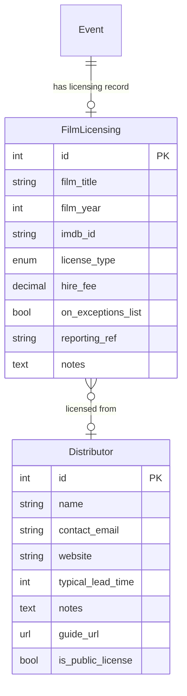

# Star and Shadow Toolkit — Tasks

**Purpose:** Design rationale, system limitations, and feature specifications.

**For current work and priorities, see:** [CURRENT_WORK.md](../CURRENT_WORK.md) · [ROADMAP.md](ROADMAP.md) (overview)
**Completed work:** [ARCHIVE.md](ARCHIVE.md)

This file details the *what* and *why* behind proposed work. Status indicators have moved to CURRENT_WORK.md to maintain a single source of truth.

**Size key:** 🟢 XS (1–4h) · 🔵 S (4–16h) · 🟡 M (16–40h) · 🟠 L (40–80h) · 🔴 XL (80–160h) · ⛔ XXL (160h+)

---

## Current bugs

✅ **Bug B — RESOLVED** — Wagtail `translation_key` column overflow

**Resolution:** Created migration `toolkit/content/migrations/0013_widen_page_translation_key.py` to widen the `wagtailcore_page.translation_key` column from `varchar(32)` to `varchar(36)` via `RunSQL` operation. Migration applied successfully; CMS page creation via admin now works without `DataError`.

See [ARCHIVE.md](ARCHIVE.md) for full resolution details.

---

## 8. Current limitations and known gaps

These are real limitations in the current system that a rewrite should address.

### 8.1 Rota is disconnected from volunteers
`RotaEntry.name` is free text. Volunteers are not linked to their rota slots.
Consequences:
- Can't email everyone signed up for a showing
- Can't see a volunteer's rota history
- Typos in names go undetected
- No way to confirm a volunteer is still active

### 8.2 Volunteer induction is entirely manual
The Google Form → manual entry process has no automation. Names from the form
must be copy-pasted. There is no audit trail of who inducted whom.

### 8.3 Volunteer self-service is partial
Volunteers can log in, view the rota, and sign up for slots via an
interactive click-to-edit interface at `/diary/edit/rota/`. This is gated by
the `diary.change_rotaentry` Django model permission.

**Name coercion (S&S branch only, not yet on master):** when a volunteer
clicks a slot and submits any non-empty text, the server ignores what was
typed and instead saves `request.user.volunteer.member.name` — i.e. the
logged-in user's own name. This prevents volunteers from writing each other's
names into slots. Submitting an empty value clears the slot. Any volunteer
with the permission can clear any slot, including one filled by someone else
— there is no ownership check on deletion. Superusers (Panopticon) bypass the
coercion and can write any text freely.

This coercion logic exists on the `s+s` branch but has not yet been ported
to `master`, where the rota edit view currently accepts and saves whatever
text is submitted verbatim.

Editing a volunteer's own profile (`/volunteers/N/edit/`) requires
`toolkit.write` (Panopticon level) — there is no self-editing exception in
the current code.

There is no "my schedule" view — a volunteer cannot see a filtered list of
only the showings they are signed up for.

### 8.4 No reserve/standby slots
If someone drops out of a rota role, there's no mechanism for reserves. This
is handled informally (e.g. messaging the volunteers list).

### 8.5 Email list is managed externally
The link between "volunteers in the Toolkit" and "members of the Simplelists
mailing list" is entirely manual. There is no synchronisation.

A compounding problem: the volunteer list and the mailing list are two
separate systems with no shared identifier, but in practice one person's
presence on a training-specific mailing list (e.g. the bar volunteers list)
is often managed as a side-effect of their induction. When someone attends a
bar induction, they are added to the bar mailing list by the person running
the session — but this is a manual step that depends on whoever ran the
session remembering to do it. There is no record in the toolkit of which
lists someone is on.

Consequences:
- A volunteer who is bar-trained may not be on the bar mailing list if
  their induction was not followed up correctly
- If someone leaves and re-joins, they may not be re-added to specialist
  lists during their return induction, unless whoever runs it explicitly
  checks
- Someone may want to stop receiving emails from a list (e.g. bar) while
  remaining active in that role — but there is no clean way to distinguish
  "unsubscribed from list" from "no longer qualified"
- Over time, mailing lists accumulate former volunteers who have never been
  removed — making them less useful and noisier

### 8.6 Rota view is a wall of text
The rota view shows all events in a date range with all their role slots and
rota notes. There's no filtering, grouping, or visual hierarchy. Large rota
notes dominate the view.

### 8.7 No programming pipeline / approval process
Events go straight from "created" to "confirmed" without any formal approval
step. There's no concept of a meeting where proposed events are reviewed.

### 8.8 Training records are too rigid to model real role requirements
The current training record system tries to fit all role qualifications into a
single model: a logged event with a trainer name, a date, and a role. Records
expire after 12 months and must be re-logged. This overhead means records are
not maintained, and as a result the system is not used as a gate on role
sign-up at all.

The deeper problem is that the real qualification requirements (see rule 13)
are fundamentally different in kind, and a single model cannot represent them:

- **Induction-granted certificates** (food hygiene level 1) are delivered
  in-house as part of the monthly café induction. The gate is the induction
  itself — a boolean, like bar. The level 1 certificate is an outcome of
  attending, not something obtained separately.
- **External certificates** (food hygiene level 2) need a record of the
  certificate itself — issuing body, expiry date — not an internal training
  log. Expiry genuinely matters here and should be surfaced.
- **Internal tiered training** (projectionist levels) needs a progression
  model, not a flat list of records. Level 2 implies level 1; re-logging
  after 12 months makes no sense for a skill that doesn't expire.
- **Informal shadow-based progression** (sound/tech) should not be
  formalised at all. A lightweight "this volunteer is comfortable with this
  role" flag, set by the volunteer or a coordinator, is sufficient.
- **Induction gates** (bar) are binary — you have had the induction or you
  haven't. A single boolean per volunteer is the right model, not a
  timestamped log.
- **Nomination processes** (keyholder) are social and governance decisions,
  not training events. The system should record the outcome (this person is a
  keyholder) without trying to model the process that led there.

A rewrite should model these as distinct types rather than forcing them
through a single `TrainingRecord` schema. Hard gates (bar induction, food
hygiene cert) can block sign-up. Soft signals (sound/tech comfort flag) can
inform but not block. Keyholder status is a property of the volunteer record,
not a training record at all.

### 8.9 Training records expire silently
There's no notification or dashboard view highlighting volunteers whose
training has lapsed or is about to lapse. (This is a secondary issue given
8.8 — solve the friction problem first.)

### 8.10 No view of volunteer workload
There's no way to see how many hours or shifts any given volunteer has
committed to, or to spot volunteers who are over-stretched or disengaged.

### 8.11 Room booking model is too simple for multi-room events
A `Showing` has a single optional `room` field. This works for a simple
screening in one room, but many events at S&S require multiple rooms at
different times within the same event — for example:

- Venue access from 4pm for general setup
- Cinema booth from 6pm for tech and AV prep
- Cinema itself from 7pm to 9pm for the event proper

The current system has no way to express this. The workarounds in use are:

1. **Create multiple events** — programmers book each room as a separate diary
   entry, cluttering the programme with fake events and disconnecting the rota
   from the real event.
2. **Create multiple showings of the same event** — slightly better, but the
   programme then shows the same event listed multiple times at different
   times, which is confusing publicly and internally.
3. **Do nothing** — the room bookings are informal or forgotten, leading to
   undetected clashes when two events assume they have access to the same
   space at the same time.

There is also no clash detection: the system does not warn when two confirmed
showings overlap in the same room.

### 8.12 Collectives are not modelled in the toolkit

The Star and Shadow operates through a network of informal working groups and
collectives — Bar Collective, Programming Collective, Technical Collective,
and various others — which self-assemble around a shared interest and operate
with significant autonomy. These are not captured anywhere in the toolkit.

**Current state:**

- Groups communicate primarily through mailing lists managed in
  [Simplelists](https://simplelists.com/). Creating or administering a list
  requires knowing someone who has Simplelists admin access — a small and
  informally defined group. There is no self-service route.
- There is no central directory of which collectives exist, what they do, or
  who is in them. This is sometimes intentional: groups may prefer not to
  be publicly findable.
- A volunteer wanting to contact, say, the Tech Collective has no
  in-system way of discovering who is in it or how to reach them. They must
  ask around in person or via the general mailing list.

**A specific pain point — new programmers and keyholders:**

A newly onboarded programmer must arrange keyholding cover for their event.
Keyholders are an informal group of long-standing trusted volunteers; there is
no list in the toolkit, and no automated way to request one. In practice:

- The programmer must know (or be pointed to) individual keyholders by name
- They make contact directly, often via personal messages or the general list
- Keyholders agree or decline based on personal availability and their
  relationship with the programmer

This friction might not be entirely accidental. Having to personally approach
keyholders — and earn their willingness to vouch for a showing — is a
lightweight form of community vetting. Any feature that automates this away
entirely should be considered carefully. The right response may be to make the
*list* of keyholders visible in the toolkit (so new programmers know who to
approach) while leaving the actual agreement as a human interaction.

**What the toolkit could usefully do:**

- Expose a read-only directory of active collectives and their public contact
  points (e.g. mailing list address), where the collective has opted in to
  being listed
- Allow a Role to be flagged as `keyholder_capable`, making it easy to surface
  that list without building a full collectives model
- Note: full collective membership management (join requests, mailing list
  sync, governance) would be a large feature (🔴 XL or ⛔ XXL) and is not
  recommended as an early priority

### 8.15 Frontend library debt — legacy and EOL dependencies

Several vendored and CDN-referenced frontend libraries are outdated, some
critically so. Audited February 2026.

#### 🔴 Critical — CVEs / confirmed EOL

| Library | Version in use | Issue |
| --- | --- | --- |
| CKEditor | 4.7.3 | **EOL December 2023.** Multiple XSS CVEs will not be patched. Used via `toolkit/diary/templates/widgets/htmltextarea.html`. Migrate to a maintained editor (Draftail if on Wagtail pages; TipTap or Quill otherwise). Effort: 🟡 M. |
| jQuery (public site) | 2.1.3 via Google CDN | ✅ resolved. Replaced CDN reference with locally vendored `jquery.min.js` (3.5.1) in both `templates/base_public.html` and `star_and_shadow_templates/base_public.html`. No external dependency, no EOL version. |
| Google Fonts (all templates) | HTTP URL | ✅ resolved. Fixed `http://` → `https://` in `base_admin.html` (live request) and removed dead IE8 conditional comment blocks containing `http://` from all three base templates. |

#### 🟠 High — Abandoned or no longer receiving security patches

| Library | Version in use | Issue |
| --- | --- | --- |
| jQuery UI | 1.11.0 (2014) | Security patches stopped. XSS CVEs in `datepicker` and `checkboxradio` widgets. Update to 1.13.3 (current LTS, drop-in). Long-term: replace datepicker with native `<input type="date">`. Effort to update: 🔵 S. |
| Bootstrap | 4.6.2 | No longer maintained. BS5 breaks `data-toggle` → `data-bs-toggle`, `mr-auto` → `ms-auto`, `sr-only` → `visually-hidden`. Migration is entangled with django-crispy-forms (see below). Effort: 🟠 L. |
| Chosen | 1.1.0 | GitHub-archived (no releases since 2019). Known accessibility defects. Replace with Select2 or native multi-select. Effort: 🔵 S. |

#### 🟡 Medium — Outdated pins or frozen libraries

| Library | Version in use | Issue |
| --- | --- | --- |
| FullCalendar | 3.5.1 (2017) | Superseded by v6 (no jQuery, TypeScript, ESM). Improving the calendar edit view would warrant this upgrade; it is a large migration. Effort: 🔴 XL. |
| Moment.js | bundled in FC | Frozen (maintenance-only). Automatically resolved if FullCalendar is upgraded to v6. |
| html2text | 3.200.3 (2015) | ✅ resolved. Unpinned in `requirements/base.txt`; pip will now resolve the current release. |
| django-crispy-forms | <1.13 | EOL; v2.x separates template packs. Migrate to `crispy-forms>=2.0` + `crispy-bootstrap5`. Entangled with Bootstrap 5 upgrade above. |
| mysqlclient | 2.1.0 | ✅ resolved. Updated constraint to `>=2.2.0,<3` in `requirements/docker.txt`. |

#### 🟢 Low — Dead code to delete

- `respond.min.js` — IE8 media-query polyfill. IE8 is <0.01% of users. ✅ Removed
  (file deleted; script tag removed from both public base templates).
- IE8 conditional comments — `<!--[if lte IE 8]>` blocks in `base_public.html`
  and `base_admin.html` load six redundant Google Fonts requests that no browser
  will ever make. ✅ Removed (no longer present in templates).
- `wysihtml5.css` — WYSIHTML5 has been unmaintained since ~2014; verify it is not
  referenced anywhere and delete it.

#### Recommended order of attack

1. HTTP → HTTPS on admin Google Fonts (5 minutes, zero risk)
2. jQuery 2.1.3 → 3.7+ on public site (update CDN reference to local vendored file)
3. Unpin `html2text` and `mysqlclient`; test; commit
4. CKEditor 4 → maintained editor (security-critical)
5. jQuery UI 1.11 → 1.13 (drop-in)
6. Delete Respond.js and IE8 conditional comment blocks
7. Bootstrap 4 → 5 + `crispy-forms` 2.x + Chosen → Select2 (batch together)
8. FullCalendar 3 → 6 (large; do when calendar editing needs attention)

---

---

## 9. Proposed new features

The following features have been identified as priorities for a future version.
They are organised by area.

### 9.2 Event programming pipeline

**Goal:** Formalise the process of proposing and approving events, aligned with
how Monday programming meetings actually work.

#### Background: the programming etiquette guide

The collective has agreed a set of norms for programming that is currently
documented in a written guide. The key principles most relevant to the
toolkit are:

**Pre-requisites for programming (guidance, not hard gates):**
- Volunteers should do approximately 10 shifts before programming their own
  event, and maintain roughly 5 shifts in the preceding 6 months
- They should attend Monday meetings and observe how decisions are made
  before proposing events of their own

These are social norms, not enforceable rules. The system currently has no
way to verify shift counts (rota names are free text — see 8.1), and even
once that is fixed, enforcing a gate would be antithetical to the ethos.
The appropriate toolkit response is to **display these requirements as
guidance** at the point of event creation, not to block submission.

**At the Monday meeting — the programmer should bring:**
- An itemised budget breakdown (expected costs and income)
- If total estimated costs exceed **£500** (or **£750** for music events),
  the proposal is referred to the Finance Collective for further
  authorisation before it can be confirmed

**After approval — the programmer is responsible for:**
- Adding themselves to the Programmer rota slot immediately
- Putting the event on the rota as soon as possible, and no less than
  **one week before** the showing
- Checking rota sign-up well in advance — not the day before
- Accurately identifying the number and types of volunteer roles needed
- Noting shift times for multi-shift roles (e.g. bar shift 1: 5:30–8pm,
  shift 2: 8–10pm)
- Arranging food for late nights and long events (and including this in
  the agreed budget)
- Keeping the place clean afterwards — adding cleaning and washing-up
  roles to the rota if needed
- Assisting the keyholder in shutdown
- **Not signing up for additional roles** if they are the programmer —
  their job is to be present and coordinate, not to be tied to a specific
  task

The financial ethos is explicit in the guide: *"A budget is not a goal.
It's all our money, so be thrifty where you can."* It costs approximately
**£200 to open the doors to the public**; that baseline is worth surfacing
to new programmers who may not have a feel for what events cost.

#### Features

- **Draft / pencilled-in state** — events can be created in a "proposed"
  state before being discussed at a meeting
- **Programming queue** — a view showing all proposed events in submission
  order, suitable for working through as a stack at a meeting
- **One-click approval / rejection** — during a meeting, events can be
  quickly approved (moved to "confirmed") or rejected (moved to "rejected")
  with a reason
- **Programming criteria fields** — structured fields to capture itemised
  costs (hire, tech, performer fee, accommodation, travel, food, other),
  expected revenue, split/deal type, and tech requirements, presented at
  the Monday meeting. These feed directly into the break-even calculator
  (section 9.9).
- **Finance Collective referral flag** — when total estimated costs exceed
  the configured thresholds (`FINANCE_REFERRAL_THRESHOLD_STANDARD = 500`,
  `FINANCE_REFERRAL_THRESHOLD_MUSIC = 750`), the event is flagged in the
  programming queue as requiring Finance Collective sign-off before
  confirmation. The flag is a visible warning, not a hard block — the
  collective governs this, not the system.
- **Etiquette guide link** — a visible link to the programming etiquette
  guide displayed on the event creation screen and in the programming queue.
  Implemented as a `PROGRAMMING_ETIQUETTE_URL` settings variable. A static
  URL pointing to the document in NextCloud is sufficient; the guide does
  not need to be migrated into the toolkit.
- **Pre-requisite reminder** — at the point of first event creation, a
  brief, non-blocking notice: *"Before programming your first event, have
  you completed around 10 volunteer shifts and attended a Monday meeting?
  [Programming guide ↗]"* — displayed once (or until dismissed), not on
  every subsequent event.
- **Rota deadline warning** — if a confirmed showing is less than 7 days
  away and has no rota entries, show a warning to the programmer on the
  event's edit page and in the rota view.
- **Auto-populate programmer rota slot** — when an event is approved from
  the queue, the name(s) of whoever proposed it are automatically written
  into the Programmer rota slot(s) for each showing. This removes the most
  common omission from the rota and means the programmer's accountability
  is recorded from the moment an event is confirmed.
  Where multiple people co-proposed an event, multiple Programmer slots are
  created accordingly.

### 9.2 Volunteer rota — account-linked sign-up

**Current state:** The rota at `/diary/edit/rota/` is already self-service in a
crude sense — any logged-in volunteer can click any slot and type a name. The S&S
branch adds name coercion (it ignores what you type and saves the logged-in user's
own name instead), but this is not yet on master. Either way, the entries are plain
text with no identity link.

**Goal:** Replace free-text rota entries with account-linked sign-ups, so that
the system knows *who* is actually on the rota — enabling automatic reminders,
"my upcoming shifts" views, and drop-out notifications.

Features:
- **Volunteer accounts** — each volunteer has a login (username + password or
  magic link via email)
- **Sign up for rota slots** — volunteers can sign up for open slots on showings,
  with slots linked to their account (not free text)
- **Drop out of a slot** — with notification to the organiser
- **Reserve / standby slots** — volunteers can mark themselves as "reserve" for
  a role, and be notified if the primary person drops out
- **Email reminders** — automatic reminders to volunteers who are signed up,
  sent N days before a showing
- **My schedule view** — a volunteer can see all showings they're signed up for

### 9.3 Volunteer rota — improved management view

**Goal:** Make the rota view less overwhelming — especially for new and
neurodivergent volunteers — while making it easier for everyone to find
events they can help with.

The current rota is a dense wall of text: every showing, every role slot, and
all rota notes are displayed at once. This is a significant barrier for new
volunteers who don't yet know the venue's rhythms, and for anyone who finds
dense information layouts difficult to process.

#### Reducing information overload

- **Collapse rota notes by default** — show a short summary (first line or
  first N characters) with an expand button. Long operational notes are useful
  but shouldn't dominate the view for someone just looking for a shift to join.
- **Filter by tag** — show only showings of a given event type (e.g. "film",
  "music"). Reduces the list to a manageable size for volunteers who only want
  to help at certain kinds of events.
- **Filter to show only events with vacancies** — a one-click way to hide
  fully-staffed showings. A new volunteer scanning for something to join
  shouldn't have to read every showing to find open slots.
- **Colour-coded vacancy status** — at a glance, showings where key roles are
  unfilled are visually distinct from fully-staffed ones.

#### Friendly for new volunteers

Not all roles are equally approachable. Usher and Box Office are low-barrier
entry points: they require no specialist knowledge, are well-supported on the
night, and are explicitly described as "easy to drop into" in the venue's
culture. The rota should reflect this.

- **"Good for new volunteers" role flag** — a boolean on `Role` (e.g.
  `newcomer_friendly`) that can be set by Panopticon. Roles flagged this way
  are visually marked in the rota (e.g. a small label or icon) so new
  volunteers can immediately see where they're most welcome.
- **Newcomer-filtered view** — a toggle or separate URL that shows only
  showings with open newcomer-friendly slots. A new volunteer sent a link to
  this view sees exactly what they need without any noise.
- **Role guides** — each `Role` can have an optional short description (one
  or two sentences) and an optional URL linking to a guide or tutorial video.
  The venue already hosts role-relevant training content on its YouTube
  channel; the same pattern applies to written guides in NextCloud or
  elsewhere. No extra infrastructure is needed — just URL fields on the
  `Role` model.

  The design challenge is surfacing these guides for people who need them
  without cluttering the interface for experienced volunteers who find them
  noise. The goal is *findable but not intrusive*: a veteran should be able
  to use the rota for months without the guides getting in their way, while a
  newcomer should be able to find them without asking anyone.

  Options for achieving this, in order of increasing sophistication:

  - **Icon-only affordance** — a small, visually quiet icon (e.g. a book or
    info symbol) next to the role name, with no accompanying text. Experienced
    volunteers develop habituation and stop seeing it; newcomers are curious
    enough to click. The guide opens in a new tab or a small popover. This
    requires no account history and works immediately.
  - **Shown only on first sign-up** — if volunteer accounts track rota
    history, the guide is shown more prominently the first time a volunteer
    signs up for a given role (e.g. a "first time doing this? here's a
    guide" prompt inline), and reduced to the quiet icon thereafter. Requires
    rota entries to be properly linked to accounts (see 9.2).
  - **"New to this role" opt-in** — a small checkbox or toggle at the point
    of signing up: "first time doing this?" Checking it expands the guide
    inline. Opt-in, so veterans never trigger it and newcomers get exactly
    what they need at the moment they need it. Works without account history.

  **On using sign-up counts:** if rota entries are linked to volunteer
  accounts, the system will naturally accumulate a count of how many times
  each volunteer has signed up for each role. This is potentially useful —
  for surfacing guides on first sign-up, for the wellbeing dashboard (9.5),
  and as a lightweight proxy for experience in informal roles like sound/tech
  where no formal training gate exists.

  However, there are real risks in how this data is used or displayed:

  - **As a gate:** using sign-up count to restrict access to roles ("you
    must have done this N times before signing up") would be antithetical to
    the non-hierarchical ethos and replicate the problems of the current
    training record system in a different form.
  - **As a visible score:** displaying counts to other volunteers could
    create informal hierarchy and social pressure, even unintentionally.
    A volunteer with 2 sign-ups next to one with 20 may feel judged even if
    no gate exists.
  - **As a private signal:** the count used only internally — to decide
    whether to show a guide, or to flag role distribution in the wellbeing
    dashboard to coordinators — is much safer. The volunteer doesn't see a
    score; they just get or don't get the guide.

  The principle to hold onto: sign-up history should inform the system's
  behaviour towards the volunteer (show them a guide, suggest they shadow),
  never determine what they're permitted to do.

#### Programmer notes in the rota

Programmers sometimes need to leave notes specific to an event — technical
requirements, access instructions, things volunteers need to know before they
arrive. At the moment these go into the same `rota_notes` field as everything
else, where they can get buried or mixed with sign-up chatter.

There is tension here: making programmer notes visually prominent risks
implying a hierarchy that doesn't reflect the venue's non-hierarchical ethos.
The design should resolve this by treating it as *contextual* rather than
*authoritative* — useful information from the person who knows the event best,
not instructions from above.

Options to consider:

- **Inline highlight** — programmer notes appear in the same notes area as
  other rota notes but are visually marked (e.g. a subtle left border, a
  "from the programmer" label). Notes remain in the same flow; no separate
  section implies no separate status.
- **Collapsible header block** — a separate field (`Showing.programmer_notes`)
  displayed in a collapsed block above the main rota notes, expandable on
  demand. Keeps event-specific context out of the way until needed, without
  losing it. The label could be neutral ("Event notes") rather than
  "Programmer notes" to soften the hierarchy signal.

Either approach requires a separate `programmer_notes` field on `Showing`
(so the source can be distinguished even if the display merges them).
The inline approach is more aligned with the non-hierarchical ethos; the
collapsed header block is more practical for longer technical notes that
would otherwise dominate the view.

#### Programmer accountability in the rota

The programming etiquette guide makes several concrete demands of programmers
that the rota should help enforce (or at least surface). In order of how
directly they translate to toolkit features:

**"Add yourself as the Programmer on the rota."**
- **Warning highlight for unfilled Programmer slots** — any showing where the
  Programmer role is empty gets a distinct visual treatment (warning colour or
  symbol) in the rota view. This is separate from the general vacancy
  highlighting: a missing projectionist is a staffing gap; a missing programmer
  is also the person responsible for the event not having confirmed they'll be
  there.
- **Auto-populate from the programming queue** — see 9.2: when an event is
  approved, the proposing programmer's name is written into the Programmer slot
  automatically. The warning highlight serves as a fallback for events that
  bypass the queue or where the slot has been cleared.

**"Put your event on the rota ASAP and no less than a week before."**
- **Rota deadline warning** — if a confirmed showing is less than 7 days
  away and has no rota entries at all, flag this prominently to the programmer
  on the event edit page and in the programming queue. This is a soft warning,
  not a block.

**"Avoid signing up for additional roles if you are the programmer."**
- This norm is hard to enforce technically (the system doesn't know whether
  a role sign-up is "additional" or the primary Programmer slot). The most
  practical approach is guidance: display a note when a volunteer who is
  already in the Programmer slot attempts to sign up for another role on the
  same showing. The note can read something like: *"You're already the
  programmer for this event — consider whether you need to be in a specific
  role, or whether being available to coordinate is more useful."* Non-blocking.

**Multiple programmers:** events sometimes have two or more people
co-programming. The data model already supports multiple `RotaEntry` records
for the same role (via `rank`), so multiple Programmer slots are possible
without schema changes. The UI should make it easy to add a second Programmer
slot at event creation time, and the auto-populate should create one slot per
co-proposer from the queue.

**Programmers acting for external hires:** when `Event.outside_hire` is
`True`, the programmer is acting as the internal liaison for an external group
rather than as the creative lead. The Programmer rota slot still represents
the person responsible on the night, but the display could optionally note the
external hire context (e.g. "Programmer (external hire liaison)") to avoid
confusion for other volunteers about who to contact with questions about the
event vs. questions about the venue.

#### Shadow role support

**Background and current pain point.** The history of shadowing at S&S
illuminates the design problem clearly, particularly for projection:

- *Phase 1 (freeform):* Volunteers wanting to shadow wrote notes in the
  rota text field asking the projectionist if they could shadow. With no
  defined slot, there was no control over who wrote what or when, and
  whether the projectionist even saw the request.
- *Phase 2 (fixed shadow slot):* A "Projectionist (trained shadowing)" role
  was added to all cinema events. This solved the ad-hoc problem but created
  a new one: volunteers signing up to shadow *before* a projectionist had
  signed up. This placed the projectionist in the uncomfortable position of
  having to refuse a shadow if they weren't comfortable with one — after the
  shadow had already publicly committed.
- *Current state:* The shadow slot exists on all cinema events, accompanied
  by a large block of full caps warning text in every rota notes
  field:

  > *IN ORDER TO SHADOW PROJECTION YOU NEED TO HAVE DONE A PROJECTIONIST
  > TRAINING FIRST! PLEASE DO NOT SIGN UP FOR SHADOWING A PROJECTIONIST
  > BEFORE A PROJECTIONIST HAS SIGNED UP!*

  This text appears repeatedly across the rota and is one of the most
  visible friction points in the current system.

**Design goals.** A better system should:
1. Make the shadow slot only available once the primary role is filled
2. Give the person taking the primary role discretion over whether they want
   a shadow
3. Avoid requiring programmers to manually configure shadowing for every event
4. Not generate repeated boilerplate text in rota notes

**Proposed model — three-mode shadow control.**

Programmers can set a shadow policy for each role slot when creating or
editing an event (or its template). Three options:

| Mode | What it means | Visible in rota as |
|---|---|---|
| **Solo** | No shadow slot. The role is taken by one person only. | Single role slot as normal |
| **Shadow open** | A shadow slot is automatically unlocked once the primary slot is filled. Any qualified volunteer can sign up to shadow after that. | Primary slot + shadow slot (greyed out / locked until primary is filled) |
| **Shadow at primary's discretion** | A shadow slot is *offered* by the person who fills the primary role. They can open it after signing up, or leave it closed. | Primary slot + a toggle/button for the primary volunteer: "Open to a shadow?" |

The default for most roles should be **Solo**, and templates can set
per-role defaults. The "shadow at primary's discretion" mode is specifically
designed for the projectionist case: the slot does not exist until the
projectionist creates it.

**Behaviour details:**

- In **Shadow open** mode: the shadow slot appears in the rota but is
  visually locked (e.g. greyed out) until the primary slot has a name in
  it. Once filled, the shadow slot becomes clickable. If the primary slot
  is cleared, the shadow slot locks again (and any existing shadow name is
  removed with a notification).
- In **Shadow at discretion** mode: after a volunteer fills the primary
  slot, they see an "open this role to a shadow?" toggle in their view of
  the rota. If they toggle it on, a shadow slot appears. If they toggle it
  off (or never toggle), no shadow slot is visible to others. The
  projectionist can also close the shadow slot after it has been opened
  (e.g. if they later decide they'd prefer to concentrate), which removes
  the shadow name with a notification.
- In all modes, the **shadow slot is visually distinct** from the primary
  slot — a different icon, indentation, or label (e.g. "→ Shadowing [Role]")
  to make clear which is the primary commitment.

**Volunteer capacity in the cinema.** Separately from shadowing, the cinema
has a finite number of volunteer seats (~8 at the back of the room for
non-public volunteers, before people spill onto uncomfortable brought-in
chairs). On fully booked events this has caused genuine friction — volunteer
seats taken by the time volunteer attendees want to join. A future feature
could:

- Flag a threshold on a `Room` or `Showing` (e.g. `volunteer_seat_count`)
- When the number of rota entries for a showing approaches or exceeds that
  count, show a warning to programmers and volunteers signing up
- This is not a hard block (volunteers can always bring in extra chairs) but
  a soft nudge to keep expectations managed

**Data model change required:**

```
RotaEntry:
  + shadow_mode: enum [solo, open, discretion]  # on the template slot
  + is_shadow: bool  # on each actual entry

Role:
  + default_shadow_mode: enum [solo, open, discretion]
```

The `is_shadow` flag distinguishes display and responsibility without
requiring a separate model. The `shadow_mode` lives on the `RotaEntry`
template (the slot definition for an event/showing), not on the volunteer's
sign-up record.

**Size estimate:** 🟡 M — 16–30h. The UI changes (locked/unlocked slots,
discretion toggles) are non-trivial, but the data model change is
straightforward. Requires the rota to be linked to volunteer accounts (8.1)
for the discretion toggle to have a meaningful "primary volunteer's view".

### 9.4 Volunteer induction workflow

**Goal:** Replace the Google Form → manual entry process with something integrated.

Features:
- **Self-registration form** — public-facing form where prospective volunteers
  can submit their details (replaces Google Form)
- **Pending volunteer queue** — admins see a queue of submitted applications
- **Induction session attendance tracking** — mark which sessions someone attended
- **One-click activation** — once verified, activate the volunteer with a single
  action that creates their account and notifies them
- **Welcome email** — automatic email sent on activation with login details and
  next steps
- **Induction checklist** — record which induction topics were covered for each
  new volunteer

### 9.5 Volunteer wellbeing dashboard

**Goal:** Give coordinators visibility of volunteer workload and engagement, to
support a healthy and sustainable volunteer community.

Features:
- **Rota commitment overview** — for a given date range, show each volunteer's
  total number of signed-up shifts and roles
- **Role distribution** — see which roles are under-resourced (few qualified
  volunteers) and which are well-covered
- **Engagement trend** — flag volunteers who have not signed up for any shifts in
  the last N weeks (potential disengagement)
- **Upcoming capacity alert** — compare the number of rota slots required for
  confirmed events in the next month against the recent monthly average of
  volunteer hours. Alert if the ratio is unusually high.
- **Training lapse alerts** — list volunteers whose training records have expired
  or are due to expire within 30 days

### 9.6 Communication improvements

**Goal:** Reduce manual steps in keeping volunteers informed.

Features:
- **Email volunteers on a showing** — send a message to all volunteers signed up
  for a specific showing (requires volunteer accounts + rota linked to accounts)
- **Email volunteers by role** — send a message to all active volunteers qualified
  in a specific role
- **Rota vacancy alert** — automatic email to a volunteer mailing list when a
  showing has unfilled key roles within N days
- **Direct sync with mailing list** — rather than emailing admins to manually
  update Simplelists, the system manages list membership directly via an API
  (if Simplelists exposes one, or migrate to a different list manager)

### 9.7 Room booking — multi-room and clash detection

**Goal:** Let programmers accurately express which rooms an event needs and
when, and surface clashes before they become a problem on the night.

#### The data model change

Replace the single `room` FK on `Showing` with a separate `RoomBooking`
entity:

```
RoomBooking {
    showing     FK → Showing
    room        FK → Room
    start       datetime   (may differ from Showing.start)
    end         datetime
    notes       text       (optional — e.g. "tech setup only, not public")
}
```

A showing can have multiple `RoomBooking` records. `Showing.start` remains
the canonical public-facing start time. Room bookings record the full
footprint of the event in the building, which is often earlier and
occasionally later.

This change is backwards-compatible in behaviour: existing single-room
showings simply have one `RoomBooking` with the same start as the showing.

#### Clash detection

When a programmer saves a room booking, the system checks for any other
confirmed showing with a `RoomBooking` in the same room whose time window
overlaps. If a clash is found:

- Show a clear warning (not a silent failure — the programmer may have a
  legitimate reason, e.g. two events sharing a foyer at different ends)
- Require an explicit acknowledgement to proceed past the warning
- Surface existing clashes in the room availability view (below)

#### Room availability view

A calendar or timeline view showing each room's booking footprint across a
date range. Allows programmers to see at a glance whether a room is free
before proposing an event, without having to check every individual showing
in the diary.

### 9.9 Break-even calculator for programmers 🟢 XS

**Goal:** Help programmers quickly work out whether a proposed event is
financially viable, without needing a spreadsheet.

A simple in-browser calculator — no server round-trip needed — that takes:

| Input | Example |
|---|---|
| Venue hire cost (if any) | £80 |
| Technical costs (equipment hire, etc.) | £30 |
| Artist/performer fee | £150 |
| Accommodation for artist(s) | £60 |
| Travel costs for artist(s) | £40 |
| Food for volunteers (late nights / long events) | £30 |
| Other costs | £20 |
| Room capacity | 80 |
| Door split arrangement (%) | 70% to artist, 30% to venue |
| Ticket price / expected average | £5 (see PAYF note below) |

Outputs:

- **Break-even attendance** — the number of tickets that must be sold to
  cover all costs
- **Break-even as % of capacity** — how full the room needs to be
- **Revenue at various fill levels** — e.g. profit/loss at 25%, 50%, 75%,
  100% capacity
- A plain-English summary: *"You need to sell 35 tickets (44% of capacity) to
  break even. At a full room you'd make £48 for the venue."*

**Pay As You Feel (PAYF) pricing:**

S&S events commonly use PAYF pricing with suggested bands of £0, £3, £5, and
£7. Rather than requiring programmers to estimate attendance at each price band
separately (high mental overhead, usually speculative), the calculator should
accept a single **expected average ticket price** field. The programmer sets
the average they realistically expect people to pay and the calculator uses
that figure throughout.

A default of **£5** is a reasonable starting point — observed payment
distribution at S&S events suggests most people pay £5 or more when given the
choice, though this default should be updated once the data has been confirmed.
The field should be clearly editable so programmers can adjust it for events
where the audience skews differently (e.g. lower for community events, higher
for popular one-off shows).

This approach is deliberately simpler than per-tier modelling. Three inputs
of (£0 / 30%, £5 / 50%, £7 / 20%) are more accurate in theory but add
friction at the planning stage when approximate answers are all that's needed.
The single average-price field gives the same quality of decision signal with
far less cognitive overhead.

**Implementation notes:**

- Pure JavaScript — no new model fields, no database queries, no server
  changes needed for the calculator itself
- Could live as a standalone page (a link from the "add event" screen), or
  be embedded in the event creation form as a collapsible panel
- Inputs should be pre-populated from the event's existing fields where they
  exist (hire cost, capacity from the room record) to reduce friction
- The output is advisory only — no data is saved unless the programmer
  explicitly copies figures back into the event's cost/notes fields
- Does not need to handle complex deal structures (merchandise splits,
  guarantees vs. door deals) in the first version; a flat cost + percentage
  model covers the majority of S&S events
- The calculator should surface two important context figures:
  - **"~£200 to open the doors"** — the baseline cost of running any public
    event at S&S (venue overheads, utilities, staff time). This helps new
    programmers understand that even a zero-fee event carries a real cost,
    and that every ticket sold contributes to something meaningful.
  - **Finance Collective threshold** — if the total estimated costs exceed
    £500 (or £750 for music events), the calculator should note that the
    proposal will require Finance Collective authorisation at the Monday
    meeting. This prompts the programmer to prepare justification in advance,
    rather than being surprised on the night.

**Why this matters:** New programmers often have no intuition for whether a
proposed ticket price is realistic. A calculator that shows "at £6 you need
80% of the room to break even" prompts a genuine conversation before the
event is confirmed, rather than a post-mortem after a poorly attended show.
The Finance Collective thresholds give programmers a clear target to plan
towards, and the £200 baseline connects abstract numbers to real collective
effort.

### 9.10 Rota improvements from the backlog

The following smaller features were identified from a historical feature
request backlog (Trello board). Each is independent and can be picked up
individually.

#### 9.10.1 Filter rota by tag 🔵 S (4–8h)

The rota view already has a "vacancies" filter (section 9.3). Adding a
tag-based filter follows the same pattern: show only showings whose event
has a specific tag (e.g. "film", "music", "workshop"). This is particularly
useful for volunteers who only help with certain event types and want to
avoid scanning through unrelated entries.

Implementation: one query filter parameter, one dropdown in the rota view
header. The tag filter and vacancy filter should compose (i.e. both active
simultaneously).

#### 9.10.2 Clone rota text with events / rota note templates 🔵 S (4–8h)

When an event is cloned (e.g. a recurring weekly event like Sunday Cafe or
Family Film Club), the rota notes field is currently not carried over —
the programmer must re-enter it. This is friction for recurring events that
have stable operational notes.

Two approaches:

- **Simple:** when cloning an event, copy the `rota_notes` from the source
  showing(s) alongside the event details
- **Template-based:** allow an `EventTemplate` to carry a default
  `rota_notes` value (alongside default roles), which is pre-filled when
  a new event is created from the template. The programmer can then
  customise it.

The template-based approach is more powerful and better fits the existing
data model. The simple clone approach is faster to implement and useful
even without templates.

An **autosuggest** for rota notes (showing recent rota notes from events
of the same type or tag) would be a further enhancement — useful but adds
complexity and is not a priority over the simpler approaches.

#### 9.10.3 Rota vacancy reporting 🔵 S (4–8h)

A simple reporting page (linked from the internal dashboard) showing:

- How many open rota slots exist across all confirmed upcoming showings
- Broken down by role (e.g. "3 Keyholder slots unfilled in the next 4 weeks")
- Sorted by date, with a direct link to each showing's rota entry

This is effectively a more structured version of the existing "vacancies"
view, presented as a management report rather than a browsable list. Useful
for coordinators doing a weekly rota health-check without having to scroll
through every event.

#### 9.10.4 Calendar integration — .ics export 🔵 S (4–8h)

Many volunteers would benefit from importing their upcoming rota commitments
into their personal calendar (Google Calendar, Apple Calendar, etc.) to
reduce no-shows and reminder emails.

Two levels of implementation:

1. **Public programme .ics** — a feed (or one-off download) of all confirmed
   public showings. Any visitor can subscribe. Low effort; no volunteer
   accounts needed. Useful for audience members and volunteers alike.

2. **Personal rota .ics** (requires volunteer accounts + rota linked to
   accounts, 8.1) — a personal calendar feed showing only the showings the
   logged-in volunteer is signed up for. Each entry includes the showing
   time, event name, their role, and the rota notes. A unique secret URL
   (like `mailout_key`) allows calendar apps to subscribe without requiring
   login on every sync.

The standard format is iCalendar (RFC 5545, `.ics` file). Python's
`icalendar` library makes generation straightforward. No third-party service
is needed.

This is a meaningful alternative to reminder emails — a volunteer who has
their shifts in their calendar is less likely to forget them, and less
likely to need a reminder email the day before.

#### 9.10.5 Role timing notes 🟢 XS–🔵 S (2–8h)

Individual roles on a showing don't have their own start and end times —
there is only one start time per showing and a general `rota_notes` field
shared by everyone. This means role-specific timing (e.g. "Bar shift 1:
5:30–8pm, Bar shift 2: 8–10pm") has to go into the rota notes as free text,
where it can easily get lost.

A lightweight solution: add an optional `timing_note` text field to
`RotaEntry` (or to the role slot template). Programmers can add a short note
per role slot (e.g. "5:30–8pm") that appears inline next to the role name in
the rota, visually distinct from the general rota notes.

This doesn't require a full time-range model — a short free-text field
(50–100 chars) per role slot is sufficient for the majority of cases.

### 9.11 Notification alternatives to email 🟡 M (20–40h consideration + implementation varies)

Email is the current backbone of all toolkit communications. Email has real
advantages: it is open, accessible, relatively archival, and doesn't require
app installations. However, a significant and growing share of volunteer
communication happens via WhatsApp and other messaging apps, and there is
genuine appetite for push-notification-style reminders that don't land in
an already-crowded inbox.

**Options considered:**

| Approach | Pros | Cons |
|---|---|---|
| **Current state (email only)** | Open, accessible, no app required | Not real-time; lost in inboxes; fragmented with WhatsApp |
| **WhatsApp Business API** | Meets volunteers where many already are | Requires Meta integration; excludes non-WhatsApp users; privacy concerns; Meta's values misalign with S&S ethos |
| **Telegram bot** | Good bot API; open-source clients; no Meta | Another app to install; not universal |
| **Signal** | Best privacy story; aligns with S&S values | No official bulk-send or bot API for external integrations |
| **SMS (text message)** | Universal; no app required | Costs money per message; requires phone numbers; not conversational |
| **Native mobile app (iOS/Android)** | Push notifications; custom UX | Very large development effort; ongoing maintenance; app store compliance; accessibility burden |
| **Progressive Web App (PWA)** | Push notifications via browser; no app store; works on existing web stack | Browser push notifications are opt-in and unreliable on iOS; significant but not huge dev effort |

**Recommendation:**

The collective should make this decision with full awareness that
communications are already fragmented, and any new channel risks making
that worse. Email retains a unique quality: it is *relatively* open,
archive-able, and available to everyone regardless of which messaging app
they prefer or distrust.

Before building new notification infrastructure, the more immediately
impactful improvement is the `.ics` calendar feed (9.10.4), which reduces
no-shows without requiring any push notification infrastructure.

If a push notification channel is eventually adopted, a **PWA with browser
push notifications** is the most proportionate choice for the current
codebase — it uses the existing web app, requires no app store review, and
works on desktop and Android out of the box. iOS support for web push
notifications has improved in recent years.

Any notification system must be **opt-in**, configurable per-volunteer, and
**supplement** rather than replace email. The goal is to reach volunteers
who prefer async messaging — not to create new obligations for everyone.

### 9.12 "Dormant" volunteer status 🟢 XS (2–4h)

The current volunteer status model is binary: `active` or `retired`. In
practice, the volunteer community is more fluid than this. People go
travelling, take breaks for health or life reasons, or drift away and
return. Formal "retirement" implies a finality that doesn't reflect how
S&S actually works — and the flat, non-hierarchical structure means there
are no formal membership rules that require strict status tracking.

A **dormant** status would sit between active and retired:

| Status | Meaning | Effect |
|---|---|---|
| **Active** | Volunteer is engaged, available, receives comms | Appears in rota, on mailing lists, in standard reports |
| **Dormant** | On a break; intends to return | Hidden from default rota and reports; not emailed; preserved in the system |
| **Retired** | Has left the organisation | Marked inactive; removal from mailing lists triggered |

Dormant is soft and self-directed — a volunteer can flag themselves as
dormant, or a coordinator can do so after a period of inactivity. There is
no expiry on dormancy; the volunteer can reactivate whenever they return.

This avoids the awkward situation of retiring someone who is just taking a
break, and avoids cluttering the rota with inactive names.

**Data model change:** add a third option to the `active` field (or add a
separate `status` field with values `active`, `dormant`, `retired`).

### 9.13 GDPR compliance and data purging 🟠 L (40–80h)

The Star and Shadow holds personal data on ~1,500 registered volunteers.
Under UK GDPR (the UK's post-Brexit equivalent of EU GDPR), individuals have
the right to:

- **Access** their data (Subject Access Request — SAR)
- **Erasure** ("right to be forgotten")
- **Rectification** (correct inaccurate data)
- **Portability** (data in a machine-readable format)

S&S does not currently have a designated Data Protection Officer, which is
a compliance gap for an organisation holding this volume of personal data.
The toolkit should provide tools that make compliance manageable even without
a dedicated DPO.

#### What data is held

The toolkit holds:

| Category | Location | Sensitivity |
|---|---|---|
| Name, email, phone, address | `Member` record | High |
| Personal pronouns, notes | `Member` record | Medium-High |
| Volunteer notes (admin-written) | `Volunteer.notes` | High (may contain sensitive observations) |
| Portrait photo | `Volunteer.portrait` | High |
| Training records | `TrainingRecord` | Medium |
| Rota history (free text name in `RotaEntry.name`) | All historical showings | Medium |
| GDPR consent timestamp | `Member.gdpr_opt_in` | Administrative |

#### Data purge workflow

When a volunteer requests erasure, or when data is cleaned up on retirement:

1. **Anonymise rota entries** — replace `RotaEntry.name` with an
   anonymised placeholder (e.g. "[Volunteer removed]") across all past
   showings. This preserves the rota record for operational history while
   removing the identifying information.
2. **Delete volunteer record** — `Volunteer`, `TrainingRecord`, portrait photo
3. **Delete or anonymise member record** — `Member` (or replace identifying
   fields with null/empty values while preserving the non-identifying
   structure for data integrity)
4. **Remove from mailing lists** — trigger the manual Simplelists removal
   process, or automate if API is available
5. **Log the erasure** — maintain a minimal audit record: "erasure
   completed for member #N on [date]" — no personal data, just a timestamp
   and an ID (which is now meaningless)

#### Subject Access Request (SAR) workflow

The toolkit should be able to generate a full data export for a named
individual, including:

- Their `Member` and `Volunteer` fields
- Their rota history (all `RotaEntry` records matching their name — noting
  that the current free-text model makes this fuzzy)
- Their training records
- Any admin notes

A management command or Panopticon-accessible view that produces a JSON or
PDF export of all data held for a given member ID is the minimum viable
implementation.

#### Consent and privacy policy

- The GDPR consent timestamp is already stored (`gdpr_opt_in`)
- A public-facing privacy policy page (as a Wagtail CMS page) should exist
  and be linked from the volunteer sign-up form and from the member's own
  profile page
- Any new form that collects personal data should include a consent checkbox
  and record the timestamp

#### Implementation notes

The main technical complexity is the rota history: `RotaEntry.name` is free
text, so there is no guaranteed FK to find all of a person's entries. An
erasure process must do a fuzzy name match across all historical rota entries
— which may miss entries made under a nickname or typo, and may accidentally
catch entries made by a different person with the same name. This is a
fundamental limitation of the free-text rota model. The long-term fix is
linking rota entries to volunteer accounts (8.1), at which point erasure
becomes a clean FK delete. Until then, the process should flag matches for
human review rather than auto-deleting.

**Note on financial records:** The toolkit does not currently store financial
records (ticket revenue, expenses). These are held in TicketSource, EPOSnow,
and the venue's accounting system. GDPR obligations for financial records
differ (statutory retention requirements may apply). This is outside the
toolkit's scope.

### 9.14 Post-screening film rights reporting 🟡 M (16–30h)

**Goal:** Ensure film rights reports are submitted to distributors promptly
after every screening, by automating reminders and tracking submission status
— without anyone having to remember to chase it manually.

#### Why this matters

When S&S screens a film, it does so under a licence from a distributor or
rights holder. The agreement typically requires that ticket sales figures are
reported back within a short window after the screening — often 7–14 days.
Failure to report is not just an administrative lapse: the pool of
distributors willing to work with small independent cinemas at affordable
rates is limited. Getting blacklisted by even one of them is a meaningful
operational loss that could prevent certain films being screened at all.

At the moment, reporting is entirely dependent on the programmer remembering
to do it after their event. There is no system prompt, no record of whether
it was done, and no escalation if it wasn't. This is a high-stakes task
with a hard deadline, and it currently has no safety net.

#### What the toolkit can do

The toolkit cannot submit reports to distributors directly — that process
varies by distributor and happens outside the system. What it *can* do is:

1. Identify which past showings require a report
2. Send timely, helpful reminder emails to the responsible programmer
3. Provide a one-click way for the programmer to mark the report as done
4. Show a dashboard view of outstanding and overdue reports for Panopticon

#### Data model changes

Add three fields to `Showing`:

```
Showing:
  + report_required:       bool      # True for film screenings; auto-set, overrideable
  + report_submitted_at:   datetime  # null until the programmer marks it done
  + report_key:            str(64)   # random token for one-click submission from email
                                     # (same pattern as Member.mailout_key)
```

`report_submitted_by` can be inferred from the session if the link is
clicked while logged in; otherwise recorded as "confirmed via email link".

**Auto-detection logic:** `report_required` defaults to `True` when a
Showing is confirmed if:
- the event has the `film` tag, **or**
- the event has a `FilmLicensing` record with `license_type = individual_hire`
  (see section 9.15 for the full film metadata model)

It defaults to `False` if:
- `FilmLicensing.license_type` is `public_license`, `self_produced`, or
  `rights_free` — these do not require an individual post-screening
  rights report (though `public_license` screenings are included in the
  periodic aggregate report — see section 9.15)

It can be manually overridden in either direction. This should be a
visible, deliberate override — not a silent default — with a brief prompt:
*"This event looks like a film screening. Does it require a ticket report
to be submitted to a rights holder after the showing? [Yes / No]"*

#### Reminder email schedule

After a showing's start time passes:

| When | To | Trigger |
|---|---|---|
| D+1 (24h after) | Programmer | First reminder |
| D+4 | Programmer | Second reminder if not submitted |
| D+8 | Panopticon + Programmer | Escalation — "This is now overdue" |

"Programmer" is identified from the Programmer rota slot for that showing.
Since rota names are currently free text (8.1), the fallback is to send to
`vols_admin_address` with the programmer's name in the message body. Once
rota entries are linked to accounts, the system can email the programmer
directly.

The D+8 escalation email to Panopticon should be notable — this is not a
routine reminder but a flag that something may have slipped through.

#### Email content

The reminder email should be practically useful, not just a nag. It should
include:

- The film title and screening date/time
- A plain-language description of what needs to be submitted and why
  (especially useful for new programmers who may not have done this before)
- A direct link to the event's TicketSource booking report page, if
  `ticket_link` is set — this saves the programmer having to find it
  themselves (see TicketSource API note below)
- A prominent **"Mark as submitted"** button/link — a tokenised URL
  (`/diary/showing/N/report-submitted/TOKEN/`) that:
  - Requires no login
  - Sets `report_submitted_at` to the current time
  - Shows a brief confirmation page: *"Thanks — we've recorded that the
    rights report for [Film] ([date]) was submitted."*
  - Is single-use (the token is invalidated after use)

A one-click confirm from email significantly reduces friction. The
alternative — requiring the programmer to log in to the toolkit to mark
it done — adds just enough steps that people don't bother, and the
tracking becomes unreliable.

#### TicketSource API integration (optional enhancement)

Since TicketSource exposes a REST API (see section 4), and the `ticket_link`
field contains the TicketSource event URL, the system can extract the
TicketSource event ID and query the bookings endpoint after the showing.

This would allow the reminder email to include:

> *As of this morning, TicketSource shows **47 bookings** for this event.*

This gives the programmer the headline number without requiring them to log
in to TicketSource before submitting the report. It's a meaningful reduction
in friction for a task that is already easy to procrastinate on.

Implementation notes:
- Extract the TicketSource event/date identifier from the `ticket_link` URL
- Call `GET /dates/{id}/bookings` on the TicketSource API
- Cache the result (the figure is for context, not precision)
- Fail gracefully: if the API call fails or returns no data, omit the line
  from the email rather than blocking the send

**Known gap:** door ticket sales are recorded in EPOSnow, not TicketSource.
The total figure for the report (TicketSource + door) cannot be fully
automated until an EPOSnow integration exists. Until then, the email should
note: *"This total doesn't include any door sales — please add those from
your EPOSNow/door records before submitting."*

#### Dashboard view — film report tracker

A new internal page (linked from the toolkit dashboard) showing all showings
that required a report, grouped by status:

| Group | Contents |
|---|---|
| **Overdue** (red) | Past showings where D+7 has passed and `report_submitted_at` is null |
| **Pending** (amber) | Past showings within the reminder window, not yet submitted |
| **Upcoming** | Future confirmed showings that will require a report |
| **Submitted** | Past showings with `report_submitted_at` set |

Each row shows: film title, screening date, programmer name (from rota),
submission status, and a "mark as submitted" button for Panopticon to use
if the programmer has reported by other means (phone call, email, etc.).

This view is read-accessible to all logged-in volunteers (so any volunteer
can see the current state and chase if needed) and write-accessible to
Programmer and Panopticon.

#### Connection to existing infrastructure

The `terms` field on `Event` already holds distribution agreement details.
Programmers should be prompted (at event creation or on the report tracker
view) to include the distributor's reporting contact or portal URL in the
`terms` field — this means all the information needed to submit the report
is in one place. The toolkit doesn't currently surface the `terms` content
prominently to programmers post-screening; the report tracker view is a
natural place to do this.

The existing `/diary/terms/csv/` endpoint already exports event terms for
a date range. The film report tracker is a complementary view: where the
terms CSV covers what agreements exist, the tracker covers whether those
agreements have been honoured.

#### Size breakdown

| Component | Size | Hours |
|---|---|---|
| `Showing` model fields + migration | 🟢 XS | 1–2h |
| Auto-detection logic at event creation | 🟢 XS | 2–3h |
| Reminder email scheduling (D+1, D+4, D+8) | 🔵 S | 6–10h |
| One-click token URL for confirmation | 🔵 S | 4–6h |
| Dashboard / report tracker view | 🔵 S | 4–8h |
| TicketSource API booking count in email | 🔵 S | 4–8h (optional) |
| **Total (without TicketSource)** | **🟡 M** | **~20h** |
| **Total (with TicketSource)** | **🟡 M** | **~28h** |

### 9.15 Film metadata, distributor records, and screening reports 🟡 M (20–35h)

**Goal:** Give programmers a structured record of how each film was licensed,
make that knowledge searchable for future programmers, support the public
license workflow (screen without pre-announcing), and automate the periodic
regulatory screening report that a volunteer currently compiles and emails
by hand.

#### Why structured film metadata matters

Right now, the information about how a film was obtained — which distributor,
under what terms, at what cost — lives nowhere in the toolkit. It may exist
in an email thread, a spreadsheet, or a volunteer's memory. For a new
programmer wondering "who do we normally use for French arthouse?" or "can
we screen this BFI Classics title under our public license?", there is no
in-system answer.

A lightweight distributor and film licensing record, accumulated over time,
becomes a genuine institutional resource. It answers questions before they
have to be asked, and it protects against knowledge walking out of the door
when a long-standing programmer steps back.

#### The public license

S&S holds a blanket public screening license that permits screening certain
films without individually hiring them, subject to two conditions:

1. **The film must not be on the exceptions list** — the licensing body
   maintains a list of titles excluded from blanket coverage (typically
   films still in active theatrical distribution). Screening one of these
   under the public license would breach the agreement.
2. **The title must not be publicly advertised in advance** — the event
   listing can say "Family Film Club" but not "Family Film Club: Finding
   Nemo". The event is the thing being advertised; the specific film is
   revealed on the night (or in internal-only notes). This is a standard
   condition of umbrella public screening licenses.

Both conditions are currently managed entirely by the programmer's knowledge.
Neither is encoded anywhere in the toolkit.

#### Relationship to `film_information`

The existing `Event.film_information` field (a 256-character string) is
**public-facing** — it renders directly on the event's public programme
page. It currently stores display text like *"Dir: Werner Herzog, 1979, Cert
15, 94 mins"*. This field should remain as-is.

The new licensing metadata described here is **internal only** — it does not
appear in the public programme, and should not. These are two separate
concerns and should stay separate in the data model.

#### New data models

**`Distributor`** — a record for each rights holder or licensing source:

```
Distributor:
    name:              str     — e.g. "BFI", "Curzon Film", "MUBI", "Metrodome",
                                 "Public License", "Self-produced"
    contact_email:     str     (optional)
    website:           url     (optional)
    typical_lead_time: int     — days of notice typically required to arrange a hire
    notes:             text    — free text: pricing norms, quirks, who to contact,
                                 what kinds of films they handle
    guide_url:         url     — link to the relevant section of the film programming
                                 guide on NextCloud (a plain URL field; no API)
    is_public_license: bool    — True for the blanket public license record
```

**`FilmLicensing`** — a record per film event, linked to `Event`:

```
FilmLicensing:
    event:             FK → Event (OneToOne — one license record per event)
    film_title:        str     — exact title as registered with the rights holder
                                 (may differ from Event.name, especially for
                                 public license screenings where the event name
                                 is deliberately generic)
    film_year:         int     — release year
    imdb_id:           str     — IMDb title identifier (tt-prefixed), e.g. "tt0036775"
                                 Used as the canonical external reference. Populated
                                 via OMDb lookup (see below); can be entered manually.
    distributor:       FK → Distributor (nullable — not all screenings have a formal
                                 distributor record)
    license_type:      enum    — individual_hire | public_license | self_produced |
                                 rights_free
    hire_fee:          decimal (optional — for individual hires)
    on_exceptions_list:bool    — True if this film is on the public license exceptions
                                 list (only relevant when license_type = public_license)
    reporting_ref:     str     — reference number or identifier for the reporting body,
                                 if applicable
    notes:             text    — internal notes (e.g. "use BFI not Curzon for this
                                 director's catalogue", "DCP not available — DVD only")
```

#### OMDb auto-populate

The [OMDb API](https://www.omdbapi.com/) provides structured film data keyed
by title or IMDb ID. It is free with a registration key for low-volume use.

When a programmer creates a film event and enters a title, the event creation
form can offer a title lookup that returns:
- Confirmed title, year, director, runtime, certificate
- IMDb ID (`imdbID` in the OMDb response)

One click populates the `FilmLicensing.film_title`, `film_year`, and
`imdb_id` fields, and can also pre-fill `film_information` (the public
display string) with a formatted string like *"Dir: [director], [year],
Cert [rated], [runtime]"* — saving the programmer from typing it manually.

The lookup is a progressive enhancement: if the OMDb key is not configured
(`OMDB_API_KEY` in settings), the form fields appear as plain text inputs.
If it is configured, a search button appears next to the title field.

**The OMDb API is a dependency worth noting:** it is a third-party service
that could change its terms or go offline. The design should treat it as
a convenience (auto-populate on creation, not on every page load) and
store the result locally. Once the IMDb ID is saved, subsequent lookups
can be done against the stored data without calling the API again.

#### The public license workflow

When a programmer sets `license_type = public_license`:

1. **Exceptions check (soft warning):** if the `on_exceptions_list` field
   is `True`, show a prominent warning: *"This film is on the exceptions
   list for the public license. You cannot screen it under the public
   license — you will need to arrange an individual hire."* This is a
   warning, not a block; the collective governs exceptions, not the system.

2. **Title visibility check:** if `license_type = public_license` and the
   showing is confirmed and public (`confirmed=True`,
   `hide_in_programme=False`), check whether the licensed film's title
   (`FilmLicensing.film_title`) appears in any of the public-facing fields
   of the event: `Event.name`, `Event.pre_title`, `Event.post_title`,
   `Event.copy`, `Event.copy_summary`, `Showing.extra_copy`, or
   `Event.film_information`.

   If a match is found, show a warning: *"This film is being screened under
   the public license, which requires that the film title is not publicly
   advertised. The title '[title]' appears in the public event listing —
   please remove it before confirming."* Again, a warning with a require-
   acknowledgement step, not a hard block.

3. **Internal-only title display:** the actual film title is visible in the
   rota view, the event edit view, and the film licensing record — but is
   visually marked as "internal only" so programmers understand why it
   doesn't appear in the public programme.

#### Distributor lookup for new programmers

On the film licensing record and on the event creation form (for film
events), show a "Previous screenings of similar films" section — a
lightweight lookup that queries `FilmLicensing` records for events with
the same distributor, or with an IMDb ID whose director/genre data (fetched
from OMDb at creation time) overlaps with the current film.

Even without the director/genre matching (which requires OMDb data), a
simple "this distributor has been used for N previous events — here are
the most recent ones" list is useful. New programmers can see how others
have worked with a given distributor before reaching out.

The **film programming guide** lives on NextCloud. Rather than trying to
embed it in the toolkit, the right integration is:
- A `FILM_PROGRAMMING_GUIDE_URL` settings variable
- A clearly labelled link to the guide from the film licensing record form
  and from the distributor directory
- Each `Distributor` record can optionally carry a `guide_url` field linking
  to the specific section of the guide relevant to that distributor

The *Film and Television Programming Guide* (January 2025) has been shared and is documented in full as section 3.5 of this spec. The 25-word summary requirement, TicketSource setup process (including the specific pricing tiers and seating plan selection), and distributor list are all captured there. See section 9.16 for the proposed live word counter feature for the `copy_summary` field.

#### Periodic screening report

A volunteer currently compiles and emails a report of all screenings to a
regulatory or licensing body (likely the public license holder, or a body
such as MPLC or a PRS/PPL equivalent) on a periodic basis. The exact
format and recipient should be confirmed, but the data required is likely:

| Field | Source |
|---|---|
| Film title (exact) | `FilmLicensing.film_title` |
| Year | `FilmLicensing.film_year` |
| IMDb ID | `FilmLicensing.imdb_id` |
| Date(s) screened | `Showing.start` |
| License type | `FilmLicensing.license_type` |
| Number of attendees | TicketSource API (if available) |
| Distributor / reference | `FilmLicensing.distributor`, `FilmLicensing.reporting_ref` |

The toolkit can generate this report as a CSV download (or PDF if a
specific format is required) for a configurable date range. A management
command or a Panopticon-accessible view that produces the report and
downloads it removes the manual compilation step entirely.

The report should only include screenings with `FilmLicensing` records —
incomplete records can be flagged in the export ("film metadata missing")
so the volunteer knows which events to follow up on before submitting.

If the report must be *emailed* to a specific address on a schedule (rather
than downloaded manually), the same `mailerd` infrastructure used for
mailouts could handle this — but a downloadable report that a human sends
is simpler and less likely to cause problems if the format or recipient
changes.

#### Summary of new models



#### Size breakdown

| Component | Size | Hours |
|---|---|---|
| `FilmLicensing` and `Distributor` models + admin | 🔵 S | 6–10h |
| Event creation form integration + OMDb lookup | 🔵 S | 6–10h |
| Public license title-visibility check | 🟢 XS | 2–4h |
| Exceptions list warning | 🟢 XS | 1–2h |
| Distributor directory + previous screenings lookup | 🔵 S | 4–8h |
| Screening report CSV export | 🔵 S | 4–6h |
| **Total** | **🟡 M** | **~23–40h** |

### 9.16 Alt text fields for images 🔵 S (8–16h)

**Goal:** Add structured alt text (alternative text) fields to all images across the toolkit, ensuring that screen reader users and people with images disabled can understand visual content.

#### Why this matters

Alt text is critical for web accessibility. When an image fails to load, or when a user relies on a screen reader, alt text provides the essential context that sighted users get from looking at the image. The toolkit uses images throughout:

- Event images in the public programme
- Volunteer portraits
- Venue/room images
- Logo and decorative graphics

Currently, images in the toolkit have no structured alt text field. Some may have caption text, but captions are not a substitute for alt text — they are supplementary.

#### Implementation scope

**Data model:**
- Add `alt_text = models.CharField(max_length=255, blank=True, default="")` to `MediaItem`
- Add a migration to create this field on existing `MediaItem` records

**Admin and form integration:**
- Expose `alt_text` in the Django admin `MediaItem` edit form
- If MediaItem is used inline in Event forms, expose the field there too

**Template updates:**
- Everywhere an image is displayed (event cards, volunteer profiles, etc.), ensure the `` tag includes `alt="{{ media_item.alt_text }}"` from the database
- For decorative images (e.g. spacers or pure decoration), set `alt=""` explicitly to signal to screen readers that they can be skipped

**Seeding and backfill (optional enhancement):**
- Consider generating placeholder alt text for seed data images (e.g. "Poster for Community Kitchen Special event")
- For existing production images, alt text can be filled in incrementally as admins encounter them, or in a bulk backfill pass

#### Size breakdown

| Component | Size | Hours |
|---|---|---|
| `MediaItem.alt_text` field + migration | 🟢 XS | 2–3h |
| Admin form / inline form integration | 🟢 XS–🔵 S | 2–4h |
| Template updates (find all uses of images and update tags) | 🟢 XS–🔵 S | 2–4h |
| Seed data alt text | 🟢 XS | 1–2h |
| Documentation (how to set alt text, guidelines) | 🟢 XS | 1–2h |
| **Total** | **🔵 S** | **~8–16h** |

#### Related features

This feature intersects with section 9.17 (Inclusivity and accessibility). Once alt text fields are in place, all public-facing images will be accessible to screen reader users, a key accessibility requirement.

---

### 9.17 Inclusivity and accessibility 🟡 M (ongoing; audit 8–16h + incremental fixes)

Inclusivity is a core S&S principle. This section records specific commitments and areas requiring attention in the toolkit.

#### Screen reader compatibility

The public-facing site and internal toolkit should be usable with common screen readers (NVDA, VoiceOver, JAWS). Key requirements:

- Semantic HTML throughout: `<nav>`, `<main>`, `<section>`, `<h1>`–`<h6>` in logical order.
- All images have meaningful `alt` text (or `alt=""` for decorative images).
- Forms: every input has an associated `<label>` (not just placeholder text).
- Interactive elements (buttons, links) have descriptive text or `aria-label`.
- Rota tables: column and row headers marked with `<th scope="...">`.
- No information conveyed by colour alone (e.g. vacancy status should be text or icon, not just red/green).
- Focus indicators visible for keyboard navigation.

An accessibility audit (using the axe browser extension or a screen reader walkthrough) is recommended before any public launch. The Django admin and Wagtail CMS have good baseline accessibility; the legacy Bootstrap 4 templates need the most attention.

#### Colour-blind friendly modes

The main risk areas are the event card grid and the rota (where colour is used to distinguish rooms and vacancy status):

- Room colour swatches should be supplemented with a short room name label.
- Vacancy/filled status in the rota must be expressed in text or icon, not colour only.
- A future CSS toggle for a high-contrast or colour-blind mode is desirable but not a near-term priority; fix "colour as sole indicator" issues first.

#### Neurodivergence awareness

The toolkit serves volunteers who may be autistic, ADHD, dyslexic, or otherwise neurodivergent. Design considerations:

**Information overload:**
- Avoid dense walls of text. Break content into labelled sections.
- The rota view is currently a wall of text (see 8.6); improving this benefits all users but especially those who find scanning large tables cognitively demanding.
- Use progressive disclosure: only show information relevant to the user's current task.

**Forgetting things:**
- Confirmation emails / in-app reminders for rota sign-ups (section 9.11) directly address this.
- Rota deadline warnings (section 9.2) help programmers who may not track deadlines well.
- A "shifts this week" digest — a simple weekly email listing all confirmed rota slots for the logged-in volunteer — is a low-effort, high-value feature for volunteers who struggle to remember commitments.

**Public discussions and meetings:**
- Some volunteers find open-floor meetings anxiety-inducing, particularly when they involve unexpected questions or perceived judgement.
- The toolkit can support asynchronous alternatives: comment threads on proposed events, structured written pitches, and asynchronous approvals via the programming queue (section 9.2), rather than requiring face-to-face attendance.
- Meeting minutes should be findable without requiring attendance.

**Injustice sensitivity:**
- Transparent, legible processes matter. If an event proposal is rejected, the system should record and display a clear reason (section 9.2 already specifies this).
- Avoid opaque system behaviour: error messages should be human and explain what happened; automated emails should have a clear sender and reason.

**Context and tone in messages:**
- System notification emails should include enough context that a volunteer who receives one weeks later can understand it without remembering what triggered it.
- Example: not *"Your shift has been updated"* but *"Your Keyholder slot for the Starcade showing on Friday 27 March has been removed by [admin name]."*

#### Wheelchair and physical accessibility for roles

Several volunteer roles involve spaces or tasks that may not currently be accessible to a volunteer using a wheelchair or with limited upper-body reach. These should be flagged on the Role definition so that:

1. The rota view can display an accessibility note alongside the role.
2. A volunteer can make an informed decision about signing up.

**Proposed field:** `Role.accessibility_notes` — a free-text field (blank by default). If set, displayed in the rota slot as a small note icon with tooltip. Example content:

| Role | Accessibility note |
|---|---|
| Keyholder | Requires access to key fob storage above the bar — not reachable from a wheelchair without assistance. |
| Bar Staff | The bar is accessible but some storage shelving is high; some tasks require assistance. |
| Cafe (Level 1/2) | The kitchen is not currently set up for use by someone who cannot reach above standard counter height without assistance. |
| Projectionist | The projection booth has step access and is not currently wheelchair accessible. |

These flags are **informational only** — the goal is transparency, not exclusion. The system must not prevent a volunteer from signing up for any role; it gives them the information to decide whether to ask for adjustments. Notes are set by admins via the role edit view.

**Implementation:** Add `accessibility_notes = models.TextField(blank=True, default="")` to `Role`. Update the role edit view. Show the note (if set) in the rota slot UI. 🟢 XS (2–4h)

### 9.18 Event Creation UX Overhaul 🟡 M (20–40h)

**Goal:** Streamline the event creation process to remove the need for "cloning from the future" and reduce the friction of confirming events. See `docs/PROPOSALS/001_STREAMLINED_EVENT_WORKFLOW.md`.

#### 9.18.1 Supercharge EventTemplate 🔵 S (4–8h)
Update `EventTemplate` model to include `copy`, `copy_summary`, `rota_notes`, `terms`, `film_information`, and `private`. Add a "Save as Template" button to the Event Edit view to allow easy creation of templates from existing events.

#### 9.18.2 Unified "Create Booking" Form 🔵 S (8–16h)
Refactor the "Add Event" view to accept Showing details (Date, Time, Room) in the same form.
- Save creates both `Event` and `Showing` records transactionally.
- "Publish" button sets `confirmed=True` immediately if validation passes.
- "Save Draft" sets `confirmed=False`.

#### 9.18.3 Event Dashboard Redirect 🟢 XS (2–4h)
Change the post-save redirect on event creation. Instead of going to the calendar/list view, go to the specific Event Edit/Dashboard view. This provides immediate confirmation of what was created and allows further edits (e.g. adding a second showing) without searching.

### 9.19 Audit and fix page titles for accessibility and correctness 🟢 XS (1–2h)

**Goal:** Ensure all page `<title>` tags in templates are accurate, semantic, and accessible for screen readers and browser tabs.

**Current issue:** Some pages may have hardcoded venue names or incorrect titles. For example, the rota edit page title is `{{ VENUE.longname }} role rota`, which should correctly show "Star and Shadow role rota" on the S+S deployment, but may have shown "CUBE role rota" historically or on other deployments. More broadly, many page titles lack clear structure and don't distinguish between internal toolkit pages and public-facing content.

**Scope:** Audit all Django templates and update page titles to follow a consistent pattern:
- **Public pages:** `{{ event_name }} - {{ VENUE.longname }}`
- **Admin/internal pages:** `{{ page_name }} - {{ VENUE.longname }} Toolkit`
- **Rota pages:** `{{ VENUE.longname }} Rota - {{ date_range_if_applicable }}`

**Why this matters:**
- Browser tabs show only the first ~60 characters of a title — make them count
- Screen reader users rely on page titles to understand page context
- Clear titles reduce navigation confusion, especially when many tabs are open
- Consistency improves maintainability

**Files to review:**
- `toolkit/diary/templates/*.html` (edit_rota.html, view_rota.html, form_*.html)
- `toolkit/members/templates/*.html` (volunteer views)
- `toolkit/index/templates/*.html` (toolkit homepage)
- `toolkit/content/templates/*.html` (CMS pages)
- `star_and_shadow_templates/*.html` (S+S-specific templates)

**Implementation:** Update all `` tags to follow the pattern above, ensuring they use `{{ VENUE.longname }}` or similar venue variable rather than hardcoded strings.

---

*Completed tasks: [ARCHIVE.md](ARCHIVE.md)*
