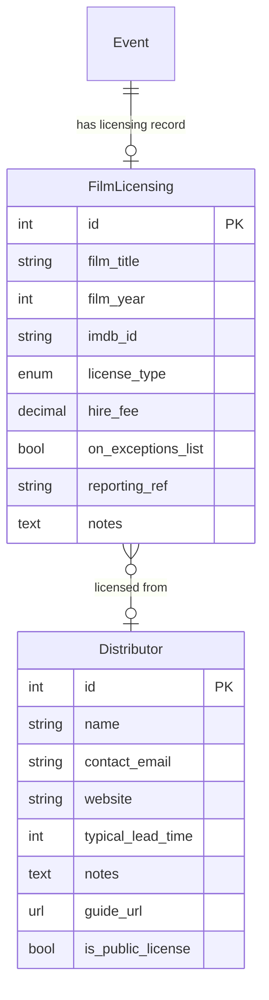

# S&S Toolkit — Events, Programming & Rota

Feature specs for the diary, event creation, programming pipeline, rota, room bookings, and related tooling.

**For work status:** [CURRENT_WORK.md](../../CURRENT_WORK.md)

## Quick navigation by topic

**Programming workflow** — how events go from idea to approval to screen:
[9.2 Programming pipeline](#92-event-programming-pipeline) ·
[9.9 Break-even calculator](#99-break-even-calculator-for-programmers-) ·
[9.14 Post-screening checklist](#914-post-screening-admin-checklist-) ·
[9.15 Film metadata](#915-film-metadata-distributor-records-and-screening-reports-) ·
[9.18 Event create/edit UX](#918-unified-event-createedit-ux-) ·
[9.108 TicketSource guide](#9108--ticketsource-setup-guide-in-the-event-creation-flow-) ·
[9.109 Mark as confirmed](#9109--mark-as-confirmed-as-a-satisfying-end-of-creation-action-)

**Rota management** — volunteer sign-up and rota operations:
[9.3 Rota management view](#93-volunteer-rota--improved-management-view) ·
[9.10 Rota improvements](#910-rota-improvements-from-the-backlog) ·
[9.25 Mobile sign-up](#925-tap-to-sign-up-on-rota-mobile-self-service-) ·
[9.29 Role management](#929-role-management-multiple-other-roles-and-role-change-behaviour-) ·
[9.40 Setup/doors times](#940-setup-time-doors-open-time-and-final-volunteer-time-on-showings-) ·
[9.44 Role notifications](#944--role-based-rota-notifications-) ·
[9.47 Role display order](#947--rota-role-display-order-) ·
[9.52 Rota links](#952--rota-links-from-rota-notes-replace-eventlink-model-) ·
[9.53 End time](#953--show-end-time-on-the-rota-) ·
[9.72 Role deletion](#972--role-deletion-cascades-silently-to-all-historical-rota-entries-) ·
[9.73 Outside hire badge](#973--display-outside-hire-flag-prominently-on-rota-) ·
[9.75 Starred events](#975--starred-and-shadowed-events-on-the-rota-) ·
[9.76 Rota date nav](#976--rota-date-navigation-and-orientation-) ·
[9.165 Historical rota visibility](#9165--decide-and-fix-historical-rota-archive-visibility-) ·
[9.166 Whole-day rota edit window](#9166--allow-rota-note-edits-for-the-whole-showing-day-not-just-until-start-time-)

**Room bookings and calendar:**
[9.7 Multi-room bookings](#97-room-booking--multi-room-and-clash-detection) ·
[9.33 S&S spaces + calendar](#933-ss-spaces-seed-data--diary-column-per-room-display-) ·
[9.41 Room filter](#941-clickable-legend-room-filter-calendar-) ·
[9.43 Room management UI](#943--room-management-ui-)

**Individual event features:**
[9.21 Recurring events](#921-recurring-events--clone-to-dates-) ·
[9.26 Resource links](#926-event-resource-links-generalised-rota-links-) ·
[9.48 Template export/import](#948--template-exportimport-) ·
[9.54 Cost terms](#954--structured-event-cost-terms-) ·
[9.55 Legacy archive](#955--legacy-event-archive-stub-display-and-import-) ·
[9.66 Film metadata](#966--film-event-metadata--tmdb-integration---done-2026-06-11) ·
[9.69 Showing dates UX](#969--event-detail-showing-date-ux-improvements-) ·
[9.71 Terms change log](#971--event-terms-and-financial-field-change-log-) ·
[9.131 Clone from past](#9131--clone-from-past-events-) ·
[9.132 Template from event](#9132--create-event-template-from-an-existing-event-) ·
[9.141 Poster import](#9141--filmscreened-work-import-poster-from-omdb-with-copyright-acknowledgement-) ·
[9.142 One-shot role UX](#9142--one-shot-role-remove-button-ux--deletion-warning-) ·
[9.149 Itemised budget lines](#9149--itemised-budget-lines-estimate-vs-actual-per-event-type-)

**Dashboard and toolkit UI:**
[9.35.1 Dashboard section](#9351-toolkit-homepage-dashboard-section-above-link-directory-) ·
[9.91 Rota gaps widget](#991--dashboard-widget-upcoming-showings-with-gaps-in-the-rota-) ·
[9.92 Unconfirmed widget](#992--dashboard-widget-unconfirmed-upcoming-showings-) ·
[9.95 Bulletins](#995--bulletins-operational-notice-board-with-dashboard-banner-)

**Notifications and comms:**
[9.11 Notification alternatives](#911-notification-alternatives-to-email-)

---

### 9.2 Event programming pipeline

**Goal:** Formalise the process of proposing and approving events, aligned with
how Monday programming meetings actually work.

#### Background: the programming etiquette guide

The collective has agreed a set of norms for programming that is currently
documented in a written guide. The key principles most relevant to the
toolkit are:

**Pre-requisites for programming (guidance, not hard gates):**
- Volunteers should do approximately 10 shifts before programming their own
  event, and maintain roughly 5 shifts in the preceding 6 months
- They should attend Monday meetings and observe how decisions are made
  before proposing events of their own

These are social norms, not enforceable rules. The system currently has no
way to verify shift counts (rota names are free text — see 8.1), and even
once that is fixed, enforcing a gate would be antithetical to the ethos.
The appropriate toolkit response is to **display these requirements as
guidance** at the point of event creation, not to block submission.

**At the Monday meeting — the programmer should bring:**
- An itemised budget breakdown (expected costs and income)
- If total estimated costs exceed **£500** (or **£750** for music events),
  the proposal is referred to the Finance Collective for further
  authorisation before it can be confirmed

**After approval — the programmer is responsible for:**
- Adding themselves to the Programmer rota slot immediately
- Putting the event on the rota as soon as possible, and no less than
  **one week before** the showing
- Checking rota sign-up well in advance — not the day before
- Accurately identifying the number and types of volunteer roles needed
- Noting shift times for multi-shift roles (e.g. bar shift 1: 5:30–8pm,
  shift 2: 8–10pm)
- Arranging food for late nights and long events (and including this in
  the agreed budget)
- Keeping the place clean afterwards — adding cleaning and washing-up
  roles to the rota if needed
- Assisting the keyholder in shutdown
- **Not signing up for additional roles** if they are the programmer —
  their job is to be present and coordinate, not to be tied to a specific
  task

The financial ethos is explicit in the guide: *"A budget is not a goal.
It's all our money, so be thrifty where you can."* It costs approximately
**£200 to open the doors to the public**; that baseline is worth surfacing
to new programmers who may not have a feel for what events cost.

#### Features

- **Draft / pencilled-in state** — events can be created in a "proposed"
  state before being discussed at a meeting
- **Programming queue** — a view showing all proposed events in submission
  order, suitable for working through as a stack at a meeting
- **One-click approval / rejection** — during a meeting, events can be
  quickly approved (moved to "confirmed") or rejected (moved to "rejected")
  with a reason
- **Programming criteria fields** — structured fields to capture itemised
  costs (hire, tech, performer fee, accommodation, travel, food, other),
  expected revenue, split/deal type, and tech requirements, presented at
  the Monday meeting. These feed directly into the break-even calculator
  (section 9.9).
- **Finance Collective referral flag** — when total estimated costs exceed
  the configured thresholds (`FINANCE_REFERRAL_THRESHOLD_STANDARD = 500`,
  `FINANCE_REFERRAL_THRESHOLD_MUSIC = 750`), the event is flagged in the
  programming queue as requiring Finance Collective sign-off before
  confirmation. The flag is a visible warning, not a hard block — the
  collective governs this, not the system.
- **Etiquette guide link** — a visible link to the programming etiquette
  guide displayed on the event creation screen and in the programming queue.
  Implemented as a `PROGRAMMING_ETIQUETTE_URL` settings variable. A static
  URL pointing to the document in NextCloud is sufficient; the guide does
  not need to be migrated into the toolkit.
- **Pre-requisite reminder** — at the point of first event creation, a
  brief, non-blocking notice: *"Before programming your first event, have
  you completed around 10 volunteer shifts and attended a Monday meeting?
  [Programming guide ↗]"* — displayed once (or until dismissed), not on
  every subsequent event.
- **Rota deadline warning** — if a confirmed showing is less than 7 days
  away and has no rota entries, show a warning to the programmer on the
  event's edit page and in the rota view.
- **Auto-populate programmer rota slot** — when an event is approved from
  the queue, the name(s) of whoever proposed it are automatically written
  into the Programmer rota slot(s) for each showing. This removes the most
  common omission from the rota and means the programmer's accountability
  is recorded from the moment an event is confirmed.
  Where multiple people co-proposed an event, multiple Programmer slots are
  created accordingly.

### 9.3 Volunteer rota — improved management view

**Goal:** Make the rota view less overwhelming — especially for new and
neurodivergent volunteers — while making it easier for everyone to find
events they can help with.

The current rota is a dense wall of text: every showing, every role slot, and
all rota notes are displayed at once. This is a significant barrier for new
volunteers who don't yet know the venue's rhythms, and for anyone who finds
dense information layouts difficult to process.

#### Reducing information overload

- **Collapse rota notes by default** — show a short summary (first line or
  first N characters) with an expand button. Long operational notes are useful
  but shouldn't dominate the view for someone just looking for a shift to join.
- **Filter by tag** — show only showings of a given event type (e.g. "film",
  "music"). Reduces the list to a manageable size for volunteers who only want
  to help at certain kinds of events.
- **Filter to show only events with vacancies** — a one-click way to hide
  fully-staffed showings. A new volunteer scanning for something to join
  shouldn't have to read every showing to find open slots.
- **Colour-coded vacancy status** — at a glance, showings where key roles are
  unfilled are visually distinct from fully-staffed ones.

#### Friendly for new volunteers

Not all roles are equally approachable. Usher and Box Office are low-barrier
entry points: they require no specialist knowledge, are well-supported on the
night, and are explicitly described as "easy to drop into" in the venue's
culture. The rota should reflect this.

- **"Good for new volunteers" role flag** — a boolean on `Role` (e.g.
  `newcomer_friendly`) that can be set by Panopticon. Roles flagged this way
  are visually marked in the rota (e.g. a small label or icon) so new
  volunteers can immediately see where they're most welcome.
- **Newcomer-filtered view** — a toggle or separate URL that shows only
  showings with open newcomer-friendly slots. A new volunteer sent a link to
  this view sees exactly what they need without any noise.
- **Role guides** — each `Role` can have an optional short description (one
  or two sentences) and an optional URL linking to a guide or tutorial video.
  The venue already hosts role-relevant training content on its YouTube
  channel; the same pattern applies to written guides in NextCloud or
  elsewhere. No extra infrastructure is needed — just URL fields on the
  `Role` model.

  The design challenge is surfacing these guides for people who need them
  without cluttering the interface for experienced volunteers who find them
  noise. The goal is *findable but not intrusive*: a veteran should be able
  to use the rota for months without the guides getting in their way, while a
  newcomer should be able to find them without asking anyone.

  Options for achieving this, in order of increasing sophistication:

  - **Icon-only affordance** — a small, visually quiet icon (e.g. a book or
    info symbol) next to the role name, with no accompanying text. Experienced
    volunteers develop habituation and stop seeing it; newcomers are curious
    enough to click. The guide opens in a new tab or a small popover. This
    requires no account history and works immediately.
  - **Shown only on first sign-up** — if volunteer accounts track rota
    history, the guide is shown more prominently the first time a volunteer
    signs up for a given role (e.g. a "first time doing this? here's a
    guide" prompt inline), and reduced to the quiet icon thereafter. Requires
    rota entries to be properly linked to accounts (see 9.2).
  - **"New to this role" opt-in** — a small checkbox or toggle at the point
    of signing up: "first time doing this?" Checking it expands the guide
    inline. Opt-in, so veterans never trigger it and newcomers get exactly
    what they need at the moment they need it. Works without account history.

  **On using sign-up counts:** if rota entries are linked to volunteer
  accounts, the system will naturally accumulate a count of how many times
  each volunteer has signed up for each role. This is potentially useful —
  for surfacing guides on first sign-up, for the wellbeing dashboard (9.5),
  and as a lightweight proxy for experience in informal roles like sound/tech
  where no formal training gate exists.

  However, there are real risks in how this data is used or displayed:

  - **As a gate:** using sign-up count to restrict access to roles ("you
    must have done this N times before signing up") would be antithetical to
    the non-hierarchical ethos and replicate the problems of the current
    training record system in a different form.
  - **As a visible score:** displaying counts to other volunteers could
    create informal hierarchy and social pressure, even unintentionally.
    A volunteer with 2 sign-ups next to one with 20 may feel judged even if
    no gate exists.
  - **As a private signal:** the count used only internally — to decide
    whether to show a guide, or to flag role distribution in the wellbeing
    dashboard to coordinators — is much safer. The volunteer doesn't see a
    score; they just get or don't get the guide.

  The principle to hold onto: sign-up history should inform the system's
  behaviour towards the volunteer (show them a guide, suggest they shadow),
  never determine what they're permitted to do.

#### Programmer notes in the rota

Programmers sometimes need to leave notes specific to an event — technical
requirements, access instructions, things volunteers need to know before they
arrive. At the moment these go into the same `rota_notes` field as everything
else, where they can get buried or mixed with sign-up chatter.

There is tension here: making programmer notes visually prominent risks
implying a hierarchy that doesn't reflect the venue's non-hierarchical ethos.
The design should resolve this by treating it as *contextual* rather than
*authoritative* — useful information from the person who knows the event best,
not instructions from above.

Options to consider:

- **Inline highlight** — programmer notes appear in the same notes area as
  other rota notes but are visually marked (e.g. a subtle left border, a
  "from the programmer" label). Notes remain in the same flow; no separate
  section implies no separate status.
- **Collapsible header block** — a separate field (`Showing.programmer_notes`)
  displayed in a collapsed block above the main rota notes, expandable on
  demand. Keeps event-specific context out of the way until needed, without
  losing it. The label could be neutral ("Event notes") rather than
  "Programmer notes" to soften the hierarchy signal.

Either approach requires a separate `programmer_notes` field on `Showing`
(so the source can be distinguished even if the display merges them).
The inline approach is more aligned with the non-hierarchical ethos; the
collapsed header block is more practical for longer technical notes that
would otherwise dominate the view.

#### Programmer accountability in the rota

The programming etiquette guide makes several concrete demands of programmers
that the rota should help enforce (or at least surface). In order of how
directly they translate to toolkit features:

**"Add yourself as the Programmer on the rota."**
- **Warning highlight for unfilled Programmer slots** — any showing where the
  Programmer role is empty gets a distinct visual treatment (warning colour or
  symbol) in the rota view. This is separate from the general vacancy
  highlighting: a missing projectionist is a staffing gap; a missing programmer
  is also the person responsible for the event not having confirmed they'll be
  there.
- **Auto-populate from the programming queue** — see 9.2: when an event is
  approved, the proposing programmer's name is written into the Programmer slot
  automatically. The warning highlight serves as a fallback for events that
  bypass the queue or where the slot has been cleared.

**"Put your event on the rota ASAP and no less than a week before."**
- **Rota deadline warning** — if a confirmed showing is less than 7 days
  away and has no rota entries at all, flag this prominently to the programmer
  on the event edit page and in the programming queue. This is a soft warning,
  not a block.

**"Avoid signing up for additional roles if you are the programmer."**
- This norm is hard to enforce technically (the system doesn't know whether
  a role sign-up is "additional" or the primary Programmer slot). The most
  practical approach is guidance: display a note when a volunteer who is
  already in the Programmer slot attempts to sign up for another role on the
  same showing. The note can read something like: *"You're already the
  programmer for this event — consider whether you need to be in a specific
  role, or whether being available to coordinate is more useful."* Non-blocking.

**Multiple programmers:** events sometimes have two or more people
co-programming. The data model already supports multiple `RotaEntry` records
for the same role (via `rank`), so multiple Programmer slots are possible
without schema changes. The UI should make it easy to add a second Programmer
slot at event creation time, and the auto-populate should create one slot per
co-proposer from the queue.

**Programmers acting for external hires:** when `Event.outside_hire` is
`True`, the programmer is acting as the internal liaison for an external group
rather than as the creative lead. The Programmer rota slot still represents
the person responsible on the night, but the display could optionally note the
external hire context (e.g. "Programmer (external hire liaison)") to avoid
confusion for other volunteers about who to contact with questions about the
event vs. questions about the venue.

#### Shadow role support

**Background and current pain point.** The history of shadowing at S&S
illuminates the design problem clearly, particularly for projection:

- *Phase 1 (freeform):* Volunteers wanting to shadow wrote notes in the
  rota text field asking the projectionist if they could shadow. With no
  defined slot, there was no control over who wrote what or when, and
  whether the projectionist even saw the request.
- *Phase 2 (fixed shadow slot):* A "Projectionist (trained shadowing)" role
  was added to all cinema events. This solved the ad-hoc problem but created
  a new one: volunteers signing up to shadow *before* a projectionist had
  signed up. This placed the projectionist in the uncomfortable position of
  having to refuse a shadow if they weren't comfortable with one — after the
  shadow had already publicly committed.
- *Current state:* The shadow slot exists on all cinema events, accompanied
  by a large block of full caps warning text in every rota notes
  field:

  > *IN ORDER TO SHADOW PROJECTION YOU NEED TO HAVE DONE A PROJECTIONIST
  > TRAINING FIRST! PLEASE DO NOT SIGN UP FOR SHADOWING A PROJECTIONIST
  > BEFORE A PROJECTIONIST HAS SIGNED UP!*

  This text appears repeatedly across the rota and is one of the most
  visible friction points in the current system.

**Design goals.** A better system should:
1. Make the shadow slot only available once the primary role is filled
2. Give the person taking the primary role discretion over whether they want
   a shadow
3. Avoid requiring programmers to manually configure shadowing for every event
4. Not generate repeated boilerplate text in rota notes

**Proposed model — three-mode shadow control.**

Programmers can set a shadow policy for each role slot when creating or
editing an event (or its template). Three options:

| Mode | What it means | Visible in rota as |
|---|---|---|
| **Solo** | No shadow slot. The role is taken by one person only. | Single role slot as normal |
| **Shadow open** | A shadow slot is automatically unlocked once the primary slot is filled. Any qualified volunteer can sign up to shadow after that. | Primary slot + shadow slot (greyed out / locked until primary is filled) |
| **Shadow at primary's discretion** | A shadow slot is *offered* by the person who fills the primary role. They can open it after signing up, or leave it closed. | Primary slot + a toggle/button for the primary volunteer: "Open to a shadow?" |

The default for most roles should be **Solo**, and templates can set
per-role defaults. The "shadow at primary's discretion" mode is specifically
designed for the projectionist case: the slot does not exist until the
projectionist creates it.

**Behaviour details:**

- In **Shadow open** mode: the shadow slot appears in the rota but is
  visually locked (e.g. greyed out) until the primary slot has a name in
  it. Once filled, the shadow slot becomes clickable. If the primary slot
  is cleared, the shadow slot locks again (and any existing shadow name is
  removed with a notification).
- In **Shadow at discretion** mode: after a volunteer fills the primary
  slot, they see an "open this role to a shadow?" toggle in their view of
  the rota. If they toggle it on, a shadow slot appears. If they toggle it
  off (or never toggle), no shadow slot is visible to others. The
  projectionist can also close the shadow slot after it has been opened
  (e.g. if they later decide they'd prefer to concentrate), which removes
  the shadow name with a notification.
- In all modes, the **shadow slot is visually distinct** from the primary
  slot — a different icon, indentation, or label (e.g. "→ Shadowing [Role]")
  to make clear which is the primary commitment.

**Volunteer capacity in the cinema.** Separately from shadowing, the cinema
has a finite number of volunteer seats (~8 at the back of the room for
non-public volunteers, before people spill onto uncomfortable brought-in
chairs). On fully booked events this has caused genuine friction — volunteer
seats taken by the time volunteer attendees want to join. A future feature
could:

- Flag a threshold on a `Room` or `Showing` (e.g. `volunteer_seat_count`)
- When the number of rota entries for a showing approaches or exceeds that
  count, show a warning to programmers and volunteers signing up
- This is not a hard block (volunteers can always bring in extra chairs) but
  a soft nudge to keep expectations managed

**Data model change required:**

```
RotaEntry:
  + shadow_mode: enum [solo, open, discretion]  # on the template slot
  + is_shadow: bool  # on each actual entry

Role:
  + default_shadow_mode: enum [solo, open, discretion]
```

The `is_shadow` flag distinguishes display and responsibility without
requiring a separate model. The `shadow_mode` lives on the `RotaEntry`
template (the slot definition for an event/showing), not on the volunteer's
sign-up record.

**Size estimate:** 🟡 M — 16–30h. The UI changes (locked/unlocked slots,
discretion toggles) are non-trivial, but the data model change is
straightforward. Requires the rota to be linked to volunteer accounts (8.1)
for the discretion toggle to have a meaningful "primary volunteer's view".

### 9.7 Room booking — multi-room and clash detection

**Goal:** Let programmers accurately express which rooms an event needs and
when, and surface clashes before they become a problem on the night.

#### The data model change

Replace the single `room` FK on `Showing` with a separate `RoomBooking`
entity:

```
RoomBooking {
    showing     FK → Showing
    room        FK → Room
    start       datetime   (may differ from Showing.start)
    end         datetime
    notes       text       (optional — e.g. "tech setup only, not public")
}
```

A showing can have multiple `RoomBooking` records. `Showing.start` remains
the canonical public-facing start time. Room bookings record the full
footprint of the event in the building, which is often earlier and
occasionally later.

This change is backwards-compatible in behaviour: existing single-room
showings simply have one `RoomBooking` with the same start as the showing.

#### Clash detection

When a programmer saves a room booking, the system checks for any other
confirmed showing with a `RoomBooking` in the same room whose time window
overlaps. If a clash is found:

- Show a clear warning (not a silent failure — the programmer may have a
  legitimate reason, e.g. two events sharing a foyer at different ends)
- Require an explicit acknowledgement to proceed past the warning
- Surface existing clashes in the room availability view (below)

#### Room availability view

A calendar or timeline view showing each room's booking footprint across a
date range. Allows programmers to see at a glance whether a room is free
before proposing an event, without having to check every individual showing
in the diary.

#### "Other rooms" column — minor spaces without their own diary column 🔵 S (6–10h)

**Goal:** Make every bookable room in the building recordable in the diary
without adding a full column for each minor space. Useful for brief
notifications ("Middle Corridor blocked 14:00–15:00 for exhibition install").

**Design:**

1. **Model change** — add `Room.show_column = BooleanField(default=True)`.
   Rooms with `show_column=False` are fully bookable but bundled into a
   shared "Other" column. One migration; all existing rooms default to `True`.

2. **Seed data / rooms.toml** — activate currently commented-out rooms
   (Middle Corridor, Kitchen, Snug, Projection Booth) with
   `is_primary=false, show_column=false`. Add a `show_column` key to the
   toml format and the seed loader.

3. **Diary table (`edit_event_index.html` + `edit_views.py`)** — pass
   `column_rooms` and `other_rooms` lists separately to context. Add an
   "Other" column at the right of the room columns; its cell for a given
   time slot lists all non-column room bookings at that slot as plain text
   (e.g. "Middle Corridor"). New `other_bookings_at` simple_tag in
   `hash_filter.py` (same pattern as `showing_for_room_at`).

4. **Calendar (`edit_views.py` `edit_diary_data` + `calendar_index.js` +
   `edit_event_calendar_index.html`)** — add a synthetic `{"id": "other",
   "title": "Other rooms"}` resource to the FC resources list. Events for
   non-column room bookings get `resourceIds: ["other"]` and their room name
   prepended to the event title. Add an "Other rooms" checkbox to the room
   filter bar. The `rooms_and_colours` context list excludes non-column
   rooms; a separate `has_other_rooms` flag triggers the synthetic resource.

**Files touched:** `models.py`, new migration, `rooms.toml`, seed loader,
`edit_views.py` (two functions), `hash_filter.py`, `edit_event_index.html`,
`edit_event_calendar_index.html`, `calendar_index.js`. (~8 files)

**Not needed:** no change to `RoomBookingForm` — all rooms are already
selectable there; no change to clash detection logic.

### 9.9 Break-even calculator for programmers 🟢 XS

**Goal:** Help programmers quickly work out whether a proposed event is
financially viable, without needing a spreadsheet.

A simple in-browser calculator — no server round-trip needed — that takes:

| Input | Example |
|---|---|
| Venue hire cost (if any) | £80 |
| Technical costs (equipment hire, etc.) | £30 |
| Artist/performer fee | £150 |
| Accommodation for artist(s) | £60 |
| Travel costs for artist(s) | £40 |
| Food for volunteers (late nights / long events) | £30 |
| Other costs | £20 |
| Room capacity | 80 |
| Door split arrangement (%) | 70% to artist, 30% to venue |
| Ticket price / expected average | £5 (see PAYF note below) |

Outputs:

- **Break-even attendance** — the number of tickets that must be sold to
  cover all costs
- **Break-even as % of capacity** — how full the room needs to be
- **Revenue at various fill levels** — e.g. profit/loss at 25%, 50%, 75%,
  100% capacity
- A plain-English summary: *"You need to sell 35 tickets (44% of capacity) to
  break even. At a full room you'd make £48 for the venue."*

**Pay As You Feel (PAYF) pricing:**

S&S events commonly use PAYF pricing with suggested bands of £0, £3, £5, and
£7. Rather than requiring programmers to estimate attendance at each price band
separately (high mental overhead, usually speculative), the calculator should
accept a single **expected average ticket price** field. The programmer sets
the average they realistically expect people to pay and the calculator uses
that figure throughout.

A default of **£5** is a reasonable starting point — observed payment
distribution at S&S events suggests most people pay £5 or more when given the
choice, though this default should be updated once the data has been confirmed.
The field should be clearly editable so programmers can adjust it for events
where the audience skews differently (e.g. lower for community events, higher
for popular one-off shows).

This approach is deliberately simpler than per-tier modelling. Three inputs
of (£0 / 30%, £5 / 50%, £7 / 20%) are more accurate in theory but add
friction at the planning stage when approximate answers are all that's needed.
The single average-price field gives the same quality of decision signal with
far less cognitive overhead.

**Implementation notes:**

- Pure JavaScript — no new model fields, no database queries, no server
  changes needed for the calculator itself
- Could live as a standalone page (a link from the "add event" screen), or
  be embedded in the event creation form as a collapsible panel
- Inputs should be pre-populated from the event's existing fields where they
  exist (hire cost, capacity from the room record) to reduce friction
- The output is advisory only — no data is saved unless the programmer
  explicitly copies figures back into the event's cost/notes fields
- Does not need to handle complex deal structures (merchandise splits,
  guarantees vs. door deals) in the first version; a flat cost + percentage
  model covers the majority of S&S events
- The calculator should surface two important context figures:
  - **"~£200 to open the doors"** — the baseline cost of running any public
    event at S&S (venue overheads, utilities, staff time). This helps new
    programmers understand that even a zero-fee event carries a real cost,
    and that every ticket sold contributes to something meaningful.
  - **Finance Collective threshold** — if the total estimated costs exceed
    £500 (or £750 for music events), the calculator should note that the
    proposal will require Finance Collective authorisation at the Monday
    meeting. This prompts the programmer to prepare justification in advance,
    rather than being surprised on the night.

**Why this matters:** New programmers often have no intuition for whether a
proposed ticket price is realistic. A calculator that shows "at £6 you need
80% of the room to break even" prompts a genuine conversation before the
event is confirmed, rather than a post-mortem after a poorly attended show.
The Finance Collective thresholds give programmers a clear target to plan
towards, and the £200 baseline connects abstract numbers to real collective
effort.

### 9.10 Rota improvements from the backlog

The following smaller features were identified from a historical feature
request backlog (Trello board). Each is independent and can be picked up
individually.

#### 9.10.1 Filter rota by tag 🔵 S (4–8h)

The rota view already has a "vacancies" filter (section 9.3). Adding a
tag-based filter follows the same pattern: show only showings whose event
has a specific tag (e.g. "film", "music", "workshop"). This is particularly
useful for volunteers who only help with certain event types and want to
avoid scanning through unrelated entries.

Implementation: one query filter parameter, one dropdown in the rota view
header. The tag filter and vacancy filter should compose (i.e. both active
simultaneously).

#### 9.10.2 Clone rota text with events / rota note templates 🔵 S (4–8h)

When an event is cloned (e.g. a recurring weekly event like Sunday Cafe or
Family Film Club), the rota notes field is currently not carried over —
the programmer must re-enter it. This is friction for recurring events that
have stable operational notes.

Two approaches:

- **Simple:** when cloning an event, copy the `rota_notes` from the source
  showing(s) alongside the event details
- **Template-based:** allow an `EventTemplate` to carry a default
  `rota_notes` value (alongside default roles), which is pre-filled when
  a new event is created from the template. The programmer can then
  customise it.

The template-based approach is more powerful and better fits the existing
data model. The simple clone approach is faster to implement and useful
even without templates.

An **autosuggest** for rota notes (showing recent rota notes from events
of the same type or tag) would be a further enhancement — useful but adds
complexity and is not a priority over the simpler approaches.

**Known UX caveat (simple clone, implemented 2026-02-28):** The simple copy
is now live, but rota notes sometimes contain date-specific volunteer messages
("Alice says she can't make this date", "Bob will be 20 mins late"). When
cloned to a new date these notes are factually wrong and may cause confusion.
The risk is low for stable operational notes (equipment setup, access codes,
timing reminders) but higher for anything volunteer-specific.

Mitigations, in ascending order of effort — see 9.10.6 for detail.

#### 9.10.3 Rota vacancy reporting 🔵 S (4–8h)

A simple reporting page (linked from the internal dashboard) showing:

- How many open rota slots exist across all confirmed upcoming showings
- Broken down by role (e.g. "3 Keyholder slots unfilled in the next 4 weeks")
- Sorted by date, with a direct link to each showing's rota entry

This is effectively a more structured version of the existing "vacancies"
view, presented as a management report rather than a browsable list. Useful
for coordinators doing a weekly rota health-check without having to scroll
through every event.

#### 9.10.4 Calendar integration — .ics export 🔵 S (4–8h)

Many volunteers would benefit from importing their upcoming rota commitments
into their personal calendar (Google Calendar, Apple Calendar, etc.) to
reduce no-shows and reminder emails.

Two levels of implementation:

1. **Public programme .ics** — a feed (or one-off download) of all confirmed
   public showings. Any visitor can subscribe. Low effort; no volunteer
   accounts needed. Useful for audience members and volunteers alike.

2. **Personal rota .ics** (requires volunteer accounts + rota linked to
   accounts, 8.1) — a personal calendar feed showing only the showings the
   logged-in volunteer is signed up for. Each entry includes the showing
   time, event name, their role, and the rota notes. A unique secret URL
   (like `mailout_key`) allows calendar apps to subscribe without requiring
   login on every sync.

The standard format is iCalendar (RFC 5545, `.ics` file). Python's
`icalendar` library makes generation straightforward. No third-party service
is needed.

This is a meaningful alternative to reminder emails — a volunteer who has
their shifts in their calendar is less likely to forget them, and less
likely to need a reminder email the day before.

##### 9.10.4a "Add to calendar" per-showing links — MVP 🟢 XS (2–4h)

A zero-infrastructure precursor to the subscribable feeds in 9.10.4. For
each upcoming, non-cancelled showing, render three small "Add to calendar"
links. Surfaces:

- **Public event page** (`view_event.html`) — for audience members, so
  they can add the showing to their personal calendar in one click.
- **Volunteer rota page** (`edit_rota.html`) — same UI per upcoming
  showing, so a volunteer who has just signed up for a slot can put the
  shift straight into their own calendar without waiting on the personal
  rota feed (9.10.4 part 2). The link adds the showing as a calendar
  entry, not a role-specific event; the volunteer knows what they signed
  up for.

The links themselves:

- **Download .ics** — a per-showing iCalendar file served from a public
  URL (`/programme/showing/<id>/calendar.ics`). Works with Apple Calendar,
  Outlook desktop, and anything that handles `text/calendar`. Hand-rolled
  generation (no `icalendar` dep) — single VEVENT per file is trivial.
- **Add to Google Calendar** — `https://calendar.google.com/calendar/render?action=TEMPLATE&...`
  prepopulated with title, start/end (UTC), description, location, URL.
- **Add to Outlook** — `https://outlook.live.com/calendar/0/deeplink/compose?...`
  prepopulated equivalently. Covers Outlook.com web users.

Tradeoffs vs the subscribable feed (9.10.4):

- One-shot adds, not a subscription. If a showing is rescheduled or
  cancelled, the calendar entry won't update — users would need to delete
  and re-add. Acceptable for MVP because public-programme showings
  rarely move once published.
- No auth, no secret URLs, no per-volunteer plumbing. Ships in hours,
  not days.
- Complementary, not redundant: ships the user-facing benefit (entries
  in personal calendars → fewer missed showings) without blocking on
  account-linked rota work (8.1).

End-time calculation reuses `Showing.end_time` (already returns
`start + 2h` when `event.duration` is None, per the 2026-04-04 calendar
overlap fix).

#### 9.10.5 Role timing notes 🟢 XS–🔵 S (2–8h)

Individual roles on a showing don't have their own start and end times —
there is only one start time per showing and a general `rota_notes` field
shared by everyone. This means role-specific timing (e.g. "Bar shift 1:
5:30–8pm, Bar shift 2: 8–10pm") has to go into the rota notes as free text,
where it can easily get lost.

A lightweight solution: add an optional `timing_note` text field to
`RotaEntry` (or to the role slot template). Programmers can add a short note
per role slot (e.g. "5:30–8pm") that appears inline next to the role name in
the rota, visually distinct from the general rota notes.

This doesn't require a full time-range model — a short free-text field
(50–100 chars) per role slot is sufficient for the majority of cases.

#### 9.10.6 Review / edit rota notes during clone 🟢 XS–🔵 S (2–8h)

**Context:** Since 9.10.2 was implemented (simple copy of `rota_notes` on
clone), rota notes carry over to the new showing automatically. This is useful
for stable operational content (setup instructions, access codes, timing
reminders) but can mislead when notes contain date-specific volunteer messages
(e.g. "Alice says she can't make this date", "Bob will be 20 mins late").

**Mitigations in ascending order of effort:**

1. **Code comment only (done)** — `clone_rota_from_showing` carries a comment
   explaining the known UX risk and directing future implementors here.

2. **Inline warning on the "Add a booking" form** 🟢 XS (30min) — When the
   booking form in `view_event_privatedetails.html` is displayed, if the source
   showing has non-empty `rota_notes`, show a banner: "Rota notes from the
   previous showing will be copied — please review them after saving." No
   code change needed to the clone logic; just a template check.

3. **Editable rota-notes field in the clone step** 🔵 S (4–8h) — Change the
   clone flow so that the rota notes are pre-filled but editable before the
   new showing is saved. Requires the clone to become a two-step form rather
   than a direct save.

4. **Superseded by templating** — If 9.18.1 (EventTemplate with `rota_notes`)
   is implemented, programmers will create recurring events from templates
   (which contain canonical operational notes) rather than by cloning. At
   that point the "copy on clone" behaviour becomes a secondary path and the
   UX risk shrinks considerably. The simplest fix (option 2) is still worth
   doing in the interim.

**Recommended next step:** Option 2 — the inline warning is ten lines of
template code and closes the most likely surprise for current users.

**User testing note (2026-06-05):** Live system testing confirmed that being
able to edit rota text at the point of creation (from a template) would be
genuinely useful. This supports prioritising option 3.

#### 9.10.7 Clone event as new event 🔵 S (4–8h)

**Context (revised 2026-03-02):** The original plan was to port the `s+s`
"Clone booking" block from `form_showing.html`, which added a new *Showing*
to the same *Event*. After reviewing real usage, the dominant use case turns
out to be different: programmers clone an old event to reuse its **copy,
copy_summary, terms, notes, rota_notes, and rota structure** when creating a
new, distinct event — e.g. Community Kitchen next month, or a recurring film
series. Templates (9.18.1) cover the rota and structure half, but an event's
specific 25-word pitch (required by *The Crack* / *NARC* per 4.5) and
distributor terms live on the past Event record, not in a template.

The "Add a showing" section on the Event Hub already handles adding extra
dates to the *same* event (same programme listing, same poster). Clone-as-new-
event is the missing complement: create a whole new Event record pre-loaded
with content from the source.

**Scope:**

1. Add `CloneEventForm` to `diary/forms.py` — four fields: `event_name`
   (pre-filled from source), `start` (DateTimeField + flatpickr, pre-filled
   to source's latest showing start + 7 days), `room` (only if
   `MULTIROOM_ENABLED`, pre-filled from source), `booked_by` (pre-filled from
   source's latest showing).
2. Add `clone_event` view (`GET`/`POST`) at
   `GET /diary/edit/event/id/<pk>/clone/` — on `GET` renders a confirmation
   form; on `POST` creates a new `Event` copying all scalar text/config
   fields (`copy`, `copy_summary`, `terms`, `notes`, `film_information`,
   `pricing`, `ticket_link`, `pre_title`, `post_title`, `outside_hire`,
   `private`, `duration`, `template`), copies tags, creates one `Showing`,
   and calls `new_showing.clone_or_reset_rota(source_latest_showing)`. Media
   (images) is NOT copied — the programmer uploads a new image for the new
   event.
3. Add a "Clone as new event →" button to the Event Hub (below the showing
   cards, above "Add a showing"), linking to the clone form.
4. After successful POST, redirect to the new Event Hub.

**Fields intentionally NOT cloned:** media/images (venue-specific; requires
new upload), `legacy_id`, `legacy_copy`, `ticket_link` (distributor link is
date-specific — pre-fill blank so programmer notices it needs updating).

**Related:** 9.10.2 (rota notes cloned), 9.10.6 (inline warning on cloned
rota notes), 9.21 (multi-date batch clone — builds on this)

### 9.11 Notification alternatives to email 🟡 M (20–40h consideration + implementation varies)

Email is the current backbone of all toolkit communications. Email has real
advantages: it is open, accessible, relatively archival, and doesn't require
app installations. However, a significant and growing share of volunteer
communication happens via WhatsApp and other messaging apps, and there is
genuine appetite for push-notification-style reminders that don't land in
an already-crowded inbox.

**Options considered:**

| Approach | Pros | Cons |
|---|---|---|
| **Current state (email only)** | Open, accessible, no app required | Not real-time; lost in inboxes; fragmented with WhatsApp |
| **WhatsApp Business API** | Meets volunteers where many already are | Requires Meta integration; excludes non-WhatsApp users; privacy concerns; Meta's values misalign with S&S ethos |
| **Telegram bot** | Good bot API; open-source clients; no Meta | Another app to install; not universal |
| **Signal** | Best privacy story; aligns with S&S values | No official bulk-send or bot API for external integrations |
| **SMS (text message)** | Universal; no app required | Costs money per message; requires phone numbers; not conversational |
| **Native mobile app (iOS/Android)** | Push notifications; custom UX | Very large development effort; ongoing maintenance; app store compliance; accessibility burden |
| **Progressive Web App (PWA)** | Push notifications via browser; no app store; works on existing web stack | Browser push notifications are opt-in and unreliable on iOS; significant but not huge dev effort |

**Recommendation:**

The collective should make this decision with full awareness that
communications are already fragmented, and any new channel risks making
that worse. Email retains a unique quality: it is *relatively* open,
archive-able, and available to everyone regardless of which messaging app
they prefer or distrust.

Before building new notification infrastructure, the more immediately
impactful improvement is the `.ics` calendar feed (9.10.4), which reduces
no-shows without requiring any push notification infrastructure.

If a push notification channel is eventually adopted, a **PWA with browser
push notifications** is the most proportionate choice for the current
codebase — it uses the existing web app, requires no app store review, and
works on desktop and Android out of the box. iOS support for web push
notifications has improved in recent years.

Any notification system must be **opt-in**, configurable per-volunteer, and
**supplement** rather than replace email. The goal is to reach volunteers
who prefer async messaging — not to create new obligations for everyone.

### 9.14 Post-screening admin checklist 🟡 M (20–35h)

**Goal:** Ensure that every film screening is properly wrapped up — rights
report submitted, box office totals sent, DCP/disc returned, invoice
requested and confirmed paid — by tracking these steps per showing and
prompting the programmer automatically, without relying on memory or
goodwill alone.

#### Why this matters

The film programming group identified this as a recurring source of damage
in late 2025 (December meeting). There are four distinct post-screening
tasks, each with a different owner and a different failure mode:

1. **Box office returns** — the programmer must submit ticket sale totals
   to the distributor, usually within 7–14 days. Failure risks blacklisting.
   At S&S this has happened; the Janus invoicing crisis of 2025 was partly
   caused by returns not being filed, which blocked the invoice cycle.

2. **Invoice request** — for individual-hire screenings, the programmer
   should contact the distributor to confirm the screening took place and
   request or trigger an invoice. This is separate from the box office
   return: the return reports attendance; the invoice request initiates
   payment. Both can be forgotten independently.

3. **Invoice paid** — the finance collective pays the invoice. This step is
   visible only to finance; the film programming group has no way to know
   whether an invoice has been paid without chasing manually. The December
   2025 meeting asked explicitly for the finance collective to CC the
   programming email when invoices are settled.

4. **DCP/disc returned** — physical media (DCPs, Blu-rays) sent by
   distributors must be returned promptly. Failure to return media damages
   the relationship and may incur charges. The projectionist meeting in
   November 2025 raised this as a gap with no current tracking system.

None of these tasks are currently tracked anywhere in the toolkit. They
live in the programmer's head, in informal WhatsApp messages, and
occasionally in spreadsheet columns that the group has to maintain manually.

#### What the toolkit can do

The toolkit cannot submit reports or pay invoices. What it can do is:

1. Track the status of all four tasks per showing
2. Send timely reminders to the programmer for tasks 1–3
3. Provide one-click confirmation links so marking things done is frictionless
4. Show a dashboard of outstanding and overdue items for Panopticon
5. Notify the programming group when an invoice is marked paid by finance

#### Data model changes

Add a `PostScreeningChecklist` model linked to `Showing` (one-to-one):

```
PostScreeningChecklist:
  showing:                FK → Showing (OneToOne)

  # Rights report / box office returns
  report_required:        bool      # True for individual-hire film screenings; auto-set, overrideable
  report_submitted_at:    datetime  # null until marked done
  report_token:           str(64)   # single-use token for one-click confirmation from email

  # Invoice tracking
  invoice_requested_at:   datetime  # null until programmer confirms they've asked for the invoice
  invoice_paid_at:        datetime  # null until finance collective marks it paid
  invoice_token:          str(64)   # token for one-click "invoice requested" from email

  # Physical media return
  media_return_required:  bool      # True if a DCP or disc was supplied by the distributor
  media_returned_at:      datetime  # null until marked done
  media_return_token:     str(64)   # token for one-click confirmation from email
```

The checklist record is created automatically when a showing is confirmed,
with `report_required` and `media_return_required` set by auto-detection
(see below). All datetime fields are null until the relevant step is
completed. Tokens follow the same pattern as `Member.mailout_key`.

**Auto-detection logic:**

`report_required = True` when:
- the event has the `film` tag, **or**
- the event has a `FilmLicensing` record with `license_type = individual_hire`
  (see section 9.15)

`report_required = False` (no individual report needed) when:
- `FilmLicensing.license_type` is `public_license`, `self_produced`, or
  `rights_free` — these screenings are covered by the aggregate public
  licence report, not an individual submission

`media_return_required` defaults to `False` and is set manually by the
programmer or Panopticon when physical media arrives. There is no reliable
way to auto-detect this from current data.

Both flags can be manually overridden with a visible, deliberate toggle —
not a silent default.

#### Reminder schedule

After a showing's start time passes, the toolkit sends reminders for each
incomplete task:

| Task | D+1 | D+4 | D+8 |
|---|---|---|---|
| Box office returns | First reminder → programmer | Second reminder → programmer | Escalation → Panopticon + programmer |
| Invoice request | First reminder → programmer | Second reminder → programmer | Escalation → Panopticon + programmer |
| DCP/disc return | First reminder → programmer | Second reminder → programmer | Escalation → Panopticon + programmer |

Invoice-paid is not chased by the toolkit directly — that's a finance
collective responsibility. However, if `invoice_requested_at` is set and
`invoice_paid_at` remains null after D+30, a single low-priority nudge goes
to Panopticon.

"Programmer" is identified from the Programmer rota slot for that showing.
Since rota names are currently free text (8.1), the fallback is to send to
`vols_admin_address` with the programmer's name in the message body.

#### Email content

Each reminder should be practically useful, not a nag. Include:

- Film title and screening date/time
- A plain-language description of the task and why it matters (especially
  for new programmers)
- Relevant links: TicketSource report page (if `ticket_link` is set),
  distributor contact from `terms` field
- A prominent one-click confirm link for each incomplete item

A one-click confirm from email is essential. Requiring a login to mark
things done adds enough friction that people don't bother, and tracking
becomes unreliable.

#### TicketSource API integration (optional enhancement)

Since TicketSource exposes a REST API (see section 4), the reminder email
for box office returns can include:

> *As of this morning, TicketSource shows **47 bookings** for this event.*

This reduces friction: the programmer has the headline figure without
logging in to TicketSource first.

Implementation: extract the event ID from `ticket_link`, call
`GET /dates/{id}/bookings`, cache the result, fail gracefully (omit the
line if the API call fails).

**Known gap:** door sales are in EPOSnow, not TicketSource. Until an
EPOSnow integration exists, the email should note: *"This doesn't include
door sales — please add those before submitting."*

#### Finance collective integration

When an invoice is marked paid (by a finance collective member in
Panopticon), the toolkit sends a notification to the programming email
list. This closes the feedback loop that the December 2025 meeting
identified as missing: programmers currently have no way to know whether
their distributor has been paid without asking finance directly.

This notification should be low-key — a brief confirmation, not an alert.

#### Dashboard view — post-screening tracker

A new internal page (linked from the toolkit dashboard) showing all
showings that have a checklist, grouped by urgency:

| Group | Contents |
|---|---|
| **Overdue** (red) | Any item past D+8 and not completed |
| **Pending** (amber) | Items within the reminder window, not yet completed |
| **Complete** | All items done |
| **Upcoming** | Future confirmed showings that will generate a checklist |

Each row shows: film title, date, programmer (from rota), and a status
icon for each of the four tasks (box office, invoice requested, invoice
paid, media return). Panopticon can mark any item done from this view
(for when the programmer has done it outside the system).

Read-accessible to all logged-in volunteers; write-accessible to Programmer
and Panopticon.

#### Connection to existing infrastructure

The `terms` field on `Event` already holds distribution agreement details
including reporting contacts. The post-screening tracker is the natural
place to surface this: the programmer sees the distributor contact at the
moment they need it, not just when setting up the event.

The existing `/diary/terms/csv/` endpoint covers what agreements exist;
this tracker covers whether they've been honoured.

#### Size breakdown

| Component | Size | Hours |
|---|---|---|
| `PostScreeningChecklist` model + migration | 🟢 XS | 2–3h |
| Auto-detection logic at showing confirmation | 🟢 XS | 2–3h |
| Reminder email scheduling (D+1, D+4, D+8 per task) | 🟡 M | 8–12h |
| One-click token URLs (3 tasks × confirm endpoint) | 🔵 S | 4–6h |
| Dashboard / tracker view | 🔵 S | 5–8h |
| Finance notification on invoice-paid | 🟢 XS | 2–3h |
| TicketSource API booking count in email | 🔵 S | 4–8h (optional) |
| **Total (without TicketSource)** | **🟡 M** | **~25h** |
| **Total (with TicketSource)** | **🟡 M** | **~33h** |

### 9.15 Film metadata, distributor records, and screening reports 🟡 M (20–35h)

**User testing note (2026-06-05):** Pulling in film metadata during event
creation was described as "kinda annoying" in live system testing. The UX for
associating film licensing records with an event should be made more fluid —
consider inline search/autocomplete rather than a separate form step.

**Goal:** Give programmers a structured record of how each film was licensed,
make that knowledge searchable for future programmers, support the public
license workflow (screen without pre-announcing), and automate the periodic
regulatory screening report that a volunteer currently compiles and emails
by hand.

#### Why structured film metadata matters

Right now, the information about how a film was obtained — which distributor,
under what terms, at what cost — lives nowhere in the toolkit. It may exist
in an email thread, a spreadsheet, or a volunteer's memory. For a new
programmer wondering "who do we normally use for French arthouse?" or "can
we screen this BFI Classics title under our public license?", there is no
in-system answer.

A lightweight distributor and film licensing record, accumulated over time,
becomes a genuine institutional resource. It answers questions before they
have to be asked, and it protects against knowledge walking out of the door
when a long-standing programmer steps back.

#### The public license

S&S holds a blanket public screening license that permits screening certain
films without individually hiring them, subject to two conditions:

1. **The film must not be on the exceptions list** — the licensing body
   maintains a list of titles excluded from blanket coverage (typically
   films still in active theatrical distribution). Screening one of these
   under the public license would breach the agreement.
2. **The title must not be publicly advertised in advance** — the event
   listing can say "Family Film Club" but not "Family Film Club: Finding
   Nemo". The event is the thing being advertised; the specific film is
   revealed on the night (or in internal-only notes). This is a standard
   condition of umbrella public screening licenses.

Both conditions are currently managed entirely by the programmer's knowledge.
Neither is encoded anywhere in the toolkit.

#### Relationship to `film_information`

The existing `Event.film_information` field (a 256-character string) is
**public-facing** — it renders directly on the event's public programme
page. It currently stores display text like *"Dir: Werner Herzog, 1979, Cert
15, 94 mins"*. This field should remain as-is.

The new licensing metadata described here is **internal only** — it does not
appear in the public programme, and should not. These are two separate
concerns and should stay separate in the data model.

#### New data models

**`Distributor`** — a record for each rights holder or licensing source:

```
Distributor:
    name:              str     — e.g. "BFI", "Curzon Film", "MUBI", "Metrodome",
                                 "Public License", "Self-produced"
    contact_email:     str     (optional)
    website:           url     (optional)
    typical_lead_time: int     — days of notice typically required to arrange a hire
    notes:             text    — free text: pricing norms, quirks, who to contact,
                                 what kinds of films they handle
    guide_url:         url     — link to the relevant section of the film programming
                                 guide on NextCloud (a plain URL field; no API)
    is_public_license: bool    — True for the blanket public license record
```

**`FilmLicensing`** — a record per film event, linked to `Event`:

```
FilmLicensing:
    event:             FK → Event (OneToOne — one license record per event)
    film_title:        str     — exact title as registered with the rights holder
                                 (may differ from Event.name, especially for
                                 public license screenings where the event name
                                 is deliberately generic)
    film_year:         int     — release year
    imdb_id:           str     — IMDb title identifier (tt-prefixed), e.g. "tt0036775"
                                 Used as the canonical external reference. Populated
                                 via OMDb lookup (see below); can be entered manually.
    distributor:       FK → Distributor (nullable — not all screenings have a formal
                                 distributor record)
    license_type:      enum    — individual_hire | public_license | self_produced |
                                 rights_free
    hire_fee:          decimal (optional — for individual hires)
    on_exceptions_list:bool    — True if this film is on the public license exceptions
                                 list (only relevant when license_type = public_license)
    reporting_ref:     str     — reference number or identifier for the reporting body,
                                 if applicable
    notes:             text    — internal notes (e.g. "use BFI not Curzon for this
                                 director's catalogue", "DCP not available — DVD only")
```

#### OMDb auto-populate

The [OMDb API](https://www.omdbapi.com/) provides structured film data keyed
by title or IMDb ID. It is free with a registration key for low-volume use.

When a programmer creates a film event and enters a title, the event creation
form can offer a title lookup that returns:
- Confirmed title, year, director, runtime, certificate
- IMDb ID (`imdbID` in the OMDb response)

One click populates the `FilmLicensing.film_title`, `film_year`, and
`imdb_id` fields, and can also pre-fill `film_information` (the public
display string) with a formatted string like *"Dir: [director], [year],
Cert [rated], [runtime]"* — saving the programmer from typing it manually.

The lookup is a progressive enhancement: if the OMDb key is not configured
(`OMDB_API_KEY` in settings), the form fields appear as plain text inputs.
If it is configured, a search button appears next to the title field.

**The OMDb API is a dependency worth noting:** it is a third-party service
that could change its terms or go offline. The design should treat it as
a convenience (auto-populate on creation, not on every page load) and
store the result locally. Once the IMDb ID is saved, subsequent lookups
can be done against the stored data without calling the API again.

#### The public license workflow

When a programmer sets `license_type = public_license`:

1. **Exceptions check (soft warning):** if the `on_exceptions_list` field
   is `True`, show a prominent warning: *"This film is on the exceptions
   list for the public license. You cannot screen it under the public
   license — you will need to arrange an individual hire."* This is a
   warning, not a block; the collective governs exceptions, not the system.

2. **Title visibility check:** if `license_type = public_license` and the
   showing is confirmed and public (`confirmed=True`,
   `hide_in_programme=False`), check whether the licensed film's title
   (`FilmLicensing.film_title`) appears in any of the public-facing fields
   of the event: `Event.name`, `Event.pre_title`, `Event.post_title`,
   `Event.copy`, `Event.copy_summary`, `Showing.extra_copy`, or
   `Event.film_information`.

   If a match is found, show a warning: *"This film is being screened under
   the public license, which requires that the film title is not publicly
   advertised. The title '[title]' appears in the public event listing —
   please remove it before confirming."* Again, a warning with a require-
   acknowledgement step, not a hard block.

3. **Internal-only title display:** the actual film title is visible in the
   rota view, the event edit view, and the film licensing record — but is
   visually marked as "internal only" so programmers understand why it
   doesn't appear in the public programme.

#### Distributor lookup for new programmers

On the film licensing record and on the event creation form (for film
events), show a "Previous screenings of similar films" section — a
lightweight lookup that queries `FilmLicensing` records for events with
the same distributor, or with an IMDb ID whose director/genre data (fetched
from OMDb at creation time) overlaps with the current film.

Even without the director/genre matching (which requires OMDb data), a
simple "this distributor has been used for N previous events — here are
the most recent ones" list is useful. New programmers can see how others
have worked with a given distributor before reaching out.

The **film programming guide** lives on NextCloud. Rather than trying to
embed it in the toolkit, the right integration is:
- A `FILM_PROGRAMMING_GUIDE_URL` settings variable
- A clearly labelled link to the guide from the film licensing record form
  and from the distributor directory
- Each `Distributor` record can optionally carry a `guide_url` field linking
  to the specific section of the guide relevant to that distributor

The *Film and Television Programming Guide* (January 2025) has been shared and is documented in full as section 3.5 of this spec. The 25-word summary requirement, TicketSource setup process (including the specific pricing tiers and seating plan selection), and distributor list are all captured there. A live word counter for the `copy_summary` field is already implemented (Vanilla JS, 25-word target with colour feedback).

#### Periodic screening report

A volunteer currently compiles and emails a report of all screenings to a
regulatory or licensing body (likely the public license holder, or a body
such as MPLC or a PRS/PPL equivalent) on a periodic basis. The exact
format and recipient should be confirmed, but the data required is likely:

| Field | Source |
|---|---|
| Film title (exact) | `FilmLicensing.film_title` |
| Year | `FilmLicensing.film_year` |
| IMDb ID | `FilmLicensing.imdb_id` |
| Date(s) screened | `Showing.start` |
| License type | `FilmLicensing.license_type` |
| Number of attendees | TicketSource API (if available) |
| Distributor / reference | `FilmLicensing.distributor`, `FilmLicensing.reporting_ref` |

The toolkit can generate this report as a CSV download (or PDF if a
specific format is required) for a configurable date range. A management
command or a Panopticon-accessible view that produces the report and
downloads it removes the manual compilation step entirely.

The report should only include screenings with `FilmLicensing` records —
incomplete records can be flagged in the export ("film metadata missing")
so the volunteer knows which events to follow up on before submitting.

If the report must be *emailed* to a specific address on a schedule (rather
than downloaded manually), the same `mailerd` infrastructure used for
mailouts could handle this — but a downloadable report that a human sends
is simpler and less likely to cause problems if the format or recipient
changes.

#### Summary of new models



#### Size breakdown

| Component | Size | Hours |
|---|---|---|
| `FilmLicensing` and `Distributor` models + admin | 🔵 S | 6–10h |
| Event creation form integration + OMDb lookup | 🔵 S | 6–10h |
| Public license title-visibility check | 🟢 XS | 2–4h |
| Exceptions list warning | 🟢 XS | 1–2h |
| Distributor directory + previous screenings lookup | 🔵 S | 4–8h |
| Screening report CSV export | 🔵 S | 4–6h |
| **Total** | **🟡 M** | **~23–40h** |

### 9.18 Unified event create/edit UX 🟠 L (40–80h)

**Context (from programmer interviews, 2026-02):**

Programmers — including some who use the system infrequently — find the current workflow fragmented and confusing. Specific pain points raised:

- **Booking details are scattered.** Some are accessible via the Calendar view, some via the Event view, some only after clicking an event title and then a separate [EDIT] link. The path to any given field requires knowledge of which view surface it lives on.
- **"Confirmed" is the most consequential action** (it publishes the event to the public programme), but it is only accessible in the Calendar view, not the Event/Diary view. Its visual treatment doesn't reflect its significance.
- **"Edit Booking" is a misnomer.** The button only edits a subset of the booking; other fields live elsewhere.
- **Action button order is wrong.** Currently Delete appears before Clone. Order should reflect frequency and danger: **Edit → Clone → Delete**.
- **Cloning is used as a workaround for missing templates.** Programmers clone future events to reuse common settings, which is friction-heavy and error-prone. The right fix is proper templates (see 9.18.1 / 9.21), with clone demoted in prominence.

**Open design questions (answers needed before implementation — see CURRENT_WORK.md):**

1. In the current data model, Event and Showing (booking) are separate objects. A single event can have multiple showings. From the programmer's perspective, is that distinction useful or confusing? (i.e. do they ever programme the same film across two different dates and expect them to share public copy / poster?)
2. What is the most common post-creation edit? (copy, poster, rota, time?)
3. Should "Confirm to publish" apply to all showings of an event at once, or per-showing? (Currently it is per-showing/booking.)
4. Is there information that should only be visible to panopticons and not to regular programmers on the edit page? Or is everything that a programmer creates also editable by them?
5. Internal (rota, notes, T&C) vs external (copy, poster, title) split: would this feel natural, or would switching tabs be an additional cognitive burden?

**Goal:** A unified create/edit surface for programmers that:

- Puts all event information in one place — or at most two clearly-labelled tabs if the field count demands it
- Makes "Confirm to publish" a prominent, clearly-labelled action with appropriate visual weight
- Makes "Save draft" the default, no-consequences path
- Reduces the number of distinct pages/views a programmer needs to navigate

**Tab structure (open question — decide before implementation):**

"Public / Internal" is one possible split but may not map to how programmers think about the data. Alternative framings to evaluate with users:

- **Website / Diary / Rota** — mirrors the three main views they already navigate between
- **Show / House / Crew** — show = what's on screen (copy, title, poster); house = practical details (date, room, price); crew = rota, notes, internal-only fields
- **Single page** — if the current UI wastes space and prioritises rarely-used fields, reducing the form to essential fields may make a single-page layout viable without tab complexity

Preference (from programmer interviews, 2026-02): aim for **one page** first. The current forms prioritise rarely-used fields at the expense of common ones; a better field hierarchy and visual weight scheme may make a single scrolling page workable. Only introduce tabs if a focused usability test shows a single page is too long.

**Related:** 9.2 (approval pipeline), 9.18.1 (templates), 9.21 (recurring events / clone-to-dates)

#### 9.18.1 Supercharge EventTemplate 🔵 S (4–8h)

Update `EventTemplate` model to include `copy`, `copy_summary`, `rota_notes`, `terms`, `film_information`, and `private`. Add a "Save as Template" button to the Event Edit view to allow easy creation of templates from existing events.

#### 9.18.2 Unified create/edit form 🟡 M (16–30h)

Refactor to accept Event + Showing details in one form. Save creates both `Event` and `Showing` records transactionally. "Publish" sets `confirmed=True`; "Save Draft" sets `confirmed=False`. Post-save redirect goes to the event's own page, not the calendar. Design must resolve the questions above before implementation.

#### 9.18.3 Fix action button order 🟢 XS (1h)

In the calendar/event view action row, reorder buttons to: **Edit → Clone → Delete**. This matches frequency of use (most common first) and danger level (least destructive first). Styling: Edit = primary, Clone = secondary, Delete = danger/red.

### 9.26 Event resource links (generalised rota links) 🔵 S (8–16h)

**Context:**

The rota view has a prototype placeholder for a "Nextcloud link" — a clickable shortcut to event-related files. Currently it is hardcoded, has no backing model field, and requires a programmer to copy/paste from inside the edit view. The goal is to generalise this into a small set of named, clickable links visible directly on the rota, covering any mix of useful destinations: shared documents, crew chat, planning sheets, etc.

**Current state:** `edit_rota.html` renders a hard-coded `<span class="nc-placeholder">` with a comment that the field doesn't exist yet on the Event model. Nothing is stored; this is purely prototype UI.

**Model design:**

Add a new `EventLink` model (separate table, not a simple field on `Event`), so multiple links can be stored:

```python
class EventLink(models.Model):
    event = models.ForeignKey(Event, on_delete=models.CASCADE, related_name="links")
    label = models.CharField(max_length=80)   # user-supplied name, e.g. "Crew chat"
    url   = models.URLField(max_length=500)
    order = models.PositiveSmallIntegerField(default=0)  # display order

    class Meta:
        ordering = ["order", "pk"]
        constraints = [
            models.CheckConstraint(
                check=models.Q(order__lte=3),
                name="eventlink_max_3_per_event",
            )
        ]
```

Max 3 links per event, enforced at the model and form level (not just the DB constraint — the constraint is a safety net).

**Why event-level, not showing-level?** Linked resources (shared folders, crew chats, planning docs) belong to the event as a whole, not to a specific date/showing. A recurring event with multiple showings shares one folder. If per-showing links ever become necessary, the `EventLink` model can gain an optional `showing` FK later.

**URL security — domain whitelist:**

Links are displayed as live `<a href>` tags to logged-in users. To prevent the rota from becoming a phishing vector, only a whitelist of approved domains is accepted at validation time:

| Domain pattern | Covers |
| --- | --- |
| `*.riseup.net` | Riseup pads and shared notes |
| `*.nextcloud.com`, `*.nextcloud.org`, any path with `/nextcloud/` | Nextcloud instances (self-hosted vary; match on path heuristic or require full URL) |
| `chat.whatsapp.com` | WhatsApp group invite links |
| `linktr.ee` | Linktree profile links |

**Pragmatic note on self-hosted Nextcloud:** Self-hosted instances use arbitrary domains (e.g. `files.starandshadow.org.uk`). A pure domain whitelist can't cover these. Options:

1. **Allowlist by path pattern** — accept any URL containing `/nextcloud/` or `/index.php/s/` (NextCloud share path) regardless of domain
2. **Per-deployment allowlist** — a `EVENTLINK_EXTRA_ALLOWED_DOMAINS` setting that venues can extend (S+S adds their own instance)
3. **Link safety API** — fall back to Google Safe Browsing or similar for URLs not on the whitelist

Recommended approach: whitelist the known public domains above, plus `EVENTLINK_EXTRA_ALLOWED_DOMAINS = []` in `settings_common.py` (venues extend it). A self-hosted instance gets added to its venue settings. Non-matching URLs are rejected with a clear form error explaining which domains are accepted. No third-party safety API needed for MVP — the risk model is internal users adding links, not public submission.

**Rota view UI:**

Replace the prototype placeholder with real link chips, displayed horizontally below the rota title for the event:

```text
[☁ Event folder]  [💬 Crew chat]  [📄 Planning doc]
```

- Each chip is a styled `<a>` button opening in a new tab (`target="_blank" rel="noopener noreferrer"`)
- Chips only rendered if the event has at least one link; no empty space if no links exist
- Display order follows `EventLink.order`

**Rota edit UI:**

In the rota edit view (or the event edit view — TBD based on 9.18 unified edit work), a small inline formset:

- Starts with one blank row (label input + URL input)
- "Add another link" button reveals a second row, then a third; button hidden once 3 rows are shown
- Each row has a delete/clear button
- Client-side validation highlights disallowed domains before submit (copy from the backend whitelist into a small JS constant)
- Server-side validation is authoritative

**Out of scope for MVP:** per-link icons/categories (the chip label is sufficient), link expiry, link sharing with non-logged-in users.

**Related:** 9.18 (unified event edit), 9.3 (rota notes UX)

#### 9.26.1 EventLink templates — pre-populate links from event template 🟢 XS (2–4h)

**Motivation:** Some recurring event types always use the same resource links. For example, a Creative Writing group always uses the same WhatsApp group URL, and a weekly Monday meeting always links to the same Nextcloud for agendas / minutes. Currently a programmer must manually add these links each time they create a new event, even if a template already captures the event's roles, copy, and rota notes, and this'll get forgotten in daily practice.

**Design:** Add an `EventTemplateLink` model that mirrors `EventLink` but belongs to an `EventTemplate` rather than an `Event`:

```python
class EventTemplateLink(models.Model):
    template = models.ForeignKey(EventTemplate, on_delete=models.CASCADE, related_name="links")
    label    = models.CharField(max_length=80)
    url      = models.URLField(max_length=500, validators=[validate_event_link_url])
    order    = models.PositiveSmallIntegerField(default=0)

    class Meta:
        ordering = ["order", "pk"]
```

When a new `Event` is created from a template (in `Event.__init__` or wherever template defaults are applied), copy any `EventTemplateLink` records for that template into `EventLink` records on the new event. This mirrors how template roles are copied to rota entries. Max 3 links applies to the template too.

**UI:** Add a link formset to the event template edit page (same progressive-reveal pattern as `edit_event_links.html`) so Panopticon and Programmers can manage template links alongside template roles.

**Validation:** Use the same `validate_event_link_url` validator so template links are held to the same domain whitelist as event links.

---

### 9.21 Recurring events / clone-to-dates 🟡 M (16–30h)

**Context (from programmer interviews, 2026-02):**

Regular community events — Community Kitchen, Cleaning Club, weekly screenings — follow a repeating schedule and are currently created by cloning a previous event and adjusting the date. This is friction-heavy, error-prone (easy to forget to update the copy or rota notes), and produces a backlog of near-identical events with no shared lineage.

**Two design approaches — pick one before implementation:**

1. **Rule-based recurrence** (calendar-style): Define a rule (every Tuesday, first Saturday of the month, etc.) and the system generates future showings automatically. Powerful but complex to model and UI-heavy to configure.

2. **Clone-to-dates** (simpler, lower risk): When cloning an event, the user selects multiple target dates from a date picker. The system creates one new Showing per selected date, all copying the source event's metadata. No rule engine needed — just a smarter clone.

The programmer interviews suggest **clone-to-dates** is the right starting point: it directly addresses the existing workaround without requiring a rule engine.

**Open design questions (answers needed before implementation):**

1. Should all generated showings share one `Event` record, or each get their own? (Shared event = shared public copy and poster, which is usually correct for a recurring film or event.)
2. Should generated showings be created as `confirmed=False` (drafts) so the programmer can review before publishing?
3. Is there a maximum number of dates the UI should allow in one operation? (Guard against accidental runs of hundreds of showings.)
4. When a recurring showing's details need changing, should there be a "change this one / change all future" split like calendar apps?

**Scope for MVP (clone-to-dates only):**

- Add a multi-date picker UI to the Clone Event action (calendar checkboxes or a date-range + exclusion list)
- Create one `Showing` per selected date, linked to the source `Event`
- Mark all generated showings `confirmed=False`
- Success screen lists all created showings with links to edit each

**Related:** 9.18 (unified edit UX), 9.18.1 (event templates)

---

### 9.22 External hire field on rota 🟢 XS (2–4h)

**Context (from programmer interviews, 2026-02):**

Some rota slots are filled by people who are not volunteers — e.g. a paid projectionist hired for a special event, an outside performer doing their own sound, or a venue contact listed for coordination purposes. Currently programmers either leave the slot blank, add a free-text note to rota notes, or create a fake volunteer record. All three are hacks.

**Goal:** Allow a rota slot to record a free-text name for an external hire, distinct from a linked volunteer account. This person should appear on the rota printout / view but is not linked to a Volunteer record and receives no automated communications.

**Scope:**

- Add an `external_name` CharField (max 100, blank=True) to the `RotaEntry` model (or equivalent)
- In the rota editor UI, when the slot is not filled by a known volunteer, show a text input for the external name
- Display the external name in the rota view with a visual indicator (e.g. "(ext)" suffix or a different text style) so it's clear it's not a volunteer
- Migration required

**Out of scope:** payments, invoicing, external-hire scheduling, or any comms integration.

---

### 9.23 "Films start on time" banner 🟢 XS (1–2h)

**Context (from programmer interviews, 2026-02):**

The Star and Shadow (and Cube) do not show adverts or trailers before screenings — films start at the advertised time. This is a point of pride and an audience expectation that needs to be communicated clearly on the public-facing event pages.

**Goal:** Add a short, prominent banner or notice to event/showing detail pages stating that films start on time, with no adverts.

**Scope:**

- Add a new setting `FILMS_START_ON_TIME` (default `False` for Cube, `True` for S+S) to `settings_common.py` / `settings_starandshadow.py`
- In the event detail template (`view_event.html`, and the S+S override), conditionally render a banner block when the setting is true
- The banner copy should be configurable via a setting or a small Wagtail snippet (to avoid hardcoding venue-specific language)
- No database migration required for the MVP (settings-only approach)

**Related:** 9.18 (event detail page), S+S template comparison task

---

### 9.25 Tap to sign up on rota (mobile self-service) 🔵 S (8–16h)

**Context (from programmer interviews, 2026-02):**

Volunteers who want to sign themselves up for a rota slot currently have to either contact a programmer, or log in to the toolkit on desktop and navigate to the rota editor — a multi-step process that most volunteers don't know how to do. On mobile, the rota editor is functional but not optimised for self-service sign-up.

**Goal:** Allow logged-in volunteers to tap an empty rota slot on the rota view page to claim it for themselves, without going through the full editor UI.

**Scope:**

- Only applies to empty slots (no volunteer currently assigned)
- The volunteer must be logged in; non-logged-in users see a read-only rota
- Tapping a slot shows a confirmation prompt ("Sign up as [your name] for [role] on [date]?") before committing
- Confirmation makes a POST to a new endpoint (or extends the existing rota API) to create the `RotaEntry`
- The rota view refreshes to show the updated slot
- Slot is claimed for the logged-in volunteer; no ability to claim a slot for someone else via this UI (that stays in the full editor)
- Must handle the race condition: if two people tap the same slot simultaneously, the second gets a clear error ("This slot was just taken — please refresh")

**Out of scope for MVP:** Swapping slots, releasing a slot you've claimed, or any notification to the programmer that a sign-up occurred. These can follow in a later iteration once the basic sign-up is proven.

**Prerequisite:** 8.1 volunteer accounts (volunteers must have user accounts to use this feature)

**Related:** 8.1 (account-linked rota), 9.2 (rota account sign-up)

---

### 9.29 Role management: multiple "other" roles and role-change behaviour 🟡 M (16–30h)

**Problem 1 — "other role" limit per showing:**

The rota editor currently limits the number of distinct role *types* that can appear on a showing. You can only have one "Other Role" entry without editing a template. This breaks down for events that genuinely need several ad-hoc roles (e.g. two different tech helpers, a translator, a floor manager — all "other"). The current workaround is either to overload a named role or to hand-edit a template.

**Design question (answers needed before implementation):**

- Should "Other Role" become a truly free-text role that can be added multiple times? (Each entry would have a different volunteer name and no fixed role definition.)
- Or should programmers be able to create named roles on-the-fly per event, which then persist (or not) in the `Role` library?
- Is the right solution a richer per-event role model, distinct from the global `Role` catalogue?

**Problem 2 — what happens to rota entries when roles change:**

Currently, if a programmer edits the roles on a showing (e.g. changes the role name, or removes a role that has sign-ups), the system's behaviour is unclear to programmers and potentially destructive. Investigation needed:

- If a `Role` is removed from a showing's rota after a `RotaEntry` already exists for that role, is the entry orphaned, deleted, or preserved?
- If a role's name changes, are existing `RotaEntry` records updated or stale?
- Do programmers get any warning before destroying rota data?

The spec should define: rota entries should never be silently deleted by a role change. If a role is removed that has entries, the system should warn and offer to either reassign the entries to a different role, or explicitly discard them.

**Related:** 8.1 (rota linked to accounts), 9.3 (rota notes UX)

---

### 9.30 Outside hire enhancements in Event Hub 🔵 S (6–12h)

**Context:**

The Event Hub exposes an "Outside hire" checkbox on the event details row, but:

- There is no tooltip explaining what it means
- Ticking it reveals no additional fields — programmers have no structured way to record *who* the hire is
- Internal volunteers arriving for an event have no way to know what external crew will be present

**Goal:** Make "Outside hire" a useful, structured field rather than a bare checkbox.

**Scope:**

1. **Tooltip** — add a Bootstrap tooltip to the ⓘ icon on the Outside hire row: *"Check this if the event involves an external company or individual using the space under a hire agreement rather than as a volunteer-run event."*

2. **Hire name popup field** — when the Outside hire checkbox is ticked, reveal an additional text field: "Name of hiring party or organisation". Stored as a new `Event.hire_name` CharField (blank=True, max 200).

3. **External crew notes field** — a second optional field that appears alongside hire name: "External staff / crew attending". Free text (max 500 chars, blank=True) for programmers to note who will be on-site from the external party (e.g. "Sound technician + 2 stage crew from [company]"). Label needs refinement — "external crew", "outside staff", "their team" — ask the coordinator collective what term feels natural.

4. **Rota surface** — display the hire name and external crew info in the rota view for that showing, so internal volunteers know who to expect. This is read-only in the rota; editable only in the Event Hub.

**Data model:** `Event.hire_name` (CharField, blank=True), `Event.external_crew_notes` (TextField, blank=True). Migration required.

**Related:** 9.22 (external hire rota entry), 9.18 (Event Hub)

---

### 9.31 Beginner-friendly rota slot highlighting 🟢 XS (2–4h)

**Goal:** Help new volunteers identify which rota slots are accessible to them without experience.

**Two complementary approaches:**

1. **Filter in rota filterline** — add a "Beginner friendly" toggle to the existing rota filter bar (which currently has the Vacancies filter). When active, dims or hides slots that are not flagged as beginner-friendly, so new volunteers can scan for their best options quickly.

2. **Auto-tag "extra hands" roles** — any role whose name contains the substring "extra hands" (case-insensitive) should automatically be treated as beginner-friendly and display the beginner-friendly indicator (a small leaf/star icon or a "BF" badge). This auto-tag means no manual data entry is needed; as roles are named consistently the feature works out of the box.

**Existing `Role.accessibility_notes` field (9.17↳):** That field covers accessibility for disabled volunteers. Beginner-friendly is a separate concept — it's about experience level, not physical accessibility. Keep them separate.

**Implementation:** Add a `beginner_friendly` boolean to `Role` (or derive it purely from the name pattern). Render the indicator in `edit_rota.html` and `view_rota.html`. Add the filter control to the rota filterline JS alongside the existing vacancy filter.

---

### 9.32 Rota time navigation: should past dates be accessible? 🟢 XS design decision needed

**Question:** Should the rota viewer/editor allow navigating to past dates?

**Arguments for allowing past navigation:**

- Volunteers may want to confirm they worked a past shift (memory aid)
- Coordinators may need to check who was rostered for a historical event
- Useful for GDPR audit / data requests (8.1)

**Arguments against (or for restricting):**

- Editing past rota entries is almost always a mistake; past data should be read-only
- The rota view is already a wall of text; adding unlimited past navigation makes it harder to find the present

**Proposed resolution (needs user decision):** Allow navigation into the past for read purposes (view only). Keep the rota edit controls disabled or hidden for showings whose `start` is in the past (`showing.in_past`). The template already has an `in_past` check on individual rows — extend this concept to the navigation controls.

**Decision needed from coordinator collective** before implementation.

---

### 9.33 S&S spaces: seed data + diary column-per-room display 🟡 M (16–30h total)

**Part 1 — Seed data for all S&S spaces (🟢 XS, 1–2h):**

The live S&S toolkit shows 9 distinct room/space columns in the diary edit view. The current `seed_dev_data` command only seeds a subset. Rooms to add (confirmed from live site HTML):

| Room name | Notes |
|---|---|
| Cinema | Main screening room |
| Venue Space | Flexible main hall |
| Café | Café area |
| External | Events at off-site locations |
| Meeting | Meeting room |
| Dark Room | Darkroom for photography |
| Print Room | Printmaking space |
| workshop | General workshop space |
| Green room | Backstage / green room area |

Update `seed_dev_data` to create all 9 rooms with distinct colours. Consider whether to assign colours meaningfully (e.g. Cinema = dark, Café = warm, Workshop = earthy) or just ensure they are visually distinguishable.

**Part 2 — Diary edit: column-per-room weekly view (🟡 M, 14–28h):**

The live S&S diary edit view at `/diary/edit/` displays a weekly table with one column per room, so programmers can see room clashes at a glance. The current dev diary edit view does not replicate this. The live site HTML confirms the structure: rows are dates, columns are rooms (Cinema | Venue Space | Café | External | Meeting | Dark Room | Print Room | workshop | Green room), with events appearing in the appropriate column cell.

This is a significant UX improvement for avoiding room clashes — arguably the most important single navigation improvement for programmers.

**Design questions before implementation:**

- With 9 rooms, the table is wide on mobile. Should a responsive fallback collapse to a list view on small screens?
- How should multi-room events (a single showing that uses Cinema + Café) appear — in both columns, or in the first room column with a "+" indicator?
- Colour coding: use Room colours as column header backgrounds, matching the existing room colour scheme?
- The live site also has a text filter input ("by title/booker column") — replicate this? Yes, it's useful.

**Related:** 9.7 (room booking data model), 8.11 (multi-room events)

---

### 9.34 "Showing" / "Session" terminology review 🟢 XS design discussion

**Problem:** The term "Showing" (from `Showing` model, mapped to "Booking" in the UI) was coined for film screenings. It is accurate for repeated screenings of the same film but feels wrong for recurring community events like "Induction (monthly)" or "Cleaning Club (every Friday)".

The data model (Event → multiple Showings/Bookings → single Room) is sound. The question is what to call a *Showing* in volunteer-facing UI and documentation.

**Candidate terms:**

| Term | Pro | Con |
|---|---|---|
| **Session** | Neutral, works for film and non-film | Not widely used in toolkit yet |
| **Date** | Ultra-simple ("add a date") | Loses time information in the label |
| **Booking** | Already used in some toolkit UI | Implies external booking / reservation |
| **Instance** | Precise | Technical; not volunteer-friendly |
| **Slot** | Familiar from rota context | Overloaded — means rota slot too |

**Recommendation to put to coordinator collective:** "Session" or "Date" — pick one and apply consistently across all volunteer-facing UI strings (leaving the Django model name `Showing` and its database unchanged for backwards compatibility).

**Scope:** Once decided, update all Django template strings, view titles, form labels, and any user-facing help text that uses "Showing" or "Booking" ambiguously. No model migration needed.

---

### 9.35 1-click access from top nav to diary/rota edit 🟢 XS (1–3h)

**Problem:** 90% of volunteer toolkit usage is navigating straight to either the diary edit view (`/diary/edit/`) or the rota edit view (`/diary/edit/rota/`). Currently both require multiple clicks from the top nav.

**Goal:** Make these two views reachable in one click from anywhere in the toolkit, while keeping the existing navigation accessible for the 10% of users who need other views.

**Options:**

1. **Dedicated nav links** — add "Diary" and "Rota" as direct top-nav items linking to `/diary/edit/` and `/diary/edit/rota/` respectively. Simple, discoverable, permanent.
2. **Nav dropdown** — a single "Edit" top-nav item that expands to show both. One extra click but a cleaner nav bar.
3. **Keyboard shortcut** — add page-level keyboard shortcuts (e.g. `d` for diary, `r` for rota) for power users. Complementary, not a replacement.

**Recommendation:** Option 1 — explicit "Diary" and "Rota" links in the top nav, only visible to logged-in users with the appropriate permissions. Check which base template (`base_admin.html`) controls the top nav and add conditional links there.

---

### 9.35.1 Toolkit homepage: dashboard section above link directory 🔵 S (10–14h)

**Context:** The `/toolkit/` homepage is currently a pure link directory -- hardcoded cards by permission tier plus a superuser-managed custom link group at the bottom. It has no live information. This spec adds a personalised dashboard section above the existing directory, without removing or replacing it.

---

#### Why both, not either/or

The link directory solves a real problem: where do I find X? Infrequent users and newly inducted volunteers need it. The dashboard solves a different problem: what's happened since I last logged in, and what do I need to do? Both are useful. The simplest resolution is to stack them: dashboard at the top, directory below a `<hr>`.

---

#### The custom link groups (IndexLink / IndexCategory)

The bottom section of the homepage is a set of superuser-managed link groups (`IndexLink` / `IndexCategory` models). These hold external URLs that have no dedicated toolkit page -- Nextcloud, WhatsApp groups, shared documents, supplier websites, etc. They also support an optional `description` field used for credential notes visible only to logged-in volunteers.

These must stay accessible. The dashboard addition does not displace them. If the homepage is ever restructured more radically, these groups would need a dedicated "Resources" or "External links" page first, so there is somewhere to link them from before removing them from `/toolkit/`.

---

#### Page structure

```
/toolkit/
├── [Dashboard section]           ← new
│   ├── Your upcoming shifts       (all volunteers with a linked account)
│   ├── New on the calendar        (Programmer+ only)
│   ├── Your starred events        (all volunteers; hidden if empty)
│   └── Shopping list: items needed (all volunteers; blocked on 9.88; hidden if nothing flagged)
├── <hr>
├── [Link directory]              ← existing, unchanged
│   ├── Rota card
│   ├── Programming card (Programmer+)
│   ├── Meta-programming card (Programmer+)
│   ├── Members card (Panopticon)
│   ├── Volunteers card (Panopticon)
│   └── Admin card (Panopticon)
├── <hr>
└── [Custom link groups]          ← existing IndexLink/IndexCategory, unchanged
    └── (e.g. Nextcloud, WhatsApp, supplier logins, etc.)
```

---

#### Dashboard widget specs

**1. Your upcoming shifts** — all logged-in volunteers with a `Volunteer` record linked

Query:
```python
RotaEntry.objects.filter(
    volunteer=request.user.volunteer,
    showing__start__gte=now,
    showing__confirmed=True,
).select_related("showing__event", "role").order_by("showing__start")[:5]
```

Display: compact table or list -- event name, date, role, link to rota entry (deep-linked with `#showing-{pk}` anchor per 9.61). Limit 5; "View full rota" link below.

Empty state: "You have no upcoming shifts. Browse the rota to sign up." (with link to `rota-edit`).

Only shown if `hasattr(request.user, 'volunteer')`.

---

**2. New on the calendar** — Programmer+ only (`perms.toolkit.write`)

Shows showings added to the diary since the user's last login. This catches both brand-new events and new dates added to existing events.

Query:
```python
Showing.objects.filter(
    created_at__gte=request.user.last_login,
    start__gte=now,
    event__private=False,
).select_related("event").order_by("created_at")[:8]
```

Display: event name, showing date, link to event hub. Group by event if multiple showings of the same event were added.

Edge cases:
- `last_login` is `None` (first-ever login): skip widget entirely, or show "Nothing yet -- this is your first login."
- `last_login` was a long time ago (e.g. months): cap the lookback at 30 days to avoid overwhelming the widget. `created_at__gte=max(last_login, now - 30 days)`.

Empty state: hidden (nothing new since last login is fine; no card needed).

---

**3. Your starred events** — all volunteers

Query:
```python
VolunteerEventMark.objects.filter(
    volunteer=request.user.volunteer,
    mark=VolunteerEventMark.MARK_STAR,
    event__showings__start__gte=now,
).select_related("event").distinct().order_by("event__showings__start")[:5]
```

Display: event name, next upcoming showing date, link to event detail.

Empty state: widget hidden entirely. No point showing an empty "starred events" card.

Only shown if `hasattr(request.user, 'volunteer')`.

---

**4. Shopping list: items needed** — all volunteers (blocked on 9.88)

Query (once 9.88 is built):
```python
NeedFlag.objects.filter(
    resolved_at__isnull=True,
).select_related("item", "flagged_by__member").order_by("flagged_at")[:5]
```

Display: item name, who flagged it, whether someone has pledged to get it (and their ETA). Link to `/volunteers/labs/shopping/`.

Empty state: widget hidden. "Nothing on the shopping list" is not actionable.

Note: this widget is not personalised -- it shows all current needs, not just ones relevant to the logged-in user. That's intentional: seeing what the venue needs prompts volunteers to help.

---

#### View changes

All dashboard data is computed in `ToolkitIndexView.get_context_data()` in `toolkit/index/views.py`. No new views needed.

Guard every volunteer-specific query:
```python
try:
    volunteer = request.user.volunteer
except Exception:
    volunteer = None
```

Pass `upcoming_shifts`, `new_showings`, `starred_events`, `shopping_needs` (once 9.88 is built) to the template context.

---

#### Template changes

Dashboard section is a Bootstrap row of widget cards, same visual language as the existing link directory cards. Each widget is a `col-md-6 mb-4` card.

Widget cards that are empty (no shifts, nothing starred, nothing needed) are hidden via `` -- no empty cards. The exception is "your upcoming shifts" which always shows (even if empty) because the empty state is an actionable call-to-action (sign up for a shift).

The existing hardcoded link directory cards and the IndexLink groups require no changes.

---

#### Nextcloud recent files (9.35.2 -- separate subfeature)

Intentionally out of scope for this ticket. The Nextcloud OCS Activity API (`GET /ocs/v2.php/apps/activity/api/v2/activity`) can return a per-account activity feed, but requires authentication. Two approaches:

- **Shared service account:** one set of credentials stored in settings; shows a venue-wide activity feed (not personalised). Simpler to implement, less useful for individuals.
- **Per-volunteer OAuth:** each volunteer authenticates once; shows their personal activity feed. More useful, but requires storing OAuth tokens per volunteer and handling token refresh.

Decision needed before starting: which auth model, and whether the S+S Nextcloud instance supports the OCS API. Raise with Marcus (see `feedback_marcus.md` -- strong on bare metal, unfamiliar with Docker; likely knows the Nextcloud setup).

---

#### Sizing

| Component | Est. |
|---|---|
| `get_context_data()` queries (shifts, new showings, starred events) | 2h |
| Template: dashboard widget cards + layout | 3h |
| Edge case handling (no volunteer record, None last_login, 30-day cap) | 1h |
| Shopping list widget (once 9.88 is built) | 1h |
| Tests (context data, empty states, permission gating) | 3h |
| **Total** | **~10h** (shopping list widget adds ~1h when 9.88 is done) |

**Dependency:** Shopping list widget blocked on 9.88. All other widgets are independent.

---

### 9.35.3 Star events from the public diary 🟢 XS (2–4h)

Currently starring and shadowing only works from the rota edit view. Logged-in volunteers visiting the public programme can't star events without navigating away. This creates friction and means the "Your starred events" dashboard widget isn't easily discoverable for new volunteers.

**Goal:** add a star toggle to the public event page for logged-in volunteers, mirroring what the rota already does.

#### Scope

- Add a star/unstar button to `view_event.html` (the single-event public page), visible only to authenticated users who have a `Volunteer` record.
- Clicking toggles `VolunteerEventMark` for `MARK_STAR` — same logic as the rota.
- Button state reflects current mark on page load (starred vs not starred).
- No AJAX required for MVP — POST + redirect back to the event page is fine.
- Shadow mark (`MARK_SHADOW`) out of scope; that belongs to the rota workflow.

#### Notes

- The rota uses a small form POST via `DiaryUpdateEventMarksView`. Reuse that view or extract a shared helper rather than duplicating the toggle logic.
- The public diary does not require login, so the star button must be conditional on `user.is_authenticated and user.volunteer`.
- The empty-state copy on the dashboard already links to the rota; update it to also mention the public diary once this is shipped.

**Related:** 9.35.1 (dashboard — the starred events widget), 9.75 (starred events spec).

---

### 9.36 Vacancies page as email generation tool 🔵 S (6–12h)

**Context:**

`/diary/rota/vacancies` already lists all unfilled rota slots. In practice, two people use this page regularly in different ways:

1. A **weekly rota coordinator** manually copies the vacancy list, edits it (removing rarely-filled roles, noting urgency), and emails it to the volunteer mailing list.
2. A **cafe coordinator** emails the cafe volunteers list most Sundays when morning shifts are uncovered: "Help — no one's on morning shift this week."

Both workflows are currently entirely manual — open page, select text, paste to email client, edit, send.

**What the toolkit could do:**

- **Filtered vacancy export** — allow the rota coordinator to filter the vacancies page by role category (e.g. "show only cafe roles", "show only tech roles") before copying. This reduces editing overhead significantly.
- **Pre-filled email draft** — a "Draft email" button on the vacancies page that generates a plain-text email body (with `mailto:` link or clipboard copy) containing the filtered vacancy list, formatted for pasting into a mailing list post. No email sending infrastructure required — just a text generator.
- **Urgency annotation** — allow a coordinator to mark specific rota slots as "urgent" (a simple flag, set per-slot from the vacancies page) which causes them to appear first in the generated email draft. Urgency flag expires automatically after the showing's start time passes.
- **Cafe shortfall alert** — a lightweight "cafe cover check" that runs against this week's cafe roles and offers a pre-populated email if any key cafe slot (morning open, lunchtime lead) is unfilled within 3 days. This automates the Sunday morning cafe coordinator email.

**Implementation order:** Filtered view first (no new model fields needed), then pre-filled email draft (template string generation), then urgency flag (new nullable field on `RotaEntry` or `ShowingRoleCount`), then cafe shortfall alert (requires identifying "cafe" roles — probably by name pattern or a new `Role.category` field).

**Related:** 9.6 (communication improvements), 9.10.3 (vacancy reporting)

---

### 9.38 Toolkit page and diary edit UI improvements 🟢 XS (2–4h total)

**Part 1 — Last login display on `/toolkit/` homepage:**

The live S&S toolkit homepage shows a status line at the bottom: *"You logged in as [username] at [date/time]. You are a [role tier]."* The dev toolkit homepage does not have this. It is a useful reassurance — volunteers know who they're logged in as, and the role tier label ("Panopticon", "Programmer", "Volunteer") helps orient new users. Add this block to `index/templates/toolkit_index.html` or its base template, conditional on `request.user.is_authenticated`.

The role tier display should use the human-readable labels from 9.28 (Panopticon / Programmer / Volunteer), not raw Django field names.

**Part 2 — Hide pre/post-titles in `/diary/edit/` list view:**

The diary edit event list shows full event titles including `pre_title` and `post_title` alongside the main title. For brevity and readability, show only the main title in the list. Pre/post-titles could be revealed on hover (via `title` attribute or tooltip). This allows more events to be visible per screen, reducing scrolling.

Scope: CSS/template only. No model changes. Check whether `form_event.html` or `edit_event_calendar_index.html` controls the list display.

---

### 9.39 Quick create event for keyholders 🔵 S (6–12h)

**Goal:** Reduce the friction for a keyholder who wants to advertise that the building is open for volunteers to use freely — e.g. a work party, an open studio session, or just "space is unlocked, come in".

**Problem with the current flow:** Creating an event requires filling in title, copy, room, time, tags, and going through multiple screens. A keyholder who wants to say "the building is open this Saturday for anyone who wants to come work on something" currently either uses the full event creation flow (too much friction) or doesn't bother announcing it at all.

**Proposed "Quick create" flow:**

1. A "Quick create — building open" button on the diary edit homepage (visible to keyholders only)
2. A minimal form: Date + start time, end time (defaulting to e.g. 10am–6pm), a short optional note ("Focus: print room setup")
3. Creates a confirmed Showing automatically with:
   - Event name: "Building Open — [date]" (auto-generated, editable)
   - A standard "keyholder open session" template (rota notes, roles) applied automatically
   - `private=True` by default (visible to volunteers, not public programme)
   - Relevant room: None (whole building), or selectable
4. One-click save, immediately visible on the internal rota

**This is the minimal version of a recurring "open building" event (see 9.21 for recurring events more broadly).** The keyholder flow is a special case of 9.39 because it needs a pre-set template and a very fast, low-cognitive-load path.

**Related:** 9.18 (Event Hub), 9.21 (recurring events), 8.12 (keyholder access)

---

### 9.40 Setup time, doors-open time, and final-volunteer time on showings 🟢 XS (2–4h)

**Goal:** Surface the three time anchors volunteers actually need: when to arrive for setup, when doors open to the public, and when the last person can leave. These are critical for fresh volunteers who sometimes arrive at the public start time having missed all the setup.

**Problem:** A showing has a single `start` time (the public programme start) and an optional end time. But many events also require:

- A **setup start** time — when setup crew should arrive, often 1–2h before doors
- A **doors open** time — when the public is let in, which may differ from the programme start
- A **final volunteer** time — when the last keyholder/volunteer can expect to leave, often 30–60 min after the event ends

Currently these are buried in rota notes as free text, which means volunteers who are new or busy often miss them entirely.

**Proposed data model additions:**

```
Showing:
  + setup_time:          TimeField (nullable) — when setup crew should arrive
  + doors_time:          TimeField (nullable) — when the public is let in
  + final_volunteer_time: TimeField (nullable) — expected close / keyholder departure
```

The existing `start` field continues to be the public programme start time. All new fields use `TimeField` (not `DateTimeField`) — same calendar date as the showing is assumed.

**Display:** Show the three times in the rota view and rota edit view, near the showing title/time block. Only display if set. Example: *"Setup 5:30pm · Doors 7pm · Finish ~10:30pm"*.

**Related:** 9.10.5 (role timing notes), 9.39 (keyholder open sessions)

---

---

### 9.41 Clickable legend room filter (calendar) 🔵 S (4–8h)

**Goal:** Let an editor quickly focus on one space (e.g. Cinema) by clicking it in the calendar key, without having to navigate to the scheduler resource view.

**Problem:** With 9 rooms on the calendar, month/week views can be visually noisy. The most common use case is "show me only Cinema" or "show me Cinema + Venue Space". Currently the only way to narrow the view is to switch to the 3-day timeline which separates rooms into columns — but that changes the date range and is heavy.

**Proposed UI:**

- Room entries in the key sidebar are rendered as **multi-select checkboxes** (square `<input type="checkbox">` to signal multi-select, not radio buttons)
- **All rooms checked by default** — calendar shows everything
- Unchecking a room **hides its events** from the calendar immediately (no page reload)
- Multiple rooms can be filtered simultaneously
- A **"Select all / none"** toggle link above the room list for convenience
- The active filter state is indicated by the checkbox state only (no extra highlighting needed)

**Implementation:**

- Client-side only — no server change needed
- `eventRender` callback returns `false` (hiding the event) when the event's `resourceId` is in the unchecked set
- When no resource is assigned (`resourceId` is null/undefined), the event is always shown
- Trigger a `$('#calendar').fullCalendar('rerenderEvents')` on checkbox change
- Persist filter state in `sessionStorage` so navigating months doesn't reset it

**Related:** 9.33 (S&S spaces), calendar key overhaul (feature/event-edit-overhaul branch)

---

### 9.43 — Room management UI 🔵 S

**Context:** Rooms can currently only be created, edited, or deleted via the Django admin. This is fine for Cube (one room) but is a real gap for S&S (9 rooms) — volunteers and programmers without superuser access can't manage rooms at all.

**Scope:**
- List view at `/diary/rooms/` — table of all rooms with Edit / Delete buttons
- Create form: `name`, `colour` (colour picker), `is_primary` (checkbox)
- Edit form: same fields
- Delete: confirmation page; block delete if any `Showing` references the room (or reassign to null)
- Permission gated: `edit_event` permission (same as rest of diary edit views)
- `colour` field: free-text hex input backed by `<input type="color">` for a native picker; validate `#rrggbb` format server-side

**Nice to have:** Live preview of the colour stripe (room header style) in the edit form so admins can see what the calendar will look like before saving.

---

### 9.44 — Role-based rota notifications 🟠 L

**Context:** Volunteers are assigned roles (Projectionist, Bar Staff, Keyholder, etc.) on their profile, but those assignments currently serve only as a display label on the rota — no automated communication flows from them. At S&S roles are barely used; this feature would give them meaningful operational value.

**Concept:** Let volunteers opt in to email notifications when an event with a matching role vacancy appears on the rota. For example, a Projectionist could receive an email when a showing is added that needs a projectionist filled.

**Possible scope:**

- Per-volunteer notification preferences: a `notify_for_roles` M2M or a `RoleNotificationPreference` model linking volunteer → roles they want to hear about
- A signal or post-save hook on `EventShowing`: when a showing is confirmed (or first published), check whether any of its rota roles have opted-in volunteers and queue notification emails
- Digest option: rather than one email per showing, batch nightly/weekly into "here are upcoming openings you could fill"
- Self-service preferences page so volunteers can manage their own subscriptions without admin involvement
- Unsubscribe link in every notification email

**Design questions to resolve before implementation:**

- Should notifications fire on `confirmed=True` only, or also on unconfirmed (pencilled) showings?
- Is there a sign-up/claim flow, or just a nudge to contact the programmer?
- S&S has shadow/training tiers (e.g. Projectionist Shadowing vs Projectionist) — should both tiers notify the same pool, or separately?
- Interaction with the existing mailout system: reuse the mailer daemon infrastructure, or send synchronously via Django's email backend?

**Why it matters:** Reduces programmer overhead for filling shift roles; gives volunteers agency over their availability; makes the role assignment data operationally useful rather than decorative.

---

### 9.47 — Rota role display order 🔵 S (design needed first)

**Context:** Roles on the live rota and on the template edit page are currently sorted alphabetically by role name. In practice, programmers want operational roles to appear in a specific order — e.g. Keyholder first, then Projectionist, then Bar Staff, then ad-hoc roles at the bottom. There is no way to control this today.

**Where the sort happens today:**

- `rota_form_factory` (the rota edit form): `Role.objects.order_by("name")` — hardcoded alphabetical
- `EventTemplateRole.Meta.ordering`: `["role__name"]` — alphabetical
- `RotaEntry.Meta.ordering`: `["role", "rank"]` — role PK order (effectively creation order), then rank within that role
- The rota view template iterates role groups in whatever order the queryset delivers them

**Design options:**

**Option A — Global `Role.sort_order` field (like `EventTag.sort_order`)**
Add a `sort_order: IntegerField` to `Role`. Drag-and-drop reordering on the existing roles edit page (`/edit/roles/`). All uses of `Role.objects.order_by("name")` become `order_by("sort_order", "name")`. Simple and consistent across all templates and showings.

- Pro: one place to maintain order; survives to live rota without any RotaEntry changes
- Con: no per-template override — "Film" and "Gig" templates may want different role prominence

**Option B — Per-template `EventTemplateRole.sort_order`**
Add `sort_order` to `EventTemplateRole`. Drag-and-drop on the template detail page. When `reset_rota_to_default()` creates RotaEntry objects, it copies the sort_order onto a new `RotaEntry.sort_order` field so the live rota preserves the template's chosen order.

- Pro: each template can have a custom role order
- Con: requires a new field on `RotaEntry` too; adds complexity; order diverges between templates for the same role

**Option C — Hybrid: global order as default, template can override**
`Role.sort_order` (global default) + `EventTemplateRole.sort_order` (nullable override). If the template slot has a sort_order set, use it; otherwise fall back to `Role.sort_order`. Complex to maintain.

**Recommended approach:** Option A first. Add `Role.sort_order` and drag-and-drop on the roles page. This fixes the rota display order globally and is consistent. If per-template ordering is needed later, Option B can be layered on top.

**Design question for collective:** Is global ordering sufficient, or do different event types genuinely need different role orderings? (e.g. does "Keyholder" always come first regardless of event type?)

**Implementation (Option A):**

1. Add `sort_order: IntegerField(default=0)` to `Role` — migration
2. Add drag-and-drop reordering to `form_edit_roles.html` (same pattern as `edit_event_tags.html` — jQuery UI sortable)
3. Change `Role.Meta.ordering` from `["name"]` to `["sort_order", "name"]`
4. Change `EventTemplateRole.Meta.ordering` from `["role__name"]` to `["role__sort_order", "role__name"]`
5. Change `RotaEntry.Meta.ordering` from `["role", "rank"]` to `["role__sort_order", "role__name", "rank"]`
6. `rota_form_factory`: remove explicit `order_by("name")` (Meta ordering takes over)

Seed data: assign `sort_order` values to the 29 roles in `seed_dev_data` — operational/safety roles first (Keyholder, Projectionist, Sound), then guest-facing (Bar Staff, Box Office, Usher), then support/volunteer (Extra Hands, Trainee, etc).

### 9.48 — Template export/import 🔵 S (4–8h)

**Context:** Event templates can now contain rich configuration — rota role slots with counts, pricing, copy, terms, tags, rota notes. A well-configured template represents significant setup work. Currently there is no way to back templates up, share them, or restore them after accidental deletion.

**Goal:** Allow a Panopticon user to export a template as a human-readable text blob (copy-paste, no file download required), and import one by pasting the same format — instantly recreating the template.

**Format options:**

- **JSON** — machine-precise, supports all field types cleanly, but not friendly to hand-edit
- **YAML** — more readable, still structured; requires a PyYAML dependency
- **Custom key: value** — maximally readable but more parser work and fragile

**Recommended format:** JSON (no new dependency; can be prettified for readability; easy round-trip).

**Export fields:** `name`, `pricing`, `film_information`, `copy_summary`, `copy`, `terms`, `rota_notes`, `private`, `outside_hire`, `tags` (by name, not PK), `role_slots` (role name + count).

**Import behaviour:**

- Roles and tags are matched by name. If a named role or tag doesn't exist in the target system, skip with a warning rather than failing hard.
- If a template with the same name already exists, offer to overwrite or create a copy.
- Import UI: a textarea on the template list page (Panopticon only).

**Implementation sketch:**

1. `export_template(template)` → JSON string (view or model method)
2. "Export" button on `edit_event_template_detail.html` → renders JSON in a read-only textarea for copy-paste
3. "Import template" form on `edit_event_templates.html` (Panopticon only) → POST JSON string
4. `import_template(json_str, request)` → creates/updates `EventTemplate` + `EventTemplateRole` rows

### 9.52 — Rota links from rota notes (replace EventLink model) 🟡 M (16–30h)

**Motivation:** The `EventLink` / `EventTemplateLink` model (see 9.26) adds real database complexity for a feature that editors already use rota notes for — pasting resource URLs inline with short labels. Rather than maintaining a parallel data model, extract up to three links directly from the rota notes field and surface them as plain hyperlinks on the rota, using the same domain whitelist already enforced on `EventLink` at form-validation time.

**What to remove:**

- `EventLink` and `EventTemplateLink` models, migrations, and admin registrations
- `edit_event_links.html` formset view and its URL
- `EventLinkInline` or equivalent admin inline
- `showing.event.links.all` query in `edit_rota.html` / `view_rota.html`

**Replacement behaviour:**

On rota display (both edit and public view), scan the `showing.rota_notes` text for URLs. Extract up to the first 3 that pass the existing domain whitelist (`validate_event_link_url` or equivalent). Render them as plain `<a>` hyperlinks immediately below the showing header, in the order they appear in the notes. No label — use the URL itself, truncated to a readable length, or auto-detect a label from common patterns (e.g. "Nextcloud folder", "WhatsApp group").

**Domain whitelist:** reuse the logic from `validate_event_link_url`. No new validation surface — programmers still enter URLs inside the free-text notes field, which is already restricted to logged-in editors.

**Why at most 3:** mirrors the constraint from 9.26. Prevents the rota from becoming a link dump.

**Open questions:**

1. Where to extract: in the view (Python regex on `rota_notes`), in a template tag, or in a model method? View or template tag is simplest; avoids touching the model.
2. Label strategy: bare URL is honest but ugly. Auto-labelling by domain pattern (Nextcloud → "📁 Folder", WhatsApp → "💬 Chat") is a reasonable enhancement but not required for MVP.
3. Should extracted links be suppressed from the rendered notes text (replaced with `[link]` or removed), to avoid duplication? Probably yes for the edit view; discuss.

**Conflicts with:** 9.26, 9.26.1 (those tasks should be considered superseded by this one once a decision is made).

**Related:** 9.3 (rota notes UX), 9.18 (unified event edit)

---

### 9.53 — Show end time on the rota 🟢 XS ✅ 2026-03-07

Both rota views now render the event time as a range (`19:30–21:45`).
Guard is on `showing.event.duration` directly — the `end_time` property
returns `start` as a silent fallback rather than `None` (needed by the
calendar JSON in `edit_views.py`), so guarding on the property itself
would silently emit `19:30–19:30` for events without a duration set.

The four operationally meaningful times for a showing, for reference:

1. **First volunteer arrives** — not stored; future work (see 9.40)
2. **Doors open / event starts** — `Showing.start`
3. **Event ends** — `Showing.end_time` (computed: `start + Event.duration`)
4. **Last volunteer leaves** — not stored; future work (see 9.40)

A visual timeline strip (dynamic shared axis, one strip per showing) was
also built and lives on `feature/rota-timeline-strip`. Design notes and
rejected alternatives (fixed-scale bar, hour pips, per-day Gantt strip)
are in `docs/plans/2026-03-07-rota-event-times-design.md` on that branch.

---

### 9.54 — Structured event cost terms 🟡 M (20–35h)

**Goal:** Replace the free-text `terms` field as the primary source of financial data with structured model fields, eliminating the need for LLM extraction and fixing the systemic misclassification problems identified in the `sns-analysis` pipeline.

#### Background

The `terms` field is currently a 4096-character textarea used by programmers to record event licensing and cost information. A separate analysis pipeline (`sns-analysis`) runs an LLM over these terms to extract cost type, amounts, and distributor. This causes:

- **Misclassification:** gig performer fees classified as film licences when tech rider DCP/AV language is present; distributor names hallucinated from context
- **Missing data:** ~30% of film showings have no cost record because `terms` was left blank or contained only boilerplate
- **Conflation:** tech rider requirements, financial terms, and general notes all go into the same field

The fix is to capture cost type and amounts as structured fields, making the LLM extraction path a legacy fallback for pre-existing records only.

#### Data model changes

Add to `Event`:

```python
COST_TYPE_CHOICES = [
    ("film_license",   "Film license"),
    ("performer_fee",  "Performer fee / gig"),
    ("venue_hire",     "Venue hire"),
    ("internal",       "Internal / volunteer"),
    ("tbc",            "TBC"),
]

# Cost classification (replaces LLM extraction)
cost_type                  = models.CharField(max_length=32, choices=COST_TYPE_CHOICES,
                                              null=True, blank=True)

# Film license
cost_distributor           = models.CharField(max_length=256, null=True, blank=True)
cost_flat_fee_gbp          = models.DecimalField(max_digits=8, decimal_places=2, null=True, blank=True)
cost_fee_includes_vat      = models.BooleanField(null=True, blank=True)
cost_percentage_split      = models.DecimalField(max_digits=5, decimal_places=2, null=True, blank=True)
cost_minimum_guarantee_gbp = models.DecimalField(max_digits=8, decimal_places=2, null=True, blank=True)

# Performer fee + venue hire (shared)
cost_total_gbp             = models.DecimalField(max_digits=8, decimal_places=2, null=True, blank=True)
```

Add the same fields to `EventTemplate` so templates for (e.g.) standard film screenings can pre-populate cost type and typical fee structure.

Add a `technical_notes` field to separate rider/AV requirements from financial terms:

```python
technical_notes = models.TextField(max_length=4096, null=True, blank=True)
```

Keep `terms` as-is — it becomes the financial notes fallback for unusual arrangements and legacy records. Consider updating its help text to clarify it is for financial edge cases only.

#### Form changes

In `EventForm`:

1. Add `cost_type` as a Select widget above the `terms` field.
2. Group the conditional cost fields in the template under named `<div>` containers (`film-cost-fields`, `performer-cost-fields`, `hire-cost-fields`), hidden by default.
3. Add a small JS block that shows/hides the relevant group on `cost_type` change:

```javascript
document.getElementById("id_cost_type").addEventListener("change", function () {
    const v = this.value;
    document.getElementById("film-cost-fields").style.display     = v === "film_license"  ? "" : "none";
    document.getElementById("performer-cost-fields").style.display = v === "performer_fee" ? "" : "none";
    document.getElementById("hire-cost-fields").style.display     = v === "venue_hire"    ? "" : "none";
});
```

4. Update the `clean()` validation: if `cost_type` is set (and not `tbc`), the word-count check on `terms` is waived. Only flag `terms` as required when `cost_type` is null — this is a softer signal that the programmer hasn't recorded the deal yet.

#### EventTemplate integration

The break-even calculator (9.9, already live) reads `terms` for context. Once structured fields exist, update it to prefer `cost_total_gbp` / `cost_flat_fee_gbp` over parsing `terms`.

#### Migration path

- All existing records keep their `terms` text. New structured fields are nullable; no data loss.
- The `sns-analysis` pipeline can be updated to prefer structured fields when present (`cost_type IS NOT NULL`) and fall back to LLM extraction of `terms` for legacy records only. Over time the LLM path handles fewer events.
- No bulk back-fill is required, but a one-off management command to prompt programmers to fill in `cost_type` for their confirmed upcoming events would be a useful follow-up.

#### Cross-references

- **9.14 / 9.15** (film rights and metadata): those specs reference `terms` as the home for distributor contact details. If 9.54 is implemented, the `cost_distributor` field is a better home; 9.14/9.15 should be updated to read from `cost_distributor` first.
- **Break-even calculator (9.9):** already live; reads `terms`. Update to use `cost_total_gbp` / `cost_flat_fee_gbp` once populated.

#### Size breakdown

| Component | Size | Hours |
|---|---|---|
| Model fields + migration (Event + EventTemplate) | 🟢 XS | 2–3h |
| `cost_type` dropdown + form validation update | 🟢 XS | 2–3h |
| Conditional JS + template layout | 🔵 S | 4–6h |
| Full structured cost fields in form + template | 🔵 S | 6–10h |
| `technical_notes` field + form | 🟢 XS | 1–2h |
| Break-even calculator update (9.9 follow-up) | 🟢 XS | 1–2h |
| `sns-analysis` pipeline update to prefer structured fields | 🔵 S | 4–8h |
| **Total** | **🟡 M** | **~20–34h** |

**Minimum viable increment:** add `cost_type` + the form dropdown + relaxed validation (~5–6h). This alone fixes the misclassification problem for all new records and immediately improves analysis quality.

---

### 9.55 — Legacy event archive: stub display and import 🔵 S (8–16h)

#### Context

The live S&S database contains roughly 2,000+ events with no copy, no summary, no film information, no media, and `duration = 00:00:00`. These were imported from the old website (pre-toolkit era). They have a name and at least one showing date — that is all.

They show up in the archive and programme views as blank cards, which looks broken and actively discourages exploration of the archive.

#### Option A — Graceful fallbacks (no special treatment, ~1h)

Templates already guard ``. The public programme just renders title + date for stubs. Simple, but the archive looks sparse and stubs are indistinguishable from events that simply haven't been programmed yet.

#### Option B — `is_stub` property on Event (~2–4h, recommended first step)

Add a read-only `@property` on `Event`:

```python
@property
def is_stub(self):
    return (
        not self.copy
        and not self.copy_summary
        and not self.film_information
        and not self.media.exists()
    )
```

Use `` in public programme and archive templates to render a compact "Historical record — details not available" state, visually distinct from a fully programmed event (e.g. grey background, smaller card, no empty body text). The event hub should show a banner prompting enrichment.

Add 10–15 past-dated stub events to seed data to test this display path.

#### Option C — Bulk import tool (~1 day, follow-on)

A management command (e.g. `import_legacy_events`) that reads the raw SQL dump or converted SQLite and bulk-creates `Event + Showing` records, setting `legacy_copy=True` (field already exists). Programmers can then enrich stubs over time via the Event Hub. The import should be idempotent (keyed on legacy ID / name + date) and produce a summary of what was created vs skipped.

#### Recommendation

Option B first (small, immediate visual improvement), Option C when the collective has agreed what to do with the archive long-term.

#### See also

- `plans/legacy-events.md` — notes from live data analysis
- `Event.legacy_copy` BooleanField (already exists) — may need redefining for this purpose
- `plans/live-data-seed-and-tests.md` — seed data improvements including stub events

---

### 9.60 — Room name and colour on the rota 🟢 XS (1–2h)

**Context:** The rota view (`view_rota.html`) shows event name, date/time, rota entries, and notes, but gives no indication of which room the event is in. Volunteers working multiple rooms on the same night have to cross-reference the edit index or remember verbally. The `Room` model already has a `colour` field used in the calendar and edit index; the rota should use it.

**What was done:** Added the room name to the event heading row in `view_rota.html`, behind the existing `MULTIROOM_ENABLED` flag, with a coloured left-border accent (`border-left: 4px solid {{ room.colour }}`). No model changes. No view changes.

**What's still missing (for after 9.7 is implemented):** Once `Showing` can have multiple `RoomBooking` records, the rota heading will need to list all booked rooms rather than just `showing.room`. The template change will be minor; the data model change is the work.

---

### 9.61 — Quick links from event detail page to rota and event hub 🟢 XS (1–2h)

**Context:** Volunteers arriving at an event's public detail page (`view_event.html`) currently have no direct path to the rota or the private event hub for that event. They have to navigate back to the diary or rota from scratch and search for the event again. This is friction for volunteers who bookmark event pages or arrive via a link in a mailout.

**What to add:**

For authenticated volunteers only (guard with ``):

- A "View rota" link → `diary:rota` view filtered to the event's date range, or directly to the showing's date
- A "Event hub" link → `diary:view-showing-details` for the relevant showing

Both links should be visually low-key (not CTAs) so they don't distract public visitors from the event info. A small "Volunteer links" section or a subtle inline strip at the bottom of the private details block would work.

**Note:** The public `view_event.html` page can have multiple showings. If there are multiple showings, each should get its own rota/hub link pair. If there is only one, a single pair of links suffices.

---

### 9.66 — Film event metadata + TMDB integration 🟡 M — ✅ Done 2026-06-11

**Problem:** Film programmers record metadata (director, year, runtime, country, certificate) as a single free-text string in `Event.film_information` (e.g. "Dir. Werner Herzog, Germany 1979, 93 mins, Cert 15"). This is duplicated each time the same film is screened, cannot be searched or filtered, and relies on programmer memory for format consistency.

**Solution:** A reusable `Film` model with structured metadata, pre-populated from TMDB, linked to events via FK. `film_information` stays as the editable public-facing display string but can be auto-generated from the structured data when a film is first linked.

**Scope:** Metadata only. Licensing, distributor records, and screening reports are tracked separately in §9.15 (deferred). TMDB is the API source. Music acts excluded.

#### Data model

`Film` model (new):
- `tmdb_id` — `IntegerField(unique=True, null=True)`. Nullable: local/niche works can have `tmdb_id=None` without conflicting with each other (MySQL/MariaDB treats NULLs as non-duplicate under a unique constraint).
- `media_type` — "film" or "tv" (for Twin Peaks marathons etc.)
- Core metadata: `title`, `original_title`, `year`, `director`, `runtime_minutes`, `countries`, `languages`, `tmdb_certificate`
- External IDs: `imdb_id`, `tmdb_poster_path`
- `overview` — TMDB synopsis; internal only, not shown publicly
- `generate_film_information()` — formats `"Dir. X, Country YYYY, N mins, Cert Z"` from structured fields

`Event.film` — nullable FK to `Film` (`SET_NULL`). `film_information` preserved as the public-facing display string.

Migrations: `diary/0075` (Film table + Event FK), `diary/0076` (SiteConfiguration.tmdb_api_key_email).

#### TMDB API

- Free for non-commercial use. Rate limit: 40 requests / 10 seconds; no hard daily cap. Attribution required: "This product uses the TMDB API but is not endorsed or certified by TMDB."
- `TMDB_API_KEY` environment variable (never committed). `SiteConfiguration.tmdb_api_key_email` records the account contact email.
- Client module: `toolkit/diary/tmdb.py` using stdlib `urllib.request` only (no new dependency).
- Endpoints: `/search/multi` (returns film + TV results); `/movie/{id}?append_to_response=credits,release_dates`; `/tv/{id}?append_to_response=credits,content_ratings`.
- UK certificate extracted from `release_dates.results` (film) or `content_ratings.results` (TV).

#### Views and UI

Four AJAX endpoints (all `@programmer_required` except search which is `@login_required`):
- `GET /diary/edit/tmdb/search/?q=…` — returns JSON search results
- `POST /diary/edit/event/<pk>/film/link/` — creates or reuses Film record, sets FK; accepts TMDB path (auto-fetches metadata) or manual path (no TMDB ID)
- `POST /diary/edit/event/<pk>/film/unlink/` — clears FK
- `POST /diary/edit/event/<pk>/film/import-poster/` — two-step: first POST returns copyright notice + `requires_confirm`; second POST with `confirm=1` downloads poster and creates MediaItem

Three-state Film section in event edit form:
- **State A (linked):** summary card with poster thumbnail, title, year, media_type badge, director, runtime, certificate; Unlink + Import poster buttons
- **State B (TMDB search):** debounced search box, results dropdown with thumbnails; "Enter manually" toggle
- **State C (manual entry):** inline form for all Film fields; useful for local filmmakers and niche works not in TMDB

If `TMDB_API_KEY` is not set, only State C is shown.

Completeness bar: when an event has the "film" tag but no Film linked, an orange "Film details not linked" badge appears (same pattern as other completeness checks).

#### Tests

33 new tests in `toolkit/diary/tests/test_film.py`: model, TMDB client (mocked HTTP), search/link/unlink views, completeness bar, event hub.

---

### 9.69 — Event detail showing date UX improvements 🟡 M (design first)

**Context:** The event detail page (`view_event.html`) currently lists ALL showing dates for an event in a simple chronological loop (lines 34–48). For events with multiple occurrences (e.g., weekly Sunday café, month-long film seasons), this creates a wall of dates that users must scroll through to find the next upcoming showing. Past dates, distant future dates, and cancelled dates all have equal visual weight, creating cognitive overhead.

**Current behaviour:**
```html
<p class="showings">
    
        {{ showing.start|date:"D j F " }}//{{ showing.start|date:" H:i" }}<br>
    
</p>
```

This shows every date equally — there's no visual hierarchy helping users identify "what's next" or "what can I actually attend".

**The problem:**
- Users looking at a café event see 52 weekly dates stacked
- Past dates (already happened) have same visual weight as future dates
- Cancelled/sold out dates don't stand out
- No clear "next occurrence" at a glance
- On mobile, this becomes an overwhelming wall of text

**Options to consider:**

1. **Hide past dates (default view):** Only show future showings. Add a "Show past dates" toggle. Cleanest immediate fix — no design ambiguity.

2. **Highlight next upcoming date:** Bold/larger font for the next showing, normal weight for others. Past dates greyed out or in a separate section.

3. **Group by time horizon:** "This week", "Next week", "Later this month", "Future dates" sections. Collapsible sections to reduce visual noise.

4. **Restructure entirely — one card per showing:** Abandon the "event has multiple showings" model on the detail page. Each showing gets its own URL/card. This is a bigger architectural change (affects URL structure, SEO, linking) but matches how users actually think ("I'm going to the Sunday café" not "I'm going to one of the café events").

5. **Smart truncation:** Show first 3 upcoming dates with "See all X dates" link. Always hide past dates unless explicitly requested.

**Recommended approach:** Option 1 or 5 are quickest wins. Option 1 (hide past) is pure template logic — filter `showings` to `future_showings` with ``. Option 5 adds a "show more" interaction but requires JS or a separate expand/collapse toggle.

**Design questions for the collective:**
- Do users ever need to see past dates on the event detail page? (For archive/historical purposes?)
- Should cancelled dates be shown at all on the public page?
- Is there a maximum number of future dates we should show before collapsing/truncating?
- Do we want a "Add to calendar" link per showing, and if so, how does that interact with multiple showing display?

**Technical notes:**
- The `view_event` view already passes `showings` (all showings for the event)
- Would need to add `future_showings` filtered queryset, or annotate with "is_next" flag
- Past date hiding is easiest — just template filter: ``
- "Bold next date" requires identifying which showing is chronologically next (after `now`)
- Related to 9.58 (recurring event display) but this is about the detail page UX, not the programme grid

**Do not implement until:**
- Collective agrees on whether past dates should be accessible (and if so, how — toggle? separate archive page?)
- Decision on truncation threshold (show all vs first N)
- Confirmation that this doesn't break any workflows (e.g., do programmers need to see all dates for editing purposes?)


---

### 9.71 — Event terms and financial field change log 🔵 S (6–12h)

**Goal:** Record who changed any financial or contractual field on an event, when, and what the previous values were. Surface this history in the event hub so that discrepancies between agreed terms and the live record can be investigated without relying on DB snapshots.

#### Background

In April 2026, a real incident occurred where multiple fields on a confirmed event were edited in the early hours of the morning before the event date: `terms` (financial agreement text), `outside_hire` (flag indicating an external hire rather than collectively programmed event), and `private`. These changes were made after the arrangement had been agreed at a collective programming meeting. The `updated_at` timestamp on the `Event` record showed the change happened, but the database holds only the current state — the prior values were only recoverable by diffing two manually-taken DB snapshots that happened to exist.

Without a change log, there is no accountability mechanism. Anyone with programmer access can silently rewrite the financial terms on an event after it has been ratified.

#### Fields to audit

The following `Event` fields are in scope for the initial implementation (all already exist on the model):

| Field | Type | Why |
|---|---|---|
| `terms` | `TextField` | Primary financial agreement text |
| `outside_hire` | `BooleanField` | Determines whether the event is internally programmed or an external hire — key financial distinction |
| `private` | `BooleanField` | Controls public visibility — changing this after ratification has reputational and operational consequences |

When 9.54 is implemented, also add: `cost_type`, `cost_total_gbp`, `cost_flat_fee_gbp`.

One revision record is created per save that changes any of these fields. The record stores a full snapshot of all audited fields at the moment before the change.

#### Data model

Add a new model `EventTermsRevision` in `diary/models.py`:

```python
class EventTermsRevision(models.Model):
    event        = models.ForeignKey(Event, on_delete=models.CASCADE,
                                     related_name="terms_revisions")
    saved_at     = models.DateTimeField(auto_now_add=True)
    saved_by     = models.ForeignKey(settings.AUTH_USER_MODEL,
                                     null=True, blank=True,
                                     on_delete=models.SET_NULL)
    # Snapshot of audited fields immediately before this save
    terms_text   = models.TextField(blank=True)
    outside_hire = models.BooleanField()
    private      = models.BooleanField()

    class Meta:
        ordering = ["-saved_at"]
```

#### Signal to create revisions

In `diary/signals.py` (create if not present):

```python
from django.db.models.signals import pre_save
from django.dispatch import receiver
from .models import Event, EventTermsRevision

_AUDITED_FIELDS = ("terms", "outside_hire", "private")

@receiver(pre_save, sender=Event)
def snapshot_financial_fields_on_change(sender, instance, **kwargs):
    if not instance.pk:
        return  # new record, nothing to snapshot
    try:
        prior = Event.objects.get(pk=instance.pk)
    except Event.DoesNotExist:
        return
    if any(getattr(prior, f) != getattr(instance, f) for f in _AUDITED_FIELDS):
        EventTermsRevision.objects.create(
            event=instance,
            saved_by=getattr(instance, "_saved_by", None),
            terms_text=prior.terms or "",
            outside_hire=prior.outside_hire,
            private=prior.private,
        )
```

The `_saved_by` attribute is set by the view before calling `form.save()`:

```python
# in the edit event view, after form.is_valid():
event = form.save(commit=False)
event._saved_by = request.user
event.save()
```

#### UI: change history in the event hub

In `edit_event_details.html` (the event hub), add a collapsible "Change history" section below the terms display:

```html

<details class="mt-2">
    <summary class="small text-muted">Change history ({{ event.terms_revisions.count }} revision{{ event.terms_revisions.count|pluralize }})</summary>
    <ul class="small mt-2">
    
        <li>
            <strong>{{ rev.saved_at|date:"j M Y H:i" }}</strong>
            by {{ rev.saved_by.get_full_name|default:rev.saved_by.username }}
            — outside hire: {{ rev.outside_hire|yesno }}; private: {{ rev.private|yesno }};
            terms: <em>{{ rev.terms_text|truncatechars:100 }}</em>
        </li>
    
    </ul>
</details>

```

Limit display to the 10 most recent revisions. Panopticon users see a link to the full history in Django admin.

#### Permissions and access

- Revision records are read-only from the UI. Only Panopticon (superuser) access via Django admin can delete them.
- The history panel is visible to all users who can view the event hub (Programmer tier and above).

#### Migration

Add `EventTermsRevision` as a new table. No changes to existing `Event` fields. All existing records have no history — the log starts from the point of deployment.

#### Size breakdown

| Component | Size | Hours |
|---|---|---|
| `EventTermsRevision` model + migration | 🟢 XS | 1–2h |
| `pre_save` signal + `_saved_by` wiring in view | 🟢 XS | 1–2h |
| Change history panel in event hub | 🟢 XS | 1–2h |
| Django admin inline for revisions | 🟢 XS | 0.5–1h |
| Tests | 🟢 XS | 2–4h |
| **Total** | **🔵 S** | **~6–11h** |

**Minimum viable increment:** the model, signal, and admin inline alone (~3–4h) give you a working audit trail without any UI work. The hub panel is a follow-up.

---

### 9.72 — Role deletion cascades silently to all historical rota entries 🔴 XL (design first)

**Goal:** Prevent role deletion from silently destroying rota data across all past and future events.

#### The bug

`RotaEntry.role` is declared as `ForeignKey(Role, on_delete=models.CASCADE)` (`diary/models.py:686`). This means that deleting a `Role` immediately and permanently deletes every `RotaEntry` referencing it — across every showing, past and present, with no warning, no confirmation, and no recovery path.

This was discovered in April 2026 when a new "Projectionist - MP4" role was created and the question arose of what would happen if any existing role were deleted. The answer — immediate, silent cascade across all historical rota entries — is not obvious from the UI, which presents deletion as a routine checkbox with no warning.

The `read_only` flag on `Role` provides partial protection: roles with `read_only=True` will refuse deletion (see `Role.delete()`, `diary/models.py:74–82`). But this protection only applies to roles that someone remembered to mark read-only. Any other role can be deleted without warning.

#### Why CASCADE is wrong here

Roles are a shared reference type — they describe a job category, not an instance of work. Deleting the category should not delete the historical record of work done under it. The correct behaviour depends on the use case:

- **Retiring a role** (no new events should use it, but historical records are preserved): `on_delete=models.PROTECT` or a soft-delete `active` flag on `Role`.
- **Renaming a role**: update the name in place; the FK relationships are unaffected.
- **True deletion** (role was a mistake, genuinely has no rota entries): `PROTECT` will block deletion cleanly, making the precondition explicit.

#### Options

**Option A — Change `on_delete` to `PROTECT` (safest, smallest change)**

Change `RotaEntry.role` from `CASCADE` to `PROTECT`. Django will then refuse to delete any `Role` that has `RotaEntry` rows referencing it, raising an error rather than silently cascading. The admin UI will show a meaningful error message listing the dependent objects.

Downside: there is no UI path for retiring a role that has historical entries. A superuser would have to do it via the Django admin by first reassigning or deleting entries manually — which is the right friction level for an irreversible operation.

**Option B — Add an `active` boolean to `Role` (soft delete)**

Add `active = models.BooleanField(default=True)` to `Role`. Retiring a role sets `active=False`; it remains in the database and all historical entries are intact. The event creation UI filters to `active=True` roles only.

This is more user-friendly but requires a migration and UI changes. Combined with `PROTECT`, it provides both a safe retirement path and a hard guard against accidental deletion.

**Option C — Status quo with better `read_only` coverage**

Mark all roles that have historical entries as `read_only=True`. This is low-effort but fragile: it relies on administrators remembering to set the flag, and it provides no protection for newly-created roles that accumulate entries over time.

#### Recommended approach

Option B (soft delete with `active` flag) plus change `on_delete` to `PROTECT` as a belt-and-braces guard. The migration is small; the UI change is a one-line filter in role dropdowns.

This should be treated as a data-integrity fix, not a feature. The current behaviour is a silent data-loss risk that any programmer-level user can trigger from the roles admin page without realising what they are doing.

#### Sizing

| Component | Size | Est. |
|---|---|---|
| Migration: add `active` to `Role`, change `on_delete` to `PROTECT` | 🟢 XS | 1–2h |
| Filter role dropdowns to `active=True` in event/rota UI | 🟢 XS | 1–2h |
| Admin UI: retire action (sets `active=False`) with confirmation | 🟢 XS | 1–2h |
| Tests | 🟢 XS | 2–3h |
| **Total** | **🔵 S** | **~5–9h** |

**Minimum viable increment:** change `on_delete` to `PROTECT` alone (~1h including migration and test). This stops the data loss without any UI work. Soft-delete is a follow-up.

---

### 9.73 — Display outside hire flag prominently on rota 🟢 XS (1–2h)

**Context:** Volunteers on the rota currently have no way to tell whether an event is an outside hire (an external organisation using the venue) or an internally programmed event. This matters because:
- Volunteer roles and expectations can differ (e.g. external clients may have their own crew)
- It helps volunteers understand the context before they arrive
- Currently `outside_hire` is shown on the event edit form, the terms page, and the edit diary list — but not on any rota view

**What to add:**

A clearly visible badge or banner on both the edit rota and view rota pages when `showing.event.outside_hire` is True. Something like a bold "Outside hire" or "External event" label at the top of the showing block, analogous to how "Unconfirmed" and "Cancelled" are already highlighted.

**Files to change:**
- `toolkit/diary/templates/edit_rota.html` — add conditional badge in the per-showing header
- `toolkit/diary/templates/view_rota.html` — same

No model change needed. No migration needed.

---

### 9.75 — Starred and shadowed events on the rota 🔵 S (10–16h)

Volunteers can mark events with a star (★) or a shadow (🌙), then filter or highlight the rota by those marks. Two distinct markers because they have distinct meanings; the naming is a gift — it mirrors the venue name.

**Motivation:** The rota is the primary surface where volunteers decide where to put their energy. Currently it has no personalisation at all — every event looks the same. Scrolling through a long rota to find the things you care about is tedious. These two marks let each volunteer build their own signal-to-noise view of the upcoming programme.

---

**Meaning of the two marks:**

- **★ Star** — Bookmark / personal interest flag. Does not imply any commitment to work the event. Purely a private tag to surface events the volunteer wants to keep an eye on. Stars should be visually prominent — a future filter mode will let you show only starred events.
- **🌙 Shadow** — Deprioritise. The event is collapsed to title-only in the rota and faded out. Lets volunteers mark events they've already decided are not for them so they can scroll past quickly. The rota functions like an RSS feed: star the interesting, moon the noise.

These marks are private (visible only to the marking user) and have no operational consequence — they don't affect rostering, scheduling, or any coordinator view.

---

**Data model:**

```python
class VolunteerEventMark(models.Model):
    MARK_STAR   = 'star'
    MARK_SHADOW = 'shadow'
    MARK_CHOICES = [(MARK_STAR, 'Star'), (MARK_SHADOW, 'Shadow')]

    volunteer  = models.ForeignKey(Volunteer, on_delete=models.CASCADE,
                                   related_name='event_marks')
    event      = models.ForeignKey(Event, on_delete=models.CASCADE,
                                   related_name='volunteer_marks')
    mark_type  = models.CharField(max_length=10, choices=MARK_CHOICES)
    created_at = models.DateTimeField(auto_now_add=True)

    class Meta:
        unique_together = [('volunteer', 'event', 'mark_type')]
```

Marks are per-event (not per-showing) so the mark follows all future dates of a recurring event. Server-side persistence means marks follow the volunteer across devices.

---

**UI — mark icons (desktop gutter layout):**

The visual design places the icons in the margin outside the main content column — so they're visible at a glance when scrolling without cluttering the event row.

```
[★]  [event row content........................]  [🌙]
     [role list, notes, links....................]
[  ]  [event row content........................]  [   ]
[★]  [event row content........................]  [🌙]
```

Implementation:
- `.rota-wrapper` sets `position: relative` and has enough horizontal clearance (e.g. max-width ~900px centred with auto margins, so ~40px side gutters exist on desktop).
- `.rota-showing` sets `position: relative`.
- Each showing emits two icon buttons: `.rota-star-gutter` (absolute, `left: -2.5rem`) and `.rota-shadow-gutter` (absolute, `right: -2.5rem`).
- Icons: ☆ / ★ for star; ☽ / 🌙 for shadow (or Unicode crescent ☾). Filled = marked, outline = unmarked.
- On narrow viewports (<900px where gutters disappear), the icons move inline below the event title with `position: static; display: inline-block`.

Both icons are always present (unauthenticated users see them greyed out with a tooltip "Log in to mark events"). Authenticated users without a volunteer record also see greyed-out icons.

---

**UI — AJAX toggle:**

- Click star icon → POST to `/diary/mark-event/<event_pk>/star/` → toggles mark → returns `{ "marked": true/false }` → JS updates icon state.
- Same pattern for shadow.
- On page load: the view serialises the current user's mark states into a JS object: `window.ROTA_MARKS = { star: [event_pk, ...], shadow: [event_pk, ...] }`. JS uses this to set initial icon states without a separate AJAX call.
- Icons use `data-event-pk` attributes for the AJAX URL.

---

**UI — filter modes:**

The existing filterline gains two new toggles:
- "Starred" — show only starred events (hide/dim others)
- "Shadowed" — show only shadowed events

These work the same as the existing tag/role filter. Can combine with spotlight mode (9.76.5): instead of hiding, dim non-matching events.

Empty state: "Nothing starred/shadowed in this date range. Click ☆ or ☽ on any event."

---

**Scope boundaries:**
- No notifications or email for starred events (out of scope; related to 9.36 vacancies).
- No sharing marks between volunteers.
- No per-role marks within an event.
- No public visibility of marks — they are private to the volunteer.

**Implementation order:**
1. Model + migration + AJAX toggle endpoint
2. Icon rendering in template (inline first, gutter layout second)
3. `window.ROTA_MARKS` page-load serialisation
4. JS icon state init + toggle handler
5. Filter toggles in filterline
6. Gutter layout CSS (desktop only)

**Related:** 9.25 (tap to sign up — also requires per-volunteer rota personalisation), 9.36 (vacancies), 9.76 (rota date navigation)

---

### 9.76 — Rota date navigation and orientation 🔵 S (12–20h total, see sub-items)

**Problem:** The rota is a continuous vertical scroll of event blocks. A busy day with many events — each with a full role list and rota notes — creates a long, uniform wall of content. Users lose their vertical position, can't quickly jump to a specific date, and have no quick way to visually distinguish events of interest from background noise.

**Three related sub-problems:**
1. Visual day separation — day boundaries are hard to see; month headers are the only landmark
2. Date controls — can jump to a date range but can't quickly jump to today or a specific month within the current view
3. Event type emphasis — the existing tag filter hides non-matching events; sometimes you want to spot-check matching events without losing the surrounding context

---

#### 9.76.1 — Day-group visual separation 🟢 XS (2–3h)

**Change:** Group showings by calendar day. Add a full-width day header row at each day boundary (e.g. "Sunday 18 May"). Optionally use alternating background tints on day groups to make boundaries visible at a glance.

**Implementation:**
- Template: extend the existing `` pattern. Add a second `` block to emit a `<div class="rota-day-group">` with an `<h3 class="rota-day-header">` before each day's showings.
- CSS: day header = small-caps, muted colour, full-width bottom border. Optional alternating background: `.rota-day-group:nth-child(odd) { background: #fafafa; }`.
- Decision: alternating bands vs hard separator lines only. Bands are more visible but can clash with the outside-hire yellow and other per-event colours. Recommendation: hard separator line + date label first (simpler, no colour clash).

**Note:** This is the prerequisite for 9.76.2 (sticky header) and 9.76.3 (Today/jump buttons).

---

#### 9.76.2 — Sticky day header 🟢 XS (2–4h)

**Change:** Make the day headers from 9.76.1 stick to the top of the viewport as you scroll through a long day's events.

**Implementation:**
- CSS only: `position: sticky; top: 9rem; background: white; z-index: 10;` on `.rota-day-header`. The `9rem` offset clears the fixed navbar; adjust if the controls bar is also sticky.
- No JS needed for basic sticky behaviour. A JS resize observer would be needed if the controls bar height becomes variable (e.g. collapsible filters).

**Caveat:** `position: sticky` requires that no ancestor has `overflow: hidden` or `overflow: auto`. The current template uses a plain `<div class="rota-wrapper">` with no overflow constraint, so this should work without restructuring.

**Depends on:** 9.76.1.

---

#### 9.76.3 — "Today" button + in-view month jump 🟢 XS (2–3h)

**Two additions to the controls bar:**

**"Today" button** — scrolls to the first showing on or after today within the current view, without a page reload. If today is outside the loaded date range, redirects to today's date.
- Implementation: JS compares `data-date="YYYY-MM-DD"` attributes on `.rota-day-header` elements against today. Finds first match ≥ today, calls `element.scrollIntoView({ behavior: 'smooth', block: 'start' })`. If no match, appends `?from_date=YYYY-MM-DD` to the current URL.
- The `data-date` attribute must be emitted from the template (Django `{{ showing.start|date:"Y-m-d" }}`).

**Month-jump select** — a compact `<select>` listing all months present in the current view. Choosing one smooth-scrolls to that month's `<h2>` header without a page reload. This is faster than the existing +1/+2/+3 month buttons, which trigger a full page reload to shift the date range.
- Implementation: JS builds `<select>` from existing `.rota-month-header` elements. On change, calls `scrollIntoView`.
- The existing quick-select buttons remain — they change the date range; month-jump only scrolls within it.

**Depends on:** 9.76.1 (day headers with `data-date` attributes).

---

#### 9.76.4 — Navigation rail (scrollbar companion) 🔵 S (5–8h)

**Change:** A fixed-position vertical strip on the right margin listing months as clickable labels, positioned proportionally to their location in the scrollable content.

**Background:** Native scrollbar modification is not feasible cross-browser (WebKit partial, Firefox very limited). A companion rail alongside the native scrollbar achieves the same navigation goal without touching the OS scrollbar.

**UI:**
- Fixed to right edge of viewport, ~22px wide, semi-transparent background.
- Month labels (abbreviated: "May", "Jun") as small text, spaced proportionally to content volume.
- Clicking a label smooth-scrolls to that month.
- A small line or highlight tracks current scroll position and moves in real time.
- Auto-hides on narrow viewports (<768px) where it would obstruct content.

**Implementation:**
- JS builds the rail from `.rota-month-header` elements at page load.
- Label position: `el.offsetTop / document.body.scrollHeight * railClientHeight`.
- Scroll cursor: `window.addEventListener('scroll', ...)` updates a small `<div class="rail-cursor">` via `top` percentage.
- The rail overlaps the native scrollbar (simpler than shifting layout); on most desktops the native scrollbar is only 15–17px wide, so a 22px rail will slightly cover it. Acceptable tradeoff given the nav benefit.

**Depends on:** 9.76.1 (month headers must exist with stable IDs).

---

#### 9.76.5 — Spotlight filter mode 🟢 XS (2–3h)

**Change:** Add a "spotlight" (dim) mode as an alternative to the existing "hide" mode on tag and role filters. Matching events are shown normally; non-matching events are dimmed rather than hidden. This lets you quickly scan for e.g. "all Film events" in the visual flow of the rota without losing the surrounding programme context.

**UI:**
- Add a small toggle next to the tag filter bar: [Hide ▾] / [Dim] (two-state toggle).
- In "Dim" mode: non-matching `.rota-showing` elements get `opacity: 0.3; filter: grayscale(0.5);` instead of `display: none`.
- The toggle applies to both tag and role filters simultaneously.
- State persisted in `sessionStorage` — survives tab switches but not fresh loads.

**Implementation:**
- JS: add a `rotaFilterMode` state variable.
- Modify `applyFilters()` in `edit_rota.html` to branch on `rotaFilterMode`:
  - `'hide'` mode: `.hide()` / `.show()` — existing behaviour
  - `'dim'` mode: `opacity: 0.3` / `opacity: ''` — new branch
- Non-matching events in dim mode: also set `pointer-events: none` to prevent accidental jeditable clicks on dimmed rows.

**Depends on:** Nothing — can be implemented independently of 9.76.1–9.76.4.

---

**Recommended implementation order:**
1. 9.76.1 (day groups) — highest impact-to-effort ratio; fixes the core disorientation problem
2. 9.76.5 (spotlight mode) — independent; enhances existing filter system
3. 9.76.2 (sticky day headers) — free once day groups exist
4. 9.76.3 (Today + month-jump) — depends on day group anchors; low effort
5. 9.76.4 (navigation rail) — highest effort; only needed if 1–4 are insufficient

**Related:** 9.32 (rota past-date navigation), 9.75 (starred events), 9.37/9.41 (calendar filtering for comparison)

---

### 9.91 — Dashboard widget: upcoming showings with gaps in the rota 🟢 XS (2–4h)

A programmer-facing dashboard card that surfaces upcoming confirmed showings where a significant number of required rota slots are still unfilled. Gives programmers and panopticon users early warning of coverage problems before it's too late to act.

---

#### What "unfilled" means

A `RotaEntry` is unfilled when `required=True` AND `volunteer` is null AND `name` is blank. Slots where a name has been typed in by a superuser (free-text entry) count as filled.

#### What "significant" means — site-configurable threshold

The threshold is controlled by two new fields on `SiteConfiguration`, configurable by panopticon users via the site settings dashboard:

- `rota_gap_min_missing` — `PositiveSmallIntegerField(default=3)`. Show a showing if it has at least this many unfilled required slots. Set to 0 to disable the absolute count filter.
- `rota_gap_min_pct` — `PositiveSmallIntegerField(default=0)`. Show a showing if at least this percentage of required slots are unfilled (0–100). Set to 0 to disable the percentage filter.

A showing is included if it meets **either** condition (whichever is enabled). Both defaulting to their "off" state for the other means out of the box only the count threshold applies. Panopticons can switch to percentage-only, count-only, or both-must-match (their choice, document in help text).

Help text for `rota_gap_min_missing`: `"Show the 'rota gaps' dashboard widget for showings with at least this many unfilled required slots. Set to 0 to use only the percentage threshold."`

Help text for `rota_gap_min_pct`: `"Show the 'rota gaps' dashboard widget for showings where at least this percentage of required slots are unfilled (0–100). Set to 0 to use only the count threshold."`

Both fields should appear in the site settings form under a "Dashboard" or "Rota" section heading.

#### Query

```python
from django.db.models import Count, ExpressionWrapper, F, IntegerField, Q

DAYS_AHEAD = 21
cfg = get_site_config()

qs = (
    Showing.objects.filter(
        start__gte=now,
        start__lte=now + timedelta(days=DAYS_AHEAD),
        confirmed=True,
    )
    .annotate(
        total_required=Count(
            "rotaentry", filter=Q(rotaentry__required=True)
        ),
        filled=Count(
            "rotaentry",
            filter=Q(rotaentry__required=True)
            & (
                Q(rotaentry__volunteer__isnull=False)
                | Q(rotaentry__name__gt="")
            ),
        ),
    )
    .annotate(
        missing=ExpressionWrapper(
            F("total_required") - F("filled"),
            output_field=IntegerField(),
        )
    )
    .select_related("event")
    .order_by("start")
)

# Apply whichever thresholds are enabled (OR logic)
gap_filter = Q()
if cfg.rota_gap_min_missing:
    gap_filter |= Q(missing__gte=cfg.rota_gap_min_missing)
if cfg.rota_gap_min_pct:
    # Avoid division by zero: only consider showings with at least one slot
    gap_filter |= Q(
        total_required__gt=0,
        missing__gte=ExpressionWrapper(
            F("total_required") * cfg.rota_gap_min_pct / 100,
            output_field=IntegerField(),
        ),
    )

if gap_filter:
    showings_with_gaps = list(qs.filter(gap_filter)[:8])
else:
    showings_with_gaps = []
```

If both thresholds are 0 (both disabled), the widget is suppressed entirely -- `gap_filter` is an empty `Q()` which would match everything, so the explicit `if gap_filter` guard prevents that.

`ExpressionWrapper` and `F` are in `django.db.models`. Add imports alongside the existing `Min`, `Q` in `index/views.py`.

#### Permission gate

Any logged-in user. All volunteers can see which events need help and sign themselves up. Restricting this to Programmer+ would gatekeep information that belongs to the whole collective.

#### View changes (`toolkit/index/views.py`)

Run the query unconditionally for any authenticated user and add `showings_with_gaps` to context if the queryset is non-empty. No permission check needed.

#### Template changes (`toolkit/index/templates/toolkit_index.html`)

New card in the row alongside "New since your last login", gated on ``. Each row: date, event name (linked to the rota month anchor), and the missing count as a badge.

```
┌─────────────────────────────────────────┐
│ Gaps in the rota                        │
├─────────────────────────────────────────┤
│ Fri 23 May   Community Cinema Night   3 │
│ Sat 31 May   Volunteer Hangout        5 │
│ ...                                     │
│ View full rota →                        │
└─────────────────────────────────────────┘
```

The missing count should be styled as a warning badge (Bootstrap `badge-warning`) so it's visually distinct.

Link each row to `#showing-{{ showing.pk }}` — same pattern as the "Your upcoming shifts" widget.

#### Out of scope

- Breaking down missing count by role (e.g. "2 Operators, 1 Door") — useful but adds complexity; can be a follow-up
- Keyholder-specific highlighting — `keyholder_only` slots are already a subset of the required count; no special treatment needed for v1
- Email notifications or nightly digests — separate from this widget (see 9.89)

#### Sizing

| Component | Est. |
|---|---|
| `SiteConfiguration` fields + migration | 0.5h |
| Site settings form (two new fields, section heading) | 0.5h |
| View query + context | 1h |
| Template card | 0.5h |
| Tests | 1h |
| **Total** | **~3.5–4h** |

---

### 9.92 — Dashboard widget: unconfirmed upcoming showings 🟢 XS (2–3h)

A programmer-facing card showing confirmed showings in the next six weeks that are still `confirmed=False`. These are invisible to the public — they're either waiting on a licence, on a ticket link, or simply forgotten. Surfacing them on the dashboard is a low-friction nudge to press go (or cancel).

Note: this is deliberately **not** "your unconfirmed events". `Showing.booked_by` is a free-text field with no FK to `User`, so reliable per-user filtering isn't possible without a model change. More importantly, unconfirmed showings are a collective concern — any programmer can chase one up or help confirm it. This is consistent with the non-hierarchical ethos: the whole programmer community should be aware.

#### Query

```python
DAYS_AHEAD = 42  # six weeks — far enough to catch things in the pipeline

unconfirmed_showings = list(
    Showing.objects.filter(
        confirmed=False,
        start__gte=now,
        start__lte=now + timedelta(days=DAYS_AHEAD),
    )
    .select_related("event")
    .order_by("start")[:8]
)
```

No need to exclude `event__private` — a private unconfirmed showing is still worth flagging to programmers.

#### Permission gate

`toolkit.write` (Programmer and Panopticon). Volunteers can't confirm showings, so the widget isn't actionable for them.

#### View changes

Inside the `if user.has_perm("toolkit.write"):` block. Add `unconfirmed_showings` to context if non-empty.

#### Template

New card gated on ``. Each row: date, event name linked to the edit-event-details view, and the `booked_by` value as muted text (so programmers know whose event it is to chase). No badge needed — the concept is already urgent by nature.

```
┌──────────────────────────────────────────────────┐
│ Not yet confirmed                                │
├──────────────────────────────────────────────────┤
│ Thu 29 May   Portrait of a Lady on Fire   alice  │
│ Sun 1 Jun    Volunteer Hangout            bob     │
│ ...                                              │
│ Open diary →                                     │
└──────────────────────────────────────────────────┘
```

#### Future improvement

If a `created_by = ForeignKey(User, null=True, on_delete=SET_NULL)` field were added to `Showing`, this widget could additionally highlight showings belonging to the current user. That's a separate migration task and out of scope here.

#### Sizing

| Component | Est. |
|---|---|
| View query + context | 0.5h |
| Template card | 0.5h |
| Tests | 1h |
| **Total** | **~2h** |

---

### 9.95 — Bulletins: operational notice board with dashboard banner 🔵 S (12–18h)

**Context:** Operational notices (process changes, access updates, venue announcements) currently have no dedicated home inside the toolkit. They end up buried in `rota_notes` on whatever showing happened to be edited at the time, or posted to WhatsApp where they're missed by anyone not in the relevant group. A standing notice visible on the internal dashboard gives coordinators somewhere to put information that applies venue-wide rather than to a specific event.

**Channel proliferation risk:** Adding a new information channel only works if coordinators use it instead of WhatsApp, not alongside it. If bulletins become a third place to check, they make things worse. This is an organisational adoption problem as much as a technical one. The feature should be designed to be lower-friction than a WhatsApp message: short, plaintext, and one click to dismiss. The weekly digest integration (§9.89) gives it reach even for volunteers who don't log in often.

---

#### Two components

**A. Bulletin board** (Labs feature, `/toolkit/labs/bulletins/`)

A chronological list of active notices. Lives in the `labs` app alongside collectives -- it is exploratory infrastructure with collective buy-in needed before it becomes fully core.

**B. Dashboard banner** (`/toolkit/`)

Shows the most recent unread bulletin for the logged-in volunteer. A "Got it" button marks it read. If there are multiple unread bulletins, the banner shows the count and links to the full board.

---

#### Who can do what

| Action | Permission |
|---|---|
| View bulletins | Any logged-in user |
| Post a new bulletin | Any logged-in user |
| Pin a bulletin (keeps it at top past sort order) | Programmer+ |
| Set or override expiry | Programmer+ |
| Delete a bulletin | Panopticon only |

Any volunteer can post -- consistent with the non-hierarchical ethos and keeping friction low. Programmer+ can curate (pin, adjust expiry) without gatekeeping creation.

---

#### Data model additions

```python
# labs/models.py

class Bulletin(models.Model):
    title = models.CharField(max_length=200)
    body = models.TextField()
    author = models.ForeignKey(
        settings.AUTH_USER_MODEL, on_delete=models.SET_NULL, null=True, blank=True
    )
    created_at = models.DateTimeField(auto_now_add=True)
    expires_at = models.DateTimeField(
        null=True,
        blank=True,
        help_text="Leave blank to use the site default (bulletin_default_expiry_days). "
                  "Set explicitly to override.",
    )
    pinned = models.BooleanField(
        default=False,
        help_text="Pinned bulletins appear at the top of the board regardless of date. "
                  "Programmer+ only.",
    )

    def is_active(self):
        from django.utils import timezone
        if self.expires_at:
            return self.expires_at > timezone.now()
        # fall back to site config default
        from toolkit.diary.models import get_site_config
        days = get_site_config().bulletin_default_expiry_days
        return (timezone.now() - self.created_at).days < days


class BulletinRead(models.Model):
    bulletin = models.ForeignKey(Bulletin, on_delete=models.CASCADE)
    user = models.ForeignKey(
        settings.AUTH_USER_MODEL, on_delete=models.CASCADE
    )
    read_at = models.DateTimeField(auto_now_add=True)

    class Meta:
        unique_together = [("bulletin", "user")]
```

Acknowledgement is stored against `User` rather than `Volunteer` -- simpler, and the banner is shown to all logged-in users (Programmers and Panopticons who have no `Volunteer` record still benefit from dismissing it).

---

#### SiteConfiguration additions

Two new fields on the `SiteConfiguration` singleton (edited via `/toolkit/site-config/`):

```python
# --- Bulletins ---
bulletin_default_expiry_days = models.PositiveSmallIntegerField(
    default=30,
    help_text=(
        "How many days a bulletin stays active if no explicit expiry is set. "
        "Default is 30. Set to 0 to keep bulletins active indefinitely by default."
    ),
)
bulletin_guidance = models.TextField(
    blank=True,
    default="",
    help_text=(
        "Guidance shown on the 'Post a bulletin' form. Use this to set local "
        "conventions: what kinds of notices belong here, how to write them, "
        "and examples of good and bad bulletins."
    ),
)
```

The `bulletin_guidance` text is rendered above the form on the add-bulletin page. This is the mechanism for collective self-governance of the board: coordinators set the guidance; the system doesn't enforce content rules.

**Suggested default guidance text** (for seed data and onboarding docs -- not hardcoded):

```
Bulletins are for short operational notices that affect all active volunteers.

Good uses:
- Access changes ("The keyholder list is now open to all volunteers")
- Venue notices ("The bar fridge is broken -- use the kitchen fridge")
- Process changes ("Please add rota notes when booking a room")
- Time-limited announcements ("Induction on Saturday 7 June -- sign up in the rota")

Not a good fit:
- Notices that only apply to one event -- use rota_notes instead
- Ongoing discussion or debate -- use the mailing list
- Personal messages

Keep it short: one or two sentences is ideal. If it needs more, it probably
belongs in a mailing list post or a NextCloud document, with a short bulletin
linking to it.
```

---

#### Dashboard banner behaviour

- Queries active `Bulletin` records (not expired) with no `BulletinRead` for the current user
- Pinned bulletins appear first
- If one unread: shows title + first 120 chars of body + "Got it" button
- If multiple unread: "You have N unread bulletins" + link to board
- "Got it" creates a `BulletinRead` via a small POST (htmx or plain fetch; no full page reload)
- If the user has no `Volunteer` record, the banner still shows but "Got it" still records the read (against `User` -- no `Volunteer` needed)

---

#### Bulletin board (`/toolkit/labs/bulletins/`)

- Pinned bulletins at top, then active bulletins reverse-chron
- Each item shows: title, body, author name, date posted, expiry date (if set), pin badge (if pinned)
- Programmer+ sees "Pin" / "Unpin" and "Set expiry" controls inline
- Panopticon sees "Delete" in addition
- An "Archive" tab shows expired bulletins (useful for volunteers returning after absence)
- "Post a bulletin" button at top, visible to all logged-in users

---

#### Seed data

`seed_dev_data` should create one sample bulletin:

```python
Bulletin.objects.get_or_create(
    title="Keyholders list now open to all volunteers",
    defaults={
        "body": (
            "You can now contact the keyholders list directly at "
            "totally_real@list.name if you need a keyholder for an upcoming event. "
            "No need to ask around individually."
        ),
        "author": None,  # system bulletin
    },
)
```

---

#### Integration with §9.89 weekly digest

When the weekly digest is built, include an "Unread notices" section: active bulletins that have no `BulletinRead` record for the recipient user. This gives the digest another reason to be useful and ensures bulletins reach volunteers who don't log in frequently.

```text
UNREAD NOTICES
--------------
Keyholders list now open to all volunteers [posted 2026-05-22]
You can now contact the keyholders list at totally_real@list.name if you need a keyholder for an upcoming event.
```

---

#### URL structure

| URL | Purpose |
|---|---|
| `/toolkit/labs/bulletins/` | Active bulletin board |
| `/toolkit/labs/bulletins/archive/` | Expired bulletins |
| `/toolkit/labs/bulletins/add/` | Post a new bulletin |
| `/toolkit/labs/bulletins/<id>/read/` | POST: mark as read (returns 204) |
| `/toolkit/labs/bulletins/<id>/pin/` | POST: toggle pin (Programmer+) |
| `/toolkit/labs/bulletins/<id>/expire/` | POST: set expiry (Programmer+) |
| `/toolkit/labs/bulletins/<id>/delete/` | POST: delete (Panopticon) |

---

#### Sizing

| Component | Est. |
|---|---|
| `Bulletin` + `BulletinRead` models + migration | 1h |
| `SiteConfiguration` fields + migration | 0.5h |
| Bulletin board view + template | 2h |
| Archive view | 0.5h |
| Add bulletin form + view (with guidance display) | 1.5h |
| Pin / expire controls (Programmer+) | 1h |
| Delete (Panopticon) | 0.5h |
| Dashboard banner (query + htmx "Got it") | 2h |
| Seed data bulletin | 0.25h |
| Digest integration (§9.89 section) | 1h |
| Tests | 4h |

---

### 9.108 — TicketSource setup guide in the event creation flow 🟢 XS (2–4h)

**Source:** Live system user testing, 2026-06-05.

**Problem.**
Volunteers creating an event need to set up a TicketSource listing separately, and the toolkit gives no guidance on how to do this. The TicketSource setup process has specific requirements (pricing tiers, seating plan selection) documented in the *Film and Television Programming Guide* (section 3.5 of SPEC.md), but this is a separate document that volunteers must find and read on their own.

**Goal.**
Surface contextual TicketSource guidance at the point in the event creation flow where it is most useful — immediately after saving the event, or alongside the `ticket_link` field.

**Proposed approach.**
- Add a collapsible "How to set up TicketSource" section to the event edit form, visible when `ticket_link` is blank or near the `ticket_link` field.
- Content: a short numbered checklist summarising the TicketSource setup steps from the programming guide (pricing tier, seating plan, event title conventions). Link to the full guide via `FILM_PROGRAMMING_GUIDE_URL` for detail.
- The checklist is static template content — no new model fields required.
- Optionally: show a one-time prompt when `ticket_link` is first saved (via a localStorage flag) to confirm the TicketSource listing has been set up.

**Size estimate:** 🟢 XS (2–4h) — static template content, no backend changes. Effort is mainly writing the checklist clearly and placing it well in the UI.

---

### 9.109 — "Mark as confirmed" as a satisfying end-of-creation action 🟢 XS (1–3h)

**Source:** Live system user testing, 2026-06-05.

**Problem.**
After a programmer has set up an event (copy, rota, TicketSource link, image), there is no clear signal that the event is "done". The `confirmed` flag exists on `Showing` but is buried in the form rather than presented as a meaningful end-state.

**Goal.**
Make marking a showing as "confirmed" feel like a natural, satisfying final step in the event creation process — a deliberate action that closes the loop rather than a checkbox buried in a form.

**Proposed approach.**
- On the showing detail view (`view_event_privatedetails.html`), add a prominent "Mark as confirmed" button for unconfirmed showings.
- The button should visually convey completion when pressed (state change: green, tick, "Confirmed" label). A simple CSS transition on form submission is sufficient.
- The button should only appear when the showing is not already confirmed.
- This is largely a template/CSS change wrapping the existing `confirmed` field save path.

**Out of scope.**
- Changing what "confirmed" means in the data model
- Any notification or email triggered by confirmation

**Size estimate:** 🟢 XS (1–3h) — template and CSS only; no model or view logic changes.

---

### 9.110 — Configurable age-rating scheme 🔵 S (6–12h)

**Source:** Live system user testing, 2026-06-05.

**Problem.**
The current `age_restriction` field on `Event` uses hardcoded choices (`all_ages`, `16_plus`, `18_plus`) that do not match any official rating scheme. For a cinema, the relevant ratings are BBFC classifications (U, PG, 12A, 12, 15, 18), not arbitrary numeric thresholds. For venues in other countries, the relevant scheme will be different again (FSK in Germany, CNC/CSA in France, etc.).

Hardcoding choices in the model means changing them requires a code change and migration.

**Goal.**
Allow the age-rating options to be defined per-venue via `SiteConfiguration`, so that each deployment can use whatever classification scheme is legally and practically relevant.

**Proposed approach.**

1. **`SiteConfiguration` change** — add a `JSONField` (e.g. `age_rating_choices`) storing an ordered list of `{"value": "...", "label": "..."}` objects. The Panopticon site settings form exposes this as an editable JSON textarea (or a formset of value/label pairs). Default value for a fresh install: BBFC ratings.

   Suggested default:
   ```json
   [
     {"value": "U",   "label": "U — Universal"},
     {"value": "PG",  "label": "PG — Parental Guidance"},
     {"value": "12A", "label": "12A — Cinema only, under 12s with adult"},
     {"value": "12",  "label": "12"},
     {"value": "15",  "label": "15"},
     {"value": "18",  "label": "18"}
   ]
   ```

2. **`Event.age_restriction` field change** — change from a `CharField` with `choices=` to a plain `CharField` (no hardcoded choices). The form widget reads choices dynamically from `SiteConfiguration`.

3. **Form widget** — `EventForm` reads `SiteConfiguration.age_rating_choices` at form instantiation and builds a `Select` widget from it. Falls back to an empty/unset option.

4. **Migration** — migrate existing hardcoded values (`all_ages`, `16_plus`, `18_plus`) to a sensible equivalent or mark them as unset. A data migration will be needed.

**Tradeoffs.**
- JSON config is flexible but harder to validate than model choices. A simple schema check (list of dicts with `value`/`label` keys) in `clean()` is sufficient for MVP.
- Existing `age_restriction` values stored in the DB will not match BBFC codes after migration — a data migration should convert or clear them.
- If a deployment changes the scheme after events have been created, old values may no longer appear in the dropdown. These should still render correctly (show stored value) even if not in the current list.

**Size estimate:** 🔵 S (6–12h) — `SiteConfiguration` field + form widget + data migration + Panopticon UI + tests.


### 9.111 — Default rooms on event templates ✅ shipped 2026-06-05

**Delivered.** `EventTemplateRoom` through-model added with `start_delta_minutes`, `end_delta_minutes`, `date_offset` fields. `Showing.create_room_bookings_from_template()` auto-creates bookings on showing creation; skips rooms already manually selected. Admin inline on `EventTemplateAdmin`. Migration `0064`. Seed data for Film/Gig template rooms still needs wiring via admin (no default rooms in `templates.toml` yet).

---

### 9.112 — Multi-day room bookings (date_offset) ✅ shipped 2026-06-05

**Delivered.** `RoomBooking.date_offset` integer field (default 0; -1 = day before, 0 = same day, +1 = day after). Room booking form shows a quiet "Day" column (`rb-day-col` CSS class, muted colour + smaller font). Booking save combines date_offset with start_time to produce the actual booking datetime. Covers load-in/teardown without dummy Showings on adjacent days. Migration `0063`.

---

### 9.113 — Programming queue for Monday meetings ✅ shipped 2026-06-05

**Delivered.** `Event.programming_status` CharField (draft/proposed/active/rejected; default=active) and `Event.programming_notes` TextField. Queue view at `/diary/edit/programming-queue/` lists draft and proposed events, visible to all staff (`toolkit.read`), quick actions for Programmer+ (`toolkit.write`). "Propose for meeting" / "Withdraw" buttons on Event Hub. "Queue" nav link for all staff. Migration `0065`. Status field on Edit Event form with tooltips.

Actions available:
- `propose` — moves to `proposed` (any logged-in user)
- `make_active` — bypasses meeting, sets `active` (Programmer+; for events with collective blessing to continue without formal approval)
- `return_for_changes` — sets `rejected` with a notes prompt (Programmer+; consensus language: "returned for discussion")
- `approve_at_meeting` — sets `active`, `approval_type=M`, `approved_at_meeting_date=today` (Programmer+)

---

### 9.114 — Programmer UX Tier 1: completeness links + multi-date picker ✅ shipped 2026-06-05

**Delivered.** Completeness checklist badges on Event Hub are now anchor links to the relevant field in Edit Event. `number_of_bookings` (consecutive-days-only IntegerField) replaced on the New Event form with a flatpickr multi-date picker (`dates` CharField + `start_time` TimeField), matching the batch_add_showings UX. Past-date validation moved to `clean()` as a non-field error (supports multiple dates). Tests updated.

---

### 9.115 — Film template placeholder text + validation guard ✅ shipped 2026-06-05

**Delivered.** Film (DCP) and Film (MP4/DVD) templates in `templates.toml` now pre-fill `pricing`, `film_information`, and `terms` with placeholder text. `EventForm.clean_terms()` and `clean_film_information()` reject values containing `[bracket]` placeholders — catches accidentally submitted unfilled template text that would pass the existing word-count check.

### 9.116 — Programming queue: embedded calendar and kanban view 🔴 XL

Two future improvements to the meeting-facing queue view, deferred from the 9.113 / programmer UX work.

**Embedded calendar panel (⛔ maybe):**
A "queue mode" that embeds the edit calendar view below the queue cards, so the programmer can see what else is on in that week/month without switching tabs. Current workaround: each queue card already has a "Month Year ↗" link to open the calendar in a new tab. The embedded version would require either an iframe (simple but has cross-frame styling issues) or a purpose-built mini-calendar component (significant work). Not clear it's worth the complexity given the tab link already solves the need adequately.

**Kanban view 🟡 M:**
Replace the linear card list with a three-column kanban board (Draft / Proposed / Returned). Meeting participants could drag cards between columns to move them through the queue, with the drag triggering a PATCH to `update_event_programming_status`. Requires a drag-and-drop library (e.g. SortableJS) and a JSON endpoint. Most useful if the queue regularly has 10+ events at once.

### 9.118 — Event/Showing UI collapse (no model change) ✅ shipped 2026-06-07

See CURRENT_WORK.md entry for details.

### 9.119 — Edit Showing form layout polish + programming-queue seed data ✅ shipped 2026-06-07

See CURRENT_WORK.md entry for details.

---

### 9.122 — Nav bar layout revision 🔵 S (8–16h, mostly design)

**Problem.** The admin navbar has grown significantly as new features landed. It is now crowded on desktop and the dropdown groupings no longer reflect the natural mental model of the people using it.

**Current structure (approximate):**
- Diary / Calendar / Rota / Website / Meta-programming / Members / Volunteers / Labs (+ custom links)

Issues to address:
- Some dropdowns have many items with uneven visual weight
- The hover highlight on dropdown items stretches to the column max-width (see Bug AN)
- The grouping of items within each dropdown may not match actual usage patterns
- Mobile behaviour needs review (does the navbar collapse gracefully at all breakpoints?)

**Process.** This is primarily a UX/information-architecture task. Before touching code, agree the new structure via a short design session. Questions to answer:
1. Which items are accessed most frequently and should be top-level or first in a dropdown?
2. Are there items that could be removed, merged, or moved to a secondary location (e.g. footer)?
3. Should Labs be a top-level item or buried?
4. What should the mobile nav show — same items, or a curated subset?

Once agreed, implement the structural changes in `base_admin.html` and `fragment_navmenu.html` (mobile). Update any breadcrumbs or back-links that reference nav labels by name.

---

### 9.124 — Configurable permission levels in SiteSettings 🟠 L

**Context:** Several features have access levels that are reasonable defaults but may need to vary by venue (e.g. The Cube may want Templates Panopticon-only; S+S may want all volunteers to post bulletins). Currently these are hardcoded as Django view decorators — changing them requires a code deploy. The `bulletin_post_permission` field on `SiteConfiguration` is the existing proof-of-concept that this pattern works.

**Goal:** Let Panopticons configure who can access which toolkit features at runtime via a table in Site Settings. No code deploy needed to change an access level.

---

#### Access tiers

Three levels, matching the existing system:

| ID | Label | Who |
|----|-------|-----|
| `volunteer` | All volunteers | Any authenticated user |
| `programmer` | Programmer+ | `user.has_perm("toolkit.write")` |
| `panopticon` | Panopticon only | `user.is_superuser` |

---

#### Features to make configurable

| Feature | Default | Notes |
|---------|---------|-------|
| Diary (view/add events) | Programmer+ | Lowering to All volunteers would expose event details before confirmation |
| Calendar | Programmer+ | Usually fine to open to All volunteers |
| Programming queue | Programmer+ | |
| Event templates | Programmer+ | Panopticon-only is a safe conservative choice for some venues |
| Event tags | Programmer+ | Affects public programme categorisation |
| Roles | Programmer+ | Safe because `Role.delete()` archives, not hard-deletes |
| Rooms | Programmer+ | |
| Copy / terms reports | Programmer+ | No personal data |
| Printed programmes upload | Programmer+ | |
| Rota vacancies page | Programmer+ | |
| Manage donations | Programmer+ | |
| Post bulletins | Programmer+ | Already configurable via `bulletin_post_permission` |

Volunteer management (profiles, export, pool health) stays Panopticon-only with no configurable override — it handles personal data and the risk of misconfiguration is too high.

---

#### Implementation plan

**Phase 1 — Read-only table (display only, no wiring):**

Add a "Current access levels" section to the Site Settings page. Hardcode the current levels in the view and render as a table. Panopticons can see what is gated where without any model changes. **This is the current state as of 9.124 MVP (2026-06-10).**

**Phase 2 — Wired fields (per-feature CharField on SiteConfiguration):**

1. Add a `CharField` to `SiteConfiguration` for each configurable feature (choices: volunteer/programmer/panopticon). Follow `bulletin_post_permission` as the pattern.
2. A `TIER_CHOICES` + `TIER_*` constants block at the top of `SiteConfiguration`.
3. Migration to add the fields with their current defaults.
4. Add a "Permissions" group to `edit_site_configuration` view and form.
5. A helper `_check_access(request, feature_key)` (analogous to `_user_can_post_bulletin`) that reads from site config and returns `True/False`.
6. Replace `@permission_required("toolkit.write")` / `@panopticon_required` on the relevant views with an inline `if not _check_access(...): raise PermissionDenied` check.
7. Update nav-link conditionals in `base_admin.html` and `fragment_navmenu.html` to respect the same config values.

**Phase 3 — UI polish:**

Show the permission table with inline dropdowns in the settings page rather than a separate section. Group into "Diary & programming", "People & volunteers", "Community features".

---

#### Tradeoffs and risks

- **Bootstrap problem:** The first time the DB row doesn't exist yet (fresh install), `get_site_config()` creates it with defaults. The defaults must match the hardcoded current behaviour so there is no accidental access change on upgrade.
- **Nav sync:** The permission table in `base_admin.html` uses template conditionals (``). These must also be updated to read from site config, or the nav will show/hide items inconsistently with what the view actually allows.
- **Test surface:** View-level security tests currently assert against fixed permission levels. Wiring to site config means tests need to either use `@override_settings`-style fixture or mock `get_site_config()`.

---

### 9.125 — Annual profile review reminder 🟡 M (10–18h)

**Context:** Volunteer profiles contain safety-critical data (emergency contact name, phone, relationship) that goes stale. There is currently no mechanism to prompt volunteers to review or update this information. A volunteer who joined years ago may have outdated emergency contact details without anyone noticing.

**Goal:** Send each active volunteer an annual email asking them to confirm their profile details are current. The email should contain no sensitive data itself (it is a prompt, not a data dump). Clicking a link either confirms everything is up to date in one click, or takes them to their profile to make changes.

---

#### Email content: masked values, not raw data

Including full personal data in the email creates a data-minimisation problem (emails get forwarded, archived, or read on shared devices). But sending a completely content-free nudge is low-friction in the wrong direction: the volunteer can't tell whether the details are actually wrong without clicking through.

The right approach — used by banks, PayPal, and similar services — is **partial masking**: show enough to jog memory, not enough to expose the full value.

| Field | Masked form | Example |
|-------|------------|---------|
| Emergency contact phone | First 2 + asterisks + last 2 digits | `07*****91` |
| Emergency contact name | First name + `****` | `Maria ****` |
| Volunteer's own email | First 2 chars + `****` + last char before `@` + full domain | `ab****z@gmail.com` |

The masking logic lives in a template filter or utility function so it can be tested independently.

**Stale emergency contact data is more dangerous than no data at all.** A panopticon who calls the wrong person in a crisis may lose critical minutes, and the called person may not know the volunteer. The email copy should convey urgency: "Out-of-date emergency contact details can cause real harm in an emergency. Please take 30 seconds to check these are still correct."

Two calls to action:
1. **"These look right — confirm"** — a one-click confirmation link (signed token, no login required). Records the date confirmed. Label should reflect that they've seen masked values and are confirming them.
2. **"Update my details"** — takes them to their profile page (login required). Once they save, that implicitly acts as a confirmation.

If the volunteer has **no emergency contact on file**, the email should say so explicitly and ask them to add one — not mask empty fields.

---

#### Data model changes

Add to `Volunteer`:

| Field | Type | Notes |
|-------|------|-------|
| `profile_review_sent_at` | `DateTimeField(null=True, blank=True)` | When the most recent review prompt was sent |
| `profile_reviewed_at` | `DateTimeField(null=True, blank=True)` | When the volunteer last confirmed/updated their profile |

"Confirmed" means: either clicked the one-click confirm link, or saved their profile after a review prompt was sent.

The review is considered overdue if `profile_reviewed_at` is null or more than 365 days ago.

---

#### Token-based one-click confirm

The "Everything looks good" link must not require login (volunteers who rarely visit the toolkit should be able to confirm with one click from their inbox).

Use Django's `signing.dumps` / `signing.loads` (same pattern as password reset tokens):
- Sign `{"volunteer_id": pk, "action": "profile_confirm"}` with a salt and expiry (e.g. 30 days).
- A `confirm-profile-review/<token>` URL validates the token, sets `profile_reviewed_at = now()`, and shows a simple "Thanks, your details are confirmed" page.
- Expired or invalid tokens show an error and prompt login to confirm manually.

No new token model needed — Django's signing module handles expiry.

---

#### Sending the reminders

A management command `send_profile_review_reminders` selects volunteers who are due a reminder and sends the email.

Due criteria:
- `status = active`
- `profile_reviewed_at` is null OR more than 365 days ago
- `profile_review_sent_at` is null OR more than 90 days ago (avoid re-sending too soon if they ignored the first one)
- Has a valid email address on their member record

The command should be safe to run repeatedly (idempotent given the above criteria). No volunteers are emailed twice within the 90-day guard window.

Intended to be run by a cron job or management task once a month (checking monthly, sending annually per volunteer).

---

#### Volunteer profile: "last reviewed" indicator

On the volunteer's profile edit page (panopticon view), show when they last confirmed their details. A brief line in the Key Dates section, or near the emergency contact fields, is enough:

> Profile last confirmed: 14 March 2024 (or "Never confirmed")

Panopticons should also be able to mark a profile as reviewed manually (e.g. after a phone call to verify). A small "Mark as reviewed now" button sets `profile_reviewed_at = now()`.

---

#### Pool health integration

Add a "Profile overdue" indicator to the volunteer pool health page (alongside dormancy and retention stats). Show a count of active volunteers whose profile review is overdue (null or >365 days old).

---

#### Implementation phases

**Phase 1 — Data model + admin UI (minimal, no emails yet):**
1. Migration adding `profile_review_sent_at` and `profile_reviewed_at` to `Volunteer`.
2. Display "last confirmed" date on the volunteer edit page.
3. Manual "Mark as reviewed" button on the edit page.
4. Count of overdue profiles on the pool health page.

**Phase 2 — Sending:**
5. Management command `send_profile_review_reminders`.
6. Email template (plain text + minimal HTML). No PII in body.
7. Token confirm URL (`confirm-profile-review/<token>`).
8. On profile save: if `profile_review_sent_at` is set and `profile_reviewed_at` is null or older than `profile_review_sent_at`, bump `profile_reviewed_at = now()`.

**Phase 3 — Ops wiring:**
9. Cron/scheduled task to run the command monthly.
10. Site Settings option for the reminder interval (default 365 days) and resend guard (default 90 days).

---

#### Design notes and tradeoffs

- **Masked values, not full PII.** Show enough to jog memory (`07*****91`, `ab****z@gmail.com`), not enough to expose data if the email is forwarded. The masking logic should be a tested utility, not ad-hoc template string slicing.
- **Stale is more dangerous than absent.** An incorrect emergency contact wastes time in a crisis and may cause harm. The email copy must convey this. Volunteers who see no data on file should be prompted to add it.
- **One-click confirm without login** reduces friction enough that volunteers are likely to actually use it. A login-required confirm would result in most reminder emails being ignored.
- **Token expiry at 30 days** means a volunteer who ignores the email for a month will need to log in to confirm. That is acceptable.
- **365-day interval** is a convention, not a legal requirement. The Site Settings field lets venues adjust it.
- **Saving profile counts as confirmation** — this avoids a separate "confirm" step for volunteers who visit their profile and do update something. But it means that any profile save resets the clock, even if they only changed their photo. This is an acceptable simplification.
- **Emergency contact is the primary motivation**, but the reminder covers the whole profile (access needs, pronouns, contact details) since stale data anywhere is a problem and a single reminder is less noisy than field-specific ones.

---

**Related:** 9.113 (volunteer directory), 9.120 (CSV export), emergency contact fields added in 9.X overhaul

---

**Related:** 9.49 (collective ratification of current permission levels), 9.90 (access transparency page)

---

### 9.131 — Clone from past events 🔵 S (4–8h)

**Problem:** The existing "clone event" flow only presents future events as candidates. Programmers frequently want to bring back a past screening — same film, same setup — and currently have to recreate it from scratch.

**Goal:** Allow cloning from any event regardless of its date, including events that have already elapsed.

#### Scope

- Remove (or widen) any date filter applied when listing events available to clone from.
- Optionally: add a "Past events" toggle or search field on the clone picker so programmers can find events by title without scrolling through months of history.
- Showings cloned from a past event should default to a reasonable future date (e.g. today + 7 days) rather than copying the original date verbatim — otherwise the cloned showing is already in the past.

#### Out of scope

- No changes to what fields are copied (that's the existing clone logic).
- No separate "archive" or "recently screened" UI.

---

### 9.132 — Create event template from an existing event 🔵 S (6–10h)

**Problem:** Creating a new template requires filling in the form from scratch. If a programmer has already built an event with the right setup (rooms, roles, durations, tags, access configuration), there is no way to save that as a template for future reuse.

**Goal:** Add an "Use as template" action on the event edit or event detail page that pre-populates a new template form with all the config from the source event, so the programmer can review and adjust before saving.

#### Fields to copy

Everything that makes sense as a template default: title, description, copy summary, tags, access level, age rating, rooms, showings structure (time offsets, room, duration, role assignments). Strip: specific dates (replace with offsets), poster image, ticket link, TicketSource IDs, and any private notes.

#### UX

- Action appears as a button on the event edit page (Programmer tier and above).
- Clicking navigates to the existing template creation form with fields pre-filled.
- No model changes needed if the template form can accept GET params or a session-based prefill; otherwise a lightweight `source_event` FK on `EventTemplate` is acceptable.
- User must explicitly hit Save — no silent auto-creation.

#### Notes

- Related to 9.126: if a programmer wants to repeat a past event reliably, "use as template" is the right long-term path rather than cloning each time.

**Related:** 9.111 (default rooms on templates), 9.115 (film template placeholder text), 9.131 (clone from past events)

---

### 9.135 — Event hub: show original image and thumbnail preview side-by-side 🟢 XS (2–4h)

**Problem.** After saving a crop (9.107), the programmer must navigate away to the public programme page to check how the thumbnail looks. The event hub only shows the full original image; the 2:3 portrait thumbnail is invisible from the edit context.

**Goal.** Display both the original image (uncropped) and the generated thumbnail preview on the event hub, so the programmer can verify framing without leaving the admin.

**Approach.** Below or beside the existing poster image on `view_event_privatedetails.html`, add a second image element using the `indexview` thumbnail template tag. Label them clearly ("Original" / "Card thumbnail"). No model changes.

**Related:** 9.107 (crop tool), 9.59 (crop box spec)

---

### 9.136 — Bubble top-5 most-used tags to the top of the tag picker 🟢 XS (2–3h)

**Problem.** The tag picker on the event edit form shows all tags in a flat list in insertion order. Frequently-used tags are buried below rarely-used ones.

**Goal.** Surface the 5 most-used tags (by count of events tagged) at the top of the picker list, separated from the rest by a divider, so programmers reach common tags without scrolling.

**Approach.**

1. In the view, annotate `EventTag` queryset with `Count("event")` and split into top-5 and the rest.
2. Pass both lists to the template; render top-5 first under a "Common tags" heading, then remaining tags under "All tags".
3. The JS tooltip initialisation (tag descriptions) already iterates all tag checkboxes — no change needed there.

**Out of scope:** user-configurable pinned tags (9.X), tag usage analytics beyond the count.

**Related:** 9.105 (filter buttons — tag slugs inform filter groups)

---

### 9.141 — Film/screened work: import poster from OMDb with copyright acknowledgement 🟡 M (6–12h)

**Problem.** When a film is linked via OMDb (9.66), a poster URL is stored from OMDb's API response. There is currently no workflow to import that poster as the event's media image. Programmers have to manually download and re-upload poster images.

**Goal.** Add an "Import poster" button in the linked film card (STATE A). Clicking it shows a copyright acknowledgement step before importing the poster as the event's MediaItem.

**Approach.**

1. In the linked card, show an "Import poster" button alongside Unlink/Edit — only when `film.poster_url` is set and `film.imdb_id` is set (i.e. OMDb-sourced).

2. Clicking shows a modal or inline panel with:
   - A preview of the poster image
   - A note: "This image comes from OMDb and may be under copyright. Only import if you have the right to use it, or will replace it before the event goes public."
   - Confirm / Cancel buttons

3. On confirm: POST to a new `import-film-poster/<event_id>/` view that:
   - Fetches the poster URL (or uses the already-stored `film.poster_url`)
   - Creates or replaces the event's main `MediaItem` with the downloaded image
   - Returns JSON with `{success, thumbnail_url}` for the AJAX handler to update the media preview section

4. The media preview on the event edit form (crop tool area) should update to show the imported image without a full page reload.

**Out of scope:** automatic poster import on film link (always explicit user action), poster attribution in public listings.

**Related:** 9.66 (film metadata / OMDb), 9.107 (crop tool / media upload), 9.59 (crop box spec)

---

### 9.142 — One-shot role: remove button UX + deletion warning 🟢 XS (2–3h)

**Problem 1.** When you click "Remove" on a one-shot role row, the row is hidden via `display:none` and the count is zeroed so the server clears the RotaEntry. The row should be removed from the DOM entirely so it is unambiguously gone, not just invisible.

**Problem 2.** No warning is shown before removing a role slot that has volunteers signed up. If the count is reduced below the number of signed-up volunteers, those sign-ups are silently dropped. The user should see a confirmation or warning — either inline in the form or at submit time — explaining that reducing the count will remove volunteer sign-ups.

**Scope.**
- Change `row.style.display = "none"` to `row.remove()` in `form_showing.html`. The hidden `oneshot_id_N` / `oneshot_count_0` pattern needs updating: zeroed rows must still be submitted, so either keep them in the DOM with display:none, OR synthesise a hidden zero-count input on submit.
- Add a warning when `oneshot_count_N < signed_up_count` — requires the view to pass the signed-up-volunteer count per one-shot role to the template (already partially available via `current_count` in `_get_oneshot_roles_for_showing`; the missing piece is distinguishing "slots requested" from "slots filled by a real volunteer").

**Related:** 9.X (one-shot roles — shipped), `_parse_oneshot_roles` in `edit_views.py`.

---

### 9.149 — Itemised budget lines: estimate vs actual, per event type 🟠 L (25–40h)

**Goal:** Capture the itemised, category-broken-down budget (estimate **and**
actual, side by side) that the Programming/Finance Collective actually uses
at Monday meetings and in post-event reconciliation, replacing the informal
spreadsheet ("Budget template.xlsx", Collective - Programming) with structured
data on the `Event`.

#### Background

9.54 (shipped 2026-06-11) added structured *deal* fields — `cost_type`,
`cost_distributor`, `cost_flat_fee_gbp`, `cost_percentage_split`,
`cost_total_gbp`, etc. These capture **what was agreed with the
performer/distributor**, which is the right shape for a single negotiated
fee. They do not capture the **itemised running budget** a programmer
prepares for the Monday meeting (9.2: *"An itemised budget breakdown —
expected costs and income"*) or the actuals reconciled afterwards.

The Collective's real practice — visible in `Budget template.xlsx` — is a
spreadsheet with one tab per event type, each listing categories (and, for
some categories, named items within them), with **Estimate** and **Actual**
columns side by side, plus an Incoming section for ticket sales:

| Event type (sheet) | Categories | Items within category |
|---|---|---|
| Music Gig | Acts/Performers, Fees, Catering, Decoration, Merch, Promotion, Volunteer costs, Misc. | Acts/Performers → Hire fee, Travel, Accommodation, Rider; Fees → Late night licence, Door staff |
| Film | Programming, Catering, Decoration, Merch, Promotion, Misc. | Programming → Licence, DVD/Blu-ray |
| Other Public Event | Acts/Performers, Catering, Decoration, Merch, Promotion, Cafe & bar, Volunteer costs, Misc. | (no item-level breakdown) |
| Vol Only Event | (none — outgoing total only) | — |

Every sheet also has an Incoming section (Ticket sales, Estimate/Actual) and
a running Totals row.

This is a genuinely different shape of data to 9.54's deal fields — it is
**not** a replacement for them, it sits alongside. A flat-fee performer deal
(`cost_type=performer_fee`, `cost_total_gbp=150`) tells you the headline
number; the itemised lines tell you where the rest of the money goes
(travel, rider, promotion, volunteer food) and whether the estimate held up
once the event actually happened.

#### Realism: this only works if it's less effort than the spreadsheet

A volunteer-run venue with no paid admin time will not reliably fill in a
9-category form on top of the 9.54 deal fields it already asks for. If the
toolkit asks for the same number twice — once as `cost_total_gbp`, again as
the "Acts/Performers → Hire fee" line — it has made the job *harder* than
the spreadsheet, not easier, and adoption will fail silently (rows left
blank, programmers reverting to the spreadsheet for "the real numbers").

So the design principle for this task is: **derive and pre-fill everything
that can be derived from data the toolkit already has, and only ask a human
for numbers that genuinely require their judgement** (what a venue costs to
hire, what merch cost, what was spent on decorations — things with no other
system of record). Concretely:

| Line | Can it be derived? | Source |
|---|---|---|
| Acts/Performers → Hire fee (gig) | Yes | 9.54 `cost_total_gbp` / `cost_flat_fee_gbp` when `cost_type` is `performer_fee` or `venue_hire` |
| Programming → Licence (film) | Yes | 9.54 `cost_flat_fee_gbp` when `cost_type=film_license` |
| Acts/Performers → Rider (notes) | Yes | 9.54 `cost_rider_notes` |
| Fees → Late night licence | Partially | fixed/known venue rate — store as a `SiteConfiguration` constant (`late_licence_fee_gbp`) and pre-fill as the default estimate; editable, since the rate does occasionally change |
| Ticket sales (estimate) | Yes | 9.9's break-even calculator already derives an expected-revenue figure from ticket price × capacity × fill assumption — reuse that as the default estimate instead of asking for it again |
| Ticket sales (actual, online) | Partially, future work | TicketSource API booking total (9.108's optional enhancement) once that exists — door/cash sales are in EPOSnow, a separate system with no toolkit integration today (documented gap, see 9.10), so actuals will stay manual for the cash portion regardless |
| VAT-adjusted figures | Yes | display-only calculation: when `cost_fee_includes_vat` is set, show the net figure alongside the gross rather than asking the programmer to do the sum. Standard rate as a `SiteConfiguration.vat_rate_pct` constant (default 20%), not hardcoded |
| Totals (per category, per direction) | Yes | always computed, never entered |
| Travel, Accommodation, Catering, Decoration, Merch, Promotion, Volunteer costs, Misc. | No | genuinely need a human estimate; no other system of record exists for these today |

This roughly halves the number of cells a programmer has to type into
compared to a literal port of the spreadsheet, and — importantly — removes
the double-entry between the 9.54 deal fields and the budget lines, rather
than adding a second place to type the same headline number.

**Door staff** (Music Gig → Fees) was considered for derivation from the
rota (volunteers signed up to a "Door" role × hours × a per-hour rate), but
S&S door cover is unpaid-volunteer not paid-SIA-staff for ordinary events;
confirm with the Finance Collective during implementation whether this line
is ever actually a real cost before building a derivation for it — if it's
rarely used, it's better left as a free-entry field than over-engineered.

#### Data model

New model, one row per budget line:

```python
class EventBudgetLine(models.Model):
    DIRECTION_OUTGOING = "outgoing"
    DIRECTION_INCOMING = "incoming"
    DIRECTION_CHOICES = [
        ("outgoing", "Outgoing"),
        ("incoming", "Incoming"),
    ]

    # Where the estimate figure came from. A derived line is recalculated
    # from its source whenever that source changes (e.g. cost_total_gbp is
    # edited); a manual line, or one the programmer has explicitly
    # overridden, is left alone.
    SOURCE_MANUAL = "manual"
    SOURCE_DEAL_TERMS = "deal_terms"       # 9.54 cost_* fields
    SOURCE_SITE_DEFAULT = "site_default"   # SiteConfiguration constant
    SOURCE_CALCULATOR = "calculator"       # 9.9 break-even calculator output
    SOURCE_CHOICES = [
        ("manual", "Manual entry"),
        ("deal_terms", "Linked to deal terms"),
        ("site_default", "Site default"),
        ("calculator", "Break-even calculator"),
    ]

    event = models.ForeignKey(Event, on_delete=models.CASCADE, related_name="budget_lines")
    direction = models.CharField(max_length=8, choices=DIRECTION_CHOICES)
    category = models.CharField(max_length=64)   # e.g. "Acts/ Performers", "Catering", "Ticket sales"
    item = models.CharField(max_length=128, blank=True)  # e.g. "Hire fee" — blank for category-level-only rows
    estimate_gbp = models.DecimalField(max_digits=8, decimal_places=2, null=True, blank=True)
    estimate_source = models.CharField(max_length=16, choices=SOURCE_CHOICES, default="manual")
    actual_gbp = models.DecimalField(max_digits=8, decimal_places=2, null=True, blank=True)
    notes = models.TextField(max_length=1024, blank=True)
    order = models.PositiveSmallIntegerField(default=0)

    class Meta:
        ordering = ["direction", "order", "pk"]
```

A separate `EventBudgetLine` row per category/item keeps the model simple
(no JSON blob, each cell individually editable/auditable) and lets a
category appear with or without item-level rows depending on event type,
matching the spreadsheet exactly. `estimate_source` is what makes derived
values safe to auto-fill: the form can show a "linked to deal terms ✓"
indicator instead of an editable box for lines whose source isn't manual,
with a single "override" click that flips it to manual and unlocks editing
— so the common case (deal fields already filled in) needs zero typing for
that row, and the escape hatch is one click away, not a parallel form.

#### Event-type category sets

The four sheets become four **category templates**, keyed off the same
tag-based logic already used elsewhere in this codebase (e.g.
`contains_tag_to_not_need_terms`, the `film` tag check in 9.23). Define them
as a Python constant (not DB-configurable — these are stable, collectively
agreed categories, not something an individual programmer should be able to
silently change):

```python
BUDGET_CATEGORY_TEMPLATES = {
    "music_gig": [
        ("Acts/ Performers", ["Hire fee", "Travel", "Accommodation", "Rider"]),
        ("Fees", ["Late night licence", "Door staff"]),
        ("Catering", []),
        ("Decoration", []),
        ("Merch", []),
        ("Promotion", []),
        ("Volunteer costs", []),
        ("Misc.", []),
    ],
    "film": [
        ("Programming", ["Licence", "DVD/ Blu-ray"]),
        ("Catering", []),
        ("Decoration", []),
        ("Merch", []),
        ("Promotion", []),
        ("Misc.", []),
    ],
    "other_public_event": [
        ("Acts/ Performers", []),
        ("Catering", []),
        ("Decoration", []),
        ("Merch", []),
        ("Promotion", []),
        ("Cafe & bar", []),
        ("Volunteer costs", []),
        ("Misc.", []),
    ],
    "vol_only_event": [],
}
INCOME_CATEGORY_TEMPLATE = [("Ticket sales", [])]
```

Event-type selection mirrors how `film`/`music`-style tags already drive
behaviour elsewhere (9.23's `films_start_on_time` check is the precedent):
inspect `event.tags` for a matching tag (`film`, `music`/`gig`), falling
back to "other_public_event" rather than guessing. "Vol only event" maps to
events tagged volunteer-only / not public (existing tag, confirm exact slug
during implementation — do not invent a new tag if one already serves this
purpose).

#### Form / UX

- `EventBudgetLine` rows for the event's category template are created
  automatically — a `post_save`/`pre_save` step on `Event` (or a check in
  the event edit view) creates any missing rows for the current event type
  whenever the form is loaded, rather than relying on a programmer
  remembering to click a "populate" button. Re-tagging an event to a
  different type (rare, but possible) adds the new type's rows without
  deleting ones already filled in — never silently destroy entered data.
- Each row is pre-filled per the derivation table above wherever a source
  exists (`estimate_source` set accordingly); everything else starts blank,
  not zero, so an empty budget section never looks confusingly "complete".
- Budget section in the event edit form: one row per `EventBudgetLine`,
  grouped by category, Estimate and Actual columns side by side (visually
  matching the source spreadsheet, which the Collective already reads
  fluently), Notes as an expandable field per row, not always visible.
  Totals row per direction, computed client-side via JS (same fill-on-input
  pattern as 9.9's calculator) and re-confirmed server-side on save.
- "Add item" link per category for ad-hoc items beyond the template (the
  spreadsheet's category-only rows like Catering/Decoration/Merch
  already absorb miscellaneous spend under Notes — keep that option rather
  than forcing every category to have named items).
- Actuals are filled in after the event (post-event reconciliation,
  separate workflow step from the pre-event estimate) — the form should
  not force Actual to be filled at creation time. See "Post-event editing"
  below for how programmers get back to this screen once the event has
  passed.

#### Post-event editing: bills come due after the event is over

This is one of the first toolkit features that asks people to come back
and edit an event's data *after* the showing has happened — everything
else in the toolkit is oriented around the lead-up to an event, not its
aftermath. Invoices and receipts often land days or weeks later, so this
needs to be designed for that pattern explicitly, not bolted on:

- **Findability — confirmed blocker, not a risk to "check later".**
  `toolkit/diary/edit_views/diary_overview.py:132-147` explicitly redirects
  the admin day/calendar view away from any past date ("Don't allow viewing
  of dates before today, to avoid editing of the past") straight back to
  today. That guard exists for a good reason (discourage retroactive rota
  fiddling) but it also makes a past event's edit page hard to *reach* via
  the calendar UI once its date has gone by — exactly the path a programmer
  filling in actuals would take. This task needs either: a separate
  past-events finder (search/list view, not the calendar) that links
  directly to each event's edit page, bypassing the date-redirect entirely;
  or a scoped exception to the redirect specifically for navigating *to* an
  existing event (the guard is presumably meant to stop creating/editing
  showings on past dates wholesale, not block reaching one that already
  exists — confirm the original intent before touching it). Resolve this
  before building the budget UI itself, not after — it blocks the whole
  post-event workflow this task depends on.
- A direct, bookmarkable URL to an event's budget section (`#budget` anchor
  or a dedicated `/event/<id>/budget/` view) is worth having regardless, so
  it can be linked from an email/reminder without going through the
  calendar at all.
- **"Awaiting actuals" worklist.** A small dashboard/admin view (Programmer+
  visibility) listing past events that have estimate figures but incomplete
  actuals — the natural "what bills am I still waiting on" queue for
  whoever owns reconciliation. This is the post-event equivalent of 9.92's
  "unconfirmed upcoming showings" widget, same pattern applied the other
  direction in time.
- **No artificial lock.** Events should remain editable in the budget
  section indefinitely after the date has passed — don't add a "this event
  is too old to edit" guard. Reconciliation is sometimes genuinely slow
  (an invoice queried months later); the system should not fight that.
- **Reminder hook.** Optionally surface "fill in actuals" in whatever
  notification mechanism already nudges programmers post-event (9.14's
  post-screening checklist, if it has an email/reminder path) rather than
  inventing a new one.

#### Finance reporting and data export

The Programming/Finance Collective is moving off a spreadsheet they can
freely pivot, filter, and check by eye — the toolkit has to be at least as
trustworthy, or this regresses real capability. Two things follow:

- **Aggregate report view**, Finance-Collective-visible (or Programmer+,
  confirm exact access tier with the Collective): per-period summary
  (month/quarter/custom date range) of total outgoing vs incoming, broken
  down by category, across all events in range, with estimate vs actual
  shown side by side and the variance highlighted (events where actual
  significantly exceeded estimate are exactly the cases Finance want to
  see, not buried). This is read-only reporting — no editing happens here.
- **Full CSV export, not aggregate-only.** A finance volunteer checking
  the toolkit's arithmetic by re-deriving it themselves in a spreadsheet is
  a legitimate and expected use case, not a fallback to design against —
  trust in the new system depends on it being possible. The export must be
  **row-level** (one row per `EventBudgetLine`: event, date, event type,
  category, item, direction, estimate, actual, source, notes), not just the
  aggregated report figures, so Finance can re-total, re-group, and
  re-check it in their own spreadsheet however they like. Filter by date
  range at minimum; category/event-type filters are a reasonable v1 addition
  if cheap. Plain CSV (UTF-8, comma-separated) is sufficient — no need for
  a richer export format unless Finance specifically ask for one.
- Reuse the existing CSV export pattern from
  `toolkit/members/views/volunteer_export.py` (`HttpResponse(content_type=
  "text/csv")` + `csv.writer`) rather than introducing a new export
  mechanism — this codebase already has one established way of doing CSV
  downloads.

#### Integration with existing features

- **9.9 (break-even calculator):** pre-populate the calculator's cost
  inputs from the sum of `EventBudgetLine` estimates (outgoing) when lines
  exist, falling back to 9.54's `cost_total_gbp`/`cost_flat_fee_gbp` when
  they don't. Ticket price/capacity inputs stay as they are.
- **9.54 (deal terms):** unchanged, kept alongside. Cross-reference in the
  form: the deal fields describe one external negotiated cost; budget lines
  describe everything else.
- **9.14 (post-screening checklist):** add "Fill in actuals" as a checklist
  item once an event has budget lines with estimates but no actuals.
- **9.92-style dashboard widgets:** the "awaiting actuals" worklist above
  follows the same card pattern already established for rota-gap and
  unconfirmed-showing widgets.
- **Finance Collective referral threshold (9.2):** the £500/£750 referral
  check should sum `EventBudgetLine.estimate_gbp` (outgoing) when present,
  rather than relying solely on `cost_total_gbp`.

#### Migration / rollout

- New model, no changes to existing fields — fully additive.
- No back-fill needed for past events; itemised lines start from rollout.
- Gate the budget-lines UI behind a `SiteConfiguration` flag (mirrors
  `structured_cost_terms_enabled` from 9.54) so it can be trialled before
  becoming the default workflow, given the Collective is still actively
  using the spreadsheet.

#### Out of scope (this task)

- Replacing the spreadsheet for *non-toolkit* events (it's also used for
  internal collective spending unrelated to programmed events).
- Multi-currency support, and any VAT handling beyond the simple net/gross
  *display* calculation described above (no VAT return generation, no
  per-line VAT category coding — that's accounting-software territory).
- Door-staff cost derivation from the rota (see note above — only worth
  building if Finance confirm it's a real recurring cost).
- TicketSource actual-revenue auto-pull (depends on 9.108's optional API
  enhancement, not yet built) — design the field for it, don't build the
  integration in this task.
- Automated import of historical spreadsheet data — a one-off manual or
  scripted import could follow as separate work once this ships, if there's
  appetite to backfill recent events.

#### Size breakdown

| Component | Size | Hours |
|---|---|---|
| `EventBudgetLine` model + migration + category-template constants | 🟢 XS | 3–5h |
| Auto-creation of rows on event load + derivation from deal terms/site defaults | 🔵 S | 5–8h |
| Budget section in event edit form (estimate/actual grid, totals, override toggle) | 🟠 L | 12–18h |
| Past-events findability fix (search/list view bypassing the date redirect) | 🔵 S | 4–8h |
| "Awaiting actuals" dashboard widget | 🟢 XS | 3–5h |
| Finance aggregate report view | 🔵 S | 6–10h |
| Row-level CSV export | 🟢 XS | 2–4h |
| 9.9 / 9.2 referral-threshold integration | 🟢 XS | 2–3h |
| **Total** | **🟠 L** | **~37–61h** |

**Minimum viable increment:** model + auto-creation/derivation + the budget
grid in the event edit form (~20–31h). This alone replaces the spreadsheet
for entering numbers. The findability fix should ship in the *same* phase
though, not be deferred — without it, actuals simply won't get filled in
post-event, which defeats the point.

**Related:** 9.2 (programming pipeline, itemised budget requirement at
the Monday meeting), 9.9 (break-even calculator), 9.14 (post-screening
checklist), 9.54 (structured deal terms — sibling, not superseded), 9.92
(dashboard widget pattern), `volunteer_export.py` (CSV export pattern).

---

### 9.162 — Bridge programming-queue approval and showing confirmation 🟡 M

**Source:** Live workflow report, 2026-07-28 (see Bug AR).

**Problem.**
`Event.programming_status` (draft/proposed/active/rejected — the Monday-meeting
queue) and `Showing.confirmed` (whether a booking is public-facing, gated by
`Event.terms_satisfied()`) are two independent state machines. Approving an
event in the queue (`make_active` action,
`toolkit/diary/edit_views/site_config.py:295-298`) only flips
`programming_status`. It doesn't touch `confirmed`, doesn't check
`terms_satisfied()`, and the event simply drops out of the queue view — the
one place a programmer was tracking it. If its showing is still unconfirmed
(the normal case: showings are created unconfirmed by default), the event is
now invisible on the public/logged-in-volunteer diary
(`Showing.objects.public()`,
`toolkit/diary/models/showing.py:102-111`, requires `confirmed=True`), even
though it's still visible — just styled differently — on the internal staff
calendar (`edit_views/diary_overview.py`, `s_unconfirmed` CSS class). See
Bug AR for the full symptom writeup.

**Design goal.**
Don't auto-confirm on approval — terms may genuinely not be ready yet, and
confirming is meant to be a deliberate act (9.109). Instead, make the
*remaining* step visible so leaving the queue never reads as "done" when
it isn't:

- Surface an explicit "approved but not yet confirmed" indicator on the
  Event Hub (`view_event_privatedetails.html`) for events with
  `programming_status="active"` and any future unconfirmed, non-cancelled
  showing — reusing the existing `unconfirmed_future_count` computation
  (`edit_views/events.py:177-179`).
- Evaluate whether this also needs a persistent "needs finishing" view
  (a second, small queue distinct from the proposal queue at
  `/diary/edit/programming-queue/`) so a programmer has one place to see
  everything of theirs still awaiting a final step, not just events still
  *in* the meeting pipeline. Weigh this against just relying on the Event
  Hub indicator plus the existing internal calendar styling — a second queue
  view is more discoverable but adds another thing to check.
- If terms aren't satisfied yet (`Event.terms_satisfied()` returns `False`),
  the indicator should say so specifically ("terms outstanding"), not just
  "unconfirmed" — the two blockers need different next actions from the
  programmer.

**Out of scope (this task).**
- The notification-on-decision email — see 9.164, deliberately split out
  since it depends on 9.163's `created_by` field to know who to email.
- Changing what `confirmed` means, or the `public()` queryset's filter —
  it's working as designed (public visitors shouldn't see unfinished
  bookings); the gap is the missing bridge, not the filter.

**Related:** 9.109 (confirm-button UX; explicitly scoped out any
notification), 8.7/9.113 (programming pipeline MVP — this task closes one of
its "still open" gaps), 9.164 (approval-outcome email, split out as a
dependent follow-on), Bug AR (symptom writeup).

---

### 9.163 — Event/showing audit trail + real created-by/booked-for fields 🟡 M

**Source:** Live workflow report, 2026-07-28 — a volunteer specifically
requested a "creation date" field after a dispute over who booked a slot
first.

**Problem.**
`Showing.booked_by` (`showing.py:130`) is a free-text `CharField`, not a link
to a user account — it's populated from a form field, sometimes pre-filled
with `request.user.get_full_name()` as a *suggested* default
(`edit_views/events.py:745`), but never enforced or queryable as "the account
that created this". There is no `created_by` field on `Event` or `Showing`
at all. When a dispute comes up about who booked something first, there's
nothing authoritative to check beyond `created_at` (which exists) and
whatever free text happened to be typed into `booked_by`.

Separately, there's no audit trail of the *lifecycle* of an event — created,
proposed, approved/returned, terms revised, confirmed/unconfirmed — visible
to anyone without server/log access. The `toolkit.audit` app (built this
cycle) currently covers only deletions (`DeletionLog`) and sent emails
(`SentEmailLog`); `EventTermsRevision` separately snapshots terms/
outside_hire/private changes on save. Nothing hooks creation, programming-
status changes, or confirm/unconfirm.

**Design.**

*Fields:*
- Add `Event.created_by` — FK to `settings.AUTH_USER_MODEL`, set once at
  creation (`add_event`, `events.py:607-622`), null-on-delete, never edited
  afterwards. This is the field that settles "who created this record and
  when" disputes, paired with the existing `created_at`.
- Keep a distinct **"booked for"** concept for who the slot is actually for
  (may be an external hirer with no toolkit account) — this can stay free
  text (or reuse/rename the existing `booked_by` field), since it answers a
  different question than "who has the account that made this entry".
- **Open question flagged during planning, not yet resolved:** if `created_by`
  is the immutable creator FK, it's a fine target for a "this account made
  the record" fact — but it may not be who a programming-decision email
  (9.164) should go to, since the person completing a rota-side form isn't
  always the actual proposing programmer. One option worth spec'ing further
  in 9.164: give "booked for" (or a new explicit field) a proper FK to a
  user account too — e.g. "Programmer" — so both the creator and the
  responsible programmer can be notified when a decision is made at the
  meeting, rather than assuming they're always the same person.

*Audit panel:*
- A collapsed/expandable panel (`<details>/<summary>`, matching the pattern
  already used elsewhere for collectives' open-roles list per Bug AD) on the
  Event Hub — not a permanently visible table, to respect how dense that
  page already is. Shows: created (by/when), proposed/approved/returned
  (from `programming_status_changed_at` + a new log row), terms revisions
  (reuse `EventTermsRevision`), confirmed/unconfirmed (new log row), deleted
  showings (reuse `DeletionLog`, already populated by `delete_showing`).
- Implementation shape: extend `toolkit.audit` with one new lightweight
  model (working name `EventAuditLog`: event FK, timestamp, actor FK,
  action, free-text detail) written from the handful of call sites above,
  rather than duplicating `toolkit.audit`'s existing patterns
  (`DeletionLog`'s `via` choices, `SentEmailLog`'s `trigger_source`) in a
  second app. The panel view assembles rows from `EventAuditLog` +
  `EventTermsRevision` + `DeletionLog`, sorted by timestamp, rather than
  forcing everything into one table.
- Access: gate the panel the same way `toolkit/audit/views.py`'s
  `email_log`/`deletion_log` pages are gated (`panopticon_required`) — this
  is explicitly the privacy-minimising "quick win" version (creation/edit/
  confirm/delete events on programming objects only), not exposure of full
  server logs (logins, signups, etc. stay out of scope entirely). Update
  the permissions-explainer page (`/toolkit/access/`) to document who can
  see the new panel and what it shows, so the distinction from full log
  access is stated somewhere a Panopticon can point to.

**Out of scope (this task).**
- Retroactively backfilling `created_by` for existing events (no reliable
  source data — leave null for pre-existing rows).
- The approval-outcome email itself — see 9.164.
- Exposing login/signup/session logs through this panel.

**Related:** `toolkit/audit/models.py` (`DeletionLog`, `SentEmailLog`, the
`via`/`trigger_source` pattern to extend), `EventTermsRevision` (per-field
snapshot prior art), 9.162 (the workflow gap this audit trail helps resolve
disputes about), 9.164 (depends on `created_by` landing here first).

---

### 9.164 — Email the proposer when their event is approved / returned / rejected 🟢 XS – 🔵 S

**Source:** Live workflow report, 2026-07-28.

**Problem.**
`update_event_programming_status` (`edit_views/site_config.py:267-338`)
silently changes `programming_status` on `propose`/`make_active`/
`return_for_changes`/`approve_at_meeting`. The person who proposed the event
finds out only by checking the queue or Event Hub themselves — there's no
notification of the outcome.

**Blocked on 9.163.** There is currently no reliable, queryable "who proposed
this" reference to email — `booked_by` is free text, and there's no
`created_by` FK yet. This task should not start until 9.163's `created_by`
field (and the open question there about whether a separate "programmer" FK
is also needed for meeting-outcome notifications) has landed.

**Design (once unblocked).**
- Send an email on `propose` → confirmation the event entered the queue;
  on `make_active`/`approve_at_meeting` → approved; on
  `return_for_changes` → returned, including any `programming_notes`
  appended in the same request.
- Reuse existing mailer plumbing (`toolkit/mailer/`) rather than building a
  new send path, and wrap the send in `toolkit.audit`'s `email_trigger`
  context manager (`toolkit/audit/models.py`) so the send itself shows up
  in `SentEmailLog` with a clear `trigger_source` (e.g. "Programming queue
  decision").
- Recipient: whichever field 9.163 settles on as the notifiable party (see
  the open question in that task about creator vs. responsible programmer).

**Out of scope (this task).**
- Any notification for showing confirm/unconfirm itself (9.109 explicitly
  scoped this out; still not this task's job either).
- Simplelists/Mailman-style external mailing-list integration (unrelated;
  see 9.87).

**Size estimate:** 🟢 XS – 🔵 S once 9.163 lands — mostly a template plus
one call site in `update_event_programming_status`.

**Related:** 9.163 (blocking dependency), 9.162 (the workflow this closes
the loop on), 9.109 (confirm-button UX, sibling scoping decision).

---

### 9.165 — Decide and fix historical rota archive visibility 🔵 S

**Source:** Jonny, 2026-07-28, while auditing pre-rewrite repo state.

**Problem.**
The live (pre-rewrite) site has historical rota pages reachable at URLs like
`/diary/rota/2019/12` that aren't linked from anywhere in the nav — accessible
only to someone who already knows (or guesses) the URL pattern. That's a
"security by obscurity" state: nobody has actually decided whether this data
should be public, it's just never been addressed either way.

On this rewritten codebase, the equivalent view is `view_event_field`
(`toolkit/diary/edit_views/reports.py:112`, routed via the `rota|copy|terms|
copy_summary` pattern in `toolkit/diary/urls.py:322-327`) reached through
`edit/rota/<year>/<month>/<day>` for editing and the bare `rota/<year>/<month>`
pattern for viewing. It's gated by `@feature_required("diary_reports")`
(`toolkit/toolkit_auth/decorators.py:74`), which redirects anonymous users to
login and then checks `SiteConfiguration.perm_diary_reports` (default
`PERM_PROGRAMMER`). So on this branch, at minimum, an anonymous visitor
already can't hit it blind — but the three configurable levels
(`PERM_VOLUNTEER`, `PERM_PROGRAMMER`, `PERM_PANOPTICON`, all in
`toolkit/diary/models/site_config.py:641-647`) don't include a genuine "public,
no login" option, so "make it properly public" isn't currently expressible
through the same mechanism that gates everything else.

**Decision needed (Jonny leans yes, but flag the tradeoff):**
Should historical rota (who volunteered, on which date, doing what role) be
visible to the public? Arguments for: transparency, low sensitivity once a
shift is long past, useful public record of who's contributed. Arguments
against: rota entries can carry free-text notes (`rota_notes`) that
volunteers may not have written expecting a public audience, and some
historical entries predate any expectation of publication.

**Once decided, two possible directions — pick one, don't leave both live:**
- **Enable properly:** add a `PERM_PUBLIC` (or similar) level to the
  `perm_*` enum and wire it through `_passes_level`, then set
  `perm_diary_reports` to it (or split "view" from "edit" — the edit routes
  must stay gated regardless). Add a real nav link so it's discoverable, not
  just guessable — the point is removing the obscurity, not just widening
  the audience.
- **Disable properly:** if the answer is no, leave `perm_diary_reports` at
  its current minimum (`PERM_VOLUNTEER`) or tighten it, and treat the
  question as closed rather than leaving a permission level nobody chose on
  purpose.

**Out of scope (this task).** Auditing whether *other* `feature_required`-gated
views have the same "reachable but unlinked" problem — this task is scoped
to the rota archive specifically, flagged during the old-repo cleanup.

**Related:** `toolkit/toolkit_auth/decorators.py` (`feature_required`,
`panopticon_required`), `toolkit/diary/models/site_config.py` (`PERM_*`
enum, `_passes_level`), `toolkit/diary/urls.py:317-355`.

---

### 9.166 — Allow rota note edits for the whole showing day, not just until start time 🟢 XS – 🔵 S

**Source:** Jonny, 2026-07-28, recurring real-world complaint from volunteers.

**Problem.**
`Showing.in_past()` (`toolkit/diary/models/showing.py:313-314`) is
`self.start < now` — nothing more. `edit_views/rota.py` uses it (lines 255,
355) to block rota-note edits once a showing is "in the past", and
`edit_rota.html` uses the same flag (`data-in-past`) to grey out the edit UI
client-side. In both places, "in the past" means "at or after the showing's
*start* time" — not accounting for `setup_time` (which precedes `start`) or
the event's `duration`/`end_time` (which follows it, see `end_time` at
`showing.py:265`).

Concretely: a volunteer running late messages "my bike broke, 15 mins late"
— but the moment the *scheduled start time* ticks over, everyone (including
that volunteer) loses edit access to the rota note for that showing, even
though the shift is clearly still in progress. This is worse the longer the
setup-to-teardown window is: an AV tech arriving at 14:00 for a 19:00 doors
event is already locked out of editing their own line the instant the clock
hits whatever time is stored as `start` for that role, well before the event
itself has finished.

**Design (not yet built).**
- Replace the `in_past()` check used for rota-edit gating with a
  showing-day-scoped check: editable any time on the calendar day the
  showing's `start` falls on (local time), not solely up to `start` itself.
  This directly fixes the stated problem (day-wide edit window) without
  requiring a new field.
- Alternative/complementary: gate on `end_time` (already a property,
  `showing.py:265`) rather than `start`, so the lock only kicks in once the
  showing itself is actually over — closer to "can't edit the past" in the
  literal sense. Needs a decision: whole-day window (simpler, matches how
  people think about "today's shift") vs. end-time window (tighter, but
  still too early for events with a long post-show pack-down).
- Keep `in_past()` itself unchanged for anything unrelated to rota-edit
  gating (e.g. showing/event display logic elsewhere) — introduce a
  separate method (e.g. `Showing.rota_editable()`) rather than redefining
  what "in the past" means everywhere, since other call sites may rely on
  the current, stricter, start-time-based semantics.
- Update both server-side gates (`edit_views/rota.py:255,355`) and the
  client-side `data-in-past` flag/JS in `edit_rota.html` together — the
  comment at `edit_views/rota.py:150` notes the server-side check is the
  real enforcement, JS is UX only, but a mismatch between the two would
  read as a bug (button appears enabled, save then 403s).

**Out of scope (this task).** Any change to who *can* edit (permissions),
only *when* — the audience for rota-note edits is unchanged.

**Related:** `toolkit/diary/models/showing.py` (`in_past`, `end_time`,
`setup_time`), `toolkit/diary/edit_views/rota.py:150,255,355`,
`toolkit/diary/templates/edit_rota.html` (`data-in-past` usage).
